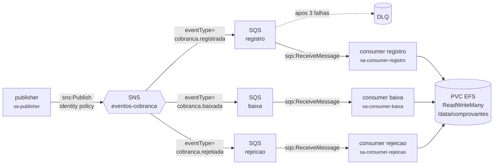
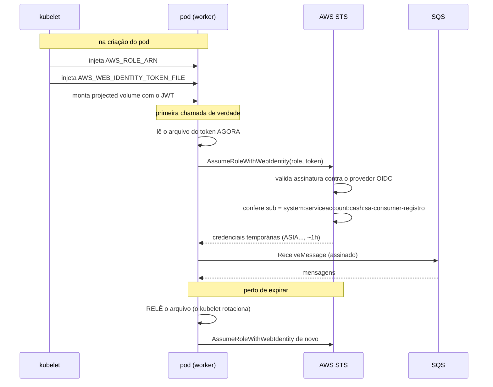
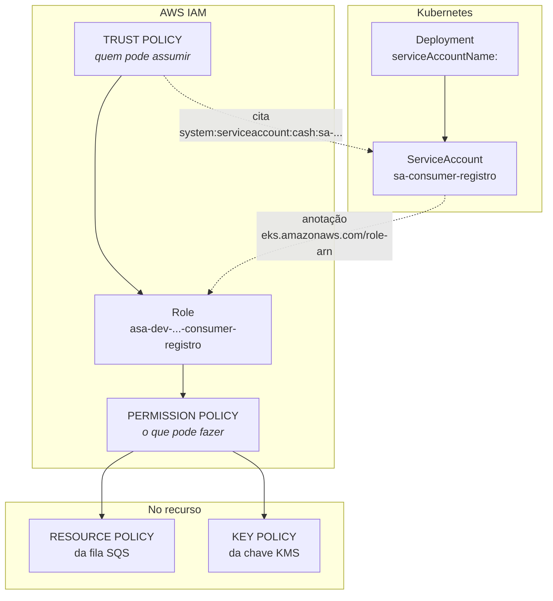
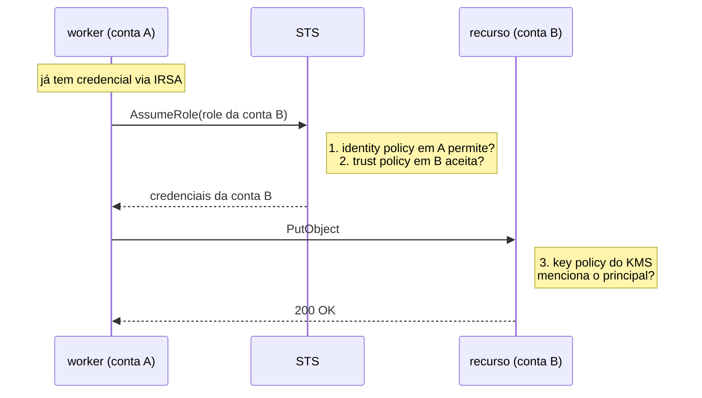
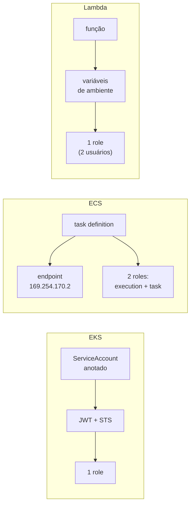
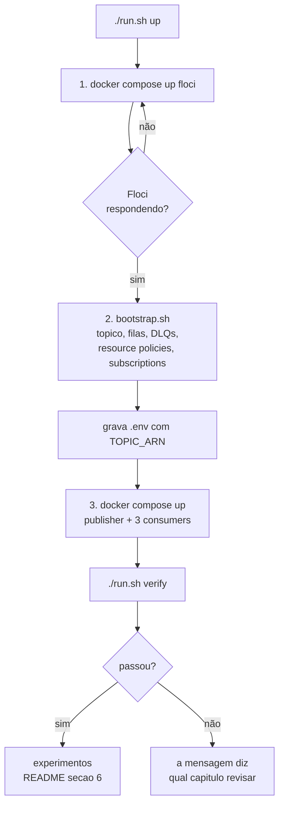

# Diagramas

Os mesmos conceitos dos outros capítulos, em forma visual. Serve como mapa: leia daqui e vá para o capítulo que explica cada pedaço.

Há também um **[visualizador interativo](assets/visualizador.html)** — abra o arquivo no navegador (`open docs/assets/visualizador.html`). Ele tem três abas:

- **Simulação** — anima uma mensagem atravessando o pipeline e deixa você **quebrar permissões** para ver onde o fluxo para. A mais instrutiva é a resource policy: o publish retorna sucesso, a subscription aparece confirmada, e a mensagem simplesmente não chega.
- **Logs reais** — carrega o NDJSON que o lab gravou (`./run.sh exportar-logs`) e desenha os traces de verdade sobre o mesmo diagrama, com o tempo que cada salto levou. Ver [guia 07](07-implementacoes-python-go-dotnet.md) §7.
- **Cross-account** — troca o palco por **duas contas lado a lado** e percorre a travessia passo a passo, nos três padrões do [guia 02](02-assume-role-cross-account.md) §2. A cada salto ele mostra o que está em trânsito, **qual identidade você é naquele instante** (a conta muda no meio do caminho no padrão 1, e nunca muda no padrão 2) e **qual documento decide** — com o JSON e a conta em que ele mora. As duas quebras mais instrutivas são silenciosas: a role recriada com o mesmo nome, que faz o principal virar um `AROA…` morto, e o ARN da sessão colado numa policy.

---

## 1. O caminho de uma mensagem

Cada seta é uma chamada de API que o IAM precisa autorizar.

Dois pontos que o diagrama esconde e valem lembrar:

- A entrega **SNS → SQS** depende da *resource policy* da fila, não da role de ninguém. É o tipo de policy que mora no recurso (guia [01](01-iam-explicado.md) §3).
- O **roteamento acontece no broker**, pela `FilterPolicy` da subscription. Nenhum dos três consumers tem código de filtro.

---

## 2. Como o pod prova quem é (IRSA)

Detalhado no guia [03](03-credenciais-no-dotnet.md) §3. O ponto que costuma passar batido: o token é **relido a cada renovação**, nunca cacheado.

---

## 3. Onde cada permissão mora

Os três (ou quatro) documentos que precisam concordar. O guia [01](01-iam-explicado.md) §3 e §4 explica os dois primeiros; o [05](05-kms.md) explica por que a key policy é diferente de todas as outras.

---

## 4. Cross-account: os dois lados

As três verificações são exatamente onde as coisas falham, e na ordem em que falham. Guia [02](02-assume-role-cross-account.md) §2.

---

## 5. As três plataformas de compute

Guia [06](06-eks-ecs-lambda.md). A diferença que mais pega: no ECS são **duas** roles, e trocá-las produz uma task saudável cujo código toma `AccessDenied`.

---

## 6. Ordem de execução do lab

A ordem importa: subir os workers antes do passo 2 não quebra nada (eles têm retry), mas gera uma enxurrada de erro no log que confunde quem está aprendendo. O `run.sh` existe para tirar essa pegadinha do caminho.
