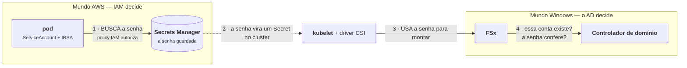
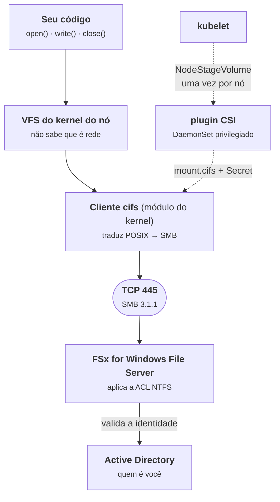
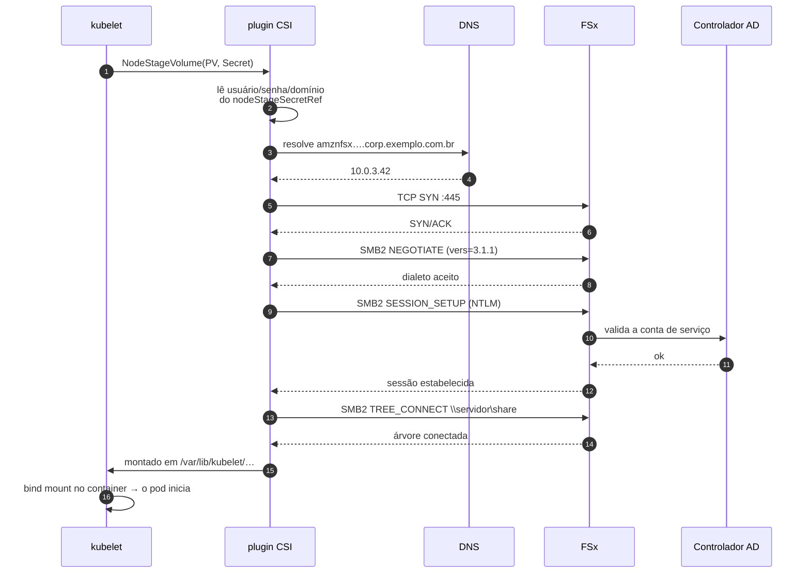
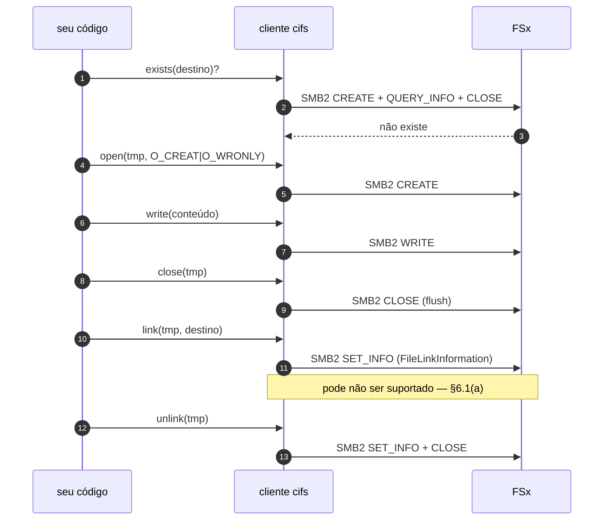

# Diretório de rede via SMB: FSx no EKS

Os capítulos anteriores tratam de um worker que grava num volume **EFS**, que é NFS por baixo. Este capítulo trata do caso que aparece em quase toda empresa que tem um pé no mundo Windows: **o diretório de rede não é NFS, é SMB** — um compartilhamento que hoje mora num file server e que a empresa está movendo para o **Amazon FSx**.

A tese em uma frase:

> **No EFS, o IAM fica de fora do acesso ao dado e quem manda é o POSIX. No FSx/SMB o IAM continua de fora — mas quem manda no lugar é o Active Directory.**

Isso tem uma consequência prática que confunde muita gente: a role IRSA do pod **não serve para montar nada**. Ela serve, no máximo, para buscar a credencial do AD no Secrets Manager. Todo o resto do controle de acesso acontece num plano que a AWS não intermedeia.

Pré-requisito: [`06-eks-ecs-lambda.md`](06-eks-ecs-lambda.md) §3 (volumes no EKS) e [`04-secrets-manager.md`](04-secrets-manager.md). O §6 deste capítulo conversa direto com o [`07-implementacoes-python-go-dotnet.md`](07-implementacoes-python-go-dotnet.md) §5.

> **Aviso, e ele importa:** diferente dos capítulos 01 a 07, **nada aqui é exercitado pelo `./run.sh verify`**. O lab não sobe um servidor SMB. Este capítulo é o que você precisa saber antes de abrir o chamado para a infra — não é código conferido rodando. O §9 detalha o que é afirmação e o que é hipótese que você tem que testar no seu ambiente.

---

## 1. Qual FSx? Essa é a primeira pergunta, e ela quase nunca é feita

"FSx" não é um produto, são quatro. E eles não falam o mesmo protocolo:

| Serviço | Protocolo | Autenticação | Driver CSI no EKS |
|---|---|---|---|
| **FSx for Windows File Server** | **SMB** | **Active Directory** (Kerberos/NTLM) | não há driver da AWS — usa-se o `smb.csi.k8s.io` da comunidade |
| FSx for Lustre | Lustre (POSIX) | POSIX + IAM no controle | `fsx.csi.aws.com` (AWS) |
| FSx for OpenZFS | NFS | POSIX | `fsx.openzfs.csi.aws.com` (AWS) |
| FSx for NetApp ONTAP | NFS **e** SMB (multiprotocolo) | POSIX e/ou AD | Trident (`csi.trident.netapp.io`, da NetApp) |

Se o requisito é literalmente "SMB", o serviço é o **FSx for Windows File Server** — e é sobre ele que este capítulo fala. Vale registrar a alternativa: o **ONTAP** expõe o *mesmo* diretório por NFS e por SMB. Se o sistema legado precisa de SMB mas o seu worker só precisa ler arquivos, o ONTAP deixa o legado no SMB e o seu pod no NFS, e aí você volta para o mundo do capítulo 06, sem AD no caminho do pod. **É a pergunta mais valiosa a fazer para a infra**, e ela costuma não ser feita porque "FSx" já veio decidido no ticket.

Repare no que a tabela diz de mais importante: **das quatro, só a linha do Windows File Server não tem driver mantido pela AWS.** Isso não é detalhe de rodapé — significa que a peça que monta o volume no seu cluster é um projeto da comunidade Kubernetes, com o ciclo de suporte que isso implica.

---

## 2. As três abordagens

Há três formas de um pod no EKS chegar num compartilhamento SMB. Elas diferem em quem faz o trabalho e em quanto do problema vaza para o seu código.

| | **A. Mount via CSI** | **B. Biblioteca SMB na aplicação** | **C. Não falar SMB** |
|---|---|---|---|
| Como funciona | `csi-driver-smb` monta o share no nó; o container vê um diretório | o processo abre uma sessão SMB e fala o protocolo | DataSync/ONTAP espelha o conteúdo para S3, EFS ou NFS |
| Muda o código? | **não** — `System.IO` / `os` / `pathlib` normais | **sim** — toda I/O passa a ser chamada de biblioteca | não (ou muda para SDK do S3) |
| Dependência no nó | módulo `cifs` no kernel + DaemonSet privilegiado | **nenhuma** | nenhuma |
| Credencial | `Secret` do k8s lido pelo kubelet | buscada em runtime pelo seu código (Secrets Manager) | não há |
| Rotação de senha | reinicia/remonta | tratável no código, como no capítulo 04 | — |
| Semântica de arquivo | POSIX emulado sobre SMB — com as armadilhas do §6 | explícita, você vê que é rede | POSIX de verdade ou objeto |
| Quando escolher | vários pods, muitos arquivos, código legado que só sabe abrir arquivo | um worker, poucos arquivos, cluster onde você não controla o nó | quando o SMB é *de onde o dado vem*, não *onde ele precisa estar* |

Duas variantes que valem uma linha cada:

- **Nós Windows no EKS.** Se o worker é .NET Framework (não .NET moderno), o node group Windows monta SMB nativamente, com a identidade da máquina no domínio. Resolve a autenticação com elegância e traz junto todo o custo operacional de manter nós Windows num cluster que provavelmente é Linux.
- **`mount.cifs` num initContainer privilegiado.** Aparece em muito blog post. Exige `privileged: true`, `CAP_SYS_ADMIN` e `mountPropagation: Bidirectional` para o mount ser visto pelos outros containers do pod — ou seja, você reimplementa mal o que o CSI driver já faz, e ainda entrega um pod privilegiado para a revisão de segurança. Não faça isso se a opção A estiver disponível.

A **abordagem B é subestimada**. Ela não precisa de driver nenhum instalado no cluster, não precisa de módulo de kernel, não precisa de pod privilegiado, e a credencial segue exatamente o caminho do capítulo 04 (Secrets Manager + IRSA), incluindo o tratamento de rotação. O preço é que o seu código passa a saber que aquilo é rede — o que, honestamente, ele já deveria saber.

---

## 3. Pré-requisitos de infra

Esta é a lista para levar para o time de plataforma. A ordem é a de "o que quebra primeiro".

### 3.1 Active Directory — o pré-requisito que não tem contorno

O FSx for Windows File Server **só existe associado a um Active Directory**. Não há modo "sem AD". As opções são o **AWS Managed Microsoft AD** (o Directory Service) ou um **AD self-managed** (os controladores de domínio da empresa, on-prem ou em EC2, alcançáveis pela VPC).

Isso significa que, antes de qualquer YAML, tem que existir: o diretório, a associação do file system a ele, e uma **conta de serviço no domínio** para o seu worker.

### 3.2 DNS — a causa nº 1 de mount que não sobe

O nome do file system é algo como `amznfsxa1b2c3d4.corp.exemplo.com.br` — repare que ele vive na **zona do domínio AD**, não numa zona pública da AWS. O CoreDNS do cluster, por padrão, encaminha o que não conhece para o resolver da VPC, que só resolve a zona do AD se o **DHCP option set** da VPC apontar para os DCs, ou se houver um **Route 53 Resolver inbound/forward rule** para aquele domínio.

Se não houver, o sintoma é um mount que falha com erro de resolução de nome e um pod parado em `ContainerCreating` — sem nada nos logs da aplicação, porque a aplicação nunca subiu.

A saída cirúrgica, quando não se quer mexer no DHCP option set da VPC inteira, é um `forward` no ConfigMap do CoreDNS só para aquele domínio:

```yaml
corp.exemplo.com.br:53 {
    errors
    cache 30
    forward . 10.0.1.10 10.0.2.10   # IPs dos controladores de domínio
}
```

### 3.3 Rede

| De → Para | Porta | Para quê |
|---|---|---|
| SG dos nós → SG do FSx | **445/TCP** | SMB. Se faltar só isso, o mount trava e estoura por timeout |
| nós → DCs | 53/UDP+TCP | resolver o nome do FSx e do domínio |
| nós → DCs | 88, 464/TCP+UDP | **só se** for Kerberos (`sec=krb5`) |

Com **NTLM**, o cliente autentica contra o *file server*, e é o FSx quem conversa com o DC — o pod não precisa alcançar o controlador de domínio diretamente. Com **Kerberos**, precisa. Essa diferença muda a lista de regras de firewall, e por isso a pergunta "NTLM ou Kerberos?" é de rede, não só de segurança.

### 3.4 Identidade e permissão no share

Esta subseção responde a uma pergunta que quase todo mundo faz ao chegar aqui: **"eu preciso de um login e senha no FSx?"** A resposta é sim — mas quase todas as palavras dessa pergunta estão erradas, e desfazer isso é o que destrava o resto do capítulo.

#### O FSx não tem usuários

Não existe "login do FSx". O FSx não guarda usuário nem senha, e não tem uma tela de cadastro. Quando alguém tenta acessar o compartilhamento, ele **pergunta para o Active Directory** quem é aquela pessoa (ou aquele programa).

O **Active Directory** é o serviço que a Microsoft usa há décadas para responder "quem é você" numa rede corporativa. Se a sua empresa tem Windows, ela quase certamente tem um AD — é o mesmo sistema que valida o login do seu notebook de trabalho. Um **domínio** é o território que um AD administra (`corp.exemplo.com.br`), e um **controlador de domínio** (DC) é o servidor que responde às perguntas de identidade daquele domínio.

A notação `CORP\svc-worker-cobranca` se lê como *"a conta `svc-worker-cobranca` no domínio `CORP`"*. A barra invertida separa domínio de conta, e é a convenção Windows para dizer isso.

Uma **conta de serviço** é uma conta de usuário comum do AD que existe para um **programa** usar, não uma pessoa. Ninguém faz login com ela, ela não tem caixa de e-mail, e o nome costuma começar com `svc-` por convenção. É o equivalente conceitual de uma role no mundo AWS: uma identidade que existe para software.

Então, traduzindo a pergunta original: você precisa que **alguém do time de AD crie uma conta de serviço no domínio** e te diga o usuário, a senha e o domínio. Não é um chamado para a AWS.

#### Os dois mundos de identidade, ao mesmo tempo

Aqui está a fonte real da confusão: enquanto o pod estiver falando com o FSx, **dois sistemas de identidade completamente separados estão rodando em paralelo**. O instinto é achar que existe só um, e aí nada faz sentido.

Você já conhece um deles — é o IAM do [`01-iam-explicado.md`](01-iam-explicado.md). O outro faz o mesmo trabalho, no mundo Windows:

| A pergunta | Mundo AWS (guia 01) | Mundo Windows (este capítulo) |
|---|---|---|
| Quem é você? | um **Principal** — a role do pod | uma **conta** no domínio |
| Quem responde isso? | o **IAM** | o **controlador de domínio** |
| Como você prova? | credencial temporária do STS | **senha** (NTLM) ou **ticket** (Kerberos) |
| O que autoriza a ação? | uma **policy** | uma **ACL** (share + NTFS) |
| Como o erro aparece? | `AccessDenied` | `permission denied` / `STATUS_ACCESS_DENIED` |

E o desenho de quem faz o quê:



Repare no que o desenho separa: a role IRSA aparece **só no passo 1**, e o que ela autoriza é *ler um segredo*. Ela não monta nada, não abre arquivo nenhum e o FSx nunca ouve falar dela.

> **A senha dessa conta vai para o Secrets Manager, e é aqui — e só aqui — que a role IRSA do pod entra na história.**

Por isso a tese do capítulo: no FSx, o IAM fica de fora do acesso ao dado. Se a escrita falhar, procurar no IAM é procurar no mundo errado.

#### NTLM ou Kerberos: as duas formas de provar quem você é

Existem dois protocolos para a conta provar que é ela mesma, e a escolha tem consequência prática.

**NTLM** é o mais simples de entender: o cliente apresenta usuário e senha, o **FSx** repassa isso ao controlador de domínio e o DC responde sim ou não. O seu nó nunca fala com o DC — quem fala é o FSx.

**Kerberos** funciona como um crachá com validade. Em vez de mandar a senha a cada conexão, o cliente vai **antes** a uma autoridade central, prova quem é uma única vez, e recebe um **ticket** com prazo. Depois apresenta o ticket. É mais seguro (a senha não circula) e é o padrão em domínios modernos — mas exige que o **seu nó** alcance o controlador de domínio, e que o relógio dele esteja certo, porque um ticket com prazo depende de as duas pontas concordarem sobre que horas são.

As consequências já estão no capítulo, e não vale repetir aqui: a diferença de portas de firewall está em §3.3, e a tolerância de 5 minutos de relógio do Kerberos está em §4.6.

**A pergunta a fazer cedo:** o domínio ainda aceita NTLM? Muita empresa desligou por endurecimento de segurança. Se estiver desligado, montar com usuário e senha simplesmente não funciona e o projeto vira Kerberos em container — bem mais trabalhoso. É a pergunta nº 6 do §7, e descobrir isso na semana 1 em vez da véspera muda o cronograma.

#### O que é uma ACL

Uma **ACL** (*Access Control List*, lista de controle de acesso) é a lista que diz, num diretório ou arquivo, quais contas podem fazer o quê. Ela fica presa **no recurso**, não na identidade — é a diferença que a tabela dos dois mundos, logo acima, registra na linha "o que autoriza a ação".

Se ajudar a encaixar: no mundo AWS, a ACL é parente da **resource policy** — aquela que mora no bucket S3 ou na fila SQS, e não na role de quem chama.

#### Dentro de uma ACL: entradas, negação, herança, grupos

Uma ACL é uma lista de entradas. Cada entrada — o nome técnico é **ACE**, *Access Control Entry* — junta uma identidade a um conjunto de operações:

```
Diretório: D:\share\cobranca\comprovantes

  CORP\svc-worker-cobranca     Permitir    Ler, Gravar, Criar arquivos
  CORP\GG-Cobranca-Leitura     Permitir    Ler
  CORP\svc-relatorios          Permitir    Ler
  CORP\estagiarios             Negar       Excluir
```

Quatro coisas que essa lista já ensina:

**A granularidade é fina.** No Windows não existe só "leitura e escrita". Dá para separar criar arquivo, anexar dados, excluir, listar o diretório, mudar as próprias permissões. É exatamente por isso que "acesso ao diretório" não serve como resposta quando você pede a permissão: você precisa saber *quais* dessas entradas a conta vai ter. Um worker que grava comprovantes precisa de **criar arquivo**, que é uma permissão distinta de **gravar** — e é comum vir só a segunda.

**`Negar` ganha de `Permitir`.** Um `Negar` explícito não é revertido por nenhum `Permitir`, nem que o `Permitir` venha de um grupo mais específico. É a mesma regra de decisão do IAM, descrita em [`01-iam-explicado.md`](01-iam-explicado.md) §1 — os dois mundos concordam neste ponto.

**Herança existe, e é o motivo nº 1 de "a permissão sumiu".** Por padrão, um subdiretório novo herda a ACL do diretório pai. Mas alguém pode ter **quebrado a herança** em algum ponto da árvore, e a partir dali as permissões passam a ser as que aquele nó tem, não as do pai. O sintoma é desconcertante: a conta funciona em `\share\cobranca` e falha em `\share\cobranca\comprovantes`, sem nenhuma diferença visível entre os dois. Quando a permissão funciona num nível e some no de baixo, é quase sempre isso.

**Grupos são a unidade real.** Na prática ninguém dá permissão a contas uma a uma: dá-se ao grupo (`CORP\GG-Cobranca-Escrita`) e coloca-se a conta no grupo. É o que permite mudar acesso sem tocar no servidor de arquivos — e é o motivo de a resposta "já adicionei sua conta no grupo" às vezes não surtir efeito na hora: **a associação a grupos entra no ticket Kerberos**, então a conta pode precisar de uma sessão nova para enxergar o grupo novo.

#### As duas ACLs do compartilhamento, e por que a efetiva é a interseção

O detalhe que pega todo mundo é que num compartilhamento Windows **existem duas ACLs empilhadas**, configuradas em telas diferentes, às vezes por pessoas diferentes:

- a do **share** — quem pode entrar pelo compartilhamento de rede;
- a do **NTFS** — quem pode fazer o quê nos arquivos e diretórios em si.

```
ACL do share  →  "quem entra por \\servidor\share"
ACL NTFS      →  "quem faz o quê nos arquivos lá dentro"
                          ↓
        permissão efetiva = a MAIS restritiva das duas
```

Uma conta de serviço no AD (`CORP\svc-worker-cobranca`), com permissão **NTFS** no diretório de destino — e vale insistir: permissão NTFS **e** permissão de share são duas ACLs distintas, e a efetiva é a interseção das duas. É comum a conta ter *Full Control* no share e *Read* no NTFS, e o resultado ser leitura.

Esse é o caso clássico do capítulo, e ele tem uma assinatura social: quem configurou o share jura que liberou acesso total — e liberou mesmo, na metade dele.

E lembre do §4.4: **nada disso é verificado no momento do mount.** A ACL só é consultada quando o seu código tenta gravar. Um mount que subiu não prova permissão nenhuma.

#### ACL e POSIX: por que o guia 09 não tem esse problema

Vale o contraste, porque o repositório tem os dois mundos.

No EFS ([`09-efs.md`](09-efs.md)) a permissão é **POSIX** — se o termo for novo, ele está definido no [`06-eks-ecs-lambda.md`](06-eks-ecs-lambda.md) §3. É um esquema bem mais antigo e simples que a ACL: três casas apenas — dono, grupo, e todo o resto — com três bits cada.

```
-rw-rw-r--    dono: pode ler e gravar
              grupo: pode ler e gravar
              o resto: só ler
```

São três casas e ponto. Não dá para dizer "esta conta específica também pode gravar" sem mexer no dono ou no grupo — e é justamente essa limitação que a ACL resolve, oferecendo uma lista de tamanho arbitrário, com quantas identidades você quiser.

A troca é a de sempre: mais expressivo, mais fácil de configurar errado. O `fsGroup` do EFS tem um modo de falha só (o gid não bate); a ACL tem os quatro desta subseção.

> Existem ACLs POSIX (`setfacl`/`getfacl`) e o NFSv4 tem as suas. Mas o lab e o guia 09 usam só os bits tradicionais — então, **quando este repositório diz "ACL" sem qualificar, é a do Windows**.

#### O que pedir, concretamente

Para o time que administra o AD:

1. Uma **conta de serviço** para este worker, com usuário, senha e domínio.
2. **Senha que não expira** — ou, se a política não permitir, o procedimento de rotação combinado e quem reinicia os pods na janela. O motivo está no §5.1: o mount autentica uma vez e não reautentica sozinho.
3. As **ACLs NTFS** explícitas no diretório: ler, escrever, criar arquivo, excluir. *"Acesso ao diretório" não é resposta* — peça a lista.
4. Confirmação de que o domínio **aceita NTLM**, ou o caminho para Kerberos.

As perguntas 4 a 7 do §7 são exatamente estas, no formato de levar para a reunião.

### 3.5 O nó (abordagem A)

Duas coisas que ninguém confere antes:

- **Módulo `cifs` no kernel do nó.** As AMIs Amazon Linux para EKS trazem; o **Bottlerocket** historicamente não permite carregar módulos arbitrários e pode simplesmente não ter `cifs.ko`. **Confirme qual AMI o node group usa** antes de prometer prazo.
- **Pod Security Admission.** O DaemonSet do driver roda privilegiado, com propagação de mount para o host. Se o namespace onde ele será instalado tem `pod-security.kubernetes.io/enforce: restricted`, a instalação falha.

---

## 4. A comunicação entre as camadas, no tempo

As três seções anteriores descrevem as peças **paradas**: o que é o FSx, quais abordagens existem, o que precisa estar provisionado. Esta seção descreve as mesmas peças **em movimento** — quem fala com quem, em que ordem, e quanto tempo cada conversa leva.

A ideia que organiza a seção inteira:

> **Existem dois momentos completamente diferentes, e quase toda confusão vem de tratá-los como um só.** O *mount* acontece uma vez por nó e resolve autenticação. O *runtime* acontece a cada arquivo e resolve autorização. Falham por motivos diferentes, em tempos diferentes, e se configuram em lugares diferentes.

### 4.1 As camadas



Duas linhas separadas de propósito. A **linha cheia** é o caminho de cada `write()` do seu código, e ela existe enquanto o pod viver. A **linha pontilhada** é o caminho do mount, e ela roda **uma vez por nó** — não uma vez por pod. Dez pods do mesmo Deployment no mesmo nó compartilham **uma** sessão SMB.

Isso tem uma consequência que surpreende: se a sessão SMB de um nó cair, os dez pods daquele nó são afetados juntos, e nenhum deles registra nada de útil — porque, do ponto de vista deles, um `write()` simplesmente demorou.

### 4.2 Momento 1 — o mount, passo a passo



Repare nos passos 9 a 11: com **NTLM**, quem fala com o controlador de domínio é o **FSx**, não o seu nó. Com **Kerberos**, o nó precisa ter obtido um ticket antes, e aí a seta sai do plugin CSI direto para o KDC — é a diferença de firewall que o §3.3 registra, agora visível na ordem dos eventos.

### 4.3 Onde cada passo falha — e em quanto tempo

Esta é a tabela que mais economiza tempo de diagnóstico. A coluna que importa é a última:

| Passo | O que você configurou para ele funcionar | Se estiver errado | **Falha rápido ou pendura?** |
|---|---|---|---|
| Ler o `Secret` | `nodeStageSecretRef` + ExternalSecret (§5.1) | evento no pod, claro | **rápido** — segundos |
| Resolver o DNS | CoreDNS `forward` ou DHCP option set (§3.2) | `failed to resolve` | **rápido** — segundos |
| TCP 445 | SG dos nós → SG do FSx (§3.3) | **nada** — o SYN é descartado em silêncio | **PENDURA** — minutos |
| NEGOTIATE | `vers=3.1.1` no `mountOptions` | `Protocol not supported` | **rápido** |
| SESSION_SETUP | conta de serviço + senha + NTLM habilitado (§3.4) | `mount error(13)` | **rápido** |
| TREE_CONNECT | `source` correto no PV | `mount error(2)` | **rápido** |
| `subDir` | o subdiretório existir | `mount error(2)` | **rápido** |
| **ACL NTFS** | permissão NTFS da conta (§3.4) | **nada acontece aqui** | **não falha no mount** |

**A linha do TCP 445 é a que mais custa.** Um security group que não libera a porta **descarta** o pacote em vez de recusá-lo. O cliente não recebe "conexão negada" — não recebe nada, e fica retransmitindo o SYN. O resultado é um pod em `ContainerCreating` por vários minutos, sem mensagem de erro, até estourar o timeout do TCP; aí o kubelet tenta de novo, e o ciclo recomeça.

É por isso que "o pod está pendurado" e "o pod deu erro" apontam para lugares diferentes:

```
falhou em segundos, com mensagem   →  DNS, credencial, share, versão do protocolo
pendurou por minutos, sem mensagem →  rede: a 445 não chega no FSx
montou, mas a escrita falha        →  ACL NTFS (§5.4)
```

### 4.4 A confusão nº 1: autenticação é no mount, autorização é por operação

Vale isolar porque é a origem de metade dos chamados mal encaminhados:

> **O mount ter subido prova que a conta de serviço existe e que a senha está certa. Não prova absolutamente nada sobre a permissão de escrever.**

A autenticação (*quem é você*) acontece **uma vez**, no `SESSION_SETUP`. A autorização (*você pode fazer isso neste arquivo*) acontece **em cada operação**, no servidor, contra a ACL NTFS.

Por isso o modo de falha mais frustrante do capítulo é aquele em que tudo parece certo: o pod sobe, o `ls` funciona, o `df` mostra o volume — e a primeira escrita toma *permission denied*. Nada quebrou no mount porque a ACL nunca foi consultada no mount.

O corolário prático: **teste escrita, não montagem.** Um `kubectl exec … touch /data/.teste` diz mais sobre a configuração do que qualquer quantidade de `describe pod`.

### 4.5 Momento 2 — o runtime, a cada comprovante

Agora o pod está de pé e uma mensagem chegou. Isto é o que o `GravarAtomico` do [capítulo 07](07-implementacoes-python-go-dotnet.md) §5 provoca no fio:



Um comprovante tem cerca de **1 KB**. A parte cara não é ele.

| Chamada no seu código | O que vai no fio | Custo real |
|---|---|---|
| `Path.exists()` / `File.Exists` | CREATE + QUERY_INFO + CLOSE | pelo menos uma ida e volta |
| `open(..., O_CREAT)` | CREATE | uma ida e volta |
| `write(1 KB)` | WRITE | uma ida e volta (o conteúdo cabe folgado) |
| `close()` | CLOSE, com flush | uma ida e volta |
| `os.link()` | SET_INFO `FileLinkInformation` | uma ida e volta — **se existir** |
| `unlink()` | SET_INFO + CLOSE | uma ida e volta |

> **A regra para levar embora: o que custa não é o tamanho do arquivo, é o número de idas e voltas.** Gravar 1 KB e gravar 1 MB custam quase o mesmo neste desenho, porque o tempo está nas seis viagens, não nos bytes.

E é por isso que o mesmo código muda de perfil ao mudar de camada de armazenamento:

| | `File.Exists` custa | Ordem de grandeza |
|---|---|---|
| Disco local | uma syscall, quase sempre em cache | ~microssegundos |
| EFS (NFS) | uma ida ao servidor | ~centenas de microssegundos a milissegundos |
| FSx/SMB na mesma VPC | uma ida ao servidor | ~milissegundos |
| SMB atravessando Direct Connect | uma ida ao servidor, com a latência do link | **dezenas de milissegundos** |

Multiplique a última linha por seis viagens por mensagem e o consumer que processava 300 mensagens por minuto passa a processar 20. Nenhuma linha de código mudou.

*Ressalva honesta:* o cliente `cifs` **compõe** operações do SMB2 numa só ida quando pode (*compounding*), e mantém cache de metadados. Então a contagem acima é o teto, não a medição — o número real depende da versão do kernel e das opções de mount. As ordens de grandeza da segunda tabela são para calibrar expectativa, não para citar em capacity planning. Meça o seu caso.

### 4.6 Os relógios: onde o tempo é literalmente um parâmetro

Cinco lugares deste capítulo em que a configuração **é** um tempo:

| Relógio | Valor típico | O que acontece quando estoura |
|---|---|---|
| **Desvio de relógio no Kerberos** | **5 minutos** | se o nó e o DC divergirem mais que isso, a autenticação falha — e a mensagem de erro fala de credencial, não de hora. Só vale para `sec=krb5`; com NTLM não há essa restrição |
| **Expiração da senha da conta de serviço** | 90 dias | o mount **não** reautentica sozinho; funciona até alguém remontar. É o "funcionou 90 dias e parou" da tabela de sintomas (§8), explicado em §5.1 |
| **Sessão SMB após um pod morrer** | dezenas de segundos | os locks que ele segurava só saem quando o **servidor** expira a sessão — daí o erro intermitente na subida do pod novo (§6.1b) |
| **`terminationGracePeriodSeconds`** | 30 s (padrão) | curto demais transforma o item acima num problema recorrente: o pod novo sobe antes de o antigo ter soltado o que segurava |
| **`echo_interval` do cliente cifs** | ~60 s | de quanto em quanto tempo o cliente confere se o servidor ainda responde. É o que determina em quanto tempo uma queda de rede vira erro visível |

E a opção de mount que decide o comportamento no tempo quando o servidor some:

| Opção | Comportamento se o FSx não responde |
|---|---|
| `hard` | a chamada **espera indefinidamente** até o servidor voltar. Nenhum dado se perde; o seu pod trava |
| `soft` | a chamada **falha** com erro de I/O depois de um tempo. O pod continua vivo, e o seu código precisa tratar o erro |

Nenhuma das duas é certa sempre. Para um consumer de fila como o do lab, `soft` costuma ser melhor: a mensagem não é deletada, volta pelo *visibility timeout* e outra réplica tenta — que é exatamente o mecanismo de recuperação que o lab já tem. Com `hard`, o pod fica preso segurando a mensagem e você descobre pelo alarme de fila crescendo.

**Confirme qual é o padrão na versão do seu cliente `cifs`** antes de assumir — está no `man mount.cifs`, e é o tipo de padrão que muda entre versões de kernel. Se `soft` for a decisão, escreva a opção explicitamente no `mountOptions` do PV em vez de confiar no default.

### 4.7 Resumo: a camada, o que configurar, e como ela falha

| Camada | O que você configura | Onde isso mora | Como ela falha |
|---|---|---|---|
| Seu código | nada de SMB | — | vê `PermissionError`/`IOException` genérico |
| Cliente `cifs` | `vers`, `uid`/`gid`, `file_mode`, `hard`/`soft` | `mountOptions` do PV | erro de I/O, ou trava |
| Plugin CSI | driver instalado, `Secret` | DaemonSet + `nodeStageSecretRef` | pod preso em `ContainerCreating` |
| Rede | 445/TCP, 53, (88/464 no Kerberos) | security groups | **pendura sem mensagem** |
| DNS | `forward` no CoreDNS ou DHCP option set | ConfigMap do CoreDNS | `failed to resolve`, rápido |
| Identidade | conta de serviço, senha, NTLM vs Kerberos | AD + Secrets Manager | `mount error(13)`, rápido |
| Autorização | **ACL NTFS** | no servidor FSx | **só aparece na primeira escrita** |

Se você só guardar uma linha desta seção, guarde a última: a autorização é a única que não dá sinal nenhum até o seu código tentar gravar.

---

## 5. Implementação da abordagem A: o mount via CSI

Quatro objetos. O primeiro é o único que tem a ver com AWS.

### 5.1 A credencial do AD

O jeito ruim é um `Secret` escrito à mão e commitado. O jeito coerente com o capítulo 04 é a senha viver no **Secrets Manager** e chegar ao cluster pelo **External Secrets Operator**:

```yaml
apiVersion: external-secrets.io/v1beta1
kind: ExternalSecret
metadata:
  name: fsx-smb-creds
  namespace: cash
spec:
  refreshInterval: 1h
  secretStoreRef:
    name: aws-secrets-manager      # o SecretStore usa IRSA — é AQUI que o IAM entra
    kind: SecretStore
  target:
    name: fsx-smb-creds            # o Secret que o PV vai referenciar
  data:
    - secretKey: username
      remoteRef: { key: prod/fsx/worker-cobranca, property: username }
    - secretKey: password
      remoteRef: { key: prod/fsx/worker-cobranca, property: password }
    - secretKey: domain
      remoteRef: { key: prod/fsx/worker-cobranca, property: domain }
```

As três chaves — `username`, `password`, `domain` — são os nomes que o driver espera. `domain` é opcional no driver, obrigatório na prática com AD.

> **Ressalva sobre rotação:** o `Secret` atualiza sozinho, mas o **mount não**. Um mount SMB autentica na hora de montar; trocar a senha no Secrets Manager não derruba nem reautentica o mount existente. Se a política de senha da conta de serviço for de 90 dias, alguém precisa remontar (reiniciar os pods) na janela entre a troca e a expiração. Isso é o oposto do que o capítulo 04 ensina para chamada de API — lá, o SDK simplesmente pega a versão nova na próxima chamada. **Peça à infra uma conta de serviço com senha que não expira, ou combine o procedimento de rotação.**

### 5.2 O driver

```bash
helm repo add csi-driver-smb https://raw.githubusercontent.com/kubernetes-csi/csi-driver-smb/master/charts
helm install csi-driver-smb csi-driver-smb/csi-driver-smb --namespace kube-system

kubectl get csidriver smb.csi.k8s.io
kubectl -n kube-system get pods -l app=csi-smb-node -o wide   # um por nó
```

### 5.3 PV e PVC

Diferente do EFS do lab, aqui o provisionamento é **estático**: o compartilhamento já existe, você não quer que o Kubernetes crie nada. Por isso o PV é escrito à mão e o PVC aponta para ele pelo nome.

```yaml
apiVersion: v1
kind: PersistentVolume
metadata:
  name: pv-fsx-comprovantes
spec:
  capacity:
    storage: 100Gi              # ignorado no SMB — existe porque o campo é obrigatório
  accessModes: ["ReadWriteMany"]
  persistentVolumeReclaimPolicy: Retain   # NUNCA Delete num share que não é seu
  storageClassName: ""
  mountOptions:
    - dir_mode=0770
    - file_mode=0660
    - uid=1000
    - gid=1000
    - noserverino
    - mfsymlinks
    - vers=3.1.1
  csi:
    driver: smb.csi.k8s.io
    volumeHandle: fsx-comprovantes-cobranca   # único no cluster; não é o nome do share
    volumeAttributes:
      source: "//amznfsxa1b2c3d4.corp.exemplo.com.br/share"
      subDir: "cobranca/comprovantes"         # opcional
    nodeStageSecretRef:
      name: fsx-smb-creds
      namespace: cash
---
apiVersion: v1
kind: PersistentVolumeClaim
metadata:
  name: comprovantes-cobranca      # MESMO nome do PVC EFS do lab
  namespace: cash
spec:
  accessModes: ["ReadWriteMany"]
  storageClassName: ""
  volumeName: pv-fsx-comprovantes
  resources:
    requests: { storage: 100Gi }
```

O que cada `mountOption` está realmente decidindo:

| Opção | O que faz | Por que importa |
|---|---|---|
| `uid` / `gid` | de quem os arquivos **parecem** ser dentro do container | o SMB não transporta uid/gid; o cliente inventa esses valores localmente |
| `dir_mode` / `file_mode` | as permissões que o container **enxerga** | também inventadas — não são a permissão de verdade |
| `noserverino` | não confia nos números de inode que o servidor manda | recomendado pelo projeto do driver; mexe em como o cliente identifica arquivos |
| `mfsymlinks` | emula symlink com arquivo especial | sem isso, `ln -s` falha |
| `vers` | versão do protocolo | fixe. Deixar negociar esconde surpresa quando o servidor muda |

**A linha mais importante da tabela é a das permissões: elas são ficção do cliente.** `file_mode=0660` não concede nada — descreve o que o `ls -l` vai mostrar. Quem decide se a escrita passa é a **ACL NTFS da conta de serviço** no servidor. Um container que enxerga `rw-rw----` e mesmo assim toma *permission denied* na escrita não está com bug: está com a ACL errada do outro lado.

### 5.4 O Deployment

Nenhuma mudança em relação ao lab. Uma, na verdade — uma remoção:

```yaml
spec:
  template:
    spec:
      serviceAccountName: sa-consumer-registro   # IRSA: continua, e continua sendo só para SQS/S3
      # securityContext:
      #   fsGroup: 1000          ← NÃO faz o trabalho aqui. Ver abaixo.
      containers:
        - name: consumer
          env:
            - name: DATA_PATH
              value: /data
          volumeMounts:
            - name: comprovantes
              mountPath: /data
      volumes:
        - name: comprovantes
          persistentVolumeClaim:
            claimName: comprovantes-cobranca
```

**O `fsGroup` não resolve permissão num volume SMB.** No EFS, ele é a resposta certa para o *permission denied* mais comum do lab ([`README.md`](README.md) §4). Aqui, não: o kubelet só ajusta ownership quando a `fsGroupPolicy` do CSIDriver permite, e para um volume `ReadWriteMany` sem `fsType` isso não acontece. Quem faz esse papel são as opções `uid`/`gid`/`file_mode`/`dir_mode` do PV — e, do outro lado do fio, a ACL NTFS.

**Guarde esse par**: no EFS, *permission denied* → olhe `fsGroup` e o Access Point. No SMB, *permission denied* → olhe a ACL NTFS da conta de serviço. Procurar no lugar errado custa uma tarde.

---

## 6. O que muda no código, em Python, Go e .NET

### 6.1 Com o volume montado (abordagem A): quase nada — e o "quase" é caro

A promessa do CSI se cumpre: `/data` continua sendo um diretório, `Directory.GetFiles`, `os.listdir` e `os.ReadDir` continuam funcionando, e o `ComprovanteWriter` do lab não sabe que mudou de protocolo. Quatro comportamentos, porém, mudam — e três deles são novos em relação à lista do capítulo 07.

#### (a) `link(2)`: a idempotência do lab está apoiada numa chamada que pode não existir

Este é o ponto mais importante do capítulo para quem for portar o código do lab.

O capítulo 07 §5 conclui que a escrita atômica correta é *escrever num temporário e publicar o nome com `link(2)`*, porque `rename` sobrescreve em silêncio. As três linguagens seguem isso — inclusive o .NET, cujo `File.Move(..., overwrite: false)` no Linux é implementado sobre a mesma primitiva.

Sobre SMB, `link(2)` **não é garantido**. O NTFS tem hard links e o cliente `cifs` do Linux implementa a operação para SMB2+, mas o resultado depende da versão do protocolo negociada, das opções de mount (`noserverino` mexe justamente na identificação de arquivos) e da configuração do servidor. **Não chute em nenhuma direção — sonde.**

O lab já tem o lugar certo para isso: o `VerificarVolume` que grava e apaga um arquivo-sonda na subida do worker. Estenda a sonda para tentar o `link`:

```python
# python — na subida, antes de consumir a primeira mensagem
def verificar_volume(data_path: str) -> bool:
    """Devolve True se link(2) funciona neste volume. Falha rápido se não puder escrever."""
    base = Path(data_path) / ".sonda"
    base.mkdir(parents=True, exist_ok=True)
    origem, alvo = base / f"sonda-{os.getpid()}", base / f"sonda-{os.getpid()}.link"
    origem.write_text("sonda")                    # se estourar aqui: ACL NTFS, não é o seu código
    try:
        os.link(origem, alvo)
        return True
    except OSError as e:
        # EPERM/EOPNOTSUPP/EINVAL: o filesystem nao oferece hard link
        log.warning("link(2) indisponivel (%s) — usando criacao exclusiva", e.errno)
        return False
    finally:
        for p in (alvo, origem):
            p.unlink(missing_ok=True)
```

E o plano B, quando a sonda diz que não dá. A primitiva que funciona nos dois mundos é a **criação exclusiva** (`O_CREAT|O_EXCL`), que no SMB vira um `CREATE` com disposição `FILE_CREATE` — e falha com colisão se o nome já existe, que é exatamente a semântica que a idempotência precisa:

| | Reserva atômica do nome | Falha se já existe |
|---|---|---|
| **Python** | `os.open(dst, os.O_CREAT \| os.O_EXCL \| os.O_WRONLY, 0o644)` | `FileExistsError` ✅ |
| **Go** | `os.OpenFile(dst, os.O_CREATE\|os.O_EXCL\|os.O_WRONLY, 0o644)` | `errors.Is(err, fs.ErrExist)` ✅ |
| **.NET** | `new FileStream(dst, FileMode.CreateNew, FileAccess.Write)` | `IOException` ✅ |

O desenho fica: **reserva o nome definitivo com `O_EXCL`** (quem perder a corrida trata como duplicata, igual hoje), **escreve o conteúdo nesse handle, dá flush e fecha**. Perde-se uma garantia em relação ao `tmp`+`link`: um processo morto no meio deixa o arquivo definitivo truncado. Se isso importa no seu caso, escreva no `.tmp`, e use a reserva `O_EXCL` só como trava, movendo o `.tmp` por cima no fim.

> Por que o capítulo 07 não usou `O_EXCL` desde o começo: o folclore de "não confie em `O_EXCL`, use `link`" vem do **NFSv3**, onde a criação exclusiva realmente não era confiável. O EFS é NFSv4.1, onde ela é. A regra velha sobreviveu ao motivo dela.

#### (b) Lock de arquivo: o problema inverte de sinal

O capítulo 07 avisa que o lock sobre NFS é **advisory** e frouxo, e que a saída é não depender dele. No SMB o problema é o oposto: o lock é **mandatório**, via *share modes* negociados na abertura do arquivo. Um `FileStream` com `FileShare.None` num arquivo que outro processo mantém aberto não fica "meio funcionando" — falha de imediato, com *sharing violation*.

Isso é, na maior parte das vezes, uma boa notícia: o erro é determinístico. Mas cria uma classe de falha que não existia. O caso clássico é um processo Windows do outro lado (o sistema legado que deposita os arquivos) segurando o arquivo aberto enquanto escreve: o seu worker Linux tenta abrir para leitura e toma o erro. Ler com `FileShare.ReadWrite` explícito (.NET) ou simplesmente abrir em modo leitura sem exclusividade (Python/Go) evita boa parte disso.

E o corolário desagradável: quando um pod é morto com SIGKILL, os locks que ele segurava só são liberados quando o **servidor** expira a sessão SMB — pode levar dezenas de segundos. Um `terminationGracePeriodSeconds` curto demais transforma isso num erro intermitente na subida do pod novo.

#### (c) O filesystem é *case-insensitive*

NTFS preserva maiúsculas mas não distingue. `COBR-001.txt` e `cobr-001.txt` são o mesmo arquivo. O sanitizador do lab (`[^A-Za-z0-9_-]` → `_`) protege o conjunto de caracteres, mas não isso: **se `nossoNumero` puder diferir só na caixa, dois eventos distintos passam a colidir** e um vira "duplicata" do outro. Normalizar a caixa antes de compor o nome (ou incluir mais bytes do hash) resolve.

O hash em maiúsculas do lab não é afetado — hexadecimal em caixa fixa não colide consigo mesmo.

#### (d) Nomes que o Linux aceita e o Windows recusa

`: * ? " < > | \` são proibidos; nomes terminados em `.` ou espaço são normalizados; e há nomes reservados (`CON`, `PRN`, `AUX`, `NUL`, `COM1`…`LPT9`) que falham mesmo com extensão. O lab já está protegido pelo sanitizador, mas qualquer caminho onde você concatene um dado externo direto no nome do arquivo precisa da mesma checagem — e o erro vai aparecer como `IOException`/`OSError` genérico, sem dizer "esse nome é reservado no Windows".

#### (e) Custo de I/O

Vale o mesmo do capítulo 07 e um pouco pior: cada `File.Exists` é uma ida à rede. O SMB é mais "conversador" que o NFS em metadados, e em compensação o SMB3 tem *leases* de diretório que às vezes deixam a listagem mais barata. O conselho prático não muda: **particione por data** e não liste diretório dentro de laço.

### 6.2 Sem mount (abordagem B): falando SMB direto da aplicação

Aqui a credencial vem do Secrets Manager pela role do pod — é o capítulo 04 aplicado, incluindo o cache e o tratamento de rotação. O código passa a ser explicitamente de rede, o que remove todas as ambiguidades do §6.1: você sabe o que é uma chamada remota porque ela está escrita ali.

**Python — `smbprotocol`** (o pacote traz o módulo `smbclient`, que espelha a API de `os` e `open`):

```python
import smbclient

smbclient.register_session(
    "amznfsxa1b2c3d4.corp.exemplo.com.br",
    username="CORP\\svc-worker-cobranca",
    password=senha_do_secrets_manager,     # capítulo 04
)

base = r"\\amznfsxa1b2c3d4.corp.exemplo.com.br\share\cobranca\comprovantes"

for nome in smbclient.listdir(base):
    ...

# 'x' = criação exclusiva: falha se já existir. É o O_EXCL do §6.1(a).
try:
    with smbclient.open_file(rf"{base}\{nome_arquivo}", mode="x", encoding="utf-8") as f:
        f.write(conteudo)
except FileExistsError:
    pass    # outra réplica chegou antes; o comprovante existe
```

**Go — `github.com/cloudsoda/go-smb2`** (fork mantido do `hirochachacha/go-smb2`):

```go
d := &smb2.Dialer{Initiator: &smb2.NTLMInitiator{
    User:     "svc-worker-cobranca",
    Password: senha,       // capítulo 04
    Domain:   "CORP",
}}
s, err := d.Dial(ctx, "amznfsxa1b2c3d4.corp.exemplo.com.br:445")
if err != nil { return err }
defer s.Logoff()

share, err := s.Mount("share")   // "Mount" é do processo, não do sistema operacional
if err != nil { return err }
defer share.Umount()

f, err := share.OpenFile(caminho, os.O_CREATE|os.O_EXCL|os.O_WRONLY, 0o644)
if errors.Is(err, fs.ErrExist) {
    return nil     // duplicata
}
```

Repare que `share` implementa as mesmas operações do pacote `os` (`ReadDir`, `Stat`, `Create`, `Rename`) — o que torna possível esconder as duas abordagens atrás de uma interface própria e escolher no `main`.

**.NET — `SMBLibrary`** (a opção realista em Linux; não há cliente SMB na BCL):

```csharp
var client = new SMB2Client();
client.Connect(servidor, SMBTransportType.DirectTCPTransport);

var status = client.Login("CORP", "svc-worker-cobranca", senha);   // capítulo 04
if (status != NTStatus.STATUS_SUCCESS) throw new IOException($"login SMB falhou: {status}");

var store = client.TreeConnect("share", out status);
status = store.CreateFile(
    out object handle, out FileStatus fileStatus, caminho,
    AccessMask.GENERIC_WRITE | AccessMask.SYNCHRONIZE,
    FileAttributes.Normal, ShareAccess.None,
    CreateDisposition.FILE_CREATE,        // ← falha se já existe: é o O_EXCL
    CreateOptions.FILE_NON_DIRECTORY_FILE | CreateOptions.FILE_SYNCHRONOUS_IO_NONALERT,
    null);

if (status == NTStatus.STATUS_OBJECT_NAME_COLLISION) return false;  // duplicata
```

A API é crua — `NTStatus` em vez de exceção, o `CreateDisposition` do protocolo exposto sem tradução. É o preço de estar um nível abaixo. Em compensação, `FILE_CREATE` aparecendo literalmente no código é mais honesto sobre o que garante do que um `File.Move(..., overwrite: false)` cuja atomicidade depende da implementação da plataforma.

**A diferença que atravessa as três:** com a biblioteca, `FILE_CREATE`/`O_EXCL`/`mode="x"` é uma chamada de protocolo que o servidor executa atomicamente. Com o mount, é uma tradução feita pelo cliente `cifs` no kernel do nó, e você depende de que essa tradução tenha sido feita como você imagina. **Se a idempotência é requisito duro, a abordagem B é mais fácil de defender numa revisão.**

---

## 7. As perguntas para levar ao time de infra

Na ordem em que costumam destravar (ou travar) o projeto:

**Sobre o serviço**
1. É **FSx for Windows File Server** mesmo, ou pode ser **ONTAP**? Se for ONTAP com volume multiprotocolo, monto por NFS e o AD sai do meu caminho.
2. O compartilhamento já existe ou vai ser criado? Qual o caminho UNC completo (`\\servidor\share\subdiretório`)?
3. É Single-AZ ou Multi-AZ? (Muda o nome DNS e o comportamento em failover.)

**Sobre identidade**
4. Qual AD: **Managed Microsoft AD** ou **self-managed**?
5. Vocês conseguem criar uma **conta de serviço** para este worker? Com senha que **não expira**, ou qual é o procedimento de rotação — e quem reinicia os pods na janela?
6. O domínio ainda **aceita NTLM**, ou está bloqueado por hardening? *(Se estiver bloqueado, o mount com usuário/senha não funciona e a conversa passa a ser sobre Kerberos em container — keytab, `cifs.upcall`, `sec=krb5` — o que é bem mais trabalhoso. Descubra isso na semana 1, não na véspera.)*
7. Quais **ACLs NTFS** a conta terá no diretório: leitura, escrita, criação de arquivo, exclusão? *(Peça explícito. "Acesso ao diretório" não é resposta.)*

**Sobre rede**
8. Os nós do EKS conseguem **resolver** o nome DNS do FSx? Como — DHCP option set da VPC apontando para os DCs, Route 53 Resolver, ou preciso de um `forward` no CoreDNS?
9. A **445/TCP** está liberada do SG dos nós para o SG do FSx?

**Sobre o cluster**
10. Qual **AMI** os node groups usam? Amazon Linux ou **Bottlerocket**? *(Bottlerocket pode não ter `cifs.ko`, e aí a abordagem A morre antes de começar.)*
11. Posso instalar um **DaemonSet privilegiado** (`csi-driver-smb`) no cluster? Qual namespace, e ele tem PSA `restricted`?
12. Quem passa a ser dono da operação desse driver da comunidade — plataforma ou meu time?

**A pergunta que economiza o projeto inteiro**
13. O SMB é **onde o dado precisa estar**, ou **de onde ele vem**? Se for a segunda, **DataSync** copiando FSx → S3 (ou → EFS) resolve sem AD, sem driver, sem pod privilegiado — e o worker volta a ser o do capítulo 06.

---

## 8. Tabela de sintomas

| Sintoma | Onde | Causa provável |
|---|---|---|
| Pod preso em `ContainerCreating`, evento `failed to resolve` | mount | DNS: o cluster não resolve a zona do AD (§3.2) |
| `mount error(115): Operation now in progress` ou timeout longo | mount | 445/TCP fechada entre nó e FSx (§3.3) |
| `mount error(13): Permission denied` | mount | usuário/senha/domínio errados no `Secret`, ou NTLM bloqueado no domínio |
| `mount error(2)` / `No such file or directory` | mount | `source` ou `subDir` errado — o share existe, o subdiretório não |
| `cannot mount ... unknown filesystem type 'cifs'` | mount | módulo `cifs` ausente no nó (Bottlerocket?) (§3.5) |
| Pod do DaemonSet do driver não sobe | driver | PSA `restricted` no namespace; o driver precisa ser privilegiado |
| Monta, `ls` funciona, escrita dá *permission denied* | app | **ACL NTFS** da conta de serviço — não é `fsGroup`, não é IAM (§5.4) |
| Funciona no diretório pai e falha no subdiretório | app | herança de ACL quebrada em algum ponto da árvore (§3.4) |
| Grava, mas não consegue criar arquivo novo | app | *criar arquivo* é uma permissão NTFS distinta de *gravar* (§3.4) |
| Adicionaram a conta ao grupo e não resolveu | app | associação a grupo entra no ticket Kerberos; precisa de sessão nova (§3.4) |
| Funcionou 90 dias e parou de montar | mount | senha da conta de serviço expirou; mount não reautentica sozinho (§5.1) |
| `link(2)` falha com `EPERM`/`EOPNOTSUPP` | app | hard link indisponível neste mount — troque para criação exclusiva (§6.1a) |
| Idempotência deixa passar duplicata depois da migração | app | o `link` virou `rename` (ou foi trocado por escrita direta) na portabilidade — cap. 07 §5 |
| *Sharing violation* / `IOException` ao abrir arquivo existente | app | share mode mandatório: outro processo mantém o arquivo aberto (§6.1b) |
| Erro intermitente de lock logo após reinício de pod | app | sessão SMB do pod anterior ainda não expirou no servidor (§6.1b) |
| Dois eventos diferentes viram "duplicata" | app | colisão por *case-insensitivity* no `nossoNumero` (§6.1c) |
| `AccessDenied` do IAM ao buscar a senha | Secrets Manager | é o único IAM da história: role IRSA do ESO/pod — cap. 04 |
| `PVC` `Pending` para sempre | k8s | `storageClassName: ""` ausente, ou `volumeName` não bate com o PV |
| Todos os pods de um mesmo nó ficam lentos juntos | mount | a sessão SMB é **por nó**, não por pod — um problema de rede afeta o nó inteiro (§4.1) |
| Pod trava e para de consumir a fila quando o FSx oscila | mount | mount `hard`: a chamada espera indefinidamente. Considere `soft` (§4.6) |
| Autenticação falha citando credencial, mas a senha está certa | mount | só com Kerberos: relógio do nó fora dos 5 min de tolerância do DC (§4.6) |

---

## 9. O que este capítulo afirma e o que ele deixa para você medir

Coerente com a seção *"O que foi verificado e o que não foi"* do [README](README.md), aqui está a mesma prestação de contas:

| Item | Status |
|---|---|
| Chaves do `Secret` (`username`/`password`/`domain`) e forma do PV | conferido na documentação do `csi-driver-smb` |
| FSx for Windows exigir AD; ausência de CSI driver da AWS para ele | conferido na documentação da AWS |
| Bibliotecas SMB citadas existirem e serem mantidas | conferido (`smbprotocol`, `cloudsoda/go-smb2`, `SMBLibrary`) |
| YAML deste capítulo | **não aplicado em cluster nenhum** — é ilustrativo, não copiado de um ambiente que roda |
| `link(2)` funcionar ou não no seu FSx | **hipótese** — por isso o §6.1(a) manda sondar em vez de afirmar |
| `cifs.ko` presente na sua AMI | **hipótese** — pergunta nº 10 do §7 |
| NTLM habilitado no seu domínio | **hipótese** — pergunta nº 6 do §7 |
| Sequência de passos do mount e do runtime (§4.2, §4.5) | conferido contra a especificação do SMB2 e a documentação do `mount.cifs` — **não capturado em tcpdump por mim** |
| Contagem de idas e voltas por comprovante (§4.5) | **teto, não medição** — o *compounding* do SMB2 e o cache de metadados reduzem o número real |
| Ordens de grandeza de latência por camada (§4.5) | **calibragem, não benchmark** — meça o seu ambiente antes de usar em capacity planning |
| Qual é o padrão `hard`/`soft` no seu cliente `cifs` | **hipótese** — confira no `man mount.cifs` da sua versão de kernel (§4.6) |
| Qualquer coisa deste capítulo no `./run.sh verify` | **não existe** — o lab não sobe servidor SMB |

Se você levar este capítulo para o time de infra, leve junto essa tabela. A diferença entre "a documentação diz" e "eu testei no nosso ambiente" é o que separa uma migração de duas semanas de uma de dois meses.

---

## Referências

- FSx for Windows File Server — https://docs.aws.amazon.com/fsx/latest/WindowsGuide/what-is.html
- Requisitos de Active Directory do FSx — https://docs.aws.amazon.com/fsx/latest/WindowsGuide/aws-ad-integration-fsxW.html
- Grupos de segurança e portas do FSx — https://docs.aws.amazon.com/fsx/latest/WindowsGuide/limit-access-security-groups.html
- FSx for NetApp ONTAP, volumes multiprotocolo — https://docs.aws.amazon.com/fsx/latest/ONTAPGuide/what-is-fsx-ontap.html
- `csi-driver-smb` (Kubernetes CSI) — https://github.com/kubernetes-csi/csi-driver-smb
- Parâmetros do driver e do `nodeStageSecretRef` — https://github.com/kubernetes-csi/csi-driver-smb/blob/master/docs/driver-parameters.md
- Opções de mount do `mount.cifs` — https://man7.org/linux/man-pages/man8/mount.cifs.8.html
- `fsGroupPolicy` no objeto CSIDriver — https://kubernetes-csi.github.io/docs/support-fsgroup.html
- External Secrets Operator com AWS — https://external-secrets.io/latest/provider/aws-secrets-manager/
- AWS DataSync entre FSx e S3 — https://docs.aws.amazon.com/datasync/latest/userguide/create-fsx-location.html
- `smbprotocol` (Python) — https://pypi.org/project/smbprotocol/
- `go-smb2` (Go) — https://pkg.go.dev/github.com/cloudsoda/go-smb2
- `SMBLibrary` (.NET) — https://github.com/TalAloni/SMBLibrary
- `CreateDisposition` no SMB2 CREATE — https://learn.microsoft.com/openspecs/windows_protocols/ms-smb2/e8fb45c1-a03d-44ca-b7ae-47385cfd7997
