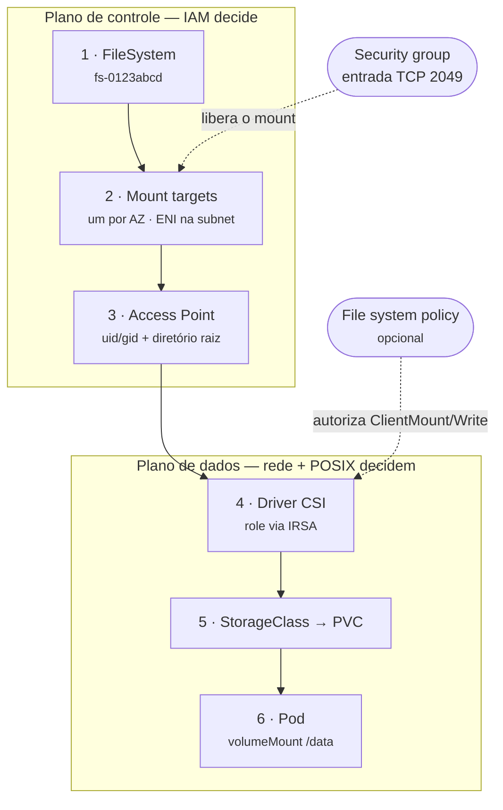

# EFS: o volume que os três workers compartilham

Todo o lab escreve em `/data`. No `docker-compose.yml` isso é um volume do Docker; num cluster de verdade seria um PVC apoiado em **EFS**. Este capítulo é sobre o que acontece quando aquela linha vira infraestrutura real: o que o EFS é, o que você precisa provisionar, e — a pergunta que motiva o capítulo — **o que muda no código em Python, Go e .NET**.

A resposta curta da última pergunta é *nada*, e o capítulo inteiro existe para qualificar esse "nada". Ele é verdadeiro no sentido que importa (não há SDK, não há credencial, não há cliente HTTP) e enganoso em cinco pontos concretos, que estão em §5.

O contraponto deste capítulo é o [`08-fsx-smb.md`](08-fsx-smb.md): lá o diretório de rede é SMB e quase tudo muda de lugar. Aqui é NFS, e quase nada muda — mas o "quase" também é caro.

---

## 1. O que o EFS é, na frase que importa

> **EFS é um servidor NFSv4.1 gerenciado pela AWS.**

Tudo o que segue é consequência disso.

**É `ReadWriteMany`.** Vários pods, em várias AZs, montam o mesmo filesystem ao mesmo tempo, e todos leem e escrevem. É a razão de o EFS existir: o EBS é `ReadWriteOnce` e não faz isso. No lab, é o que torna verificável a afirmação do [ROTEIRO](ROTEIRO.md) de que o `consumer-baixa` consegue ler os arquivos que o `consumer-registro` escreveu.

**É POSIX de verdade.** Permissão de uid/gid, hard link, `append`, lock, `stat` (o que é POSIX, e por que o termo carrega peso nestes guias, está no [guia 06](06-eks-ecs-lambda.md) §3). Não é uma emulação de filesystem sobre armazenamento de objetos — é um filesystem. É por isso que o `link(2)` em que a idempotência do lab se apoia ([guia 07](07-implementacoes-python-go-dotnet.md) §5) funciona sem ressalva, coisa que o capítulo 08 não pôde afirmar sobre SMB.

**É elástico.** Cresce e encolhe conforme você grava e apaga. Não há tamanho a provisionar, e não existe o modo de falha "o volume encheu" que o EBS tem.

### Onde ele se encaixa entre EBS e S3

| | **EFS** | **EBS** | **S3** |
|---|---|---|---|
| Acesso simultâneo | muitos nós, muitas AZs | um nó por vez | ilimitado |
| Semântica | filesystem POSIX | filesystem POSIX | objetos |
| Como o código fala | `open()` / `write()` | `open()` / `write()` | SDK, chamada de rede explícita |
| Escopo de falha | regional (multi-AZ) | uma AZ | regional |
| Precisa de VPC | sim | sim | não |
| Modo de acesso no k8s | `ReadWriteMany` | `ReadWriteOnce` | não é volume |

### A recomendação honesta, que já está no guia 06

O [guia 06](06-eks-ecs-lambda.md) §3 diz, e vale repetir aqui porque é o capítulo dedicado ao assunto:

> Para gravar comprovantes, **S3 é quase sempre melhor que EFS**. Sem VPC, sem ENI, com versionamento e lifecycle de graça, e o objeto fica acessível para qualquer outro sistema.

O EFS existe para quando **algo exige semântica POSIX de verdade**: uma biblioteca legada que só sabe abrir arquivo, um processo que dá `append`, um lock, um binário que você não pode reescrever. O lab usa EFS porque o objetivo dele é ensinar PVC — não porque `/data/comprovantes/*.txt` seja o desenho certo em produção.

Se a sua aplicação nova está escolhendo entre os dois e não tem um requisito POSIX nomeável, a resposta provavelmente é S3.

---

## 2. As características que mudam uma decisão

### 2.1 Regional vs. One Zone

**Regional** replica em várias AZs; sobrevive à perda de uma. **One Zone** fica numa AZ só, custa bem menos, e some junto com a AZ.

A escolha não é só de custo: One Zone significa que os seus pods deveriam estar naquela AZ, senão você paga tráfego entre AZs em cada leitura e escreve com mais latência. Para o lab, One Zone bastaria. Para comprovantes que alguém vai querer daqui a três anos, Regional — ou, de novo, S3.

### 2.2 Throughput

Três modos, e a escolha padrão mudou com o tempo:

| Modo | Comportamento | Quando |
|---|---|---|
| **Elastic** | escala sozinho, você paga o que usou | **é o padrão no console e a recomendação para a maioria dos casos** — especialmente carga imprevisível ou que fica ociosa a maior parte do tempo |
| **Provisioned** | você fixa um teto independente do tamanho do filesystem | vazão alta, previsível e constante |
| **Bursting** | vazão amarrada ao tamanho, com créditos que acumulam quando você está ocioso | filesystems grandes com carga proporcional ao tamanho |

O modo **Elastic** é o que a AWS recomenda para carga difícil de prever ou que usa, na média, uma fração pequena do pico — que é exatamente o perfil de um consumer de fila.

O **Bursting** tem o modo de falha característico do EFS: o filesystem vai bem por horas e de repente fica lento, porque os créditos de burst acabaram. Se você herdou um EFS que "às vezes trava", olhe `BurstCreditBalance` no CloudWatch antes de olhar o seu código.

### 2.3 Performance mode

**General Purpose** e **Max I/O**. A recomendação atual é direta: **use General Purpose sempre**. O Max I/O é geração anterior, tem latência maior por operação, e não é suportado nem em One Zone nem em filesystems com throughput Elastic — ou seja, escolher Max I/O hoje é, na prática, abrir mão do Elastic.

### 2.4 Classes de armazenamento e lifecycle

Existem classes mais baratas para dados frios (Infrequent Access e Archive) e políticas de lifecycle que movem arquivos para lá depois de um tempo sem acesso.

A ressalva que interessa a um workload como o do lab: mover é barato, **ler de volta não é**. Um diretório de comprovantes que ninguém abre é o caso perfeito para IA. Um processo que varre o diretório inteiro lendo arquivos antigos é o caso perfeito para uma fatura desagradável. Particionar por data ([guia 07](07-implementacoes-python-go-dotnet.md) §4) ajuda aqui também, e não só na latência.

### 2.5 O que este capítulo deliberadamente não traz

Números. Tetos de vazão, IOPS, preço por GiB-mês, e quantos dias o lifecycle usa por padrão são coisas que a AWS ajusta com frequência, e um número errado num guia é pior que número nenhum. As [referências](#8-referências) apontam para a página que sempre tem o valor atual. O que este capítulo afirma são **formas** — quais modos existem, o que cada um otimiza, e qual é o modo de falha de cada escolha.

---

## 3. O fluxo da AWS

A ordem importa, e cada peça tem um modo de falha próprio.



### Quem cria o quê, e o que quebra se faltar

| # | Recurso | O que é, concretamente | Se faltar |
|---|---|---|---|
| 1 | **FileSystem** | o `fs-0123abcd`. Aqui você escolhe Regional/One Zone, throughput e performance mode | nada existe |
| 2 | **Mount target** | uma **ENI numa subnet**, uma por AZ. É o endereço IP que o cliente NFS de fato procura | o mount **pendura** — o pod fica em `ContainerCreating` sem erro útil |
| 3 | **Access Point** | um ponto de entrada com **uid/gid e diretório raiz fixos**. Toda operação por ele é forçada àquele uid/gid | nada quebra, mas você fica com permissão POSIX na mão |
| 4 | **Driver CSI** | o `efs-csi-controller` no cluster. **É ele que precisa de role IAM**, não o seu pod | PVC fica `Pending` |
| 5 | **StorageClass / PV / PVC** | a abstração do k8s sobre tudo acima | pod em `Pending`, com mensagem pouco óbvia |
| 6 | **Pod** | `volumeMounts` + `securityContext.fsGroup` | `PermissionError` em runtime — veja §5.5 |

### Os dois planos, e por que confundi-los custa caro

**Criar** filesystem, mount target e access point é plano de controle: IAM comum, `elasticfilesystem:CreateFileSystem` e amigos, feito uma vez por quem provisiona.

**Montar e gravar** é plano de dados, e aí o IAM quase sai de cena. Quem decide são a **rede** (o security group na porta 2049), as **permissões POSIX** (uid/gid) e, *se você tiver criado uma*, a **file system policy**.

É o ponto que o [guia 06](06-eks-ecs-lambda.md) §3 já faz e que vale carregar para cá:

> **O pod não precisa de nenhuma permissão IAM para montar.** Quem precisa de role é o driver CSI. Do ponto de vista do container, `/data` é um diretório comum com permissão POSIX.

No ECS a história muda um pouco: com `iam: ENABLED` no `efsVolumeConfiguration`, a **task role** precisa de `elasticfilesystem:ClientMount` e `ClientWrite`. É a diferença que o guia 06 §3 detalha, e é a origem do sintoma "falha no mount sem nenhum log da aplicação".

### O YAML, inline

```yaml
# StorageClass — provisionamento dinâmico, um Access Point por PVC
apiVersion: storage.k8s.io/v1
kind: StorageClass
metadata:
  name: efs-comprovantes
provisioner: efs.csi.aws.com
parameters:
  provisioningMode: efs-ap          # cria um Access Point por PVC
  fileSystemId: fs-0123abcd
  directoryPerms: "775"
  gidRangeStart: "1000"             # o gid que o fsGroup do pod precisa casar
  gidRangeEnd: "2000"
---
apiVersion: v1
kind: PersistentVolumeClaim
metadata:
  name: comprovantes
spec:
  accessModes: [ReadWriteMany]      # o motivo de ser EFS e não EBS
  storageClassName: efs-comprovantes
  resources:
    requests:
      storage: 5Gi                  # ignorado na prática: o EFS é elástico
---
# no Deployment do worker
spec:
  template:
    spec:
      securityContext:
        fsGroup: 1000               # PRECISA cair na faixa do gidRange acima
      containers:
        - name: consumer
          volumeMounts:
            - name: dados
              mountPath: /data
      volumes:
        - name: dados
          persistentVolumeClaim:
            claimName: comprovantes
```

O `storage: 5Gi` é obrigatório pelo schema do k8s e **não limita nada** — o EFS cresce sozinho. É uma das poucas linhas de YAML do ecossistema que existe só para satisfazer o validador.

---

## 4. Os cinco pontos que decidem se o mount sobe

No espírito da tabela do [guia 02](02-assume-role-cross-account.md) §2 — cada linha responde a uma pergunta diferente, e a maioria das falhas é uma linha só:

| Ponto | Onde mora | Responde à pergunta | Sintoma quando falha |
|---|---|---|---|
| **0 · Rede** | security group do mount target | o cliente alcança a porta 2049? | mount **pendura** sem erro |
| **1 · File system policy** | no filesystem (resource policy) | este principal pode montar/gravar? | `AccessDenied` no mount |
| **2 · Role do driver CSI** | conta do cluster | o driver pode criar Access Point e descrever o FS? | PVC eternamente `Pending` |
| **3 · POSIX do Access Point** | no Access Point | com que uid/gid as operações acontecem? | arquivos com dono inesperado |
| **4 · `fsGroup` do pod** | no Deployment | o processo pertence ao grupo dono do diretório? | `PermissionError` na primeira escrita |

### O ponto 0 é o que mais dói

Um mount NFS que não alcança o servidor **não falha — ele espera**. O pod fica em `ContainerCreating`, o `describe` não diz nada útil, e a causa é quase sempre uma destas três:

- o security group do mount target não libera **entrada TCP na 2049** vinda do security group dos nós;
- não existe mount target **na AZ em que o pod foi agendado** (o cliente procura o da própria AZ);
- o DNS não resolve `fs-0123abcd.efs.<região>.amazonaws.com` — em VPC sem `enableDnsHostnames`/`enableDnsSupport`, ou com resolver customizado.

É o gêmeo exato da seção de DNS do [guia 08](08-fsx-smb.md) §3.2: em ambos os capítulos, a causa nº 1 de mount que não sobe não está no IAM nem no seu código, e não produz mensagem de erro.

### TLS em trânsito

O EFS aceita NFS sobre TLS. No k8s isso é a opção de mount `tls` (o driver CSI usa `stunnel` por baixo); no ECS, `transitEncryption: ENABLED`. E dá para **obrigar**: uma file system policy com condição `aws:SecureTransport` nega qualquer mount em claro.

Se você habilitar a exigência sem habilitar a opção no cliente, o sintoma é `AccessDenied` no mount — que se parece com problema de permissão e é problema de transporte.

---

## 5. O que muda no código, em Python, Go e .NET

**Nada.** Não há SDK, não há credencial, não há cliente para reusar, não há região para configurar. `/data` é um diretório. O `ComprovanteWriter` das três linguagens não sabe que existe EFS, e é assim que deve ser — é a promessa do CSI, e ela se cumpre.

Isso é uma diferença real em relação a todo o resto do lab. SQS, SNS, Secrets Manager e KMS aparecem no código como chamada de rede explícita, com erro tipado e credencial atrás. O EFS aparece como `open()`.

Cinco pontos qualificam esse "nada".

### 5.1 O `link(2)` funciona — e isso não é sorte

O desenho de idempotência do lab depende de uma primitiva que **falha se o destino já existe** ([guia 07](07-implementacoes-python-go-dotnet.md) §5): `os.link` em Python e Go, `File.Move(..., overwrite: false)` no .NET.

No EFS isso é seguro. O EFS é **NFSv4.1**, onde tanto `link(2)` quanto criação exclusiva (`O_CREAT|O_EXCL`) são confiáveis. O folclore de "não confie em `O_EXCL` sobre NFS" vem do **NFSv3** — o [guia 08](08-fsx-smb.md) §6.1(a) já desmonta isso em detalhe, e a conclusão de lá se aplica aqui ao contrário: no SMB você precisa sondar, no EFS não precisa.

Ou seja: **o código do lab está correto sobre EFS sem nenhuma alteração**, e essa é uma afirmação sobre a versão do protocolo, não sobre sorte.

### 5.2 Durabilidade: o `close()` faz mais no EFS do que no volume local

Nenhuma das três implementações chama `fsync`. Verifiquei — não há `fsync`, `Sync()`, `Flush(true)` nem `WriteThrough` em lugar nenhum de `examples/`.

A leitura apressada é "então um crash deixa arquivo truncado". No EFS, **não é bem isso**, e a razão é interessante o suficiente para o capítulo existir.

O NFS trabalha com *close-to-open consistency*: ao fechar o arquivo, o cliente descarrega as páginas sujas no servidor. E as três implementações fecham o arquivo antes de publicar o nome:

| | Como escreve o `.tmp` | O erro de `close()` chega em você? |
|---|---|---|
| **Python** | `Path.write_text` — abre num `with`, o `close()` dá flush | sim, levanta exceção |
| **Go** | `os.WriteFile` | sim — a stdlib devolve o erro do `Close()` se o `Write` deu certo |
| **.NET** | `File.WriteAllText` — `StreamWriter` em `using`, `Dispose` dá flush | sim, lança exceção |

O trecho relevante da stdlib do Go, que é o menos óbvio dos três:

```go
func WriteFile(name string, data []byte, perm FileMode) error {
	f, err := OpenFile(name, O_WRONLY|O_CREATE|O_TRUNC, perm)
	if err != nil {
		return err
	}
	_, err = f.Write(data)
	if err1 := f.Close(); err1 != nil && err == nil {
		err = err1   // <- o erro de Close nao e engolido
	}
	return err
}
```

Então, no momento em que o `link()` publica o nome definitivo, os bytes já foram para o servidor — e se não foram, a escrita do `.tmp` estourou antes e o nome nunca chegou a ser publicado. A ordem `escreve tmp → fecha → link` protege mais do que parece.

**A inversão que vale guardar:** este mesmo código tem durabilidade *mais fraca* no volume local do `docker-compose` do que teria no EFS. Em disco local, `close()` não garante quase nada — os dados podem ficar em cache do kernel por dezenas de segundos. Sobre NFS, `close()` é justamente o ponto em que a rede acontece.

**O que o `fsync` ainda acrescentaria:** um ponto explícito onde erros de escrita aparecem, e durabilidade para handles longos (arquivo aberto por muito tempo, com escritas incrementais). O lab não tem nenhum dos dois casos — cada comprovante é um `write` seguido de `close`. Se você tiver, é assim:

| | Forçar ida ao servidor |
|---|---|
| **Python** | `f.flush()` e depois `os.fsync(f.fileno())` |
| **Go** | `f.Sync()` — exige abrir com `os.OpenFile`, não `os.WriteFile` |
| **.NET** | `fs.Flush(flushToDisk: true)`, ou `FileOptions.WriteThrough` no `FileStream` |

E o detalhe que quase todo mundo esquece — **em disco local**: para o *nome* do arquivo ser durável, é o **diretório** que precisa de `fsync`, não só o arquivo (em Python, `os.open(dir, os.O_RDONLY)` seguido de `os.fsync()`). No EFS isso não se aplica da mesma forma: o `link()` é uma chamada RPC síncrona, então quando ela retorna o nome já existe no servidor — que é a mesma atomicidade de que §5.1 depende.

### 5.3 Cada `exists()` é uma ida à rede

As três implementações têm o mesmo atalho, com o mesmo comentário:

```python
# Atalho barato: na esmagadora maioria das duplicatas o arquivo ja esta
# la e nem vale a pena escrever o temporario.
if destino.exists():
    return False
```

Em disco local isso é uma syscall. No EFS é uma ida ao servidor — barata, mas de rede. O atalho continua valendo (evita escrever e apagar um `.tmp` inteiro), mas duas consequências mudam de peso:

- **particionar por data deixa de ser cosmético.** Um diretório com um milhão de arquivos torna cada operação de metadado mais cara. A partição do [guia 07](07-implementacoes-python-go-dotnet.md) §4 já resolve isso, por outro motivo (idempotência), e essa é uma daquelas coincidências felizes em que a decisão certa era a mesma pelos dois caminhos;
- **nunca liste diretório dentro de laço.** Um `ls` de diretório grande sobre NFS é caro de um jeito que não tem equivalente local.

### 5.4 Lock é *advisory*, e frouxo

`flock` e `fcntl` funcionam sobre NFSv4, mas o comportamento sob perda de rede, cliente morto e sessão expirada é o suficiente para que a recomendação prática seja: **não construa correção em cima de lock de arquivo no EFS**.

O lab não constrói. A exclusão mútua dele mora nos **nomes de arquivo** — cada comprovante tem um nome único e determinístico, e a corrida é resolvida pelo `link(2)`, que é atômico no servidor. É por isso que os três workers podem escrever no mesmo diretório sem coordenação nenhuma.

A regra geral: **um arquivo por escritor** é sempre melhor que vários escritores disputando um lock. Vale para EFS, e é o que a tabela de sintomas do [guia 06](06-eks-ecs-lambda.md) §6 já registra.

### 5.5 `uid`/`gid` é POSIX, não IAM — e essa é a confusão nº 1

O caso mais comum de "não consigo escrever no EFS" não tem nada a ver com IAM. O diretório existe, o mount subiu, e a escrita falha porque o **uid do processo dentro do container** não bate com o dono do diretório — o `fsGroup` do pod contra o gid do Access Point.

O lab já defende contra isso na subida, e o comentário em [`consumer.py`](examples/multilinguagem/python/consumer.py) diz exatamente por quê:

> No EFS o diretório pode existir e ainda assim negar escrita, quando o `fsGroup` do pod não bate com o gid do Access Point. Sem esta checagem o worker sobe saudável, processa mensagens, grava tudo no filesystem **efêmero** do container — e você só descobre quando o pod morre.

Esse é o modo de falha que justifica a sonda: sem ela, não há erro nenhum. Há sucesso aparente e perda silenciosa.

O tipo do erro é o que aponta para o lugar certo:

| | Exceção | O que **não** é |
|---|---|---|
| **Python** | `PermissionError` | não é `ClientError`, não é `AccessDenied` |
| **Go** | `os.ErrPermission` | não é um `*types.*Exception` do SDK |
| **.NET** | `UnauthorizedAccessException` | não é `AmazonServiceException` |

Nenhum deles menciona role, policy ou ARN — **porque não é IAM**. Procurar a causa na policy é o caminho errado e custa tempo, e é por isso que isto aparece na tabela de sintomas do [guia 06](06-eks-ecs-lambda.md) §6 e de novo abaixo.

---

## 6. Tabela de sintomas

| Sintoma | Causa provável | Onde olhar |
|---|---|---|
| pod preso em `ContainerCreating`, sem erro | mount pendurado: SG sem entrada na 2049, ou sem mount target na AZ do pod | §4, ponto 0 |
| `mount.nfs: Connection timed out` | mesma coisa, com a decência de expirar | §4, ponto 0 |
| não resolve `fs-….efs.….amazonaws.com` | VPC sem `enableDnsSupport`/`enableDnsHostnames` | §4, ponto 0 |
| PVC eternamente `Pending` | role do driver CSI, ou `fileSystemId` errado na StorageClass | §3, item 4 |
| `AccessDenied` **no mount** | file system policy negando; ou exige TLS e o cliente montou em claro | §4, pontos 1 e TLS |
| `AccessDenied` no mount, só no ECS | `iam: ENABLED` sem `ClientMount`/`ClientWrite` na **task role** | [guia 06](06-eks-ecs-lambda.md) §3 |
| `PermissionError` / `UnauthorizedAccessException` ao gravar | `fsGroup` do pod fora da faixa do gid do Access Point — **é POSIX, não IAM** | §5.5 |
| worker "grava" mas os arquivos somem no restart | não montou; está escrevendo no filesystem efêmero do container | §5.5 — é o que a sonda pega |
| arquivos com dono inesperado | Access Point força uid/gid; o `chown` do container não vale | §4, ponto 3 |
| filesystem rápido que fica lento de repente | throughput Bursting sem créditos | §2.2 — `BurstCreditBalance` no CloudWatch |
| latência alta e constante em operação pequena | performance mode Max I/O | §2.3 — migre para General Purpose |
| fatura subindo sem o uso subir | lifecycle mandou para IA e algo lê tudo de volta | §2.4 |
| duas réplicas gravando o mesmo comprovante | não acontece: `link(2)` é atômico no servidor | §5.1 |

---

## 7. O que este capítulo afirma e o que ele deixa para você medir

**Afirma, e você pode conferir no repositório:**

- Nenhuma das três implementações chama `fsync`, `Sync()` ou equivalente (`grep` em `examples/` — não há ocorrência).
- As três propagam o erro de `close()`: Python pelo `with`, .NET pelo `using`, e Go porque `os.WriteFile` devolve explicitamente o erro do `Close()` — o trecho da stdlib está em §5.2.
- O lab não usa lock de arquivo em lugar nenhum; a exclusão mútua é por nome de arquivo mais `link(2)`.
- A sonda de escrita na subida existe e o comentário dela nomeia o EFS e o `fsGroup` ([`consumer.py`](examples/multilinguagem/python/consumer.py)).

**Afirma com base na especificação do protocolo, não em medição minha:**

- Que `link(2)` e `O_CREAT|O_EXCL` são confiáveis no NFSv4.1, e portanto no EFS. É o que o padrão determina e o que o [guia 08](08-fsx-smb.md) §6.1(a) já sustenta.
- Que o `close()` descarrega as páginas sujas no servidor (*close-to-open consistency*). É comportamento de cliente NFS.

**Deixa para você medir, e eu recomendo que meça antes de decidir:**

- Se o `fsync` explícito muda alguma coisa no seu caso. O lab não tem handle longo, então provavelmente não muda — mas "provavelmente" é palavra de quem não mediu o seu workload.
- O custo real de metadados do seu diretório de comprovantes depois de alguns milhões de arquivos. A partição por data foi desenhada para idempotência; que ela também resolva o custo de metadados é conveniente, não medido.
- Qualquer número de vazão, IOPS ou preço. Estão fora deste capítulo de propósito (§2.5).

**O que este capítulo não cobre:**

- Backup do EFS (AWS Backup), replicação entre regiões e snapshots.
- EFS fora de container: EC2 direto, Lambda com EFS (está no [guia 06](06-eks-ecs-lambda.md) §3, com a recomendação de preferir S3).
- Migração de dados para dentro do EFS (DataSync).

---

## 8. Referências

- Amazon EFS — [especificações de performance](https://docs.aws.amazon.com/efs/latest/ug/performance.html) (modos de throughput e performance, com os números atuais)
- Amazon EFS — [gerenciando throughput](https://docs.aws.amazon.com/efs/latest/ug/managing-throughput.html)
- Amazon EFS — [dicas de performance](https://docs.aws.amazon.com/efs/latest/ug/performance-tips.html)
- Amazon EFS — [Access Points](https://docs.aws.amazon.com/efs/latest/ug/efs-access-points.html)
- Amazon EFS — [file system policies e autorização IAM](https://docs.aws.amazon.com/efs/latest/ug/iam-access-control-nfs-efs.html)
- Amazon EFS — [criptografia em trânsito](https://docs.aws.amazon.com/efs/latest/ug/encryption-in-transit.html)
- EFS CSI driver para EKS — https://github.com/kubernetes-sigs/aws-efs-csi-driver
- Volumes EFS no ECS — [boas práticas](https://docs.aws.amazon.com/AmazonECS/latest/developerguide/efs-best-practices.html)
- Lambda com EFS — https://docs.aws.amazon.com/lambda/latest/dg/configuration-filesystem.html
- RFC 5661 — [NFS versão 4.1](https://www.rfc-editor.org/rfc/rfc5661) (a semântica de `link` e de criação exclusiva)

**Neste repositório:**

- [`06-eks-ecs-lambda.md`](06-eks-ecs-lambda.md) §3 — volumes nas três plataformas, e por que S3 em vez de EFS na Lambda
- [`07-implementacoes-python-go-dotnet.md`](07-implementacoes-python-go-dotnet.md) §5 — a escrita atômica e o `link(2)`
- [`08-fsx-smb.md`](08-fsx-smb.md) — o mesmo problema com SMB, onde quase tudo muda
- [`02-assume-role-cross-account.md`](02-assume-role-cross-account.md) §2 — a ideia de "qual documento decide", usada em §4
