# O Sistema Financeiro Brasileiro para Desenvolvedores

### Como o dinheiro se move entre bancos, o Bacen, o crédito e os pagamentos — uma visão técnica

---

## Sumário

**Parte I — Fundamentos (comece aqui)**
1. [Introdução: por que um dev precisa entender isso](#1-introdução)
2. [Como usar esta apostila: trilha de aprendizado](#2-como-usar-esta-apostila)
3. [Conceitos fundamentais: liquidez, compensação, liquidação e risco](#3-conceitos-fundamentais)
4. [O banco por dentro: produtos, balanço e como o banco ganha dinheiro](#4-o-banco-por-dentro)
5. [Contabilidade para devs: conta, lançamento e transação](#5-contabilidade-para-devs)
6. [Dinheiro no código: representação monetária e matemática financeira](#6-dinheiro-no-código)

**Parte II — A infraestrutura nacional**
7. [Estrutura do Sistema Financeiro Nacional (SFN)](#7-estrutura-do-sfn)
8. [O Bacen como orquestrador técnico: RSFN e ISPB](#8-o-bacen-como-orquestrador-técnico)
9. [Sistema de Pagamentos Brasileiro (SPB): o "barramento" central](#9-sistema-de-pagamentos-brasileiro-spb)

**Parte III — Os trilhos de pagamento**
10. [PIX: arquitetura técnica em detalhe](#10-pix-arquitetura-técnica-em-detalhe)
11. [TED, boleto e CNAB: os trilhos "tradicionais"](#11-ted-boleto-e-cnab)
    - [11.1 TED](#111-ted)
    - [11.2 O boleto bancário](#112-o-boleto-bancário)
    - [11.3 Código de barras e linha digitável](#113-código-de-barras-e-linha-digitável)
    - [11.4 CNAB: o formato de arquivo](#114-cnab-o-formato-de-arquivo)
    - [11.5 Carteiras de cobrança](#115-carteiras-de-cobrança)
    - [11.6 CNAB de cobrança em detalhe](#116-cnab-de-cobrança-em-detalhe)
    - [11.7 CNAB de pagamento em detalhe](#117-cnab-de-pagamento-em-detalhe)
    - [11.8 CNAB × APIs modernas](#118-cnab-×-apis-modernas)
12. [Cartões: o arranjo de quatro partes](#12-cartões-o-arranjo-de-quatro-partes)

**Parte IV — Crédito e conformidade**
13. [Área de Crédito: ciclo de vida, garantias, SCR e recebíveis](#13-área-de-crédito)
    - [13.1 Ciclo de vida de uma operação de crédito](#131-ciclo-de-vida-de-uma-operação-de-crédito)
    - [13.2 Limites](#132-limites)
    - [13.3 Garantias](#133-garantias)
    - [13.4 Inadimplência, provisão e write-off](#134-inadimplência-provisão-e-write-off)
    - [13.5 Duplicatas](#135-duplicatas)
    - [13.6 Registradoras de recebíveis: registro, gravame e baixa](#136-registradoras-de-recebíveis)
14. [Compliance: KYC, PLD/FT, sigilo bancário e LGPD](#14-compliance)
15. [Conciliação, estorno, fraude e disputas](#15-conciliação-estorno-fraude-e-disputas)

**Parte V — Fronteira e consolidação**
16. [Open Finance: o dado como novo trilho](#16-open-finance)
17. [Visão consolidada: do sistema do banco até o Bacen](#17-visão-consolidada)
18. [Glossário técnico para devs](#18-glossário-técnico)
19. [Referências](#19-referências)

---

## 1. Introdução

Quando você trabalha em backend de banco — seja num core bancário, num sistema de cobrança, num motor de crédito ou numa integração PIX — está, na prática, escrevendo um dos nós de uma rede regulada que tem o **Banco Central do Brasil (Bacen/BCB)** como liquidante final. Entender essa rede muda a forma como você projeta idempotência, reconciliação, tratamento de erro e SLA, porque cada mensagem que seu serviço envia eventualmente:

- passa por uma **câmara** ou por um sistema de liquidação — entidades que centralizam e organizam as trocas financeiras entre instituições. As quatro que você vai encontrar o tempo todo: o **STR** (Sistema de Transferência de Reservas, do Bacen, onde a liquidação interbancária se torna definitiva), o **SPI** (Sistema de Pagamentos Instantâneos, o motor do PIX, também do Bacen), a **Núclea** (câmara privada, ex-CIP, que compensa boleto, TED e cartão) e a **B3** (bolsa e câmara do mercado de capitais). O capítulo 9 detalha cada uma;
- é liquidada em **moeda de banco central**, numa conta que a instituição mantém no Bacen;
- gera (ou consome) um **registro regulatório** (SCR, DICT, Open Finance) que outras instituições e o próprio Bacen também enxergam.

Esta apostila cobre os fundamentos econômicos e contábeis, a estrutura institucional, os trilhos de pagamento (PIX, boleto/CNAB, TED, cartões), a área de crédito e as obrigações de conformidade — sempre com o olhar de "o que isso significa para o meu sistema".

---

## 2. Como usar esta apostila

Esta apostila vai do **simples ao avançado** e assume que você sabe programar, mas **não** que você conheça o domínio bancário. Nenhum conhecimento prévio de finanças é necessário.

A ordem dos capítulos é intencional, mas nem todo capítulo depende de todos os anteriores. O grafo abaixo mostra o que é **pré-requisito de quê** — use-o para pular com segurança:

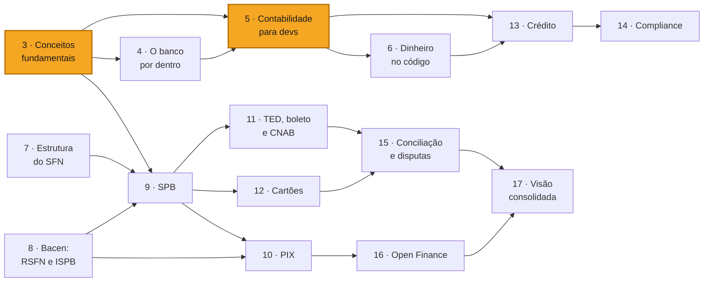
```mermaid
graph LR
    classDef destaque fill:#f5a623,stroke:#b36d00,color:#1a1a1a,stroke-width:2px

    C3["3 · Conceitos<br/>fundamentais"] --> C4["4 · O banco<br/>por dentro"]
    C3 --> C5["5 · Contabilidade<br/>para devs"]
    C3 --> C9["9 · SPB"]
    C4 --> C5
    C5 --> C6["6 · Dinheiro<br/>no código"]
    C5 --> C13["13 · Crédito"]
    C6 --> C13
    C9 --> C10["10 · PIX"]
    C9 --> C11["11 · TED, boleto<br/>e CNAB"]
    C9 --> C12["12 · Cartões"]
    C7["7 · Estrutura<br/>do SFN"] --> C9
    C8["8 · Bacen:<br/>RSFN e ISPB"] --> C10
    C8 --> C9
    C10 --> C16["16 · Open Finance"]
    C11 --> C15["15 · Conciliação<br/>e disputas"]
    C12 --> C15
    C13 --> C14["14 · Compliance"]
    C15 --> C17["17 · Visão<br/>consolidada"]
    C16 --> C17

    class C3,C5 destaque
```

Os dois nós destacados — **3** e **5** — são os únicos verdadeiramente obrigatórios: quase todo o resto depende de um deles.

| Se você… | Comece por |
|---|---|
| Nunca trabalhou com banco | Capítulo 3, na ordem, sem pular |
| Já trabalha com pagamentos, quer entender crédito | Capítulos 3, 5 e 6, depois pule para 13 |
| Já trabalha com crédito, quer entender pagamentos | Capítulos 3, 9, 10, 11 e 12 |
| Vai mexer em arquivo CNAB amanhã | Capítulos 3 e 11, nessa ordem |
| Precisa de referência rápida | Capítulo 18 (glossário) |

**Como o texto é escrito.** Todo termo novo é definido no momento em que aparece pela primeira vez, em negrito, com a explicação logo em seguida. Siglas são expandidas, jargão é traduzido, e o capítulo 18 recolhe tudo em forma de glossário para consulta rápida. Todo capítulo de conteúdo — do 3 ao 17 — termina com um **checkpoint**: perguntas curtas cujo gabarito fica dentro de um bloco `<details>` recolhido, para o olho não ler a resposta antes de o cérebro tentar. O capítulo 11, por ser o maior, tem dois: um de cobrança e um de pagamento. Alguns capítulos trazem também **exercícios**, que é outra coisa: checkpoint verifica se você lembra, exercício verifica se você consegue fazer.

**Uma convenção de nomenclatura**, para você não se perder nas referências cruzadas: **capítulo** é uma divisão de primeiro nível (`## 5. Contabilidade para devs`); **seção** é uma subdivisão dela (`### 13.4 Inadimplência, provisão e write-off`). O texto usa os dois termos sempre nesse sentido.

**Três avisos honestos antes de começar:**

1. **O vocabulário é o obstáculo real, não a complexidade técnica.** Um dev sênior consegue entender qualquer fluxo desta apostila; o que trava é a densidade de siglas. Não decore — volte ao glossário sempre que precisar.
2. **Errar em sistema financeiro custa dinheiro real de pessoas reais.** Um bug de arredondamento vira reclamação no Bacen. Isso muda o padrão de qualidade esperado do seu código — testes, idempotência e auditoria não são opcionais aqui.
3. **A regra muda.** Bacen publica resoluções continuamente. Esta apostila tem data (agosto/2026); antes de implementar, confirme a norma vigente.

### O que esta apostila cobre — e o que não cobre

"Do simples ao avançado" é uma promessa vazia sem dizer avançado *em quê*. O recorte é este: **o dinheiro dentro do Brasil, em reais, do ponto de vista de quem escreve o backend que o move ou o registra.**

**Está dentro, com profundidade:** contabilidade bancária e desenho de ledger, matemática financeira e representação monetária, a infraestrutura do SFN e do SPB, os trilhos PIX / TED / boleto / CNAB / cartões, o ciclo de crédito com garantias e recebíveis, e as obrigações de conformidade que viram requisito de sistema.

**Está de fora, deliberadamente:**

| Tema | Por quê |
|---|---|
| **Câmbio e pagamentos internacionais** | SWIFT, contrato de câmbio, PIX Internacional e IOF de câmbio formam um domínio próprio, com regulação e vocabulário separados. Seria outra apostila |
| **Tributação de investimentos** | Come-cotas, tabela regressiva de IR, IR sobre renda variável — pertence a produto de investimento, não a movimentação de dinheiro |
| **Mercado de capitais em profundidade** | Precificação, marcação a mercado, derivativos. O capítulo 13 toca em debêntures, CRI/CRA e FIDC só até onde crédito vira papel negociável |
| **Modelagem estatística de risco** | A apostila explica *por que* o modelo de perda esperada existe e o que ele exige do seu pipeline de dados, não como construí-lo |
| **Manual de qualquer banco específico** | Posições e códigos aqui são do leiaute de referência. O manual da instituição sempre prevalece |

**Sobre os blocos "No modelo do ASA".** Ao longo do capítulo 11 você vai encontrar caixas marcadas assim. Elas são **estudo de caso de uma implementação real** — o esquema de banco de dados de um gerador de retorno CNAB em produção — e existem para mostrar como as decisões do texto aparecem em código de verdade. Nomes como `ControleJanelaRetorno` ou `Tricon` só fazem sentido dentro daquele sistema. **Pule esses blocos sem prejuízo nenhum**: nada no resto da apostila depende deles.

### O fio condutor: a Padaria do João

Para que os capítulos não pareçam tópicos vizinhos, um mesmo caso atravessa o documento inteiro. Ele é banal de propósito:

> **A Padaria do João vende R$ 10.000 em pães de forma para o Mercado da Esquina, a prazo, para pagamento em 30 dias.**

Uma venda. Só que ela reaparece em sete lugares, e cada capítulo enxerga uma camada diferente do mesmo evento:

| Camada | Onde |
|---|---|
| O lançamento contábil da venda | Capítulo 5 |
| O centavo que sobra ao parcelar | Capítulo 6 |
| A duplicata sacada contra o Mercado | Seção 13.5 |
| O boleto emitido e a remessa CNAB | Seções 11.2 a 11.6 |
| A antecipação do recebível no banco | Seções 11.5 e 13.6 |
| O pagamento chegando e o retorno CNAB | Seções 11.6 e 11.7 |
| A conciliação e o que acontece se der errado | Capítulo 15 |

Sempre que a padaria voltar, ela aparece numa caixa marcada **Fio condutor**. Se você quiser ler só a história, procure por essas caixas.

---

## 3. Conceitos fundamentais

Antes de entrar em siglas (STR, SPI, SCR), vale fixar o vocabulário econômico que sustenta tudo. Esses conceitos aparecem disfarçados nas suas decisões técnicas — em prazo de conciliação, em desenho de retry, em modelagem de saldo.

### Moeda, escrituração e o que é "dinheiro" num sistema bancário

Aqui vai a primeira quebra de intuição para quem vem de fora do domínio: **quase nenhum dinheiro no sistema bancário é papel-moeda**. O que existe é *escrituração* — linhas em bases de dados de instituições distintas que, por acordo regulatório, representam obrigação de pagamento.

Existem duas "camadas de dinheiro" que convivem:

- **Moeda escritural (bancária)** — o saldo que o cliente vê no app. É uma **obrigação do banco perante o cliente** (passivo do banco). Quando você faz um `UPDATE` num saldo de conta corrente, você está movendo isso.
- **Moeda de banco central (reservas)** — o saldo que o *banco* mantém na sua conta de Reservas Bancárias no Bacen. É o único dinheiro que quita definitivamente uma obrigação **entre instituições**.

Essa distinção é a razão de existir de metade desta apostila: mover dinheiro dentro do mesmo banco é uma transação de banco de dados; mover entre bancos exige tocar a camada de reservas no Bacen.

### Liquidez

**Liquidez** é a rapidez com que um bem vira dinheiro na mão **sem perder valor**.

> **Analogia:** pense em hierarquia de memória. Saldo em conta é RAM — acesso imediato. Um investimento com resgate em D+1 é SSD — rápido, mas não instantâneo. Um imóvel é fita magnética: o dado está lá, só que recuperá-lo leva meses. E, como em cache, quanto mais rápido o acesso, menor tende a ser o retorno.

Liquidez é um espectro, não um booleano:

| Ativo | Liquidez | Observação |
|---|---|---|
| Saldo em conta corrente | Altíssima | Disponível imediatamente |
| Tesouro Selic | Muito alta | Resgate em D+1, baixa oscilação |
| CDB com liquidez diária | Alta | Depende da regra do produto |
| Duplicata a vencer em 90 dias | Média/baixa | Só vira caixa antecipando com deságio |
| Imóvel | Baixa | Meses para vender sem descontar preço |

Dois usos do termo que você vai encontrar:

- **Liquidez de um ativo** (a tabela acima) — quão rápido vira caixa.
- **Liquidez de uma instituição** — se o banco tem recursos disponíveis *agora* para honrar saques e obrigações interbancárias. Um banco pode ser **solvente** (ativos > passivos) e ainda assim quebrar por **falta de liquidez** (os ativos existem, mas estão travados em crédito de longo prazo enquanto os clientes sacam hoje). Foi assim que bancos historicamente colapsaram — não por prejuízo contábil, mas por descasamento de prazo.

> Para o dev: quando você vê regras de **horário de corte** (o horário-limite do dia para que uma operação ainda seja processada naquele dia, também chamado de *cut-off*), limites de valor por janela, ou o Bacen exigindo que reservas fiquem "pré-financiadas" antes de uma liquidação, o motivo é sempre gestão de liquidez do sistema.

### Compensação × Liquidação (a distinção mais importante da apostila)

Esses dois termos são usados como sinônimos no dia a dia e **não são**:

- **Compensação (*clearing*)** — apurar *quem deve quanto a quem*. É cálculo e troca de mensagens. Nenhum dinheiro mudou de mãos ainda.
- **Liquidação (*settlement*)** — a transferência de fato, definitiva e irreversível.

> **Analogia:** é a comanda do bar. Durante a noite, o garçom anota tudo — isso é compensação: a dívida existe, está registrada, mas você não pagou nada. Só quando você passa o cartão na saída é que ocorre a liquidação. E repare no risco embutido: entre anotar e cobrar, o cliente pode ir embora sem pagar.

Entre uma e outra existe **risco de liquidação**: a janela em que a operação foi confirmada comercialmente mas o dinheiro ainda não foi entregue. Se a contraparte quebrar nesse intervalo, alguém perde.


```mermaid
graph LR
    classDef destaque fill:#f5a623,stroke:#b36d00,color:#1a1a1a,stroke-width:2px
    A["Transação iniciada<br/>(cliente clica 'pagar')"] --> B["Compensação<br/>apura saldos líquidos<br/>entre instituições"]
    B -->|"⚠ janela de risco de liquidação"| C["Liquidação<br/>move reservas no Bacen<br/>IRREVOGÁVEL"]
    C --> D["Recursos definitivamente<br/>disponíveis"]

    class C destaque
```

**Erro clássico de arquitetura:** dar baixa definitiva num título com base no evento de compensação. Se o fluxo é reversível até a liquidação, seu sistema precisa de um estado intermediário (`PAGO_A_CONFIRMAR` vs `LIQUIDADO`) — não um booleano `pago`.

### LBTR × LDL: os dois modelos de liquidação

| | **LBTR** (Liquidação Bruta em Tempo Real) | **LDL** (Liquidação Diferida Líquida) |
|---|---|---|
| Como funciona | Cada transação liquidada individualmente, na hora | Transações acumuladas e compensadas em lote; só o saldo líquido é liquidado |
| Risco de liquidação | Praticamente eliminado | Existe até o momento do fechamento |
| Necessidade de liquidez | Alta (banco precisa de reserva a cada operação) | Baixa (netting reduz o valor movimentado) |
| Onde aparece | STR, SPI (PIX) | Boletos e cartões historicamente, via câmaras |

O **netting** (compensação multilateral) é o motivo de o LDL existir: se o banco A deve 100 ao B e o B deve 90 ao A, transfere-se só 10.

> **Analogia:** é o Splitwise. Durante a viagem, ninguém fica passando PIX a cada conta paga — o app só anota quem deve o quê. No fim, ele calcula o líquido e cada um faz uma transferência só. Muito menos dinheiro circula, mas todo mundo carrega o risco de alguém sumir antes do acerto. Essa é exatamente a troca do LDL: economiza liquidez, acumula risco ao longo do dia.

### D+0, D+1, D+2

Notação universal de prazo de liquidação, onde **D** é a data da operação:

- **D+0** — liquida no mesmo dia (PIX, TED)
- **D+1** — no dia útil seguinte (boletos, em boa parte dos arranjos atuais)
- **D+2** — dois dias úteis (ações na B3)
- **D+30** — comum em recebíveis de cartão de crédito

**Atenção:** não existe regra única de contagem. Liquidação interbancária conta **dias úteis**; recebíveis de cartão e encargos de mora normalmente contam **dias corridos**. A regra vem do produto e do contrato — assumir uma delas como padrão global é fonte clássica de divergência.

De qualquer forma, todo sistema financeiro brasileiro precisa de um **calendário de feriados bancários** (nacionais, estaduais e os do município da **praça** — no jargão bancário, "praça" é a localidade de cobrança ou compensação de um título). Hardcodar `data + 1 dia` é bug garantido.

### Float

**Float** é o dinheiro que já saiu de um lado e ainda não chegou no outro — fica "no ar" e rende para quem está segurando.

> **Analogia:** é a mensagem que o *producer* já publicou e o *consumer* ainda não processou. Ela existe, está em trânsito, e alguém precisa respondê-la enquanto isso. A diferença é que aqui a fila rende juros para o dono do broker. Historicamente foi fonte de receita relevante para bancos; o PIX praticamente eliminou float em pagamentos de varejo, o que é uma das razões econômicas da resistência inicial de parte do mercado a ele.

### Spread, deságio e taxa

- **Spread bancário** — diferença entre o custo de captação do banco e a taxa cobrada no empréstimo. É a margem bruta da operação de crédito.
- **Deságio** — desconto aplicado ao antecipar um recebível. Antecipar R$ 10.000 que venceriam em 90 dias por R$ 9.700 significa deságio de 3%. É o "preço da liquidez".
- **Taxa Selic** — taxa básica de juros, definida pelo **Copom** (Comitê de Política Monetária, colegiado do Bacen que se reúne periodicamente para definir a taxa), que ancora o custo do dinheiro no país. **Não confundir com o sistema SELIC** (custódia de títulos públicos) — mesmo nome, coisas diferentes.

### Os tipos de risco (e por que aparecem no seu código)

| Risco | O que é | Como aparece tecnicamente |
|---|---|---|
| **Risco de crédito** | O devedor não pagar | Motor de decisão, consulta ao SCR, limites |
| **Risco de liquidez** | Não ter caixa disponível na hora | Horários de corte, limites por janela |
| **Risco de liquidação** | Contraparte quebrar entre compensação e liquidação | Estados intermediários, estorno |
| **Risco operacional** | Falha de sistema, erro humano, fraude | Idempotência, trilha de auditoria, conciliação |
| **Risco sistêmico** | Quebra de um participante contaminar a cadeia | Razão de existir do STR e da supervisão do Bacen |

O **risco operacional** é literalmente o seu escopo de trabalho. Idempotência não é preciosismo de engenharia num sistema financeiro — é mitigação de risco regulatório: reprocessar um arquivo CNAB sem chave de deduplicação gera cobrança dupla, que gera reclamação no Bacen.

### As contas do participante no Bacen

Cada instituição participante direto do **SPB** (Sistema de Pagamentos Brasileiro — o conjunto das infraestruturas que compensam e liquidam valores no país; o capítulo 9 o destrincha) mantém conta no Bacen. Toda liquidação interbancária termina num débito e num crédito em contas desse tipo. Elas precisam ter saldo suficiente **no momento** da liquidação — não podem ficar negativas.

E não é uma conta só. São duas famílias, e confundi-las é o erro conceitual mais comum sobre PIX:

| Conta | Para que serve | Quem liquida nela |
|---|---|---|
| **Reservas Bancárias** | Liquidação interbancária dos trilhos tradicionais | STR — TED, boleto, cartões, títulos, ações |
| **Conta PI** (Conta Pagamentos Instantâneos) | Liquidação exclusiva do PIX, 24/7 | SPI |

> **Nota importante:** o PIX **não** liquida em Reservas Bancárias. Ele usa a **Conta PI**, detalhada no capítulo 10. As duas não são mundos separados, porém: a Conta PI é **pré-financiada a partir da conta de Reservas**, por aportes e retiradas solicitados ao STR. Reservas continua sendo a raiz; o PIX apenas liquida num galho dedicado dela.

Isso não significa que o banco precise "adivinhar" o caixa do dia. O Bacen oferece o **redesconto intradia**: uma operação compromissada em que a instituição vende títulos públicos ao Bacen e os recompra no mesmo dia, **sem custo**, apenas para atravessar descasamentos de horário entre pagamentos e recebimentos. Não é medida de emergência — é rotina de infraestrutura, com centenas de operações e centenas de bilhões de reais por dia. Se a devolução escorregar para o dia útil seguinte, aí sim há cobrança de taxa.

#### As duas camadas contábeis de uma transferência

Acompanhe uma **TED** de R$ 500 do João (banco A) para a Maria (banco B) — TED porque ela liquida em Reservas, e é o exemplo limpo da mecânica. O erro de intuição aqui é achar que o dinheiro do João "entra" na conta de reservas do banco A e sai dela. Não entra: são **duas camadas contábeis paralelas**, e três fatos que acontecem em registros diferentes.

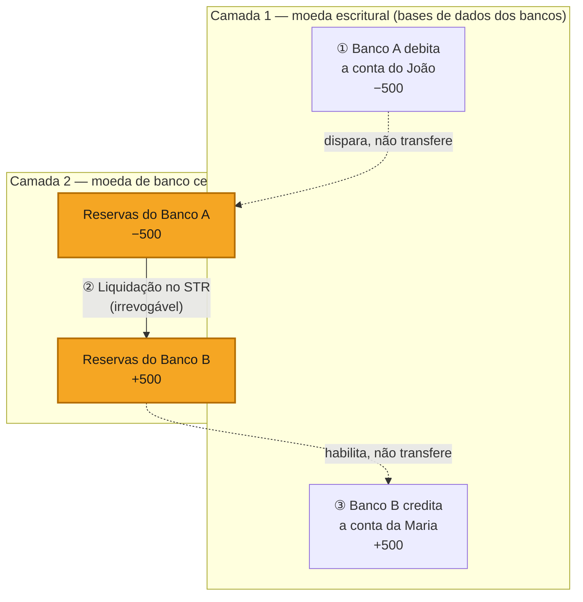
```mermaid
graph TB
    classDef destaque fill:#f5a623,stroke:#b36d00,color:#1a1a1a,stroke-width:2px

    subgraph Camada1["Camada 1 — moeda escritural (bases de dados dos bancos)"]
        direction LR
        CC1["① Banco A debita<br/>a conta do João<br/>−500"]
        CC2["③ Banco B credita<br/>a conta da Maria<br/>+500"]
    end

    subgraph Camada2["Camada 2 — moeda de banco central (Bacen)"]
        direction LR
        RA["Reservas do Banco A<br/>−500"] -->|"② Liquidação no STR<br/>(irrevogável)"| RB["Reservas do Banco B<br/>+500"]
    end

    CC1 -.->|"dispara, não transfere"| RA
    RB -.->|"habilita, não transfere"| CC2

    class RA,RB destaque
```

As setas cheias são movimento de dinheiro; as **pontilhadas são causalidade, não fluxo**. Três lançamentos distintos, em três livros distintos:

| # | Onde é registrado | O que acontece |
|---|---|---|
| ① | Ledger do banco A | Débito na conta do João, crédito numa conta interna de trânsito |
| ② | STR, no Bacen | Débito nas Reservas do A, crédito nas Reservas do B — **este é o único irrevogável** |
| ③ | Ledger do banco B | Débito da conta de trânsito, crédito na conta da Maria |

Se você modelar só ① e ③, seu sistema não fecha com o extrato do Bacen — e, pior, não tem onde representar a janela entre ① e ②, que é exatamente onde mora o risco de liquidação.

**No PIX a mecânica é a mesma, trocando a camada 2:** o SPI debita a Conta PI do PSP pagador e credita a Conta PI do PSP recebedor. O que muda é a conta, o motor e o horário — não a lógica das duas camadas.

### Débito × Crédito: o invariante

Todo sistema financeiro sério usa **partidas dobradas** — toda operação gera pelo menos um débito e um crédito de valor igual. Isso não é burocracia contábil: é um invariante que funciona como *checksum* do sistema, e se a soma não fecha, existe bug.

O **capítulo 5** trata disso a sério: conta contábil, natureza, lançamento, partida, esquema de tabelas e as consequências de arquitetura. Por ora, guarde só a frase.

### Checkpoint

1. Qual a diferença entre moeda escritural e moeda de banco central?
2. Um banco pode ser solvente e quebrar mesmo assim. Como?
3. Compensação e liquidação: qual delas é irrevogável?
4. Por que o modelo LDL precisa de menos liquidez que o LBTR?
5. Por que `data + 1 dia` é insuficiente para calcular D+1?
6. Numa TED entre dois bancos, quantos lançamentos contábeis distintos existem e em quais livros?
7. O PIX liquida em Reservas Bancárias?

<details>
<summary>Respostas</summary>

(1) Escritural é o saldo do cliente, passivo do banco; de banco central são as reservas no Bacen, única forma de quitar obrigação entre instituições. (2) Por falta de liquidez — os ativos existem mas estão travados em prazo longo enquanto os saques são hoje. (3) A liquidação. (4) Porque o netting compensa obrigações mútuas e só o saldo líquido é movimentado. (5) Porque D+1 conta dia útil e depende de calendário de feriados, inclusive municipais. (6) Três: um no ledger do banco pagador, um no STR entre as contas de Reservas, um no ledger do banco recebedor — e só o do meio é irrevogável. (7) Não. Liquida em Conta PI, que por sua vez é pré-financiada a partir da conta de Reservas via STR.

</details>

---

## 4. O banco por dentro

Este capítulo responde uma pergunta que raramente é feita explicitamente, mas que muda tudo: **como um banco ganha dinheiro?** Sem isso, você implementa requisitos sem entender por que eles existem.

### Intermediação financeira: o modelo de negócio

Um banco é, essencialmente, um **intermediário de prazo e risco**. Ele:

1. **Capta** recursos de quem tem sobra — depósitos e títulos de captação como **CDB** (Certificado de Depósito Bancário), **LCI** (Letra de Crédito Imobiliário) e **LCA** (Letra de Crédito do Agronegócio), nos quais o cliente empresta dinheiro ao banco em troca de juros — pagando pouco por isso;
2. **Empresta** para quem precisa (crédito) — cobrando mais;
3. Fica com a diferença: o **spread**.

O detalhe crucial: o banco capta **curto** (você pode sacar amanhã) e empresta **longo** (financiamento de 30 anos). Esse **descasamento de prazo** é a função econômica do banco — e também sua fragilidade estrutural.

> **Analogia:** é *overbooking* de connection pool. O banco sabe que nem todos os clientes vão sacar no mesmo dia, então mantém em caixa só uma fração do que deve. Funciona bem no caso médio. Se todo mundo pedir conexão ao mesmo tempo — uma corrida bancária —, o pool estoura, mesmo com a instituição sendo perfeitamente saudável no papel.

**As quatro fontes de receita de um banco:**

| Fonte | O que é | Exemplo |
|---|---|---|
| **Spread de crédito** | Margem entre captação e empréstimo | Capta a 10% a.a., empresta a 30% a.a. |
| **Tarifas e serviços** | Cobrança por serviços prestados | Anuidade de cartão, TED, conta PJ, custódia |
| **Float** | Rendimento do dinheiro em trânsito | Fortemente reduzido pelo PIX |
| **Tesouraria** | Aplicação de recursos próprios | Títulos públicos, câmbio, derivativos |

### O balanço de um banco (a parte contraintuitiva)

Aqui está a inversão que confunde todo dev iniciante no domínio:

- **O depósito do cliente é PASSIVO do banco** (o banco *deve* esse dinheiro ao cliente).
- **O empréstimo concedido é ATIVO do banco** (alguém *deve* ao banco).

Ou seja: do ponto de vista do banco, seu saldo em conta é uma dívida dele com você, e a sua dívida de cartão é um bem dele.

Um balanço **não é um grafo de fluxo**: nenhuma linha do passivo financia uma linha específica do ativo. Ele é uma fotografia com dois lados que somam igual — de onde o dinheiro veio, e onde ele está agora:

```
                    BALANÇO DE UM BANCO

  ATIVO — onde o dinheiro está      │  PASSIVO + PL — de onde veio
  ─────────────────────────────────┼───────────────────────────────────
  Carteira de crédito               │  Depósitos de clientes
  (empréstimos concedidos)          │  (à vista e a prazo)
                                    │
  Títulos e valores mobiliários     │  Captações no mercado
                                    │  (CDB, LCI, LCA)
  Reservas no Bacen + caixa         │
                                    │  Patrimônio Líquido
                                    │  (capital dos sócios)
  ─────────────────────────────────┼───────────────────────────────────
  TOTAL                             │  TOTAL  (idêntico, sempre)
```

A igualdade dos totais não é coincidência nem meta contábil: é o mesmo invariante das partidas dobradas visto de longe. Todo real que entrou pelo lado direito está em algum lugar do lado esquerdo.

**Por que isso importa no código:** quando você modela lançamentos, o sinal do valor depende da perspectiva. Um crédito na conta do cliente é um aumento de passivo do banco. Se seu ledger não deixa isso explícito, você vai inverter sinal em algum relatório contábil — e vai demorar para descobrir.

### Reserva compulsória e o multiplicador de crédito

O Bacen obriga cada banco a manter uma fração dos depósitos "parada" na conta de reservas — o **depósito compulsório**. É instrumento de política monetária (aperta o compulsório, reduz o crédito na economia) e de segurança.

O efeito colateral é o **multiplicador de crédito**: quando o banco A empresta, esse dinheiro é depositado no banco B, que empresta parte dele, e assim por diante. O sistema bancário **cria moeda escritural** — a quantidade de "dinheiro" no sistema é múltiplo da base monetária emitida pelo Bacen. Não é truque contábil, é como o sistema funciona por desenho.

### Tipos de conta (e por que a distinção importa)

Esse é um ponto que aparece direto em modelagem de dados:

| Tipo | Quem oferece | Característica |
|---|---|---|
| **Conta corrente (depósito à vista)** | Bancos | Movimentação livre, pode ter cheque especial |
| **Conta poupança** | Bancos | Remuneração pela regra da poupança, aniversário mensal |
| **Conta de pagamento** | IPs e bancos | **Recursos são de terceiros e devem ser segregados** — não entram no balanço da IP e não podem ser emprestados |
| **Conta salário** | Bancos | Destinada a recebimento de salário, portabilidade obrigatória |
| **Conta escrow / vinculada** | Bancos | Recursos bloqueados até condição contratual ser cumprida |

> **Ponto crítico:** a segregação de recursos em conta de pagamento é a razão de uma fintech não poder "usar o float dos clientes". Se você trabalha em IP, isso significa que o dinheiro dos clientes vive em conta separada e seu sistema precisa provar essa segregação a qualquer momento.

### Identificação de contas: agência, conta e dígito

- **Agência** — herança da era física; hoje muitas vezes só um número lógico (`0001`).
- **Conta + dígito verificador** — o DV é calculado por algoritmo específico **de cada banco** (variações de módulo 11). Não existe padrão nacional único. Se você valida conta no cliente, vai precisar da regra de cada instituição.
- **Conta gráfica** — conta interna, sem existência no sistema bancário externo; comum em carteiras digitais e sistemas de subcontas.

### Taxonomia de produtos de crédito

| Produto | Característica |
|---|---|
| **Empréstimo pessoal** | Sem destinação específica, sem garantia real |
| **Financiamento** | Destinação vinculada ao bem (veículo, imóvel), bem costuma ser a garantia |
| **Consignado** | Desconto direto em folha/benefício — risco menor, taxa menor |
| **Cheque especial** | Limite rotativo em conta, taxa alta |
| **Cartão de crédito** | Rotativo + parcelado, prazo de faturamento |
| **Capital de giro (PJ)** | Financia operação corrente da empresa |
| **Antecipação de recebíveis** | Adianta valor de duplicatas/recebíveis de cartão com deságio |

### Checkpoint

1. Do ponto de vista do banco, o saldo do seu cliente é ativo ou passivo?
2. Quais são as quatro fontes de receita de um banco?
3. Por que uma instituição de pagamento não pode emprestar o dinheiro que está na conta de pagamento do cliente?
4. O que é descasamento de prazo e por que ele é a função econômica do banco?
5. Por que os dois lados do balanço somam sempre o mesmo total?

<details>
<summary>Respostas</summary>

(1) Passivo — é uma dívida do banco com o cliente. (2) Spread de crédito, tarifas, float e tesouraria. (3) Porque são recursos de terceiros e a regulação exige que fiquem segregados, fora do balanço da IP. (4) Captar curto e emprestar longo — é o que permite financiar projetos de anos com depósitos sacáveis a qualquer momento, e é também a origem do risco de liquidez. (5) Porque todo recurso que entrou (passivo e PL) está necessariamente aplicado em algum lugar (ativo) — é o invariante das partidas dobradas na escala do balanço inteiro.

</details>

---

## 5. Contabilidade para devs

Aqui está a tese central deste capítulo, e talvez de toda a apostila:

> **Em uma instituição financeira, a contabilidade não é um relatório gerado a partir do seu modelo de dados. Ela É o modelo de dados.**

Quem vem de sistemas comuns tende a modelar um saldo como coluna mutável e tratar contabilidade como exportação para o time financeiro. Em banco isso não funciona — o registro contábil é a fonte da verdade, é auditado pelo Bacen e precisa ser reconstituível anos depois.

### Conta contábil

Uma **conta contábil** é uma categoria onde valores se acumulam. Cuidado: **ela não é a conta do cliente.**

> **Analogia:** conta contábil é o *tipo*; conta do cliente é a *instância*. João e Maria têm cada um sua conta corrente — dois registros operacionais distintos —, mas os dois saldos somam na mesma conta contábil, "depósitos à vista". É a diferença entre a classe e os objetos dela.

Toda conta tem uma **natureza**:

| Natureza | Grupos | Aumenta com | Diminui com |
|---|---|---|---|
| **Devedora** | Ativo, Despesa | Débito | Crédito |
| **Credora** | Passivo, Patrimônio Líquido, Receita | Crédito | Débito |

### Débito e crédito não significam entrada e saída

Esse é **o** ponto de confusão. No senso comum, "crédito" é dinheiro entrando. Na contabilidade, débito e crédito são apenas **os dois lados de um lançamento** — o efeito depende da natureza da conta:

- Debitar uma conta de **ativo** → aumenta (mais caixa)
- Debitar uma conta de **passivo** → diminui (menos dívida)

Quando o app diz "seu saldo foi creditado", isso está correto do ponto de vista do banco: o depósito do cliente é **passivo** do banco, e passivo aumenta a crédito. A intuição do usuário e a contabilidade coincidem por acidente — não confie nessa coincidência ao modelar.

### Lançamento e partidas dobradas

Um **lançamento** (*entry* / *posting*) é o registro de um fato contábil. Pelo método das **partidas dobradas**, todo lançamento tem no mínimo uma partida a débito e uma a crédito, e obedece a um invariante absoluto:

```
Σ débitos = Σ créditos     (sempre, sem exceção)
```

**Por que isso é sempre verdade?** Não é convenção arbitrária — é consequência lógica de um fato: **valor não aparece nem desaparece, ele se desloca.** Todo evento econômico responde simultaneamente a duas perguntas:

- *De onde o valor veio?* → o **crédito** (a origem)
- *Para onde o valor foi?* → o **débito** (o destino)

Se o valor que saiu de algum lugar não for igual ao que chegou em outro, você não registrou um fato econômico — registrou um erro. A soma bater não é a *meta* do lançamento; é a *prova* de que ele descreve algo real.

É a mesma lógica de uma equação de conservação em física, ou de um `diff` que precisa fechar. Se você já debugou um sistema distribuído procurando mensagens perdidas, o instinto é o mesmo: **a diferença aponta para onde está o bug.**

### Visualizando: a conta em "T"

Contadores desenham cada conta como um "T" — débitos à esquerda, créditos à direita. É o modelo mental que eles usam em reunião:

```
      Caixa (Ativo)                 Depósito do cliente (Passivo)
   D  │  C                              D  │  C
──────┼──────                      ──────┼──────
 1.000│                                  │ 1.000
```

O cliente depositou R$ 1.000. O caixa do banco aumentou (débito em ativo). A dívida do banco com o cliente aumentou (crédito em passivo). Duas contas, dois lados, mesmo valor.

**Mnemônico que funciona:** débito é sempre **esquerda**, crédito é sempre **direita**. Só isso.

> **Analogia:** é como sinal de vetor. `+1` no eixo X move para a direita; `+1` no eixo Y move para cima. O sinal é o mesmo — o efeito depende do eixo. Débito é o "sinal"; a natureza da conta é o "eixo". Debitar aumenta o ativo e diminui o passivo, e não há contradição nisso, do mesmo jeito que não há contradição em `+1` significar coisas diferentes em eixos diferentes.

Pare de traduzir para "entrada/saída" e pense só em "lado esquerdo/lado direito". A confusão desaparece.

### O que um lançamento quebrado parece

Vale ver o erro para reconhecê-lo. Suponha uma transferência de R$ 500 em que o desenvolvedor esqueceu de registrar a tarifa de R$ 5 cobrada:

| Conta | Débito | Crédito |
|---|---|---|
| Depósito — cliente pagador | 505,00 | |
| Depósito — cliente recebedor | | 500,00 |
| **Total** | **505,00** | **500,00** ❌ |

Diferença de R$ 5,00. O sistema debitou o cliente em 505 mas só creditou 500 em algum lugar — os outros 5 sumiram. O invariante detectou o bug **na hora da escrita**, antes de virar divergência no balancete do mês seguinte.

A versão correta inclui a partida que faltava:

| Conta | Débito | Crédito |
|---|---|---|
| Depósito — cliente pagador | 505,00 | |
| Depósito — cliente recebedor | | 500,00 |
| Receita de tarifas | | 5,00 |
| **Total** | **505,00** | **505,00** ✓ |

**Os erros mais comuns que o invariante pega:**

- Partida esquecida (tarifa, imposto, juros não registrados)
- Erro de arredondamento em rateio (o capítulo 6 trata disso)
- Gravação parcial por falha no meio da transação
- Duplicação de uma das partidas em retry sem idempotência

### Implementando: o modelo mínimo de um ledger

Traduzindo tudo isso para esquema. O essencial cabe em duas tabelas:

```sql
-- O lançamento: o "cabeçalho" do fato contábil
CREATE TABLE lancamento (
    id                BIGSERIAL PRIMARY KEY,
    evento_negocio_id VARCHAR(64) NOT NULL,   -- rastreabilidade até a origem
    chave_idempotencia VARCHAR(64) NOT NULL,  -- reprocessar não duplica
    data_evento       TIMESTAMPTZ NOT NULL,   -- quando o fato ocorreu
    data_contabil     DATE        NOT NULL,   -- em que período contabiliza
    historico         TEXT        NOT NULL,
    criado_em         TIMESTAMPTZ NOT NULL DEFAULT now(),
    CONSTRAINT uq_idempotencia UNIQUE (chave_idempotencia)
);

-- As partidas: as linhas débito/crédito
CREATE TABLE partida (
    id             BIGSERIAL PRIMARY KEY,
    lancamento_id  BIGINT      NOT NULL REFERENCES lancamento(id),
    conta_contabil VARCHAR(20) NOT NULL,   -- rubrica (mapeável ao COSIF)
    sentido        CHAR(1)     NOT NULL CHECK (sentido IN ('D','C')),
    valor          NUMERIC(18,2) NOT NULL CHECK (valor > 0),
    moeda          CHAR(3)     NOT NULL DEFAULT 'BRL'
);
```

Repare em três decisões deliberadas:

1. **`valor` é sempre positivo**, e o sinal vive em `sentido`. Não misture os dois — valor negativo com sentido explícito gera ambiguidade e bugs de agregação.
2. **`NUMERIC`, nunca `FLOAT`**.
3. **Sem coluna de saldo.** Saldo é projeção (veja adiante).

A validação do invariante, em pseudocódigo:

```csharp
void Registrar(Lancamento lancamento)
{
    var totalDebito  = lancamento.Partidas
        .Where(p => p.Sentido == 'D').Sum(p => p.Valor);
    var totalCredito = lancamento.Partidas
        .Where(p => p.Sentido == 'C').Sum(p => p.Valor);

    if (totalDebito != totalCredito)
        throw new LancamentoDesbalanceadoException(totalDebito, totalCredito);

    if (lancamento.Partidas.Count < 2)
        throw new LancamentoInvalidoException("mínimo de duas partidas");

    // cabeçalho + partidas gravam na MESMA transação de banco de dados
    _repo.SalvarAtomicamente(lancamento);
}
```

**Onde validar?** Em três camadas, porque cada uma pega um tipo de falha diferente:

| Camada | Como | Pega |
|---|---|---|
| **Aplicação** | Validação antes de persistir | Erro de lógica de negócio |
| **Banco de dados** | *Trigger* ou constraint diferida por `lancamento_id` | Escrita por fora da aplicação |
| **Rotina de verificação** | Job periódico somando tudo | Corrupção, migração malfeita, bug histórico |

E o saldo, que **não** é armazenado como verdade, mas derivado:

```sql
SELECT conta_contabil,
       SUM(CASE WHEN sentido = 'D' THEN valor ELSE -valor END) AS saldo
FROM   partida p
JOIN   lancamento l ON l.id = p.lancamento_id
WHERE  l.data_contabil <= :data_referencia
GROUP  BY conta_contabil;
```

Essa query é a razão de ser do desenho append-only: **você consegue reconstruir o saldo de qualquer conta em qualquer data passada.** Se o volume exigir, materialize saldos em snapshot — mas mantenha sempre a capacidade de recalcular do zero e comparar. A divergência entre o snapshot e o recálculo é o seu alarme de integridade.

> **Pergunta que todo dev faz:** "não seria mais simples guardar valores com sinal (+/-) e somar?" Funciona matematicamente, mas você perde a semântica contábil — o time financeiro não consegue ler seu ledger, o mapeamento para o COSIF fica implícito, e a distinção entre "aumentou o ativo" e "diminuiu o passivo" desaparece. Em sistema que será auditado, mantenha `sentido` explícito.

### Transação × lançamento × partida

Três níveis distintos, e confundi-los é erro clássico de modelagem:

| Nível | O que é | Cardinalidade |
|---|---|---|
| **Transação (evento de negócio)** | O fato do mundo real: "João pagou um boleto" | 1 |
| **Lançamento contábil** | O registro do fato, atômico e balanceado | 1..N por transação |
| **Partida** | Cada linha débito/crédito do lançamento | 2..N por lançamento |

**Um evento de negócio quase nunca gera um único par débito/crédito.** Veja o desembolso de um empréstimo de R$ 10.000 com IOF de R$ 150 e tarifa de R$ 50:

| Conta | Débito | Crédito |
|---|---|---|
| Operações de crédito (ativo) | 10.000,00 | |
| Depósitos à vista — cliente (passivo) | | 9.800,00 |
| IOF a recolher (passivo) | | 150,00 |
| Receita de tarifas (receita) | | 50,00 |
| **Total** | **10.000,00** | **10.000,00** |

Uma transação, quatro partidas, quatro contas contábeis diferentes — e fecha.

> **Fio condutor — a Padaria do João.** A venda de R$ 10.000 a prazo para o Mercado da Esquina, do ponto de vista do ledger da padaria, é isto:
>
> | Conta | Débito | Crédito |
> |---|---|---|
> | Duplicatas a receber (ativo) | 10.000,00 | |
> | Receita de vendas (receita) | | 10.000,00 |
> | **Total** | **10.000,00** | **10.000,00** ✓ |
>
> Repare no que **não** aconteceu: nenhum centavo entrou no caixa. O regime de competência (adiante neste capítulo) reconhece a receita quando a venda ocorre, não quando o dinheiro chega. Esse descolamento entre o fato econômico e o fluxo de caixa é precisamente o motivo de existir a antecipação de recebíveis — a padaria já tem o lucro no papel e ainda não tem o dinheiro para comprar farinha.

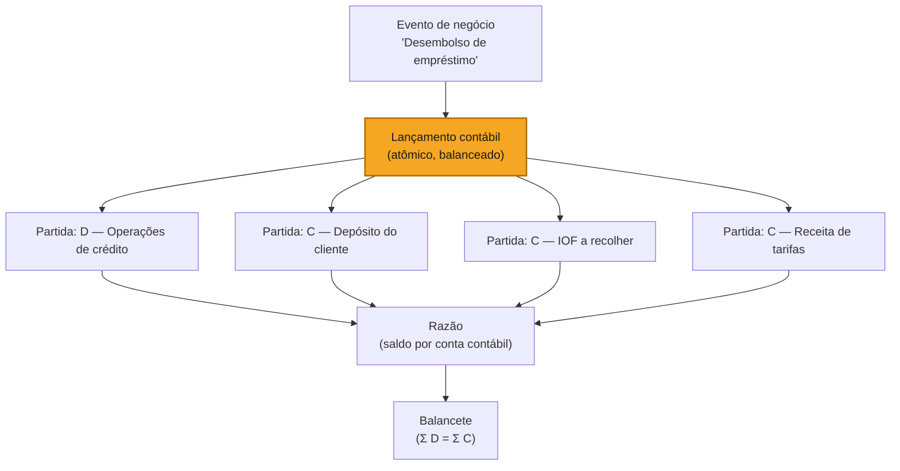
```mermaid
graph TB
    classDef destaque fill:#f5a623,stroke:#b36d00,color:#1a1a1a,stroke-width:2px
    EV["Evento de negócio<br/>'Desembolso de empréstimo'"] --> LC["Lançamento contábil<br/>(atômico, balanceado)"]
    LC --> P1["Partida: D — Operações de crédito"]
    LC --> P2["Partida: C — Depósito do cliente"]
    LC --> P3["Partida: C — IOF a recolher"]
    LC --> P4["Partida: C — Receita de tarifas"]

    P1 --> RZ["Razão<br/>(saldo por conta contábil)"]
    P2 --> RZ
    P3 --> RZ
    P4 --> RZ
    RZ --> BAL["Balancete<br/>(Σ D = Σ C)"]

    class LC destaque
```

### Diário, Razão e Balancete

Vocabulário que você vai ouvir em toda reunião com o time contábil:

- **Diário (*journal*)** — todos os lançamentos em ordem cronológica. É o *log de eventos*, append-only por natureza.
- **Razão (*ledger*)** — os mesmos lançamentos agrupados por conta contábil, com saldo acumulado. É a *projeção* por agregado.
- **Balancete de verificação (*trial balance*)** — a lista de saldos de todas as contas, provando que débitos e créditos totais se igualam.

Se isso soa familiar, é porque **contabilidade de partidas dobradas é event sourcing com 500 anos de vantagem**. O Diário é o event store, o Razão é a read model, e o Balancete é o teste de integridade. Quem inventou o padrão foi Luca Pacioli, em 1494.

### COSIF: o plano de contas é imposto pelo regulador

Diferente de uma empresa comum, uma instituição financeira **não escolhe livremente seu plano de contas**. O **COSIF (Plano Contábil das Instituições do Sistema Financeiro Nacional)**, criado pelo Bacen pela Circular nº 1.273/1987, padroniza a contabilização de bancos, cooperativas de crédito, corretoras, distribuidoras e demais instituições — garantindo demonstrações consistentes e comparáveis entre instituições e permitindo a supervisão pelo regulador.

O COSIF é organizado em quatro capítulos: normas básicas, elenco e funções de contas, documentos e anexos.

**Estrutura do código da conta** — hierárquica, no formato `G.S.D.TT.SS-V`:

```
1.6.8.10.00-2
│ │ │ │  │  └── dígito verificador
│ │ │ │  └───── subtítulo
│ │ │ └──────── título contábil
│ │ └────────── desdobramento de subgrupo
│ └──────────── subgrupo
└────────────── grupo
```

A instituição **pode criar desdobramentos internos** para controle gerencial, desde que sejam conversíveis ao nível analítico do elenco oficial. Ou seja: seu plano de contas interno pode ser mais granular que o COSIF, mas precisa **agregar** corretamente nele — o que na prática significa manter uma camada de *mapeamento* entre suas contas internas e as rubricas oficiais.

**Atributos** — cada conta tem atributos que definem **qual tipo de instituição pode usá-la**. Por exemplo, `U` para bancos múltiplos, `J` para **SCD** (Sociedade de Crédito Direto — fintech que empresta apenas capital próprio), **SEP** (Sociedade de Empréstimo entre Pessoas — plataforma de *peer-to-peer lending*) e **SCM** (Sociedade de Crédito ao Microempreendedor), e `Y` para instituições de pagamento. Uma SEP só pode lançar em contas que tenham o atributo `J`. Isso significa que o mesmo evento de negócio pode ter contabilização diferente conforme o tipo de licença da instituição — algo que precisa ser configurável no seu sistema, não hardcoded.

### Contas de compensação

Existem obrigações e riscos que **não entram no balanço** mas precisam ser registrados: limites de crédito aprovados e não usados, garantias recebidas, avais concedidos. São as **contas de compensação** (*off-balance sheet*).

> **Analogia:** é quota reservada e ainda não consumida. Um limite de cheque especial de R$ 5.000 que o cliente não usou não é dívida do banco — mas, se todos sacarem o limite amanhã, vira. Assim como capacidade provisionada não é carga atual, mas você precisa dimensionar por ela.

### Contas transitórias

Quando um valor chega e você ainda não sabe onde classificá-lo (um crédito não identificado, uma remessa em processamento), ele vai para uma **conta transitória** (*suspense account*).

> **Analogia:** é a *dead letter queue* da contabilidade. Recebeu, não soube rotear, guardou num lugar seguro para tratar depois. E vale a mesma disciplina de operação: uma DLQ que só cresce não é um buffer, é um incidente.

Duas regras práticas:

1. Conta transitória precisa **zerar** — saldo residual crescente é sintoma de bug ou de processo quebrado.
2. Monitore idade e volume desses saldos. É um dos melhores indicadores de saúde de um sistema financeiro.

### Competência × Caixa

- **Regime de caixa** — registra quando o dinheiro se move.
- **Regime de competência** — registra quando o fato econômico acontece, mesmo que o dinheiro só entre depois.

> **Analogia:** é a diferença entre medir throughput no momento em que a requisição chega e medir no momento em que a fatura do mês fecha. A competência acompanha o evento; o caixa acompanha o pagamento.

Contabilidade bancária usa **competência**. Exemplo: juros de um empréstimo são **apropriados diariamente** (receita reconhecida todo dia), mesmo que o cliente só pague daqui a 30 dias. Por isso existem rotinas batch noturnas de apropriação — não é capricho, é regime de competência.

### Fechamento e períodos

Ao final do dia/mês, o período contábil é **fechado**. Depois disso:

- **Não se altera lançamento de período fechado.** Correção se faz com lançamento de ajuste no período aberto.
- Isso reforça o desenho append-only: se seu sistema faz `UPDATE` em lançamento, ele é incompatível com o fechamento contábil.

### Consequências diretas para a arquitetura

Consolidando os princípios que decorrem de tudo acima:

| Princípio | Implementação |
|---|---|
| **Imutabilidade** | Lançamentos são append-only. Correção = lançamento reverso, nunca `UPDATE`/`DELETE` |
| **Atomicidade** | Todas as partidas de um lançamento gravam juntas ou nenhuma grava |
| **Invariante de balanço** | Valide `Σ débitos = Σ créditos` na escrita, não só no relatório |
| **Saldo é projeção** | Derive de lançamentos. Se cachear, tenha como recalcular do zero |
| **Idempotência** | Chave única por evento de negócio, para reprocessar sem duplicar |
| **Data tripla** | Data do evento, data contábil e data de liquidação são campos distintos |
| **Rastreabilidade** | Todo lançamento aponta para o evento de negócio que o originou |
| **Mapeamento configurável** | A regra "evento X → contas Y e Z" muda por norma; não deve estar no código |

> **Regra de ouro:** se você não consegue reconstruir o saldo de qualquer conta em qualquer data passada apenas relendo os lançamentos, seu sistema não é auditável — e auditabilidade não é opcional aqui.

### Checkpoint

Antes de seguir, confira se você consegue responder sem voltar ao texto:

1. Por que a soma dos débitos é sempre igual à dos créditos? (Se sua resposta for "porque é a regra", releia — a resposta é sobre origem e destino do valor.)
2. Um cliente deposita R$ 200. Qual conta é debitada e qual é creditada, do ponto de vista do banco?
3. Qual a diferença entre uma transação de negócio e um lançamento contábil?
4. Por que `valor` deve ser positivo e o sinal ficar em `sentido`?
5. Por que o saldo não deve ser a fonte da verdade?
6. Seu sistema precisa corrigir um lançamento de um mês já fechado. O que se faz?

<details>
<summary>Respostas</summary>

(1) Todo evento econômico é um deslocamento de valor — crédito é a origem, débito é o destino. (2) Débito em caixa/reservas, crédito em depósitos à vista do cliente. (3) Uma transação é o fato de negócio e pode gerar N lançamentos, cada um com 2..N partidas. (4) Para preservar a semântica contábil e evitar ambiguidade de sinal na agregação. (5) Porque ele é projeção derivada — mantê-lo como verdade destrói a auditabilidade. (6) Lançamento de ajuste no período aberto, nunca `UPDATE` no período fechado.

</details>

### Exercícios

Checkpoint verifica se você lembra; exercício verifica se você consegue fazer. Estes três valem uma tarde:

1. **Modele o ledger mínimo** com as duas tabelas desta seção e escreva um teste de propriedade (Hypothesis, FsCheck, jqwik — o que houver na sua stack) que gere lançamentos aleatórios de 2 a 8 partidas e prove que **nenhum lançamento desbalanceado consegue ser gravado**. O teste precisa falhar se você remover a validação.
2. **Prove que a projeção de saldo é reconstituível.** Popule 10.000 lançamentos, materialize um snapshot de saldos por conta, insira mais 1.000, recalcule do zero e compare. A diferença entre snapshot e recálculo tem de ser exatamente o delta dos 1.000 novos.
3. **Contabilize o desembolso do capítulo** (R$ 10.000, IOF R$ 150, tarifa R$ 50) e depois a **quitação antecipada** no mês seguinte, com estorno proporcional do IOF. Verifique que o par de lançamentos, somado, não cria nem destrói valor.

---

## 6. Dinheiro no código

Este capítulo é a ponte direta entre domínio e implementação. São os erros que mais aparecem em code review de sistema financeiro.

### Nunca use ponto flutuante para dinheiro

`0.1 + 0.2 != 0.3` em IEEE 754. Num sistema que soma milhões de lançamentos, esse erro acumula e **quebra o fechamento contábil**.

Use:
- **`decimal` / `BigDecimal`** — precisão decimal exata (`decimal` em C#, `Decimal` em Python, `BigDecimal` em Java)
- **Inteiro em centavos** — armazenar `10050` para R$ 100,50, fazendo a divisão só na apresentação

Guarde também a **moeda** junto do valor. Um campo `valor: decimal` solto é uma bomba-relógio em qualquer sistema que um dia opere câmbio.

### Arredondamento é regra de negócio, não detalhe técnico

Ao dividir R$ 100,00 em 3 parcelas, cada uma dá R$ 33,3333… Você **precisa** decidir onde vai o centavo residual. A convenção mais comum no mercado brasileiro é jogar a diferença na **primeira ou na última parcela**:

```
100,00 / 3 → 33,33 + 33,33 + 33,34
```

O invariante que seu teste deve verificar: **a soma das parcelas é sempre igual ao valor original**. Se não for, você está criando ou destruindo dinheiro.

Cuidado também com o modo de arredondamento: `HALF_UP` (comercial, o que a intuição espera) versus `HALF_EVEN` ("arredondamento bancário", que reduz viés estatístico em grandes volumes). São resultados diferentes — a norma ou o contrato define qual usar.

### Juros: simples × compostos

- **Juros simples** — incidem sempre sobre o principal. `M = C × (1 + i × n)`
- **Juros compostos** — incidem sobre o montante acumulado. `M = C × (1 + i)ⁿ`

Praticamente todo crédito no Brasil usa **juros compostos**. E atenção à conversão de taxas: **não se converte taxa mensal em anual multiplicando por 12**. A conversão correta é exponencial:

```
i_anual = (1 + i_mensal)^12 - 1
```

2% ao mês não é 24% ao ano — é 26,82% ao ano.

### Indexadores: CDI, Selic, IPCA e TR

Quase nenhum contrato relevante no Brasil tem taxa fixa e pronto. Ele tem **um indexador mais um spread**, ou **um percentual de um indexador** — e essas duas formas não são a mesma conta. Se o seu sistema guarda `taxa DECIMAL(9,6)` e nada mais, ele não consegue representar o produto que a área comercial vende.

| Indexador | O que é | Onde aparece |
|---|---|---|
| **Selic** | Taxa básica, definida pelo Copom | Referência de política monetária; remunera a Conta PI e o Tesouro Selic |
| **CDI** | Taxa média dos empréstimos de um dia entre bancos, apurada e divulgada pela B3 | O indexador mais usado do mercado: CDB, LCI, LCA, capital de giro, praticamente todo contrato PJ |
| **IPCA** | Índice oficial de inflação, apurado pelo IBGE | Títulos e contratos de longo prazo, aluguéis, correção monetária |
| **TR** | Taxa Referencial, calculada pelo Bacen | Poupança e financiamento imobiliário no SFH |

O **CDI** merece destaque porque é o que você mais vai encontrar e o que a apostila até agora não tinha mencionado. Ele nasce do mercado interbancário: bancos com sobra de caixa emprestam para bancos com falta, por um dia, e a taxa média dessas operações é o **DI de um dia**. Acumulado, vira o CDI. Na prática ele orbita muito perto da Selic — a diferença costuma ser de frações de ponto —, mas é um número de mercado, não uma decisão do Copom.

**As duas formas de contratar, e por que elas divergem:**

```
"120% do CDI"      → taxa = CDI × 1,20        (multiplicativa)
"CDI + 2% a.a."    → taxa = CDI + 0,02        (aditiva)
```

Com CDI a 10% ao ano, a primeira dá 12% e a segunda dá 12%. Empatam. Agora deixe o CDI cair para 5%: a primeira vira 6%, a segunda vira 7%. **O mesmo contrato "equivalente" descola quando o indexador se move** — e essa é exatamente a razão de a escolha entre percentual e spread ser uma negociação, não um detalhe de redação.

A composição correta, aliás, não é soma direta: para juntar indexador e spread com rigor, usa-se a fórmula multiplicativa.

```
taxa_efetiva = (1 + indexador) × (1 + spread) − 1
```

**O que isso exige do seu modelo de dados:**

- Guarde **indexador, tipo de composição (percentual ou spread) e o percentual/spread** em campos separados. Nunca só a taxa resultante, porque ela muda todo dia.
- Guarde a **série histórica** do indexador com data. Recalcular uma parcela de seis meses atrás exige o CDI *daquele dia*, não o de hoje.
- Trate **feriado e dia sem divulgação**. CDI é apurado em dia útil; a regra de qual valor usar num feriado vem do contrato.
- **Capitalização é diária em dia útil** na convenção brasileira mais comum (base 252), não mensal. Errar a base é o bug de juros mais silencioso que existe.

### Sistemas de amortização: Price × SAC

| | **Price (Tabela Price)** | **SAC** |
|---|---|---|
| Parcela | Fixa do início ao fim | Decrescente |
| Amortização | Crescente | Constante |
| Juros | Decrescentes | Decrescentes |
| Uso típico | Crédito pessoal, consignado, veículo | Financiamento imobiliário |
| Total de juros pagos | Maior | Menor |

Toda parcela, em ambos, decompõe-se em **amortização + juros**. Seu sistema precisa registrar essa decomposição separadamente — o cliente tem direito a saber e a contabilidade exige.

### CET, IOF e o custo real

- **CET (Custo Efetivo Total)** — a taxa que engloba **tudo**: juros, tarifas, tributos, seguros. É **obrigatório** informar ao cliente antes da contratação. Não é a taxa de juros nominal.
- **IOF** — tributo sobre operações de crédito, com componente fixo e componente diário proporcional ao prazo. É calculado e recolhido pela instituição.

Se seu sistema exibe uma taxa ao cliente sem calcular CET corretamente, isso não é bug de UI — é descumprimento regulatório.

### IOF: a fórmula que quase nunca é escrita

O **IOF (Imposto sobre Operações Financeiras)** aparece em toda operação de crédito e é citado como se fosse óbvio. Ele tem **dois componentes somados**:

```
IOF = IOF_fixo + IOF_diário

IOF_fixo    = principal × alíquota_fixa
IOF_diário  = principal × alíquota_diária × dias         (limitado a 365 dias)
```

A alíquota adicional fixa é a mesma para PF e PJ; a diária é diferente entre elas, e existe um **teto**: o componente diário para em 365 dias, então uma operação de três anos paga o mesmo IOF diário de uma de um ano. Em operações com liberação parcelada, o imposto incide sobre cada liberação.

Duas armadilhas de implementação:

1. **As alíquotas mudam por decreto**, com frequência e às vezes com vigência retroativa a uma data específica. Elas são **configuração com vigência temporal**, nunca constante — e o seu sistema precisa conseguir recalcular uma operação antiga com a alíquota que valia naquela data.
2. **O IOF entra no CET**, e é uma das razões de o CET ser sempre maior que a taxa anunciada.

### Encargos de atraso

Limites clássicos aplicados a boletos e crédito ao consumidor:

- **Multa** — geralmente limitada a **2%** sobre o valor
- **Juros de mora** — tipicamente **1% ao mês**, calculados *pro rata die* ("proporcionalmente ao dia": divide-se a taxa mensal pelo número de dias e multiplica-se pelos dias de atraso)
- **Correção monetária** — quando prevista em contrato

O cálculo `pro rata die` exige, de novo, **calendário de dias úteis/corridos correto**. Contar dias com aritmética ingênua de `datetime` é uma das causas mais comuns de divergência de centavos em cobrança.

### Datas: o inimigo silencioso

- **Fuso horário** — armazene em UTC, exiba em `America/Sao_Paulo`. O horário de corte bancário é local.
- **Dia útil × dia corrido** — regras diferentes por produto e por praça.
- **Feriados** — nacionais, estaduais e municipais afetam compensação. Precisa vir de fonte confiável e atualizável, nunca hardcoded.
- **Data de operação × data de liquidação × data contábil** — são três datas distintas e seu modelo precisa das três.

### Testando sistema financeiro

A apostila afirmou no capítulo 2 que teste não é opcional aqui. Vale dizer o que isso significa na prática, porque teste de sistema financeiro tem um perfil próprio: o que quebra raramente é o caminho feliz.

**1. Teste de propriedade para invariantes.** Regra de negócio financeira quase sempre pode ser escrita como uma propriedade universal, e propriedade universal é o que testes baseados em propriedade verificam bem:

| Invariante | Como testar |
|---|---|
| `Σ débitos = Σ créditos` | Gere lançamentos aleatórios; nenhum desbalanceado pode ser aceito |
| `Σ parcelas = principal` | Gere valores e prazos aleatórios; a soma tem de fechar ao centavo |
| `Σ amortizações = principal` | Idem, decompondo cada parcela em amortização + juros |
| `disponível = aprovado − utilizado − reservado` | Gere sequências aleatórias de autorização, captura e expiração |
| Idempotência | Aplicar o mesmo evento N vezes tem de dar o mesmo estado que aplicá-lo uma vez |

**2. Fixtures de arquivo, versionadas.** Guarde arquivos CNAB reais (anonimizados) no repositório, incluindo os **quebrados**: linha com 239 caracteres, acento no nome do favorecido, trailer com contagem errada, ocorrência desconhecida, lote sem trailer. O teste de parser que só usa arquivo bem-formado testa o cenário que nunca dá problema.

**3. Teste de reprocessamento.** Rode o mesmo arquivo duas vezes e compare o estado final. Depois rode-o pela metade, mate o processo, e rode de novo. Sistema financeiro cai no meio — é questão de quando.

**4. Teste de fronteira de data.** Vira do ano, ano bissexto, feriado móvel, horário de verão (que o Brasil não tem hoje, mas datas históricas têm), e o dia em que o horário de corte cai num feriado municipal da praça. Congele o relógio nos testes; nunca use `now()` direto.

**5. Homologação bancária é um ambiente, e é lento.** Antes de produção, todo layout novo passa por homologação com a instituição: você envia arquivos de teste, um analista do banco confere, devolve apontamentos. O ciclo costuma levar **semanas**, roda em horário comercial e cada rodada de correção reinicia a fila. Planeje o cronograma contando isso — é a dependência externa que mais atrasa entrega nesse domínio, e ela não acelera com mais desenvolvedores.

### Checkpoint

1. Por que `float`/`double` não serve para dinheiro?
2. R$ 100,00 em 3 parcelas: qual invariante seu teste precisa garantir?
3. 2% ao mês equivale a 24% ao ano?
4. Qual a diferença entre a taxa de juros anunciada e o CET?
5. Em Price e SAC, o que muda para o cliente?
6. "120% do CDI" e "CDI + 2%" rendem o mesmo? Sempre?
7. Por que o IOF de uma operação de três anos não é o triplo do de uma operação de um ano?

<details>
<summary>Respostas</summary>

(1) IEEE 754 não representa decimais exatamente e o erro acumula, quebrando o fechamento contábil. (2) A soma das parcelas tem de ser igual ao valor original — o centavo residual vai para uma parcela específica. (3) Não: (1,02)¹² − 1 = 26,82% ao ano. (4) O CET inclui tarifas, tributos e seguros, não só os juros. (5) Na Price a parcela é fixa; na SAC ela começa maior e vai caindo, com menos juros totais. (6) Só coincidem num valor específico do CDI. Uma é multiplicativa e a outra aditiva, então elas descolam assim que o indexador se move — para baixo, o spread fica melhor para o investidor; para cima, o percentual. (7) Porque o componente diário do IOF é limitado a 365 dias; passado esse teto, prazo maior não aumenta o imposto.

</details>

### Exercícios

1. **Implemente a Price e prove que ela fecha.** R$ 10.000 em 12 parcelas a 2% a.m. Calcule a parcela, decomponha cada uma em amortização e juros, e verifique dois invariantes: a soma das amortizações é exatamente R$ 10.000,00, e o saldo devedor após a 12ª parcela é exatamente zero. Faça o mesmo em SAC e compare o total de juros.
2. **Escreva o rateio com centavo residual** e submeta-o a um teste de propriedade: para qualquer valor entre R$ 0,01 e R$ 1.000.000,00 e qualquer número de parcelas de 1 a 420, a soma das parcelas tem de ser igual ao valor original. Depois troque `HALF_UP` por `HALF_EVEN` e veja quantos casos mudam de resultado.
3. **Modele um contrato indexado.** Guarde indexador, tipo de composição e spread separados, mais uma série histórica diária. Depois calcule quanto rendeu R$ 1.000 a "110% do CDI" ao longo de um período de sua escolha — e prove que o resultado não muda se você rodar o cálculo amanhã.

---

## 7. Estrutura do SFN

O Sistema Financeiro Nacional (SFN) tem uma separação clássica entre quem **normatiza**, quem **supervisiona/executa** e quem **opera** no mercado.

- **CMN (Conselho Monetário Nacional)** — órgão normativo máximo. Não executa nada, só define regras (resoluções). Composto por três membros: o Ministro da Fazenda (que o preside), o Ministro do Planejamento e Orçamento e o presidente do Bacen. O Bacen exerce a secretaria-executiva do conselho.
- **Bacen (BCB)** — autarquia federal, órgão executivo/supervisor. Regulamenta detalhes operacionais (circulares, instruções normativas, resoluções BCB), autoriza o funcionamento de instituições financeiras e de pagamento, fiscaliza, controla a base monetária e opera os sistemas centrais de liquidação.
- **CVM (Comissão de Valores Mobiliários)** — supervisiona o mercado de capitais (ações, debêntures, fundos).
- **Susep** — seguros e capitalização. **Previc** — previdência complementar fechada.

Do ponto de vista de um dev de banco, o que importa é: **CMN decide a regra, Bacen constrói e fiscaliza a infraestrutura técnica que sua aplicação vai consumir** (APIs do PIX, STR, SCR, Open Finance, etc.).

> **Analogia:** é a separação entre especificação e implementação de referência. O CMN publica a RFC — diz o que tem de valer, em linguagem de norma, sem uma linha de código. O Bacen escreve o servidor que todo mundo tem de falar com, publica o manual de integração e ainda audita se você está seguindo o protocolo. Quando alguém te manda "isso é exigência do CMN", leia "está na spec"; quando manda "o Bacen rejeitou", leia "o servidor devolveu erro".

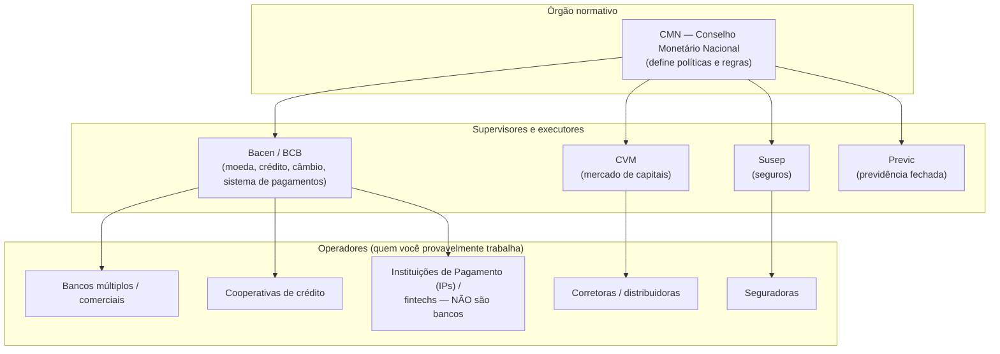
```mermaid
graph TD
    subgraph Normativo["Órgão normativo"]
        CMN["CMN — Conselho Monetário Nacional<br/>(define políticas e regras)"]
    end

    subgraph Supervisores["Supervisores e executores"]
        BACEN["Bacen / BCB<br/>(moeda, crédito, câmbio, sistema de pagamentos)"]
        CVM["CVM<br/>(mercado de capitais)"]
        SUSEP["Susep<br/>(seguros)"]
        PREVIC["Previc<br/>(previdência fechada)"]
    end

    subgraph Operadores["Operadores (quem você provavelmente trabalha)"]
        BANCOS["Bancos múltiplos / comerciais"]
        COOP["Cooperativas de crédito"]
        IP["Instituições de Pagamento (IPs) /<br/>fintechs — NÃO são bancos"]
        CORRETORAS["Corretoras / distribuidoras"]
        SEGURADORAS["Seguradoras"]
    end

    CMN --> BACEN
    CMN --> CVM
    CMN --> SUSEP
    CMN --> PREVIC

    BACEN --> BANCOS
    BACEN --> COOP
    BACEN --> IP
    CVM --> CORRETORAS
    SUSEP --> SEGURADORAS
```

### Ponto de atenção técnico: Banco x Instituição de Pagamento (IP)

Uma diferença que aparece direto em specs de integração:

| | Banco (múltiplo/comercial) | Instituição de Pagamento (IP) |
|---|---|---|
| Capta depósito à vista? | Sim | Não — mantém conta de pagamento, com recursos de terceiros |
| Os recursos do cliente entram no balanço? | Sim (viram passivo e podem lastrear crédito) | Não — devem ficar **segregados** |
| Concede crédito com recursos captados? | Sim, é o modelo de negócio | Não com recursos de conta de pagamento |
| Participa do STR diretamente? | Normalmente sim | Frequentemente indireto, via **banco liquidante** (instituição com conta no Bacen que liquida em nome de terceiros) |
| Regulador | Bacen, sob regras do CMN | Bacen, regime específico de IP |

Isso importa porque, ao integrar um parceiro, você precisa saber se ele é **participante direto** do SPB (tem conta própria no Bacen — Reservas Bancárias, e Conta PI se participa do SPI) ou **participante indireto** (não tem conta no Bacen e liquida através de um **banco liquidante**, que é a instituição com conta que liquida em nome de terceiros). Isso muda o desenho de conciliação e o tempo de liquidação: você concilia contra quem liquida, não contra o Bacen.

### Checkpoint

1. Quem normatiza e quem supervisiona: qual é a diferença prática entre CMN e Bacen para o seu backlog?
2. Uma instituição de pagamento pode emprestar o dinheiro que está na conta de pagamento do cliente?
3. O que muda na sua conciliação quando o parceiro é participante indireto do SPB?
4. Quem regula uma corretora: Bacen ou CVM?

<details>
<summary>Respostas</summary>

(1) O CMN publica a regra (resoluções) e não executa nada; o Bacen constrói, opera e fiscaliza a infraestrutura técnica. Uma exigência "do CMN" vem como norma; um "o Bacen rejeitou" vem como erro de integração. (2) Não — são recursos de terceiros, segregados e fora do balanço da IP. (3) Você passa a conciliar contra o banco liquidante, não contra o Bacen, e o tempo de liquidação ganha um salto a mais. (4) CVM, no mercado de capitais — embora o Bacen regule as instituições financeiras que também atuam ali.

</details>

---

## 8. O Bacen como orquestrador técnico

Antes de falar de PIX ou boleto, dois conceitos de infraestrutura aparecem em praticamente toda integração bancária:

### RSFN — Rede do Sistema Financeiro Nacional

É a rede privada que interliga o Bacen às instituições financeiras. Os serviços centrais (STR, SPI, DICT, SCR) **só respondem a máquinas conectadas a ela**, com certificados previamente registrados.

> **Analogia:** é uma VPN corporativa, não a internet pública. Você não "chama o endpoint do Bacen" de qualquer lugar com uma chave de API — o acesso pressupõe estar dentro da rede, e a identidade do participante é o certificado, não um token.

A segurança tem duas camadas que vale distinguir: **mTLS** (*mutual TLS*: além do servidor provar sua identidade ao cliente, como no HTTPS comum, o cliente também precisa apresentar certificado válido — as duas pontas se autenticam) e **HSM** (*Hardware Security Module*: um dispositivo físico dedicado que guarda chaves privadas e assina operações sem nunca expor a chave ao sistema operacional).

### ISPB — Identificador do Sistema de Pagamentos Brasileiro

Todo participante do SPB recebe um código numérico único de 8 dígitos, o **ISPB**. Ele **não substituiu** o antigo código COMPE de 3 dígitos (ex.: 001 = Banco do Brasil) — os dois **coexistem**: o COMPE segue em uso em arquivos e produtos legados como identificação do banco, e o ISPB é o identificador do participante no SPB. É o que aparece:

- no cabeçalho das mensagens de pagamento do PIX (o formato `pacs.008`, explicado no capítulo 10);
- nas chaves do DICT (associadas à conta e ao ISPB do PSP);
- nos arquivos CNAB, como código do banco.

Na prática, você vai precisar dos dois e de uma tabela de correspondência entre eles — o Bacen publica a relação oficial de participantes com ISPB e código COMPE. Nem toda instituição com ISPB tem código COMPE (é o caso de muitas IPs), o que costuma quebrar integrações que assumem que todo participante tem os dois.

### Certificados: a parte que ninguém documenta e todo mundo sofre

mTLS e HSM explicam *como* a autenticação funciona. O que costuma faltar no material é a operação disso — e certificado é operação, não configuração.

Os certificados usados na RSFN e nas APIs do SFN vêm da **ICP-Brasil** (Infraestrutura de Chaves Públicas Brasileira), a hierarquia oficial de certificação digital do país, com a raiz mantida pelo ITI e emissão delegada a Autoridades Certificadoras credenciadas. É a mesma família do e-CNPJ que a empresa já usa para nota fiscal, com finalidades e perfis distintos.

O ciclo de vida que o seu time vai operar:

| Etapa | O que acontece | Onde dói |
|---|---|---|
| **Emissão** | Geração do par de chaves, validação presencial ou por vídeo, emissão pela AC | Leva dias, exige pessoa jurídica com representante legal disponível |
| **Instalação** | Chave privada entra no HSM; certificado é registrado no Bacen e nos parceiros | Cada contraparte tem seu próprio processo de registro, e nenhum é instantâneo |
| **Rotação** | Antes de vencer, emitir o novo, registrar em todos, virar o tráfego | O ponto de falha real: o novo precisa estar registrado **em todas as contrapartes** antes de o antigo expirar |
| **Revogação** | Comprometimento de chave, mudança societária, encerramento | Efeito imediato e sem aviso prévio ao seu sistema |
| **Expiração** | Validade típica de 1 a 3 anos | Vence às 23h59 de um sábado, sem exceção |

Três práticas que evitam o incidente clássico:

- **Monitore validade como métrica, com alerta em dias restantes** (60, 30, 7). Um certificado vencido derruba a integração inteira de uma vez, sem degradação gradual — é o tipo de falha que não avisa antes.
- **Suporte dois certificados válidos simultaneamente** durante a janela de rotação. Trocar de forma atômica exige que todas as contrapartes virem no mesmo instante, o que não acontece.
- **Nunca versione chave privada em repositório**, nem "temporariamente para o ambiente de homologação". A chave vive no HSM; o que circula é a requisição assinada.

### Checkpoint

1. Por que não basta ter uma chave de API para chamar o DICT?
2. Qual a diferença entre TLS e mTLS, e o que o HSM acrescenta?
3. ISPB substituiu o código COMPE?
4. Qual é a falha mais previsível de uma integração com o Bacen, e como se evita?

<details>
<summary>Respostas</summary>

(1) Porque o acesso pressupõe estar dentro da RSFN, a rede privada que interliga o Bacen às instituições, com certificado previamente registrado — a identidade do participante é o certificado, não um token. (2) No TLS comum só o servidor prova identidade; no mTLS as duas pontas apresentam certificado. O HSM guarda a chave privada em hardware dedicado e assina sem nunca expô-la ao sistema operacional. (3) Não — os dois coexistem: o COMPE segue em arquivos e produtos legados, o ISPB identifica o participante no SPB, e nem toda IP tem COMPE. (4) Certificado vencido. Evita-se monitorando validade com alerta em dias restantes e mantendo dois certificados válidos durante a rotação.

</details>

---

## 9. Sistema de Pagamentos Brasileiro (SPB)

O SPB é o guarda-chuva que engloba **todas** as infraestruturas de mercado financeiro (IMFs) responsáveis por compensar e liquidar valores no Brasil — PIX, TED, boleto, cartões, títulos públicos, ações. Pense nele como "o barramento de liquidação nacional", com o Bacen operando a peça mais crítica: o **STR**.

- **STR (Sistema de Transferência de Reservas)** — operado pelo próprio Bacen. É onde ocorre a **Liquidação Bruta em Tempo Real (LBTR)**: cada transação é liquidada uma a uma, em moeda de banco central, sem esperar lote. É o "coração" do SPB — o saldo final entre bancos nos trilhos tradicionais passa por aqui, nas contas de Reservas Bancárias que cada banco mantém no Bacen.
- **SPI (Sistema de Pagamentos Instantâneos)** — também operado pelo Bacen, também **LBTR**, mas dedicado ao PIX e rodando 24/7/365. Liquida entre **Contas PI**, não entre Reservas. É motor de **liquidação**, não câmara de compensação — o capítulo 10 detalha.
- **CIP / Núclea** — câmara privada (associação sem fins lucrativos, hoje rebatizada "Núclea") responsável por **compensar** grande parte do varejo, por meio de dois sistemas que vale nomear: o **SILOC**, que compensa boletos, DOC e TEC em modelo LDL com netting multilateral, e o **SITRAF**, que processa TED dentro do seu horário de funcionamento. No PIX, a Núclea presta serviços de conectividade e tecnologia às instituições participantes — não opera o motor de liquidação. Compensação ≠ liquidação: a Núclea apura o líquido devido entre bancos; quem efetivamente move o dinheiro entre as contas de reserva é o STR.
- **SELIC** — sistema do Bacen para custódia e liquidação de **títulos públicos federais**.
- **B3** — liquida ações, derivativos e renda fixa privada.

**Um ponto que o diagrama abaixo torna explícito: TED tem dois caminhos.** Dentro do horário do SITRAF, a ordem trafega pela Núclea, que apura e aciona o STR. Fora dele — e para valores acima do limite operacional da câmara — a instituição envia a ordem diretamente ao STR. Nos dois casos a liquidação final acontece no mesmo lugar; o que muda é o caminho até lá. Se alguém disser que "TED passa pela Núclea" e outra pessoa disser que "TED vai direto ao STR", as duas estão certas em contextos diferentes.

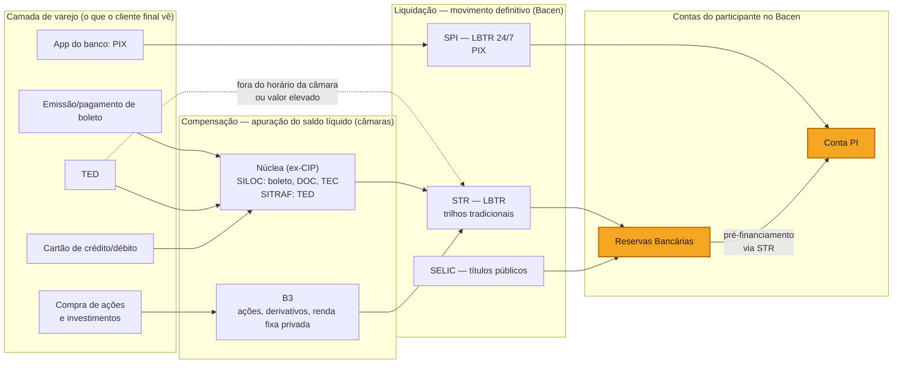
```mermaid
graph LR
    classDef destaque fill:#f5a623,stroke:#b36d00,color:#1a1a1a,stroke-width:2px

    subgraph Varejo["Camada de varejo (o que o cliente final vê)"]
        PIX_APP["App do banco: PIX"]
        BOLETO_APP["Emissão/pagamento de boleto"]
        TED_APP["TED"]
        CARTAO_APP["Cartão de crédito/débito"]
        INVEST_APP["Compra de ações<br/>e investimentos"]
    end

    subgraph Compensacao["Compensação — apuração do saldo líquido (câmaras)"]
        NUCLEA["Núclea (ex-CIP)<br/>SILOC: boleto, DOC, TEC<br/>SITRAF: TED"]
        B3C["B3<br/>ações, derivativos, renda fixa privada"]
    end

    subgraph Liquidacao["Liquidação — movimento definitivo (Bacen)"]
        STR["STR — LBTR<br/>trilhos tradicionais"]
        SPI["SPI — LBTR 24/7<br/>PIX"]
        SELIC["SELIC — títulos públicos"]
    end

    subgraph Contas["Contas do participante no Bacen"]
        RESERVAS["Reservas Bancárias"]
        CONTAPI["Conta PI"]
    end

    PIX_APP --> SPI
    BOLETO_APP --> NUCLEA
    TED_APP --> NUCLEA
    TED_APP -.->|"fora do horário da câmara<br/>ou valor elevado"| STR
    CARTAO_APP --> NUCLEA
    INVEST_APP --> B3C

    NUCLEA --> STR
    B3C --> STR
    STR --> RESERVAS
    SELIC --> RESERVAS
    SPI --> CONTAPI
    RESERVAS -->|"pré-financiamento<br/>via STR"| CONTAPI

    class RESERVAS,CONTAPI destaque
```

Duas leituras que o diagrama deixa explícitas e que a maior parte do material sobre SPB embaralha:

1. **SPI não é câmara.** Ele está do lado da liquidação, junto do STR, porque é LBTR: liquida uma transação por vez, sem apurar saldo líquido de ninguém. Colocá-lo ao lado da Núclea desfaria a distinção compensação × liquidação que o capítulo 3 chamou de a mais importante da apostila.
2. **Conta PI é galho de Reservas.** A seta de pré-financiamento é o que amarra as duas camadas: o participante move recursos de Reservas para a Conta PI, via STR, antes de precisar deles no PIX.

### O catálogo de mensagens do SFN

Toda comunicação com os sistemas centrais do Bacen é **mensagem catalogada**, não chamada REST livre. O Bacen publica o **Catálogo de Serviços do SFN**, que define cada mensagem, seu leiaute XML, quem pode enviá-la e em que fluxo ela cabe.

Os códigos seguem o padrão `<grupo><número>`, e você vai encontrá-los crus em log e em manual de integração:

| Mensagem | Grupo | O que faz |
|---|---|---|
| `STR0004` | STR | Transferência de fundos entre contas no Bacen por conta de terceiros — o esqueleto da TED |
| `STR0008` | STR | Lançamento por conta própria da instituição |
| `SEL1009` | Selic | Instituição requisita liquidez em Conta PI (a linha de redesconto do SPI) |
| `PAG` / `SPB` | Diversos | Famílias específicas por sistema e produto |

O PIX é a exceção que confirma a regra: ele usa **ISO 20022** (`pacs.008`, `pacs.004`) em vez do catálogo legado, porque nasceu depois e alinhado ao padrão internacional. Quando você vir alguém falando "STR0004" e outra pessoa falando "pacs.008", são dois dialetos da mesma ideia — mensagem estruturada, com contrato rígido, trafegando na RSFN.

**Para o dev:** se seu sistema processa boleto, ele gera eventos que passam pela Núclea antes de virarem liquidação no STR. Se faz TED, o caminho depende do horário. E se faz PIX, ele não toca em nenhuma câmara — vai direto ao SPI, que é o assunto do próximo capítulo.

### Checkpoint

1. O SPI é uma câmara de compensação? Por quê?
2. A Núclea opera o motor de liquidação do PIX?
3. Quais são os dois caminhos possíveis de uma TED até a liquidação final?
4. O que é pré-financiamento da Conta PI e por que ele existe?
5. Qual a diferença entre a taxa Selic e o sistema SELIC?

<details>
<summary>Respostas</summary>

(1) Não. É motor de liquidação LBTR — liquida uma transação por vez, sem apurar saldo líquido, o que é a definição do que compensação faz. (2) Não. O SPI é operado pelo Bacen; a Núclea presta conectividade e tecnologia às instituições participantes. (3) Pela Núclea (SITRAF), que apura e aciona o STR, ou diretamente ao STR fora do horário da câmara. A liquidação final é a mesma nos dois casos. (4) É a transferência de recursos da conta de Reservas para a Conta PI, via STR, antes de serem necessários. Existe porque a Conta PI não pode ficar negativa e o PIX roda 24/7, inclusive quando o STR está fechado. (5) A taxa Selic é a taxa básica de juros definida pelo Copom; o sistema SELIC é a infraestrutura de custódia e liquidação de títulos públicos federais. Mesmo nome, coisas diferentes.

</details>

---

## 10. PIX: arquitetura técnica em detalhe

Antes de tudo, um termo regulatório que aparece o tempo todo: **arranjo de pagamento** é o conjunto de regras que faz um meio de pagamento funcionar entre várias instituições — quem pode participar, como as mensagens trafegam, prazos, responsabilidades e resolução de disputas. Quem define essas regras é o **instituidor do arranjo**. No caso das bandeiras de cartão, o instituidor é a própria empresa privada (Visa, Mastercard); no caso do PIX, o instituidor é o **Bacen**. É essa diferença que explica por que o PIX tem regras uniformes e obrigatórias para todos.

O PIX, portanto, não é "mais um método de pagamento" no sentido de gateway comercial — é um **arranjo de pagamentos instantâneos criado e operado pelo Bacen**, com API pública especificada (repositórios `bacen/pix-api` e `bacen/pix-dict-api` no GitHub) e peças bem definidas:

- **SPI (Sistema de Pagamentos Instantâneos)** — motor de liquidação do Bacen. Roda 24/7/365, liquida em segundos, um a um (também é LBTR, como o STR, mas dedicado ao PIX). Regulado pela **Resolução BCB nº 195/2022**.
- **Conta PI (Conta Pagamentos Instantâneos)** — e aqui está a peça que quase todo material omite: o PIX **não liquida em Reservas Bancárias**. Cada participante direto do SPI mantém no Bacen uma **Conta PI** dedicada, e é entre Contas PI que os fundos se movem. Ela **nunca pode ficar negativa**, ou seja, é pré-financiada: o participante transfere recursos da conta de Reservas para a Conta PI, via STR, antes de precisar deles. O saldo é remunerado pela Selic.

  > **Analogia:** é crédito pré-pago de API. Você carrega saldo antes e vai consumindo; se zerar às 3h da manhã de domingo, as chamadas falham — não existe "fatura depois". Por isso a instituição precisa provisionar liquidez para a madrugada e o fim de semana, quando o STR está fechado.
- **DICT (Diretório de Identificadores de Contas Transacionais)** — o "diretório de chaves" do PIX.

  > **Analogia:** o DICT é o DNS do dinheiro. Você digita um nome amigável (a chave) e ele devolve o endereço real (instituição, agência e conta), do mesmo jeito que o DNS traduz um domínio em IP. E, como no DNS, existe cache com prazo de validade e a resolução acontece antes de a conexão ser aberta.

  Na prática, mapeia chave PIX (CPF/CNPJ, e-mail, telefone ou **EVP** — *Endereço Virtual de Pagamento*, a chave aleatória gerada pelo sistema, que não expõe nenhum dado pessoal do titular) → ISPB + agência + conta do PSP recebedor. É consultado pelo PSP do pagador antes de iniciar a transação.
- **PSP (Prestador de Serviço de Pagamento)** — qualquer instituição participante do arranjo PIX (banco, IP, cooperativa).
- **Mensageria ISO 20022** — as mensagens entre PSPs seguem o **ISO 20022**, padrão internacional que define um dicionário comum de mensagens financeiras em XML, adotado por sistemas de pagamento no mundo todo. Cada tipo de mensagem tem um código: `pacs` é a família de mensagens entre instituições (*payments clearing and settlement*), e `pacs.008` especificamente é a **ordem de transferência de crédito** — na prática, "pague este valor desta conta para aquela". Vale conhecer a nomenclatura porque ela aparece crua em log e em documentação de integração.
- **Autenticação mTLS** — toda comunicação com DICT/SPI exige certificado ISPB e assinatura digital das requisições (recomendação de HSM em produção).

### Fluxo de um PIX (chave → confirmação)

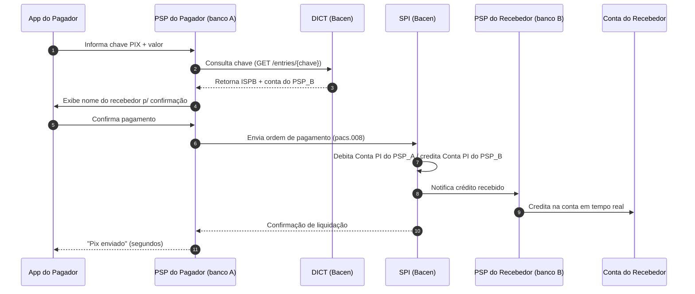
```mermaid
sequenceDiagram
    autonumber
    participant Pagador as App do Pagador
    participant PSP_A as PSP do Pagador (banco A)
    participant DICT as DICT (Bacen)
    participant SPI as SPI (Bacen)
    participant PSP_B as PSP do Recebedor (banco B)
    participant Recebedor as Conta do Recebedor

    Pagador->>PSP_A: Informa chave PIX + valor
    PSP_A->>DICT: Consulta chave (GET /entries/{chave})
    DICT-->>PSP_A: Retorna ISPB + conta do PSP_B
    PSP_A->>Pagador: Exibe nome do recebedor p/ confirmação
    Pagador->>PSP_A: Confirma pagamento
    PSP_A->>SPI: Envia ordem de pagamento (pacs.008)
    SPI->>SPI: Debita Conta PI do PSP_A / credita Conta PI do PSP_B
    SPI->>PSP_B: Notifica crédito recebido
    PSP_B->>Recebedor: Credita na conta em tempo real
    SPI-->>PSP_A: Confirmação de liquidação
    PSP_A-->>Pagador: "Pix enviado" (segundos)
```

**Por que isso importa para o dev:**

- **Gestão de caixa 24/7.** Como o PIX roda fora do horário do STR e a Conta PI não pode zerar, o participante precisa provisionar liquidez para noites, fins de semana e feriados. Existe até um **redesconto no SPI** para necessidades de liquidez fora do horário regular do STR — nesse caso, com custo. A linha nasceu junto com o PIX, pela Resolução BCB nº 20/2020, e hoje é disciplinada pela **Resolução BCB nº 175/2021**, que a revogou e consolidou junto com o redesconto do STR. A solicitação trafega pelo Selic, na mensagem `SEL1009`.
- **Falha por saldo insuficiente é um cenário real**, não teórico. Seu tratamento de erro precisa distinguir "recusado pelo recebedor" de "sem liquidez no participante".
- **Participante direto × indireto.** Só o direto tem Conta PI; o indireto liquida através de um direto. Isso muda o desenho de conciliação — você concilia contra quem liquida, não contra o Bacen.

> **Curiosidade que vale citar em code review:** a idempotência no PIX não é boa prática opcional — a regulamentação do Bacen **exige** que os participantes preparem seus sistemas para observar o princípio da idempotência.

### O DICT além da consulta

Material sobre PIX quase sempre para na resolução de chave. Mas quem implementa o lado do PSP descobre rápido que o DICT tem um conjunto de operações com estados, prazos e efeitos jurídicos — e que cada uma delas vira uma máquina de estados no seu sistema.

#### Cadastro, exclusão e o limite de chaves

Cada chave pertence a **uma conta transacional só**. O PSP cadastra, consulta e exclui chaves do seu próprio cliente. Os limites de quantidade de chaves por conta são regulatórios e diferentes para PF e PJ — e são configuração, não constante.

#### Reivindicação: portabilidade × posse

Aqui está a operação que mais gera bug, porque são **duas coisas diferentes com o mesmo mecanismo**:

| Tipo | Quando acontece | Quem confirma |
|---|---|---|
| **Portabilidade** | A chave já é sua e você quer levá-la para outro PSP | O titular confirma no PSP **atual** (doador) |
| **Posse** (*ownership claim*) | A chave está cadastrada por outra pessoa e você prova ser o dono — telefone reciclado, e-mail antigo | O titular atual precisa reagir, ou perde por decurso de prazo |

O fluxo é assimétrico de propósito. Numa portabilidade, silêncio do doador **não** entrega a chave automaticamente do mesmo jeito que numa reivindicação de posse — os prazos e o desfecho do silêncio diferem, e estão no Manual Operacional do DICT, que é atualizado com frequência.

O que isso exige do seu sistema:

- **A reivindicação é uma entidade com ciclo de vida próprio**, não um campo na chave: aberta, aguardando confirmação, confirmada, cancelada, expirada. Ela tem prazo, e prazo que expira sozinho precisa de um agendador, não de um `if` no momento da consulta.
- **Notificar o cliente é requisito, não cortesia.** Se a chave dele está sendo reivindicada e ele não é avisado, ele perde a chave por inação — e a reclamação vai para a ouvidoria.
- **O estado do DICT é a verdade, o seu é cache.** Reconcilie periodicamente.

#### Relato de infração (*infraction report*)

Quando um PSP identifica indício de fraude numa transação, ele registra um **relato de infração** no DICT contra a conta recebedora. É o gatilho do MED (capítulo 15) e o mecanismo pelo qual a informação de fraude circula entre instituições que não têm contrato entre si.

Do lado de quem recebe um relato, existe prazo para analisar e responder — aceitando ou rejeitando. Ignorar não é uma opção disponível.

#### Devolução: o `pacs.004`

O capítulo 15 trata da devolução pelo lado do MED, que é a visão de produto. Pelo lado da mensageria, devolver um PIX é enviar um **`pacs.004`** (*payment return*), que carrega o identificador da transação original e um **código de motivo** padronizado — devolução por solicitação do pagador, por fraude confirmada, por erro operacional do PSP, por conta encerrada.

Três coisas que decorrem disso e que mudam a modelagem:

1. **Devolução é transação nova, com identidade própria.** Ela tem seu próprio `EndToEndId` e referencia a original. Não é um `UPDATE status = 'devolvido'` na transação que já existe.
2. **Devolução parcial existe.** O valor devolvido pode ser menor que o original, e pode haver várias devoluções para a mesma transação.
3. **Devolução tem prazo e tem motivo tipado.** O motivo define o tratamento contábil e a resposta ao cliente; guardá-lo como texto livre é jogar fora a informação.

### Cobranças e QR Code (`cob`, `cobv`)

Do lado do recebedor, a API PIX expõe endpoints padronizados como `/cob` (cobrança imediata) e `/cobv` (cobrança com vencimento), além de webhooks para notificação assíncrona de pagamento — é o que você provavelmente já implementou se gerou QR Codes PIX dinâmicos. A API segue **versionamento semântico** (major/minor/patch) e é a mesma especificação para qualquer PSP, o que padroniza a integração de gateways e ERPs com múltiplos bancos.

**Os dois tipos de QR não são variações de estilo — são objetos diferentes:**

| | **QR estático** | **QR dinâmico** |
|---|---|---|
| O que o código carrega | A chave e, opcionalmente, um valor fixo | Uma **URL** que o app do pagador consulta para obter os dados |
| Valor | Fixo ou aberto (o pagador digita) | Definido pelo emissor, por cobrança |
| Reutilizável | Sim — o mesmo adesivo na parede da padaria serve para sempre | Não — um por cobrança |
| Identificador | Sem **TXID** útil, ou com um TXID fixo | TXID único por cobrança |
| Conciliação | Difícil: várias pessoas pagam o mesmo QR | Trivial: cada pagamento casa com uma cobrança |
| Onde se usa | Balcão, feira, doação | E-commerce, boleto-PIX, cobrança emitida |

O **TXID** (*transaction identifier*) é o campo que amarra a cobrança ao pagamento. É uma cadeia alfanumérica definida pelo **recebedor**, entregue no QR e devolvida na liquidação — a chave de correlação equivalente ao "seu número" do boleto. Ele tem limites de tamanho por contexto (o padrão PIX admite até 35 posições em cobrança; o CNAB, como a seção 11.7 mostra, corta em 30), e essa divergência de limite é fonte real de bug em quem gera TXID longo.

> **Analogia:** o QR estático é uma URL de página; o dinâmico é uma URL com token de sessão. O primeiro identifica *para quem* pagar; o segundo identifica *qual cobrança* está sendo paga. Conciliar em cima do estático é o mesmo problema de rastrear conversão sem parâmetro de campanha.

### Pix Automático (2025/2026)

Novidade regulatória recente: o **Pix Automático** é o equivalente ao débito automático, mas multibancos e padronizado pelo Bacen — o cliente autoriza uma vez, via Open Finance, e cobranças recorrentes fluem sem convênio bilateral entre empresa e banco.

### Checkpoint

1. Onde o PIX liquida, e por que não é em Reservas Bancárias?
2. O que acontece com a Conta PI de um participante às 3h de um domingo, se ela zerar?
3. Qual a diferença entre portabilidade e reivindicação de posse de uma chave?
4. Devolver um PIX é alterar a transação original?
5. Por que conciliar pagamentos de um QR estático é mais difícil que de um dinâmico?
6. Um participante indireto do SPI tem Conta PI?

<details>
<summary>Respostas</summary>

(1) Em Conta PI, uma conta dedicada de cada participante direto no Bacen, pré-financiada a partir de Reservas via STR. O SPI roda 24/7 e o STR não, então o PIX precisa de uma conta que funcione fora do horário bancário. (2) As transações falham por falta de liquidez — não existe "fatura depois". Daí a necessidade de provisionar caixa para madrugada e fim de semana, e a linha de redesconto do SPI. (3) Na portabilidade a chave já é sua e você a leva para outro PSP; na reivindicação de posse você alega ser o dono de uma chave cadastrada por terceiro. Os prazos e o efeito do silêncio do titular atual são diferentes. (4) Não — é uma transação nova (`pacs.004`), com identidade própria, que referencia a original e carrega um motivo tipado. Pode inclusive ser parcial e repetida. (5) Porque o estático é reutilizável e não carrega TXID por cobrança: várias pessoas pagam o mesmo código, e casar pagamento com cobrança vira heurística de valor e horário. (6) Não — só o participante direto tem. O indireto liquida através de um direto, e é contra esse direto que você concilia.

</details>

---

## 11. TED, boleto e CNAB

### 11.1 TED

Nasceu na reforma do SPB de 2002 para permitir liquidação no mesmo dia, em contraste com o DOC (que levava um dia útil). A ordem de TED percorre um dos dois caminhos descritos no capítulo 9 — pelo SITRAF da Núclea, dentro do horário da câmara, ou diretamente ao STR — e termina, nos dois casos, numa liquidação definitiva entre contas de Reservas Bancárias.

**O DOC e a TEC** (Transferência Especial de Crédito, usada por empresas para pagamento de benefícios) **foram descontinuados como produtos de varejo em 2024** por decisão da Febraban: 15 de janeiro foi o último dia de emissão e agendamento, e 29 de fevereiro o encerramento definitivo. Restaram apenas usos residuais entre instituições financeiras. Na prática, se você encontrar suporte a DOC num fluxo de cliente em sistema legado, é código morto.

**A TED não foi extinta** e não há previsão nesse sentido — segue ativa e é o trilho preferencial para grandes valores, ainda que amplamente ofuscada pelo PIX no varejo.

### 11.2 O boleto bancário

O boleto é uma ordem de cobrança que o **cedente** (quem tem a receber) emite contra o **sacado** — o termo do jargão bancário para **o devedor do título, quem vai pagar**. Você vai encontrar "sacado" e "pagador" usados como sinônimos: o primeiro é o vocabulário do título de crédito, o segundo é o do arranjo de pagamento.

Desde as regras mais recentes do SFN, **todo boleto precisa ser registrado numa base centralizada operada pela Núclea** antes de ser apresentado ao pagador — isso elimina fraudes de boleto "não registrado" e permite pagamento em qualquer banco, não só no emissor.

> **Fio condutor — a Padaria do João.** Para receber os R$ 10.000 do Mercado da Esquina, a padaria emite um boleto com vencimento em 30 dias. Ela é o **cedente**; o Mercado é o **sacado**. O banco que registra o título é apenas o intermediário — e qual papel exatamente ele exerce depende da carteira, que é o assunto da seção 11.5.

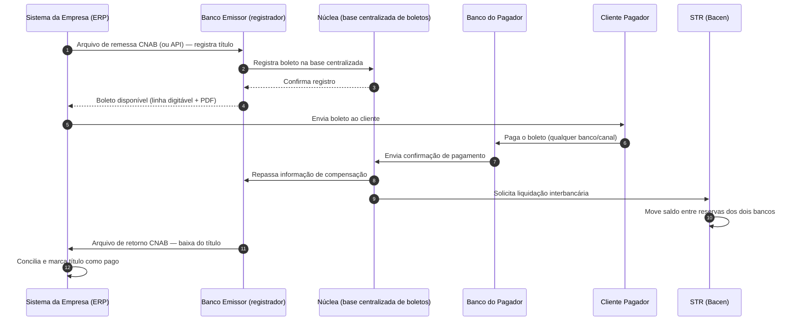
```mermaid
sequenceDiagram
    autonumber
    participant ERP as Sistema da Empresa (ERP)
    participant BancoEmissor as Banco Emissor (registrador)
    participant Nuclea as Núclea (base centralizada de boletos)
    participant BancoPagador as Banco do Pagador
    participant Pagador as Cliente Pagador
    participant STR as STR (Bacen)

    ERP->>BancoEmissor: Arquivo de remessa CNAB (ou API) — registra título
    BancoEmissor->>Nuclea: Registra boleto na base centralizada
    Nuclea-->>BancoEmissor: Confirma registro
    BancoEmissor-->>ERP: Boleto disponível (linha digitável + PDF)
    ERP->>Pagador: Envia boleto ao cliente

    Pagador->>BancoPagador: Paga o boleto (qualquer banco/canal)
    BancoPagador->>Nuclea: Envia confirmação de pagamento
    Nuclea->>BancoEmissor: Repassa informação de compensação
    Nuclea->>STR: Solicita liquidação interbancária
    STR->>STR: Move saldo entre reservas dos dois bancos
    BancoEmissor->>ERP: Arquivo de retorno CNAB — baixa do título
    ERP->>ERP: Concilia e marca título como pago
```

**Nota prática:** compensação e liquidação são etapas **distintas** — a compensação confirma que o pagamento ocorreu e dispara a comunicação entre bancos; a liquidação é o momento em que o valor de fato muda de mãos entre as instituições no STR. Prazos recentes de mercado vêm migrando de D+1 para modelos D+0 em parte do fluxo, o que impacta diretamente sua **régua de cobrança** — a sequência escalonada de ações por faixa de atraso, detalhada na seção 13.1 — e a baixa automática.

#### DDA

O **DDA (Débito Direto Autorizado)** é o serviço que entrega o boleto eletronicamente ao pagador, dentro do app do banco dele, dispensando o envio do documento impresso ou em PDF. Para quem emite, muda pouco no fluxo de registro — mas muda a expectativa do cliente, que passa a ver a cobrança aparecer sozinha, e reduz o espaço para fraude de boleto adulterado enviado por e-mail.

---

### 11.3 Código de barras e linha digitável

Um boleto **carrega os próprios dados**. O banco pagador não precisa consultar ninguém para saber quanto cobrar e para quem mandar: está tudo nos 44 dígitos do código de barras. Isso é elegante e é também a razão de existirem tantos dígitos verificadores — sem consulta, o único jeito de detectar erro de digitação é redundância embutida.

São dois objetos, com a mesma informação em formatos diferentes:

- **Código de barras** — 44 dígitos, lidos por leitor óptico. É a forma canônica.
- **Linha digitável** — 47 dígitos, para o humano digitar. É uma **reorganização** do código de barras, com três dígitos verificadores extras.

#### A anatomia dos 44 dígitos

```
 341 9 5 1000 0000012345 1234567890123456789012345
  │  │ │  │       │                  │
  │  │ │  │       │                  └── 20-44: campo livre (25)
  │  │ │  │       │                       definido por CADA banco
  │  │ │  │       └───────────────────── 10-19: valor (10, 2 decimais implícitas)
  │  │ │  └───────────────────────────── 06-09: fator de vencimento (4)
  │  │ └──────────────────────────────── 05: DV geral (módulo 11)
  │  └────────────────────────────────── 04: moeda (9 = real)
  └───────────────────────────────────── 01-03: banco (código COMPE)
```

O **campo livre** de 25 posições é onde mora quase toda a dor: cada banco define seu próprio conteúdo ali — agência, conta, carteira, nosso número, com ordens e tamanhos diferentes. As posições 1 a 19 são padrão nacional; da 20 em diante é dialeto.

#### Da barra para a linha: a reorganização

A linha digitável não acrescenta informação. Ela **embaralha** o código de barras em cinco campos, cada um curto o bastante para o olho humano não se perder:

| Campo | Conteúdo | Vem de | DV |
|---|---|---|---|
| 1 | banco + moeda + campo livre `[1..5]` | barras 1-4 e 20-24 | módulo 10 |
| 2 | campo livre `[6..15]` | barras 25-34 | módulo 10 |
| 3 | campo livre `[16..25]` | barras 35-44 | módulo 10 |
| 4 | DV geral do código de barras | barra 5 | — |
| 5 | fator de vencimento + valor | barras 6-19 | — |

Repare na inversão: o DV geral, que na barra fica na quinta posição, na linha digitável vai para o **quarto campo**, sozinho. E o fator e o valor, que na barra vêm antes do campo livre, na linha vão para o **fim**. Um parser que assume a mesma ordem nos dois formatos produz um número válido e completamente errado.

#### Os dois dígitos verificadores

**Módulo 10** — usado nos campos 1, 2 e 3 da linha digitável. Da direita para a esquerda, multiplique alternadamente por 2 e 1; se o produto passar de 9, some seus algarismos; some tudo; o DV é o que falta para o próximo múltiplo de 10 (e 10 vira 0).

**Módulo 11** — usado no DV geral do código de barras. Sobre os 43 dígitos (os 44 sem a posição 5), da direita para a esquerda, aplique pesos ciclando de 2 a 9; some; `DV = 11 − (soma mod 11)`; e a regra que todo mundo esquece: **se o resultado for 0, 10 ou 11, o DV é 1.**

```python
def dv_modulo10(campo: str) -> int:
    soma = 0
    for i, ch in enumerate(reversed(campo)):
        p = int(ch) * (2 if i % 2 == 0 else 1)
        soma += p - 9 if p > 9 else p
    return (10 - soma % 10) % 10


def dv_geral_modulo11(barra43: str) -> int:
    pesos = [2, 3, 4, 5, 6, 7, 8, 9]
    soma = sum(int(ch) * pesos[i % 8]
               for i, ch in enumerate(reversed(barra43)))
    dv = 11 - soma % 11
    return 1 if dv in (0, 10, 11) else dv
```

#### O fator de vencimento e o rollover que quebrou sistemas

O vencimento não vai no boleto como data. Vai como **número de dias decorridos desde 07/10/1997** — quatro dígitos, e só. O fator `1000` é `03/07/2000`.

Quatro dígitos acabam. O fator `9999` caiu em **21/02/2025**, e a partir de `22/02/2025` a numeração **voltou para `1000`**, por definição da Febraban.

E aqui está o problema, que é bonito de tão didático: um sistema que calcula o fator como `(vencimento − 07/10/1997).days` funcionou perfeitamente por 25 anos e passou a produzir número errado da noite para o dia. Boletos com vencimento posterior ao rollover saem com fator absurdo — ou com fator que aponta para uma data 27 anos no passado, dependendo de onde o overflow acontece.

A implementação correta trata o fator como **contador circular com base móvel**, não como diferença absoluta de datas:

```python
from datetime import date

BASE_ORIGINAL = date(1997, 10, 7)
ROLLOVER = date(2025, 2, 22)   # quando o fator voltou a 1000


def fator_vencimento(vencimento: date) -> int:
    if vencimento < ROLLOVER:
        return (vencimento - BASE_ORIGINAL).days
    return 1000 + (vencimento - ROLLOVER).days
```

Duas consequências práticas que valem mais que o código:

- **Quem lê o fator tem o mesmo problema.** Converter fator em data exige saber de qual ciclo ele veio. Se você processa boletos com vencimento antigo e novo na mesma base, precisa de uma regra de desambiguação — normalmente a janela de emissão do título.
- **Boleto sem vencimento existe.** Fator `0000` significa "sem data de vencimento". Seu parser não pode dividir por zero nem estourar ao encontrá-lo.

> **Analogia:** é o bug do ano 2000 em miniatura, com a diferença de que este já aconteceu e ninguém fez força-tarefa nacional. Todo campo de tamanho fixo que conta alguma coisa vai transbordar — a única pergunta é se você vai estar no plantão naquele dia.

#### O que validar, e em que ordem

Ao receber um código de barras ou uma linha digitável de fora do seu sistema, valide **antes de qualquer regra de negócio**:

1. **Tamanho** — 44 ou 47 dígitos, só dígitos. Boleto de concessionária e tributo tem regra própria e começa com `8`.
2. **DVs dos campos** (linha digitável, módulo 10) e **DV geral** (módulo 11). Um DV errado é erro de digitação; recusar já aqui evita uma consulta inútil.
3. **Coerência entre linha e barra**, quando você recebe as duas. Elas têm de ser conversíveis uma na outra.
4. **Valor e vencimento** contra o que o registro central diz. O boleto carrega os dados, mas o registro é a verdade — divergência é sinal de adulteração.

---

### 11.4 CNAB: o formato de arquivo

O **CNAB** — sigla de "Centro Nacional de Automação Bancária", área da **Febraban** (Federação Brasileira de Bancos, a associação do setor que padroniza leiautes e convenções interbancárias) — é o formato de arquivo de texto posicional usado para troca em lote entre empresa e banco: **remessa** (empresa → banco, ex.: registrar título) e **retorno** (banco → empresa, ex.: baixa de liquidação, rejeição).

Duas variantes convivem, e o número no nome é simplesmente **o tamanho de cada registro (linha) em caracteres**:

| | **CNAB 240** | **CNAB 400** |
|---|---|---|
| Tamanho do registro | 240 posições | 400 posições |
| Estrutura | Hierárquica: header de arquivo → header de lote → detalhes (**segmentos**, cada um um tipo de registro com um conjunto próprio de campos) → trailer de lote → trailer de arquivo | Plana: header → detalhes → trailer |
| Multiproduto | Sim, vários lotes/produtos no mesmo arquivo | Não, um produto por arquivo |
| Status | Padrão mais moderno | Legado, ainda muito usado em cobrança |

**Cuidado com a expectativa de portabilidade:** apesar de "padrão Febraban", cada banco publica seu próprio manual, com particularidades de campos e códigos de ocorrência.

> **Analogia:** é o "SQL padrão". Existe uma norma, todo mundo diz seguir, e mesmo assim seu código quebra ao trocar de banco de dados. CNAB é igual: uma família de dialetos, não um formato único. Parser sem configuração por instituição não sobrevive ao segundo banco.

**Dois campos de header que ninguém explica e todo mundo apanha:**

- **Convênio** — o código que identifica o **contrato entre a empresa e o banco** para aquele produto. Uma mesma empresa pode ter convênios distintos para cobrança e para pagamento, ou um por filial. Ele vai no header de arquivo ou de lote (a posição varia por banco e por produto) e é validado na entrada: convênio errado derruba o arquivo inteiro, normalmente com uma mensagem genérica.
- **NSA (Número Sequencial de Arquivo)** — o contador de arquivos trocados naquele convênio. Precisa ser **único e crescente**; repetição costuma ser rejeitada e furo na sequência costuma gerar alerta. A seção 11.8 mostra por que ele tem de ser incrementado dentro da transação de geração.

#### O vocabulário operacional: instruções e ocorrências

Três termos que aparecem em todo manual de banco:

- **Espécie do título** — o que originou a cobrança: DM (duplicata mercantil), DS (duplicata de serviço), NP (nota promissória), entre outras. Vai em campo próprio do registro e tem efeito jurídico, sobretudo na hora de protestar. No 240 o campo é numérico e o domínio varia por banco.
- **Instrução** — o comando que o cedente envia na **remessa** para o banco agir sobre um título já registrado: pedir baixa, mandar protestar, sustar protesto, conceder abatimento, alterar vencimento, prorrogar prazo.
- **Código de ocorrência** — o que o banco responde no **retorno**: entrada confirmada, entrada rejeitada, liquidação, baixa, alteração aceita, título encaminhado a cartório. Cada código carrega ainda um **motivo**, que é o campo que de fato explica por que algo foi recusado.

> **Analogia:** remessa e retorno formam um protocolo assíncrono de comando e resposta, correlacionado por identificador de título — parecido com uma fila de comandos e um tópico de eventos de resultado. A diferença é que o *round-trip* leva horas, não milissegundos, e a ordem de chegada não é garantida. Por isso o processamento do retorno precisa ser idempotente e tolerante a eventos fora de ordem.

O ponto de atenção prático: **a rejeição costuma ser silenciosa para o negócio**. O título "foi enviado", o arquivo "foi aceito", mas um registro individual pode ter sido recusado. Sem tratamento explícito dos códigos de rejeição, a empresa acredita estar cobrando um título que o banco nunca registrou.

---

### 11.5 Carteiras de cobrança

Aqui está um vocabulário que aparece como **campo obrigatório** em todo layout CNAB e que raramente é explicado: a **carteira de cobrança**.

Carteira é o contrato entre a empresa (o **cedente**, quem tem a receber) e o banco, definindo **qual papel o banco exerce sobre aqueles títulos**. E esse papel muda tudo — quem é o dono do crédito, quem assume o risco de calote e como o evento é contabilizado.

#### Cobrança simples

O banco é apenas **prestador de serviço**: registra os títulos, cobra, recebe e credita o valor na conta do cedente. Juridicamente atua como *mandatário* — um procurador do credor.

- O título continua pertencendo ao cedente do começo ao fim.
- Não há adiantamento de dinheiro nem operação de crédito.
- O risco de o sacado não pagar é **integralmente do cedente**.

> **Analogia:** o banco é um serviço de cobrança terceirizado, como um gateway que recebe por você. Ele processa e repassa, mas o recebível nunca deixa de ser seu — não há transferência de propriedade, só delegação de execução.

#### Cobrança vinculada

Aqui os títulos deixam de ser apenas objeto de cobrança e passam a **sustentar uma operação de crédito**: o cedente recebe dinheiro antes do vencimento. É um termo guarda-chuva com duas modalidades bem diferentes.

**Caucionada** — os títulos são dados em **garantia** (caução) de uma linha de crédito. O banco não vira dono deles; ele os mantém em custódia como lastro. Conforme os sacados pagam, o valor amortiza a dívida do cedente, ou a garantia é substituída por novos títulos, conforme o contrato.

**Descontada** — o cedente **endossa** os títulos ao banco, que antecipa o valor de face com **deságio** e passa a ser o credor. É a operação de desconto clássica.

> **Endosso** é a transferência da titularidade de um título de crédito para outra pessoa, feita por declaração no próprio título (ou, no mundo escritural, por registro na entidade competente). Quem endossa é o **endossante**; quem recebe é o **endossatário**. É o mecanismo jurídico que permite a um recebível circular — e é o que diferencia um título de crédito de um simples contrato bilateral.

> **Ponto que causa muito mal-entendido:** mesmo na descontada, o cedente normalmente **continua responsável** se o sacado não pagar — é a chamada coobrigação, ou direito de regresso. O banco cobra de volta. Ou seja, o risco não some com a antecipação; ele apenas fica adormecido até o vencimento.

| | **Simples** | **Caucionada** | **Descontada** |
|---|---|---|---|
| Cedente recebe antes do vencimento? | Não | Sim (como crédito) | Sim (valor de face com deságio) |
| Quem é o titular do crédito? | Cedente | Cedente (título em garantia) | Banco (por endosso) |
| Há operação de crédito? | Não | Sim | Sim |
| Quem assume o calote do sacado? | Cedente | Cedente | Cedente, por coobrigação |
| Papel do banco | Mandatário | Credor com garantia | Credor do título |

> **Analogia das três:** na simples, o banco é o **entregador** — leva e traz, a mercadoria é sua. Na caucionada, é o **penhor**: você deixa algo de valor como garantia enquanto pega dinheiro emprestado, e recupera quando quita. Na descontada, é uma **venda com direito de devolução**: você vende o recebível, recebe na hora, mas se o produto vier com defeito (o sacado não pagar) o comprador devolve para você.

#### Por que isso importa no seu código

A modalidade não é um rótulo cadastral — ela muda a modelagem:

- **A contabilização é diferente.** Na simples, o título permanece no ativo do cedente e o banco só transita valores. Na descontada, há transferência de titularidade e surge um passivo de coobrigação. Se o seu sistema gera lançamentos (capítulo 5), a carteira é insumo direto do mapeamento de contas.
- **"Baixa" significa coisas diferentes.** Na simples, o pagamento liquida o recebível e credita o cedente. Na caucionada, o pagamento **amortiza uma dívida**. Tratar os dois com o mesmo evento de baixa produz conciliação errada.
- **O risco precisa ser rastreado depois da antecipação.** Antecipou não é o mesmo que recebeu. Enquanto houver coobrigação, existe exposição em aberto.
- **O código da carteira varia por banco.** Não existe numeração nacional: a mesma "cobrança simples" pode ser carteira `109` num banco, `17` em outro e `06` num terceiro. É mais um caso do "dialeto CNAB" — mantenha esse mapeamento em configuração por instituição, nunca em constante no código.

#### Registrada × não registrada

Antigamente existia a **cobrança sem registro**, em que o banco só tomava conhecimento do título no momento em que alguém o pagava. Isso acabou: a Febraban extinguiu a modalidade e hoje **toda cobrança é registrada**, com o título previamente informado à base centralizada. Se você encontrar suporte a boleto sem registro num sistema legado, é resíduo.

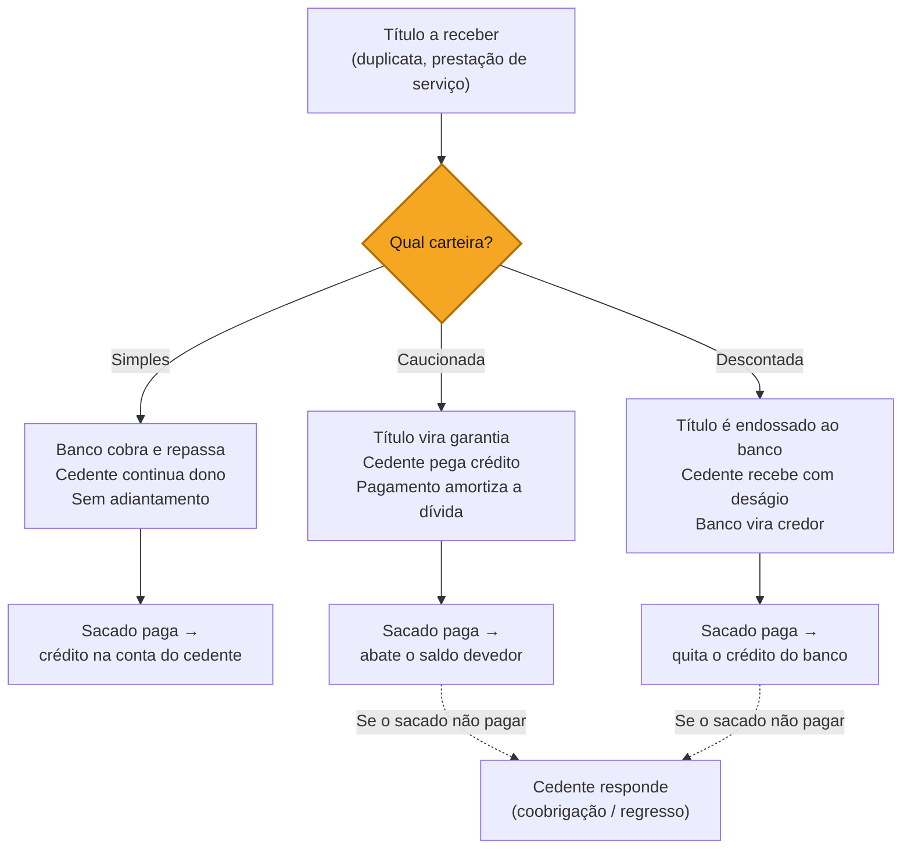
```mermaid
graph TD
    classDef destaque fill:#f5a623,stroke:#b36d00,color:#1a1a1a,stroke-width:2px
    T["Título a receber<br/>(duplicata, prestação de serviço)"] --> Q{"Qual carteira?"}

    Q -->|Simples| S["Banco cobra e repassa<br/>Cedente continua dono<br/>Sem adiantamento"]
    Q -->|Caucionada| C["Título vira garantia<br/>Cedente pega crédito<br/>Pagamento amortiza a dívida"]
    Q -->|Descontada| D["Título é endossado ao banco<br/>Cedente recebe com deságio<br/>Banco vira credor"]

    S --> P1["Sacado paga →<br/>crédito na conta do cedente"]
    C --> P2["Sacado paga →<br/>abate o saldo devedor"]
    D --> P3["Sacado paga →<br/>quita o crédito do banco"]

    P2 -.->|"Se o sacado não pagar"| R["Cedente responde<br/>(coobrigação / regresso)"]
    P3 -.->|"Se o sacado não pagar"| R

    class Q destaque
```

---

### 11.6 CNAB de cobrança em detalhe

A seção 11.4 apresentou o formato; esta abre o produto que a maioria das empresas encontra primeiro. O recorte é o **CNAB 240 de cobrança** — o mesmo esqueleto hierárquico da seção 11.7, com segmentos e domínios próprios.

> **Sobre as posições citadas aqui e na seção 11.7:** os intervalos seguem o leiaute de referência da Febraban. Vale o de sempre — cada banco publica seu próprio manual e o manual do banco prevalece. Use as posições daqui para entender a *forma* do registro, nunca como fonte para implementar contra uma instituição específica.

#### A assimetria remessa × retorno

O primeiro fato que desorganiza quem chega: **remessa e retorno não usam os mesmos segmentos.**

| Direção | Segmentos | O que carregam |
|---|---|---|
| **Remessa** (empresa → banco) | **P, Q, R, S** | O título que se quer registrar, ou a instrução sobre um título já registrado |
| **Retorno** (banco → empresa) | **T, U** | O que aconteceu com o título, e com quais valores |

Isso significa que o parser de remessa e o de retorno são programas diferentes, com domínios diferentes. Quem escreve um esperando reaproveitar tudo no outro descobre isso tarde.

#### Os segmentos de remessa

**Segmento P — o título.** É o registro obrigatório e principal. Campos-chave:

| Posições | Campo | Por que importa |
|---|---|---|
| 14 | Código do segmento (`P`) | Despacho do parser |
| **16-17** | **Código de movimento** | *O* campo desta seção. Ver a tabela adiante |
| 38-57 | **Nosso número** | O identificador do título **no banco**. 20 posições, formato definido pela instituição |
| 58 | Código da carteira | Ver seção 11.5 — o código varia por banco |
| 63-77 | **Número do documento** | O "seu número": o identificador do título **na sua empresa** |
| 78-85 | Data de vencimento | `DDMMAAAA` |
| 86-100 | Valor nominal | 15 posições, 2 decimais implícitas |
| 106-107 | Espécie do título | DM, DS, NP… em domínio numérico |
| 108 | Identificação de aceite | `A` com aceite, `N` sem |
| 109-116 | Data de emissão | |
| 117-140 | Juros de mora | Código, data de início e valor/taxa |
| 141-164 | Desconto 1 | Código, data-limite e valor/percentual |
| 180-194 | Valor do abatimento | |
| 220 | **Código para protesto** | `1` protestar em dias corridos, `2` em dias úteis, `3` não protestar |
| 221-222 | Dias para protesto | Contados do vencimento |
| 223-227 | Código e prazo para baixa/devolução | O título se baixa sozinho depois de N dias |

**Os dois "números" são a confusão mais cara do produto**, e ela tem exatamente a mesma forma do problema de correlação da seção 11.7:

- **Nosso número** é do banco. Só existe depois do registro, e é por ele que o banco identifica o título.
- **Número do documento** (seu número) é seu. Existe desde antes do registro, e é por ele que **você** identifica o título.

Correlacione pelo seu número. Se o seu sistema depende do nosso número para casar o retorno, ele não consegue tratar o caso em que o registro foi rejeitado — porque aí não existe nosso número nenhum.

**Segmento Q — o sacado.** Tipo e número de inscrição (CPF/CNPJ), nome, endereço completo, CEP, cidade e UF, mais os dados do **sacador avalista** quando houver. Obrigatório junto do P: o par P+Q é atômico, do mesmo jeito que o par A+B da seção 11.7.

**Segmento R — o que não coube no P.** Desconto 2 e 3, e — este é o pega — **a multa**. Código da multa, data de início e valor ou percentual moram no R, não no P. Sistema que preenche juros no P e esquece o R emite título sem multa por atraso, e a divergência só aparece na primeira liquidação em atraso. Carrega também mensagens livres e o e-mail do sacado para envio de aviso.

**Segmento S — o que se imprime.** Mensagens destinadas ao corpo do boleto, com opções de posicionamento. Opcional e frequentemente ignorado.

#### Códigos de movimento: a remessa é um comando

As posições 16-17 do segmento P transformam o mesmo registro em coisas completamente diferentes. Este é o campo que faz do CNAB de cobrança um protocolo de comandos, não um formato de exportação:

| Código | Movimento | O que o banco faz |
|---|---|---|
| `01` | Entrada de título | Registra o título. É o único que cria algo |
| `02` | Pedido de baixa | Tira o título de cobrança |
| `04` / `05` | Concessão / cancelamento de abatimento | |
| `06` | Alteração de vencimento | Prorrogação |
| `07` / `08` | Concessão / cancelamento de desconto | |
| `09` | **Protestar** | Encaminha a cartório após o prazo |
| `10` | Sustar protesto e **baixar** o título | |
| `11` | Sustar protesto e **manter** em carteira | Diferente do `10`: o título continua vivo |
| `12` | Alteração de juros de mora | |
| `31` | Alteração de outros dados | O curinga, e o mais dependente de manual |

**A diferença entre `10` e `11` é a que mais gera atrito com o cliente.** Sustar o protesto porque o sacado negociou não é a mesma coisa que desistir da cobrança. Se o sistema mapeia os dois para "cancelar protesto" e escolhe um por padrão, metade dos casos vira título baixado indevidamente — ou título vivo que o financeiro achava encerrado.

#### Os segmentos de retorno

**Segmento T — o que aconteceu.** Traz nosso número, número do documento, vencimento, valor nominal, o **código de movimento de retorno** (posições 16-17) e, nas posições **214-223**, dez posições que comportam **até cinco motivos de dois caracteres** — exatamente a mesma armadilha das posições 231-240 dos segmentos A e J na seção 11.7. Ler só os dois primeiros caracteres descarta motivos e explica ao cliente uma rejeição pela metade.

**Segmento U — com quais valores.** Vem sempre logo depois do T e é onde estão os números que a contabilidade precisa:

| Posições | Campo |
|---|---|
| 18-32 | Juros, multa e encargos |
| 33-47 | Valor do desconto concedido |
| 48-62 | Valor do abatimento |
| 63-77 | Valor do IOF |
| **78-92** | **Valor pago pelo sacado** |
| **93-107** | **Valor líquido creditado ao cedente** |
| 108-122 | Outras despesas (tarifas, custas de cartório) |
| 138-145 | Data da ocorrência |
| 146-153 | **Data da efetivação do crédito** |

**Valor pago ≠ valor líquido ≠ valor nominal.** São três números diferentes, e a diferença entre eles é tarifa, juros, multa e desconto. Um sistema que baixa o título pelo valor nominal e credita pelo valor pago não fecha com o extrato — a tarifa some no meio. É o mesmo erro do "valor solicitado × valor efetivado" da seção 11.7, visto do outro lado do balcão.

E, como no pagamento, **a data da ocorrência não é a data do crédito**. O sacado pagou na segunda; o dinheiro entra na conta do cedente na terça. Conciliação que usa a data errada gera divergência todo dia.

#### Códigos de movimento de retorno

| Código | Significado | Efeito no título |
|---|---|---|
| `02` | Entrada confirmada | Registrado. Agora existe |
| `03` | **Entrada rejeitada** | Não existe. Ver os motivos em 214-223 |
| `06` | **Liquidação** | Pago |
| `09` | Baixa | Encerrado sem pagamento |
| `11` | Títulos em ser | Posição de carteira, não é evento |
| `14` | Confirmação de alteração de vencimento | |
| `17` | **Liquidação após baixa** | Pagaram um título que você já tinha encerrado |
| `19` / `20` | Confirmação de instrução de protesto / de sustação | O comando foi aceito, ainda não executado |
| `23` | Remessa a cartório | O protesto está em curso |
| `25` | Protestado e baixado | |
| `26` | Instrução rejeitada | O comando foi recusado |
| `28` | Débito de tarifas e custas | Cobrança do banco, não do sacado |

O código `17` merece atenção especial: **ele quebra a suposição de que baixado é estado terminal.** Um título baixado por decurso de prazo pode ser pago depois, e o dinheiro entra. Se o modelo não previu esse caminho, o crédito chega sem título para casar e vira conta transitória que ninguém sabe conciliar — a mesma lição de "pago nunca é terminal" do capítulo 15, na direção contrária.

#### O ciclo de vida do título

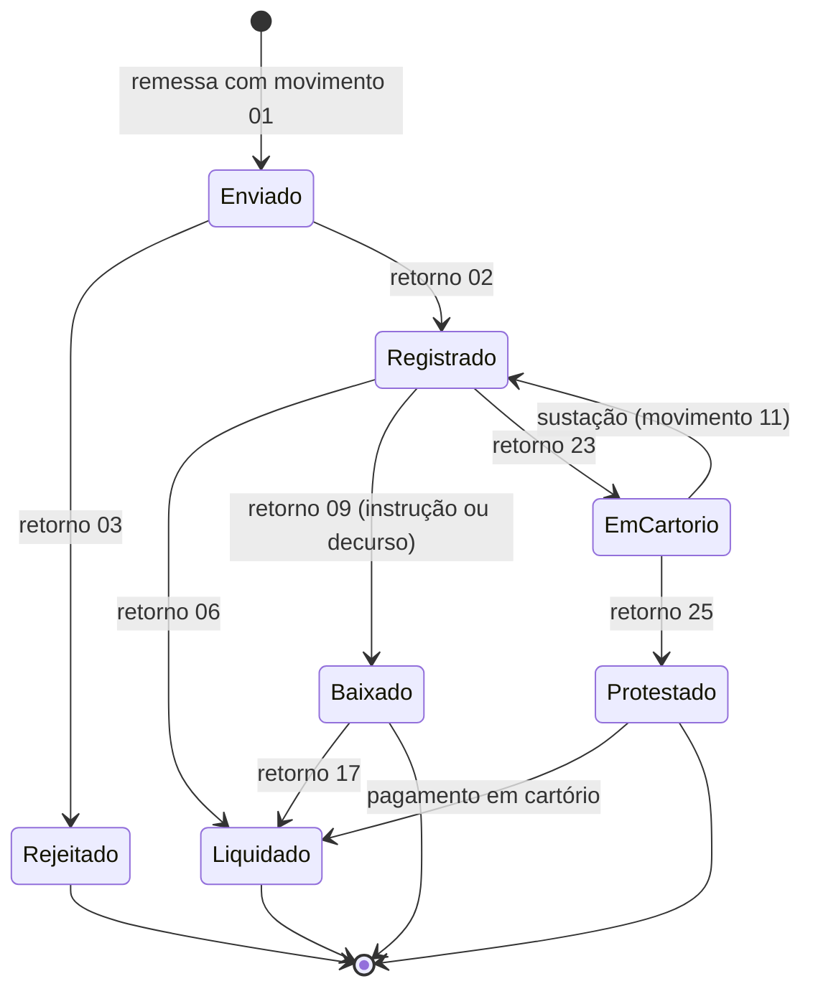
```mermaid
stateDiagram-v2
    [*] --> Enviado: remessa com movimento 01
    Enviado --> Rejeitado: retorno 03
    Enviado --> Registrado: retorno 02

    Registrado --> Liquidado: retorno 06
    Registrado --> Baixado: retorno 09 (instrução ou decurso)
    Registrado --> EmCartorio: retorno 23

    EmCartorio --> Protestado: retorno 25
    EmCartorio --> Registrado: sustação (movimento 11)
    Protestado --> Liquidado: pagamento em cartório
    Baixado --> Liquidado: retorno 17

    Rejeitado --> [*]
    Liquidado --> [*]
    Baixado --> [*]
    Protestado --> [*]
```

Três leituras do diagrama que valem mais que ele:

1. **Só existe uma entrada.** Todo título nasce de um movimento `01`, e até o retorno `02` chegar ele não existe para o banco. Emitir o boleto para o cliente antes da confirmação de entrada é apostar que nada foi rejeitado.
2. **Baixado não é terminal de verdade.** A aresta `Baixado --> Liquidado` é o retorno `17`, e ela existe na vida real com frequência incômoda.
3. **Sustação volta ao registro, não à baixa.** É o movimento `11`; o `10` levaria a `Baixado`. Modelar os dois como a mesma transição é o bug descrito acima.

> **Fio condutor — a Padaria do João.** O boleto de R$ 10.000 vai na remessa como um segmento P com movimento `01`, espécie DM (é uma duplicata mercantil), vencimento em 30 dias, mais o segmento Q com o CNPJ do Mercado da Esquina, mais um segmento R com a multa de 2% e os juros de 1% ao mês. No dia seguinte chega o retorno com movimento `02`: o título existe. Trinta dias depois, o Mercado paga com três dias de atraso — e o retorno traz movimento `06` no segmento T e, no U, valor nominal R$ 10.000,00, juros e multa somados de R$ 210,00, tarifa de R$ 3,50 e valor líquido creditado de R$ 10.206,50. Três números diferentes, e a contabilidade da padaria precisa dos três.

#### Checkpoint — cobrança

1. Numa TED entre dois bancos, o dinheiro do cliente passa pela conta de Reservas?
2. Quantos dígitos tem o código de barras e quantos a linha digitável? Por que a diferença?
3. O que é o fator de vencimento e por que ele quebrou sistemas em fevereiro de 2025?
4. Na cobrança descontada, quem assume o calote do sacado?
5. Qual a diferença entre "nosso número" e "número do documento", e por qual dos dois se correlaciona remessa e retorno?
6. Onde fica a multa do boleto no CNAB 240: segmento P ou R?
7. Um título com movimento de retorno `09` está encerrado?
8. Qual a diferença prática entre os movimentos de remessa `10` e `11`?
9. No segmento U, por que existem três campos de valor diferentes?

<details>
<summary>Respostas</summary>

(1) Não. São duas camadas contábeis paralelas: o banco debita o cliente no ledger dele, e separadamente o STR move as reservas entre os dois bancos. (2) 44 e 47. A linha digitável reorganiza os mesmos dados em cinco campos e acrescenta três dígitos verificadores de módulo 10, um por campo, para detectar erro de digitação. (3) É o número de dias desde 07/10/1997, em quatro posições. Chegou a 9999 em 21/02/2025 e voltou a 1000 no dia seguinte, então quem calculava a diferença absoluta desde 1997 passou a gerar fator errado. (4) O cedente, por coobrigação — o risco não some com a antecipação. (5) Nosso número é o identificador do título no banco e só existe após o registro; número do documento é o seu, e existe desde antes. Correlacione pelo seu, porque ele também existe quando o registro é rejeitado. (6) No R. Juros e desconto 1 ficam no P; multa e descontos 2 e 3 ficam no R. (7) Não necessariamente: o movimento `17` (liquidação após baixa) permite que um título baixado seja pago depois. (8) `10` susta o protesto **e baixa** o título; `11` susta **e mantém** o título em carteira. Confundir os dois encerra cobranças que deveriam seguir vivas. (9) Porque valor nominal, valor pago pelo sacado e valor líquido creditado são grandezas distintas — entre elas estão juros, multa, desconto, abatimento e tarifas.

</details>

---

### 11.7 CNAB de pagamento em detalhe

A seção anterior tratou do CNAB pelo lado da **cobrança** — segmentos P, Q, R, S na remessa, T e U no retorno, título registrado, baixa por liquidação. O mesmo formato carrega um segundo produto, com regras próprias e um perfil de risco bem diferente: o **pagamento**. É o assunto desta seção.

---

#### 11.7.1 A virada de sentido

Em cobrança, você **emite um título e espera receber**. A remessa é um pedido de registro, e o pior caso de um erro costuma ser retrabalho: o título não registra, você corrige e reenvia.

Em pagamento, você **manda o dinheiro sair**. A remessa é uma ordem de débito na conta do próprio cliente. O pior caso de um erro é dinheiro fora da casa, creditado na conta de um terceiro que não tem obrigação nenhuma de devolver.

| | **Cobrança** | **Pagamento** |
|---|---|---|
| Direção do dinheiro | Entra | Sai |
| A remessa é | Um pedido de registro | Uma ordem de débito |
| Contraparte | Sacado (deve ao cliente) | Favorecido (vai receber) |
| Erro típico | Título não registra | Crédito indevido a terceiro |
| Reversão | Baixa, cancelamento, novo título | Depende da boa vontade de quem recebeu |
| Segmentos do detalhe | P, Q, R | A, B, C, J, N, O, Z |

Essa assimetria explica praticamente todas as regras "chatas" que aparecem no produto: **alçada** e pré-aprovação antes do envio, bloqueio de saldo, idempotência levada a sério, e um ciclo de estados bem mais longo que o de cobrança.

> **Alçada** é o limite de valor até o qual uma pessoa ou um papel pode aprovar sozinho uma operação. Acima dele, exige-se aprovação de outro nível, ou de duas pessoas. É o equivalente organizacional de um *code review* obrigatório acima de certo raio de impacto — e, como ele, vale por faixa de valor, por tipo de operação e por perfil, não por um número único.

> **Analogia:** cobrança é um `INSERT` que você pode repetir sem grande estrago, porque a chave natural te protege. Pagamento é um `DELETE` sem transação aberta: rodou, saiu, e o `ROLLBACK` depende de um sistema que não é seu.

---

#### 11.7.2 Nível 1 — a anatomia do arquivo

O 240 é hierárquico. Cinco tipos de registro montam a estrutura, e o tipo fica na **posição 8** de toda linha:

```
Registro 0 ─ Header de Arquivo         (1 por arquivo)
   Registro 1 ─ Header de Lote         (1 por lote)
      Registro 3 ─ Detalhe             (N por lote — aqui moram os segmentos)
      Registro 3 ─ Detalhe
   Registro 5 ─ Trailer de Lote        (1 por lote)
   Registro 1 ─ Header de Lote         (outro lote, outro produto)
      ...
   Registro 5 ─ Trailer de Lote
Registro 9 ─ Trailer de Arquivo        (1 por arquivo)
```

Existem ainda os registros **2** e **4** (inicial e final de lote), opcionais e pouco usados.

Toda linha tem 240 caracteres, sem exceção, com preenchimento à direita com espaços em campos alfanuméricos e à esquerda com zeros em campos numéricos.

**A regra que organiza tudo:**

> Um lote agrupa pagamentos que compartilham **o mesmo tipo de serviço e a mesma forma de lançamento**.

Quase toda dúvida de "por que isso está em lotes separados?" se resolve com essa frase. Uma empresa que paga folha por crédito em conta, fornecedores por TED e ainda quita alguns boletos vai gerar **três lotes** no mesmo arquivo. Não é escolha do desenvolvedor, é consequência do leiaute.

---

#### 11.7.3 Tipo de serviço e forma de lançamento

Ambos ficam no **header de lote** (registro 1) e são os dois campos que mais determinam o comportamento do arquivo.

**Tipo de serviço** (posições 10-11) — *o que* está sendo pago:

| Código | Serviço |
|---|---|
| `20` | Pagamento a fornecedor |
| `22` | Pagamento de contas e tributos |
| `30` | Pagamento de salários (folha) |
| `98` | Pagamentos diversos |

**Forma de lançamento** (posições 12-13) — *por qual trilho* o dinheiro anda:

| Código | Forma | Segmentos |
|---|---|---|
| `01` | Crédito em conta corrente | A + B |
| `05` | Crédito em conta poupança | A + B |
| `03` | DOC/TED (legado, exige câmara) | A + B |
| `41` | TED — outra titularidade | A + B |
| `43` | TED — mesma titularidade | A + B |
| `45` | **PIX Transferência** | A + B |
| `47` | **PIX QR Code** | A + B |
| `30` | Liquidação de título do próprio banco | J |
| `31` | Pagamento de título de outros bancos | J |
| `11` | Contas e tributos com código de barras | O |
| `16` / `17` / `18` | DARF Normal / GPS / DARF Simples | N |

As três siglas de guia que aparecem aqui e adiante: **DARF** (Documento de Arrecadação de Receitas Federais), **GPS** (Guia da Previdência Social) e **GARE** (Guia de Arrecadação de Receitas Estaduais, usada por vários estados). São formulários de recolhimento de tributo, cada um com um conjunto próprio de campos obrigatórios — e é por isso que o segmento N tem variantes em vez de um leiaute só.

**Nota prática:** repare que a forma de lançamento **determina o segmento**. Se você está escrevendo um gerador ou um parser, essa é a chave de despacho natural: leia o header de lote, resolva a forma, e só então saiba que tipo de detalhe esperar. Parser que tenta adivinhar o segmento lendo a posição 14 sem contexto do lote funciona, mas perde a validação cruzada que pega metade dos arquivos malformados.

> **No modelo do ASA:** o `Arquivo` guarda `LayoutBanco` e `LayoutTipoArquivo`, e a tabela `PagamentoParametroLayout` amarra `TipoPagamento` (FK para `TipoTransacao`) a um `LayoutIntegrado` por cliente. Ou seja, a forma de lançamento não está no código — está parametrizada por conta e por produto. É o desenho certo, e é também onde vão morar os bugs mais difíceis, porque um parâmetro errado gera um arquivo sintaticamente válido e semanticamente absurdo.

---

#### 11.7.4 Nível 2 — os segmentos

##### O par A + B: dinheiro indo para uma conta

O **segmento A** é o registro principal de crédito em conta, DOC, TED e PIX. É onde estão favorecido, valor e data.

| Posições | Campo | Por que importa |
|---|---|---|
| 14 | Código do segmento (`A`) | Despacho do parser |
| 15 | Tipo de movimento | `0` inclusão, `5` alteração, `9` exclusão |
| 16-17 | Código de instrução | `00` inclusão, `99` exclusão |
| 18-20 | Câmara centralizadora | Obrigatória para forma `03`; alguns bancos exigem para TED |
| 21-23 | Banco do favorecido | |
| 24-29 | Agência + DV | |
| 30-42 | Conta + DVs | |
| 43-72 | Nome do favorecido | 30 posições, trunca sem avisar |
| **73-92** | **Nº do documento atribuído pela empresa** | **A chave de correlação. É o "seu número" do pagamento** |
| 93-100 | Data do pagamento | `DDMMAAAA` |
| 119-133 | Valor do pagamento | 15 posições, **2 decimais implícitas** |
| 134-148 | Nº do documento atribuído pelo banco | "Nosso número", vem preenchido no retorno |
| **149-156** | **Data real da efetivação** | Só no retorno |
| **157-171** | **Valor real da efetivação** | Só no retorno |
| **231-240** | **Códigos de ocorrência** | Ver 11.7.6 |

Três coisas aqui merecem atenção especial.

**A chave de correlação são as posições 73-92.** É o campo que você preenche na remessa e que o banco devolve intacto no retorno. Correlacionar por conta, valor e data funciona até o dia em que o cliente paga duas vezes o mesmo valor para o mesmo favorecido, o que acontece mais do que parece em folha e em aluguel. Use o documento da empresa e trate-o como identificador de verdade: único por cliente, imutável, gerado por você.

**Valor solicitado e valor efetivado são campos diferentes.** As posições 119-133 dizem quanto o cliente pediu; as 157-171 dizem quanto o banco efetivamente pagou. Eles divergem legitimamente em pagamento de título com desconto, multa ou juros calculados pelo banco na data. Sistema que sobrescreve o solicitado com o efetivado perde a informação de que houve divergência, e a conciliação do cliente vai perguntar exatamente por isso.

**As duas decimais são implícitas.** `000000000012345` são R$ 123,45. Isso vale para todo campo de valor do 240.

##### O segmento B: o complemento que virou o coração do PIX

Historicamente, o **B** era o registro chato de endereço do favorecido. Com a chegada das formas `45` e `47`, ele passou a carregar a informação mais importante da transação.

O B traz o **tipo/número de inscrição do favorecido** (CPF ou CNPJ), o endereço completo, os valores nominais (vencimento, desconto, abatimento, mora, multa) e, no caso de PIX, dois campos novos:

- **Forma de iniciação** — o domínio típico é `01` telefone, `02` e-mail, `03` CPF/CNPJ, `04` chave aleatória, `05` dados bancários.
- **Chave de pagamento** — a chave PIX propriamente dita, a URL do QR Code dinâmico, ou a chave de endereçamento do QR estático.

**Armadilha de tamanho:** o TXID de um QR dinâmico é limitado a **30 posições** dentro do CNAB, embora o padrão PIX admita mais. Se o seu sistema gera TXID longo, ele não cabe.

**Armadilha de posição:** os campos de PIX no segmento B são a parte **menos padronizada** do 240 inteiro. Foram acrescentados depois, cada banco escolheu um intervalo, e alguns publicaram versões diferentes em anos diferentes. Este é o ponto onde "parser sem configuração por instituição não sobrevive ao segundo banco" deixa de ser piada.

> **Nota de modelagem:** o par A+B é uma unidade atômica. Nunca separe um B do seu A entre lotes ou arquivos diferentes, e nunca gere um A de PIX sem o B correspondente. No `PixInfo` do ASA isso está resolvido de forma elegante: `ChaveTipo`, `ChavePixUrl` e `QrCodePix` moram na mesma linha que os dados do favorecido, então a atomicidade é garantida pelo modelo e não por disciplina do programador.

##### O segmento C

Complemento opcional do A, usado principalmente em folha. Carrega valores acessórios do lançamento — INSS, IR, FGTS, descontos, abatimentos — e uma segunda conta para casos específicos. Se você não faz folha, provavelmente nunca vai vê-lo.

##### O par J + J-52: pagamento de título

O **segmento J** é o registro de liquidação de boleto. O campo central são as **posições 18-61: o código de barras de 44 posições**. Diferente do A, aqui você não descreve o favorecido — o código de barras já contém banco, moeda, valor, vencimento e identificador do título.

| Posições | Campo |
|---|---|
| 14 | Código do segmento (`J`) |
| 18-61 | Código de barras (44) |
| 62-91 | Nome do beneficiário |
| 92-99 | Data de vencimento |
| 100-114 | Valor nominal do título |
| 115-129 | Desconto + abatimento |
| 130-144 | Mora + multa |
| 145-152 | Data do pagamento |
| 153-167 | Valor do pagamento |
| 183-202 | Nº do documento atribuído pela empresa |
| 231-240 | Códigos de ocorrência |

O **segmento J-52** é um J estendido, identificado por `52` nas posições 18-19, que informa **sacado, cedente e sacador avalista**. Ele existe porque a legislação de tributação e de comprovante exige saber quem pagou e quem recebeu, informação que o código de barras não carrega. Vários bancos o tornaram obrigatório.

> **No modelo do ASA:** o desenho mapeia bem. `Pix`, `Ted` e `Tef` são o par A+B; `Boleto` e `Tricon` são o par J + J-52. Note que `BoletoInfo` já tem `CodigoBarra`, `LinhaDigitavel`, `Sacado*` e `Sacador*` — exatamente o conteúdo do J mais o do J-52. E `TriconInfo` tem `NossoNumero` e `SacadorBancoIspb`, sinal de que ali entra título de terceiro com dados de liquidação bancária.

##### Os segmentos O, N e Z

- **O** — contas de concessionária e tributos **com** código de barras (forma `11`).
- **N** — tributos **sem** código de barras, com variantes por guia: N1 GPS, N2 DARF Normal, N3 DARF Simples, além de GARE, IPVA e licenciamento. Cada variante tem seu próprio conjunto de campos.
- **Z** — registro opcional de autenticação do pagamento, devolvido no retorno com o código de autenticação bancária. É o comprovante.

> **No modelo do ASA:** `CodigoAutenticacao VARCHAR(50)` no cabeçalho de todas as transações é justamente o destino do segmento Z. Vale conferir se o parser realmente o consome, porque é um segmento opcional e é comum ele ser ignorado até o dia em que um cliente pede comprovante.

---

#### 11.7.5 Nível 3 — o ciclo de estados

Aqui está a diferença conceitual mais importante em relação à cobrança: **existem dois ciclos de vida rodando ao mesmo tempo**, e confundi-los é a origem de boa parte dos bugs de produto de pagamento.

- O **arquivo** tem estados: recebido, validado, rejeitado, processado.
- Cada **pagamento** dentro dele tem estados próprios: incluído, agendado, efetivado, rejeitado, devolvido.

Um arquivo aceito pode conter pagamentos rejeitados. Um arquivo rejeitado derruba todos os pagamentos de uma vez. E um lote pode ser recusado inteiro sem que o arquivo seja.

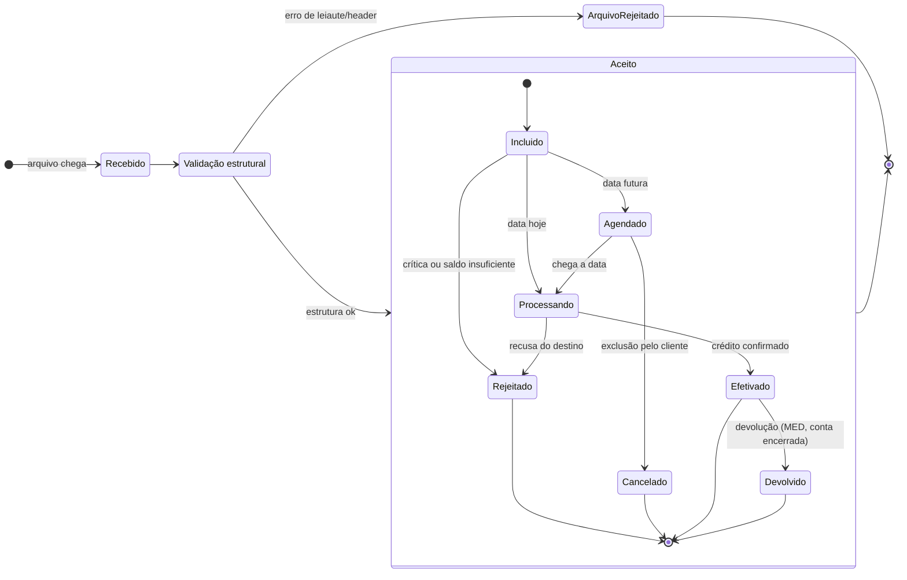
```mermaid
stateDiagram-v2
    direction LR
    [*] --> Recebido: arquivo chega

    state "Validação estrutural" as VAL
    Recebido --> VAL
    VAL --> ArquivoRejeitado: erro de leiaute/header
    VAL --> Aceito: estrutura ok

    state Aceito {
        [*] --> Incluido
        Incluido --> Rejeitado: crítica ou saldo insuficiente
        Incluido --> Agendado: data futura
        Incluido --> Processando: data hoje
        Agendado --> Processando: chega a data
        Agendado --> Cancelado: exclusão pelo cliente
        Processando --> Efetivado: crédito confirmado
        Processando --> Rejeitado: recusa do destino
        Efetivado --> Devolvido: devolução (MED, conta encerrada)

        Rejeitado --> [*]
        Cancelado --> [*]
        Efetivado --> [*]
        Devolvido --> [*]
    }

    ArquivoRejeitado --> [*]
    Aceito --> [*]
```

Três observações que valem mais que o diagrama:

**Agendado é um estado de primeira classe, não um detalhe.** Em cobrança quase não existe; em pagamento, ele domina o volume de folha e de fornecedor. Um pagamento agendado já consumiu validação, já pode ter reservado saldo, e ainda pode ser cancelado. Sistema que trata agendado como "ainda não aconteceu nada" erra o cálculo de saldo disponível do cliente.

**Rejeitado tem dois momentos muito diferentes.** Rejeição na entrada (campo inválido, conta inexistente) chega em minutos e é barata. Rejeição na efetivação (destino recusou, conta encerrada, chave PIX inválida) chega horas depois, quando o cliente já viu o pagamento como "aceito". Se o seu modelo tem um estado só, o cliente não entende o que aconteceu.

**Efetivado não é terminal.** Vale aqui a lição do capítulo 15: uma devolução pode chegar dias depois, por decisão de terceiro. Modele o caminho de volta desde o começo.

> **No modelo do ASA:** o enum de `dbo.Status` tem hoje `1 Incluído`, `2 Processando`, `3 Rejeitado`, `4 Cancelado`, `5 Erro`, `6 Finalizado`, `7 Pendente Pix Url`, `8 Processando Pix Url`. Comparando com o diagrama, faltam dois estados que o produto vai precisar mais cedo ou mais tarde: **Agendado** e **Devolvido**. Hoje um pagamento agendado provavelmente fica em `Processando` por dias, o que torna impossível distinguir "está na fila do banco" de "vai sair na semana que vem". E `Erro` versus `Rejeitado` merece um critério escrito: a leitura natural é que `Rejeitado` é recusa de negócio (com código de ocorrência) e `Erro` é falha técnica do próprio worker (sem código). Se essa distinção não estiver documentada, os dois viram sinônimos na prática.

---

#### 11.7.6 Nível 4 — ocorrências

##### O campo

Nas posições **231-240** dos segmentos A e J ficam os códigos de ocorrência do retorno. São 10 posições que comportam **até cinco ocorrências de dois caracteres cada**.

Esse é o detalhe que derruba a maior parte dos parsers de primeira viagem:

```
231-240:  "AEAN      "
           ↑ ↑
           │ └── AN — tipo de conta do favorecido inválido
           └──── AE — tipo/nº de inscrição inválido
```

Duas rejeições, não uma. Um parser que lê `SUBSTRING(linha, 231, 2)` captura `AE` e joga `AN` fora, e aí o suporte passa a tarde explicando ao cliente uma rejeição pela metade.

##### Os códigos

Reprodução parcial da tabela de referência. **A tabela do banco prevalece** — vários bancos redefinem códigos e acrescentam os seus.

| Código | Significado |
|---|---|
| `00` | Crédito ou débito efetivado |
| `BD` | Inclusão efetuada com sucesso |
| `BE` | Alteração efetuada com sucesso |
| `BF` | Exclusão efetuada com sucesso |
| `AJ` | Rejeição CNAB — estrutura, obrigatoriedade ou domínio |
| `AE` | Tipo/número de inscrição inválido |
| `AL` | Banco favorecido inválido |
| `AN` | Conta do favorecido inválida |
| `AO` | Nome do favorecido não informado |
| `AR` | Valor do lançamento inválido |
| `BB` | Seu número inválido |
| `BG` | Agência/conta impedida legalmente |
| `HF` | Conta da empresa com saldo insuficiente |
| `HA` | Lote não aceito |
| `HI` | Arquivo não aceito |

E o bloco específico de PIX, que é recente e vale conhecer:

| Código | Significado |
|---|---|
| `PA` | PIX não efetivado (recusa negocial) |
| `PC` | Conta do recebedor inválida, inexistente, encerrada ou bloqueada |
| `PE` | Tipo de transação não autorizado na conta do recebedor |
| `PG` | CPF/CNPJ do recebedor incorreto |

Repare no prefixo como pista de escopo: `A*` e `B*` são críticas de registro, `H*` são problemas de lote ou arquivo, `P*` são específicos de PIX. Não é regra formal, mas ajuda a classificar código desconhecido.

##### Ocorrência não é status

Esta é a distinção que mais economiza dor de cabeça depois.

**Ocorrência é o que o banco disse.** É dado bruto, do dialeto daquela instituição, e deve ser persistido exatamente como veio — as dez posições inteiras, não a primeira.

**Status é o que o seu domínio concluiu.** É o resultado do seu mapeamento, é o que a interface mostra e o que a regra de negócio consulta.

Se você guardar só o status, perdeu a informação. No dia em que um cliente perguntar por que o pagamento dele foi recusado, ou no dia em que descobrir que estava mapeando `PC` para o status errado, o dado bruto é a única forma de reprocessar sem pedir o arquivo de novo ao banco.

> **No modelo do ASA:** `CodigoOcorrencia VARCHAR(10)` está dimensionado exatamente para o campo inteiro, o que sugere que quem desenhou sabia disso. Vale confirmar no worker se ele realmente grava as dez posições ou se grava só as duas primeiras. E como `DescricaoOcorrencia VARCHAR(100)` é uma única string, ela naturalmente comporta só uma descrição — para múltiplas ocorrências, a descrição precisa ser concatenada ou resolvida em tempo de leitura contra uma tabela de domínio por banco.

---

#### 11.7.7 Como o cliente consome o retorno

Antes de decidir *como* gerar o arquivo, vale entender o que acontece com ele do outro lado. Boa parte das regras que parecem arbitrárias existe porque o consumidor é mais rígido do que o padrão.

##### Quem é o "cliente"

É a empresa pagadora, e do lado dela quase sempre existe um **ERP** ou um sistema de contas a pagar. Você não está integrando com uma pessoa, está integrando com um software que alguém configurou uma vez e ninguém mais quer mexer.

Quatro modos de consumo convivem no mesmo produto:

| Modo | Como funciona | O que isso significa para você |
|---|---|---|
| **Importação automática por ERP** | Rotina agendada varre um diretório, importa e baixa os títulos | O mais comum e o mais rígido. Parser fechado, sem tolerância, mensagem de erro genérica |
| **Rotina própria** | O cliente escreveu o próprio importador | Mais tolerante, mas cada cliente tem um bug diferente e você vira o suporte dele |
| **Conferência manual** | O financeiro abre o arquivo ou um relatório derivado | Muito mais comum do que a engenharia imagina, principalmente em cliente pequeno |
| **API/webhook em paralelo** | O cliente reage ao evento e usa o CNAB só para contabilidade e auditoria | O CNAB deixa de ser o canal e vira o registro. Mas continua tendo que fechar |

##### O ciclo do lado de lá

Independente do modo, o roteiro é sempre o mesmo:

1. **Recebe** o arquivo (SFTP, portal, API, e em casos legados ainda e-mail).
2. **Valida o cabeçalho** — banco, convênio, conta, NSA. Se não bate com o que está configurado, para aqui.
3. **Casa cada detalhe com o título interno**, pelo nº do documento atribuído pela empresa.
4. **Decide a ação por ocorrência** — baixa, mantém aberto, reabre para correção.
5. **Gera o lançamento contábil** — baixa de contas a pagar contra crédito em banco.
6. **Arquiva o arquivo bruto** para auditoria.

O passo 4 é o que importa, e ele é uma tabela de decisão:

| Ocorrência | O que o ERP faz | Consequência de errar |
|---|---|---|
| `00` | Baixa definitiva + lançamento contábil | Baixa indevida, título quitado que não foi pago |
| `BD` | Confirma agendamento, **mantém o título aberto** | Se o ERP tratar `BD` como `00`, o cliente acha que pagou e não pagou |
| `AJ`, `A*`, `H*` | Reabre o título e gera pendência para o financeiro | Título fica em limbo, ninguém paga o fornecedor |
| Devolução | Estorno — novo lançamento, não apagar o anterior | Contabilidade não fecha |

**A confusão entre `00` e `BD` é a mais cara da lista.** Um é "o dinheiro saiu", o outro é "está marcado para sair". Se o seu retorno emite `BD` num momento em que o cliente espera `00`, ou vice-versa, o efeito não é um erro de tela: é um fornecedor que não recebeu ou um título baixado sem pagamento.

##### As expectativas implícitas

Nada disso está no leiaute, e tudo isso derruba integração:

- **NSA único e crescente por cliente.** Repetição costuma ser rejeitada; furo na sequência costuma gerar alerta. Alguns ERPs simplesmente ignoram o arquivo em silêncio, que é o pior desfecho possível.
- **Nome de arquivo previsível.** Muito ERP varre diretório por máscara. Se o padrão do nome muda, a rotina não acha nada e ninguém percebe até o fechamento.
- **Arquivo atômico.** Se você escreve direto no destino, o ERP pode ler pela metade. Escreva com extensão temporária e renomeie no final — em SFTP o rename é atômico, o upload não.
- **Um arquivo por conta/convênio.** Misturar contas diferentes no mesmo arquivo quebra a validação de header.
- **Encoding e quebra de linha.** ASCII sem acento e `CRLF` continuam sendo exigência de muito importador.
- **Reprocessamento não é garantido.** ERP idempotente é minoria. Se você reenviar o mesmo arquivo, assuma que o cliente vai dar baixa duas vezes.

##### O que o cliente realmente pergunta

Ele nunca pergunta qual segmento ou qual posição. Ele pergunta **"por que o meu título não baixou?"**.

Para responder isso em minutos e não em horas, você precisa de um caminho reverso completo: do nº do documento que ele informou até o evento, a ocorrência bruta e o arquivo em que aquilo foi reportado. É por isso que guardar `CodigoOcorrencia` inteiro e manter `ControlePagamentoReportado` valem mais do que parecem — juntos, eles respondem "o que aconteceu" e "quando eu te contei".

**Nota prática:** a divergência de data é a origem número um de ticket. O cliente compara o retorno com o extrato bancário e vê datas diferentes, porque o extrato mostra a data real da efetivação e ele importou a data do pagamento solicitada. Levar as posições 149-156 e 157-171 a sério resolve a maior parte disso antes de virar chamado.

---

#### 11.7.8 Nível 5 — retorno parcial e retorno consolidado

Primeiro, o mais importante: **isso não existe no leiaute Febraban**. Não há campo, flag ou tipo de registro que diga "este é um retorno parcial". É uma **convenção comercial** entre a instituição e o cliente. Se a regra parece confusa, muito provavelmente é porque ela é confusa mesmo, e não porque falta um manual.

##### Por que o parcial existe

Porque as formas de lançamento liquidam em ritmos diferentes. Uma remessa com três lotes — folha por crédito em conta, fornecedores por TED, boletos por J — vira naturalmente "lote 1 fechado hoje de manhã, lotes 2 e 3 pendentes". O parcial é o mecanismo de devolver feedback antes de tudo fechar.

Isso torna o **lote**, e não o arquivo, o recorte natural do parcial.

##### As três regras mecânicas

**1. Numeração é por arquivo emitido, sempre.** O número do lote começa em 1 e o sequencial de registro começa em 1 dentro de cada lote, no arquivo que você está gerando agora. Se você preservar a numeração da remessa original, vai emitir um arquivo que começa no lote 2 ou que tem buraco na sequência, e muitos ERPs rejeitam. A correlação com a remessa original é feita pelo **nº do documento atribuído pela empresa** (A: 73-92, J: 183-202), não pela numeração.

**2. Trailers refletem o arquivo emitido, nunca a remessa original.** Quantidade de lotes, quantidade de registros e somatória de valores contam o que está neste arquivo. É o bug clássico de retorno parcial e some em qualquer teste que compare trailer com conteúdo.

**3. Lote partido é normal.** Se um lote de 100 pagamentos teve 60 efetivados, emita o lote com 60 detalhes agora e os 40 restantes depois. O mesmo número de lote aparecendo em dois arquivos não é problema, porque a numeração é por arquivo. Só mantenha o par A+B (ou J + J-52) atômico.

##### O modelo de dados que sustenta os dois

O desenho que evita divergência é tratar parcial e consolidado como **dois recortes da mesma consulta**, saindo do mesmo emissor:

- **Parcial** = pagamentos cuja ocorrência mudou desde a última emissão para aquele cliente.
- **Consolidado** = todos os pagamentos da remessa, com a ocorrência atual.

Se cada tipo tiver seu próprio caminho de geração, eles vão divergir. Não é hipótese, é questão de tempo.

Para o parcial funcionar, você precisa de duas coisas: um **cursor por cliente** (até onde já reportei) e um **registro do que já foi reportado** (para não repetir).

> **No modelo do ASA:** as duas tabelas já existem, e é bom sinal.
>
> - `ControleJanelaRetorno (ClienteDocumento, UltimoInstanteReportado)` é exatamente o cursor. Cuidado com um detalhe: cursor por instante sofre com transações que gravam com timestamp anterior ao avanço do cursor e ficam invisíveis para sempre. Se o volume for alto, considere avançar o cursor para o menor instante ainda em processamento, e não para "agora".
> - `ControlePagamentoReportado (PagamentoID, CodigoStatus)` com PK composta é o registro do que já saiu. A PK sendo `(PagamentoID, CodigoStatus)` significa que o mesmo pagamento pode ser reportado várias vezes, uma por status — o que é exatamente o comportamento correto para um pagamento que vai de agendado a efetivado.
> - `SequencialArquivo (Documento, SequencialAtual)` é o NSA por cliente. O NSA no header de arquivo precisa ser único e crescente por cedente; muitos ERPs rejeitam repetição e alguns acusam furo na sequência. Incremente dentro da mesma transação que grava o arquivo, nunca antes.

##### A pergunta que precisa ser respondida por quem pediu

**O consolidado repete o que já saiu nos parciais?**

Se repete, o ERP do cliente recebe o mesmo movimento duas vezes e pode dar baixa em duplicidade. Nesse caso o consolidado tem que ser explicitamente um **arquivo de conferência**, com o cliente deduplicando pelo nº do documento, e isso precisa estar acordado por escrito.

Se não repete, o consolidado é **complementar**: só o que ainda não foi reportado, e a diferença entre ele e um parcial vira apenas o momento em que é gerado.

Não dá para inferir isso do leiaute. É decisão de produto, e enquanto ela não estiver escrita, qualquer implementação é chute.

**Nota final:** se o recorte vier vazio, **não gere o arquivo**. Um 240 com zero lotes é sintaticamente construível e quebra uma quantidade surpreendente de ERPs.

---

#### 11.7.9 O fluxo ponta a ponta

Juntando tudo: da chegada da remessa até o consolidado do fechamento.

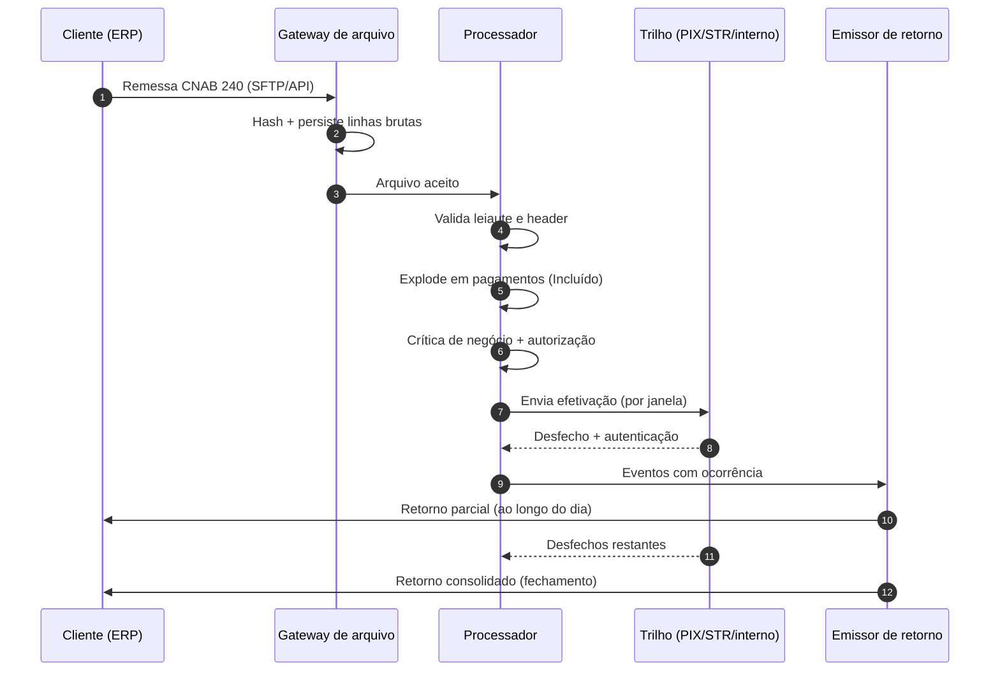
```mermaid
sequenceDiagram
    autonumber
    participant C as Cliente (ERP)
    participant G as Gateway de arquivo
    participant P as Processador
    participant T as Trilho (PIX/STR/interno)
    participant R as Emissor de retorno

    C->>G: Remessa CNAB 240 (SFTP/API)
    G->>G: Hash + persiste linhas brutas
    G->>P: Arquivo aceito
    P->>P: Valida leiaute e header
    P->>P: Explode em pagamentos (Incluído)
    P->>P: Crítica de negócio + autorização
    P->>T: Envia efetivação (por janela)
    T-->>P: Desfecho + autenticação
    P->>R: Eventos com ocorrência
    R->>C: Retorno parcial (ao longo do dia)
    T-->>P: Desfechos restantes
    R->>C: Retorno consolidado (fechamento)
```

##### Fase 1 — Ingestão

**O que entra:** o arquivo bruto, como veio.

Grave **antes de interpretar**. A linha do header e do trailer vão para `ArquivoCnabLinha`, os headers e trailers de cada lote para `LoteCnabLinha`, e o registro em `Arquivo` recebe `ClienteDocumento`, `AppID`, `CanalOrigem` e o hash de idempotência.

Isso parece burocracia até o primeiro arquivo que quebra o parser. Com as linhas brutas guardadas, você reprocessa; sem elas, precisa pedir o arquivo de volta ao cliente, que raramente ainda tem.

**Idempotência entra aqui, não depois.** Hash do conteúdo, não do nome. Cliente reenviando o mesmo arquivo é rotina, e o custo de processar duas vezes é pagamento em duplicidade.

**Estado:** o arquivo nasce recebido. Nenhum pagamento existe ainda.

##### Fase 2 — Validação estrutural

**O que se olha:** tamanho de linha, tipos de registro na ordem certa, banco, convênio, conta, NSA, coerência dos trailers.

Falha aqui derruba o arquivo inteiro. Registre em `ArquivoErro` com o máximo de contexto — `LayoutNumeroLinha`, `LayoutCampo`, `LayoutPosicao`, `LayoutConteudoEnviado`, `LayoutConteudoEsperadoId`. Esses campos existem no modelo justamente para que o suporte responda "linha 47, posição 119, esperado numérico, veio branco" em vez de "arquivo inválido".

**Colete todos os erros, não pare no primeiro.** Um cliente que corrige um erro por vez faz cinco rodadas de dois dias cada.

**Estado:** arquivo rejeitado, ou aceito.

##### Fase 3 — Explosão em pagamentos

Cada segmento vira uma linha de movimentação com seu `Info` correspondente:

| Forma de lançamento | Segmentos | Tabelas |
|---|---|---|
| `01`, `05` | A + B | `Tef` / `TefInfo` |
| `41`, `43`, `03` | A + B | `Ted` / `TedInfo` |
| `45`, `47` | A + B | `Pix` / `PixInfo` |
| `30`, `31` | J + J-52 | `Boleto` ou `Tricon` + `Info` |

Aqui você preenche `NumeroLote` (que lote da remessa originou aquele pagamento) e `IdentificadorExterno` (o nº do documento do cliente). Guarde também as linhas originais no campo `Linhas`, em JSON — é o que permite reemitir o retorno sem reconstruir o registro do zero.

**Estado:** `Incluído`.

##### Fase 4 — Crítica de negócio e autorização

Agora entram saldo, alçada, limites, validade do favorecido e chave PIX.

O que for rejeitado aqui **já ganha código de ocorrência**, e essa é a primeira leva que alimenta um retorno parcial. Rejeição de crítica é rápida e barata, e devolvê-la em minutos em vez de no fechamento é a diferença mais visível de qualidade percebida pelo cliente.

`PreAprovado` decide se o pagamento segue direto ou espera aprovação no canal.

**Estados:** `Rejeitado` (com ocorrência) ou segue.

##### Fase 5 — Efetivação

O pagamento vai para o trilho conforme a forma de lançamento, respeitando a janela: PIX 24/7, TED com horário, boleto com corte, agendado esperando a data.

É aqui que a distinção entre agendado e processando ganha valor prático. Um pagamento com data futura fica parado, consumindo saldo comprometido, e ainda pode ser cancelado.

**Estados:** `Agendado` → `Processando` → `Efetivado` ou `Rejeitado`.

##### Fase 6 — Captura do desfecho

Do trilho voltam quatro informações, e todas as quatro importam:

- **Código de ocorrência** (bruto, as dez posições)
- **Data real da efetivação**
- **Valor real da efetivação**
- **Código de autenticação**

Grave em `CodigoOcorrencia`, `CodigoAutenticacao` e nos campos de data e valor real. É esse conjunto que preenche o retorno.

##### Fase 7 — Emissão do retorno

**De onde vem cada campo:**

| Campo do retorno | Origem no modelo |
|---|---|
| Header — NSA | `SequencialArquivo.SequencialAtual + 1` |
| Header — conta/documento | `Arquivo.ClienteContaHeader`, `ClienteDocumento` |
| Header de lote — serviço/forma | `PagamentoParametroLayout` |
| A 73-92 / J 183-202 — seu número | `<Tipo>Info.IdentificadorExterno` |
| A 134-148 — nosso número | ID interno ou identificador do trilho |
| A 93-100 — data do pagamento | `<Tipo>Info.DataTransacao` |
| A 119-133 — valor | `<Tipo>Info.ValorPagamento` |
| A 149-156 — data real | data do desfecho |
| A 157-171 — valor real | valor efetivado |
| A/J 231-240 — ocorrências | `<Tipo>.CodigoOcorrencia` |
| Segmento Z — autenticação | `<Tipo>.CodigoAutenticacao` |
| Trailers | Contagem e soma **do arquivo emitido** |

**O recorte:**

- **Parcial** — pagamentos do cliente cujo par `(PagamentoID, CodigoStatus)` ainda não existe em `ControlePagamentoReportado`, com `DataAtualizacao` posterior ao cursor.
- **Consolidado** — todos os pagamentos da remessa, com a ocorrência atual.

Mesma consulta, filtro diferente. Mesmo emissor.

##### Fase 8 — Publicação

Disponibiliza no SFTP ou expõe pela API, com o nome de arquivo no padrão que o cliente configurou.

**A ordem das operações importa muito aqui.** Duas falhas possíveis, e você escolhe qual:

- Publicar antes de commitar: se a transação falhar, o cliente tem um arquivo que o seu sistema não sabe que existe. Reconciliação manual, NSA duplicado depois.
- Commitar antes de publicar: se o upload falhar, você acha que enviou e não enviou. Detectável, reexecutável.

**Escolha a segunda.** A sequência correta é: gera o conteúdo → transação (incrementa NSA, grava `Arquivo` e linhas, insere em `ControlePagamentoReportado`, avança `ControleJanelaRetorno`) → commit → publica → marca como publicado.

Consumir o NSA fora da transação é um erro comum e caro: se a geração falhar depois, o sequencial já foi queimado e o próximo arquivo sai com furo.

##### Fase 9 — Depois

Devolução, cancelamento tardio e reprocessamento. Cada um gera um novo evento, com nova ocorrência, que entra no próximo parcial. Nunca sobrescreva o evento anterior.

---

##### Velocidade: onde o tempo realmente vai

Uma intuição errada comum é achar que o gargalo é montar as linhas de 240 caracteres. Não é — isso é concatenação de string, roda em microssegundos. O tempo vai em três lugares:

**1. A consulta que decide o recorte.** É o gargalo real, e piora com o volume. No modelo do ASA são cinco tabelas de movimentação, então o recorte é um `UNION ALL` de cinco consultas, cada uma com anti-join contra `ControlePagamentoReportado`.

Os índices atuais (`IX_Pix_ArquivoID` e similares) atendem a busca por arquivo, que é a do consolidado. Falta o índice do parcial, que busca por cliente e status:

```sql
CREATE INDEX IX_Pix_Cliente_Status ON dbo.Pix
    (ClienteDocumento, CodigoStatus, DataAtualizacao)
    INCLUDE (PixID, ArquivoID, NumeroLote, CodigoOcorrencia);
```

O `INCLUDE` faz o índice cobrir a consulta e evita o lookup na tabela base. Repita para as cinco. Se o parcial roda de hora em hora e o volume é alto, esse índice é a diferença entre segundos e minutos.

**2. O anti-join.** `NOT EXISTS` contra a PK `(PagamentoID, CodigoStatus)` é a forma certa — a PK já é o índice de que você precisa. `LEFT JOIN ... WHERE IS NULL` produz plano pior em volume alto no SQL Server.

**3. A gravação do que foi reportado.** Inserir linha a linha em `ControlePagamentoReportado` é o clássico N+1 que transforma dez segundos em dez minutos. Use inserção em massa: table-valued parameter, `MERGE` com TVP, ou `SqlBulkCopy` para volume grande.

**Outras alavancas, em ordem de retorno:**

- **Gere em stream, não em memória.** Escreva linha a linha para o `Stream` de saída. Um arquivo de 100 mil pagamentos são 24 MB de texto; materializar tudo antes de escrever é desperdício sem ganho.
- **Paralelize por cliente, nunca dentro do cliente.** O NSA é sequencial por cliente, então dois geradores para o mesmo cliente disputam o mesmo contador. Entre clientes não há contenção nenhuma.
- **Escrita atômica sempre.** `arquivo.tmp` e rename ao final. Barato e elimina uma classe inteira de bug.
- **Cadência combinada, não máxima.** Se o ERP do cliente importa de hora em hora, gerar parcial a cada cinco minutos só multiplica arquivo e chance de erro sem entregar nada. A frequência certa é a que o consumidor consegue absorver.
- **Consolidado fora do pico.** Ele varre a remessa inteira e é naturalmente o mais pesado. Fechamento noturno resolve.
- **Geração retomável.** Se o processo cair no meio, a próxima execução tem que produzir o mesmo resultado. Isso vem de graça com a ordem de operações da fase 8: nada foi marcado como reportado, então o recorte volta idêntico.

---

#### 11.7.10 Armadilhas de implementação

**Dinheiro em inteiro, sempre.** Vale o capítulo 6 inteiro, com um agravante: o 240 já entrega o valor como inteiro de centavos com decimais implícitas. Converter para decimal na leitura e voltar para inteiro na escrita é introduzir dois pontos de erro onde havia zero.

**A linha tem exatamente 240 caracteres.** Não 239, não 241. Truncamento silencioso em nome de favorecido (30 posições) e observação são a causa mais comum de "o arquivo passou no meu teste e o banco rejeitou".

**Encoding e quebra de linha são parte do contrato.** Muitos bancos ainda exigem ASCII sem acento e `CRLF`. Nome com cedilha ou til vira caractere inválido e o arquivo inteiro cai.

**Idempotência precisa de hash de conteúdo, não só de identificador.** Reprocessar o mesmo arquivo de retorno não pode duplicar lançamento. As tabelas `*Idempotencia (HashID)` e `*RetornoIdempotencia (RetornoID, Data)` do ASA cobrem os dois lados — envio e retorno — e a PK composta com `Data` no retorno é o que permite o mesmo pagamento ter eventos em dias diferentes sem colidir.

**Retorno chega fora de ordem.** É a mesma observação da seção 11.4 sobre protocolo assíncrono, e em pagamento ela é mais grave: uma efetivação que chega antes do agendamento não pode fazer o pagamento voltar para agendado. Guarde a ordem por data do evento, não por ordem de chegada do arquivo, e trate transição inválida como alerta, não como exceção fatal.

**Saldo é problema de arquitetura, não de validação.** Entre a inclusão e a efetivação existe uma janela em que o dinheiro está comprometido mas não saiu. Se o saldo disponível não descontar os agendados, o cliente gasta o mesmo dinheiro duas vezes. É o mesmo erro de `disponível = aprovado − utilizado` da seção 13.2, e a correção é a mesma: falta subtrair o reservado.

---

#### Checkpoint — pagamento

1. Por que uma empresa que paga folha, fornecedores por TED e boletos gera três lotes, e não um?
2. Qual campo do segmento A você deve usar para correlacionar remessa e retorno, e por que não conta, valor e data?
3. Por que o segmento A tem dois campos de valor?
4. O que muda no segmento B quando a forma de lançamento é `45` ou `47`?
5. Um arquivo foi aceito. Isso significa que os pagamentos dele foram aceitos?
6. Por que "agendado" precisa ser um estado próprio no modelo?
7. Quantas ocorrências cabem nas posições 231-240, e o que acontece com quem lê só as duas primeiras?
8. Por que confundir `00` com `BD` é o erro mais caro do lado do cliente?
9. Num retorno parcial, o trailer de arquivo conta os registros de quê?
10. Qual a ordem correta entre commitar a transação e publicar o arquivo, e por quê?
11. Por que o NSA deve ser incrementado dentro da transação de geração?
12. Onde está o gargalo real da geração de um retorno parcial em volume alto?

<details>
<summary>Respostas</summary>

(1) Porque o lote agrupa por tipo de serviço e forma de lançamento, e as três são combinações diferentes. (2) O nº do documento atribuído pela empresa, posições 73-92, porque conta, valor e data colidem quando o mesmo valor é pago duas vezes ao mesmo favorecido — rotina em folha e aluguel. (3) Porque o valor solicitado e o valor efetivamente pago divergem legitimamente quando o banco calcula desconto, mora ou multa na data. (4) Ele passa a carregar a forma de iniciação e a chave PIX ou URL do QR Code, e vira a parte menos padronizada do leiaute entre bancos. (5) Não — a validação estrutural do arquivo é independente da crítica de cada registro, e um arquivo aceito pode conter pagamentos rejeitados. (6) Porque um agendado já consumiu validação e pode ter comprometido saldo, mas ainda é cancelável; tratá-lo como "nada aconteceu" faz o saldo disponível ficar errado. (7) Até cinco, de dois caracteres cada; quem lê só as duas primeiras descarta rejeições e explica ao cliente uma recusa pela metade. (8) Porque `00` significa que o dinheiro saiu e `BD` que está apenas marcado para sair — trocar um pelo outro resulta em fornecedor não pago ou título baixado sem pagamento. (9) Do próprio arquivo emitido, nunca da remessa original. (10) Commitar primeiro e publicar depois: a falha resultante (achar que enviou sem ter enviado) é detectável e reexecutável, enquanto a inversa deixa o cliente com um arquivo que o seu sistema desconhece. (11) Porque consumir o sequencial fora dela queima o número se a geração falhar, e o próximo arquivo sai com furo na sequência. (12) Na consulta que decide o recorte, não na montagem das linhas — daí a necessidade de índice por cliente e status, com colunas cobertas.

</details>

#### Exercícios

1. **Escreva o parser das posições 231-240** tratando as cinco ocorrências possíveis, e teste-o com `"00        "`, `"AEAN      "`, `"AEANARBB  "` e `"          "`. O último caso — dez brancos — é o que mais derruba implementação ingênua.
2. **Gere um retorno parcial** a partir de uma remessa de três lotes em que só o primeiro fechou, e prove por teste que o trailer de arquivo conta os registros do arquivo emitido, não os da remessa original.
3. **Implemente o fator de vencimento** da seção 11.3 e escreva um teste com quatro datas: uma anterior ao rollover, o próprio 21/02/2025, o 22/02/2025 e uma posterior. Confirme que nenhuma delas produz fator fora da faixa `1000`–`9999`.

---

### 11.8 CNAB × APIs modernas

O mercado está migrando de **arquivo em lote (CNAB)** para **APIs em tempo real**.

O motivo principal é regulatório: regras como o ***split payment*** da Reforma Tributária — em que o tributo é separado e recolhido automaticamente no instante do pagamento, em vez de ser apurado pelo vendedor depois — exigem confirmação imediata. Um ciclo de remessa e retorno com corte diário simplesmente não entrega isso.

> **Analogia:** é a migração de *batch* noturno para evento em streaming. O arquivo continua existindo por inércia e por volume, mas tudo que exige resposta síncrona vai vazando para a API.

O CNAB não vai desaparecer no curto prazo. Mas isso explica por que os bancos vêm expondo APIs REST paralelas ao mesmo fluxo que antes só existia via arquivo — e por que, na prática, você vai manter os dois canais vivos e conciliando entre si por um bom tempo.

---

## 12. Cartões: o arranjo de quatro partes

Cartão aparecia nos diagramas anteriores sem explicação — e é o trilho com a estrutura de participantes mais complexa do SFN. Vale entender porque quase toda fintech de pagamentos toca nele em algum ponto.

### Os cinco papéis

| Papel | Quem é | Função |
|---|---|---|
| **Portador** | Cliente final | Usa o cartão |
| **Emissor (issuer)** | Banco/IP que emitiu o cartão | Concede o limite, assume o risco de crédito, cobra a fatura |
| **Estabelecimento (EC)** | Loja/prestador | Vende e recebe |
| **Credenciadora (acquirer)** | Cielo, Rede, Stone, PagSeguro | Afilia o EC, captura a transação, paga o lojista |
| **Bandeira (scheme)** | Visa, Mastercard, Elo | Define regras do arranjo e roteia mensagens entre emissor e credenciadora |

O nome "quatro partes" vem do modelo clássico (portador, emissor, credenciadora, EC), com a bandeira operando o trilho entre emissor e credenciadora. Existe também o modelo de **três partes**, em que a mesma empresa é emissora e credenciadora (caso histórico do American Express).

### Autorização ≠ captura ≠ liquidação

Essa é a distinção que mais gera bug em integração de checkout.

> **Analogia:** é *two-phase commit*. A autorização é o *prepare* — reserva o recurso e garante que ele está disponível, sem efetivar nada. A captura é o *commit* — confirma que a venda aconteceu. E a liquidação é a replicação chegando ao destino, dias depois. Cada fase pode falhar de um jeito diferente, e tratar as três como um evento único é a origem de boa parte dos bugs de conciliação.

- **Autorização** — verificação em tempo real (segundos) de que existe limite e o cartão é válido. **Reserva** o valor, não move dinheiro.
- **Captura (confirmação)** — o EC confirma que a venda se concretizou. Pode ser imediata (varejo) ou posterior (hotelaria, e-commerce que só captura no envio).
- **Liquidação** — o dinheiro efetivamente chega ao lojista, tipicamente em **D+30** para crédito à vista (ou D+1/D+2 para débito), e é aí que entra a antecipação de recebíveis.

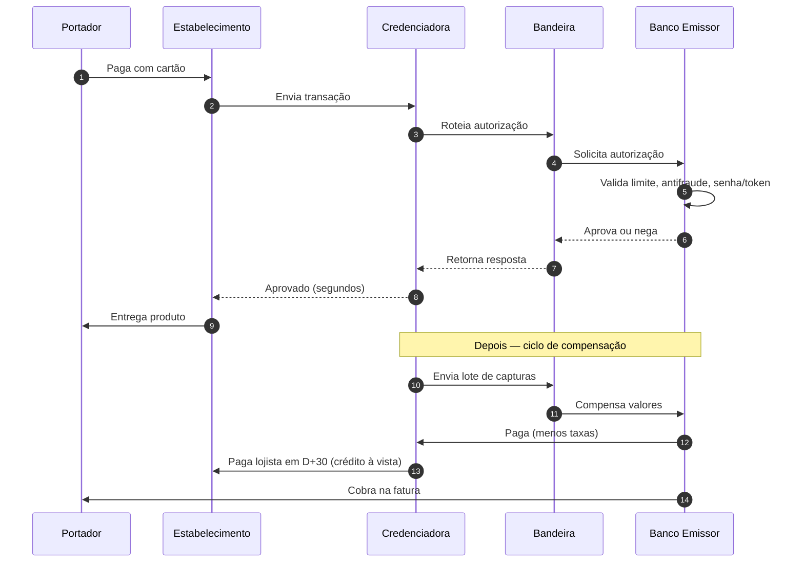
```mermaid
sequenceDiagram
    autonumber
    participant Portador
    participant EC as Estabelecimento
    participant Cred as Credenciadora
    participant Band as Bandeira
    participant Emissor as Banco Emissor

    Portador->>EC: Paga com cartão
    EC->>Cred: Envia transação
    Cred->>Band: Roteia autorização
    Band->>Emissor: Solicita autorização
    Emissor->>Emissor: Valida limite, antifraude, senha/token
    Emissor-->>Band: Aprova ou nega
    Band-->>Cred: Retorna resposta
    Cred-->>EC: Aprovado (segundos)
    EC->>Portador: Entrega produto

    Note over Cred,Emissor: Depois — ciclo de compensação
    Cred->>Band: Envia lote de capturas
    Band->>Emissor: Compensa valores
    Emissor->>Cred: Paga (menos taxas)
    Cred->>EC: Paga lojista em D+30 (crédito à vista)
    Emissor->>Portador: Cobra na fatura
```

### MDR, intercâmbio e antecipação

- **MDR (Merchant Discount Rate)** — taxa total que o lojista paga sobre a venda.
- **Tarifa de intercâmbio** — a maior fatia do MDR, repassada da credenciadora ao **emissor**. É o que remunera o banco emissor e financia os programas de pontos.
- **Antecipação de recebíveis de cartão** — o lojista vende o direito de receber em D+30 para receber hoje, com deságio. Esses recebíveis são registrados em **registradoras** (as mesmas do capítulo 13), o que permite usá-los como garantia sem risco de duplicidade.

### Chargeback

O **chargeback** é a contestação de uma compra pelo portador junto ao **emissor**. Se procedente, o valor é revertido — e, em regra, quem absorve a perda é o **lojista** (via credenciadora), não o banco. Prazos e regras são definidos pelas bandeiras, não pelo Bacen.

> Para o dev: chargeback significa que uma transação **aprovada e liquidada** ainda pode ser revertida meses depois. Se sua modelagem trata "pago" como estado terminal, o chargeback quebra seu modelo. O mesmo raciocínio vale para o MED do PIX (capítulo 15).

### Checkpoint

1. Quais são os cinco papéis do arranjo de quatro partes, e por que o nome não bate com a contagem?
2. Autorização, captura e liquidação: qual delas move dinheiro?
3. Uma autorização que nunca é capturada e nunca expira — qual o efeito no cliente?
4. No chargeback procedente, quem normalmente absorve a perda?
5. Quem define as regras e prazos de chargeback: o Bacen ou a bandeira?
6. Por que a antecipação de recebíveis de cartão depende de registradora?

<details>
<summary>Respostas</summary>

(1) Portador, emissor, estabelecimento, credenciadora e bandeira. O nome "quatro partes" vem do modelo clássico (portador, emissor, credenciadora e EC), com a bandeira operando o trilho entre emissor e credenciadora em vez de ser contada como parte. (2) Só a liquidação. A autorização reserva o limite e a captura confirma a venda, mas nenhuma das duas transfere recursos. (3) O limite dele fica congelado indefinidamente — por isso reserva precisa de expiração, tratada como TTL. (4) O lojista, via credenciadora — não o banco emissor. (5) As bandeiras, que são as instituidoras desses arranjos. O Bacen regula o arranjo, mas as regras de disputa são do instituidor. (6) Porque o registro central é o que impede o mesmo recebível de ser oferecido como garantia a mais de um financiador, e é o que dá oponibilidade a terceiros.

</details>

---

## 13. Área de crédito

Aqui muda o eixo: pagamento é sobre **mover dinheiro**; crédito é sobre **registrar obrigação e risco**. A peça central do lado do Bacen é o **SCR**.

### SCR — Sistema de Informações de Crédito

- Banco de dados do Bacen que centraliza **todas as operações de crédito** (empréstimos, financiamentos, avais, fianças, limites concedidos) de pessoas físicas e jurídicas, reportadas mensalmente pelas instituições financeiras.
- Regulado pela **Resolução CMN nº 4.571/2017**, administrado pelo BCB.
- Threshold histórico: instituições reportam operações com responsabilidade igual ou superior a **R$ 200,00**.
- Serve dois papéis: (1) **supervisão bancária** — Bacen monitora concentração de risco e inadimplência sistêmica; (2) **consulta entre instituições** — mediante autorização do cliente, um banco pode consultar o histórico de crédito de um tomador antes de aprovar uma nova operação.
- Cliente pessoa física/jurídica acessa seu próprio extrato via **Registrato** (conta gov.br nível prata/ouro), com histórico dos últimos 5 anos.
- Diferença importante de negócio: o SCR **não é um "SPC/Serasa"** — ele não julga bom/mau pagador, apenas registra o fato da operação e seu status; mas, na prática, funciona como insumo de motor de decisão de crédito em qualquer instituição.

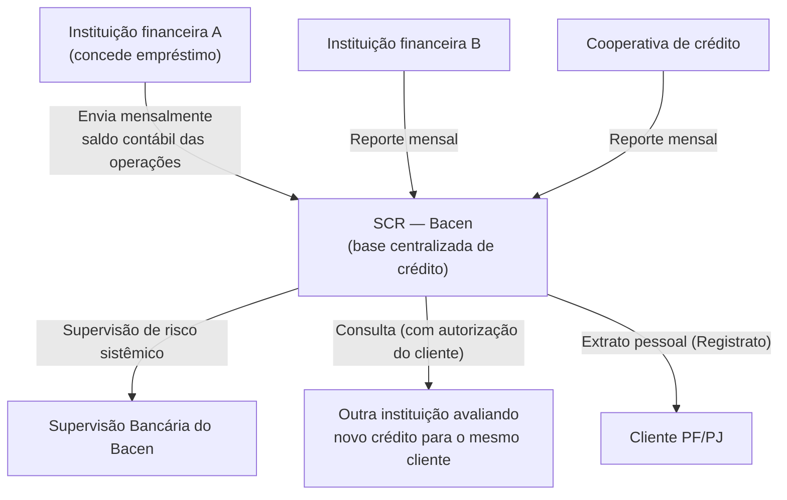
```mermaid
graph TD
    IF1["Instituição financeira A<br/>(concede empréstimo)"] -->|"Envia mensalmente<br/>saldo contábil das operações"| SCR["SCR — Bacen<br/>(base centralizada de crédito)"]
    IF2["Instituição financeira B"] -->|Reporte mensal| SCR
    IF3["Cooperativa de crédito"] -->|Reporte mensal| SCR

    SCR -->|"Supervisão de risco sistêmico"| BACEN_SUP["Supervisão Bancária do Bacen"]
    SCR -->|"Consulta (com autorização do cliente)"| IF4["Outra instituição avaliando<br/>novo crédito para o mesmo cliente"]
    SCR -->|"Extrato pessoal (Registrato)"| CLIENTE["Cliente PF/PJ"]
```

### Correspondentes bancários e registradoras

- **Correspondentes bancários** — empresas contratadas por instituições financeiras para originar operações (ex.: lojas, fintechs de crédito) em nome do banco, sob regulação do Bacen (Resolução CMN específica). O correspondente não é o credor; ele atua como canal.
- **Registradoras de recebíveis** (Núclea, B3, CERC, entre outras) — plataformas onde duplicatas, recebíveis de cartão e outros direitos creditórios são registrados centralmente. A seção 13.6 as trata em detalhe; por ora basta saber que elas existem e que é nelas que um recebível vira garantia oponível a terceiros.
- **CVM/B3** entra quando o crédito vira **instrumento negociável** — ou seja, deixa de ser um contrato entre duas partes e passa a ser um papel que investidores compram e vendem. Aí o crédito sai do universo Bacen puro e entra em mercado de capitais. Os principais formatos:
  - **Debênture** — título de dívida emitido por uma empresa para captar diretamente com investidores, sem passar por banco.
  - **CRI / CRA** (Certificado de Recebíveis Imobiliários / do Agronegócio) — papéis lastreados em recebíveis daqueles setores.
  - **FIDC** (Fundo de Investimento em Direitos Creditórios) — fundo que compra carteiras de recebíveis (duplicatas, parcelas de empréstimo) e as transforma em cotas para investidores. É a estrutura por trás de boa parte da originação de crédito das fintechs.

### 13.1 Ciclo de vida de uma operação de crédito

Se você vai trabalhar em crédito, este é **o** modelo mental central. Toda operação percorre as mesmas etapas, e cada uma vira um conjunto de serviços, estados e eventos no seu sistema.

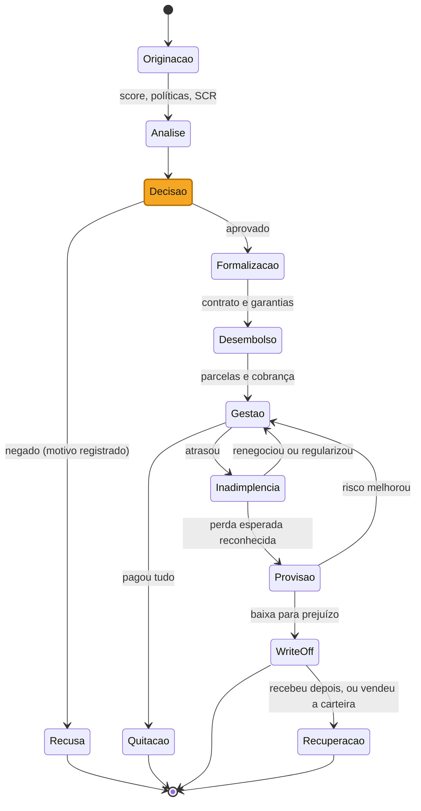
```mermaid
stateDiagram-v2
    classDef destaque fill:#f5a623,stroke:#b36d00,color:#1a1a1a,stroke-width:2px

    [*] --> Originacao
    Originacao --> Analise: score, políticas, SCR
    Analise --> Decisao

    Decisao --> Recusa: negado (motivo registrado)
    Decisao --> Formalizacao: aprovado
    Recusa --> [*]

    Formalizacao --> Desembolso: contrato e garantias
    Desembolso --> Gestao: parcelas e cobrança

    Gestao --> Quitacao: pagou tudo
    Gestao --> Inadimplencia: atrasou
    Quitacao --> [*]

    Inadimplencia --> Gestao: renegociou ou regularizou
    Inadimplencia --> Provisao: perda esperada reconhecida
    Provisao --> Gestao: risco melhorou
    Provisao --> WriteOff: baixa para prejuízo

    WriteOff --> Recuperacao: recebeu depois, ou vendeu a carteira
    WriteOff --> [*]
    Recuperacao --> [*]

    class Decisao destaque
```

Duas leituras do diagrama que a versão linear escondia: **inadimplência tem volta** — renegociação e regularização devolvem a operação à gestão normal, e é o desfecho mais comum —, e **write-off pode ser terminal**. Recuperação é possível, não obrigatória; modelar o caminho como se todo crédito baixado voltasse é otimismo que aparece depois em projeção de caixa.

**O que cada etapa significa tecnicamente:**

1. **Originação** — de onde vem a proposta: canal próprio, correspondente bancário, marketplace, API de parceiro.
2. **Análise** — é onde vive a maior parte da complexidade de regra de negócio. O **motor de crédito** combina quatro insumos:
   - **Score** — nota estatística (0 a 1000, nas escalas mais comuns) que estima a chance de o tomador pagar em dia. Pode ser calculada internamente ou comprada de **bureaus de crédito**: empresas como Serasa, Boa Vista e Quod, que agregam o histórico de pagamento do mercado inteiro.
   - **SCR** — o histórico de dívidas do tomador em outras instituições.
   - **Política de crédito** — as regras próprias da instituição sobre a quem emprestar, quanto e a que taxa.
   - **Compliance e verificação de renda** — as checagens do capítulo 14.
3. **Decisão** — aprovar, negar ou aprovar com condições (valor menor, taxa maior, exigência de garantia). Toda decisão precisa ser **auditável e explicável** — o cliente tem direito ao motivo da recusa.
4. **Formalização** — contrato (CCB — Cédula de Crédito Bancário, na maioria dos casos), assinatura eletrônica, registro de garantias.
5. **Desembolso** — o dinheiro efetivamente sai, hoje quase sempre via PIX ou TED.
6. **Gestão** — geração do carnê/parcelas, cobrança (boleto, débito automático, consignação), tratamento de pagamento antecipado (o cliente tem **direito legal a desconto proporcional dos juros** ao antecipar).
7. **Inadimplência** — a **régua de cobrança**: sequência escalonada de ações por faixa de atraso (lembrete → notificação → negativação → protesto → cobrança judicial). Dois desses termos merecem definição:
   - **Negativação** — inclusão do nome do devedor nos cadastros de inadimplentes dos bureaus de crédito, o que restringe seu acesso a crédito no mercado inteiro.
   - **Protesto** — registro formal da dívida em cartório, que dá publicidade legal à inadimplência e reforça o título como prova para execução judicial.
8. **Provisão, write-off e recuperação** — detalhados na seção 13.4.

> **Armadilha de modelagem:** o estado da *operação de crédito* e o estado da *cobrança* são coisas diferentes e evoluem em ritmos diferentes. Colapsar os dois num único enum é uma das refatorações mais dolorosas que se faz nesse domínio.

### 13.2 Limites

**Limite** é o teto que a instituição estabelece para algo — quanto um cliente pode dever, quanto pode transferir, quanto a própria instituição pode arriscar. Parecem regras arbitrárias quando chegam no seu backlog, mas cada família de limite existe por um motivo diferente.

| Família | Protege contra | Quem define |
|---|---|---|
| **Limite de crédito** | Inadimplência do cliente | A instituição, por política própria |
| **Limite transacional** | Fraude e golpe | Regulação + instituição + o próprio cliente |
| **Limite prudencial** | Concentração de risco e quebra sistêmica | O regulador (CMN/Bacen) |

#### Limite de crédito

É o valor máximo que o cliente pode dever à instituição. Duas variações que mudam completamente a modelagem:

- **Limite rotativo** — o teto se **recompõe** conforme o cliente paga. É o caso do cartão de crédito e do cheque especial: usou R$ 3.000 de R$ 5.000, pagou R$ 1.000, volta a ter R$ 3.000 disponíveis.
- **Limite não rotativo (pontual)** — aprovado e consumido uma vez só, como num empréstimo pessoal. Pagar não devolve disponibilidade.

Existe ainda o **limite global** (ou compartilhado): um teto único que vários produtos consomem — cartão, cheque especial e crédito pessoal dividindo a mesma exposição aprovada. É a fonte clássica de bug de "o cliente tem limite em dois lugares e usou os dois".

#### A conta que todo sistema de limite precisa acertar

```
disponível = aprovado − utilizado − reservado
```

O termo **reservado** é o que separa uma implementação correta de uma que perde dinheiro. Entre a autorização de uma compra e a sua liquidação existe um intervalo em que o valor **não foi debitado, mas também não está mais disponível**. Se você calcular disponibilidade apenas com o que já foi efetivado, o cliente gasta duas vezes o mesmo limite.

> **Analogia:** é exatamente o problema de reserva de estoque num e-commerce. Entre colocar no carrinho e concluir o pagamento, a unidade precisa sair da disponibilidade sem ainda ter saído do inventário. Quem só decrementa o estoque na confirmação vende o mesmo produto duas vezes — e quem só debita limite na liquidação empresta duas vezes o mesmo dinheiro.

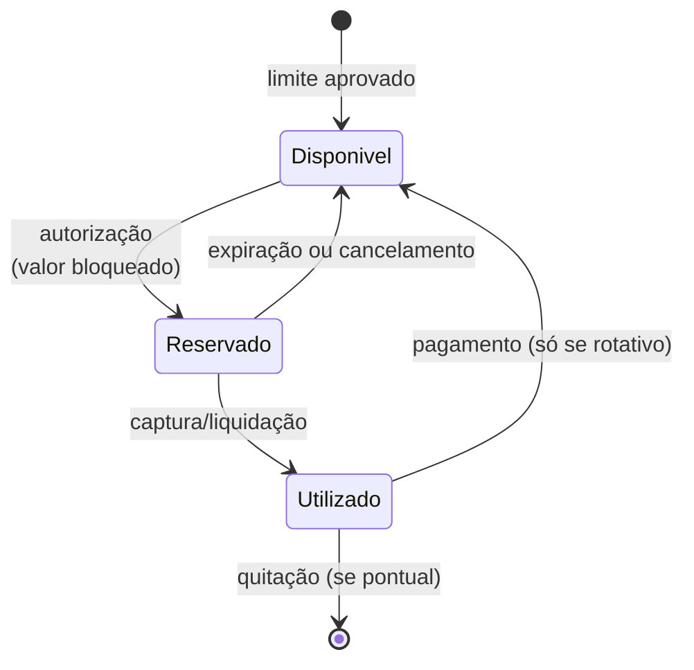
```mermaid
stateDiagram-v2
    [*] --> Disponivel: limite aprovado
    Disponivel --> Reservado: autorização<br/>(valor bloqueado)
    Reservado --> Utilizado: captura/liquidação
    Reservado --> Disponivel: expiração ou cancelamento
    Utilizado --> Disponivel: pagamento (só se rotativo)
    Utilizado --> [*]: quitação (se pontual)
```

Consequências práticas de engenharia:

- **Concorrência é o risco principal.** Duas compras simultâneas que cabem sozinhas mas não cabem juntas precisam ser serializadas. Leitura seguida de escrita sem controle de concorrência (bloqueio pessimista, versionamento otimista ou operação atômica no banco) leva a estouro de limite.
- **Reserva precisa de expiração.** Autorização que nunca é capturada e nunca expira congela limite do cliente para sempre. Trate como TTL.
- **Idempotência, de novo.** Um retry de autorização não pode reservar o valor duas vezes.

#### Limite transacional

Não tem relação com crédito: existe para conter fraude. O caso mais visível é o PIX, onde o Bacen definiu um padrão nacional:

- **Período noturno** (20h às 6h, com opção de o cliente deslocar o início para 22h): limite padrão de **R$ 1.000** para pessoa física.
- **Período diurno**: não há teto nacional — cada instituição define conforme o perfil do cliente.
- **Pix Saque e Pix Troco**: R$ 3.000 no diurno e R$ 1.000 no noturno.

E aqui está o detalhe de design que vale internalizar: **aumentar limite leva no mínimo 24 horas; reduzir é instantâneo.**

> **Analogia:** é escalonamento de privilégio. Conceder permissão exige aprovação e tempo; revogar é imediato. O motivo é o mesmo nos dois mundos: se alguém está sob coação, a janela de espera dá chance de intervir antes que o dano aconteça. Um sistema que aplicasse aumento de limite na hora seria uma ferramenta de sequestro-relâmpago.

Se você implementa limites, essa assimetria não é opcional — é regra do arranjo. As regras operacionais do PIX são detalhadas em instrução normativa do Bacen e mudam com frequência (a IN BCB nº 512/2024 foi alterada pela IN BCB nº 746/2026, com efeitos a partir de outubro de 2026), então trate valores e prazos como **configuração**, nunca como constante no código.

#### Limite prudencial

Este limita a **própria instituição**, não o cliente. O principal é o **limite de exposição por cliente**: uma instituição não pode ter, com um mesmo cliente, exposição superior a **25% do Nível I do seu Patrimônio de Referência** (o capital próprio de melhor qualidade). Cooperativas de crédito não filiadas a centrais observam limite mais restrito, de 15%. Há também um teto para o conjunto das **exposições concentradas** — as individualmente relevantes — de 600% do Nível I.

Um ponto sutil e importante: **"cliente" aqui não é CPF/CNPJ**. Empresas do mesmo grupo econômico, ou que tenham dependência econômica entre si, contam como um único cliente. Se seu sistema calcula exposição por documento, ele subestima o risco real.

> **Analogia:** é limite de blast radius. Não importa quão bom pareça o cliente — se ele sozinho pode derrubar o banco ao quebrar, a exposição precisa ser capada. A regra existe porque a história bancária é uma sequência de instituições que faliram por confiar demais num único devedor.

---

### 13.3 Garantias

Garantia é o que o credor pode acionar se o devedor não pagar. Duas famílias:

| Tipo | Definição | Exemplos |
|---|---|---|
| **Garantia real** | Vinculada a um **bem** específico | Alienação fiduciária, hipoteca, penhor, cessão fiduciária de recebíveis |
| **Garantia fidejussória** | Vinculada a uma **pessoa** que se responsabiliza | Aval, fiança |

Traduzindo cada uma:

- **Hipoteca** — o imóvel continua em nome do devedor, mas fica vinculado à dívida; se não pagar, o credor executa o bem judicialmente.
- **Penhor** — mesma lógica para bens móveis (equipamentos, safra, joias), com o bem frequentemente ficando na posse do credor.
- **Cessão fiduciária de recebíveis** — o devedor entrega em garantia valores que ele tem a receber de terceiros.
- **Aval** — alguém assina o título junto com o devedor e responde pela dívida em pé de igualdade, podendo ser cobrado diretamente.
- **Fiança** — alguém garante a dívida por contrato, mas em regra só é cobrado depois de esgotada a cobrança do devedor principal.

Conceitos que aparecem direto em integração de sistemas:

- **Alienação fiduciária** — o bem fica em nome do credor até a quitação. É o mecanismo padrão de financiamento de veículos e imóveis.
- **Gravame** — o registro do ônus sobre o bem. No caso de veículos, é registrado junto ao Detran e movimentado por integração eletrônica; um financiamento de veículo só é seguro depois que o gravame está efetivado.
- **Cessão fiduciária de recebíveis** — recebíveis (duplicatas, recebíveis de cartão) dados em garantia, registrados em registradora.

Garantia reduz o risco de crédito e, portanto, a taxa — e, sob a Resolução CMN 4.966, também impacta diretamente o cálculo de provisão da instituição.

#### Quanto a garantia realmente vale

Nenhuma instituição empresta 100% do valor do bem dado em garantia. Dois conceitos governam isso:

- **LTV (*Loan-to-Value*)** — a razão entre o valor emprestado e o valor do bem. Um financiamento imobiliário com LTV de 80% significa que o banco financiou R$ 400 mil de um imóvel de R$ 500 mil; os 20% restantes são a entrada do cliente.
- **Deságio de avaliação (*haircut*)** — a margem de segurança aplicada sobre o valor do bem. Um veículo avaliado em R$ 50 mil pode ser considerado como R$ 35 mil para fins de garantia.

> **Analogia:** é o mesmo raciocínio de não dimensionar capacidade pelo pico teórico. O bem pode desvalorizar, o mercado pode secar, a execução pode demorar meses e custar honorários. O *haircut* é a margem entre o número no papel e o que se recupera de fato sob estresse.

A folga entre o valor do bem e a dívida é o que protege o credor. Quando o bem desvaloriza mais rápido do que a dívida amortiza, o LTV sobe e a operação fica **descoberta** — o cliente deve mais do que o bem vale, e o incentivo a simplesmente parar de pagar aumenta.

#### Garantia não registrada é garantia inexistente

Este é o ponto que mais gera trabalho de integração. Constituir a garantia no contrato **não basta**: ela precisa ser registrada no órgão competente para valer contra terceiros.

| Tipo de bem | Onde se registra |
|---|---|
| Veículo | Gravame no Detran, via integração eletrônica |
| Imóvel | Cartório de Registro de Imóveis |
| Recebíveis | Registradora autorizada pelo Bacen |

Sem registro, dois credores podem achar que têm a mesma garantia — e quem registrou primeiro leva. Por isso o desembolso costuma ser condicionado à confirmação do registro, o que torna essas integrações um caminho crítico do fluxo de crédito, não um detalhe administrativo.

> **Analogia:** o contrato é o `commit` local; o registro é o `push`. Enquanto não subiu para o repositório central que todos consultam, sua alteração não existe para os outros — e alguém pode ter empurrado a dele primeiro.

#### Execução: o que acontece quando o cliente não paga

Realizar a garantia não é automático nem rápido, e o caminho varia por tipo:

- **Alienação fiduciária** — como o bem já está em nome do credor, a retomada é mais ágil (busca e apreensão, no caso de veículos).
- **Hipoteca** — exige execução judicial, historicamente lenta.
- **Cessão fiduciária de recebíveis** — o credor passa a receber diretamente os valores cedidos, sem precisar executar nada.

Para o sistema, isso significa que a garantia tem **estados próprios** — constituída, registrada, em execução, liberada — que evoluem de forma independente do estado da operação de crédito. Modelar garantia como um campo do contrato, em vez de entidade com ciclo de vida próprio, é uma limitação que aparece cedo.

#### Um "garantia" que significa outra coisa: o FGC

Cuidado com a ambiguidade do termo. O **FGC (Fundo Garantidor de Créditos)** não protege o banco contra o cliente — protege o **cliente contra o banco**. É um fundo mantido pelas próprias instituições que devolve o dinheiro do depositante caso a instituição quebre.

A cobertura é de **R$ 250 mil por CPF ou CNPJ, por instituição ou conglomerado**, com teto global de **R$ 1 milhão a cada quatro anos**. Cobre depósitos à vista, poupança e aplicações como CDB, LCI e LCA. Não cobre fundos de investimento, ações ou títulos públicos — que não são dívida do banco.

O tema esteve em movimento recentemente: após liquidações relevantes no mercado, a Resolução CMN nº 5.295/2026 introduziu o **Ativo de Referência**, indicador de qualidade, liquidez e diversificação dos ativos da instituição, para desestimular bancos a captar agressivamente apoiados na garantia do fundo.

### 13.4 Inadimplência, provisão e write-off

Um crédito que não é pago não some do balanço — ele percorre um caminho contábil regulado:

- **Provisão (PDD — Provisão para Devedores Duvidosos, hoje também chamada PPE — Provisão para Perdas Esperadas)** — reconhecimento contábil antecipado de que parte da carteira não será recebida. Reduz o lucro **antes** de a perda acontecer.

  > **Analogia:** é *error budget*. Você não sabe qual requisição vai falhar, mas sabe estatisticamente que algumas vão — então reserva a margem antes, em vez de fingir surpresa quando o erro chega.
- **Write-off (baixa para prejuízo)** — a operação sai do ativo, mas a dívida **continua existindo juridicamente**. Contabilidade e cobrança seguem caminhos separados a partir daqui.
- **Recuperação** — valor eventualmente recebido depois do write-off, ou venda da carteira inadimplente para empresas especializadas.

**Mudança regulatória importante e recente:** a **Resolução CMN nº 4.966/2021**, em vigor desde **janeiro de 2025**, substituiu a antiga Resolução CMN 2.682/1999 e alinhou o Brasil ao **IFRS 9** — a norma contábil internacional que trata de instrumentos financeiros e determina que perdas de crédito sejam reconhecidas *antes* de acontecerem, com base em expectativa estatística. O que muda:

| | **Modelo antigo (2.682/99)** | **Modelo atual (4.966/21)** |
|---|---|---|
| Lógica | Perda **incorrida** | Perda **esperada** (ECL — *Expected Credit Loss*) |
| Classificação | Níveis AA até H, com % mínimo por faixa de atraso | **Três estágios** de risco |
| Gatilho | O atraso já ocorreu | Aumento significativo de risco, mesmo sem atraso |

Nos três estágios: **Estágio 1** (sem aumento significativo de risco) provisiona a perda esperada dos próximos 12 meses; **Estágios 2 e 3** ampliam o horizonte conforme a deterioração do risco, com o estágio 3 abrangendo os ativos problemáticos.

> **Por que um dev precisa saber disso:** o modelo de perda esperada é **prospectivo** e depende de modelos estatísticos alimentados por dados históricos granulares. Isso empurrou os bancos a reformular pipelines de dados de crédito — você precisa capturar e reter atributos de risco por operação ao longo do tempo, não só o estado atual. É um requisito de arquitetura de dados, não só de contabilidade.

### 13.5 Duplicatas

A duplicata é o **título de crédito** que dá lastro a boa parte das operações de antecipação de recebíveis no Brasil — é a peça que conecta "empresa vendeu a prazo" com "banco pode financiar isso". Vale detalhar porque ela é o ativo que efetivamente circula pelas registradoras citadas acima.

**O que é, na prática:** toda vez que uma empresa vende mercadoria ou presta serviço a prazo (mínimo 30 dias, entre partes domiciliadas no Brasil), a lei obriga a emissão de uma **fatura**. A duplicata é "sacada" a partir dessa fatura contra o comprador (o **sacado**) e vira um título executivo — ou seja, cobrável judicialmente sem necessidade de novo processo de conhecimento, e transferível (endossável) para terceiros, o que é exatamente o mecanismo por trás da antecipação de recebíveis: o banco "compra" a duplicata com deságio e assume o direito de receber do sacado no vencimento.

Base legal: **Lei nº 5.474/68** (Lei das Duplicatas Mercantis) e, mais recentemente, **Lei nº 13.775/2018** (duplicata escritural).

**Tipos de duplicata:**

| Critério | Tipo | Descrição |
|---|---|---|
| Origem da operação | **Duplicata mercantil** | Decorre de compra e venda de mercadorias entre empresas, prazo ≥ 30 dias da entrega/despacho |
| Origem da operação | **Duplicata de prestação de serviços** | Mesma lógica, mas para serviços faturados; segue regime equivalente de aceite/protesto |
| Forma de emissão | **Cartular** | Modelo tradicional, título físico em papel |
| Forma de emissão | **Escritural** | Registro 100% eletrônico numa entidade escrituradora autorizada pelo Bacen (Lei 13.775/2018), vinculado à chave da NF-e/CT-e/NFS-e/MDF-e/NFC-e |

> **Importante:** cartular e escritural **não são títulos diferentes** — a Lei 13.775/18 não cria um novo instrumento, apenas regulamenta uma nova forma de emitir e circular a mesma duplicata da Lei 5.474/68.

**Aceite:** o **art. 7º da Lei nº 5.474/68** dá ao sacado **10 dias**, contados da apresentação, para devolver a duplicata assinada ou acompanhada de declaração escrita com as razões da recusa. É desse prazo que decorre o **aceite presumido**: passados os 10 dias sem devolução e sem recusa justificada, havendo comprovante de entrega da mercadoria ou da prestação do serviço, o título vale como aceito para fins de protesto e execução. Sem aceite e sem pagamento, o título pode ser **protestado** — na duplicata escritural, o protesto usa o extrato eletrônico da entidade registradora no lugar do documento físico apresentado em cartório.

> **Por que o número importa:** o prazo não é uma formalidade cartorial. Ele é o gatilho que transforma silêncio em obrigação exigível, e é ele que um sistema de cobrança precisa temporizar. Errar de 10 para 15 dias significa protestar cedo demais (e responder por isso) ou tarde demais (e perder a régua).

**Por que isso importa para quem constrói sistemas de crédito/cobrança:**

- A **Resolução CMN nº 4.815/2020** (alterada pela **5.094/2023**) está tornando o modelo escritural **obrigatório**, com adoção escalonada e expectativa de regime pleno a partir de 2027 — sistemas que hoje tratam duplicata como documento (PDF/imagem) vão precisar migrar para integração via API/registradora.
- A lei **veta cláusulas contratuais que proíbam ou limitem a negociação da duplicata** pelo credor — historicamente, o sacado (comprador) conseguia "travar" a duplicata no contrato comercial, impedindo o fornecedor de antecipá-la; isso deixou de valer, o que amplia o mercado de antecipação de recebíveis como produto de crédito.
- Cada duplicata escritural recebe um **identificador único vinculado ao documento fiscal** (NF-e/CT-e/etc.), o que dá rastreabilidade ponta a ponta — venda → fatura → duplicata → cessão/antecipação → liquidação — e reduz o problema histórico de duplicata "fria" (emitida sem lastro comercial real) ou cedida em duplicidade para bancos diferentes.

> **Analogia:** é o problema do gasto duplo. Sem um registro central, nada impedia o mesmo recebível de ser dado como garantia em três bancos ao mesmo tempo — cada um achando que o crédito era exclusivamente seu. A registradora cumpre o papel do livro-razão único que resolve a disputa: o recebível só pode estar em um lugar por vez.

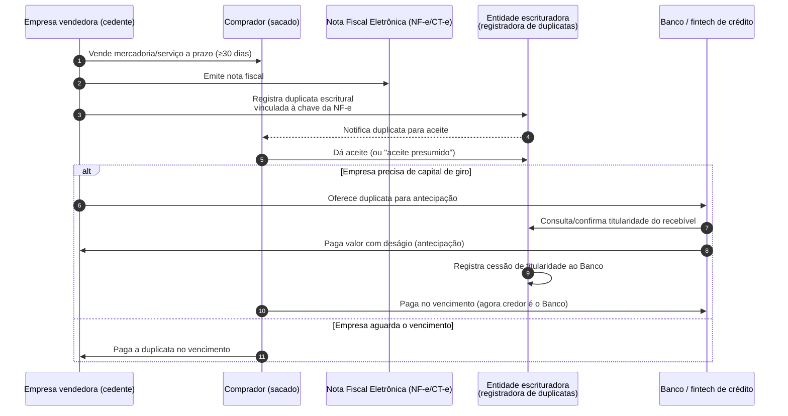
```mermaid
sequenceDiagram
    autonumber
    participant Vendedor as Empresa vendedora (cedente)
    participant Sacado as Comprador (sacado)
    participant NFe as Nota Fiscal Eletrônica (NF-e/CT-e)
    participant Registradora as Entidade escrituradora<br/>(registradora de duplicatas)
    participant Banco as Banco / fintech de crédito

    Vendedor->>Sacado: Vende mercadoria/serviço a prazo (≥30 dias)
    Vendedor->>NFe: Emite nota fiscal
    Vendedor->>Registradora: Registra duplicata escritural<br/>vinculada à chave da NF-e
    Registradora-->>Sacado: Notifica duplicata para aceite
    Sacado->>Registradora: Dá aceite (ou "aceite presumido")

    alt Empresa precisa de capital de giro
        Vendedor->>Banco: Oferece duplicata para antecipação
        Banco->>Registradora: Consulta/confirma titularidade do recebível
        Banco->>Vendedor: Paga valor com deságio (antecipação)
        Registradora->>Registradora: Registra cessão de titularidade ao Banco
        Sacado->>Banco: Paga no vencimento (agora credor é o Banco)
    else Empresa aguarda o vencimento
        Sacado->>Vendedor: Paga a duplicata no vencimento
    end
```

### 13.6 Registradoras de recebíveis

Quando um banco antecipa recebíveis, o registro numa **registradora** autorizada pelo Bacen — CERC, Núclea, TAG, B3 — não é burocracia opcional: é o que dá **oponibilidade a terceiros**, ou seja, o que faz aquele direito ser reconhecidamente seu perante o resto do mercado. Sem registro, nada impede que o mesmo recebível seja prometido a outro financiador.

#### O vocabulário exato (e por que ele importa)

Esta é a parte que mais gera confusão em integração, porque três coisas diferentes convivem:

- **UR (Unidade de Recebível)** — a unidade atômica do registro. Não é "uma venda": é a combinação de recebedor + arranjo (bandeira) + credenciadora + **data de liquidação**. Todas as vendas de um lojista no Visa crédito que caem no dia 15 formam uma UR.
- **Agenda de recebíveis** — o conjunto de URs futuras daquele recebedor. É a "fila" do que ele tem a receber.
- **Contrato** — a operação que incide sobre as URs. E ela vem em dois sabores juridicamente distintos:
  - **Cessão** — a titularidade do recebível é transferida ao financiador.
  - **Gravame / ônus** — a titularidade permanece com o recebedor, mas o recebível fica **onerado**, servindo de garantia. É o mecanismo que impede que ele seja usado de novo em outra operação enquanto estiver ativo.

#### A precisão que evita bug: baixa de quê?

O ponto que mais gera bug aqui é este. É correto dizer que existe uma etapa de baixa depois da liquidação — mas o objeto da baixa geralmente **não é o recebível**, e sim o **ônus** que pesa sobre ele.

A distinção na prática:

- **A UR liquida sozinha.** Ela tem data de liquidação; chegado o dia, ela é liquidada por natureza. Ninguém precisa "dar baixa" na UR para que isso aconteça.
- **O gravame não some sozinho.** Ele precisa de um comando explícito de **desconstituição**, enviado à registradora. Enquanto ele existir, aquele recebível continua bloqueado para novas operações — mesmo já tendo sido pago.
- **A liquidação é direcionada.** No modelo de liquidação centralizada, a registradora informa à credenciadora **para quem** pagar. Ou seja, o dinheiro já sai direto para o financiador; a baixa do ônus é o acerto do registro, não o caminho do dinheiro.

E a desconstituição não acontece só por liquidação. Ela também ocorre por **cancelamento da operação**, **resilição do contrato** pelo recebedor (com prazo regulatório de até dois dias úteis para a credenciadora solicitar a baixa) e **substituição de garantia**. Um sistema que só desconstitui no caminho feliz deixa gravame preso nos demais.

> **Resilição não é rescisão.** **Resilição** é o encerramento do contrato por vontade das partes — ou de uma delas, quando a lei ou o contrato permitem — sem que ninguém tenha descumprido nada. **Rescisão** é o encerramento por inadimplemento, e traz consequências (multa, perdas e danos) que a resilição não traz. O CNAB e os manuais de registradora usam o primeiro termo, e mapeá-lo para "cancelamento por quebra de contrato" no seu domínio produz o tratamento errado.

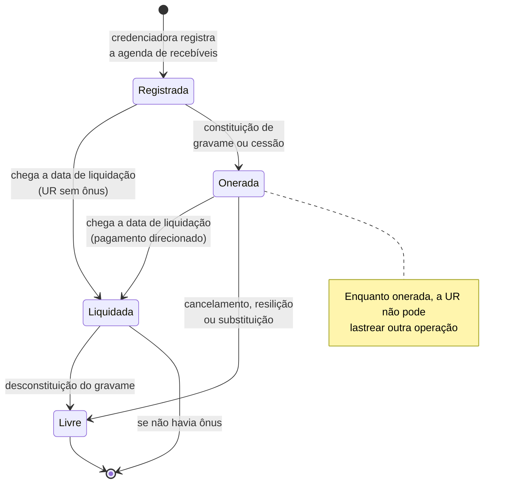
```mermaid
stateDiagram-v2
    [*] --> Registrada: credenciadora registra<br/>a agenda de recebíveis

    Registrada --> Liquidada: chega a data de liquidação<br/>(UR sem ônus)
    Registrada --> Onerada: constituição de<br/>gravame ou cessão

    Onerada --> Liquidada: chega a data de liquidação<br/>(pagamento direcionado)
    Onerada --> Livre: cancelamento, resilição<br/>ou substituição

    Liquidada --> Livre: desconstituição do gravame
    Liquidada --> [*]: se não havia ônus
    Livre --> [*]

    note right of Onerada
        Enquanto onerada, a UR não pode
        lastrear outra operação
    end note
```

Repare na aresta que muita implementação esquece: **`Registrada --> Liquidada`**. Uma UR sem ônus nenhum liquida na data e acabou — não passa por gravame nem precisa de desconstituição. As duas coisas são independentes, e é exatamente essa independência que o diagrama precisa mostrar.

> **Fio condutor — a Padaria do João.** Duas semanas depois da venda, a padaria precisa de caixa para comprar farinha e leva a duplicata de R$ 10.000 ao banco. O banco consulta a registradora, confirma que aquele recebível não está onerado nem cedido a ninguém, paga R$ 9.700 à padaria (deságio de 3%) e registra a operação. A partir daí três coisas passam a ser verdade ao mesmo tempo: o dinheiro já está na conta da padaria, o Mercado da Esquina ainda não pagou nada, e a padaria continua respondendo pelo título se o Mercado não pagar. É a coobrigação da seção 11.5 vista pelo lado do crédito — e é por isso que "antecipou" nunca é o mesmo que "recebeu".

#### Interoperabilidade: o registro é do mercado, não do seu banco

As registradoras são **interoperáveis** por convenção sob supervisão do Bacen. Você registra numa delas, mas a informação circula entre todas — é isso que impede que o mesmo recebível seja onerado na CERC e cedido na Núclea ao mesmo tempo.

> **Analogia:** é um registro distribuído com garantia de unicidade. Cada registradora é um nó, a convenção é o protocolo de consenso, e o efeito prático é o mesmo de um sistema anti-*double-spend*: o recebível só pode estar comprometido em um lugar por vez. Antes disso existir, o mercado operava sem essa trava — e o resultado era exatamente o que se esperaria.

#### Implicações para o seu sistema

- **Conciliação com a registradora é obrigatória**, não opcional. A norma prevê conciliação entre credenciadoras, instituições financeiras e sistemas de registro, inclusive entre registradoras. Na prática: você precisa de uma rotina que compare sua base com a posição da registradora e trate divergências — o mesmo motor de conciliação do capítulo 15.
- **Consulta antes de contratar.** A credenciadora precisa verificar, antes de fechar um contrato, se já existem contratos incidindo sobre aquela agenda. Traduzindo para o código: consulta obrigatória de gravames pré-existentes antes de originar a operação, e ela não pode ser "melhor esforço".
- **Modele o gravame como entidade com estado**, não como flag no título. Ele tem ciclo próprio, prazos regulatórios e motivos de baixa diferentes.
- **Eventos assíncronos e fora de ordem.** Confirmações de registro, liquidação e desconstituição chegam por caminhos distintos e em tempos distintos. Processamento idempotente, com chave por evento, é requisito.
- **A norma muda.** A Resolução BCB nº 264/2022 é a base do registro de recebíveis de arranjo de pagamento, e já foi alterada — a Resolução BCB nº 514/2025 trouxe mudanças com efeitos a partir de maio de 2026. Prazos e comandos devem estar em configuração.

> **Em uma frase:** cadastra-se o recebível e constitui-se o ônus; a UR liquida por conta própria na data; e o que exige comando explícito de baixa é a **desconstituição do gravame** — que também precisa acontecer nos casos de cancelamento e resilição, não só na liquidação.

### Checkpoint

1. Quais são as etapas do ciclo de vida de uma operação de crédito, da proposta à recuperação?
2. Por que `disponível = aprovado − utilizado` está errado?
3. Por que aumentar limite de PIX demora 24h, mas reduzir é instantâneo?
4. No limite prudencial de exposição, por que "cliente" não é o mesmo que CPF/CNPJ?
5. Qual a diferença entre garantia real e fidejussória?
6. O que é LTV e por que o banco aplica *haircut* sobre o valor do bem?
7. A garantia está no contrato assinado. Ela já vale contra terceiros?
8. O FGC protege quem?
9. Depois do write-off, a dívida deixa de existir?
10. O que mudou com a Resolução CMN 4.966/2021 e por que isso é um problema de arquitetura de dados?
11. Numa antecipação de recebíveis, o que exige comando explícito de baixa na registradora?

12. Quantos dias o sacado tem para dar aceite numa duplicata, e o que acontece se ele não fizer nada?

<details>
<summary>Respostas</summary>

(1) Originação, análise, decisão, formalização, desembolso, gestão, quitação ou inadimplência, provisão, write-off e recuperação — lembrando que inadimplência tem volta e write-off pode ser terminal. (2) Falta subtrair o reservado — valores autorizados e ainda não liquidados, sem os quais o cliente gasta o mesmo limite duas vezes. (3) Porque a espera protege quem está sob coação, enquanto reduzir exposição nunca precisa ser barrado. (4) Porque empresas do mesmo grupo econômico ou com dependência econômica entre si contam como um único cliente. (5) Real é vinculada a um bem, fidejussória a uma pessoa que se responsabiliza. (6) LTV é a razão entre o emprestado e o valor do bem; o haircut é a margem de segurança para desvalorização, custo e demora da execução. (7) Não — sem registro no órgão competente ela não vale contra terceiros, e quem registrar primeiro tem preferência. (8) O depositante, não o banco: devolve até R$ 250 mil por CPF/CNPJ por instituição se ela quebrar. (9) Não — sai do ativo contábil mas continua existindo juridicamente. (10) A provisão passou de perda incorrida para perda esperada, exigindo histórico granular de atributos de risco por operação ao longo do tempo. (11) A desconstituição do gravame — a UR liquida sozinha na data, mas o ônus só sai por comando, e também precisa sair em cancelamento e resilição. (12) Dez dias, contados da apresentação, pelo art. 7º da Lei 5.474/68. O silêncio, havendo comprovante de entrega ou de prestação, configura aceite presumido — o título passa a valer como aceito.

</details>

### Exercícios

1. **Implemente `disponível = aprovado − utilizado − reservado`** com controle de concorrência e prove, com duas requisições simultâneas que cabem sozinhas mas não juntas, que só uma passa. Depois acrescente expiração de reserva e mostre que o limite volta.
2. **Modele a garantia como entidade com ciclo de vida próprio** (constituída, registrada, em execução, liberada) e escreva a regra que impede o desembolso antes da confirmação de registro. Teste o caminho em que o registro falha depois do contrato assinado.
3. **Escreva a máquina de estados do gravame** da seção 13.6, incluindo a desconstituição por cancelamento, por resilição e por substituição. Prove por teste que nenhum caminho deixa gravame ativo sobre UR já liquidada.

---

## 14. Compliance

Este é provavelmente o capítulo mais subestimado por devs vindos de outros domínios — e o que mais impacta o dia a dia. Em banco, **compliance não é um departamento que te atrapalha: é requisito funcional do seu sistema.**

### KYC e KYB: conheça seu cliente

**KYC (Know Your Customer)** para pessoa física e **KYB (Know Your Business)** para pessoa jurídica são as obrigações de identificar e qualificar quem entra na instituição.

> **Analogia:** KYC é autenticação; diligência contínua é autorização reavaliada a cada requisição. Nenhum sistema sério confere credencial uma vez no login e confia para sempre — e nenhuma instituição pode identificar o cliente no onboarding e parar por aí. Mudança de comportamento transacional é o equivalente a um token cujo escopo não bate mais com o que está sendo pedido.

Na prática, o onboarding precisa:

- Identificar e validar documentos (com prova de vida/biometria contra fraude de identidade);
- Verificar consistência dos dados (CPF/CNPJ na Receita, endereço, renda declarada);
- Checar listas restritivas: **sanções** internacionais — listas de pessoas e entidades com quem é proibido negociar, publicadas pela ONU e pelo **OFAC** (*Office of Foreign Assets Control*, órgão do Tesouro dos EUA cuja lista é seguida globalmente por causa do alcance do dólar), **PEP** (Pessoas Expostas Politicamente, que exigem diligência reforçada), listas internas;
- No caso PJ, identificar o **beneficiário final** — a pessoa física que de fato controla a empresa, mesmo através de camadas societárias.

**Diligência é contínua, não pontual.** O cliente é re-avaliado ao longo do relacionamento; mudança de comportamento transacional dispara reanálise.

### PLD/FT: prevenção à lavagem de dinheiro e ao financiamento do terrorismo

A instituição é obrigada a **monitorar transações** e **comunicar** operações suspeitas ao **COAF** (Conselho de Controle de Atividades Financeiras). Tecnicamente, isso significa que existe — ou você vai construir — um sistema de:

- **Regras e tipologias** — padrões que disparam alerta (fracionamento de valores para escapar de limiares, movimentação incompatível com a renda declarada, transações circulares entre contas relacionadas, uso de "contas laranja");

  > **Analogia:** PLD é um sistema de detecção de intrusão apontado para dinheiro. As tipologias são as assinaturas conhecidas; o comportamento incompatível com o perfil é a detecção por anomalia; e a fila de análise é o SOC. Vale inclusive a curva ROC: baixar o limiar pega mais crime e afoga o time em falso positivo, subir o limiar limpa a fila e deixa passar o que importa. A diferença é que aqui o custo do falso negativo não é um incidente de segurança — é responsabilização da instituição perante o regulador, e o do falso positivo é um cliente legítimo com a conta travada.
- **Fila de análise** — alertas revisados por analistas humanos;
- **Comunicação ao COAF** — dentro de prazo regulatório, e **sem informar o cliente** (a comunicação é sigilosa por lei).

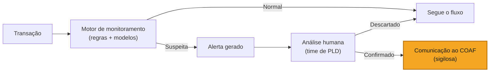
```mermaid
graph LR
    classDef destaque fill:#f5a623,stroke:#b36d00,color:#1a1a1a,stroke-width:2px
    T["Transação"] --> M["Motor de monitoramento<br/>(regras + modelos)"]
    M -->|Normal| OK["Segue o fluxo"]
    M -->|Suspeita| A["Alerta gerado"]
    A --> AN["Análise humana<br/>(time de PLD)"]
    AN -->|Descartado| OK
    AN -->|Confirmado| COAF["Comunicação ao COAF<br/>(sigilosa)"]

    class COAF destaque
```

### Sigilo bancário

Regido pela **Lei Complementar nº 105/2001**: dados de operações e serviços financeiros são protegidos por sigilo. Consequências diretas no seu código:

- **Log é vazamento em potencial.** Logar payload completo de transação, saldo ou dados de conta é violação — não "má prática".
- **Acesso precisa ser justificado e rastreável.** Consultar dados de cliente sem motivo de negócio é infração, mesmo para um dev com acesso ao banco de dados de produção.
- **Ambientes de teste não podem usar dados reais** sem mascaramento/anonimização.
- **Quebra de sigilo** só ocorre em hipóteses legais específicas (ordem judicial, CPI, requisição fiscal regulada) — nunca por solicitação informal.

### LGPD e a interseção com o sigilo

A **LGPD (Lei nº 13.709/2018)** se soma ao sigilo bancário — não o substitui. Pontos que afetam arquitetura:

- **Base legal** — em banco, boa parte do tratamento se apoia em *obrigação legal/regulatória* e *execução de contrato*, não em consentimento. Isso é importante: o cliente **não pode** pedir exclusão de dados que a instituição é obrigada a reter.

  > **Analogia:** é log de auditoria com retenção compulsória. Você não apaga porque alguém pediu; você apaga quando a política de retenção permite. A diferença entre "não quero mais" e "posso apagar" é exatamente a diferença entre consentimento e obrigação legal como base do tratamento.
- **Retenção** — normas do SFN exigem guarda de registros por prazos longos (tipicamente 5 a 10 anos, conforme o tipo). "Direito ao esquecimento" convive com essa obrigação.
- **Minimização** — colete só o necessário para a finalidade declarada.
- **Trilha de auditoria** — quem acessou o quê, quando e por quê, de forma imutável.

### Regulação prudencial (por que existem limites que parecem arbitrários)

Sob o acordo internacional de **Basileia**, cada instituição precisa manter **capital próprio proporcional ao risco** que assume. Se a carteira de crédito cresce, a exigência de capital cresce junto. É por isso que existem limites de exposição por cliente, por setor e por tipo de operação — restrições que chegam ao seu backlog como "regra de negócio" e cuja origem real é regulatória.

### Ouvidoria e reclamações no Bacen

Instituições têm **ouvidoria obrigatória** como última instância interna, e o Bacen publica ranking de reclamações. Uma falha sistêmica no seu código — cobrança duplicada, boleto emitido errado, PIX não creditado — vira reclamação registrada e pode virar processo administrativo. É a tradução concreta do **risco operacional** do capítulo 3.

> **Analogia:** o ranking de reclamações do Bacen é um painel público de SLO com o nome da sua empresa nele. A diferença é que o alerta não chega no seu canal — chega na imprensa e na diretoria.

### Checkpoint

1. Qual a diferença entre KYC e diligência contínua?
2. Por que a comunicação ao COAF não pode ser informada ao cliente?
3. Logar o payload completo de uma transação é má prática ou infração?
4. Um cliente pede exclusão dos dados dele. A instituição é obrigada a atender?
5. Por que existe limite de exposição por cliente, e de onde vem essa regra?
6. O que é beneficiário final e por que ele importa no KYB?

<details>
<summary>Respostas</summary>

(1) KYC é a identificação e qualificação no momento em que o cliente entra; a diligência contínua é a reavaliação ao longo do relacionamento, disparada por mudança de comportamento transacional. (2) Porque a comunicação é sigilosa por lei — avisar o cliente frustraria a investigação e é, em si, infração. (3) Infração. Sigilo bancário é a Lei Complementar 105/2001, e dado de operação financeira em log é vazamento, não descuido de engenharia. (4) Não, quando o tratamento se apoia em obrigação legal ou regulatória: as normas do SFN exigem guarda por prazos longos, e essa base legal prevalece sobre o pedido. (5) Para conter risco de concentração — se um único devedor pode derrubar a instituição ao quebrar, a exposição precisa ser capada. A origem é prudencial, do acordo de Basileia traduzido em normas do CMN. (6) É a pessoa física que de fato controla a empresa, mesmo através de camadas societárias. Importa porque sem ele o KYB identifica um CNPJ e não identifica ninguém.

</details>

---

## 15. Conciliação, estorno, fraude e disputas

### Conciliação: o ritual diário do backend financeiro

**Conciliação** é conferir se o que o seu sistema registrou bate com o que a contraparte registrou. É rotina diária e inegociável em qualquer instituição.

O padrão geral:

1. Receber o **extrato/arquivo da contraparte** — retorno CNAB do banco, extrato de conta, ou o **EDI** da credenciadora. *EDI* (*Electronic Data Interchange*) é o termo genérico para troca estruturada de arquivos entre empresas; no jargão de adquirência, "o EDI" é especificamente o arquivo diário de vendas, ajustes e liquidações que a credenciadora envia ao lojista;
2. Comparar com os registros internos, casando por chave (identificador da transação, valor, data);
3. Classificar as divergências: existe só na contraparte, existe só internamente, valores diferentes, duplicidade;
4. Tratar cada divergência — automaticamente quando a regra permite, manualmente quando não.

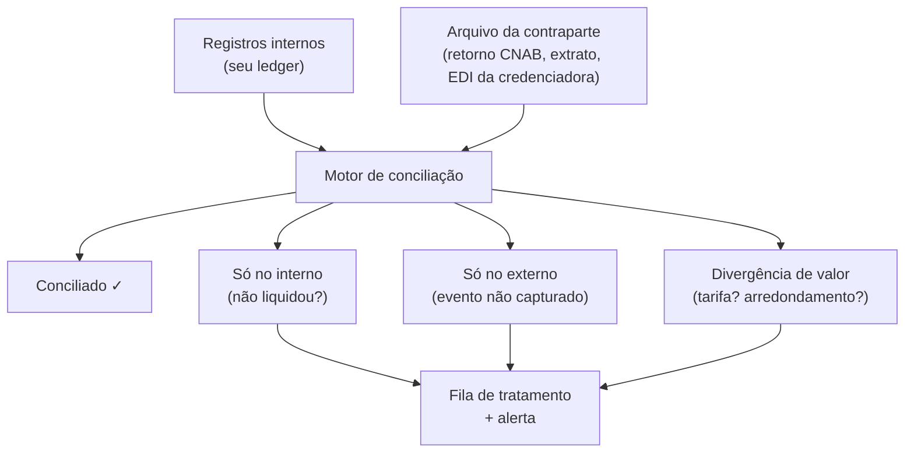
```mermaid
graph TB
    INT["Registros internos<br/>(seu ledger)"] --> CONC["Motor de conciliação"]
    EXT["Arquivo da contraparte<br/>(retorno CNAB, extrato, EDI da credenciadora)"] --> CONC
    CONC --> OK["Conciliado ✓"]
    CONC --> D1["Só no interno<br/>(não liquidou?)"]
    CONC --> D2["Só no externo<br/>(evento não capturado)"]
    CONC --> D3["Divergência de valor<br/>(tarifa? arredondamento?)"]
    D1 --> TRAT["Fila de tratamento<br/>+ alerta"]
    D2 --> TRAT
    D3 --> TRAT
```

Requisitos que decorrem disso e que valem como princípio de projeto:

- **Idempotência** — reprocessar o mesmo arquivo não pode duplicar lançamento. Chave natural + hash do conteúdo.
- **Ledger append-only** — nunca sobrescreva um lançamento; registre um novo que o corrige.
- **Rastreabilidade ponta a ponta** — um identificador único que atravessa todos os sistemas envolvidos.

### Estorno, cancelamento e devolução

Três coisas diferentes, frequentemente confundidas:

| Termo | O que é |
|---|---|
| **Cancelamento** | Anula antes da liquidação — a operação não chega a acontecer |
| **Estorno** | Lançamento contrário que anula o efeito de uma operação já liquidada |
| **Devolução** | Nova transação em sentido oposto, com identidade própria |

O princípio contábil: **você não apaga o lançamento original** — você registra o movimento compensatório. O histórico precisa mostrar que algo aconteceu e depois foi revertido.

### MED: o mecanismo de devolução do PIX

O **MED (Mecanismo Especial de Devolução)**, regulamentado pela **Resolução BCB nº 103/2021**, permite contestar um PIX quando há indício de **fraude, golpe ou falha operacional da instituição**.

O **MED 2.0** foi instituído pela **Resolução BCB nº 493/2025**, publicada em 28 de agosto de 2025 — é ela, e não a 103/2021, que reescreveu o mecanismo. A adoção foi escalonada: facultativa a partir de 23 de novembro de 2025 e **obrigatória a partir de 2 de fevereiro de 2026** para participantes provedores de conta transacional e liquidantes especiais.

A principal evolução é o **rastreamento em cadeia**: antes, só a primeira conta que recebia o valor era analisada; agora o rastreamento segue o dinheiro por **até cinco camadas** de contas, acompanhando a tática de fraudadores que pulverizam valores. Junto vieram o bloqueio imediato dos recursos ao registro da notificação de infração e a contestação por autoatendimento no app, sem passar por atendente.

> **Cuidado com a data, se você está lendo isto em 2026.** O MED 2.0 está em produção desde 11 de maio de 2026, mas a camada operacional que identifica **em qual camada** da cadeia a notificação se refere só passa a vigorar em **26 de outubro de 2026** (IN BCB nº 767, que adiou a data originalmente prevista para agosto). Dizer que o rastreamento em cadeia está plenamente vigente desde fevereiro descreve um estado que ainda não é o atual.

#### Os prazos, decompostos

Material sobre MED costuma somar prazos e apresentar um número só. Para quem vai implementar SLA, temporizador ou máquina de estados, a soma é inútil — o que importa é cada etapa:

| Prazo | O quê | Contado de |
|---|---|---|
| **80 dias corridos** | Prazo para o usuário **acionar** o MED sobre uma transação | A data da transação |
| **Análise da notificação** | O PSP do recebedor bloqueia de imediato e analisa a notificação de infração | O registro da notificação |
| **até 96 horas** | Efetivação da devolução **após** a aprovação | A aprovação da análise |
| **até 90 dias** | Monitoramento da conta do recebedor para bloqueios adicionais e devoluções parciais, quando não há saldo suficiente | A transação original |
| **80 dias** | Prazo para **contestar uma devolução já realizada** pelo MED | A devolução |

**Atenção ao último item, porque ele é a origem de metade da confusão.** São dois prazos de 80 dias diferentes: um para acionar o mecanismo, outro para contestar o resultado dele. O segundo era de 30 dias e **passou para 80 a partir de 1º de setembro de 2026**. Usar "80 dias" sem dizer qual deles é torná-los intercambiáveis, e eles não são.

O número que circula somado por aí — "11 dias" — é a análise mais a devolução vistas de fora, e é justamente o que seu sistema **não** pode usar. Você precisa de dois temporizadores separados: um que cobra a resposta da análise, outro que dispara a efetivação da devolução aprovada. E, para o valor exato de cada um, a fonte é o **Manual de Tempos do Pix** e o **Manual Operacional do DICT**, não a norma nem material secundário — os prazos vivem lá justamente porque são revisados com frequência. Trate-os como configuração com vigência, do mesmo jeito que os limites de valor da seção 13.2.

**Limites importantes** (e que geram muito ticket de suporte mal direcionado):

- **Não cobre erro de digitação** do próprio usuário — mandar PIX para a chave errada não é caso de MED.
- **Não cobre arrependimento de compra** nem **desacordo comercial** (produto não entregue, defeito). Isso é relação de consumo, resolvida por outros canais.
- **Não garante devolução** — depende de comprovação de fraude e de ainda existir saldo na conta do recebedor. Se o valor foi sacado em espécie, sai do sistema e não há como recuperar.

### O padrão que se repete

Repare que **chargeback** (cartão), **MED** (PIX) e **estorno de boleto** são instâncias do mesmo problema arquitetural:

> Uma transação liquidada e considerada "final" pode ser revertida depois, por decisão de um terceiro, fora do controle do seu sistema.

Se você tira uma única lição de arquitetura desta apostila, que seja esta: **em sistema financeiro, "pago" nunca é um estado terminal imutável.**

> **Analogia:** é o padrão *saga*. Em sistemas distribuídos, você não consegue segurar uma transação aberta entre serviços que não controla, então aceita o *commit* local e prepara uma **transação compensatória** para quando algo der errado lá na frente. Chargeback e MED são exatamente isso: a compensação chegando semanas depois, disparada por alguém que não é você. Se o seu modelo não previu o caminho de volta, ele vai precisar ser reescrito.

Modele estados reversíveis, guarde histórico completo e nunca destrua informação.

> **Fio condutor — a Padaria do João, epílogo.** O Mercado da Esquina paga a duplicata no vencimento, com três dias de atraso. O dinheiro vai direto para o banco, que é o credor desde a antecipação — a padaria não recebe nada, porque já recebeu R$ 9.700 duas semanas antes. Na conciliação do dia, a padaria precisa casar quatro registros que nunca vão bater por valor: os R$ 10.000 do lançamento de receita (capítulo 5), os R$ 9.700 que entraram na antecipação, os R$ 10.210 que o Mercado efetivamente pagou com juros e multa, e os R$ 10.206,50 líquidos no retorno CNAB. Nenhum desses números é errado. Eles só respondem a perguntas diferentes — e um sistema que guarda um campo `valor` só consegue responder a uma delas.
>
> E se o Mercado tivesse contestado o pagamento, ou se o boleto tivesse sido adulterado, nada disso seria terminal. É esse o ponto do capítulo.

### Checkpoint

1. Cancelamento, estorno e devolução: qual a diferença entre os três?
2. Por que não se apaga o lançamento original ao reverter uma operação?
3. Quais são os dois prazos de 80 dias do MED, e por que confundi-los é grave?
4. O MED cobre PIX enviado para a chave errada por engano do próprio usuário?
5. Qual norma reescreveu o MED, e desde quando ele é obrigatório?
6. O que chargeback, MED e estorno de boleto têm em comum, do ponto de vista de arquitetura?

<details>
<summary>Respostas</summary>

(1) Cancelamento anula antes da liquidação — a operação não chega a acontecer; estorno é um lançamento contrário que anula o efeito de algo já liquidado; devolução é uma transação nova, em sentido oposto, com identidade própria. (2) Porque o histórico precisa mostrar que algo aconteceu e depois foi revertido — apagar destrói a auditabilidade e quebra o fechamento de períodos já encerrados. (3) Um é o prazo para acionar o MED sobre a transação (80 dias corridos da transação); o outro é o prazo para contestar uma devolução já realizada, que era de 30 dias e passou a 80 em 1º/09/2026. Confundi-los faz o timer disparar sobre o evento errado. (4) Não — erro de digitação do próprio usuário está fora do escopo, assim como arrependimento de compra e desacordo comercial. (5) A Resolução BCB nº 493/2025; obrigatório desde 2 de fevereiro de 2026, com a camada operacional de identificação de camada vigorando a partir de 26 de outubro de 2026. (6) Todos são a mesma coisa: uma transação liquidada e tida como final sendo revertida depois, por decisão de um terceiro, fora do controle do seu sistema. É o padrão *saga* com a compensação chegando semanas depois.

</details>

---

## 16. Open Finance

O Open Finance Brasil é hoje um dos maiores ecossistemas do mundo em volume: **mais de 800 instituições participantes**, dezenas de milhões de consentimentos ativos e bilhões de chamadas de API por semana entre instituições (números de 2026). Para o dev, ele resolve um problema concreto: antes, cada banco tinha API própria, onboarding próprio e credenciais próprias. O Open Finance padroniza **compartilhamento de dados e iniciação de pagamento** sob regras comuns do Bacen.

> **Analogia:** é OAuth aplicado a dinheiro. O cliente autoriza um app terceiro a acessar dados que estão em outro provedor, com escopo definido ("só extrato", "só iniciar pagamento") e prazo de validade. Ninguém entrega senha do banco a ninguém, e o consentimento pode ser revogado a qualquer momento — exatamente o modelo de token que você já conhece.

### Os dois papéis, e por que eles mudam tudo

Antes das peças, a distinção que organiza o resto: toda instituição no Open Finance é **transmissora**, **receptora** ou as duas.

| Papel | O que faz | O que isso exige do seu sistema |
|---|---|---|
| **Transmissora** (detentora) | Entrega os dados do cliente a quem ele autorizou | APIs de leitura padronizadas, com SLA e disponibilidade auditados pelo Bacen. Você vira **provedor**, e a carga vem de fora |
| **Receptora** | Consome dados de outras instituições | Cliente HTTP resiliente contra centenas de contrapartes, cada uma com sua janela de indisponibilidade |
| **Iniciadora (ITP)** | Inicia pagamento em nome do cliente | Não custodia dinheiro: envia a ordem à detentora, que executa |

Ser transmissora é a parte que surpreende. As métricas de disponibilidade e tempo de resposta das suas APIs são **reportadas e comparadas publicamente**, e degradação vira apontamento regulatório. Não é integração de melhor esforço.

### Ciclo de vida do consentimento

O consentimento é o objeto central do Open Finance e é uma máquina de estados com prazos, não um booleano:

```mermaid
stateDiagram-v2
    [*] --> Criado: receptora solicita<br/>escopo e prazo
    Criado --> Autorizado: cliente autentica<br/>na detentora
    Criado --> Rejeitado: cliente recusa
    Criado --> Expirado: não autenticou<br/>na janela

    Autorizado --> Consumindo: receptora acessa<br/>dentro do escopo
    Consumindo --> Revogado: cliente revoga<br/>(em qualquer das duas pontas)
    Consumindo --> Expirado: fim do prazo

    Rejeitado --> [*]
    Revogado --> [*]
    Expirado --> [*]
```

Três coisas que decorrem disso:

- **A revogação vale das duas pontas.** O cliente pode revogar no app da receptora ou no da detentora, e as duas precisam refletir a revogação. Isso significa que nenhuma das duas pode tratar o próprio banco de dados como fonte da verdade — é sincronização, não cache.
- **Escopo é granular e vinculado.** "Dados cadastrais" e "dados transacionais de conta" são permissões distintas, e cada chamada precisa ser verificada contra o escopo concedido, não contra a existência do consentimento.
- **Prazo é finito.** O consentimento de compartilhamento de dados vale por até 12 meses e precisa ser renovado. Produto construído em cima dele precisa de uma estratégia de renovação, ou o serviço para de funcionar sozinho na data.

### As peças técnicas

- **Diretório de participantes** — o registro central que diz quem é quem no ecossistema: qual instituição existe, quais papéis exerce, quais certificados são válidos e onde ficam seus endpoints. Ele é a raiz de confiança; sem consultar o diretório, você não tem como saber se a instituição do outro lado é legítima.
- **FAPI** (*Financial-grade API*) — o perfil de segurança sobre OAuth 2.0 e OpenID Connect que o Open Finance Brasil adota. Ele endurece o OAuth que você já conhece: exige mTLS ou chaves privadas para autenticação do cliente, tokens vinculados ao certificado que os obteve (*sender-constrained*), requisição de autorização assinada e resposta assinada. Na prática, a maior parte da dificuldade de entrar no ecossistema está aqui, não nas APIs de negócio.
- **Certificados** — dois tipos, e confundi-los custa dias: um para **transporte** (o mTLS da conexão) e outro para **assinatura** (a integridade das mensagens). Valem as mesmas regras de rotação e monitoramento do capítulo 8.
- **Fases** — o ecossistema foi implantado em etapas: dados abertos de produtos e canais, dados cadastrais e transacionais do cliente, iniciação de pagamento, e a ampliação para investimentos, câmbio, seguros e previdência.

### Iniciação de pagamento: quem fala com o SPI

- **Iniciação de pagamento (payment initiation)** — uma instituição terceira pode iniciar um PIX em nome do cliente, com autorização, sem que ele saia do app do iniciador.
- **JSR — Jornada Sem Redirecionamento** — mudança regulatória (Resolução BCB nº 406/2024) que elimina o antigo fluxo de "sair do app A, autenticar no app B, voltar para o app A"; a confirmação passa a ocorrer dentro do próprio app, via biometria ou push do banco. Tornou-se obrigatória para todos os participantes do arranjo PIX a partir de janeiro de 2026.
- **Pix Automático via Open Finance** — portabilidade de recorrência entre bancos sem convênio bilateral.

Aqui está o ponto que material sobre Open Finance erra com frequência: **o iniciador não fala com o SPI.** Ele não é participante do SPI, não tem Conta PI e não está conectado à RSFN — as três coisas que o capítulo 8 e o capítulo 10 estabeleceram como pré-requisito para liquidar PIX. O que o ITP faz é enviar o **consentimento de pagamento e a ordem** à instituição detentora da conta; é ela que emite a `pacs.008` ao SPI e responde pela liquidação.

```mermaid
sequenceDiagram
    autonumber
    participant Cliente
    participant ITP as Iniciador (ITP)
    participant Detentora as Instituição detentora da conta
    participant SPI as SPI (Bacen)
    participant Recebedor as PSP do recebedor

    Cliente->>ITP: Escolhe pagar pelo app do iniciador
    ITP->>Detentora: Cria consentimento de pagamento
    Detentora->>Cliente: Autenticação (JSR: sem sair do app)
    Cliente->>Detentora: Confirma
    ITP->>Detentora: Envia a ordem de pagamento
    Detentora->>SPI: pacs.008 (a detentora é quem liquida)
    SPI->>Recebedor: Liquidação entre Contas PI
    SPI-->>Detentora: Confirmação
    Detentora-->>ITP: Status do pagamento
    ITP-->>Cliente: "Pago"
```

A consequência prática: se você constrói um iniciador, **você não controla a liquidação** e não tem visibilidade direta do SPI. Seu tratamento de erro e sua conciliação são contra a detentora, e o pior estado do seu sistema é "ordem enviada, sem resposta" — que exige consulta de status, não retry cego.

### Checkpoint

1. O que muda para uma instituição quando ela é transmissora em vez de receptora?
2. O consentimento é um booleano no seu banco de dados?
3. O que o FAPI acrescenta ao OAuth 2.0 que você já conhece?
4. Para que serve o diretório de participantes?
5. Um iniciador de pagamento envia a `pacs.008` ao SPI?
6. O que acontece com um produto construído sobre consentimento quando passam 12 meses?

<details>
<summary>Respostas</summary>

(1) Ela vira provedora: precisa expor APIs padronizadas com disponibilidade e tempo de resposta auditados e comparados publicamente pelo Bacen, e a carga chega de fora, sem controle dela. (2) Não — é uma máquina de estados com escopo granular e prazo, revogável nas duas pontas, o que significa que o estado local é sincronização e não fonte da verdade. (3) mTLS ou chave privada para autenticar o cliente, tokens vinculados ao certificado que os obteve, e assinatura da requisição de autorização e da resposta. (4) É a raiz de confiança do ecossistema: diz quais instituições existem, que papéis exercem, quais certificados são válidos e onde ficam seus endpoints. (5) Não. Ele envia o consentimento e a ordem à instituição detentora da conta, que é participante do SPI e emite a `pacs.008`. O iniciador não tem Conta PI nem conexão à RSFN. (6) Ele para de funcionar, a menos que exista estratégia de renovação — o prazo do consentimento de dados é de até 12 meses.

</details>

---

## 17. Visão consolidada

Juntando tudo: da tela do cliente até a conta de Reservas Bancárias no Bacen.

```mermaid
graph TB
    classDef destaque fill:#f5a623,stroke:#b36d00,color:#1a1a1a,stroke-width:2px

    subgraph L1["Camada de aplicação (o que você constrói)"]
        APP["App / core bancário / sistema de cobrança"]
    end

    subgraph L2["Camada regulatória de dados"]
        DICT2["DICT — chaves PIX"]
        SCR2["SCR — histórico de crédito"]
        OF["Open Finance — consentimento e dados"]
    end

    subgraph L3["Camada de compensação (câmaras)"]
        NUCLEA2["Núclea — boleto, TED, cartão"]
        B32["B3 — mercado de capitais"]
    end

    subgraph L4["Camada de liquidação final — Bacen"]
        STR2["STR — LBTR"]
        SPI2["SPI — LBTR 24/7 (PIX)"]
        SELIC2["SELIC — títulos públicos"]
    end

    subgraph L5["Contas do participante no Bacen"]
        RESERVA["Reservas Bancárias"]
        CONTAPI2["Conta PI"]
    end

    APP --> DICT2
    APP --> SCR2
    APP --> OF
    APP --> SPI2
    APP --> NUCLEA2
    APP --> B32

    NUCLEA2 --> STR2
    B32 --> STR2
    SELIC2 --> RESERVA
    STR2 --> RESERVA
    SPI2 --> CONTAPI2
    RESERVA -->|"pré-financiamento via STR"| CONTAPI2

    class RESERVA,CONTAPI2 destaque
```

**Takeaway de arquitetura:** não importa o trilho — PIX, TED, boleto, cartão, ação, título público —, todos convergem para **uma conta do participante no Bacen**. Para os trilhos tradicionais, é a conta de **Reservas Bancárias**, via STR; para o PIX, é a **Conta PI**, via SPI — e a Conta PI é, por sua vez, pré-financiada a partir de Reservas. A convergência existe; ela só tem duas portas, não uma.

Isso é o que garante baixo risco sistêmico no Brasil (o Bacen frequentemente é citado como um dos sistemas de liquidação mais seguros do mundo) e é também por isso que **liquidação é sempre a etapa mais lenta e mais auditável** do seu fluxo — vale desenhar reconciliação em cima dela, não em cima da "confirmação" otimista da camada de compensação.

### Checkpoint final

Se você conseguir responder a estas seis sem voltar ao texto, a apostila cumpriu o que prometeu:

1. Um pagamento chega ao seu sistema. Quais são as três camadas que ele atravessa até virar dinheiro definitivo, e qual delas é irrevogável?
2. Por que "pago" não pode ser um estado terminal no seu modelo — e cite três mecanismos diferentes que provam isso.
3. Seu ledger tem uma coluna `saldo`. Que três capacidades você perdeu?
4. Um cliente pergunta por que o título dele não baixou. Que dado bruto você precisa ter guardado para responder em minutos?
5. Qual a diferença entre compensação e liquidação, e por que dar baixa definitiva na primeira é erro de arquitetura?
6. Cite três coisas do seu backlog que parecem regra arbitrária de negócio e cuja origem real é regulatória.

<details>
<summary>Respostas</summary>

(1) A camada de aplicação (o ledger do seu banco), a camada de compensação (câmara, quando houver) e a camada de liquidação (STR ou SPI, movendo Reservas ou Conta PI). Só a última é irrevogável. (2) Porque a reversão vem de fora e depois: chargeback no cartão, MED no PIX, devolução no CNAB — e ainda a liquidação após baixa (`17`) na cobrança, que reverte no sentido contrário. (3) Auditabilidade, capacidade de reconstruir o estado em qualquer data passada, e a detecção de divergência por recálculo — que é o alarme de integridade do sistema. (4) O código de ocorrência bruto, com as dez posições inteiras, o arquivo em que ele foi reportado e a data em que você informou o cliente. Status derivado sozinho não responde. (5) Compensação apura quem deve quanto a quem; liquidação transfere de fato. Dar baixa na compensação é assumir como final um evento ainda reversível, e é o que produz título quitado sem pagamento. (6) Entre outras: limite de exposição por cliente (Basileia), assimetria de 24h para aumentar e instantâneo para reduzir limite de PIX (proteção contra coação), segregação de recursos em conta de pagamento, obrigatoriedade de CET, retenção longa de dados apesar da LGPD, registro de garantia antes do desembolso.

</details>

---

## 18. Glossário técnico

| Termo | Significado | Onde você vê na prática |
|---|---|---|
| **Arranjo de pagamento** | Conjunto de regras que faz um meio de pagamento funcionar entre várias instituições | Define quem participa, prazos, responsabilidades e disputas |
| **Instituidor do arranjo** | Quem define essas regras | Bandeira, no cartão; Bacen, no PIX |
| **Participante direto × indireto** | Direto tem conta própria no Bacen; indireto liquida por meio de um direto | Você concilia contra quem liquida, não contra o Bacen |
| **Banco liquidante** | Instituição com conta no Bacen que liquida em nome de terceiros | Como IPs e participantes indiretos alcançam o STR/SPI |
| **Conta PI** | Conta no Bacen usada exclusivamente para liquidação do PIX | Pré-financiada a partir de Reservas via STR, nunca negativa, remunerada pela Selic |
| **Conta de pagamento** | Conta mantida por IP com recursos de terceiros | Segregada, fora do balanço da IP, não lastreia crédito |
| **IP (Instituição de Pagamento)** | Não capta depósito à vista nem empresta recursos de conta de pagamento | Regime específico do Bacen; nem toda IP tem código COMPE |
| **Conta gráfica** | Conta interna, sem existência no sistema bancário externo | Carteiras digitais, subcontas |
| **Redesconto intradia** | Operação compromissada sem custo para liquidez no dia | Rotina do STR, não medida de emergência |
| **ISPB × COMPE** | Identificador de 8 dígitos no SPB × código legado de 3 dígitos | Coexistem; nem toda IP tem COMPE |
| **Conta contábil** | Categoria classificatória da instituição (≠ conta do cliente) | Plano de contas, natureza devedora/credora |
| **Lançamento** | Registro atômico e balanceado de um fato contábil | Append-only, Σ D = Σ C |
| **Partida** | Cada linha débito/crédito de um lançamento | 2..N por lançamento |
| **Diário / Razão / Balancete** | Journal / ledger / trial balance | Event store, read model e teste de integridade |
| **COSIF** | Plano contábil obrigatório do SFN | Circular BCB 1.273/1987; código G.S.D.TT.SS-V e atributos |
| **Conta de compensação** | Registro fora do balanço | Limites não usados, garantias, avais |
| **Conta transitória** | Classificação temporária de valor não identificado | Precisa zerar; saldo residual é sintoma de bug |
| **Competência × Caixa** | Reconhecer pelo fato econômico × pelo movimento do dinheiro | Apropriação diária de juros em batch |
| **Emissor / Credenciadora / Bandeira** | Papéis do arranjo de cartões | Autorização, captura, liquidação |
| **MDR / Intercâmbio** | Taxa paga pelo lojista / fatia repassada ao emissor | Precificação de adquirência |
| **Chargeback** | Contestação de compra no cartão | Transação liquidada pode ser revertida |
| **MED** | Mecanismo Especial de Devolução do PIX | Res. BCB 103/2021, reescrito pela Res. BCB 493/2025; MED 2.0 obrigatório desde 02/02/2026 |
| **KYC / KYB** | Identificação de cliente PF / PJ | Onboarding, listas de sanções, PEP |
| **PLD/FT** | Prevenção à lavagem de dinheiro e financiamento ao terrorismo | Monitoramento, alertas, comunicação ao COAF |
| **COAF** | Órgão que recebe comunicações de operações suspeitas | Comunicação sigilosa, sem avisar o cliente |
| **PEP** | Pessoa Exposta Politicamente | Exige diligência reforçada no onboarding |
| **Sigilo bancário** | LC 105/2001 | Log de payload é vazamento; acesso precisa ser rastreável |
| **PDD / PPE** | Provisão para perdas de crédito | Res. CMN 4.966/21 — perda esperada (IFRS 9) |
| **Write-off** | Baixa contábil do crédito para prejuízo | A dívida continua existindo juridicamente |
| **Alienação fiduciária / Gravame** | Garantia real sobre bem / registro do ônus | Financiamento de veículo e imóvel |
| **CCB** | Cédula de Crédito Bancário | Instrumento de formalização do crédito |
| **CET** | Custo Efetivo Total | Obrigatório informar antes da contratação |
| **Price / SAC** | Sistemas de amortização | Parcela fixa vs. amortização constante |
| **Basileia** | Acordo de capital mínimo por risco | Origem de limites de exposição |
| **Conciliação** | Casamento entre registros internos e da contraparte | Rotina diária; exige idempotência |
| **Liquidez** | Facilidade de converter um ativo em caixa sem perda de valor | Horários de corte, limites, produtos de resgate |
| **Compensação (clearing)** | Apuração de quem deve quanto a quem | Núclea, câmaras — ainda não é dinheiro movido |
| **Liquidação (settlement)** | Transferência definitiva e irrevogável de recursos | STR, SPI — estado final do seu fluxo |
| **LBTR / LDL** | Liquidação bruta em tempo real / diferida líquida | STR e SPI (LBTR); câmaras de varejo (LDL) |
| **Netting** | Compensação multilateral de saldos | Reduz liquidez necessária em modelos LDL |
| **D+0 / D+1 / D+2** | Prazo de liquidação em dias úteis | Régua de conciliação, calendário de feriados |
| **Float** | Dinheiro "no ar" entre saída e chegada | Reduzido drasticamente pelo PIX |
| **Deságio** | Desconto ao antecipar um recebível | Antecipação de duplicatas |
| **Spread bancário** | Margem entre captação e empréstimo | Precificação de crédito |
| **Moeda escritural** | Saldo do cliente = passivo do banco | O `saldo` no seu banco de dados |
| **Moeda de banco central** | Reservas do banco no Bacen | Única que quita obrigação interbancária |
| **Partidas dobradas** | Todo lançamento tem débito e crédito equivalentes | Ledger append-only, invariante de auditoria |
| **Bacen / BCB** | Banco Central do Brasil | Regulador e operador de STR, SPI, SCR |
| **CMN** | Conselho Monetário Nacional | Origem das Resoluções que você cita em specs |
| **ISPB** | Identificador único do participante do SPB (8 dígitos) | Header de mensagens PIX, cadastro DICT |
| **RSFN** | Rede do Sistema Financeiro Nacional | Rede privada exigida p/ acessar STR/SPI/DICT |
| **STR** | Sistema de Transferência de Reservas | Liquidação final, LBTR, contas de reserva |
| **SPI** | Sistema de Pagamentos Instantâneos | Motor de liquidação do PIX |
| **DICT** | Diretório de Identificadores de Contas Transacionais | Resolve chave PIX → conta/ISPB |
| **CIP / Núclea** | Câmara de compensação privada | Boleto, cartão, parte do PIX |
| **SELIC** | Sistema de custódia/liquidação de títulos públicos | Não confundir com a taxa Selic |
| **SCR** | Sistema de Informações de Crédito | Histórico de crédito, base de decisão |
| **Carteira de cobrança** | Contrato que define o papel do banco sobre os títulos | Campo obrigatório no CNAB; código varia por banco |
| **Cobrança simples** | Banco só cobra e repassa, como mandatário | Título continua do cedente; sem crédito envolvido |
| **Cobrança caucionada** | Títulos dados em garantia de uma linha de crédito | Pagamento amortiza a dívida do cedente |
| **Cobrança descontada** | Títulos endossados ao banco, que antecipa com deságio | Banco vira credor, mas há coobrigação |
| **Coobrigação / regresso** | Cedente responde se o sacado não pagar | Risco não some com a antecipação |
| **Cedente** | Quem tem o valor a receber e emite a cobrança | O outro lado do sacado |
| **Instrução / ocorrência** | Comando na remessa / resposta no retorno | Rejeição silenciosa é armadilha clássica |
| **DDA** | Débito Direto Autorizado | Boleto entregue eletronicamente no app do pagador |
| **CNAB 240/400** | Layout de arquivo posicional padrão Febraban | Remessa/retorno de cobrança e pagamento; dialeto por banco |
| **Forma de lançamento** | Trilho pelo qual o pagamento anda (`01` conta, `41` TED, `45` PIX, `31` título) | Fica no header de lote e determina o segmento do detalhe |
| **Tipo de serviço** | O que está sendo pago (`20` fornecedor, `30` folha, `22` tributos) | Junto com a forma de lançamento, define o recorte do lote |
| **Segmento A / B** | Detalhe de crédito em conta, TED ou PIX, e seu complemento | O B virou o registro da chave PIX e do QR Code |
| **Segmento J / J-52** | Detalhe de liquidação de título, e o complemento com sacado e sacador | O J carrega o código de barras de 44 posições |
| **Seu número (pagamento)** | Nº do documento atribuído pela empresa (A 73-92, J 183-202) | A chave de correlação entre remessa e retorno |
| **NSA** | Nº sequencial do arquivo, no header | Único e crescente por cliente; furo ou repetição derruba ERP |
| **Retorno parcial / consolidado** | Convenção comercial de emitir o retorno em recortes ao longo do dia ou completo no fechamento | Não existe no padrão Febraban; precisa ser acordado por escrito |
| **PSP** | Prestador de Serviço de Pagamento | Qualquer participante do arranjo PIX |
| **Open Finance** | Compartilhamento regulado de dados/serviços financeiros | Consentimento, iniciação de pagamento |
| **JSR** | Jornada Sem Redirecionamento | UX de confirmação sem sair do app |
| **LBTR** | Liquidação Bruta em Tempo Real | Modelo usado por STR e SPI |
| **Correspondente bancário** | Canal terceirizado de originação | Fintechs de crédito operando "para" um banco |
| **Limite rotativo** | Teto que se recompõe conforme o cliente paga | Cartão de crédito, cheque especial |
| **Limite reservado** | Valor autorizado e ainda não liquidado | `disponível = aprovado − utilizado − reservado` |
| **LTV** | Razão entre valor emprestado e valor do bem | Financiamento imobiliário e de veículos |
| **Haircut** | Deságio de segurança sobre o valor da garantia | Protege contra desvalorização e custo de execução |
| **Gravame** | Registro do ônus sobre um bem | Detran, para veículos |
| **Exposição por cliente** | Teto de 25% do Nível I do PR | "Cliente" inclui o grupo econômico |
| **FGC** | Fundo Garantidor de Créditos | Protege o depositante, não o banco: R$ 250 mil |
| **UR (Unidade de Recebível)** | Recebedor + arranjo + credenciadora + data de liquidação | Unidade atômica do registro |
| **Agenda de recebíveis** | Conjunto de URs futuras de um recebedor | O que a antecipação consome |
| **Gravame / ônus** | Recebível onerado como garantia, sem troca de titularidade | Bloqueia novo uso até a desconstituição |
| **Cessão** | Transferência de titularidade do recebível | Diferente de gravame |
| **Desconstituição** | Baixa do gravame na registradora | Exige comando; não acontece sozinha |
| **Duplicata** | Título de crédito sacado sobre uma venda/serviço a prazo | Lastro de operações de antecipação de recebíveis |
| **Sacado** | O devedor do título — quem paga no vencimento | "Pagador" é o mesmo papel no vocabulário de arranjo de pagamento |
| **Aceite** | Manifestação do sacado reconhecendo a duplicata | 10 dias do art. 7º da Lei 5.474/68; o silêncio gera aceite presumido |
| **Protesto** | Registro formal da dívida em cartório | Dá publicidade legal e reforça o título para execução |
| **Negativação** | Inclusão do devedor em cadastro de inadimplentes | Restringe crédito no mercado inteiro; distinta de protesto |
| **Espécie do título** | O que originou a cobrança (DM, DS, NP…) | Campo do CNAB com efeito jurídico no protesto |
| **Régua de cobrança** | Sequência escalonada de ações por faixa de atraso | Lembrete → notificação → negativação → protesto → judicial |
| **Endosso** | Transferência da titularidade de um título de crédito | O que permite a um recebível circular |
| **Resilição × rescisão** | Encerramento por vontade das partes × por inadimplemento | Registradoras usam o primeiro; consequências são diferentes |
| **Descasamento de prazo** | Captar curto e emprestar longo | Função econômica do banco e origem do risco de liquidez |
| **Beneficiário final** | Pessoa física que de fato controla uma empresa | Exigência de KYB, mesmo através de camadas societárias |
| **Registrato** | Serviço do Bacen com o extrato de crédito do próprio cliente | Acesso por gov.br; histórico de 5 anos |
| **Convênio** | Código do contrato entre empresa e banco para um produto | Validado no header do CNAB; errado derruba o arquivo |
| **Alçada** | Limite de valor até o qual alguém pode aprovar sozinho | Por faixa, tipo de operação e perfil |
| **TXID** | Identificador da cobrança PIX, definido pelo recebedor | Até 35 posições no PIX; 30 dentro do CNAB |
| **EDI** | Troca estruturada de arquivos entre empresas | Em adquirência, o arquivo diário da credenciadora |
| **PR (Patrimônio de Referência)** | Base de capital regulatório da instituição | O Nível I é o capital de melhor qualidade |
| **Fator de vencimento** | Dias desde 07/10/1997, em 4 posições do código de barras | Voltou a 1000 em 22/02/2025 — trate como contador circular |
| **Nosso número × seu número** | Identificador do título no banco × na sua empresa | Correlacione pelo seu, que existe mesmo se o registro for rejeitado |
| **CDI** | Taxa média dos empréstimos de um dia entre bancos | "% do CDI" e "CDI + spread" não são a mesma conta |
| **Duplicata escritural** | Duplicata registrada 100% eletronicamente | Lei 13.775/18, entidades escrituradoras autorizadas pelo Bacen |

---

## 19. Referências

- Banco Central do Brasil — Sistema de Pagamentos Brasileiro: bcb.gov.br
- Banco Central do Brasil — repositórios oficiais da API PIX: `github.com/bacen/pix-api`, `github.com/bacen/pix-dict-api`, `github.com/bacen/pix-dict-quickstart`
- Circular BCB nº 1.273/1987 e Manual do COSIF (bcb.gov.br/aplica/cosif)
- Resolução BCB nº 195/2022 (Regulamento do SPI e da Conta PI); Resolução BCB nº 20/2020, revogada pela Resolução BCB nº 175/2021 (redesconto no STR e no SPI); Resolução BCB nº 105/2021 (Regulamento do STR)
- Banco Central do Brasil — Catálogo de Serviços do SFN e Manual Operacional do DICT
- Comunicado Febraban sobre a descontinuação de DOC e TEC (fev/2024)
- Resolução CMN nº 4.966/2021 e Resolução BCB nº 352/2023 (perda esperada / IFRS 9, vigência jan/2025)
- Resolução BCB nº 103/2021 (MED — Mecanismo Especial de Devolução do PIX), reescrita pela **Resolução BCB nº 493/2025** (MED 2.0, vigência obrigatória em 02/02/2026); Instrução Normativa BCB nº 766/2026 e Instrução Normativa BCB nº 767/2026 (rastreamento em camadas, vigência em 26/10/2026)
- Lei Complementar nº 105/2001 (sigilo bancário)
- Lei nº 13.709/2018 (LGPD)
- Resolução CMN nº 4.571/2017 (SCR)
- Resolução BCB nº 264/2022 (registro de recebíveis de arranjo de pagamento), alterada pela Resolução BCB nº 514/2025, e Convenção entre Entidades Registradoras
- Resolução BCB nº 150/2021 (arranjos de pagamento e liquidação centralizada), alterada pela Resolução BCB nº 522/2025
- Resolução CMN nº 4.734/2019 (recebíveis de arranjo de pagamento)
- Resolução CMN nº 4.677/2018 (limites de exposição por cliente) e Resolução CMN nº 5.076/2023 (IPs tipo 3)
- Instrução Normativa BCB nº 512/2024, alterada pela IN BCB nº 746/2026 (limites de valor no PIX)
- Resolução CMN nº 5.295/2026 (FGC e Ativo de Referência)
- Lei nº 5.474/68 (Lei das Duplicatas Mercantis) e Lei nº 13.775/2018 (duplicata escritural)
- Resolução CMN nº 4.815/2020, alterada pela Resolução CMN nº 5.094/2023 (obrigatoriedade do modelo escritural)
- Resolução BCB nº 406/2024 (Jornada Sem Redirecionamento)
- Open Finance Brasil — Atos Normativos: openfinancebrasil.org.br
- Wikipédia — Sistema de Pagamentos Brasileiro
- Febraban — padrão CNAB 240/400 (leiautes de cobrança e de pagamento) e especificação do código de barras e da linha digitável do boleto
- Núclea — regulamentos operacionais do SILOC e do SITRAF

---

*Apostila com data de agosto de 2026. As regras do Bacen mudam com frequência — novas resoluções, novas instruções normativas, novos manuais de Open Finance e do DICT —, e alguns dos prazos citados aqui (MED, rastreamento em camadas, limites de PIX) têm vigência escalonada ainda em curso. Confira `bcb.gov.br` para a versão vigente antes de implementar em produção.*
