# Conciliação e retorno de pagamentos: do zero ao escalável

**Público-alvo:** desenvolvedor .NET que nunca trabalhou com meios de pagamento.
Nada aqui pressupõe conhecimento prévio de CNAB, liquidação ou conciliação.

**Contexto técnico assumido:** um único SQL Server (leitura e escrita), .NET 9 ou
superior, workers em contêiner, e um **conversor de CNAB** já disponível na sua
stack — um componente que recebe os header/trailer e os dados de pagamento e
devolve o arquivo montado. Onde o texto disser "o conversor", entenda esse
componente; se na sua realidade ele não existir, o desenho não muda, apenas ganha
uma etapa a mais dentro da geração.

**Como este guia trata o que já existe.** A partir do capítulo 5, o pipeline
descrito convive com um sistema de pagamentos que já roda: já há uma tabela de
pagamentos, um cadastro de clientes e um fluxo de remessa. A seção 4.2 lista, em
uma tabela só, **o que se assume pré-existente e o que este guia cria**. Nomes de
objeto (`Pagamento.Boleto`, `Conciliacao.StagingRetorno`) são exemplos: troque
pelos seus.

---

## Sumário

1. [O problema em uma frase](#1-o-problema-em-uma-frase)
2. [O domínio em dez minutos](#2-o-domínio-em-dez-minutos)
3. [O que é conciliação e por que ela existe](#3-o-que-é-conciliação-e-por-que-ela-existe)
4. [Panorama da arquitetura](#4-panorama-da-arquitetura)
5. [Etapa 1 — Ingestão](#5-etapa-1--ingestão)
6. [Etapa 2 — Casamento](#6-etapa-2--casamento)
7. [De/Para de códigos de ocorrência](#7-depara-de-códigos-de-ocorrência)
8. [Prazos: a régua e o calendário de dias úteis](#8-prazos-a-régua-e-o-calendário-de-dias-úteis)
9. [Estados: o que reportar](#9-estados-o-que-reportar)
10. [Controle do que já foi informado](#10-controle-do-que-já-foi-informado)
11. [Etapa 3 — Geração do retorno](#11-etapa-3--geração-do-retorno)
12. [Etapa 4 — Publicação e o padrão outbox](#12-etapa-4--publicação-e-o-padrão-outbox)
13. [Dados sensíveis](#13-dados-sensíveis)
14. [Reversões tardias: quando "pago" deixa de ser pago](#14-reversões-tardias-quando-pago-deixa-de-ser-pago)
15. [Escalar com um único SQL Server](#15-escalar-com-um-único-sql-server)
16. [Concorrência: o NSA é o gargalo](#16-concorrência-o-nsa-é-o-gargalo)
17. [Observabilidade](#17-observabilidade)
18. [Testes](#18-testes)
19. [Anti-padrões](#19-anti-padrões)
20. [Roteiro incremental e virada](#20-roteiro-incremental-e-virada)
21. [Glossário](#21-glossário)

> **Convenção de numeração.** O pipeline tem **quatro etapas** (ingestão,
> casamento, geração, publicação) e elas dão nome aos capítulos 5, 6, 11 e 12.
> Os capítulos 7 a 10 não são etapas: são **regras de negócio** que a geração
> consome. Se você se perder, volte ao diagrama da seção 4.1.

---

## 1. O problema em uma frase

> Um cliente manda uma lista de pagamentos para o banco. O banco executa.
> O cliente precisa saber **o que aconteceu com cada item** da lista.

Esse "avisar o que aconteceu" é o **arquivo de retorno**. E antes de avisar,
alguém precisa conferir se o que o sistema registrou bate com o que a
contraparte registrou — isso é **conciliação**.

Parece simples. A complexidade vem de quatro fatos:

1. As duas partes são sistemas diferentes, que processam em momentos diferentes.
2. O dinheiro leva tempo para se mover. Prazos são contados em dias úteis a
   partir do envio: **D+0** é no mesmo dia, **D+1** no dia útil seguinte, e assim
   por diante. Enquanto não liquida, o item está em um limbo legítimo.
3. Uma operação "finalizada" pode ser revertida semanas depois.
4. Errar custa dinheiro de verdade, e o erro tende a aparecer só na auditoria.

### 1.1 O fio condutor: R$ 938,50

Os capítulos deste guia são independentes, mas há um único pagamento
atravessando todos eles. Ele aparece em caixas marcadas **"O fio condutor"** ao
longo do texto, sempre no mesmo formato: um boleto de **R$ 938,50** do cliente
`02384871000181`, enviado numa remessa e acompanhado por quarenta dias.

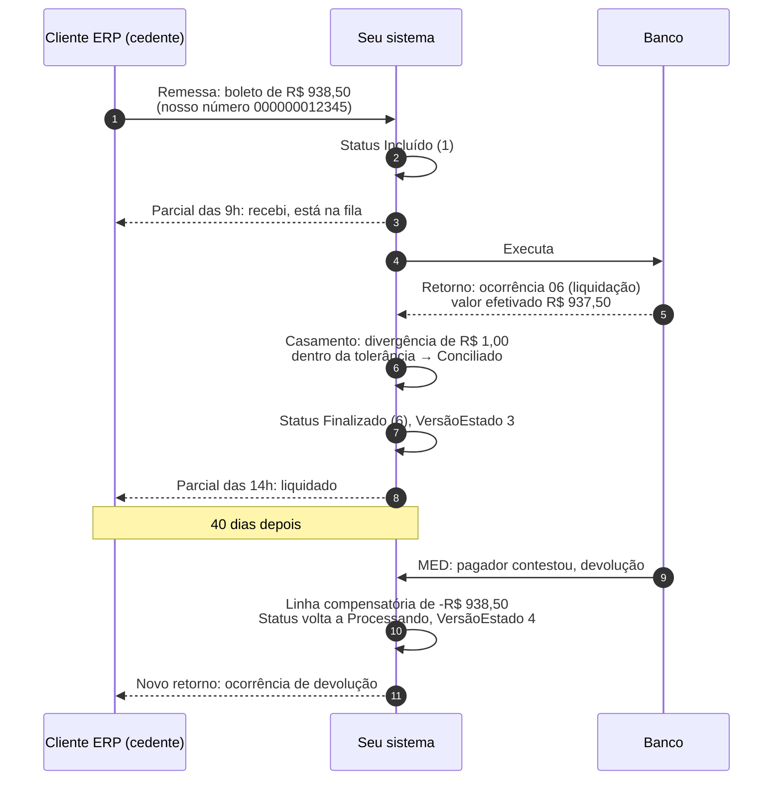

Se você ler só as caixas do fio condutor, do capítulo 5 ao 14, terá a história
completa de um pagamento. Cada capítulo mostra o mesmo item na sua etapa.

---

## 2. O domínio em dez minutos

### 2.1 Os personagens

| Termo | O que é | Analogia |
|---|---|---|
| **Cedente / cliente** | A empresa que usa o banco para pagar ou receber | O usuário do sistema |
| **Banco / instituição** | Quem executa o pagamento | O provedor |
| **ERP** | O sistema de gestão do cedente, que controla contas a pagar e a receber e produz a remessa | O cliente da sua API |
| **Remessa** | Arquivo que o cliente envia com o que quer que seja feito | O `POST` do batch |
| **Retorno** | Arquivo que o banco devolve dizendo o que aconteceu | A resposta assíncrona |
| **Ocorrência** | O código que descreve o desfecho de um item | O status HTTP da linha |
| **Liquidação** | O momento em que o dinheiro efetivamente muda de mãos | O commit no ledger do Bacen |
| **Estorno** | Devolução acordada entre as partes de um valor já liquidado | Um `refund` |

> **Bacen** é o Banco Central do Brasil. Ele opera a infraestrutura em que os
> bancos acertam contas entre si, e é lá que a liquidação de fato acontece.

### 2.2 O que é CNAB

**CNAB** é a sigla de Centro Nacional de Automação Bancária, o comitê da
FEBRABAN que padronizou o formato — e virou o nome do próprio formato. É um
arquivo de texto com **posição fixa**. Não tem
delimitador, não tem JSON, não tem schema declarado: o campo "valor do
pagamento" é simplesmente "as posições 120 a 134 da linha".

No CNAB 240, cada linha tem exatamente 240 caracteres e é de um tipo:

```
Registro 0 — Header de Arquivo      (uma vez, no topo)
  Registro 1 — Header de Lote       (abre um agrupamento)
    Registro 3 — Detalhe            (um pagamento; pode ter segmentos A, B, C...)
    Registro 3 — Detalhe
  Registro 5 — Trailer de Lote      (fecha o lote, com totalizadores)
  Registro 1 — Header de Lote       (outro lote, outro tipo de pagamento)
    ...
  Registro 5 — Trailer de Lote
Registro 9 — Trailer de Arquivo     (uma vez, no fim, com totalizadores gerais)
```

Vocabulário do formato: **header** é a linha de abertura (cabeçalho), **trailer**
é a de fechamento (rodapé), e o trailer carrega os **totalizadores** — quantidade
de registros e somatório de valores daquele bloco, que servem de conferência.
O dígito na coluna 8 de cada linha diz o **tipo de registro**: 0 abre o arquivo,
1 abre um lote, 3 é um pagamento, 5 fecha o lote, 9 fecha o arquivo. Um mesmo
pagamento pode ocupar várias linhas de tipo 3, chamadas **segmentos** (A, B, C),
cada uma com um pedaço diferente dos dados.

Três consequências práticas para quem programa:

- **Valores são inteiros com casas decimais implícitas.** `000000000093850`
  significa R$ 938,50. Não existe ponto nem vírgula.
- **Tudo é preenchido:** número com zeros à esquerda, texto com espaços à
  direita. Um campo "vazio" tem espaços, não é nulo.
- **Os totalizadores do trailer precisam bater** com o que está no arquivo.
  Se você filtrar itens e não recalcular o trailer, o cliente rejeita o arquivo.

### 2.3 As três formas de pagamento

**PIX** é o sistema de transferência instantânea do Bacen: funciona 24 horas por
dia, todos os dias, e carrega um identificador único de ponta a ponta. **TED** é
a transferência entre bancos que só ocorre em dia útil e tem horário de corte —
depois dele, a ordem vai para o dia seguinte. **Boleto** é o documento com código
de barras que o pagador quita em qualquer banco; a liquidação chega ao cedente em
D+0 ou D+1, conforme o convênio.

Elas diferem em prazo, em custo e, o que mais importa aqui, no formato do retorno
que cada uma gera — e é por isso que o arquivo precisa separá-las.

### 2.4 Por que existe "lote"

Dentro de um arquivo CNAB 240, o **lote** agrupa pagamentos pelo **tipo de
serviço e pela forma de lançamento** (por exemplo, "pagamento de fornecedores via
PIX" num lote e "pagamento de tributos" em outro). O cedente não varia dentro do
arquivo: **o arquivo inteiro é de um único cedente**, declarado no header de
arquivo. É por isso que o lote não precisa repetir essa informação.

O lote existe porque o trailer de lote carrega totalizadores que servem de
**checksum** daquele agrupamento — um valor derivado dos dados que permite ao
leitor detectar que algo se perdeu ou foi alterado no caminho.

Para o seu código, o lote importa por um motivo específico: **um pagamento só é
localizável no arquivo original pela dupla `ArquivoID + NumeroLote`**. Sem o
número do lote, você não sabe qual header/trailer de lote acompanha aquele item
no retorno.

### 2.5 NSA: o número sequencial do arquivo

**NSA** quer dizer *número sequencial do arquivo*. Cada arquivo trocado entre um
cliente e o banco carrega esse número, que avança de um em um. Ele serve para o
destinatário detectar arquivo faltando ou repetido: se ele recebeu o 40 e o 42,
sabe que o 41 se perdeu no caminho.

**O escopo da sequência é o par (cliente, direção).** Remessa e retorno têm
sequências independentes: o retorno do cliente `02384871000181` pode estar no NSA
42 enquanto a remessa dele está no 137. Por isso a tabela `SequencialArquivo`
(seção 4.2) é chaveada por `(Documento, Direcao)`, e não só por documento —
detalhe fácil de esquecer e caro de corrigir depois, porque as duas sequências já
terão se misturado.

**Isso é o que torna a geração de arquivo um ponto serial.** Dois processos
gerando retorno para o mesmo cliente ao mesmo tempo produzem NSA duplicado, e o
cliente rejeita. Voltaremos a isso no capítulo 16.

### 2.6 O fluxo completo

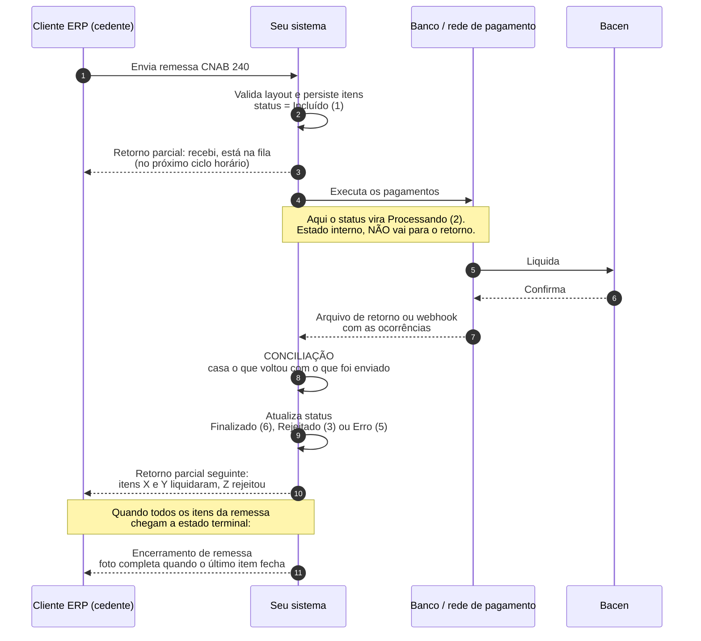

Repare em três coisas:

- Os parciais saem **de hora em hora**, não a cada evento. O "recebi, está na
  fila" chega no primeiro ciclo depois da ingestão da remessa, não no instante
  dela.
- O cliente recebe **vários** retornos parciais e, no fim, um retorno de
  encerramento. Cuidado com a palavra "consolidado" aqui: a seção 9.3 mostra que
  ela costuma significar duas coisas diferentes.
- Existe um estado (`Processando`) que o cliente nunca vê. Isso é deliberado.

### 2.7 Os tipos do domínio

Antes de qualquer regra, os tipos que o resto do guia usa. São poucos e cabem em
uma página; tê-los aqui evita que você tenha que adivinhá-los quando eles
aparecerem no meio de um algoritmo.

**As duas famílias de "status".** O documento lida com dois conceitos numerados
que não têm relação entre si, e confundi-los é a origem de bugs difíceis:

| Conceito | Onde vive | Valores |
|---|---|---|
| **`CodigoStatus` do pagamento** | coluna de `Pagamento.Boleto`; é a máquina de estados da seção 9.1 | 1 Incluído, 2 Processando, 3 Rejeitado, 4 Cancelado, 5 Erro, 6 Finalizado, 7 Pendente Pix URL, 8 Processando Pix URL |
| **`Classificacao` do item conciliado** | coluna de `Conciliacao.ItemConciliado`; é o veredicto do motor de casamento | 1 Conciliado, 2 Divergência de valor, 3 Só interno, 4 Só externo, 5 Duplicado, 6 Revertido |

Para não repetir o erro comum de chamar os dois de `Status`, a coluna e o enum da
segunda família se chamam **`Classificacao`** e **`ClassificacaoConciliacao`** no
guia inteiro.

```csharp
/// Veredicto do motor de casamento. Grava na coluna
/// Conciliacao.ItemConciliado.Classificacao.
public enum ClassificacaoConciliacao : short
{
    Conciliado       = 1,
    DivergenciaValor = 2,
    SoInterno        = 3,
    SoExterno        = 4,
    Duplicado        = 5,
    Revertido        = 6    // linha compensatória; ver capítulo 14
}

/// Qual chave produziu o casamento. Guardar isso é o que responde
/// "casou pela forte ou pela composta?" no dia da divergência.
public enum TipoChave : short
{
    Nenhuma  = 0,
    Forte    = 1,
    Composta = 2
}

/// Resultado da comparação de valores, antes de virar classificação.
public enum VeredictoValor : short
{
    Igual              = 1,
    DentroDaTolerancia = 2,
    Divergente         = 3
}
```

O tipo de dinheiro, usado em todo o pipeline:

```csharp
public readonly record struct Dinheiro(long Centavos) : IComparable<Dinheiro>
{
    private static readonly CultureInfo Br = CultureInfo.GetCultureInfo("pt-BR");

    public static readonly Dinheiro Zero = new(0);
    public decimal EmReais => Centavos / 100m;

    public static Dinheiro DeReais(decimal reais) =>
        new((long)decimal.Round(reais * 100m, 0, MidpointRounding.AwayFromZero));

    /// Campo CNAB: inteiro com 2 casas implícitas. "000000000093850" => R$ 938,50
    public static Dinheiro DeCampoCnab(ReadOnlySpan<char> campo)
    {
        var limpo = campo.Trim();
        if (limpo.IsEmpty) return Zero;

        return long.TryParse(limpo, NumberStyles.None, CultureInfo.InvariantCulture, out var c)
            ? new Dinheiro(c)
            : throw new FormatException($"Campo CNAB numérico inválido: '{campo}'.");
    }

    public string ParaCampoCnab(int tamanho)
        => Centavos.ToString(CultureInfo.InvariantCulture).PadLeft(tamanho, '0');

    public Dinheiro Abs() => new(Math.Abs(Centavos));

    public static Dinheiro operator +(Dinheiro a, Dinheiro b) => new(a.Centavos + b.Centavos);
    public static Dinheiro operator -(Dinheiro a, Dinheiro b) => new(a.Centavos - b.Centavos);

    public int CompareTo(Dinheiro outro) => Centavos.CompareTo(outro.Centavos);

    // Sem este override, um record struct imprime "Dinheiro { Centavos = 93850 }"
    // dentro de toda mensagem de log e de todo Motivo gravado no banco.
    public override string ToString() => EmReais.ToString("C", Br);
}
```

Os três registros que atravessam o motor:

```csharp
/// O que o SEU sistema mandou executar.
public sealed record ItemInterno(
    Guid      PagamentoId,
    string    ClienteDocumento,
    string?   IdentificadorExterno,   // chave forte, quando existe
    string?   NossoNumero,            // parte da chave composta
    DateOnly  DataPrevista,
    Dinheiro  ValorSolicitado,
    short     CodigoStatus);

/// Uma linha de detalhe do arquivo da contraparte.
public sealed record ItemExterno(
    string    ClienteDocumento,
    string?   IdentificadorExterno,
    string?   NossoNumero,
    DateOnly  DataOcorrencia,
    Dinheiro  ValorEfetivado,
    string    CodigoOcorrencia,
    int       NumeroLinha);

/// O veredicto para um par (ou para um lado sem par).
public sealed record ItemConciliado(
    ClassificacaoConciliacao Classificacao,
    TipoChave                ChaveUsada,
    ItemInterno?             Interno,     // nulo em "só externo" e em "duplicado"
    ItemExterno?             Externo,     // nulo em "só interno"
    Dinheiro                 Diferenca,
    string?                  Motivo);

public sealed record ResultadoConciliacao(IReadOnlyList<ItemConciliado> Itens)
{
    public int Total       => Itens.Count;
    public int Conciliados => Itens.Count(i => i.Classificacao == ClassificacaoConciliacao.Conciliado);
    public int Divergentes => Itens.Count(i => i.Classificacao == ClassificacaoConciliacao.DivergenciaValor);

    public decimal TaxaCasamento => Total == 0 ? 0m : (decimal)Conciliados / Total;
}
```

E o contrato de fila, citado várias vezes adiante como a peça que permite trocar
tabela por broker sem mexer no resto:

```csharp
public sealed record MensagemRecebida<T>(long MensagemId, string ChaveParticao, T Corpo, int Tentativas);

public interface IFila<T>
{
    Task PublicarAsync(T corpo, CancellationToken ct);
    Task<IReadOnlyList<MensagemRecebida<T>>> ReceberAsync(int maximo, CancellationToken ct);
    Task ConfirmarAsync(long mensagemId, CancellationToken ct);
    Task FalharAsync(long mensagemId, string erro, CancellationToken ct);
}
```

---

## 3. O que é conciliação e por que ela existe

Conciliação é confrontar duas listas: os seus registros e os da contraparte.

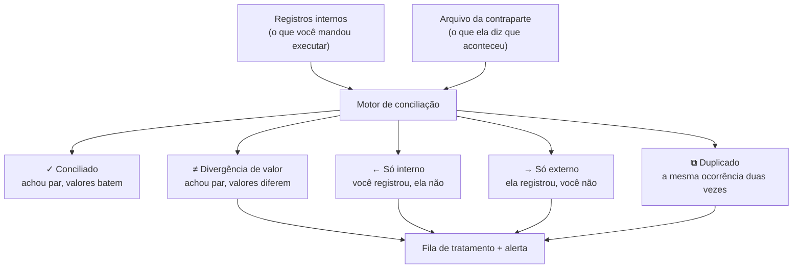

### 3.1 O primeiro salto conceitual

Conciliação **não é um booleano**. Quem modela `bool Conciliado` joga fora
exatamente a informação de que a operação precisa. São cinco saídas, e cada uma
pede uma ação diferente:

| Classificação | Causa típica | Ação |
|---|---|---|
| **Conciliado** | Tudo certo | Baixar o título, reportar ao cliente |
| **Divergência de valor** | Desconto, multa, juros, tarifa | Analisar; muitas vezes é legítimo |
| **Só interno** | Ainda não liquidou, ou se perdeu | Depende do prazo: esperar ou investigar |
| **Só externo** | Evento que você não capturou | Investigar sempre; pode ser dinheiro entrando sem dono |
| **Duplicado** | Contraparte reenviou o arquivo | Ignorar a segunda, alertar |

"Só interno" é ambíguo de propósito: pode ser um pagamento que legitimamente
ainda não liquidou (se a sua janela é D+0 e o prazo é D+1) ou um pagamento
perdido. O motor não tem como saber — quem decide é a **régua de prazo**, que o
capítulo 8 implementa. **O motor classifica; ele não age.**

### 3.2 Dois níveis: item a item e saldo

O que este guia resolve, dos capítulos 5 ao 12, é a conciliação **item a item**:
cada linha do arquivo achando o seu pagamento. Existe um segundo nível, e vale
saber que ele existe antes de descobrir do jeito caro.

| | **Item a item** | **Saldo (agregado)** |
|---|---|---|
| Compara | linha do arquivo × pagamento | extrato do dia × somatório do sistema |
| Pega | ocorrência trocada, valor divergente, item perdido | tarifa não prevista, lançamento fora de arquivo, crédito que chegou por outro canal |
| Frequência | a cada arquivo | uma vez por dia, por conta |
| Fonte | arquivo de retorno | extrato (CNAB 240 tipo 3 segmento E, OFX ou API) |

O nível de saldo pega justamente o que o item a item **não pode** pegar: um
lançamento que nunca esteve em remessa nenhuma não tem par interno para procurar.
Uma implementação mínima é uma consulta diária. `Conciliacao.ExtratoDiario`
seria a tabela que recebe o extrato — uma linha por cliente e dia, com o saldo de
movimento — e é o **único** objeto citado neste guia cujo DDL não está aqui, por
ser a porta de entrada de um fluxo que fica fora do escopo:

```sql
-- Diferença entre o extrato do dia e o que o sistema explica
SELECT e.Data,
       e.SaldoMovimentoCent                                   AS ExtratoCent,
       ISNULL(SUM(ic.ValorEfetivadoCent), 0)                  AS SistemaCent,
       e.SaldoMovimentoCent - ISNULL(SUM(ic.ValorEfetivadoCent), 0) AS NaoExplicadoCent
FROM   Conciliacao.ExtratoDiario e
LEFT   JOIN Conciliacao.ItemConciliado ic
       ON  CAST(ic.DataCriacao AS date) = e.Data
       AND ic.ClienteDocumento          = e.ClienteDocumento
       AND ic.Classificacao IN (1, 2)          -- conciliado ou divergente
WHERE  e.ClienteDocumento = @documento
GROUP BY e.Data, e.SaldoMovimentoCent
HAVING e.SaldoMovimentoCent <> ISNULL(SUM(ic.ValorEfetivadoCent), 0);
```

Se `NaoExplicadoCent` é diferente de zero por vários dias seguidos com o mesmo
valor, é quase sempre tarifa. Se varia, é lançamento que o pipeline não viu.
Este guia não desenvolve o nível de saldo além disso — mas deixar a consulta
rodando num agendador diário custa uma tarde e é a rede de segurança do resto.

### 3.3 Checkpoint

1. Chegou um arquivo com uma ocorrência para um nosso número que não existe na
   sua base. Qual das cinco classificações, e o que o sistema faz?
   *Só externo. Grava a linha, gera alerta e nunca a descarta em silêncio: pode
   ser dinheiro entrando sem dono.*
2. Um boleto de R$ 100,00 liquidou por R$ 102,35 com juros. Divergência?
   *Depende da política de tolerância (seção 6.4). Se a ocorrência estiver na
   lista de valor variável, é Conciliado com diferença registrada — mas a
   diferença é gravada de qualquer jeito.*
3. Por que "só interno" não pode virar alerta imediato?
   *Porque o prazo de liquidação pode não ter vencido. Quem separa atraso de
   limbo legítimo é a régua de prazo do capítulo 8.*
4. O extrato do dia fecha R$ 12,40 acima do que o sistema explica, todo dia.
   *Conciliação de saldo, não de item: quase certamente tarifa. Nenhum arquivo de
   retorno vai apontar isso.*

---

## 4. Panorama da arquitetura

### 4.1 As quatro etapas

Ao longo do texto, **worker** é um processo que roda em segundo plano, sem
interface, consumindo trabalho de uma fila. Em .NET ele é tipicamente um
**`BackgroundService`**: a classe base do host genérico que expõe um único método
`ExecuteAsync(CancellationToken)`, chamado uma vez quando a aplicação sobe e
cancelado quando ela desce — dentro dele você escreve o laço.

Uma etapa é **I/O-bound** quando passa a maior parte do tempo esperando disco,
rede ou banco, e **CPU-bound** quando passa o tempo calculando. A distinção
importa porque cada uma escala de um jeito: I/O aceita muita concorrência, CPU
não passa do número de núcleos.

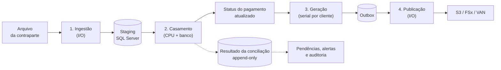

**Leia a seta sólida com atenção:** o que dispara a geração do retorno é a
**mudança de status do pagamento**, não a gravação do resultado da conciliação.
A tabela `ItemConciliado` (linha tracejada) é a trilha de auditoria e a fila de
tratamento humano; a geração nunca a lê. Confundir os dois leva a um desenho em
que o retorno depende de ter havido arquivo da contraparte — e aí o status
`Incluído`, que nasce da remessa e não de conciliação nenhuma, nunca é reportado.

> **Onde os arquivos ficam.** **S3** é o armazenamento de objetos da AWS;
> **FSx** é o serviço de compartilhamento de arquivos em rede da AWS, acessado
> como uma pasta comum; **VAN** (Value Added Network) é a empresa intermediária
> que muitos bancos usam para trocar arquivos com clientes, funcionando como um
> correio: você deposita a remessa e busca o retorno. Para o pipeline, os três
> são apenas origens e destinos de arquivo — o desenho não muda entre eles.
>
> **Outbox**, na caixa antes da publicação, é a tabela onde se grava a *intenção*
> de publicar junto com o dado, para nunca publicar algo que a transação não
> confirmou. O capítulo 12 detalha o padrão.

Por que quatro processos e não um só:

| Etapa | Capítulo | Perfil | Como escala | Exigência de consistência |
|---|---|---|---|---|
| 1. Ingestão | 5 | I/O-bound | Horizontal, livre | Idempotente por hash do conteúdo |
| 2. Casamento | 6 | CPU + banco | Horizontal por arquivo | Transacional por arquivo |
| 3. Geração | 11 | Curta | **Serial por cliente** | Transacional junto com o NSA |
| 4. Publicação | 12 | I/O-bound | Horizontal | At-least-once |

Os capítulos 7 a 10 ficam de fora dessa tabela de propósito: **não são etapas do
pipeline**, são as regras que a etapa 3 consome. O De/Para de ocorrências
(capítulo 7) traduz códigos; a régua de prazo (8) decide o que é atraso; os
estados (9) decidem o que o cliente vê; o controle do reportado (10) impede
repetição. Nenhum deles tem worker próprio.

Dois termos da tabela acima que valem definir antes de seguir:

**Idempotente** quer dizer que executar a operação duas vezes produz o mesmo
resultado que executá-la uma vez. Cobrar duas vezes não é idempotente; marcar um
arquivo como processado é. Num pipeline financeiro isso não é elegância
acadêmica: retry de fila, deploy no meio do lote e operador reprocessando à mão
são eventos rotineiros.

**At-least-once** é a garantia de entrega que quase toda fila oferece: a
mensagem chega **pelo menos** uma vez, e pode chegar duas. Como você não pode
escolher "exatamente uma vez" na prática, a saída é tornar o consumidor
idempotente e deixar a duplicata inofensiva.

**O argumento prático:** com tudo num worker só, um arquivo de 200 mil linhas de
um cliente grande trava o retorno de todos os outros. Com filas entre as etapas,
o cliente grande ocupa a ingestão e os pequenos seguem seu caminho.

**O segundo argumento:** o **staging** — área onde os dados crus do arquivo são
gravados sem nenhuma regra de negócio aplicada — fica persistido, então
reprocessar é rodar a etapa 2
de novo. Você não precisa reler o arquivo, que pode nem existir mais.

### 4.2 O que já existe e o que este guia cria

O pipeline conversa com um sistema de pagamentos que já roda. Esta tabela separa
as duas coisas, para você não procurar um `CREATE TABLE` que nunca vai encontrar:

| Objeto | Origem | Papel |
|---|---|---|
| `Pagamento.Boleto` | **pré-existente** | Um pagamento. O guia adiciona duas colunas: `VersaoEstado` (10.6) e, opcionalmente, `StatusReportadoMask` (10.5) |
| `Pagamento.BoletoInfo` | **pré-existente** | Dados complementares do título: nosso número, identificador externo, vencimento, valor |
| `Pagamento.Arquivo` | **pré-existente** | Um arquivo de remessa recebido do cliente |
| `Pagamento.ArquivoCnabLinha` / `LoteCnabLinha` | **pré-existente**, gravadas na ingestão da remessa (5.1) | Header e trailer originais, devolvidos no retorno |
| `Pagamento.SequencialArquivo` | **este guia** (DDL abaixo) | O NSA por cliente e direção |
| `Pagamento.ControleJanelaRetorno` | **este guia** (DDL abaixo) | A marca d'água por cliente |
| `Pagamento.ControlePagamentoReportado` | **este guia** (10.1) | O que já foi informado ao cliente |
| `Pagamento.RetornoGerado` | **este guia** (9.5) | Metadados de cada arquivo emitido |
| `Conciliacao.ArquivoProcessado` | **este guia** (5.3) | Deduplicação por hash |
| `Conciliacao.StagingRetorno` | **este guia** (5.4) | Linhas cruas do arquivo da contraparte |
| `Conciliacao.ItemConciliado` | **este guia** (6.10) | O resultado do casamento, append-only |
| `Conciliacao.MapaOcorrencia` | **este guia** (capítulo 7) | De/Para de códigos |
| `Conciliacao.Outbox` | **este guia** (12.2) | Intenção de publicar |
| `Calendario.DiaUtil` | **este guia** (capítulo 8) | Feriados e dias úteis |
| `Fila.Mensagem` | **este guia** (4.3) | A fila entre as etapas |
| `Fila.MensagemMorta` | **este guia** (4.4) | A DLQ: mensagens que esgotaram as tentativas |

As duas tabelas de controle que o resto do texto usa sem cerimônia:

```sql
-- Uma linha por cliente e direção. É a fonte do NSA (capítulo 16).
-- Remessa e retorno têm sequências independentes: ver 2.5.
CREATE TABLE Pagamento.SequencialArquivo
(
    Documento       VARCHAR(20)  NOT NULL,
    Direcao         CHAR(1)      NOT NULL,   -- 'R' = remessa, 'T' = reTorno
    SequencialAtual BIGINT       NOT NULL CONSTRAINT DF_SeqArq_Atual DEFAULT 0,
    DataAtualizacao DATETIME2(7) NOT NULL CONSTRAINT DF_SeqArq_Data  DEFAULT SYSUTCDATETIME(),

    CONSTRAINT PK_SequencialArquivo PRIMARY KEY CLUSTERED (Documento, Direcao),
    CONSTRAINT CK_SeqArq_Direcao CHECK (Direcao IN ('R', 'T'))
);

-- Uma linha por cliente. É a marca d'água do parcial (capítulo 9).
CREATE TABLE Pagamento.ControleJanelaRetorno
(
    ClienteDocumento        VARCHAR(20)  NOT NULL,
    UltimoInstanteReportado DATETIME2(7) NULL,     -- nulo = nunca reportado
    DataAtualizacao         DATETIME2(7) NOT NULL CONSTRAINT DF_CJR_Data DEFAULT SYSUTCDATETIME(),

    CONSTRAINT PK_ControleJanelaRetorno PRIMARY KEY CLUSTERED (ClienteDocumento)
);
```

### 4.3 "Fila" sem broker

Um **broker de mensagens** é um serviço dedicado a guardar mensagens até que
alguém as consuma — RabbitMQ, Kafka, Amazon SQS. Ele resolve entrega, retentativa
e ordenação para você, ao custo de mais uma peça para operar e monitorar.

Com apenas SQL Server disponível, a fila pode ser uma tabela. Funciona bem até
uma escala considerável, desde que o consumo use os hints certos:

```sql
CREATE TABLE Fila.Mensagem
(
    MensagemID    BIGINT        IDENTITY(1,1) NOT NULL,   -- IDENTITY: autoincremento do SQL Server
    Tipo          VARCHAR(100)  NOT NULL,
    ChaveParticao VARCHAR(50)   NOT NULL,   -- documento do cliente
    Payload       NVARCHAR(MAX) NOT NULL,
    DataCriacao   DATETIME2(7)  NOT NULL CONSTRAINT DF_Mensagem_Data DEFAULT SYSUTCDATETIME(),
    DataInicio    DATETIME2(7)  NULL,       -- quando um worker pegou
    DataFim       DATETIME2(7)  NULL,
    Tentativas    INT           NOT NULL CONSTRAINT DF_Mensagem_Tentativas DEFAULT 0,
    UltimoErro    VARCHAR(1000) NULL,
    DisponivelEm  DATETIME2(7)  NOT NULL CONSTRAINT DF_Mensagem_Disp DEFAULT SYSUTCDATETIME(),

    -- PK (chave primária): identifica a linha e impede duplicata.
    -- CLUSTERED: a tabela é fisicamente ordenada por esta chave (ver 10.2).
    CONSTRAINT PK_Mensagem PRIMARY KEY CLUSTERED (MensagemID)
);
GO

CREATE INDEX IX_Mensagem_Pendentes
    ON Fila.Mensagem (Tipo, DisponivelEm, MensagemID)
    WHERE DataFim IS NULL;
GO
```

O consumo:

```sql
-- READPAST: pule o que outro worker já travou, em vez de esperar.
-- UPDLOCK:  segure o lock de atualização desde a leitura.
-- Sem os dois, várias réplicas viram uma fila serial com bloqueio.
--
-- OUTPUT inserted.*: devolve, na mesma instrução, os valores que o UPDATE
-- acabou de gravar. "inserted" é a tabela virtual com a versão nova da linha
-- (existe também "deleted", com a antiga). Pegar e marcar viram um comando só,
-- atômico — nada se perde entre a leitura e a escrita.
UPDATE TOP (20) m
SET    m.DataInicio = SYSUTCDATETIME(),
       m.Tentativas = m.Tentativas + 1
OUTPUT inserted.MensagemID, inserted.ChaveParticao, inserted.Payload, inserted.Tentativas
FROM   Fila.Mensagem m WITH (READPAST, UPDLOCK, ROWLOCK)
WHERE  m.DataFim IS NULL
  AND  m.DataInicio IS NULL
  AND  m.DisponivelEm <= SYSUTCDATETIME();
```

| | Tabela de fila | Service Broker | Broker externo (SQS/RabbitMQ) |
|---|---|---|---|
| Infra extra | nenhuma | nenhuma | um serviço a operar |
| Transação junto com o dado | sim, natural | sim | não (daí o outbox) |
| Ordenação por chave | você implementa | por conversation | FIFO + MessageGroupId |
| Retry / DLQ | você implementa (4.4) | parcial | pronto |
| Custo no banco | soma ao mesmo servidor | soma ao mesmo servidor | zero |
| Visibilidade operacional | `SELECT` | baixa | console pronto |

Glossário da tabela: **Service Broker** é o sistema de filas embutido no próprio
SQL Server; **SQS** é a fila gerenciada da AWS; **DLQ** (*dead letter queue*) é a
fila para onde vai a mensagem que falhou muitas vezes, para não travar as demais;
**FIFO** (*first in, first out*) é a disciplina em que a primeira mensagem a
entrar é a primeira a sair. O `MessageGroupId` do SQS é outra coisa: ele define
**dentro de qual grupo** essa ordem vale — no nosso caso, o documento do cliente,
o que permite paralelizar entre clientes sem perder a ordem dentro de cada um.

Com um SQL Server único, a tabela de fila é a escolha pragmática: você já tem
transação, já tem backup, já sabe consultar. Migre para broker externo quando o
banco começar a sofrer com a carga da fila — e nesse momento o contrato
`IFila<T>` (definido em 2.7) faz a troca custar pouco.

### 4.4 Retentativa, DLQ e a mensagem venenosa

As colunas `Tentativas` e `UltimoErro` existem nas duas tabelas de fila deste
guia. Sem código que as consuma, elas são decoração — e a primeira coisa que
quebra em produção é justamente isto: uma mensagem que falha para sempre.

**Por que ela é pior aqui do que em geral.** A seção 16.3 particiona o trabalho
pelo documento do cliente, para preservar a ordem dos NSA. Uma mensagem venenosa
não trava "a fila": trava **aquele cliente inteiro**, e só ele. O resto do sistema
fica verde, os gráficos não acusam nada, e o cliente para de receber retorno até
alguém reparar.

A política, em três decisões:

```csharp
public sealed record PoliticaRetentativa(int MaximoTentativas, TimeSpan Base)
{
    public static readonly PoliticaRetentativa Padrao = new(MaximoTentativas: 5, Base: TimeSpan.FromSeconds(30));

    /// Backoff exponencial com teto e jitter. O jitter (ruído aleatório)
    /// evita que mil mensagens que falharam juntas voltem juntas.
    public TimeSpan Espera(int tentativa)
    {
        var expoente = Math.Min(tentativa, 6);                      // teto: 2^6 = 64x
        var bruto    = Base * Math.Pow(2, expoente);
        var jitter   = Random.Shared.NextDouble() * 0.3 + 0.85;     // ±15%
        return TimeSpan.FromSeconds(Math.Min(bruto.TotalSeconds * jitter, 900));
    }
}
```

```sql
-- A DLQ: mesma forma da fila viva, mais o carimbo de quando desistiu.
CREATE TABLE Fila.MensagemMorta
(
    MensagemMortaID BIGINT        IDENTITY(1,1) NOT NULL,
    MensagemID      BIGINT        NOT NULL,   -- a origem, para rastrear
    Tipo            VARCHAR(100)  NOT NULL,
    ChaveParticao   VARCHAR(50)   NOT NULL,
    Payload         NVARCHAR(MAX) NOT NULL,
    Tentativas      INT           NOT NULL,
    UltimoErro      VARCHAR(1000) NULL,
    DataCriacao     DATETIME2(7)  NOT NULL CONSTRAINT DF_MensagemMorta_Data DEFAULT SYSUTCDATETIME(),

    CONSTRAINT PK_MensagemMorta PRIMARY KEY CLUSTERED (MensagemMortaID)
);
GO

-- Falha: ou reagenda com espera, ou manda para a DLQ.
CREATE OR ALTER PROCEDURE Fila.RegistrarFalha
    @MensagemID       BIGINT,
    @Erro             VARCHAR(1000),
    @EsperaSegundos   INT,
    @MaximoTentativas INT = 5
AS
BEGIN
    SET NOCOUNT ON;

    UPDATE Fila.Mensagem
    SET    UltimoErro   = @Erro,
           DataInicio   = NULL,                                   -- volta a ser elegível
           DisponivelEm = DATEADD(second, @EsperaSegundos, SYSUTCDATETIME())
    WHERE  MensagemID   = @MensagemID
      AND  Tentativas   < @MaximoTentativas;

    IF @@ROWCOUNT = 0
    BEGIN
        -- Esgotou. Sai da fila viva e vai para a DLQ, com o payload inteiro.
        INSERT INTO Fila.MensagemMorta (MensagemID, Tipo, ChaveParticao, Payload, Tentativas, UltimoErro)
        SELECT MensagemID, Tipo, ChaveParticao, Payload, Tentativas, @Erro
        FROM   Fila.Mensagem WHERE MensagemID = @MensagemID;

        UPDATE Fila.Mensagem
        SET    DataFim = SYSUTCDATETIME(), UltimoErro = @Erro
        WHERE  MensagemID = @MensagemID;
    END
END
GO
```

Três decisões que o código acima toma e que valem a pena tornar explícitas:

| Decisão | A favor | Contra |
|---|---|---|
| Reenfileirar com `DisponivelEm` no futuro | A mensagem não volta imediatamente e não vira laço quente | Exige a coluna e o filtro no consumo |
| Backoff exponencial com teto | Absorve indisponibilidade curta da contraparte sem intervenção | Erro permanente demora ~15 min para desistir |
| DLQ como tabela separada | A fila viva fica pequena; a morta é evidência para investigar | Alguém precisa olhar a DLQ — sem alerta, é um cemitério |

**O alerta que faz a DLQ valer alguma coisa:** qualquer linha nova em
`Fila.MensagemMorta` é incidente, não métrica. E, como a ordem por cliente
importa, **não reprocesse uma mensagem morta fora de ordem** sem antes conferir
se as seguintes do mesmo `ChaveParticao` já passaram: reinjetar um retorno antigo
depois de um novo produz NSA fora de sequência no cliente.

---

## 5. Etapa 1 — Ingestão

Objetivo: pegar o arquivo, garantir que ele não foi processado antes, parsear e
gravar as linhas cruas.

### 5.1 O que acontece antes: a ingestão da remessa

Este capítulo trata do arquivo que **chega da contraparte**. Mas o retorno só
existe porque antes houve uma remessa, e três coisas que o resto do guia usa
nascem ali. Em meia página, para você não procurá-las no lugar errado:

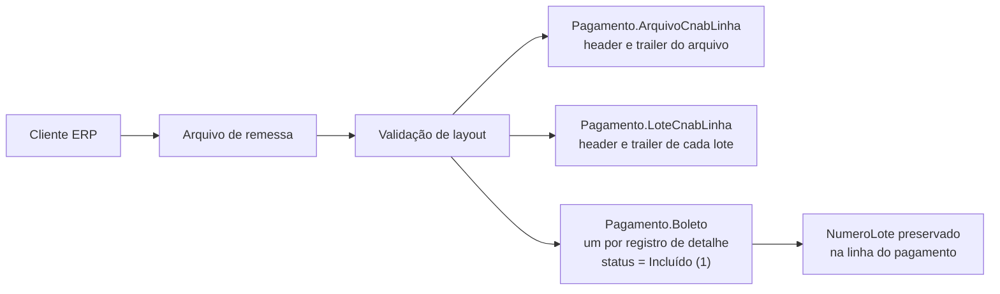

1. **`Pagamento.Arquivo`** ganha uma linha por remessa recebida, com o cliente e
   a data — é ela que o encerramento de remessa (9.3) consulta.
2. **`ArquivoCnabLinha` e `LoteCnabLinha`** guardam os header/trailer originais,
   linha a linha, exatamente como vieram. É o que permite devolver ao cliente o
   cabeçalho dele no retorno (11.3), sem recompor campo a campo.
3. **`Pagamento.Boleto`** ganha uma linha por registro de detalhe, já com
   `ArquivoID`, **`NumeroLote`** e `CodigoStatus = 1`. Preservar o `NumeroLote`
   aqui não é opcional: sem ele, na hora de gerar o retorno o item não encontra o
   header/trailer do lote a que pertence e vira órfão (9.4).

Se no seu sistema a remessa já é ingerida assim, ótimo — é a premissa deste guia.
Se ela hoje descarta o `NumeroLote` ou os header/trailer originais, **corrija isso
antes do capítulo 11**, porque a geração depende dos três.

### 5.2 O fluxo

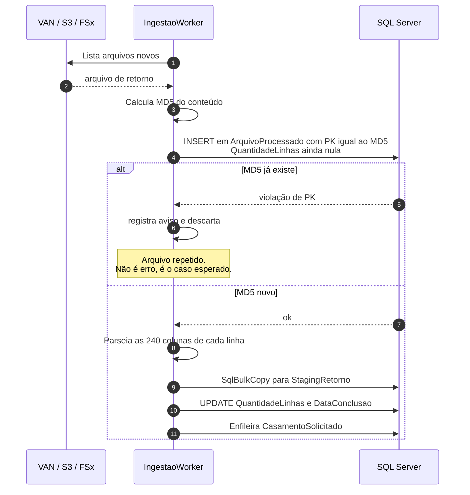

Repare na ordem: o `INSERT` vem **antes** do parse, para que duas instâncias em
corrida colidam no banco antes de qualquer trabalho. Como a contagem de linhas só
se conhece depois, `QuantidadeLinhas` nasce nula e é preenchida no fim — e
`DataConclusao` nula significa "ingestão começou e não terminou", que é
exatamente o que um monitor precisa enxergar.

### 5.3 Idempotência por conteúdo, não por nome

A VAN reenvia o mesmo arquivo com nomes diferentes com uma frequência que
surpreende quem nunca viu. Por isso a chave de deduplicação é o **hash do
conteúdo**, e ele é a **chave primária** da tabela.

Um **hash** é uma assinatura de tamanho fixo calculada a partir do conteúdo
inteiro: dois arquivos idênticos produzem o mesmo **MD5** (32 caracteres
hexadecimais), e qualquer byte diferente produz um MD5 completamente diferente.
É a impressão digital do arquivo.

```sql
CREATE TABLE Conciliacao.ArquivoProcessado
(
    Md5              VARCHAR(32)      NOT NULL,
    ArquivoID        UNIQUEIDENTIFIER NOT NULL,
    NomeOriginal     VARCHAR(250)     NOT NULL,
    ClienteDocumento VARCHAR(20)      NOT NULL,   -- um arquivo, um cliente: ver 5.4
    QuantidadeLinhas INT              NULL,       -- só se conhece depois do parse
    DataCriacao      DATETIME2(7)     NOT NULL CONSTRAINT DF_ArqProc_Data DEFAULT SYSUTCDATETIME(),
    DataConclusao    DATETIME2(7)     NULL,       -- nula = ingestão em andamento ou morta

    CONSTRAINT PK_ArquivoProcessado PRIMARY KEY CLUSTERED (Md5)
);

-- O resto do pipeline procura por ArquivoID, não por hash.
CREATE UNIQUE INDEX UX_ArqProc_ArquivoID
    ON Conciliacao.ArquivoProcessado (ArquivoID)
    INCLUDE (ClienteDocumento);
```

Fazer o hash ser a PK não é detalhe estético: é o que faz duas instâncias em
corrida colidirem no banco em vez de duplicarem lançamento. A segunda recebe
erro 2627 e vira aviso em log.

```csharp
var conteudo = await File.ReadAllBytesAsync(caminho, ct);
var md5 = Convert.ToHexString(MD5.HashData(conteudo)).ToLowerInvariant();

try
{
    await RegistrarArquivoAsync(md5, arquivoId, nome, clienteDocumento, ct);
}
catch (SqlException ex) when (ex.Number is 2627 or 2601)
{
    // Violação de PK/índice único. É o resultado desejado, não uma falha.
    log.LogWarning("Arquivo {Nome} já processado (md5 {Md5}); ignorando.", nome, md5);
    return;
}

var itens = _parser.Parsear(texto, clienteDocumento);
await _staging.CarregarAsync(arquivoId, itens, ct);
await _arquivos.ConcluirAsync(md5, itens.Count, ct);   // QuantidadeLinhas + DataConclusao
await _fila.PublicarAsync(new CasamentoSolicitado(arquivoId, clienteDocumento), ct);
```

> **Por que MD5 e não SHA-256?** Aqui o hash não tem função criptográfica:
> ninguém está tentando forjar colisão. MD5 é mais rápido e 32 caracteres
> ocupam menos índice. Se o requisito virar integridade contra adulteração,
> troque por SHA-256 — o desenho não muda.

### 5.4 Staging: por que persistir o cru

**Um arquivo, um cliente.** Esta é uma decisão de desenho, não uma consequência
do formato: o CNAB 240 já obriga um cedente por arquivo (2.4), e o pipeline leva
isso adiante — `ArquivoProcessado.ClienteDocumento` é único por arquivo, o parser
recebe o documento como parâmetro, e o casamento (6.8) resolve o cliente uma vez
a partir do arquivo, sem `SELECT DISTINCT`. Se algum dia um parceiro mandar um
arquivo com vários cedentes, **quebre-o em N arquivos na ingestão**, com N MD5
derivados; é bem mais barato que espalhar o "e se tiver vários?" pelo pipeline
inteiro, inclusive pelo particionamento por cliente do capítulo 16.

```sql
CREATE TABLE Conciliacao.StagingRetorno
(
    StagingID            BIGINT           IDENTITY(1,1) NOT NULL,
    ArquivoID            UNIQUEIDENTIFIER NOT NULL,
    NumeroLinha          INT              NOT NULL,
    ClienteDocumento     VARCHAR(20)      NOT NULL,
    IdentificadorExterno VARCHAR(50)      NULL,
    NossoNumero          VARCHAR(50)      NULL,
    DataOcorrencia       DATE             NOT NULL,
    ValorEfetivadoCent   BIGINT           NOT NULL,
    CodigoOcorrencia     VARCHAR(10)      NOT NULL,
    LinhaOriginal        CHAR(240)        NOT NULL,

    -- NONCLUSTERED de propósito: a chave física é o arquivo (ver abaixo).
    CONSTRAINT PK_StagingRetorno PRIMARY KEY NONCLUSTERED (StagingID)
);

-- O acesso dominante desta tabela é "todas as linhas de UM arquivo".
-- Clusterizar por (ArquivoID, StagingID) deixa essas linhas fisicamente
-- juntas: o casamento lê um intervalo contíguo, e o expurgo por arquivo
-- também. Sem isso, WHERE ArquivoID = @id é um scan a cada arquivo.
CREATE CLUSTERED INDEX IX_Staging_Arquivo
    ON Conciliacao.StagingRetorno (ArquivoID, StagingID);

CREATE INDEX IX_Staging_ChaveForte
    ON Conciliacao.StagingRetorno (ClienteDocumento, IdentificadorExterno)
    INCLUDE (ValorEfetivadoCent, CodigoOcorrencia);
```

> **Se você não puder trocar a chave clusterizada** (tabela grande já em
> produção, por exemplo), o mínimo aceitável é
> `CREATE INDEX IX_Staging_Arquivo ON Conciliacao.StagingRetorno (ArquivoID)`.
> É pior — cada linha ainda exige um lookup — mas é a diferença entre seek e
> scan numa tabela com 90 dias de retenção.

> **O que faz o `INCLUDE`.** As colunas antes do `INCLUDE` são as que o índice
> ordena e por onde a busca acontece. As colunas dentro do `INCLUDE` viajam junto,
> sem participar da ordenação, só para que a consulta encontre tudo de que precisa
> no índice e não tenha que voltar à tabela para buscar o resto. Essa volta se
> chama *lookup*, e é o que costuma dominar o custo de uma consulta.

Três razões para guardar a linha crua (`LinhaOriginal`):

1. **Reprocessamento** sem depender do arquivo original.
2. **Prova** na discussão com o banco: "a linha 4.271 veio assim".
3. **Correção de parser**: quando você descobre que leu a posição errada, dá
   para reprocessar tudo sem pedir os arquivos de volta.

O staging é efêmero por natureza: defina retenção (30 a 90 dias costuma bastar)
e expurgue em lotes. Ele contém CPF/CNPJ e valores — leia o capítulo 13 antes de
decidir onde ele mora e quem enxerga.

### 5.5 SqlBulkCopy, não INSERT em loop

Um `INSERT` por linha é um *round-trip* por linha — ou seja, uma ida e volta
completa pela rede até o banco, cada uma com seu custo fixo de latência.
Cinquenta mil linhas viram cinquenta mil idas ao banco, e o lote que deveria
levar segundos leva dezenas de minutos. `SqlBulkCopy` é a API do .NET que usa o
protocolo de carga em massa do SQL Server: manda tudo num fluxo só.

```csharp
public async Task CarregarAsync(Guid arquivoId, IReadOnlyList<ItemExterno> linhas, CancellationToken ct)
{
    using var tabela = new DataTable();
    tabela.Columns.Add("ArquivoID", typeof(Guid));
    tabela.Columns.Add("NumeroLinha", typeof(int));
    tabela.Columns.Add("ClienteDocumento", typeof(string));
    tabela.Columns.Add("IdentificadorExterno", typeof(string));
    tabela.Columns.Add("NossoNumero", typeof(string));
    tabela.Columns.Add("DataOcorrencia", typeof(DateTime));
    tabela.Columns.Add("ValorEfetivadoCent", typeof(long));
    tabela.Columns.Add("CodigoOcorrencia", typeof(string));
    tabela.Columns.Add("LinhaOriginal", typeof(string));

    foreach (var l in linhas)
        tabela.Rows.Add(arquivoId, l.NumeroLinha, l.ClienteDocumento,
            (object?)l.IdentificadorExterno ?? DBNull.Value,
            (object?)l.NossoNumero ?? DBNull.Value,
            l.DataOcorrencia.ToDateTime(TimeOnly.MinValue),
            l.ValorEfetivado.Centavos, l.CodigoOcorrencia, l.LinhaOriginal);

    await using var conexao = new SqlConnection(_connectionString);
    await conexao.OpenAsync(ct);

    using var bulk = new SqlBulkCopy(conexao)
    {
        DestinationTableName = "Conciliacao.StagingRetorno",
        BatchSize = 5_000,          // lotes menores = log de transação menor
        BulkCopyTimeout = 300
    };

    foreach (DataColumn c in tabela.Columns)
        bulk.ColumnMappings.Add(c.ColumnName, c.ColumnName);

    await bulk.WriteToServerAsync(tabela, ct);
}
```

**Ordem de grandeza:** 50 mil linhas com `INSERT` em loop levam de 8 a 15
minutos; com `SqlBulkCopy` em lotes de 5 mil, de 2 a 5 segundos. Não é
micro-otimização, é a diferença entre viável e inviável.

### 5.6 Parse de posição fixa sem alocar

`ReadOnlySpan<char>` é uma janela sobre um pedaço de memória que já existe. Ao
contrário de `Substring`, que cria uma string nova a cada campo lido, o `Span`
apenas aponta para o trecho. Num arquivo com 50 mil linhas e 20 campos cada, isso
são um milhão de alocações a menos para o coletor de lixo processar.

```csharp
public IReadOnlyList<ItemExterno> Parsear(ReadOnlySpan<char> conteudo, string clienteDocumento)
{
    var itens = new List<ItemExterno>(capacity: conteudo.Length / 241);
    var numeroLinha = 0;

    // ATENÇÃO À VERSÃO: este Split de ReadOnlySpan<char> que devolve Range
    // existe a partir do .NET 9. Em versões anteriores, use a variante
    // com IndexOf mostrada logo abaixo — o resto do método é idêntico.
    foreach (var linhaRange in conteudo.Split('\n'))
    {
        var linha = conteudo[linhaRange].TrimEnd('\r');
        numeroLinha++;

        if (linha.Length < 240) continue;          // linha em branco no fim do arquivo
        if (linha[7] != '3') continue;             // só registros de detalhe

        itens.Add(new ItemExterno(
            ClienteDocumento:     clienteDocumento,
            IdentificadorExterno: linha.Slice(73, 20).Trim().ToString(),
            NossoNumero:          linha.Slice(37, 20).Trim().ToString(),
            DataOcorrencia:       LerData(linha.Slice(136, 8)),
            ValorEfetivado:       Dinheiro.DeCampoCnab(linha.Slice(152, 15)),
            CodigoOcorrencia:     linha.Slice(213, 2).ToString(),
            NumeroLinha:          numeroLinha));
    }

    return itens;
}
```

A varredura manual, que funciona em qualquer versão e não aloca nada:

```csharp
var resto = conteudo;
while (!resto.IsEmpty)
{
    var quebra = resto.IndexOf('\n');
    var linha  = (quebra < 0 ? resto : resto[..quebra]).TrimEnd('\r');
    resto      = quebra < 0 ? ReadOnlySpan<char>.Empty : resto[(quebra + 1)..];

    numeroLinha++;
    if (linha.Length < 240 || linha[7] != '3') continue;
    // ... mesmos Slice de cima
}
```

> As posições acima são ilustrativas. **Nunca as escreva espalhadas pelo
> código**: elas mudam por banco e por versão de layout. Centralize num perfil de
> layout por banco — uma classe ou uma tabela de configuração que mapeia
> "campo → posição, tamanho, tipo" e é selecionada pelo código do banco e pela
> versão do layout, exatamente como o De/Para do capítulo 7.

### 5.7 Quando o retorno não é arquivo: webhook e API

PIX é notificado por evento, não por lote: o PSP chama uma URL sua a cada
liquidação, ou você consulta uma API periodicamente. Isso não é um segundo
pipeline — é uma **segunda ingestão** para o mesmo motor.

```csharp
// O webhook grava no MESMO staging e enfileira o MESMO casamento.
[HttpPost("/webhooks/pix")]
public async Task<IActionResult> Receber([FromBody] NotificacaoPix n, CancellationToken ct)
{
    // 1. Autentique (assinatura/mTLS) ANTES de qualquer coisa.
    // 2. Idempotência: o EndToEndId faz o papel do MD5 do arquivo.
    var arquivoId = DeterministicoPor(n.EndToEndId);

    // 3. Uma notificação vira um "arquivo" de uma linha só.
    var item = new ItemExterno(
        ClienteDocumento:     n.Recebedor.Documento,
        IdentificadorExterno: n.EndToEndId,
        NossoNumero:          n.TxId,
        DataOcorrencia:       DateOnly.FromDateTime(n.Horario),
        ValorEfetivado:       Dinheiro.DeReais(n.Valor),
        CodigoOcorrencia:     "PIX-LIQ",
        NumeroLinha:          1);

    await _ingestao.RegistrarEventoAsync(arquivoId, item, ct);
    return Accepted();   // responda rápido; processe no worker
}
```

Três diferenças que importam:

| | Arquivo em lote | Webhook / API |
|---|---|---|
| Idempotência | MD5 do conteúdo | `EndToEndId` da notificação |
| Volume por evento | milhares de linhas | uma |
| Ordem | a do arquivo | nenhuma; podem chegar fora de ordem e repetidos |
| Latência até o cliente | próximo ciclo horário | idem — o retorno continua sendo em lote |

O ponto que costuma surpreender: **o motor de casamento não muda**. Ele recebe
`IReadOnlyCollection<ItemExterno>` e não sabe de onde veio — é exatamente por
isso que ele foi escrito como função pura em 6.5. O retorno ao cliente continua
sendo arquivo CNAB no ciclo horário; o que mudou foi só a porta de entrada.

### 5.8 Prós e contras das decisões desta etapa

| Decisão | A favor | Contra |
|---|---|---|
| Hash como PK | Corrida resolvida pelo banco | Reprocessar de propósito exige apagar a linha |
| `INSERT` antes do parse | Corrida barrada antes do trabalho | `QuantidadeLinhas` precisa aceitar nulo |
| Staging persistido | Reprocessa sem o arquivo | Tabela grande; precisa de retenção e de cuidado com dado sensível |
| Cluster por `ArquivoID` | Leitura do casamento é sequencial | `StagingID` vira índice não clusterizado |
| `SqlBulkCopy` | Ordens de magnitude mais rápido | Não dispara trigger nem valida FK (chave estrangeira) por padrão |
| Parse com `Span` | Sem alocação por campo | Código mais verboso; a variante com `Range` exige .NET 9 |

> **O fio condutor.** O arquivo do banco chega com 412 linhas. Uma delas, a de
> número 87, traz nosso número `000000012345`, ocorrência `06` e valor
> `000000000093750` — R$ 937,50. O parser a transforma num `ItemExterno` e o
> `SqlBulkCopy` a grava no staging. Ninguém ainda sabe que ela é o nosso boleto
> de R$ 938,50: isso é trabalho do capítulo 6.

### 5.9 Checkpoint

1. O mesmo arquivo chega duas vezes com nomes diferentes. O que acontece?
   *O segundo `INSERT` viola a PK do MD5, vira `LogWarning` e nada mais é feito.
   É o caminho esperado, não um erro.*
2. O worker morre entre o `INSERT` e o `SqlBulkCopy`. Como você descobre?
   *`DataConclusao` fica nula. Uma consulta por arquivos com `DataConclusao IS
   NULL` há mais de X minutos é o alerta — e o reprocesso exige apagar a linha.*
3. Por que não gravar direto na tabela final e pular o staging?
   *Porque você perde a linha crua: reprocessar exigiria o arquivo original, e
   corrigir um erro de parser viraria um pedido de reenvio ao banco.*
4. Chegou uma notificação PIX repetida do mesmo `EndToEndId`. O que impede a
   duplicata?
   *A idempotência derivada do `EndToEndId`, que faz o papel do MD5. Sem ela, o
   motor classificaria a segunda como `Duplicado` — o que é correto, mas custa
   uma linha de pendência à toa.*

---

## 6. Etapa 2 — Casamento

Objetivo: para cada linha do arquivo, achar o pagamento correspondente e
classificar o par.

### 6.1 O fluxo

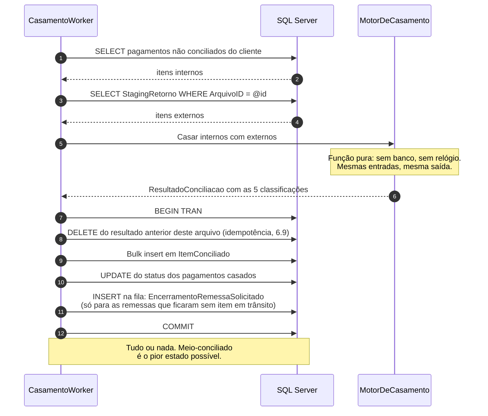

O casamento **não** enfileira o retorno parcial: parciais são disparados pelo
agendador de hora em hora (9.3). O que ele enfileira é o **encerramento de
remessa**, e só quando a atualização de status acabou de deixar uma remessa sem
nenhum item em trânsito — reagir ao evento é mais barato do que varrer todas as
remessas abertas a cada ciclo.

### 6.2 Dinheiro é `long` de centavos

Antes de qualquer regra, o tipo — definido por inteiro em 2.7. Nunca use `double`
ou `float` para dinheiro: em ponto flutuante binário `0.1 + 0.2 != 0.3`, e num
motor de conciliação isso vira divergência falsa em produção.

`decimal` também seria correto matematicamente, mas `long` deixa o formato CNAB
natural (o arquivo já é inteiro em centavos), ocupa 8 bytes em vez de 16 e não
tem armadilha de escala em `SUM`.

> **Isto vale para o banco também.** As colunas de valor deste guia terminam em
> `Cent` e são `BIGINT`. A coluna pré-existente `Pagamento.BoletoInfo.ValorPagamento`
> é assumida como **`decimal(18,2)`**, e é por isso que a conversão
> `CAST(ROUND(ValorPagamento * 100, 0) AS bigint)` em 6.8 é segura. **Se na sua
> base ela for `float` ou `real`, resolva isso antes de qualquer outra coisa deste
> capítulo**: multiplicar um binário de ponto flutuante por 100 dentro do banco é
> exatamente a aritmética que esta seção proíbe, só que mais difícil de enxergar.

### 6.3 A chave de casamento

Casar por valor é o erro do iniciante: dois pagamentos de R$ 100,00 no mesmo dia
casam trocados e ninguém percebe. O que se usa:

**Chave forte** — um identificador que as duas partes acordaram carregar
(`IdentificadorExterno`, `EndToEndId` do PIX, `TxID`). O **EndToEndId** é o
identificador único que acompanha uma transação PIX do início ao fim, gerado na
origem e devolvido em toda notificação. O **TxID** é o identificador da
**cobrança PIX**: quem cria a cobrança o define (até 35 caracteres), e ele volta
em toda notificação de pagamento daquela cobrança — é o campo em que se costuma
carimbar o número do título do próprio ERP. Quando existe uma chave assim, ela é
confiável e o casamento é 1:1.

**Chave composta** — quando a contraparte não devolve o seu identificador, você
compõe a partir do que o layout carrega: `cliente + nosso número`, desempatando
por proximidade de data. **Nosso número** é o identificador que o banco atribui
a um título de cobrança — o nome é do ponto de vista do banco, e ele aparece no
boleto e em todos os arquivos relacionados àquele título.

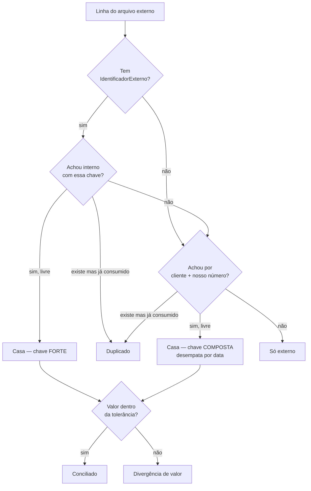

**O fluxograma tem quatro saídas, e as classificações são cinco.** A quinta,
**"só interno"**, não é decidida aqui: ela só existe **depois do laço**, quando
se varre o conjunto de internos e se separam os que nenhuma linha externa
consumiu. Não há como um desenho por linha externa produzi-la — e é justamente
por isso que o motor da seção 6.5 termina com um segundo `foreach`.

Guarde **qual chave casou**. No dia em que uma divergência aparecer, a primeira
pergunta será "casou pela forte ou pela composta?".

### 6.4 Tolerância de valor

Valor solicitado e valor efetivado divergem **legitimamente**: desconto, multa,
juros e tarifa são calculados pelo banco na data do pagamento. Comparar com `==`
faz todo boleto pago com juros virar divergência, e a operação para de olhar o
relatório porque ele "sempre tem mil linhas".

```csharp
public sealed record PoliticaTolerancia(
    long ToleranciaAbsolutaCentavos,
    decimal ToleranciaPercentual,
    IReadOnlySet<string> OcorrenciasComValorVariavel)
{
    /// Um centavo de folga para arredondamento, nada mais.
    /// É o ponto de partida recomendado e o que os testes usam.
    public static readonly PoliticaTolerancia Estrita = new(
        ToleranciaAbsolutaCentavos: 1,
        ToleranciaPercentual: 0m,
        OcorrenciasComValorVariavel: new HashSet<string>(StringComparer.Ordinal));

    public VeredictoValor Avaliar(Dinheiro solicitado, Dinheiro efetivado, string codigoOcorrencia)
    {
        var diferenca = (efetivado - solicitado).Abs();

        if (diferenca == Dinheiro.Zero)                          return VeredictoValor.Igual;
        if (OcorrenciasComValorVariavel.Contains(codigoOcorrencia)) return VeredictoValor.DentroDaTolerancia;
        if (diferenca.Centavos <= ToleranciaAbsolutaCentavos)    return VeredictoValor.DentroDaTolerancia;

        if (ToleranciaPercentual > 0m && solicitado.Centavos > 0)
        {
            var limite = solicitado.Centavos * ToleranciaPercentual / 100m;
            if (diferenca.Centavos <= limite) return VeredictoValor.DentroDaTolerancia;
        }

        return VeredictoValor.Divergente;
    }
}
```

Ela vive em configuração (muda por banco) e é injetável (para ser testada
isoladamente). O conjunto `OcorrenciasComValorVariavel` não é digitado à mão: ele
vem da coluna `ValorVariavel` do De/Para do capítulo 7, que é onde as ocorrências
de cada banco estão descritas.

**Guarde a diferença mesmo quando aceitar**: `SUM(DiferencaCent)` por período é um
número que a contabilidade vai pedir.

### 6.5 O motor

```csharp
public sealed class MotorDeCasamento(PoliticaTolerancia politica)
{
    public ResultadoConciliacao Casar(
        IReadOnlyCollection<ItemInterno> internos,
        IReadOnlyCollection<ItemExterno> externos)
    {
        var itens = new List<ItemConciliado>(internos.Count + externos.Count);

        // Índices em vez de busca linear. Ver 6.6 e 6.7.
        var porChaveForte    = Indexar(internos, ChaveForte);
        var porChaveComposta = Indexar(internos, ChaveComposta);
        var consumidos       = new HashSet<Guid>();

        foreach (var externo in externos)
        {
            var (interno, chave, chaveExistia) =
                Localizar(externo, porChaveForte, porChaveComposta, consumidos);

            if (interno is null)
            {
                itens.Add(chaveExistia
                    ? new ItemConciliado(ClassificacaoConciliacao.Duplicado, chave, null, externo,
                        Dinheiro.Zero, "Ocorrência repetida para um item já casado")
                    : new ItemConciliado(ClassificacaoConciliacao.SoExterno, TipoChave.Nenhuma, null, externo,
                        Dinheiro.Zero, "Sem correspondente na base interna"));
                continue;
            }

            // Um interno casa UMA vez. Sem isso, duas ocorrências repetidas
            // casam com o mesmo pagamento e o total conciliado fica maior
            // que o total pago — erro que só aparece na auditoria.
            consumidos.Add(interno.PagamentoId);

            var diferenca = externo.ValorEfetivado - interno.ValorSolicitado;

            itens.Add(politica.Avaliar(interno.ValorSolicitado, externo.ValorEfetivado, externo.CodigoOcorrencia) switch
            {
                VeredictoValor.Igual =>
                    new ItemConciliado(ClassificacaoConciliacao.Conciliado, chave, interno, externo, Dinheiro.Zero, null),
                VeredictoValor.DentroDaTolerancia =>
                    new ItemConciliado(ClassificacaoConciliacao.Conciliado, chave, interno, externo, diferenca,
                        $"Diferença de {diferenca.Abs()} aceita pela política"),
                _ =>
                    new ItemConciliado(ClassificacaoConciliacao.DivergenciaValor, chave, interno, externo, diferenca,
                        $"Solicitado {interno.ValorSolicitado}, efetivado {externo.ValorEfetivado}")
            });
        }

        // A quinta classificação, que só existe depois do laço (ver 6.3).
        foreach (var interno in internos.Where(i => !consumidos.Contains(i.PagamentoId)))
            itens.Add(new ItemConciliado(ClassificacaoConciliacao.SoInterno, TipoChave.Nenhuma, interno, null,
                Dinheiro.Zero, "Sem ocorrência correspondente no arquivo"));

        return new ResultadoConciliacao(itens);
    }
}
```

Três propriedades importantes desse desenho:

- **Função pura.** Uma função é *pura* quando o resultado depende só dos
  argumentos e ela não altera nada fora de si: sem banco, sem relógio, sem I/O,
  sem estado estático. A consequência prática é que testá-la são três linhas —
  monte as listas, chame, compare — e que o resultado não muda entre a máquina do
  desenvolvedor e produção.
- **Determinística.** Mesmas entradas, mesma saída, sempre. Isso permite
  reprocessar com confiança.
- **Reutilizável.** O mesmo motor serve para o fluxo em lote e para o fluxo por
  evento de 5.7, sem duplicar a regra.

### 6.6 `Indexar` e `Localizar`: o núcleo do motor

As duas funções que o motor chama são onde a maioria trava, por um motivo
específico: **a chave do lado interno não é única**. Dois títulos com o mesmo
nosso número acontecem — reemissão, carga duplicada antiga, erro do ERP do
cliente. Um `ToDictionary` ingênuo lança `ArgumentException` no primeiro arquivo
real de produção.

A estrutura certa é `ILookup<string, T>`, que é um dicionário de chave para
**lista** de itens e nunca reclama de chave repetida:

```csharp
// A chave carrega o cliente junto: mesmo com "um arquivo, um cliente" (5.4),
// isso impede que uma futura mudança de escopo case itens entre clientes.
private static string? ChaveForte(ItemInterno i) =>
    string.IsNullOrWhiteSpace(i.IdentificadorExterno)
        ? null
        : $"{i.ClienteDocumento}|{i.IdentificadorExterno}";

private static string? ChaveComposta(ItemInterno i) =>
    string.IsNullOrWhiteSpace(i.NossoNumero)
        ? null
        : $"{i.ClienteDocumento}|{i.NossoNumero}";

private static ILookup<string, ItemInterno> Indexar(
    IEnumerable<ItemInterno> internos,
    Func<ItemInterno, string?> chave)
    => internos
        .Select(i => (Chave: chave(i), Item: i))
        .Where(p => p.Chave is not null)
        .ToLookup(p => p.Chave!, p => p.Item, StringComparer.Ordinal);
```

`Localizar` tenta a chave forte, depois a composta, e devolve três coisas: o
interno escolhido (ou `null`), qual chave casou, e — o detalhe que faz a
classificação `Duplicado` existir — **se a chave existia mas todos os candidatos
já haviam sido consumidos**:

```csharp
private static (ItemInterno? Interno, TipoChave Chave, bool ChaveExistia) Localizar(
    ItemExterno externo,
    ILookup<string, ItemInterno> porForte,
    ILookup<string, ItemInterno> porComposta,
    HashSet<Guid> consumidos)
{
    var chaveExistia   = false;
    var chaveEncontrada = TipoChave.Nenhuma;

    if (!string.IsNullOrWhiteSpace(externo.IdentificadorExterno))
    {
        var candidatos = porForte[$"{externo.ClienteDocumento}|{externo.IdentificadorExterno}"];
        if (candidatos.Any())
        {
            chaveExistia    = true;
            chaveEncontrada = TipoChave.Forte;

            var escolhido = Desempatar(candidatos, externo, consumidos);
            if (escolhido is not null) return (escolhido, TipoChave.Forte, true);
        }
    }

    if (!string.IsNullOrWhiteSpace(externo.NossoNumero))
    {
        var candidatos = porComposta[$"{externo.ClienteDocumento}|{externo.NossoNumero}"];
        if (candidatos.Any())
        {
            chaveExistia    = true;
            if (chaveEncontrada == TipoChave.Nenhuma) chaveEncontrada = TipoChave.Composta;

            var escolhido = Desempatar(candidatos, externo, consumidos);
            if (escolhido is not null) return (escolhido, TipoChave.Composta, true);
        }
    }

    return (null, chaveEncontrada, chaveExistia);
}

/// A regra de desempate que o fluxograma de 6.3 promete: entre os candidatos
/// ainda livres, o de data prevista mais próxima da data da ocorrência.
/// O segundo critério (PagamentoId) não tem significado de negócio — está aí
/// para a escolha ser ESTÁVEL: sem ele, duas execuções sobre a mesma massa
/// poderiam escolher internos diferentes, e o motor deixaria de ser determinístico.
private static ItemInterno? Desempatar(
    IEnumerable<ItemInterno> candidatos,
    ItemExterno externo,
    HashSet<Guid> consumidos)
    => candidatos
        .Where(c => !consumidos.Contains(c.PagamentoId))
        .OrderBy(c => Math.Abs(c.DataPrevista.DayNumber - externo.DataOcorrencia.DayNumber))
        .ThenBy(c => c.PagamentoId)
        .FirstOrDefault();
```

Repare que `ChaveExistia` continua `true` mesmo quando `Desempatar` devolve
`null`: é essa distinção que separa **"a chave não existe na base"** (só externo)
de **"a chave existe, mas o item já foi consumido por outra linha"** (duplicado).
Sem ela, um arquivo reenviado inteiro seria classificado como um arquivo de
pagamentos desconhecidos, e a operação investigaria centenas de linhas por nada.

### 6.7 Por que índice e não `FirstOrDefault` no loop

```csharp
// ERRADO: O(n × m)
foreach (var externo in externos)
    var interno = internos.FirstOrDefault(i => i.NossoNumero == externo.NossoNumero);
```

Para 50 mil de cada lado: 2,5 bilhões de comparações. Com dicionário: 100 mil
operações. Na prática, a diferença entre 40 minutos e 200 milissegundos.

### 6.8 A alternativa set-based

Quando o volume por arquivo passa de algumas centenas de milhares de linhas,
vale fazer o casamento no banco: os dados não trafegam pela rede.

Dois recursos do **T-SQL** (Transact-SQL, o dialeto de SQL do SQL Server, com
variáveis, controle de fluxo e procedimentos) aparecem no código abaixo. **CTE**
(*common table expression*, o bloco `WITH ... AS`) é uma consulta nomeada que
existe só durante aquele comando, útil para dar nome a uma etapa intermediária
sem criar tabela. **`ROW_NUMBER() OVER (PARTITION BY x ORDER BY y)`** numera as
linhas dentro de cada grupo `x`, seguindo a ordem `y` — é assim que se escolhe "o
primeiro de cada" sem `GROUP BY`.

E duas diretivas que abrem todo procedimento sério neste guia: **`SET NOCOUNT
ON`** suprime a mensagem "(N linhas afetadas)" que o servidor devolve a cada
comando, reduzindo tráfego e evitando que bibliotecas cliente confundam essa
contagem com um resultado; **`SET XACT_ABORT ON`** faz qualquer erro de execução
abortar a transação inteira, em vez de deixá-la aberta pela metade segurando
locks — sem ele, um erro no meio do procedimento pode devolver o controle ao
.NET com uma transação viva e ninguém para fechá-la.

```sql
CREATE OR ALTER PROCEDURE Conciliacao.ExecutarCasamento
    @ArquivoID                  UNIQUEIDENTIFIER,
    @ToleranciaAbsolutaCentavos BIGINT = 1
AS
BEGIN
    SET NOCOUNT ON;
    SET XACT_ABORT ON;

    -- Um arquivo, um cliente (5.4): resolve-se uma vez, sem DISTINCT.
    DECLARE @ClienteDocumento VARCHAR(20) =
        (SELECT ClienteDocumento FROM Conciliacao.ArquivoProcessado WHERE ArquivoID = @ArquivoID);

    IF @ClienteDocumento IS NULL
        THROW 50001, 'Arquivo não registrado em ArquivoProcessado.', 1;

    BEGIN TRANSACTION;

    -- 0) Idempotência (ver 6.9): reprocessar apaga o resultado anterior
    --    DESTE arquivo. Linhas compensatórias (capítulo 14) são preservadas.
    DELETE FROM Conciliacao.ItemConciliado
    WHERE  ArquivoID = @ArquivoID AND CompensaItemID IS NULL;

    -- 1) Candidatos internos do cliente deste arquivo
    CREATE TABLE #Internos
    (
        PagamentoID          UNIQUEIDENTIFIER NOT NULL PRIMARY KEY,
        ClienteDocumento     VARCHAR(20)      NOT NULL,
        IdentificadorExterno VARCHAR(50)      NULL,
        NossoNumero          VARCHAR(50)      NULL,
        DataPrevista         DATE             NOT NULL,
        ValorSolicitadoCent  BIGINT           NOT NULL
    );

    INSERT INTO #Internos
    SELECT p.BoletoID, p.ClienteDocumento, i.IdentificadorExterno, i.NossoNumero,
           CAST(i.DataVencimento AS date),
           -- Seguro porque ValorPagamento é decimal(18,2). Ver o aviso em 6.2.
           CAST(ROUND(i.ValorPagamento * 100, 0) AS bigint)
    FROM   Pagamento.Boleto p
    JOIN   Pagamento.BoletoInfo i ON i.BoletoID = p.BoletoID
    WHERE  p.ClienteDocumento = @ClienteDocumento
      AND  NOT EXISTS (SELECT 1 FROM Conciliacao.ItemConciliado c
                       WHERE c.PagamentoID = p.BoletoID AND c.Classificacao = 1);

    CREATE INDEX IX_I_Forte    ON #Internos (IdentificadorExterno);
    CREATE INDEX IX_I_Composta ON #Internos (NossoNumero);

    -- 2) Candidatos: um JOIN por chave, unidos por UNION ALL.
    --
    --    Por que NÃO um join só com OR: um predicado de junção com OR
    --    ("bate pela forte OU pela composta") faz o otimizador desistir do
    --    seek e cair em hash/loop com scan, e os dois índices acima ficariam
    --    sem uso. Justamente no cenário em que este procedimento é vendido
    --    — milhões de linhas — o OR entrega o oposto do que promete.
    --    Dois joins simples usam um índice cada e custam duas leituras rasas.
    WITH Candidatos AS (
        SELECT s.StagingID, s.ValorEfetivadoCent, s.CodigoOcorrencia, s.DataOcorrencia,
               n.PagamentoID, n.ValorSolicitadoCent, n.DataPrevista,
               1 AS ChaveUsada                       -- forte
        FROM   Conciliacao.StagingRetorno s
        JOIN   #Internos n ON n.IdentificadorExterno = s.IdentificadorExterno
        WHERE  s.ArquivoID = @ArquivoID
          AND  s.IdentificadorExterno IS NOT NULL

        UNION ALL

        SELECT s.StagingID, s.ValorEfetivadoCent, s.CodigoOcorrencia, s.DataOcorrencia,
               n.PagamentoID, n.ValorSolicitadoCent, n.DataPrevista,
               2 AS ChaveUsada                       -- composta
        FROM   Conciliacao.StagingRetorno s
        JOIN   #Internos n ON n.NossoNumero = s.NossoNumero
        WHERE  s.ArquivoID = @ArquivoID
          AND  s.NossoNumero IS NOT NULL
    ),
    -- Para cada linha externa, o melhor interno: chave forte na frente,
    -- depois proximidade de data. Espelha o Desempatar de 6.6.
    MelhorPorExterno AS (
        SELECT *,
               ROW_NUMBER() OVER (PARTITION BY StagingID
                                  ORDER BY ChaveUsada,
                                           ABS(DATEDIFF(day, DataPrevista, DataOcorrencia)),
                                           PagamentoID) AS OrdemExterno
        FROM   Candidatos
    )
    -- Para cada interno, qual linha externa fica com ele: as demais são duplicatas.
    SELECT *,
           ROW_NUMBER() OVER (PARTITION BY PagamentoID
                              ORDER BY ChaveUsada, StagingID) AS OrdemInterno
    INTO   #Pares
    FROM   MelhorPorExterno
    WHERE  OrdemExterno = 1;

    CREATE INDEX IX_P_Staging ON #Pares (StagingID);

    -- 3) A política de tolerância, na MESMA ordem de PoliticaTolerancia.Avaliar
    --    (6.4): igual, depois ocorrência de valor variável, depois tolerância
    --    absoluta. A lista de ocorrências de valor variável vem do De/Para
    --    (7.2), não de uma constante — é o que mantém as duas implementações
    --    comparáveis pelo teste do capítulo 18.
    ALTER TABLE #Pares ADD Aceito BIT NULL;

    UPDATE p
    SET    Aceito = CASE
               WHEN p.ValorEfetivadoCent = p.ValorSolicitadoCent THEN 1
               WHEN m.MapaOcorrenciaID IS NOT NULL                THEN 1
               WHEN ABS(p.ValorEfetivadoCent - p.ValorSolicitadoCent)
                        <= @ToleranciaAbsolutaCentavos            THEN 1
               ELSE 0 END
    FROM   #Pares p
    LEFT   JOIN Conciliacao.MapaOcorrencia m
           ON  m.Direcao          = 'E'
           AND m.CodigoOcorrencia = p.CodigoOcorrencia
           AND m.ValorVariavel    = 1
           AND m.VigenciaFim IS NULL;

    -- 4) Pares vencedores: conciliado ou divergência de valor
    INSERT INTO Conciliacao.ItemConciliado
        (ArquivoID, ClienteDocumento, PagamentoID, StagingID, Classificacao, ChaveUsada,
         ValorSolicitadoCent, ValorEfetivadoCent, DiferencaCent, Motivo)
    SELECT @ArquivoID, @ClienteDocumento, p.PagamentoID, p.StagingID,
           CASE WHEN p.Aceito = 1 THEN 1 ELSE 2 END,
           p.ChaveUsada,
           p.ValorSolicitadoCent, p.ValorEfetivadoCent,
           p.ValorEfetivadoCent - p.ValorSolicitadoCent,
           CASE WHEN p.Aceito = 0 THEN 'Divergência de valor além da tolerância' END
    FROM   #Pares p
    WHERE  p.OrdemInterno = 1;

    -- 5) DUPLICADO: a chave existia, mas outra linha já levou o interno.
    --    PagamentoID fica NULL, exatamente como no motor em C#: assim o
    --    índice único UX_IC_Pagamento_Arquivo continua valendo e as duas
    --    implementações produzem o mesmo resultado (teste de 18).
    INSERT INTO Conciliacao.ItemConciliado
        (ArquivoID, ClienteDocumento, PagamentoID, StagingID, Classificacao, ChaveUsada,
         ValorSolicitadoCent, ValorEfetivadoCent, DiferencaCent, Motivo)
    SELECT @ArquivoID, @ClienteDocumento, NULL, p.StagingID, 5, p.ChaveUsada,
           NULL, p.ValorEfetivadoCent, 0, 'Ocorrência repetida para um item já casado'
    FROM   #Pares p
    WHERE  p.OrdemInterno > 1;

    -- 6) SÓ EXTERNO: nenhuma chave bateu
    INSERT INTO Conciliacao.ItemConciliado
        (ArquivoID, ClienteDocumento, PagamentoID, StagingID, Classificacao, ChaveUsada,
         ValorSolicitadoCent, ValorEfetivadoCent, DiferencaCent, Motivo)
    SELECT @ArquivoID, @ClienteDocumento, NULL, s.StagingID, 4, 0,
           NULL, s.ValorEfetivadoCent, 0, 'Sem correspondente na base interna'
    FROM   Conciliacao.StagingRetorno s
    WHERE  s.ArquivoID = @ArquivoID
      AND  NOT EXISTS (SELECT 1 FROM #Pares p WHERE p.StagingID = s.StagingID);

    -- 7) SÓ INTERNO: internos que ninguém reclamou
    INSERT INTO Conciliacao.ItemConciliado
        (ArquivoID, ClienteDocumento, PagamentoID, StagingID, Classificacao, ChaveUsada,
         ValorSolicitadoCent, ValorEfetivadoCent, DiferencaCent, Motivo)
    SELECT @ArquivoID, @ClienteDocumento, n.PagamentoID, NULL, 3, 0,
           n.ValorSolicitadoCent, NULL, 0, 'Sem ocorrência correspondente no arquivo'
    FROM   #Internos n
    WHERE  NOT EXISTS (SELECT 1 FROM #Pares p
                       WHERE p.PagamentoID = n.PagamentoID AND p.OrdemInterno = 1);

    COMMIT TRANSACTION;
END
GO
```

**As cinco classificações saem daqui**, iguais às do motor em C#. Isso não é
capricho de simetria: é o que torna possível o teste de comparação entre
implementações recomendado no capítulo 18. A única regra da política que este
procedimento **não** reproduz é a tolerância percentual: se você a usar, passe-a
como parâmetro e some o ramo correspondente ao `CASE` do passo 3 — ou o teste de
comparação vai acusar, que é exatamente o trabalho dele. Se o procedimento produzisse quatro
classificações e o motor cinco, esse teste falharia sempre, e a recomendação se
contradiria.

| | Motor em C# | Set-based em T-SQL |
|---|---|---|
| Volume confortável | até ~500 mil linhas/lado | milhões |
| Testabilidade | trivial (função pura) | precisa de banco |
| Legibilidade da regra | alta | média |
| Tráfego de rede | traz os dois lados | zero |
| Debug de divergência | breakpoint | plano de execução |
| Carga no SQL Server | menor | maior — e o servidor é um só |

**Recomendação:** comece pelo C#. A regra fica explícita e testável, e como o
servidor de banco é único e compartilhado, tirar CPU dele é vantagem. Migre para
set-based quando **medir** que a memória ou o tempo do lote incomodam. Se adotar
os dois, mantenha um teste que rode a mesma massa nos dois caminhos e compare o
resultado — duas implementações da mesma regra divergem sozinhas em cerca de
seis meses.

### 6.9 Idempotência do casamento

A ingestão é idempotente por hash (5.3) e a fila é at-least-once (4.1). A
conclusão é inevitável: **`CasamentoSolicitado` vai chegar duas vezes algum dia**.
O que acontece se `ExecutarCasamento` rodar duas vezes para o mesmo `@ArquivoID`,
sem o `DELETE` do passo 0:

- as linhas com `PagamentoID` preenchido batem no índice único
  `UX_IC_Pagamento_Arquivo` e a transação morre com erro 2601. Isso é bom — a rede
  de segurança funcionou —, mas é um erro em log e uma mensagem que vai para a
  DLQ por um caso que era esperado;
- as linhas de **"só externo"** e **"duplicado"** têm `PagamentoID` nulo, o índice
  filtrado não as cobre, e elas **duplicam em silêncio**. A operação passa a ver
  duas vezes cada pendência.

Duas saídas, e o guia usa a primeira:

| Estratégia | A favor | Contra |
|---|---|---|
| `DELETE` por `ArquivoID` no início da transação | Reprocessar é sempre seguro e dá o mesmo resultado; nenhum estado extra | Apaga um resultado que alguém pode estar olhando naquele instante |
| Tabela `ArquivoConciliado` guardando o par (arquivo, execução), com saída antecipada | Não toca no resultado anterior | Exige decidir explicitamente como forçar um reprocesso legítimo |

No `DELETE`, repare no filtro `CompensaItemID IS NULL`: linhas compensatórias
(capítulo 14) nascem de um evento posterior e **não** pertencem ao resultado
daquele arquivo. Apagá-las junto destruiria o histórico da reversão.

No lado do C#, o equivalente é executar o `DELETE` na mesma transação em que o
resultado é gravado — o motor em si continua puro e não sabe que isso existe.

### 6.10 O resultado é append-only

```sql
CREATE TABLE Conciliacao.ItemConciliado
(
    ItemConciliadoID    BIGINT           IDENTITY(1,1) NOT NULL,
    ArquivoID           UNIQUEIDENTIFIER NOT NULL,
    ClienteDocumento    VARCHAR(20)      NOT NULL,
    PagamentoID         UNIQUEIDENTIFIER NULL,   -- nulo em "só externo" e "duplicado"
    StagingID           BIGINT           NULL,   -- nulo em "só interno"
    Classificacao       SMALLINT         NOT NULL,  -- ClassificacaoConciliacao (2.7)
    ChaveUsada          SMALLINT         NOT NULL,  -- TipoChave (2.7)
    ValorSolicitadoCent BIGINT           NULL,
    ValorEfetivadoCent  BIGINT           NULL,
    DiferencaCent       BIGINT           NOT NULL CONSTRAINT DF_IC_Diferenca DEFAULT 0,
    Motivo              VARCHAR(500)     NULL,
    CompensaItemID      BIGINT           NULL,   -- reversão aponta para o original
    DataCriacao         DATETIME2(7)     NOT NULL CONSTRAINT DF_IC_Data DEFAULT SYSUTCDATETIME(),

    CONSTRAINT PK_ItemConciliado PRIMARY KEY CLUSTERED (ItemConciliadoID),
    CONSTRAINT FK_IC_Compensacao FOREIGN KEY (CompensaItemID)
        REFERENCES Conciliacao.ItemConciliado (ItemConciliadoID)
);

-- Rede de segurança: se o motor errar, o banco recusa.
-- Filtrado porque PagamentoID é nulo em "só externo" e em "duplicado".
CREATE UNIQUE INDEX UX_IC_Pagamento_Arquivo
    ON Conciliacao.ItemConciliado (PagamentoID, ArquivoID)
    WHERE PagamentoID IS NOT NULL AND CompensaItemID IS NULL;

-- Só o que precisa de tratamento humano (Classificacao <> 1 = não conciliado)
CREATE INDEX IX_IC_Pendencias
    ON Conciliacao.ItemConciliado (Classificacao, ClienteDocumento, DataCriacao)
    WHERE Classificacao <> 1;
```

> **Lembrete de vocabulário.** `Classificacao` aqui é o veredicto da conciliação
> (1 a 6, tabela de 2.7). Não confunda com `CodigoStatus` do pagamento (1 a 8,
> capítulo 9): são numerações independentes, em tabelas diferentes, e a única
> coisa que têm em comum é começarem em 1.

Nunca faça `UPDATE` nessa tabela. O motivo está no capítulo 14.

> **O fio condutor.** A linha 87 do arquivo casa pela chave composta com o boleto
> de R$ 938,50. Efetivado R$ 937,50: diferença de R$ 1,00 de tarifa. Como a
> ocorrência `06` está marcada como de valor variável no De/Para (capítulo 7), a
> política devolve `DentroDaTolerancia` e a linha é gravada como **Conciliado**,
> com `DiferencaCent = -100` — a diferença é aceita, mas não some. O status do
> pagamento vai para `Finalizado (6)` e a `VersaoEstado` sobe para 3.

### 6.11 Checkpoint

1. O arquivo traz duas vezes a mesma ocorrência para o mesmo título. O que o
   motor produz?
   *Um `Conciliado` e um `Duplicado`. O segundo tem `PagamentoID` nulo nas duas
   implementações, para não violar o índice único.*
2. Dois títulos internos têm o mesmo nosso número e o arquivo traz uma ocorrência
   para ele. Qual casa?
   *O de data prevista mais próxima da data da ocorrência; empate resolvido pelo
   `PagamentoId` só para a escolha ser estável. O outro vira `SoInterno`.*
3. Por que o `DELETE` do passo 0 filtra `CompensaItemID IS NULL`?
   *Porque linhas compensatórias não pertencem ao resultado daquele arquivo;
   apagá-las junto destruiria o histórico da reversão.*
4. Você trocou o `UNION ALL` por um único `LEFT JOIN` com `OR` e o procedimento
   ficou 30x mais lento com o mesmo volume. Por quê?
   *Predicado de junção com `OR` derruba o seek: o otimizador varre a tabela em
   vez de usar `IX_I_Forte` e `IX_I_Composta`.*

---

## 7. De/Para de códigos de ocorrência

A **ocorrência** foi definida no capítulo 2 como o código que descreve o desfecho
de um item. O parser a extrai (`CodigoOcorrencia`), a política de tolerância a
consulta, e o capítulo 9 decide quais status viram linha no arquivo. Falta a peça
que liga tudo isso, e ela é o miolo do domínio:

- Como o código que **chegou** do banco vira status interno?
- Como o status interno vira o código que **sai** para o cliente?
- O que fazer com um código que você nunca viu?
- Onde essa tabela mora, quem a versiona e como ela difere por banco?

### 7.1 São duas traduções, não uma


Elas não são simétricas, e tratá-las como se fossem é o erro mais caro deste
capítulo. Três razões:

1. **Os catálogos são diferentes.** O banco X usa `06` para liquidação e o banco Y
   usa `06` para "entrada rejeitada". O que sai para o *seu* cliente segue o
   layout que **você** publica, não o do banco de origem.
2. **A cardinalidade é diferente.** Dezenas de ocorrências de entrada colapsam em
   oito status internos; na saída, um status pode virar códigos diferentes
   conforme o motivo (um `Rejeitado` por dados inválidos e um por saldo
   insuficiente são ocorrências distintas para o cliente).
3. **O sentido de "desconhecido" é diferente.** Na entrada, desconhecido é um fato
   do mundo que você precisa absorver. Na saída, desconhecido é um bug seu.

### 7.2 A tabela

```sql
CREATE TABLE Conciliacao.MapaOcorrencia
(
    MapaOcorrenciaID  INT          IDENTITY(1,1) NOT NULL,
    CodigoBanco       CHAR(3)      NOT NULL,   -- 001, 237, 341...
    VersaoLayout      VARCHAR(10)  NOT NULL,   -- '240-08.7'
    Direcao           CHAR(1)      NOT NULL,   -- 'E' entrada, 'S' saída
    CodigoOcorrencia  VARCHAR(10)  NOT NULL,
    SegmentoOuMotivo  VARCHAR(10)  NULL,       -- desempata na saída
    CodigoStatus      SMALLINT     NOT NULL,   -- 1..8, o status interno
    Descricao         VARCHAR(200) NOT NULL,   -- vai para log e para a tela
    EhTerminal        BIT          NOT NULL,   -- fecha o ciclo do item?
    ValorVariavel     BIT          NOT NULL CONSTRAINT DF_MO_ValorVar DEFAULT 0,
    EhReversao        BIT          NOT NULL CONSTRAINT DF_MO_Reversao DEFAULT 0,
    VigenciaInicio    DATE         NOT NULL,
    VigenciaFim       DATE         NULL,       -- nulo = vigente

    CONSTRAINT PK_MapaOcorrencia PRIMARY KEY CLUSTERED (MapaOcorrenciaID)
);

-- Uma tradução vigente por (banco, layout, direção, código, motivo).
CREATE UNIQUE INDEX UX_MapaOcorrencia_Vigente
    ON Conciliacao.MapaOcorrencia
       (CodigoBanco, VersaoLayout, Direcao, CodigoOcorrencia, SegmentoOuMotivo)
    WHERE VigenciaFim IS NULL;
```

As três colunas que não são óbvias e pagam por si:

- **`ValorVariavel`** alimenta o `OcorrenciasComValorVariavel` da política de
  tolerância (6.4). Liquidação de boleto com juros é valor variável; rejeição por
  dados inválidos não é. Sem essa coluna, alguém acaba digitando a lista à mão num
  `appsettings`, e ela envelhece separada da tabela.
- **`EhTerminal`** é o que o encerramento de remessa (9.3) consulta para saber se
  ainda há item em trânsito.
- **`EhReversao`** marca as ocorrências de devolução, MED e estorno, que o
  capítulo 14 transforma em linha compensatória em vez de nova liquidação.

**Vigência, não `DELETE`.** Quando o banco muda o significado de um código, você
fecha a linha antiga com `VigenciaFim` e insere a nova. Sem isso, reprocessar um
arquivo de seis meses atrás produz uma tradução que não era a vigente na época — e
a auditoria que você fizer não vai bater com o retorno que o cliente recebeu.

### 7.3 Um exemplo mínimo de entrada

| Banco | Código | Descrição | → Status | Terminal | Valor variável | Reversão |
|---|---|---|---|---|---|---|
| 341 | `02` | Entrada confirmada | 2 Processando | não | não | não |
| 341 | `03` | Entrada rejeitada | 3 Rejeitado | sim | não | não |
| 341 | `06` | Liquidação | 6 Finalizado | sim | **sim** | não |
| 341 | `09` | Baixa por solicitação | 4 Cancelado | sim | não | não |
| 341 | `17` | Liquidação após baixa | 6 Finalizado | sim | sim | não |
| 341 | `30` | Alteração de dados rejeitada | 5 Erro | sim | não | não |
| 341 | `47` | Devolução / MED | 2 Processando | não | não | **sim** |

Repare na última linha: uma devolução **não** leva o pagamento a um status novo
de "revertido". Ela o traz de volta para `Processando` com uma linha
compensatória no resultado da conciliação. O motivo está no capítulo 14 — o
histórico é a soma das linhas, não o último valor de uma coluna.

E na saída, para o mesmo desfecho:

| Status interno | Motivo | → Ocorrência publicada | Observação |
|---|---|---|---|
| 1 Incluído | — | `02` | Confirmação de entrada; uma vez só |
| 3 Rejeitado | dados inválidos | `03` | Com o campo de motivo preenchido |
| 3 Rejeitado | saldo insuficiente | `26` | Mesmo status, código diferente |
| 6 Finalizado | — | `06` | |
| 4 Cancelado | — | `09` | |
| 6 Finalizado | após reversão | `17` | O segundo `Finalizado` do mesmo item |

### 7.4 A regra do código desconhecido

Esta é a decisão que mais dói na prática, porque o caso é frequente: bancos
publicam código novo sem avisar, e o primeiro arquivo com ele chega às 3h da
manhã.

| Política | O que acontece | Quando faz sentido |
|---|---|---|
| **Rejeitar o arquivo inteiro** | Nada é processado; o banco é acionado | Quase nunca: 400 linhas boas ficam paradas por uma ruim |
| **Ignorar a linha** | O item vira "só interno" mais tarde | **Nunca.** Perde ocorrência em silêncio, e o sintoma aparece como queda de taxa de casamento sem causa |
| **Parquear a linha para análise** | A linha é gravada, marcada, e não altera status nenhum | **É a recomendada** |

A recomendada, em código:

```csharp
public sealed record TraducaoOcorrencia(short CodigoStatus, bool EhTerminal, bool ValorVariavel, bool EhReversao);

public TraducaoOcorrencia? Traduzir(string codigoBanco, string versaoLayout, string ocorrencia)
    => _mapa.TryGetValue((codigoBanco, versaoLayout, 'E', ocorrencia), out var t) ? t : null;

// No casamento:
var traducao = _dePara.Traduzir(banco, layout, externo.CodigoOcorrencia);

if (traducao is null)
{
    // 1. A linha É gravada, com classificação própria. Nada some.
    // 2. O status do pagamento NÃO muda: não sabemos o que aconteceu.
    // 3. Alerta imediato, com o código e o arquivo. É trabalho para hoje.
    _log.LogError("Ocorrência desconhecida {Ocorrencia} do banco {Banco} layout {Layout}, "
                + "arquivo {ArquivoId} linha {Linha}. Item parqueado.",
                  externo.CodigoOcorrencia, banco, layout, arquivoId, externo.NumeroLinha);

    return new ItemConciliado(ClassificacaoConciliacao.SoExterno, chave, interno, externo,
        Dinheiro.Zero, $"Ocorrência desconhecida: {externo.CodigoOcorrencia}");
}
```

Três propriedades desse desenho:

- **O arquivo inteiro processa.** As 411 linhas conhecidas seguem o fluxo normal.
- **A linha desconhecida não some** e não vira dado silenciosamente errado: ela
  fica na fila de pendências com um motivo legível.
- **Corrigir é inserir uma linha no `MapaOcorrencia` e reprocessar o arquivo.**
  Como o casamento é idempotente (6.9), reprocessar é seguro — e é por isso que a
  idempotência daquela seção não é preciosismo.

**No sentido da saída, a regra é oposta:** um status interno sem tradução é um
defeito do seu código, e deve estourar exceção na geração, não gerar arquivo com
campo em branco. O cliente não tem como investigar um código vazio.

### 7.5 Onde essa tabela mora e quem a versiona

Ela é **dado**, não código — mas dado com o mesmo rigor de código:

1. **Migração versionada** no repositório, como qualquer DDL. A carga inicial e
   cada alteração viram scripts, com revisão de pull request.
2. **Nunca editada direto em produção.** Uma linha errada aqui traduz liquidação
   como rejeição, em silêncio, para todos os clientes daquele banco.
3. **Coberta por golden file** (capítulo 18): um arquivo real por banco, com o
   resultado esperado. Mudança no De/Para que quebre um golden file é revisada
   como mudança de regra.
4. **Diferente por banco e por versão de layout.** É por isso que as duas colunas
   estão na chave: dois convênios com o mesmo banco em versões diferentes
   coexistem sem gambiarra.

Uma consulta de operação que vale deixar pronta:

```sql
-- Ocorrências que apareceram em arquivo e não existem no mapa vigente.
-- Se isto volta com linhas, alguém tem trabalho hoje.
SELECT s.CodigoOcorrencia, COUNT(*) AS Linhas, MIN(s.DataOcorrencia) AS DesdeQuando
FROM   Conciliacao.StagingRetorno s
WHERE  s.DataOcorrencia >= DATEADD(day, -30, CAST(SYSUTCDATETIME() AS date))
  AND  NOT EXISTS (SELECT 1 FROM Conciliacao.MapaOcorrencia m
                   WHERE  m.Direcao          = 'E'
                     AND  m.CodigoOcorrencia = s.CodigoOcorrencia
                     AND  m.VigenciaFim IS NULL)
GROUP BY s.CodigoOcorrencia
ORDER BY Linhas DESC;
```

> **O fio condutor.** A ocorrência `06` da linha 87 é traduzida para
> `CodigoStatus = 6` (Finalizado), terminal, com `ValorVariavel = 1` — é essa
> última coluna que faz a tarifa de R$ 1,00 ser aceita pela política de tolerância
> em vez de virar divergência.

### 7.6 Checkpoint

1. O banco passa a usar o código `48` sem avisar. O que o pipeline faz na
   madrugada?
   *Processa o resto do arquivo, grava a linha do `48` como pendência com motivo
   "ocorrência desconhecida", não mexe no status do pagamento e alerta.*
2. Por que `ValorVariavel` mora no De/Para e não no `appsettings`?
   *Porque é uma propriedade da ocorrência daquele banco. No arquivo de
   configuração ela envelhece separada da tabela que descreve a mesma coisa.*
3. Você corrigiu uma tradução errada. Como conserta os arquivos já processados?
   *Fecha a linha antiga com `VigenciaFim`, insere a nova e reprocessa os arquivos
   afetados — o casamento é idempotente (6.9).*
4. Um status interno não tem tradução de saída. Gerar o arquivo com o campo em
   branco é aceitável?
   *Não. Na saída, desconhecido é bug seu: estoure exceção antes de montar o
   arquivo.*

---

## 8. Prazos: a régua e o calendário de dias úteis

O capítulo 3 prometeu que "só interno" seria desambiguado por uma **régua de
prazo**. Este capítulo a implementa — e resolve, junto, um erro que passa
despercebido em quase todo pipeline financeiro: **contar prazo em dias corridos**.

### 8.1 O erro dos dias corridos

Todos os prazos deste domínio são em **dias úteis**: D+1 do boleto, o horário de
corte do TED, o prazo-limite da remessa. Mas `DATEDIFF(day, ...)` e
`DATEADD(day, ...)` contam dias de calendário. A consequência:

```
Remessa entra sexta-feira, prazo-limite de 2 dias.
DATEADD(day, -2, ...)  → o alerta de "remessa presa" dispara no domingo.
Dias úteis             → o prazo vence na terça, e nada estava errado.
```

Numa segunda após feriado, o alerta falso vira rotina — e alerta que sempre grita
deixa de ser lido, que é o pior desfecho possível para um alerta.

**Onde dias corridos continuam certos:** retenção e expurgo (10.7, 15.4). "Guarde
por doze meses" é um prazo de calendário, e usar dias úteis ali só complicaria.
A regra é simples: **prazo de negócio, dias úteis; prazo de armazenamento, dias
corridos.**

### 8.2 O calendário

```sql
CREATE TABLE Calendario.DiaUtil
(
    Data       DATE         NOT NULL,
    Praca      VARCHAR(10)  NOT NULL,   -- 'BR' nacional; 'SP', 'RJ'... municipal
    EhDiaUtil  BIT          NOT NULL,
    Descricao  VARCHAR(100) NULL,       -- 'Corpus Christi', 'Sábado'

    CONSTRAINT PK_DiaUtil PRIMARY KEY CLUSTERED (Praca, Data)
);
```

**De onde vêm os dados.** A referência de mercado é o calendário de feriados
bancários da ANBIMA, que cobre os nacionais. Feriados municipais importam para
boleto (a praça de pagamento define se o dia é útil ali) e precisam ser
carregados por praça. Em qualquer dos casos, **carregue com dois anos de
antecedência** e monitore: um calendário que acaba faz todo o cálculo de prazo
parar de um jeito silencioso, devolvendo a última data conhecida.

```sql
-- Alerta operacional: quanto calendário ainda resta?
SELECT Praca, MAX(Data) AS UltimoDiaCarregado
FROM   Calendario.DiaUtil
GROUP BY Praca
HAVING MAX(Data) < DATEADD(month, 6, CAST(SYSUTCDATETIME() AS date));
```

As duas funções que o resto do guia usa:

```sql
-- Soma (ou subtrai, com @dias negativo) dias ÚTEIS a uma data.
CREATE OR ALTER FUNCTION Calendario.AdicionarDiasUteis
    (@data DATE, @dias INT, @praca VARCHAR(10))
RETURNS DATE
AS
BEGIN
    DECLARE @passo INT = CASE WHEN @dias < 0 THEN -1 ELSE 1 END;
    DECLARE @faltam INT = ABS(@dias);
    DECLARE @atual DATE = @data;

    WHILE @faltam > 0
    BEGIN
        SET @atual = DATEADD(day, @passo, @atual);
        IF EXISTS (SELECT 1 FROM Calendario.DiaUtil
                   WHERE Praca = @praca AND Data = @atual AND EhDiaUtil = 1)
            SET @faltam = @faltam - 1;
    END

    RETURN @atual;
END
GO

-- Quantos dias úteis existem entre duas datas (exclusive a inicial).
CREATE OR ALTER FUNCTION Calendario.DiasUteisEntre
    (@de DATE, @ate DATE, @praca VARCHAR(10))
RETURNS INT
AS
BEGIN
    RETURN (SELECT COUNT(*) FROM Calendario.DiaUtil
            WHERE Praca = @praca AND EhDiaUtil = 1 AND Data > @de AND Data <= @ate);
END
GO
```

> **Cuidado de desempenho.** Estas são funções escalares: chamá-las **por linha**
> numa consulta grande é um dos jeitos mais eficientes de derrubar um SQL Server.
> O padrão correto é calcular a data-limite **uma vez**, numa variável, e comparar
> com ela — como as consultas abaixo fazem. Se você precisar do valor por linha em
> volume, junte com a tabela `Calendario.DiaUtil` diretamente.

Do lado do .NET, o mesmo contrato, injetável e testável:

```csharp
public interface ICalendario
{
    bool EhDiaUtil(DateOnly data, string praca = "BR");
    DateOnly AdicionarDiasUteis(DateOnly data, int dias, string praca = "BR");
    int DiasUteisEntre(DateOnly de, DateOnly ate, string praca = "BR");
}
```

Ele anda junto com o **`TimeProvider`**, a abstração de relógio do .NET 8+ que
substitui as chamadas diretas a `DateTime.UtcNow`. Ela existe por um motivo
prático: com `TimeProvider` injetado, um teste pode declarar "são 17h59 de uma
sexta-feira véspera de feriado" e verificar a decisão, o que é impossível quando o
código lê o relógio do sistema. Num pipeline em que quase toda regra é sobre
tempo, isso é a diferença entre testar e torcer.

### 8.3 A régua de prazo

Agora a promessa do capítulo 3. A régua recebe um item classificado como **só
interno** e decide o que ele é:

```csharp
public enum SituacaoPrazo { DentroDoPrazo, VencendoHoje, Atrasado }

public sealed class ReguaDePrazo(ICalendario calendario, TimeProvider relogio)
{
    // Prazo por forma de pagamento, em dias úteis a partir do envio.
    private static readonly IReadOnlyDictionary<FormaPagamento, int> Prazo =
        new Dictionary<FormaPagamento, int>
        {
            [FormaPagamento.Pix]    = 0,   // liquida no ato, inclusive fim de semana
            [FormaPagamento.Ted]    = 0,   // mesmo dia, se antes do corte
            [FormaPagamento.Boleto] = 1    // D+1 é o caso comum
        };

    public SituacaoPrazo Avaliar(ItemInterno item, FormaPagamento forma, DateOnly envio, string praca = "BR")
    {
        var hoje  = DateOnly.FromDateTime(relogio.GetUtcNow().UtcDateTime);
        var venci = calendario.AdicionarDiasUteis(envio, Prazo[forma], praca);

        if (hoje < venci)  return SituacaoPrazo.DentroDoPrazo;
        if (hoje == venci) return SituacaoPrazo.VencendoHoje;
        return SituacaoPrazo.Atrasado;
    }
}
```

E o que cada situação significa para a operação:

| Situação | O que é | Ação |
|---|---|---|
| **Dentro do prazo** | Limbo legítimo: ainda não deveria ter liquidado | Nenhuma. Não gere alerta, não mostre na fila |
| **Vencendo hoje** | Último dia | Painel, sem alerta |
| **Atrasado** | Passou do prazo e não voltou nada | Alerta e investigação: item perdido, arquivo não recebido ou ocorrência não traduzida (7.4) |

**O ponto que fecha o capítulo 3:** o motor não conhece a régua, e a régua não
conhece o motor. O motor diz "só interno"; a régua, com o relógio e o calendário
na mão, diz se isso é normal ou não. Misturar os dois faria o motor deixar de ser
uma função pura e, na prática, impossível de testar.

**PIX é a exceção que confirma a regra.** Ele liquida 24 por 7, inclusive em
feriado, então o prazo é zero dia útil — mas o **arquivo** de retorno continua
saindo em ciclo comercial. Um PIX liquidado no sábado fica "só interno, dentro do
prazo" até o ciclo de segunda; não é atraso, é a janela de publicação.

### 8.4 As consultas corrigidas

A remessa presa (9.3) e o horizonte de alerta passam a contar dias úteis:

```sql
-- Remessas presas: passou do prazo em DIAS ÚTEIS e ainda tem item em trânsito.
DECLARE @prazoLimiteDiasUteis INT = 2;
DECLARE @limite DATE = Calendario.AdicionarDiasUteis(
                           CAST(SYSUTCDATETIME() AS date), -@prazoLimiteDiasUteis, 'BR');

SELECT a.ArquivoID,
       Calendario.DiasUteisEntre(CAST(a.DataCriacao AS date),
                                 CAST(SYSUTCDATETIME() AS date), 'BR') AS DiasUteisAberta,
       COUNT(b.BoletoID)                                               AS ItensPendentes
FROM   Pagamento.Arquivo a
JOIN   Pagamento.Boleto b ON b.ArquivoID = a.ArquivoID
WHERE  b.CodigoStatus IN (2, 7, 8)
  AND  CAST(a.DataCriacao AS date) < @limite      -- comparação com a variável: uma chamada só
GROUP BY a.ArquivoID, a.DataCriacao;
```

A função escalar aparece no `SELECT` apenas para exibir a idade — e só nas
poucas linhas que o `WHERE` já selecionou. O filtro em si usa a variável.

### 8.5 Checkpoint

1. Um boleto foi enviado na sexta e não voltou nada até segunda. Atrasado?
   *Não, se D+1: o prazo vence na segunda. `VencendoHoje`, sem alerta.*
2. Por que a régua não vive dentro do motor de casamento?
   *Porque ela depende de relógio e de calendário. Dentro do motor, ele deixaria
   de ser função pura e determinística.*
3. O calendário foi carregado só até dezembro. O que quebra em janeiro?
   *`AdicionarDiasUteis` entra em laço até achar um dia útil que não existe —
   por isso o alerta de horizonte de 8.2 é obrigatório, não opcional.*
4. Expurgo de doze meses: dias úteis ou corridos?
   *Corridos. Prazo de armazenamento é calendário; só prazo de negócio usa dias
   úteis.*

---

## 9. Estados: o que reportar

Aqui entra a decisão de negócio mais consequente do sistema: **quais status o
cliente vê**. Este capítulo não é uma etapa do pipeline — é a regra que a etapa 3
(capítulo 11) consome.

### 9.1 Os status e os três grupos

Supondo o conjunto real de status do sistema:

| Código | Descrição | Grupo | Vai para o retorno? |
|---|---|---|---|
| 1 | Incluído | Confirmação de entrada | Sim, uma vez |
| 2 | Processando | **Transitório interno** | Não |
| 3 | Rejeitado | Terminal | Sim |
| 4 | Cancelado | Terminal | Sim |
| 5 | Erro | Terminal (com ressalva) | Sim |
| 6 | Finalizado | Terminal | Sim |
| 7 | Pendente Pix Url | **Transitório interno** | Não |
| 8 | Processando Pix Url | **Transitório interno** | Não |

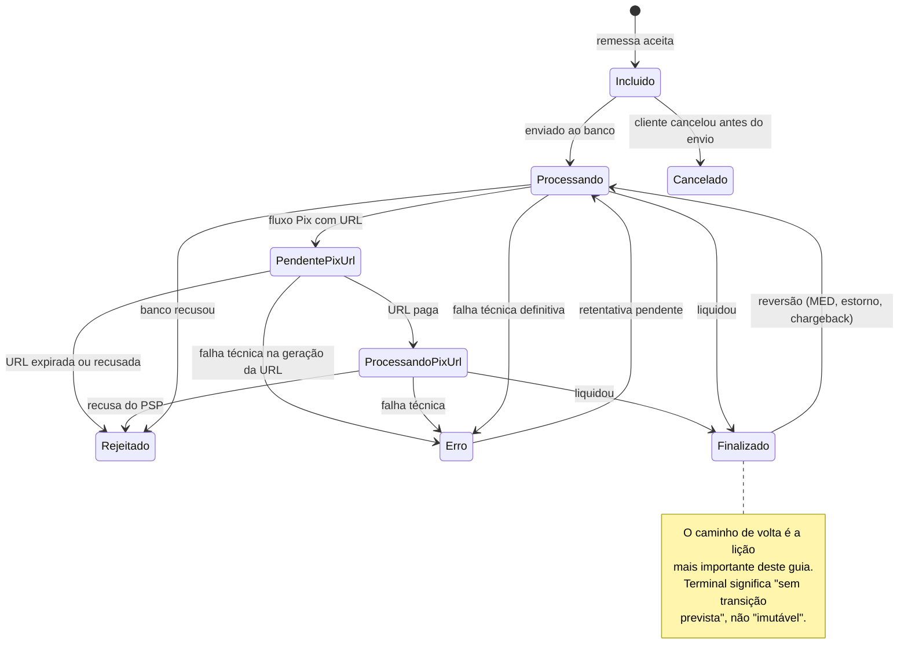

Três leituras que o desenho acima exige:

- **Cancelamento só antes do envio.** Depois que a ordem foi ao banco, cancelar
  não é uma operação sua: o que existe é devolução, e ela entra pelo caminho de
  reversão, não por `Cancelado`.
- **`Erro` volta para `Processando`** enquanto houver retentativa pendente. É a
  contrapartida no desenho da ressalva escrita abaixo.
- **`Finalizado` volta para `Processando`** quando chega um MED, um estorno ou um
  chargeback. Sem essa seta, o diagrama ensinaria o oposto da tese do capítulo 14.

**Por que não reportar os transitórios:** "Processando" não é desfecho, é etapa
da sua máquina. Reportar enche o arquivo de linha que o cliente não pode
acionar, e cria o pior cenário: o cliente processa um retorno dizendo
"processando", monta relatório, e no dia seguinte recebe o desfecho real. Ele
agora tem duas versões da verdade e precisa reconciliar as suas reconciliações.

**Por que reportar `Incluído`:** ele tem valor de recibo. Confirma que a remessa
foi aceita e entrou na fila. Vale no primeiro parcial e nunca mais.

**A ressalva do `Erro` (5):** se ele for gravado antes de esgotar as
retentativas, você reporta rejeição de algo que vai liquidar meia hora depois.
Só reporte `Erro` quando ele for terminal de verdade. Se houver retentativa
pendente, ele pertence ao grupo dos transitórios.

### 9.2 Retorno parcial

Um parcial responde: *"o que mudou desde a última vez que falei com este
cliente?"*.

Dois termos que se repetem daqui em diante. A **janela** é o intervalo de tempo
que uma execução cobre — do último envio até agora. A **marca d'água**
(*watermark*) é o instante guardado que marca até onde você já reportou; ela é o
limite inferior da próxima janela, e avançá-la corretamente é o que impede tanto
repetição quanto buraco.

Três filtros combinados:

1. **Janela** — `DataAtualizacao > UltimoInstanteReportado`
2. **Não reportado** — a tripla `(PagamentoID, CodigoStatus, VersaoEstado)` ainda
   não foi enviada
3. **Reportável** — `CodigoStatus IN (1, 3, 4, 5, 6)`

```sql
DECLARE @documento  VARCHAR(20) = '02384871000181';
DECLARE @marcaDagua DATETIME2(7);

SELECT @marcaDagua = UltimoInstanteReportado
FROM   Pagamento.ControleJanelaRetorno
WHERE  ClienteDocumento = @documento;

-- Sobreposição de 5 minutos: ver 9.4
SET @marcaDagua = DATEADD(minute, -5, ISNULL(@marcaDagua, '1900-01-01'));

SELECT p.BoletoID     AS PagamentoID,
       p.CodigoStatus,
       p.VersaoEstado,
       p.ArquivoID,
       p.NumeroLote,
       p.DataAtualizacao
FROM   Pagamento.Boleto p
WHERE  p.ClienteDocumento = @documento
  AND  p.DataAtualizacao  > @marcaDagua
  AND  p.CodigoStatus IN (1, 3, 4, 5, 6)
  AND  NOT EXISTS (
           SELECT 1
           FROM   Pagamento.ControlePagamentoReportado r
           WHERE  r.PagamentoID  = p.BoletoID
             AND  r.CodigoStatus = p.CodigoStatus
             AND  r.VersaoEstado = p.VersaoEstado   -- a terceira coluna: ver 10.6
       )
ORDER BY p.ArquivoID, p.NumeroLote;
```

> **Por que três colunas e não duas.** Comparar só `(PagamentoID, CodigoStatus)`
> funciona até o primeiro MED: o pagamento volta a `Finalizado`, o par já existe,
> e a segunda liquidação **nunca é informada ao cliente**. A seção 10.6 mostra o
> caso em detalhe. A consulta acima já sai com a correção, para você não copiar o
> bug e consertá-lo depois.

**Mande só o estado atual, não a trilha.** Se o pagamento passou por 2 → 6
dentro da mesma janela, o retorno leva apenas o 6. O CNAB é foto de ocorrência,
não log de auditoria.

### 9.3 "Consolidado" são dois conceitos diferentes

Esta é a armadilha de vocabulário mais cara do domínio, e ela costuma aparecer
tarde: **duas coisas distintas são chamadas de consolidado**, e a equipe que
define a regra raramente é a mesma que a implementa.

| | **Fechamento diário** | **Encerramento de remessa** |
|---|---|---|
| Gatilho | horário fixo, ex. 18h | último item vira terminal |
| Escopo | tudo do dia, do cliente | uma remessa específica |
| Quando ocorre | previsível | imprevisível, pode ser D+3 |
| Serve para | conciliação contábil do dia | encerrar o ciclo daquele envio |
| Pode ter item pendente? | **sim, por definição** | **não, por definição** |

Uma regra como *"parciais de hora em hora das 8h às 18h e um consolidado às 18h"*
descreve o **fechamento diário**. E ela é perfeitamente válida — desde que
ninguém interprete o arquivo das 18h como "a remessa acabou".

**Por que não dá para prometer completude num horário fixo:** basta a remessa ter
entrado às 17h30, conter TED depois do horário de corte, ou boleto com liquidação
em D+1. O arquivo das 18h vai sair com itens em trânsito, e isso não é defeito —
é a natureza do prazo de liquidação. Prometer o contrário no nome do arquivo é
que é o problema.

**O risco concreto do nome errado.** O cliente lê "consolidado", conclui que
aquilo é a versão final, arquiva e fecha o mês. Quando a ocorrência do item
pendente chega no parcial do dia seguinte, ele já não está mais olhando. O
prejuízo aparece na conciliação **dele**, semanas depois, e volta como chamado
para você.

#### Os três tipos, coexistindo

```csharp
public enum TipoRetorno : short
{
    /// <summary>Incremental: só o que mudou desde a última janela.</summary>
    Parcial = 1,

    /// <summary>Foto do dia, em horário fixo. PODE conter itens em trânsito.</summary>
    FechamentoDiario = 2,

    /// <summary>Uma remessa inteira, disparado quando o último item vira terminal.
    /// É o único que pode prometer completude.</summary>
    EncerramentoRemessa = 3
}
```

**Parcial** — de hora em hora. Não gere arquivo quando não houver nada elegível:
consome NSA e vira ticket de suporte.

**Fechamento diário** — horário fixo. Documente explicitamente no manual de
integração que ele pode conter pendências e que o ciclo continua no dia seguinte.

**Encerramento de remessa** — por evento, com prazo-limite. É o único que pode
prometer que acabou.

#### Implementação do fechamento diário

```sql
-- Tudo do cliente com movimento na data, no estado atual.
-- Repare que NÃO filtra por ControlePagamentoReportado: o fechamento
-- repete de propósito o que já foi nos parciais.
SELECT p.BoletoID, p.CodigoStatus, p.VersaoEstado, p.ArquivoID, p.NumeroLote
FROM   Pagamento.Boleto p
WHERE  p.ClienteDocumento = @documento
  AND  p.DataAtualizacao >= @inicioDoDia
  AND  p.DataAtualizacao <  @fimDoDia
  AND  p.CodigoStatus IN (1, 3, 4, 5, 6)
ORDER BY p.ArquivoID, p.NumeroLote;
```

Como ele repete ocorrências, **o cliente precisa saber distinguir os dois
arquivos** para não contabilizar duas vezes. É aqui que o marcador da seção 9.5
deixa de ser conveniência e vira requisito.

#### Implementação do encerramento de remessa

```sql
-- Remessas do cliente que fecharam e ainda não tiveram encerramento emitido
SELECT a.ArquivoID
FROM   Pagamento.Arquivo a
WHERE  a.ClienteDocumento = @documento
  AND  NOT EXISTS (   -- nenhum item em trânsito
           SELECT 1 FROM Pagamento.Boleto b
           WHERE  b.ArquivoID = a.ArquivoID
             AND  b.CodigoStatus IN (2, 7, 8)
       )
  AND  NOT EXISTS (   -- ainda não emitido
           SELECT 1 FROM Pagamento.RetornoGerado r
           WHERE  r.ArquivoRemessaID = a.ArquivoID
             AND  r.TipoRetorno = 3
       );
```

E o prazo-limite, que impede a remessa de ficar aberta para sempre — contado em
**dias úteis**, pela régua do capítulo 8:

```sql
DECLARE @prazoLimiteDiasUteis INT = 2;
DECLARE @limite DATE = Calendario.AdicionarDiasUteis(
                           CAST(SYSUTCDATETIME() AS date), -@prazoLimiteDiasUteis, 'BR');

-- Remessas presas: passou do prazo e ainda tem item em trânsito.
-- Emita o encerramento com o que houver E gere alerta com os pendentes.
SELECT a.ArquivoID,
       Calendario.DiasUteisEntre(CAST(a.DataCriacao AS date),
                                 CAST(SYSUTCDATETIME() AS date), 'BR') AS DiasUteisAberta,
       COUNT(b.BoletoID)                                               AS ItensPendentes
FROM   Pagamento.Arquivo a
JOIN   Pagamento.Boleto b ON b.ArquivoID = a.ArquivoID
WHERE  b.CodigoStatus IN (2, 7, 8)
  AND  CAST(a.DataCriacao AS date) < @limite
GROUP BY a.ArquivoID, a.DataCriacao;
```

**Item que nunca termina é o caso que ninguém prevê.** Sem esse alerta, uma
remessa pode ficar cinco dias com três itens presos e ninguém descobre até o
cliente ligar. Trate a idade da remessa aberta como métrica de operação, ao lado
das três do capítulo 17.

#### O agendamento

```csharp
public sealed class AgendadorRetornoWorker(
    IFila<RetornoSolicitado> fila,
    IRepositorioClientes clientes,
    TimeProvider relogio,                 // relógio injetável: ver 8.2
    ILogger<AgendadorRetornoWorker> log) : BackgroundService
{
    // Fuso explícito: o contêiner roda em UTC, a regra de negócio é local.
    // Deixar isso implícito faz o fechamento das 18h sair às 15h no verão.
    private static readonly TimeZoneInfo Fuso =
        TimeZoneInfo.FindSystemTimeZoneById("America/Sao_Paulo");

    protected override async Task ExecuteAsync(CancellationToken ct)
    {
        while (!ct.IsCancellationRequested)
        {
            var agora = TimeZoneInfo.ConvertTime(relogio.GetUtcNow(), Fuso);

            if (agora.Hour is >= 8 and <= 18 && agora.Minute == 0)
            {
                var tipo = agora.Hour == 18 ? TipoRetorno.FechamentoDiario : TipoRetorno.Parcial;

                foreach (var documento in await clientes.AtivosAsync(ct))
                    await fila.PublicarAsync(new RetornoSolicitado(documento, tipo), ct);
            }

            await Task.Delay(TimeSpan.FromSeconds(30), ct);
        }
    }
}
```

O encerramento de remessa não entra nesse laço: ele é disparado pelo
`CasamentoWorker`, quando a atualização de status deixa a remessa sem itens em
trânsito (6.1). Reagir ao evento é mais barato e mais rápido que varrer todas as
remessas abertas a cada ciclo.

#### As perguntas para levar ao time antes de codificar

1. **O que acontece com item ainda em trânsito no fechamento?** Fica de fora, ou
   entra com o status atual? Se entrar com status transitório, você quebra a
   regra de não reportar `Processando` e o cliente monta relatório sobre estado
   que vai mudar.
2. **E o item que finaliza às 19h?** Entra no parcial das 8h do dia seguinte? Isso
   é coerente com fechamento diário e incoerente com "remessa encerrada".
3. **O fechamento repete o que já foi nos parciais?** Se sim, o marcador de tipo
   é obrigatório.
4. **PIX não respeita 8h às 18h.** Ele liquida à noite, no fim de semana e no
   feriado. Com workers só em dia útil comercial, a segunda de manhã começa com o
   acúmulo do fim de semana inteiro. Isso é aceitável para o cliente?
5. **Quem avisa sobre remessa presa?** Sem gatilho de encerramento, ninguém.

Se três tipos parecerem demais para o momento, o mínimo viável é manter os dois
que já existem e **renomear o das 18h** para algo que não prometa o que ele não
entrega. "Fechamento diário" já resolve a maior parte do mal-entendido.

### 9.4 Os cuidados que costumam morder

**Totalizadores do trailer.** Se você filtra itens, o trailer de lote precisa
refletir **o que foi incluído**, não o lote original. Um parcial com 3 de 40
títulos tem quantidade 3 e somatório dos 3. Como o header e o trailer são
entregues prontos ao conversor, isso é responsabilidade do seu código, não dele.

**Lote sem item elegível.** Se nenhum pagamento do lote entrou na janela, não
mande o header/trailer daquele lote. Lote vazio costuma ser rejeitado na leitura.

**Arquivo vazio.** Se a janela inteira não produziu nada, não gere arquivo.
Gerar consome NSA e o cliente recebe um retorno sem ocorrência, o que vira
ticket de suporte.

**`NumeroLote` nulo.** O item não encontra header/trailer e vira registro órfão.
Decida explicitamente: excluir com alerta, ou agrupar num lote de exceção. Não
deixe cair no `else` implícito. (A origem do `NumeroLote` é a ingestão da
remessa — ver 5.1.)

**Sobreposição na marca d'água.** Este é sutil e caro. Se um registro commitar
com `DataAtualizacao` anterior ao instante que você já marcou como lido, ele
some para sempre:

```
15:00:00.000  Transação A começa, escreve DataAtualizacao = 15:00:00
15:00:00.100  Transação B lê até 15:00:00.100 e grava marca d'água
15:00:00.200  Transação A commita
              → o registro de A nunca mais entra em nenhuma janela
```

A defesa é buscar a partir de `marcaDagua - 5 minutos` e deixar o
`ControlePagamentoReportado` cortar a duplicata. É exatamente para isso que ele
existe, e a seção 10.4 desenha as janelas sobrepostas. Alternativa mais robusta:
usar **`rowversion`** em vez de `datetime2`. É um contador binário que o SQL
Server incrementa automaticamente a cada alteração da linha, sempre crescente e
único no banco inteiro. Como ele não depende do relógio nem do instante em que a
transação começou, não sofre do problema de sobreposição descrito acima.

**Nem o encerramento é o fim.** Três mecanismos podem reverter um pagamento já
liquidado: o **MED** (Mecanismo Especial de Devolução), que permite ao pagador do
PIX contestar por suspeita de fraude em até 80 dias; o **estorno**, devolução
acordada entre as partes; e o **chargeback**, contestação de compra no cartão
junto à bandeira. Todos chegam depois. O
parcial precisa continuar rodando depois do encerramento, e a marca d'água não
pode ser zerada quando ele sai.

### 9.5 Como sinalizar o tipo do retorno no arquivo

**O padrão não tem esse campo.** Nem o CNAB 240 nem o 400 preveem os três tipos
da seção 9.3. O header de arquivo carrega o código de
remessa/retorno (1 ou 2, que indica só a direção), o NSA, a data e hora de
geração, a versão do layout e blocos de uso reservado. A distinção entre parcial
e os demais tipos é um conceito seu, não do formato — por isso a solução mais comum
do mercado é o nome do arquivo.

**O formato de nome usado neste guia**, e o único, do capítulo 5 ao 12:

```
{documento}_{yyyyMMdd}_{nsa:000000}.RET

02384871000181_20260830_000042.RET
```

Ele carrega o cliente, a data e o NSA — é o que o cliente vê, o que aparece no
chamado de suporte e o que a seção 12.3 usa como chave determinística no S3
(sob o prefixo do documento). **Um formato só, em todos os lugares:** dois
esquemas de nome convivendo é garantia de que o de idempotência do upload e o do
cliente vão divergir no primeiro incidente.

**Por que o nome sozinho não basta.** Ele não viaja com o conteúdo. Se perde
quando o ERP do cliente renomeia na ingestão, quando o arquivo é arquivado ou
reprocessado, quando alguém abre um chamado e anexa só o conteúdo, e quando a VAN
muda de convenção de nomenclatura. No dia do incidente, você tem um arquivo na
mão e nenhuma forma de saber o que ele era.

#### As opções

| Opção | A favor | Contra |
|---|---|---|
| **Nome do arquivo** | Simples, já em uso, cliente entende | Não viaja com o conteúdo |
| **Campo de uso da empresa no header** | Viaja com o conteúdo, sobrevive a tudo | Quebra clientes que já parseiam posição a posição |
| **Faixa de NSA separada** | Nenhuma mudança de layout | Destrói a detecção de arquivo faltante, que é a razão de existir do NSA |
| **Manifesto ao lado do arquivo** | Não invasivo, extensível | Só serve para quem escolher lê-lo |
| **API de consulta por NSA** | Rica, evolui sem mexer no arquivo | Inútil para quem só busca arquivo em pasta |
| **Metadado no seu banco** | Responde qualquer pergunta futura | Só você enxerga |

#### 1. Persistir o tipo no seu banco (faça isto primeiro)

É a camada mais importante e a única que não depende de acordo com o cliente.
É ela que responde *"o NSA 42 daquele cliente era de que tipo, e o que
ele continha?"* quando o chamado chegar daqui a três meses.

```sql
CREATE TABLE Pagamento.RetornoGerado
(
    Documento         VARCHAR(20)      NOT NULL,   -- cliente
    Nsa               BIGINT           NOT NULL,
    TipoRetorno       SMALLINT         NOT NULL,   -- 1=Parcial, 2=FechamentoDiario, 3=EncerramentoRemessa
    ArquivoRemessaID  UNIQUEIDENTIFIER NULL,       -- só no encerramento de remessa
    QuantidadeItens   INT              NOT NULL,
    PeriodoInicio     DATETIME2(7)     NULL,       -- janela coberta pelo parcial
    PeriodoFim        DATETIME2(7)     NULL,
    NomeArquivo       VARCHAR(250)     NOT NULL,
    HashConteudo      VARCHAR(32)      NOT NULL,   -- prova de qual arquivo saiu
    DataCriacao       DATETIME2(7)     NOT NULL
        CONSTRAINT DF_RetornoGerado_Data DEFAULT SYSUTCDATETIME(),

    CONSTRAINT PK_RetornoGerado PRIMARY KEY CLUSTERED (Documento, Nsa)
);
```

A PK em `(Documento, Nsa)` é intencional: além de indexar a busca natural, ela
**impede fisicamente** que o mesmo NSA seja gravado duas vezes para o mesmo
cliente. É a terceira defesa contra a corrida descrita no capítulo 16, depois da
fila particionada e da reserva atômica.

O `INSERT` entra na mesma transação da geração:

```csharp
// dentro da transação que já reservou o NSA e gravou os reportados
await _retornos.RegistrarAsync(new RetornoGerado(
    Documento:        documento,
    Nsa:              nsa,
    Tipo:             tipo,
    ArquivoRemessaId: tipo == TipoRetorno.EncerramentoRemessa ? arquivoRemessaId : null,
    QuantidadeItens:  itens.Count,
    PeriodoInicio:    janela.Inicio,
    PeriodoFim:       janela.Fim,
    NomeArquivo:      nome,
    HashConteudo:     Convert.ToHexString(MD5.HashData(bytes)).ToLowerInvariant()
), conexao, tx, ct);
```

#### 2. Marcar no header, no bloco de uso da empresa

O layout reserva um trecho do header de arquivo para uso do cedente, justamente
para casos assim. Como o layout do retorno é publicado por você, dá para definir
e documentar um código ali.

```csharp
public static class MarcadorTipoRetorno
{
    // ATENÇÃO: confirme as posições no manual de layout que VOCÊ publica.
    // O bloco reservado à empresa varia entre bancos e entre versões.
    private const int PosicaoInicio = 192;   // base 1, conforme o manual
    private const int Tamanho       = 10;

    /// <summary>
    /// Escreve o marcador no header de arquivo antes de entregá-lo ao conversor.
    /// Preenche à direita com espaços, como manda o formato.
    /// </summary>
    public static string Aplicar(string headerArquivo, TipoRetorno tipo)
    {
        if (headerArquivo.Length != 240)
            throw new ArgumentException("Header de arquivo deve ter 240 posições.", nameof(headerArquivo));

        var marcador = tipo switch
        {
            TipoRetorno.Parcial             => "PARCIAL",
            TipoRetorno.FechamentoDiario    => "FECHDIA",
            TipoRetorno.EncerramentoRemessa => "ENCREM",
            _ => throw new ArgumentOutOfRangeException(nameof(tipo))
        }.PadRight(Tamanho);

        var destino = headerArquivo.ToCharArray();
        marcador.AsSpan().CopyTo(destino.AsSpan(PosicaoInicio - 1, Tamanho));
        return new string(destino);
    }
}
```

**O risco a pesar:** clientes que já processam seus retornos hoje leem posição a
posição. Se o bloco que você escolher estiver dentro de uma faixa que eles já
mapeiam como "brancos", nada quebra; se não, quebra o parser deles sem aviso.
Trate como mudança de layout: versione, comunique e ofereça período de
convivência.

#### 3. Manifesto ao lado do arquivo

A opção menos invasiva, e a que evolui melhor. Um arquivo irmão, mesmo nome-base:

```
02384871000181_20260830_000042.RET
02384871000181_20260830_000042.RET.json
```

```json
{
  "nsa": 42,
  "tipo": "Parcial",
  "clienteDocumento": "02384871000181",
  "geradoEm": "2026-08-30T14:22:31Z",
  "quantidadeItens": 137,
  "periodo": { "inicio": "2026-08-30T08:00:00Z", "fim": "2026-08-30T14:22:00Z" },
  "arquivoRemessa": null,
  "hashConteudo": "9f2c4a…"
}
```

Quem quer, lê; quem não quer, ignora. E ele serve de veículo para metadados
futuros sem mexer no CNAB nunca mais.

#### 4. A pergunta que decide a urgência disso

> O fechamento diário repete ocorrências que já foram nos parciais?

**Se sim** — e pela consulta da seção 9.3 ele repete — o cliente precisa
distinguir os arquivos para não contar o mesmo pagamento duas vezes na
contabilidade dele. Aí o marcador não é conveniência, é requisito, e depender só
do nome do arquivo é um risco financeiro em aberto, não uma dívida técnica.

**Se não** — se o fechamento é só conferência e o cliente é orientado a processar
apenas os parciais — o marcador é conveniência operacional, e a ordem recomendada
(banco primeiro, manifesto depois, header por último) resolve sem pressa.

Em qualquer dos dois casos, deixe explícito no manual de integração qual é o
comportamento esperado. Ambiguidade aqui vira dupla contabilização no cliente, e
esse tipo de erro aparece semanas depois, na conciliação **dele**.

### 9.6 Checkpoint

1. Um item passou de `Processando` para `Finalizado` e voltou para `Processando`
   por um MED, tudo dentro da mesma janela de uma hora. O que vai no arquivo?
   *Só o estado atual no momento da geração. O CNAB é foto, não trilha — e a
   `VersaoEstado` garante que o próximo `Finalizado` volte a ser reportável.*
2. Por que `Incluído` é reportado uma vez só?
   *Porque é recibo de entrada. Repeti-lo faria o cliente contabilizar duas vezes
   a mesma confirmação.*
3. O arquivo das 18h se chama "consolidado" e traz três itens em trânsito. Qual é
   o risco?
   *O cliente fecha o mês com ele. A ocorrência que chegar amanhã já não será
   olhada, e o erro aparece na conciliação dele semanas depois.*
4. Por que a busca começa cinco minutos antes da marca d'água?
   *Para não perder registros cuja transação commitou depois do instante já
   marcado como lido. A duplicata que isso gera é cortada pelo controle do
   capítulo 10.*

---

## 10. Controle do que já foi informado

O problema: como garantir que o cliente não receba a mesma ocorrência duas vezes,
sem varrer a base inteira a cada execução.

### 10.1 O modelo

```sql
CREATE TABLE Pagamento.ControlePagamentoReportado
(
    ControleID   BIGINT           IDENTITY(1,1) NOT NULL,
    PagamentoID  UNIQUEIDENTIFIER NOT NULL,
    CodigoStatus SMALLINT         NOT NULL,
    VersaoEstado INT              NOT NULL CONSTRAINT DF_CPR_Versao DEFAULT 1,
    Nsa          BIGINT           NULL,       -- em qual arquivo foi informado
    DataCriacao  DATETIME2(7)     NOT NULL CONSTRAINT DF_CPR_Data DEFAULT SYSUTCDATETIME(),

    CONSTRAINT PK_ControlePagamentoReportado PRIMARY KEY CLUSTERED (ControleID)
);
```

A chave lógica — a tripla `(PagamentoID, CodigoStatus, VersaoEstado)` — **não**
está declarada acima de propósito: ela vira um índice único não clusterizado, e a
seção 10.2 explica por quê. O índice é criado uma única vez, ali, e nunca
redeclarado neste guia; o capítulo 15 apenas o referencia.

### 10.2 O erro que não aparece em teste: PK clusterizada em GUID

Um modelo natural seria `PRIMARY KEY CLUSTERED (PagamentoID, CodigoStatus)`.
Ele funciona, e degrada silenciosamente.

`PagamentoID` é `uniqueidentifier` — o tipo do SQL Server para **GUID**, um
identificador de 16 bytes gerado aleatoriamente, sem ordem entre um valor e o
seguinte.

Um **índice clusterizado** não é uma estrutura à parte: ele **é** a tabela,
ordenada fisicamente pela chave. Só existe um por tabela, e escolher a chave
errada define o padrão de escrita no disco para sempre. Com uma chave aleatória,
cada `INSERT` cai numa página aleatória no meio dos dados. Consequências:

- **Page splits** constantes: uma *página* é o bloco de 8 KB em que o SQL Server
  guarda as linhas. Quando ela está cheia e chega uma linha que pertence ao meio
  dela, o banco divide a página em duas e move metade dos dados — operação cara,
  que ainda gera log
- **Fragmentação** alta: as páginas ficam meio vazias e espalhadas
- **Buffer pool poluído**: o *buffer pool* é a memória RAM em que o SQL Server
  mantém as páginas mais usadas. Com inserção aleatória, cada linha nova exige
  trazer uma página diferente do disco, expulsando páginas úteis
- Tudo isso **piora conforme a tabela cresce**

Com dez mil linhas ninguém nota. Com cinquenta milhões, o insert do lote vira o
gargalo do pipeline.

A correção é separar a chave **física** da chave **lógica**: `IDENTITY`
clusterizado (insert sempre no fim da tabela, zero page split) e a tripla como
índice único não clusterizado.

| | PK clusterizada no GUID | IDENTITY + único na tripla |
|---|---|---|
| Padrão de escrita | aleatório | sequencial |
| Fragmentação | alta, cresce | baixa |
| Espaço | um índice | dois índices |
| Busca pela tripla | direta no clustered | *seek* no índice não clusterizado + *lookup* |
| Manutenção | *rebuild* frequente | raro |

*Seek* é a busca direta que salta para a posição certa do índice, oposta ao
*scan*, que percorre tudo. *Rebuild* é a reconstrução do índice para desfazer a
fragmentação — operação pesada, que idealmente você não precisa fazer toda
semana.

**Esta é a definição canônica do índice** — a única no guia inteiro. O `INCLUDE`
resolve o lookup que a tabela acima menciona: com `Nsa` e `DataCriacao` viajando
junto, o anti-join de 10.4 responde sem voltar à tabela.

```sql
CREATE UNIQUE NONCLUSTERED INDEX UX_CPR_Par
    ON Pagamento.ControlePagamentoReportado (PagamentoID, CodigoStatus, VersaoEstado)
    INCLUDE (Nsa, DataCriacao);
```

### 10.3 Escrita em lote com TVP

Um **TVP** (*table-valued parameter*, ou parâmetro com valor de tabela) permite
mandar uma tabela inteira como um único parâmetro de um procedimento. Você
declara o formato da tabela uma vez no banco e, do .NET, passa um `DataTable`
no lugar de um valor escalar.

Um `INSERT` por pagamento é um round-trip por pagamento. Mande o lote inteiro:

```sql
CREATE TYPE Pagamento.TipoParReportado AS TABLE
(
    PagamentoID  UNIQUEIDENTIFIER NOT NULL,
    CodigoStatus SMALLINT         NOT NULL,
    VersaoEstado INT              NOT NULL,
    PRIMARY KEY (PagamentoID, CodigoStatus, VersaoEstado)
);
GO

CREATE OR ALTER PROCEDURE Pagamento.RegistrarReportados
    @pares Pagamento.TipoParReportado READONLY,
    @nsa   BIGINT
AS
BEGIN
    SET NOCOUNT ON;

    INSERT INTO Pagamento.ControlePagamentoReportado
        (PagamentoID, CodigoStatus, VersaoEstado, Nsa)
    SELECT p.PagamentoID, p.CodigoStatus, p.VersaoEstado, @nsa
    FROM   @pares p
    WHERE  NOT EXISTS (
               SELECT 1 FROM Pagamento.ControlePagamentoReportado r
               WHERE  r.PagamentoID  = p.PagamentoID
                 AND  r.CodigoStatus = p.CodigoStatus
                 AND  r.VersaoEstado = p.VersaoEstado
           );
END
GO
```

Do lado do .NET:

```csharp
var tabela = new DataTable();
tabela.Columns.Add("PagamentoID", typeof(Guid));
tabela.Columns.Add("CodigoStatus", typeof(short));
tabela.Columns.Add("VersaoEstado", typeof(int));

foreach (var item in itensDoArquivo)
    tabela.Rows.Add(item.PagamentoId, item.CodigoStatus, item.VersaoEstado);

await using var cmd = new SqlCommand("Pagamento.RegistrarReportados", conexao, transacao)
{
    CommandType = CommandType.StoredProcedure
};
cmd.Parameters.Add(new SqlParameter("@pares", SqlDbType.Structured)
{
    TypeName = "Pagamento.TipoParReportado",
    Value = tabela
});
cmd.Parameters.AddWithValue("@nsa", nsa);
await cmd.ExecuteNonQueryAsync(ct);
```

**O ponto não negociável:** grave o reportado **na mesma transação** que reserva
o NSA e grava a outbox. Se gravar depois, uma falha no meio faz o próximo
arquivo repetir tudo. Se gravar antes e a geração falhar, o cliente nunca recebe
aquele estado.

### 10.4 A leitura, o índice que a sustenta e as janelas sobrepostas

O `NOT EXISTS` da consulta é o que se chama de **anti-join**: em vez de trazer
as linhas que têm correspondente, ele traz justamente as que **não** têm. É a
tradução literal de "me dê o que ainda não reportei".

O desenho abaixo mostra por que ele é indispensável — e não apenas uma otimização:

```mermaid
gantt
    title Janelas do parcial com sobreposição de 5 minutos
    dateFormat HH:mm
    axisFormat %H:%M

    section Janela das 14h
    Le de 12h55 a 14h00        :done, j1, 12:55, 65m
    section Janela das 15h
    Le de 13h55 a 15h00        :active, j2, 13:55, 65m
    section Transação atrasada
    Escreve 13h58 commita 14h00 :crit, t1, 13:58, 3m
```

Sem sobreposição, a transação que **escreveu** `DataAtualizacao = 13:58` mas só
**commitou** às 14:00:01 cairia num buraco: a janela das 14h já tinha lido, e a
janela das 15h começaria em 14:00. O item sumiria para sempre.

Com a sobreposição de cinco minutos, ele é lido de novo às 15h — e aí o
`ControlePagamentoReportado` faz o segundo trabalho: como a tripla já está
gravada, o anti-join o descarta. **A sobreposição garante que nada se perca; o
controle garante que nada se repita.** Um sem o outro não funciona.

O custo real do parcial está no lado esquerdo do anti-join, não no anti-join.
A marca d'água já reduz o conjunto para "o que mudou", então o índice decisivo é:

```sql
CREATE INDEX IX_Boleto_Janela
    ON Pagamento.Boleto (ClienteDocumento, DataAtualizacao)
    INCLUDE (CodigoStatus, VersaoEstado, NumeroLote, ArquivoID);
```

Com ele, o plano vira um seek pequeno seguido de lookups pontuais no
`UX_CPR_Par`. Escala bem porque o volume por execução depende da **janela**, não
do tamanho histórico da tabela.

### 10.5 A alternativa: máscara de bits

Como são 8 status, tudo cabe num `smallint` na própria linha do pagamento:

```sql
ALTER TABLE Pagamento.Boleto ADD StatusReportadoMask SMALLINT NOT NULL
    CONSTRAINT DF_Boleto_Mask DEFAULT 0;

-- já reportei este status?
WHERE (p.StatusReportadoMask & POWER(2, p.CodigoStatus)) = 0

-- marcar
UPDATE Pagamento.Boleto
SET    StatusReportadoMask = StatusReportadoMask | POWER(2, @codigoStatus)
WHERE  BoletoID = @id;
```

| | Tabela de triplas | Máscara de bits |
|---|---|---|
| Linhas extras | até 5 por pagamento | zero |
| Consulta | anti-join | teste de bit na própria linha |
| Auditoria | quando, em qual NSA | nada |
| Retenção | precisa de expurgo | não precisa |
| Concorrência | insert, sem conflito | `UPDATE` na linha quente |
| Reversão | suporta com versão | **não suporta** |

A máscara é mais rápida e não cresce, mas você perde a resposta para *"quando
esse status foi informado e em qual arquivo?"*, que é a primeira pergunta de
qualquer investigação com cliente — e perde também a reversão, porque um bit não
tem versão.

**Recomendação:** mantenha a tabela como fonte da verdade. Considere a máscara
apenas como cache desnormalizado, atualizado na mesma transação, se a medição
mostrar que o anti-join virou gargalo. Não comece por ela.

### 10.6 O caso que quebra o par: reversão

`(PagamentoID, CodigoStatus)`, sozinho, assume que um pagamento passa por cada
estado uma vez só. Com MED, estorno e chargeback isso deixa de valer:

```
Finalizado (6)   → reportado ao cliente  ✓
Revertido        → cliente contesta, MED devolve o dinheiro
Finalizado (6)   → o par já existe → SUPRIMIDO  ✗
```

O cliente nunca fica sabendo da segunda liquidação. Daí a coluna
`VersaoEstado`: um contador incrementado a cada transição do pagamento.

```sql
ALTER TABLE Pagamento.Boleto ADD VersaoEstado INT NOT NULL
    CONSTRAINT DF_Boleto_Versao DEFAULT 1;

-- em toda mudança de status:
UPDATE Pagamento.Boleto
SET    CodigoStatus    = @novoStatus,
       VersaoEstado    = VersaoEstado + 1,
       DataAtualizacao = SYSUTCDATETIME()
WHERE  BoletoID = @id;
```

Com a terceira coluna, a sequência acima produz `(P, 6, 3)` e depois `(P, 6, 5)`:
triplas diferentes, as duas reportáveis.

**A consulta de 9.2 já sai com as três colunas** — é a mesma consulta, não uma
versão corrigida que você precise ir buscar. Se você começar sem tratar reversão,
**deixe a coluna prevista mesmo assim**, com default 1: retrofitar isso com a
tabela já grande é bem mais caro que criar agora.

### 10.7 Retenção

A tabela é append-only e cresce para sempre. Duas estratégias:

```sql
-- Expurgo em lotes pequenos: não estoura o log de transação
-- nem segura lock por muito tempo.
-- Retenção é prazo de ARMAZENAMENTO: dias corridos, não dias úteis (8.1).
WHILE 1 = 1
BEGIN
    DELETE TOP (5000) FROM Pagamento.ControlePagamentoReportado
    WHERE DataCriacao < DATEADD(month, -12, SYSUTCDATETIME());

    IF @@ROWCOUNT = 0 BREAK;
    WAITFOR DELAY '00:00:01';   -- dá respiro para as outras cargas
END
```

Acima de algumas dezenas de milhões de linhas, vale particionar por mês e usar
`SWITCH` de partição: o expurgo vira uma operação de metadados, instantânea e
sem log.

**Cuidado ao escolher o prazo:** ele precisa ser maior que o prazo máximo de
contestação. MED aceita contestação em até 80 dias; chargeback vai bem além.
Seis meses é o piso; doze é confortável. E veja o capítulo 13: há prazos legais
mínimos e máximos que não são decisão de engenharia.

> **O fio condutor.** No parcial das 14h, a tripla
> `(boleto, 6, 3)` é gravada em `ControlePagamentoReportado` com `Nsa = 42`, na
> mesma transação que gerou o arquivo. No parcial das 15h, o boleto ainda aparece
> na janela por causa da sobreposição de cinco minutos — e é o anti-join que o
> descarta. Quarenta dias depois, com a `VersaoEstado` em 5, a tripla
> `(boleto, 6, 5)` será diferente e o segundo `Finalizado` voltará a ser
> reportável.

### 10.8 Checkpoint

1. Por que o índice único tem três colunas e não duas?
   *Porque `(pagamento, status)` suprime a segunda passagem pelo mesmo status
   depois de uma reversão. A `VersaoEstado` torna as duas passagens distintas.*
2. A sobreposição de cinco minutos não gera repetição para o cliente?
   *Não: ela gera repetição na leitura, e o anti-join a corta. Os dois mecanismos
   existem juntos por desenho.*
3. Por que não usar a máscara de bits, que é mais rápida?
   *Porque ela não responde "em qual NSA isso foi informado" e não suporta
   reversão. Serve como cache, não como fonte da verdade.*
4. Você gravou o reportado depois do commit da geração, "para não segurar a
   transação". O que acontece se o processo morrer no meio?
   *O arquivo foi gerado e publicado, mas o sistema não sabe: o próximo parcial
   repete tudo para o cliente.*

---

## 11. Etapa 3 — Geração do retorno

Com um conversor de CNAB disponível, esta etapa não monta linha nenhuma: ela
**seleciona, agrupa, totaliza e entrega ao conversor**.

### 11.1 O fluxo

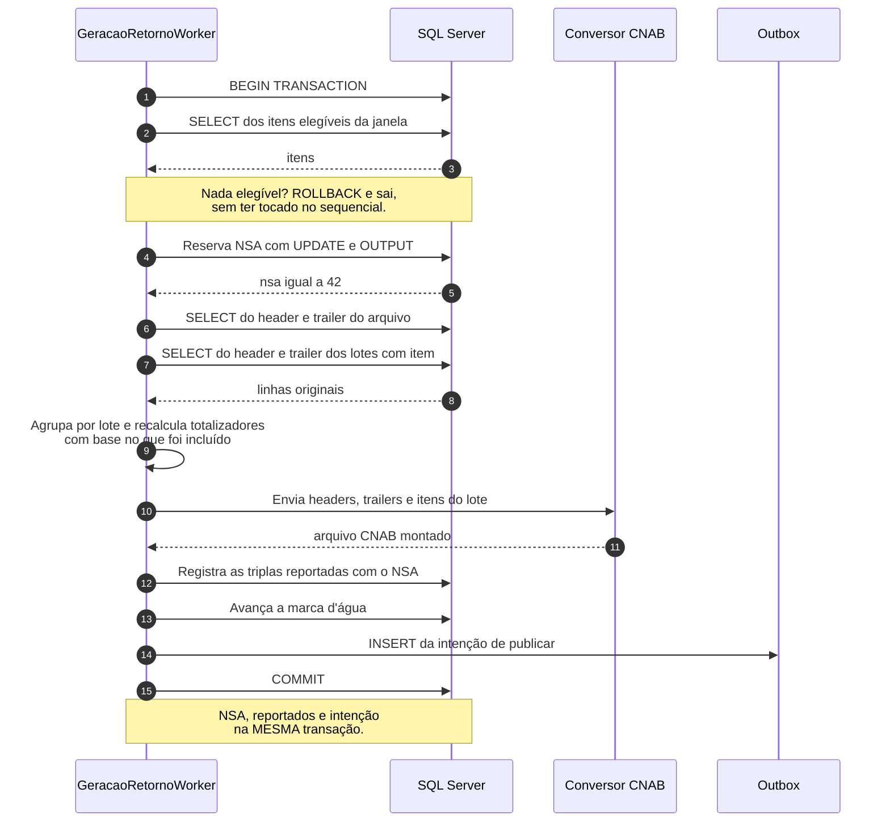

**A ordem dos dois primeiros passos é deliberada** e o código da próxima seção
faz exatamente isso: seleciona, depois reserva. O motivo está em 11.2.

### 11.2 O código

```csharp
public async Task GerarAsync(string documento, TipoRetorno tipo, CancellationToken ct)
{
    await using var conexao = new SqlConnection(_connectionString);
    await conexao.OpenAsync(ct);
    await using var tx = (SqlTransaction)await conexao.BeginTransactionAsync(ct);

    try
    {
        // 1. Seleciona ANTES de reservar o NSA. Ver a nota abaixo:
        //    o motivo é o tempo de lock, não o número em si.
        var itens = await _repo.ObterElegiveisAsync(documento, tipo, conexao, tx, ct);
        if (itens.Count == 0)
        {
            await tx.RollbackAsync(ct);
            _log.LogInformation("Nada elegível para {Documento}; arquivo não gerado.", documento);
            return;
        }

        // 2. Reserva atômica do NSA (ver capítulo 16)
        var nsa = await _nsa.ReservarProximoAsync(documento, conexao, tx, ct);

        // 3. Monta a estrutura para o conversor
        var lotes = itens
            .Where(i => i.NumeroLote.HasValue)      // órfãos tratados à parte
            .GroupBy(i => (i.ArquivoRemessaId, i.NumeroLote!.Value))
            .Select(g => new LoteParaConversor(
                HeaderOriginal:  _linhas.HeaderLote(g.Key.ArquivoRemessaId, g.Key.Value),
                TrailerOriginal: _linhas.TrailerLote(g.Key.ArquivoRemessaId, g.Key.Value),
                Itens:           g.ToList(),
                // Totalizadores recalculados: refletem o que FOI incluído,
                // não o lote original da remessa.
                QuantidadeRegistros: g.Count(),
                SomatorioValores:    g.Aggregate(Dinheiro.Zero, (acc, i) => acc + i.Valor)))
            .ToList();

        var orfaos = itens.Where(i => !i.NumeroLote.HasValue).ToList();
        if (orfaos.Count > 0)
            _log.LogWarning("{Qtd} itens sem NumeroLote excluídos do retorno de {Doc}.",
                orfaos.Count, documento);

        // 4. Chama o conversor
        var bytes = await _conversor.MontarRetornoAsync(new PedidoConversao(
            HeaderArquivo:  _linhas.HeaderArquivo(itens[0].ArquivoRemessaId),
            TrailerArquivo: _linhas.TrailerArquivo(itens[0].ArquivoRemessaId),
            Nsa:            nsa,
            Lotes:          lotes), ct);

        var nome = $"{documento}_{_relogio.GetUtcNow():yyyyMMdd}_{nsa:D6}.RET";   // ver 9.5
        var hash = Convert.ToHexString(MD5.HashData(bytes)).ToLowerInvariant();

        // 5. Conteúdo no armazenamento de trabalho, ANTES do commit.
        //    Se a transação cair, isto vira lixo com TTL curto — e lixo é bem
        //    mais barato que arquivo publicado sem registro. Ver 13.1.
        var referencia = await _conteudo.GravarAsync(documento, nome, bytes, ct);

        // 6. Metadados do arquivo emitido — mesma transação (9.5)
        await _retornos.RegistrarAsync(new RetornoGerado(
            documento, nsa, tipo, arquivoRemessaId, itens.Count,
            janela.Inicio, janela.Fim, nome, hash), conexao, tx, ct);

        // 7. Registra o que foi informado — mesma transação
        await _reportados.RegistrarAsync(itens, nsa, conexao, tx, ct);

        // 8. Avança a marca d'água — mesma transação
        await _janela.AvancarAsync(documento, itens.Max(i => i.DataAtualizacao), conexao, tx, ct);

        // 9. Intenção de publicar — mesma transação. NÃO publica aqui.
        //    Só a referência e os metadados; o conteúdo já está no passo 5.
        await _outbox.EnfileirarAsync("RetornoGerado", documento,
            new { Nsa = nsa, Nome = nome, Referencia = referencia, Hash = hash }, conexao, tx, ct);

        await tx.CommitAsync(ct);
        _log.LogInformation("Retorno NSA {Nsa} gerado para {Doc} com {Qtd} itens.",
            nsa, documento, itens.Count);
    }
    catch (Exception)
    {
        await tx.RollbackAsync(ct);
        throw;
    }
}
```

Repare no `Aggregate` do passo 3: ele depende do `operator +` de `Dinheiro`, que
está definido em 2.7 junto com o `-`. Um tipo de dinheiro que só sabe subtrair
compila até o dia em que alguém precisa somar um lote.

Repare também nos passos 5 e 9: o conteúdo vai para o armazenamento de trabalho
e a outbox recebe apenas a **referência**, não o arquivo. O capítulo 13 explica
por quê — e por que gravar o conteúdo antes do commit é a ordem segura.

#### Por que selecionar antes de reservar

A justificativa intuitiva — *"reservar primeiro queimaria um número de sequência"*
— **não se sustenta neste código**: a reserva acontece dentro da transação, e o
caminho de saída antecipada faz `RollbackAsync`. Um rollback desfaz o `UPDATE` do
sequencial; nenhum número seria perdido. (Ela valeria se a reserva fosse feita em
transação própria, já commitada — o que é comum quando se usa uma sequência do
banco em vez de uma tabela.)

O motivo real é melhor e amarra com o resto do capítulo: **encurtar o tempo em
que a linha do `SequencialArquivo` fica travada**. A reserva é um `UPDATE` numa
linha única por cliente, e o lock dela só é liberado no commit. Selecionar
primeiro tira da janela travada tudo o que pode ser feito antes: a consulta dos
elegíveis, que é a parte mais cara. Como a etapa é serial por cliente
(capítulo 16), cada milissegundo a mais de lock é fila para a próxima execução do
mesmo cliente — e é exatamente o problema que 11.4 levanta sobre o conversor
remoto.

### 11.3 Onde os header/trailer moram

```sql
-- Um por arquivo de remessa
CREATE TABLE Pagamento.ArquivoCnabLinha
(
    ArquivoID       UNIQUEIDENTIFIER NOT NULL,
    LinhaHeader     CHAR(240)        NOT NULL,
    LinhaTrailer    CHAR(240)        NULL,      -- só conhecido ao fechar
    DataCriacao     DATETIME2(7)     NOT NULL CONSTRAINT DF_ACL_Data DEFAULT SYSUTCDATETIME(),
    DataAtualizacao DATETIME2(7)     NULL,
    CONSTRAINT PK_ArquivoCnabLinha PRIMARY KEY CLUSTERED (ArquivoID)
);

-- Um por lote dentro do arquivo
CREATE TABLE Pagamento.LoteCnabLinha
(
    ArquivoID       UNIQUEIDENTIFIER NOT NULL,
    NumeroLote      INT              NOT NULL,
    LinhaHeader     CHAR(240)        NOT NULL,
    LinhaTrailer    CHAR(240)        NULL,
    DataCriacao     DATETIME2(7)     NOT NULL CONSTRAINT DF_LCL_Data DEFAULT SYSUTCDATETIME(),
    DataAtualizacao DATETIME2(7)     NULL,
    CONSTRAINT PK_LoteCnabLinha PRIMARY KEY CLUSTERED (ArquivoID, NumeroLote)
);
```

**Quem grava essas duas tabelas é a ingestão da remessa** (5.1), não o pipeline de
conciliação. Se elas estiverem vazias no seu ambiente, o problema está lá, não
aqui.

Guardar a linha original em vez de recompô-la a partir de campos tem uma
vantagem grande: você devolve ao cliente **exatamente** o cabeçalho que ele
mandou, sem risco de perder um campo que o seu modelo não mapeou.

### 11.4 Prós e contras

| Decisão | A favor | Contra |
|---|---|---|
| Selecionar antes de reservar NSA | Lock do sequencial curto | Exige lembrar que a ordem importa |
| Recalcular totalizadores | Arquivo válido para o cliente | Precisa lembrar em todo parcial |
| Guardar linha original | Fidelidade total | Ocupa 240 bytes por lote |
| Conversor separado | Layout num lugar só | Uma chamada de rede no meio da transação |

O último merece atenção: se o conversor for um serviço remoto, você está com uma
transação aberta durante uma chamada de rede. Se ele demorar, o lock no
`SequencialArquivo` segura os demais workers daquele cliente — o mesmo lock que a
seção 11.2 procura encurtar. Duas saídas: chamar o conversor **antes** de abrir a
transação (reservando o NSA depois, o que exige que o conversor não precise do
NSA) ou manter o conversor como biblioteca em processo.

> **O fio condutor.** No parcial das 14h, o boleto de R$ 938,50 entra na seleção
> com `CodigoStatus = 6` e `VersaoEstado = 3`. O NSA reservado é o **42**. O lote
> original da remessa tinha 40 títulos; só 3 são elegíveis nesta janela, então o
> trailer de lote sai com quantidade 3 e somatório dos 3 — não com os 40. O
> arquivo se chama `02384871000181_20260830_000042.RET`.

### 11.5 Checkpoint

1. A geração falha na chamada ao conversor, depois de reservar o NSA. O cliente
   fica com buraco na numeração?
   *Não: o `RollbackAsync` desfaz a reserva junto com o resto. É por isso que a
   reserva está dentro da transação.*
2. Por que recalcular o trailer do lote?
   *Porque o parcial leva um subconjunto dos itens. Um trailer com os totais
   originais faz o cliente rejeitar o arquivo na leitura.*
3. Um item veio com `NumeroLote` nulo. O que o código faz, e o que está errado
   mais atrás?
   *Ele é excluído com alerta. A causa raiz está na ingestão da remessa, que não
   preservou o número do lote (5.1).*
4. Por que a outbox recebe uma referência e não o conteúdo do arquivo?
   *Tamanho de linha, log de transação e dado sensível em texto claro no banco —
   capítulo 13.*

---

## 12. Etapa 4 — Publicação e o padrão outbox

### 12.1 O bug que o outbox previne

```csharp
await s3.UploadAsync(arquivo);   // 1. publica
await db.SaveChangesAsync();     // 2. ...e falha aqui
```

O cliente tem em mãos um arquivo que o seu sistema não sabe que existe. O NSA
não foi consumido, então o próximo arquivo repete o número. As triplas reportadas
não foram gravadas, então o próximo parcial repete tudo. E ninguém consegue
reconstruir o que aconteceu.

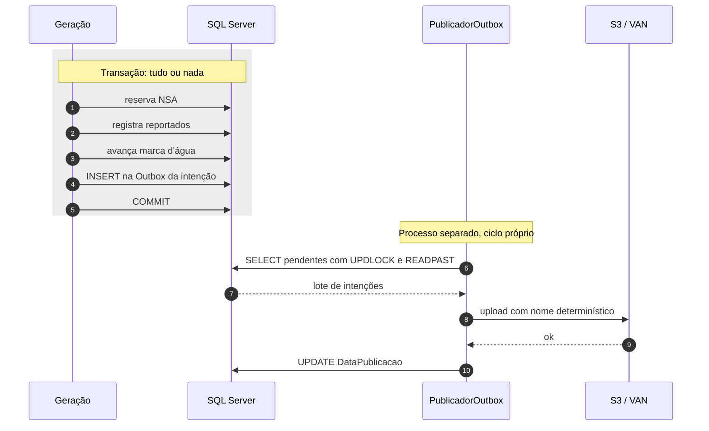

### 12.2 A tabela e o consumo

```sql
CREATE TABLE Conciliacao.Outbox
(
    OutboxID       BIGINT        IDENTITY(1,1) NOT NULL,
    TipoMensagem   VARCHAR(100)  NOT NULL,
    ChaveParticao  VARCHAR(50)   NOT NULL,   -- documento: preserva ordem por cliente
    Payload        NVARCHAR(MAX) NOT NULL,   -- metadados e REFERÊNCIA ao conteúdo (cap. 13)
    DataCriacao    DATETIME2(7)  NOT NULL CONSTRAINT DF_Outbox_Data DEFAULT SYSUTCDATETIME(),
    DataPublicacao DATETIME2(7)  NULL,
    Tentativas     INT           NOT NULL CONSTRAINT DF_Outbox_Tent DEFAULT 0,
    UltimoErro     VARCHAR(1000) NULL,

    CONSTRAINT PK_Outbox PRIMARY KEY CLUSTERED (OutboxID)
);

-- Índice filtrado: só o que está pendente. Fica pequeno mesmo com a
-- tabela grande, porque o filtro exclui tudo que já foi publicado.
CREATE INDEX IX_Outbox_Pendentes
    ON Conciliacao.Outbox (DataCriacao)
    WHERE DataPublicacao IS NULL;
```

```csharp
private const string SqlPendentes = """
    SELECT TOP (100) OutboxID, ChaveParticao, Payload
    FROM   Conciliacao.Outbox WITH (UPDLOCK, READPAST, ROWLOCK)
    WHERE  DataPublicacao IS NULL
    ORDER BY OutboxID;
    """;
```

`UPDLOCK` + `READPAST` permitem rodar várias réplicas do publicador: cada uma
pega um lote diferente em vez de bloquear as outras. As colunas `Tentativas` e
`UltimoErro` seguem a mesma política de retentativa e DLQ da seção 4.4 — uma
publicação que falha para sempre trava a fila **daquele cliente**, e só dele.

### 12.3 At-least-once e nome determinístico

Se o processo morrer entre o upload e o `UPDATE`, o arquivo é reenviado. Isso é
inevitável em sistema distribuído — o que você controla é o **efeito** do
reenvio. Com nome determinístico, reenviar sobrescreve o mesmo objeto em vez de
criar um segundo arquivo:

```
s3://retornos/02384871000181/02384871000181_20260830_000042.RET
                └ prefixo por cliente  └ o mesmo nome de 9.5
```

O nome é **exatamente** o da seção 9.5 — carrega documento, data e NSA — e o
prefixo por documento organiza o bucket e facilita a política de acesso do
capítulo 13. Como `(documento, data, nsa)` é único, uma segunda tentativa
escreve por cima do mesmo objeto: o cliente vê um arquivo, não dois.

### 12.4 Ordem de publicação

Se o cliente exige NSA em ordem crescente, o publicador não pode processar
paralelo dentro do mesmo cliente. Duas saídas:

```sql
-- Uma réplica por cliente, via hash do documento (a mecânica está em 16.3)
WHERE DataPublicacao IS NULL
  AND ABS(CHECKSUM(ChaveParticao)) % @totalReplicas = @indiceReplica
```

ou serializar com `sp_getapplock` por documento (seção 16.4).

### 12.5 Checkpoint

1. O upload funcionou e o `UPDATE DataPublicacao` falhou. O que acontece no
   próximo ciclo?
   *A intenção continua pendente, o arquivo é reenviado e sobrescreve o mesmo
   objeto. O cliente não percebe nada.*
2. Por que o publicador é um processo separado da geração?
   *Para que a publicação — que é I/O e pode falhar por motivos externos — não
   segure a transação que reservou o NSA.*
3. Duas réplicas do publicador pegam a mesma linha?
   *Não, por causa do `UPDLOCK` + `READPAST`. Mas a ordem por cliente exige o
   particionamento de 12.4.*

---

## 13. Dados sensíveis

Um arquivo de retorno carrega CPF e CNPJ, nomes, valores, agências e contas. Isso
é dado pessoal sob a LGPD e, em parte, sigilo bancário. O pipeline deste guia o
grava em três lugares: a linha crua no `StagingRetorno`, o conteúdo do arquivo no
caminho da outbox, e o objeto no S3. Nenhum dos três é seguro por padrão.

Este capítulo não substitui a orientação do seu jurídico e do seu time de
segurança — ele lista o que um desenvolvedor precisa decidir para não criar o
problema.

### 13.1 O conteúdo do arquivo não deve morar na outbox

A decisão mais fácil de tomar errado é gravar o arquivo inteiro no `Payload`
`NVARCHAR(MAX)` da outbox. Ela merece a mesma tabela de prós e contras que
decisões bem menores ganharam neste guia:

| | Arquivo no `Payload` | Referência no `Payload`, conteúdo no objeto |
|---|---|---|
| Transação | Simples: tudo commita junto | Exige gravar o objeto antes do commit |
| Log de transação | Um arquivo de 20 MB vira 40 MB de log (`NVARCHAR` usa 2 bytes por caractere ASCII) | Alguns bytes |
| Tamanho da tabela | Cresce com o volume de arquivos | Constante |
| Backup | Todo backup do banco leva os arquivos junto | Só metadados |
| Dado sensível | Texto claro dentro do banco de negócio, visível a qualquer `SELECT` | Concentrado no armazenamento com política própria |
| Reenvio | Direto | Precisa ler o objeto |

**A recomendação é a segunda coluna:** grave o conteúdo num objeto de trabalho
(bucket interno, com criptografia e ciclo de vida próprios) **antes** do commit, e
guarde no `Payload` só a referência, o NSA e o hash. A publicação copia do objeto
interno para o destino do cliente. Se o commit não acontecer, o objeto interno
vira lixo com TTL curto — e lixo é bem mais barato que um arquivo publicado sem
registro.

Se por alguma razão o conteúdo tiver que ficar no banco, use `VARBINARY(MAX)` em
vez de `NVARCHAR(MAX)`: o arquivo CNAB é ASCII e `NVARCHAR` dobra o tamanho de
graça.

### 13.2 O mínimo, em seis itens

| Item | O que fazer | Onde |
|---|---|---|
| **Criptografia em repouso** | TDE no banco; SSE-KMS no bucket, com chave gerenciada por você | Banco e S3 |
| **Acesso ao bucket** | Bloqueio de acesso público, política que restringe leitura ao papel do publicador e ao caminho daquele cliente | S3 |
| **Mascaramento em log** | Nunca logue linha crua nem documento inteiro. `***.456.789-**` basta para investigar | Todo o código |
| **Trilha de acesso** | Quem leu o quê: log de acesso do bucket e auditoria nas tabelas de staging | Infra |
| **Retenção com dois limites** | Um mínimo legal (guarde pelo menos) e um máximo (não guarde além) — os dois vêm do jurídico, não da engenharia | 5.4, 10.7 |
| **Ambientes não produtivos** | Massa anonimizada. Golden file de teste com CPF real é vazamento com backup automático | 18 |

Um detalhe de log que passa despercebido: a `LinhaOriginal` de 240 caracteres
contém tudo. Um `LogError` com a linha inteira dentro, num caminho de exceção que
"quase nunca acontece", coloca dado pessoal em texto claro no agregador de logs —
que costuma ter retenção, acesso e backup completamente diferentes dos do banco.

```csharp
// ERRADO
_log.LogError("Falha ao parsear: {Linha}", linha);

// CERTO: posição e tipo bastam para reproduzir com o arquivo em mãos
_log.LogError("Falha ao parsear arquivo {ArquivoId}, linha {Numero}, campo {Campo}.",
    arquivoId, numeroLinha, "ValorEfetivado");
```

### 13.3 Checkpoint

1. Por que `NVARCHAR(MAX)` é pior que `VARBINARY(MAX)` para conteúdo CNAB?
   *Porque o CNAB é ASCII e `NVARCHAR` guarda dois bytes por caractere: dobra
   tamanho de tabela, de log e de backup sem nenhum ganho.*
2. O golden file de teste veio de um arquivo real de produção. Qual é o problema?
   *Ele tem CPF e conta reais, e vai para o repositório, para a máquina de cada
   desenvolvedor e para todo backup. Anonimize antes.*
3. Qual é a retenção certa do staging?
   *A que satisfaz simultaneamente o mínimo legal e o máximo permitido — e é
   maior que o prazo de contestação (10.7). Não é uma escolha de engenharia
   sozinha.*

---

## 14. Reversões tardias: quando "pago" deixa de ser pago

A lição mais contraintuitiva do domínio:

> Uma transação liquidada e considerada final **pode ser revertida depois**, por
> decisão de um terceiro, fora do seu controle.

MED no PIX (contestação em até 80 dias), chargeback no cartão, estorno de
boleto: são instâncias do mesmo padrão arquitetural. É uma **saga** — nome que se
dá a uma transação distribuída que não pode ser desfeita com `ROLLBACK`, porque
já terminou e já produziu efeito no mundo. Em vez de desfazer, você registra uma
operação **compensatória** que anula o efeito da primeira. Aqui a compensação
chega semanas depois, disparada por quem não é você.

> **Cuidado com a palavra.** "Compensação", em banco, também nomeia o processo de
> *clearing* entre instituições. **Não é esse o sentido usado neste guia**: aqui,
> compensação é sempre o lançamento que anula outro. O glossário registra os dois
> significados separadamente, para você não trocá-los.

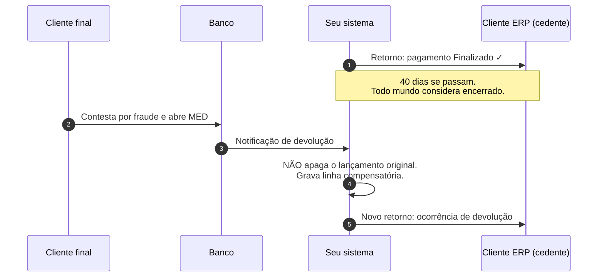

### 14.1 O que isso exige do modelo

**1. `ItemConciliado` é append-only.** Nunca `UPDATE`. A reversão é uma nova
linha apontando para a original:

```
ItemConciliadoID  Classificacao   ValorEfetivadoCent  CompensaItemID
----------------  --------------  ------------------  --------------
             100  1 Conciliado                938500            NULL
             250  6 Revertido                 938500             100   <- MED, 40 dias depois
```

A linha 250 usa a classificação **6 (`Revertido`)** do enum de 2.7 e aponta para a
original em `CompensaItemID`. É a presença dessa coluna, não um sinal negativo no
valor, que diz ao saldo o que subtrair:

```sql
-- Saldo real de um pagamento, considerando compensações
SELECT SUM(CASE WHEN CompensaItemID IS NULL THEN ValorEfetivadoCent
                ELSE -ValorEfetivadoCent END) AS SaldoCent
FROM   Conciliacao.ItemConciliado
WHERE  PagamentoID = @id;
```

O saldo é a soma; o histórico continua íntegro; a auditoria consegue explicar.

**2. `VersaoEstado` no pagamento** (seção 10.6), para que a segunda passagem pelo
mesmo status seja reportável. Sem ela, o cliente recebe a devolução e **nunca**
recebe a segunda liquidação.

**3. O De/Para marca as ocorrências de reversão** (`EhReversao`, seção 7.2), para
que a notificação seja transformada em linha compensatória em vez de nova
liquidação.

**4. Nenhum status é definitivo no código.** Evite `if (status == Finalizado)
return;` em qualquer caminho de leitura. O que parece encerrado pode reabrir — é
por isso que a máquina de estados de 9.1 tem a seta `Finalizado → Processando`.

Se você tirar uma única coisa deste documento, que seja esta: **modele o caminho
de volta antes de precisar dele.** Sistemas que não previram reversão são
reescritos, não corrigidos.

> **O fio condutor.** Quarenta dias depois, o pagador abre MED. A notificação
> chega com uma ocorrência marcada como `EhReversao`. O sistema grava a linha 250
> — `Revertido`, apontando para a linha 100 — e leva o pagamento de volta a
> `Processando`, com `VersaoEstado = 4`. O saldo do boleto passa a ser zero. Se e
> quando a contestação for negada e o valor voltar, um novo `Finalizado` com
> `VersaoEstado = 5` será reportável, porque a tripla `(boleto, 6, 5)` é diferente
> de `(boleto, 6, 3)`.

### 14.2 Checkpoint

1. Por que a reversão não é um `UPDATE` na linha original?
   *Porque destruiria o histórico: você perderia que houve liquidação, e a
   auditoria não conseguiria explicar o extrato.*
2. O saldo de um pagamento revertido e reliquidado é qual?
   *A soma das linhas: +938500, -938500, +938500 = 938500. Três linhas, um
   número.*
3. O que acontece se `VersaoEstado` não existir e chegar um MED?
   *O pagamento volta a `Finalizado` depois, o par `(pagamento, 6)` já existe, e
   a segunda liquidação nunca é informada ao cliente.*

---

## 15. Escalar com um único SQL Server

Com um servidor só para leitura e escrita, a escala vem de reduzir trabalho, não
de adicionar máquinas. Em ordem de retorno sobre esforço:

### 15.1 Os índices que sustentam o pipeline

Todos já foram criados nos capítulos correspondentes. Esta seção é o **mapa**,
não uma segunda declaração — rodar os `CREATE INDEX` de novo falharia, e ter duas
definições diferentes do mesmo índice espalhadas pelo texto é como se ganha um
bug de produção.

| Índice | Tabela | Serve a | Definido em |
|---|---|---|---|
| `IX_Boleto_Janela` | `Pagamento.Boleto` | A janela do parcial: o índice mais importante do sistema | **10.4** |
| `IX_Boleto_Remessa` | `Pagamento.Boleto` | Encerramento de remessa: foto de uma remessa inteira | abaixo |
| `UX_CPR_Par` | `ControlePagamentoReportado` | O anti-join do controle, com `INCLUDE` | **10.2** |
| `IX_Staging_Arquivo` (clusterizado) | `StagingRetorno` | `WHERE ArquivoID = @id`, a consulta central do casamento | **5.4** |
| `IX_Staging_ChaveForte` | `StagingRetorno` | Busca por identificador externo | **5.4** |
| `UX_ArqProc_ArquivoID` | `ArquivoProcessado` | Resolver o cliente a partir do arquivo | **5.3** |
| `UX_IC_Pagamento_Arquivo` | `ItemConciliado` | Rede de segurança contra casamento duplo | **6.10** |
| `IX_IC_Pendencias` | `ItemConciliado` | Fila de tratamento humano (filtrado) | **6.10** |
| `IX_Outbox_Pendentes` | `Outbox` | Fila de publicação (filtrado) | **12.2** |
| `IX_Mensagem_Pendentes` | `Fila.Mensagem` | Consumo da fila (filtrado) | **4.3** |
| `UX_MapaOcorrencia_Vigente` | `MapaOcorrencia` | Tradução vigente por banco e layout | **7.2** |

O único que ainda não apareceu:

```sql
-- Encerramento de remessa: todos os itens de uma remessa
CREATE INDEX IX_Boleto_Remessa
    ON Pagamento.Boleto (ArquivoID, NumeroLote)
    INCLUDE (CodigoStatus);
```

**Índice filtrado** é a ferramenta mais subestimada aqui: `WHERE DataPublicacao
IS NULL` faz o índice ter o tamanho da fila pendente, não da tabela histórica.
Quatro dos índices da tabela acima são filtrados, e é por isso que eles
continuam pequenos depois de anos.

### 15.2 RCSI: leitor não bloqueia escritor

**RCSI** é a sigla de *Read Committed Snapshot Isolation*. É um modo de
isolamento em que cada consulta enxerga uma foto consistente dos dados no
instante em que começou, em vez de disputar locks com quem está escrevendo.

```sql
ALTER DATABASE [SeuBancoDePagamentos] SET READ_COMMITTED_SNAPSHOT ON;
```

Por padrão, o SQL Server usa locks compartilhados na leitura, então um relatório
longo bloqueia a escrita do worker. Com RCSI, a leitura enxerga a versão
commitada da linha via `tempdb`, sem lock. O **`tempdb`** é o banco de trabalho
interno do SQL Server, onde ficam tabelas temporárias, ordenações grandes e — com
RCSI ligado — as versões antigas das linhas. Ele passa a ser um recurso crítico.

| | Sem RCSI | Com RCSI |
|---|---|---|
| Leitor x escritor | bloqueiam-se | não se bloqueiam |
| Custo | zero | +14 bytes por linha, carga no `tempdb` |
| Risco | `NOLOCK` espalhado pelo código | update conflict em transações longas |

Ligar RCSI costuma render mais que qualquer otimização de query neste tipo de
carga. Só exige `tempdb` bem dimensionado, de preferência em disco rápido.

E, com RCSI ligado, **remova os `WITH (NOLOCK)` do código**. `NOLOCK` manda o
SQL Server ler sem respeitar lock nenhum: é rápido porque enxerga inclusive
alterações ainda não confirmadas, que podem ser desfeitas em seguida. Essa
*leitura suja* em sistema financeiro produz números que não existiram em nenhum
instante.

### 15.3 Lotes pequenos, transações curtas

Um **lock** é a trava que o banco coloca sobre uma linha, página ou tabela para
impedir que dois processos alterem a mesma coisa ao mesmo tempo. Quanto mais
tempo a transação fica aberta, mais tempo as travas ficam de pé e mais gente
espera.

```csharp
// ERRADO: uma transação de 500 mil linhas.
// O log de transação (o arquivo onde o SQL Server registra toda alteração
// antes de aplicá-la, e que só é liberado no commit) cresce sem parar,
// os locks escalam para a tabela inteira,
// e um rollback leva mais tempo que o processamento.
using var tx = conexao.BeginTransaction();
foreach (var item in quinhentosMil) { ... }
tx.Commit();

// CERTO: lotes de alguns milhares, cada um com sua transação
foreach (var lote in itens.Chunk(5_000))
{
    using var tx = conexao.BeginTransaction();
    await ProcessarAsync(lote, tx, ct);
    tx.Commit();
}
```

**Escalonamento de lock** é o risco concreto: acima de cerca de 5 mil locks numa
tabela, o SQL Server troca todos por um lock de tabela e todo mundo para.

### 15.4 Particionamento

Quando `ControlePagamentoReportado` ou `ItemConciliado` passam de dezenas de
milhões de linhas, particione por mês:

```sql
CREATE PARTITION FUNCTION PF_Mensal (DATETIME2(7))
AS RANGE RIGHT FOR VALUES ('2026-01-01', '2026-02-01', '2026-03-01' /* ... */);

CREATE PARTITION SCHEME PS_Mensal
AS PARTITION PF_Mensal ALL TO ([PRIMARY]);
```

O ganho principal não é consulta, é **expurgo**: o `SWITCH` de partição troca o
*ponteiro* de uma partição inteira para outra tabela. Como nenhuma linha é
fisicamente movida, milhões de registros saem da tabela instantaneamente e sem
gerar log.

### 15.5 Quando o servidor único vira o limite

Sinais de que chegou a hora de mudar de arquitetura:

- CPU acima de 70% sustentado no horário de janela
- Espera predominante em `PAGEIOLATCH` ou `WRITELOG`. O SQL Server registra em
  que o processo ficou esperando: `PAGEIOLATCH` significa esperar página vir do
  disco para a memória, indício de RAM insuficiente; `WRITELOG` significa esperar
  a gravação no log de transação, indício de disco lento
- Bloqueio entre a carga **OLTP** (*online transaction processing*, o tráfego de
  transações curtas do dia a dia) e as consultas de conciliação, que são longas
- Janela de conciliação encostando no início da próxima

As saídas, em ordem de custo:

Um **Availability Group** é o recurso do SQL Server que mantém uma cópia do
banco sincronizada em outro servidor. Além de alta disponibilidade, ele permite
direcionar consultas somente leitura para a réplica, tirando essa carga do
servidor principal.

| Saída | Ganho | Custo |
|---|---|---|
| Ajustar índice e query | grande, sempre primeiro | horas de análise |
| Ligar RCSI | remove contenção leitor/escritor | `tempdb` |
| Mover staging para outro banco no mesmo servidor | isola I/O e backup | pouco |
| Réplica somente leitura via **Availability Group** para relatórios | tira leitura do primário | licença, latência |
| Particionar | expurgo barato | complexidade de manutenção |
| Separar o banco de conciliação em outra instância | isolamento real | operação, licença |

Note que **nada disso muda o código** se as etapas já estiverem separadas por
fila e o acesso a dados estiver atrás de repositórios. Essa é a real vantagem do
desenho em quatro etapas: ele adia a decisão de infraestrutura.

---

## 16. Concorrência: o NSA é o gargalo

O que limita a paralelização não é CPU, é o número sequencial. Duas instâncias
gerando arquivo para o mesmo cliente ao mesmo tempo produzem NSA duplicado, e o
cliente rejeita o arquivo.

### 16.1 A corrida, desenhada

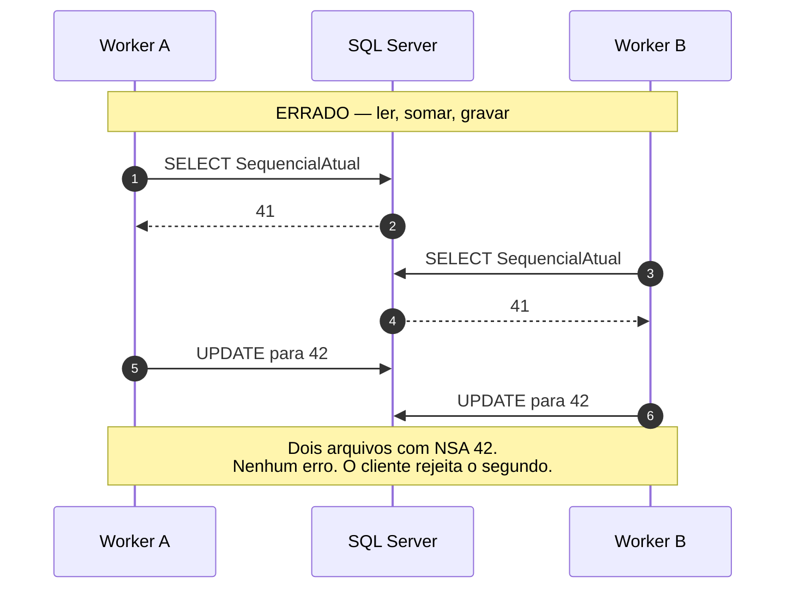

O intervalo entre o `SELECT` e o `UPDATE` é a janela da corrida, e ele é pequeno
o bastante para que o problema **não apareça em teste** e apareça no primeiro
pico de produção. A versão correta elimina a janela:

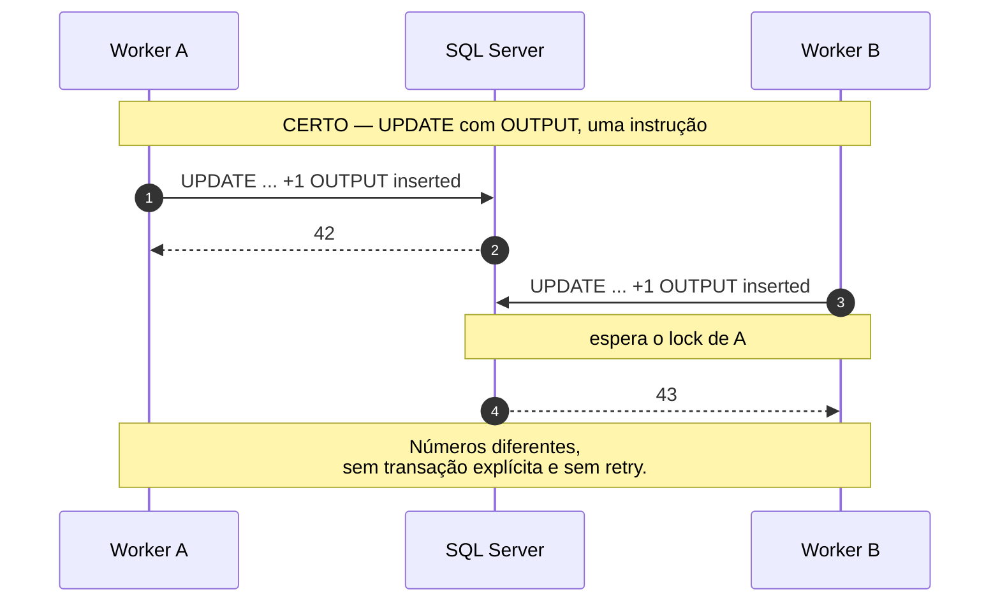

### 16.2 Reserva atômica

```sql
-- CERTO: uma instrução, atômica.
-- Direcao = 'T' porque remessa e retorno têm sequências independentes (2.5).
UPDATE Pagamento.SequencialArquivo
SET    SequencialAtual = SequencialAtual + 1,
       DataAtualizacao = SYSUTCDATETIME()
OUTPUT inserted.SequencialAtual
WHERE  Documento = @documento
  AND  Direcao   = 'T';
```

```csharp
// ERRADO: ler, somar, gravar. Perde a corrida silenciosamente.
var atual = await LerSequencialAsync(documento);
await GravarSequencialAsync(documento, atual + 1);
return atual + 1;
```

A cláusula `OUTPUT` devolve, na mesma instrução, os valores que o `UPDATE`
acabou de gravar (a mecânica das tabelas virtuais `inserted`/`deleted` está em
4.3). Assim o incremento e a leitura do novo número acontecem num único comando
atômico: duas instâncias concorrentes recebem números diferentes, sem transação
explícita e sem retry.

Se a linha não existir, o comando não retorna nada. Falhar aqui é melhor que
gerar NSA zero:

```csharp
return resultado is null or DBNull
    ? throw new InvalidOperationException($"Sem sequencial cadastrado para {documento}.")
    : Convert.ToInt64(resultado);
```

### 16.3 Particionamento do trabalho por cliente

A unidade natural de paralelismo é o **documento do cliente**: paralelize entre
clientes, serialize dentro de cada um.

```sql
-- CHECKSUM devolve um inteiro derivado do texto. O resto da divisão
-- distribui os clientes entre as réplicas de forma estável: o mesmo
-- documento cai sempre na mesma réplica.
WHERE DataFim IS NULL
  AND ABS(CHECKSUM(ChaveParticao)) % @totalReplicas = @indiceReplica
```

Com broker externo, o equivalente é SQS FIFO com `MessageGroupId` = documento: o
serviço garante que duas instâncias nunca peguem o mesmo grupo, e paraleliza
entre grupos automaticamente.

**A contrapartida operacional** está em 4.4: com o trabalho particionado por
cliente, uma mensagem venenosa não trava a fila inteira — trava aquele cliente, e
só ele. É melhor do que travar todos, e é pior de perceber.

### 16.4 Lock de aplicação como rede de segurança

`sp_getapplock` cria um lock sobre um nome arbitrário que você escolhe, em vez
de sobre uma linha ou tabela. Serve para dizer "só um processo por vez pode
mexer neste cliente", mesmo que os comandos toquem tabelas diferentes.

```sql
DECLARE @rc INT;
EXEC @rc = sp_getapplock
     @Resource     = @documento,     -- o recurso é o cliente
     @LockMode     = 'Exclusive',
     @LockOwner    = 'Transaction',
     @LockTimeout  = 5000;

IF @rc < 0
BEGIN
    -- Outra instância está gerando retorno para este cliente.
    -- Não é erro: devolva a mensagem para a fila e tente depois.
    --
    -- Severidade 16 = erro do usuário, corrigível pelo chamador. É a faixa
    -- que o cliente .NET converte em SqlException sem derrubar a conexão
    -- (severidades 20+ fazem isso). O 1 seguinte é o "state", um número livre
    -- que ajuda a identificar QUAL RAISERROR disparou quando o mesmo texto
    -- aparece em vários pontos.
    RAISERROR('Geração já em andamento para %s', 16, 1, @documento);
    RETURN;
END
```

O lock é liberado no commit ou rollback. Use as duas defesas juntas: o
particionamento evita a corrida, o applock protege contra erro de configuração
(uma réplica subindo com o índice errado, por exemplo).

---

## 17. Observabilidade

Três métricas valem mais que um dashboard inteiro:

**1. Taxa de casamento por cliente e por dia.** Quando cai, quase nunca é dado
ruim do cliente: é layout do banco que mudou, ou ocorrência nova sem tradução
(7.4). Alerte em queda **relativa** (contra a média dos últimos 7 dias), não em
valor absoluto.

```sql
SELECT ClienteDocumento,
       CAST(DataCriacao AS date) AS Dia,
       COUNT(*)                                                    AS Total,
       SUM(CASE WHEN Classificacao = 1 THEN 1 ELSE 0 END)          AS Conciliados,
       CAST(SUM(CASE WHEN Classificacao = 1 THEN 1.0 ELSE 0 END) / COUNT(*) AS decimal(5,4)) AS Taxa
FROM   Conciliacao.ItemConciliado
WHERE  DataCriacao >= DATEADD(day, -7, SYSUTCDATETIME())
GROUP BY ClienteDocumento, CAST(DataCriacao AS date)
ORDER BY Taxa;
```

**2. Idade da divergência mais antiga não tratada.** Divergência que envelhece
vira prejuízo. É o número que deve estar na parede da operação.

**3. Profundidade da outbox.** Se cresce sem parar, a publicação quebrou e os
clientes estão sem retorno mesmo com tudo verde nos outros gráficos.

Quatro alertas que este guia introduziu e que valem estar na mesma tela:

- **Ocorrências desconhecidas** nos últimos dias (consulta de 7.5)
- **Horizonte do calendário** de dias úteis (consulta de 8.2)
- **Remessas presas** além do prazo em dias úteis (9.3)
- **Linhas novas na DLQ** (4.4) — cada uma é incidente, não métrica

Além disso, log estruturado por item, com `arquivoId`, `pagamentoId`,
`chaveUsada`, `classificacao`, `diferenca` e `nsa`. No dia da dúvida, é isso que
responde — e nunca com a linha crua junto (13.2).

```csharp
// Nomes de propriedade estáveis: são a chave da consulta no dia do incidente.
// Conciliados, Total e TaxaCasamento são propriedades de ResultadoConciliacao (2.7).
_log.LogInformation(
    "Conciliação {ArquivoId}: {Conciliados}/{Total} ({Taxa:P1}) para {Cliente}",
    arquivoId, resultado.Conciliados, resultado.Total, resultado.TaxaCasamento, documento);
```

---

## 18. Testes

O motor ser função pura (6.5) é o que torna isso barato: sem banco, sem relógio,
sem *fixture*.

```csharp
[Fact]
public void Divergencia_de_valor_dentro_da_tolerancia_concilia()
{
    var interno = new ItemInterno(Guid.NewGuid(), "123", "ID-1", null,
        new DateOnly(2026, 8, 20), Dinheiro.DeReais(100.00m), CodigoStatus: 2);
    var externo = new ItemExterno("123", "ID-1", null,
        new DateOnly(2026, 8, 20), Dinheiro.DeReais(100.01m), "06", NumeroLinha: 1);

    var motor = new MotorDeCasamento(PoliticaTolerancia.Estrita);
    var r = motor.Casar([interno], [externo]);

    Assert.Equal(ClassificacaoConciliacao.Conciliado, r.Itens.Single().Classificacao);
    Assert.Equal(1, r.Itens.Single().Diferenca.Centavos);
}

[Fact]
public void Ocorrencia_repetida_nao_casa_duas_vezes_com_o_mesmo_pagamento()
{
    var interno = new ItemInterno(Guid.NewGuid(), "123", "ID-1", null,
        new DateOnly(2026, 8, 20), Dinheiro.DeReais(100.00m), CodigoStatus: 2);
    var externo = new ItemExterno("123", "ID-1", null,
        new DateOnly(2026, 8, 20), Dinheiro.DeReais(100.00m), "06", NumeroLinha: 1);

    var r = new MotorDeCasamento(PoliticaTolerancia.Estrita)
        .Casar([interno], [externo, externo]);

    Assert.Equal(1, r.Itens.Count(i => i.Classificacao == ClassificacaoConciliacao.Conciliado));
    Assert.Equal(1, r.Itens.Count(i => i.Classificacao == ClassificacaoConciliacao.Duplicado));
}

[Fact]
public void Interno_sem_ocorrencia_vira_so_interno()
{
    var interno = new ItemInterno(Guid.NewGuid(), "123", "ID-1", null,
        new DateOnly(2026, 8, 20), Dinheiro.DeReais(100.00m), CodigoStatus: 2);

    var r = new MotorDeCasamento(PoliticaTolerancia.Estrita).Casar([interno], []);

    Assert.Equal(ClassificacaoConciliacao.SoInterno, r.Itens.Single().Classificacao);
}
```

Três tipos de teste que pagam o investimento:

**Golden file.** Um *golden file* (ou *arquivo de ouro*) é um par guardado no
repositório: uma entrada real — aqui, um arquivo de retorno de verdade,
**anonimizado** (13.2) — e a saída que o sistema deve produzir para ela. O teste
roda a entrada e compara byte a byte com a saída guardada. É o que pega mudança
de layout do banco antes do cliente reclamar, e o que dá segurança para mexer no
De/Para do capítulo 7. Quando a mudança é intencional, você atualiza o arquivo
esperado — e o diff dele vira parte da revisão de código.

**Teste de propriedade.** Em vez de escrever um caso com valores fixos, você
declara uma **propriedade que deve valer para qualquer entrada** e deixa a
biblioteca (FsCheck, por exemplo) gerar centenas de massas aleatórias tentando
quebrá-la. Serve exatamente para o tipo de bug que ninguém pensa em escrever como
caso de teste. Propriedades naturais deste motor:

- nenhum interno é consumido duas vezes;
- a soma de conciliados, divergentes, só-internos, só-externos e duplicados é
  igual ao total de itens produzidos;
- reordenar as listas de entrada não muda a classificação de nenhum item — é o
  que prova que o desempate de 6.6 é mesmo estável.

**Comparação entre implementações.** Se adotar o motor em C# e o set-based (6.8),
rode a mesma massa nos dois e compare as cinco classificações. Sem esse teste,
elas divergem sozinhas em cerca de seis meses. Esse teste só é possível porque as
duas implementações produzem as **mesmas cinco classificações**, inclusive
`Duplicado` — se uma delas descartasse as repetidas, ele falharia sempre.

---

## 19. Anti-padrões

| Anti-padrão | Por que quebra |
|---|---|
| `double` ou `float` para dinheiro | Divergência falsa por arredondamento binário |
| `float` na coluna de valor, e `ROUND(valor * 100)` no SQL | O mesmo erro, agora dentro do banco e mais difícil de enxergar |
| Casar por valor e data | Dois pagamentos iguais casam trocados |
| `bool Conciliado` | Perde as cinco classificações; a operação fica cega |
| `ToDictionary` para indexar o lado interno | Explode na primeira chave repetida, que é caso normal |
| Predicado de junção com `OR` em tabela grande | Derruba o seek; o set-based fica mais lento que o loop que ele substituiu |
| `UPDATE` no resultado da conciliação | Destrói o histórico; reversão fica inexplicável |
| Casamento não idempotente | `at-least-once` duplica as pendências em silêncio |
| Ignorar código de ocorrência desconhecido | Perde ocorrência sem deixar rastro; o sintoma vira "queda de taxa sem causa" |
| Contar prazo de negócio em dias corridos | Alerta de remessa presa no domingo; alerta que sempre grita deixa de ser lido |
| Publicar antes de commitar | Cliente com arquivo que o sistema desconhece |
| Ler-somar-gravar o NSA | Corrida silenciosa, sequencial duplicado |
| Sequência de NSA única para remessa e retorno | Buraco na numeração dos dois lados, impossível de separar depois |
| PK clusterizada em GUID de alta escrita | Page split e fragmentação crescentes |
| `INSERT` em loop | Um round-trip por linha |
| `WITH (NOLOCK)` para "resolver lentidão" | Leitura suja; números que nunca existiram |
| Reportar estados transitórios | Cliente monta relatório sobre estado que vai mudar |
| Suprimir por `(pagamento, status)` sem versão | A segunda liquidação depois de um MED nunca chega ao cliente |
| Confiar que a fila entrega uma vez | SQS e afins são at-least-once por desenho |
| Fila sem máximo de tentativas nem DLQ | Uma mensagem venenosa trava um cliente inteiro, com tudo verde no painel |
| Assumir que "pago" é final | MED e chargeback chegam depois |
| Não recalcular o trailer do parcial | Arquivo rejeitado na leitura do cliente |
| Dois esquemas de nome de arquivo | O nome que o cliente vê e o que garante idempotência divergem no primeiro incidente |
| Arquivo inteiro em `NVARCHAR(MAX)` na outbox | Log de transação, backup e dado pessoal em texto claro, tudo de uma vez |
| Linha crua do CNAB em log de erro | Dado pessoal no agregador de logs, com retenção e acesso que ninguém revisou |

---

## 20. Roteiro incremental e virada

### 20.1 Se fosse construir do zero

| # | Entrega | Esforço | Valor |
|---|---|---|---|
| 1 | Tipos do domínio (2.7) + `MotorDeCasamento` + testes. Sem banco, sem fila | 1 dia | A regra fica correta e provada |
| 2 | Staging + persistência do resultado, um worker síncrono | 2 dias | Já concilia de verdade |
| 3 | Idempotência por hash + índice único + `DELETE` por arquivo | ½ dia | Reprocessar deixa de dar medo |
| 4 | De/Para de ocorrências, com a regra do código desconhecido | 1 dia | Para de perder ocorrência em silêncio |
| 5 | Separar geração, com `ReservadorNsa` atômico | 1 dia | Fim da corrida de NSA |
| 6 | `ControlePagamentoReportado` + marca d'água | 1 dia | Parcial sem repetição |
| 7 | Outbox + publicador | 1 dia | Fim do "publicou e não commitou" |
| 8 | Calendário de dias úteis + régua de prazo | 1 dia | "Só interno" deixa de ser alerta falso |
| 9 | Retentativa, DLQ e alerta de mensagem morta | ½ dia | Um cliente parado deixa de passar despercebido |
| 10 | Filas de verdade, particionamento por cliente | 2 dias | Escala horizontal |
| 11 | Índices, RCSI, retenção | 1 dia | Escala vertical |
| 12 | Set-based | quando medir | Volume alto |
| 13 | Compensação e `VersaoEstado` | quando o 1º MED chegar | Correção contábil |

Os passos 1 a 4 já entregam valor sozinhos e cabem numa semana e meia. Do 5 em
diante é escala e robustez, e escala prematura custa mais do que rende.

A exceção é o passo 13: **deixe a coluna `VersaoEstado` prevista desde o começo**,
mesmo sem usá-la. Adicionar depois, com a tabela grande, é bem mais caro.

### 20.2 A virada num sistema que já roda

O roteiro acima assume terreno limpo. Se o sistema já está em produção e já manda
retorno para clientes, o primeiro deploy tem um risco específico e previsível:

> Com `ControlePagamentoReportado` vazio e marca d'água nula, o primeiro parcial
> considera **toda a base** como não reportada e manda o histórico inteiro para o
> cliente.

Um arquivo com quatro anos de pagamentos derruba o parser do cliente, e, se não
derrubar, é pior: ele contabiliza tudo de novo. Quatro perguntas, respondidas
antes de subir:

**1. Qual é a marca d'água inicial?** A resposta correta quase nunca é nula.
Inicialize com o instante do deploy — ou com o início do dia — e assuma
explicitamente que o que aconteceu antes não será reportado por este caminho:

```sql
INSERT INTO Pagamento.ControleJanelaRetorno (ClienteDocumento, UltimoInstanteReportado)
SELECT DISTINCT ClienteDocumento, SYSUTCDATETIME()
FROM   Pagamento.Boleto
WHERE  NOT EXISTS (SELECT 1 FROM Pagamento.ControleJanelaRetorno c
                   WHERE c.ClienteDocumento = Pagamento.Boleto.ClienteDocumento);
```

**2. E os pagamentos já finalizados e nunca reportados?** Se houver de verdade um
conjunto assim, ele merece **uma carga dirigida**, não o primeiro parcial: um
arquivo por cliente, gerado fora do horário, revisado antes de publicar, e
combinado com o cliente. Tratá-lo como "o parcial vai pegar" é como o acidente
acontece.

**3. Como popular `ControlePagamentoReportado` para o histórico?** Se o sistema
antigo tem registro de qual arquivo levou o quê, importe. Se não tem, a carga
inicial é o próprio corte: grave a tripla atual de todos os pagamentos já
terminais, para que eles nunca mais sejam considerados novos.

```sql
-- Corte: tudo que já é terminal hoje é considerado já reportado.
INSERT INTO Pagamento.ControlePagamentoReportado (PagamentoID, CodigoStatus, VersaoEstado, Nsa)
SELECT BoletoID, CodigoStatus, VersaoEstado, NULL   -- Nsa nulo = veio da carga inicial
FROM   Pagamento.Boleto
WHERE  CodigoStatus IN (3, 4, 5, 6);
```

O `Nsa` nulo é intencional e vale documentar: ele distingue, para sempre, "foi
informado no arquivo X" de "veio da carga de virada".

**4. Qual é o NSA inicial de cada cliente?** Continue a sequência que o cliente já
conhece, não comece do 1. Um retorno com NSA 1 depois de o cliente ter recebido o
1.284 é rejeitado, e o suporte não vai adivinhar por quê.

**Faça a virada com um cliente só.** Escolha o de menor volume, acompanhe dois
ciclos completos — incluindo um fechamento diário — e só então libere os demais.
O custo de errar aqui é um arquivo errado na mão do cliente, e esse é o tipo de
erro que se conserta por telefone, não por deploy.


---

## 21. Glossário

Em ordem alfabética, ignorando acentos e a formatação de código.

| Termo | Significado |
|---|---|
| **Anti-join** | Consulta que devolve o que NÃO tem correspondente (`NOT EXISTS`) |
| **At-least-once** | Garantia de entrega que pode duplicar; exige consumidor idempotente |
| **Availability Group** | Réplica sincronizada do banco; permite leitura fora do primário |
| **Bacen** | Banco Central do Brasil; opera a infraestrutura em que a liquidação acontece |
| **`BackgroundService`** | Classe base do .NET para um processo em segundo plano com um laço próprio |
| **Backoff exponencial** | Espera entre retentativas que dobra a cada falha, com teto e ruído aleatório |
| **Boleto** | Documento com código de barras que o pagador quita em qualquer banco |
| **Broker** | Serviço dedicado a guardar e entregar mensagens (SQS, RabbitMQ, Kafka) |
| **Buffer pool** | Memória RAM onde o SQL Server mantém as páginas mais usadas |
| **Calendário de dias úteis** | Tabela de feriados e fins de semana por praça; base de todo prazo de negócio |
| **Cedente** | Empresa cliente que emite a remessa |
| **Chargeback** | Contestação de compra no cartão; reverte transação já liquidada |
| **Chave composta** | Casamento por `cliente + nosso número`, com desempate por data |
| **Chave forte** | Identificador que as duas partes acordaram carregar; casamento 1:1 |
| **Checksum** | Valor derivado dos dados que permite detectar perda ou alteração |
| **Classificação de conciliação** | O veredicto do motor: 1 conciliado, 2 divergência, 3 só interno, 4 só externo, 5 duplicado, 6 revertido. Não confundir com `CodigoStatus` |
| **CNAB** | Centro Nacional de Automação Bancária; por extensão, o formato de arquivo de posição fixa |
| **`CodigoStatus`** | O estado do pagamento: 1 a 8, na máquina de estados de 9.1. Não confundir com a classificação de conciliação |
| **Compensação (saga)** | Lançamento que anula o efeito de um anterior, usado quando não é possível dar `ROLLBACK`. **É neste sentido que o guia usa a palavra** |
| **Compensação bancária (*clearing*)** | Processo pelo qual os bancos acertam contas entre si antes da liquidação. Homônimo do anterior; **não** é o sentido usado neste guia |
| **CPU-bound** | Etapa limitada por processamento, não por espera de I/O |
| **CTE** | Bloco `WITH ... AS`; consulta nomeada válida só naquele comando |
| **D+0, D+1** | Prazo de liquidação em dias úteis a partir do envio |
| **De/Para de ocorrências** | Tabela que traduz código do banco em status interno e vice-versa, versionada por banco e layout |
| **DLQ** | *Dead letter queue*; fila para mensagens que falharam repetidamente |
| **Duplicata / título** | O documento de cobrança que o cedente emite contra o sacado e registra no banco |
| **EndToEndId** | Identificador único que acompanha uma transação PIX de ponta a ponta |
| **ERP** | Sistema de gestão do cedente; produz a remessa e consome o retorno |
| **Escalonamento de lock** | Troca de milhares de locks de linha por um lock de tabela; para todo mundo |
| **Estorno** | Devolução acordada entre as partes de um valor já liquidado |
| **Fechamento diário** | Retorno em horário fixo com a foto do dia; pode conter pendências |
| **FIFO** | *First in, first out*: a primeira mensagem a entrar é a primeira a sair |
| **FSx** | Serviço de compartilhamento de arquivos em rede da AWS, acessado como pasta comum |
| **Função pura** | Função cujo resultado depende só dos argumentos e que não altera nada fora de si |
| **Golden file** | Par entrada real anonimizada + saída esperada, guardado no repositório como teste |
| **GUID** | Identificador de 16 bytes gerado aleatoriamente; `uniqueidentifier` no SQL Server |
| **Hash** | Assinatura de tamanho fixo derivada do conteúdo; impressão digital do arquivo |
| **Header / Trailer** | Linha de abertura e linha de fechamento de um arquivo ou lote |
| **I/O-bound** | Etapa limitada por espera de disco, rede ou banco |
| **Idempotência** | Repetir a operação produz o mesmo resultado que executá-la uma vez |
| **Índice clusterizado** | O índice que **é** a tabela, ordenada fisicamente pela chave |
| **Índice filtrado** | Índice com `WHERE`; indexa só o subconjunto que interessa |
| **Janela** | Intervalo de tempo que uma execução do parcial cobre |
| **LGPD** | Lei Geral de Proteção de Dados; alcança CPF, nomes e contas que trafegam nos arquivos |
| **Liquidação** | Momento em que o dinheiro muda de mãos de fato |
| **Log de transação** | Arquivo onde o SQL Server registra toda alteração antes de confirmá-la |
| **Lote** | Agrupamento de pagamentos por tipo de serviço e forma de lançamento dentro de um arquivo CNAB |
| **Marca d'água** | Instante até o qual você já reportou; base da janela do parcial |
| **MD5** | Função de hash de 128 bits, 32 caracteres em hexadecimal; aqui usada só para deduplicar |
| **MED** | Mecanismo Especial de Devolução do PIX; permite contestar por fraude em até 80 dias |
| **Mensagem venenosa** | Mensagem que falha sempre; sem DLQ, trava a partição em que está |
| **`MessageGroupId`** | Campo do SQS FIFO que define dentro de qual grupo a ordem é preservada |
| **`NOLOCK`** | Hint que lê sem respeitar locks; enxerga dados não confirmados |
| **Nosso número** | Identificador que o banco atribui a um título de cobrança |
| **NSA** | Número sequencial do arquivo, por cliente e direção; detecta arquivo faltando ou repetido |
| **Ocorrência** | Código que descreve o desfecho de um item no retorno |
| **OLTP** | Carga de transações curtas do dia a dia, oposta à carga analítica |
| **Outbox** | Padrão que grava a intenção de publicar junto com o dado, na mesma transação |
| **`OUTPUT inserted`** | Cláusula que devolve, na mesma instrução, os valores que o comando acabou de gravar |
| **Page split** | Divisão de uma página de 8 KB cheia; caro e gerador de fragmentação |
| **Parcial** | Retorno incremental: só o que mudou desde a última janela |
| **PIX** | Sistema de transferência instantânea do Bacen; funciona 24 horas por dia, todos os dias |
| **RCSI** | *Read Committed Snapshot Isolation*; leitor não bloqueia escritor |
| **`READPAST` / `UPDLOCK`** | Hints que fazem o consumidor pular linhas travadas e segurar as suas; é o que permite várias réplicas na mesma fila |
| **Régua de prazo** | Regra que decide se um item "só interno" está dentro do prazo ou atrasado |
| **Remessa** | Arquivo que o cliente envia ao banco com instruções |
| **Retorno** | Arquivo que o banco devolve com o desfecho de cada item |
| **Round-trip** | Uma ida e volta completa pela rede até o banco |
| **`rowversion`** | Contador binário sempre crescente, incrementado a cada alteração da linha |
| **S3** | Armazenamento de objetos da AWS |
| **Saga** | Padrão de transação distribuída com compensação em vez de rollback |
| **Seek / Scan** | Busca direta na posição certa do índice / varredura completa |
| **Segmento** | Linha de detalhe (A, B, C) com um pedaço dos dados de um pagamento |
| **Service Broker** | Sistema de filas embutido no próprio SQL Server |
| **`sp_getapplock`** | Lock sobre um nome arbitrário; serializa por recurso lógico, não por linha |
| **`Span` / `ReadOnlySpan`** | Janela sobre memória existente; lê um trecho sem alocar string nova |
| **`SqlBulkCopy`** | API do .NET que usa o protocolo de carga em massa do SQL Server |
| **SQS** | Fila gerenciada da AWS |
| **Staging** | Área de dados crus, antes da aplicação de regra de negócio |
| **`SWITCH` de partição** | Troca de ponteiro que move uma partição inteira sem copiar linhas |
| **T-SQL** | Transact-SQL, o dialeto de SQL do SQL Server |
| **TED** | Transferência entre bancos em dia útil, com horário de corte |
| **`tempdb`** | Banco de trabalho interno do SQL Server; crítico com RCSI ligado |
| **Teste de propriedade** | Teste que declara uma invariante e deixa a biblioteca gerar massa aleatória para quebrá-la |
| **`TimeProvider`** | Abstração de relógio do .NET 8+; substitui `DateTime.UtcNow` e torna a regra de tempo testável |
| **Totalizadores** | Quantidade de registros e somatório de valores gravados no trailer |
| **TVP** | *Table-Valued Parameter*; envia uma tabela inteira num parâmetro |
| **TxID** | Identificador da cobrança PIX, definido por quem a cria e devolvido em toda notificação daquela cobrança |
| **VAN** | Empresa intermediária que transporta arquivos entre banco e cliente |
| **Virada (*cutover*)** | Primeiro deploy num sistema que já roda; exige marca d'água e NSA iniciais |
| **Webhook** | Chamada HTTP que a contraparte faz ao seu sistema para notificar um evento |
| **Worker** | Processo em segundo plano que consome trabalho de uma fila |
