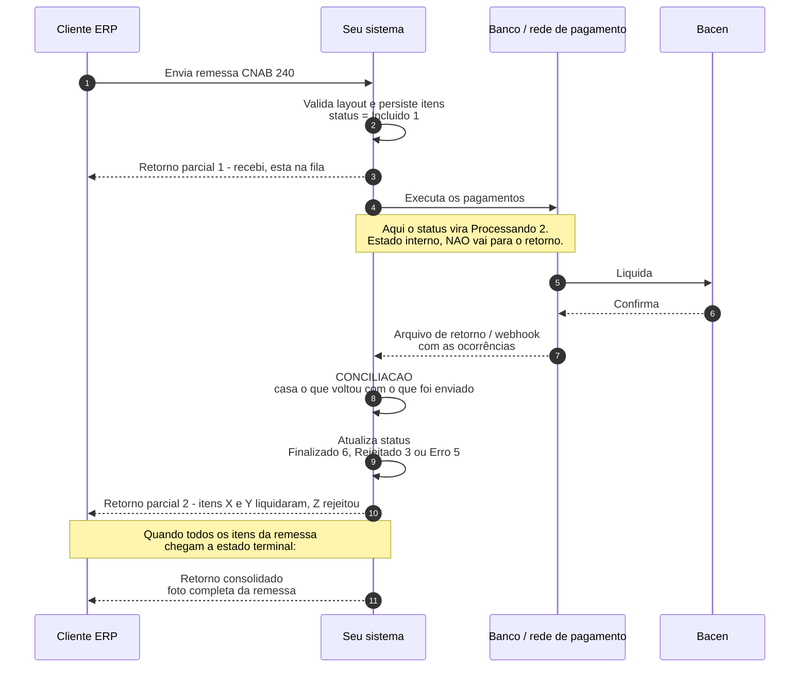
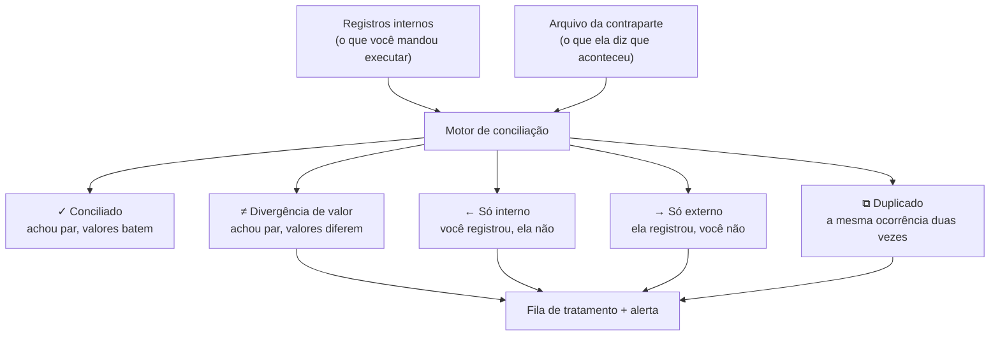
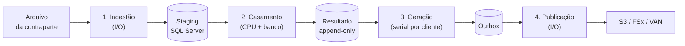
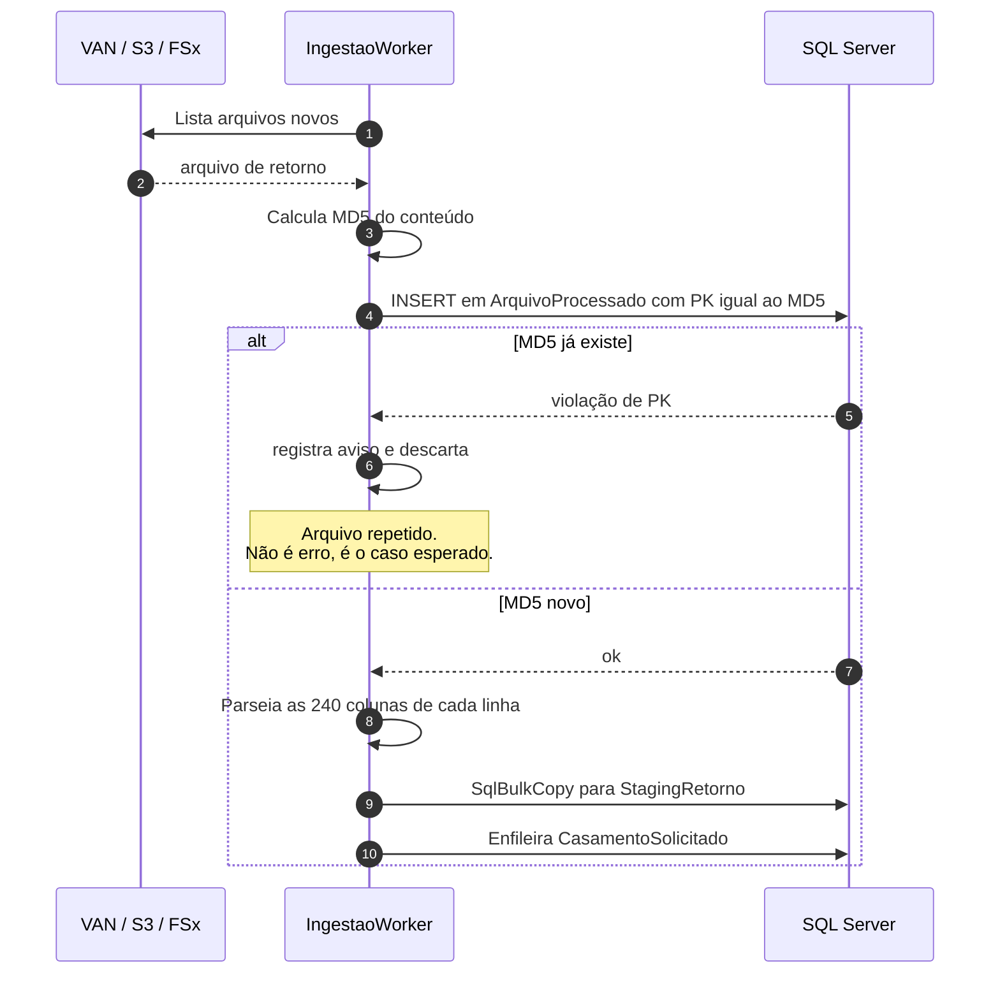
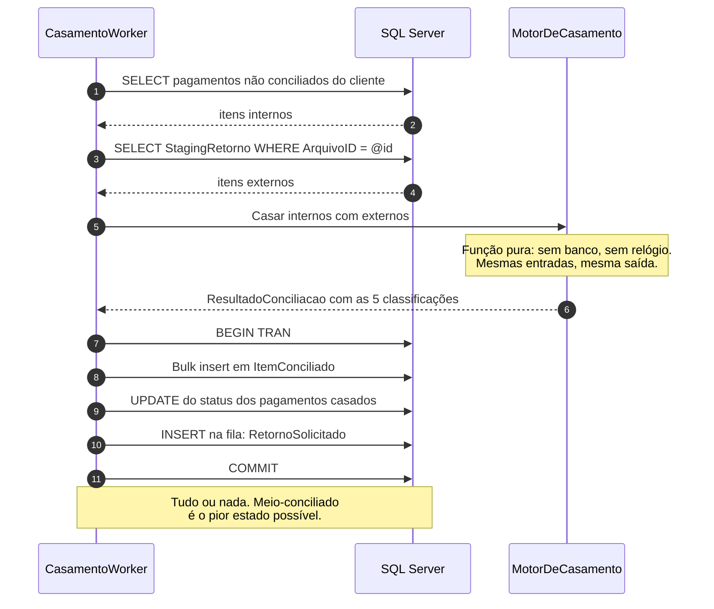
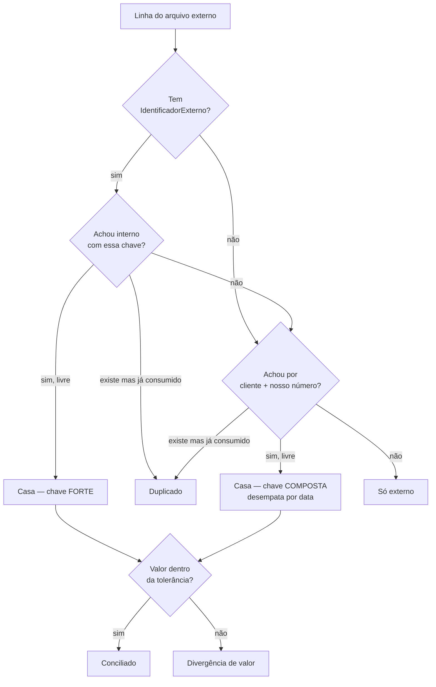
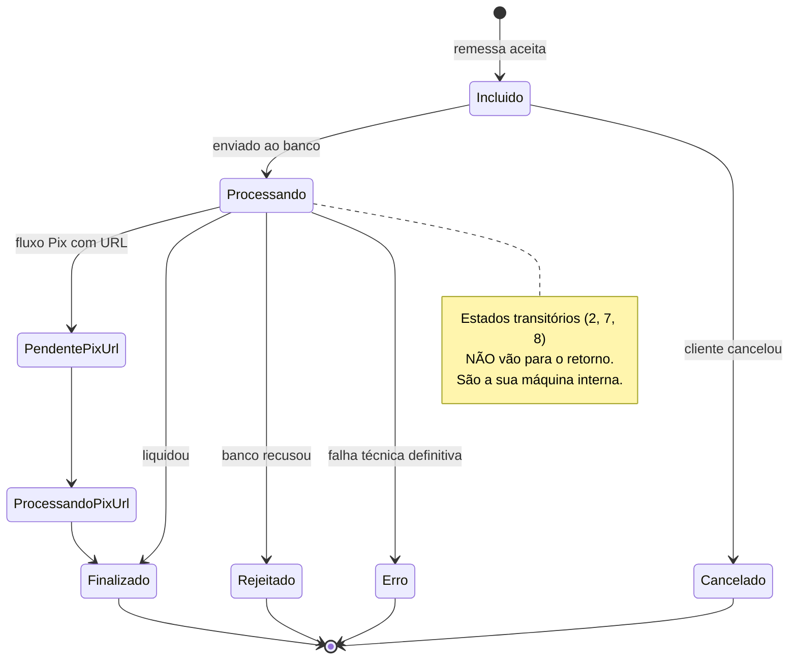
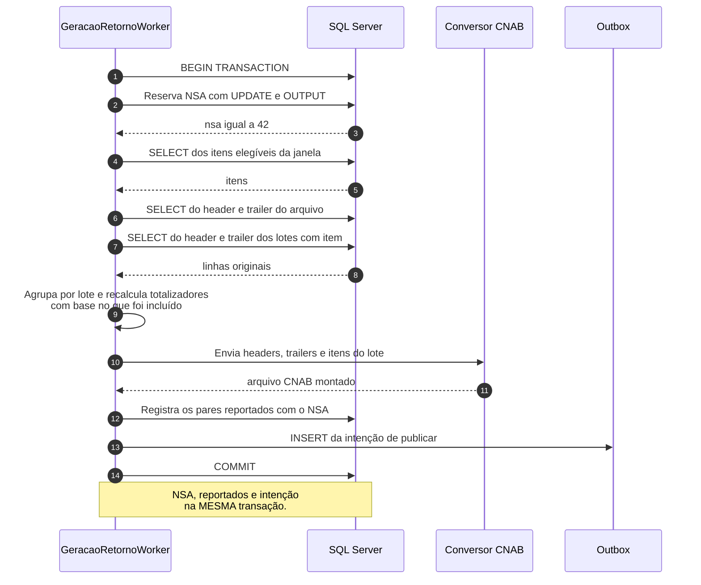
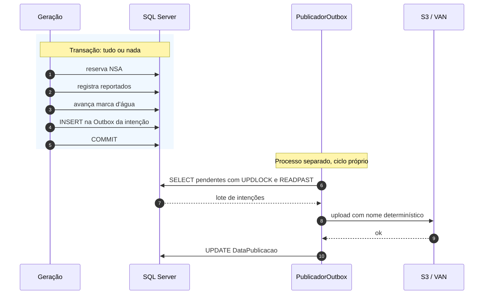
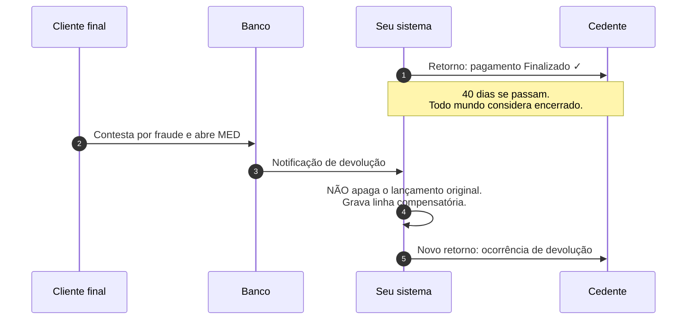

# Conciliação e retorno de pagamentos: do zero ao escalável

**Público-alvo:** desenvolvedor .NET que nunca trabalhou com meios de pagamento.
Nada aqui pressupõe conhecimento prévio de CNAB, liquidação ou conciliação.

**Contexto técnico assumido:** um único SQL Server (leitura e escrita), .NET,
workers em contêiner, um conversor de CNAB já existente que recebe os
header/trailer e os dados de pagamento e devolve o arquivo montado.

---

## Sumário

1. [O problema em uma frase](#1-o-problema-em-uma-frase)
2. [O domínio em dez minutos](#2-o-domínio-em-dez-minutos)
3. [O que é conciliação e por que ela existe](#3-o-que-é-conciliação-e-por-que-ela-existe)
4. [Panorama da arquitetura](#4-panorama-da-arquitetura)
5. [Etapa 1 — Ingestão](#5-etapa-1--ingestão)
6. [Etapa 2 — Casamento](#6-etapa-2--casamento)
7. [Etapa 3 — Estados: o que reportar](#7-etapa-3--estados-o-que-reportar)
8. [Controle do que já foi informado](#8-controle-do-que-já-foi-informado)
9. [Etapa 4 — Geração do retorno](#9-etapa-4--geração-do-retorno)
10. [Etapa 5 — Publicação e o padrão outbox](#10-etapa-5--publicação-e-o-padrão-outbox)
11. [Reversões tardias: quando "pago" deixa de ser pago](#11-reversões-tardias-quando-pago-deixa-de-ser-pago)
12. [Escalar com um único SQL Server](#12-escalar-com-um-único-sql-server)
13. [Concorrência: o NSA é o gargalo](#13-concorrência-o-nsa-é-o-gargalo)
14. [Observabilidade](#14-observabilidade)
15. [Testes](#15-testes)
16. [Anti-padrões](#16-anti-padrões)
17. [Roteiro incremental](#17-roteiro-incremental)
18. [Glossário](#18-glossário)

---

## 1. O problema em uma frase

> Um cliente manda uma lista de pagamentos para o banco. O banco executa.
> O cliente precisa saber **o que aconteceu com cada item** da lista.

Esse "avisar o que aconteceu" é o **arquivo de retorno**. E antes de avisar,
alguém precisa conferir se o que o sistema registrou bate com o que a
contraparte registrou — isso é **conciliação**.

Parece simples. A complexidade vem de quatro fatos:

1. As duas partes são sistemas diferentes, que processam em momentos diferentes.
2. O dinheiro leva tempo para se mover. Prazos são contados em dias úteis a
   partir do envio: **D+0** é no mesmo dia, **D+1** no dia útil seguinte, e assim
   por diante. Enquanto não liquida, o item está em um limbo legítimo.
3. Uma operação "finalizada" pode ser revertida semanas depois.
4. Errar custa dinheiro de verdade, e o erro tende a aparecer só na auditoria.

---

## 2. O domínio em dez minutos

### 2.1 Os personagens

| Termo | O que é | Analogia |
|---|---|---|
| **Cedente / cliente** | A empresa que usa o banco para pagar ou receber | O usuário do sistema |
| **Banco / instituição** | Quem executa o pagamento | O provedor |
| **Remessa** | Arquivo que o cliente envia com o que quer que seja feito | O `POST` do batch |
| **Retorno** | Arquivo que o banco devolve dizendo o que aconteceu | A resposta assíncrona |
| **Ocorrência** | O código que descreve o desfecho de um item | O status HTTP da linha |
| **Liquidação** | O momento em que o dinheiro efetivamente muda de mãos | O commit no ledger do Bacen |

> **Bacen** é o Banco Central do Brasil. Ele opera a infraestrutura em que os
> bancos acertam contas entre si, e é lá que a liquidação de fato acontece.

### 2.2 O que é CNAB

**CNAB** é a sigla de Centro Nacional de Automação Bancária, o comitê da
FEBRABAN que padronizou o formato — e virou o nome do próprio formato. É um
arquivo de texto com **posição fixa**. Não tem
delimitador, não tem JSON, não tem schema declarado: o campo "valor do
pagamento" é simplesmente "as posições 120 a 134 da linha".

No CNAB 240, cada linha tem exatamente 240 caracteres e é de um tipo:

```
Registro 0 — Header de Arquivo      (uma vez, no topo)
  Registro 1 — Header de Lote       (abre um agrupamento)
    Registro 3 — Detalhe            (um pagamento; pode ter segmentos A, B, C...)
    Registro 3 — Detalhe
  Registro 5 — Trailer de Lote      (fecha o lote, com totalizadores)
  Registro 1 — Header de Lote       (outro lote, outro tipo de pagamento)
    ...
  Registro 5 — Trailer de Lote
Registro 9 — Trailer de Arquivo     (uma vez, no fim, com totalizadores gerais)
```

Vocabulário do formato: **header** é a linha de abertura (cabeçalho), **trailer**
é a de fechamento (rodapé), e o trailer carrega os **totalizadores** — quantidade
de registros e somatório de valores daquele bloco, que servem de conferência.
O dígito na coluna 8 de cada linha diz o **tipo de registro**: 0 abre o arquivo,
1 abre um lote, 3 é um pagamento, 5 fecha o lote, 9 fecha o arquivo. Um mesmo
pagamento pode ocupar várias linhas de tipo 3, chamadas **segmentos** (A, B, C),
cada uma com um pedaço diferente dos dados.

Três consequências práticas para quem programa:

- **Valores são inteiros com casas decimais implícitas.** `000000000093850`
  significa R$ 938,50. Não existe ponto nem vírgula.
- **Tudo é preenchido:** número com zeros à esquerda, texto com espaços à
  direita. Um campo "vazio" tem espaços, não é nulo.
- **Os totalizadores do trailer precisam bater** com o que está no arquivo.
  Se você filtrar itens e não recalcular o trailer, o cliente rejeita o arquivo.

### 2.3 Por que existe "lote"

As três formas de pagamento que aparecem neste documento: **PIX** (transferência
instantânea, 24 horas por dia, com identificador único de ponta a ponta),
**TED** (transferência entre bancos em dia útil, com horário de corte) e
**boleto** (documento com código de barras que o pagador quita em qualquer
banco). Elas diferem em prazo, em custo e, o que mais importa aqui, no formato
do retorno que cada uma gera.

O lote agrupa pagamentos do mesmo tipo (todos PIX, todos TED, todos boleto) e do
mesmo cedente. Ele existe porque o trailer de lote carrega totalizadores que
servem de **checksum** daquele agrupamento — um valor derivado dos dados que
permite ao leitor detectar que algo se perdeu ou foi alterado no caminho.

Para o seu código, o lote importa por um motivo específico: **um pagamento só é
localizável no arquivo original pela dupla `ArquivoID + NumeroLote`**. Sem o
número do lote, você não sabe qual header/trailer de lote acompanha aquele item
no retorno.

### 2.4 NSA: o número sequencial do arquivo

**NSA** quer dizer *número sequencial do arquivo*. Cada arquivo trocado entre um
cliente e o banco carrega esse número, que avança de um em um. Ele serve para o
cliente detectar arquivo faltando ou repetido: se ele recebeu o 40 e o 42, sabe
que o 41 se perdeu no caminho.

**Isso é o que torna a geração de arquivo um ponto serial.** Dois processos
gerando arquivo para o mesmo cliente ao mesmo tempo produzem NSA duplicado, e o
cliente rejeita. Voltaremos a isso na seção 13.

### 2.5 O fluxo completo

No diagrama, **ERP** é o sistema de gestão do cliente — o software que controla
contas a pagar e a receber e que produz a remessa.



Repare em duas coisas:

- O cliente recebe **vários** retornos parciais e **um** consolidado.
- Existe um estado (`Processando`) que o cliente nunca vê. Isso é deliberado.

---

## 3. O que é conciliação e por que ela existe

Conciliação é confrontar duas listas: os seus registros e os da contraparte.



### O primeiro salto conceitual

Conciliação **não é um booleano**. Quem modela `bool Conciliado` joga fora
exatamente a informação de que a operação precisa. São cinco saídas, e cada uma
pede uma ação diferente:

| Classificação | Causa típica | Ação |
|---|---|---|
| **Conciliado** | Tudo certo | Baixar o título, reportar ao cliente |
| **Divergência de valor** | Desconto, multa, juros, tarifa | Analisar; muitas vezes é legítimo |
| **Só interno** | Ainda não liquidou, ou se perdeu | Depende do prazo: esperar ou investigar |
| **Só externo** | Evento que você não capturou | Investigar sempre; pode ser dinheiro entrando sem dono |
| **Duplicado** | Contraparte reenviou o arquivo | Ignorar a segunda, alertar |

"Só interno" é ambíguo de propósito: pode ser um pagamento que legitimamente
ainda não liquidou (se a sua janela é D+0 e o prazo é D+1) ou um pagamento
perdido. O motor não tem como saber — quem decide é a régua de prazo, aplicada
depois. **O motor classifica; ele não age.**

---

## 4. Panorama da arquitetura

### 4.1 As quatro etapas

Ao longo do texto, **worker** é um processo que roda em segundo plano, sem
interface, consumindo trabalho de uma fila — em .NET, tipicamente um
`BackgroundService`. Uma etapa é **I/O-bound** quando passa a maior parte do
tempo esperando disco, rede ou banco, e **CPU-bound** quando passa o tempo
calculando. A distinção importa porque cada uma escala de um jeito: I/O aceita
muita concorrência, CPU não passa do número de núcleos.



> **Onde os arquivos ficam.** **S3** é o armazenamento de objetos da AWS;
> **FSx** é o serviço de compartilhamento de arquivos em rede da AWS, acessado
> como uma pasta comum; **VAN** (Value Added Network) é a empresa intermediária
> que muitos bancos usam para trocar arquivos com clientes, funcionando como um
> correio: você deposita a remessa e busca o retorno. Para o pipeline, os três
> são apenas origens e destinos de arquivo — o desenho não muda entre eles.
>
> **Outbox**, na caixa antes da publicação, é a tabela onde se grava a *intenção*
> de publicar junto com o dado, para nunca publicar algo que a transação não
> confirmou. A seção 10 detalha o padrão.

Por que quatro processos e não um só:

| Etapa | Perfil | Como escala | Exigência de consistência |
|---|---|---|---|
| Ingestão | I/O-bound | Horizontal, livre | Idempotente por hash do conteúdo |
| Casamento | CPU + banco | Horizontal por arquivo | Transacional por arquivo |
| Geração | Curta | **Serial por cliente** | Transacional junto com o NSA |
| Publicação | I/O-bound | Horizontal | At-least-once |

Dois termos da tabela acima que valem definir antes de seguir:

**Idempotente** quer dizer que executar a operação duas vezes produz o mesmo
resultado que executá-la uma vez. Cobrar duas vezes não é idempotente; marcar um
arquivo como processado é. Num pipeline financeiro isso não é elegância
acadêmica: retry de fila, deploy no meio do lote e operador reprocessando à mão
são eventos rotineiros.

**At-least-once** é a garantia de entrega que quase toda fila oferece: a
mensagem chega **pelo menos** uma vez, e pode chegar duas. Como você não pode
escolher "exatamente uma vez" na prática, a saída é tornar o consumidor
idempotente e deixar a duplicata inofensiva.

**O argumento prático:** com tudo num worker só, um arquivo de 200 mil linhas de
um cliente grande trava o retorno de todos os outros. Com filas entre as etapas,
o cliente grande ocupa a ingestão e os pequenos seguem seu caminho.

**O segundo argumento:** o **staging** — área onde os dados crus do arquivo são
gravados sem nenhuma regra de negócio aplicada — fica persistido, então
reprocessar é rodar a etapa 2
de novo. Você não precisa reler o arquivo, que pode nem existir mais.

### 4.2 "Fila" sem broker

Um **broker de mensagens** é um serviço dedicado a guardar mensagens até que
alguém as consuma — RabbitMQ, Kafka, Amazon SQS. Ele resolve entrega, retentativa
e ordenação para você, ao custo de mais uma peça para operar e monitorar.

Com apenas SQL Server disponível, a fila pode ser uma tabela. Funciona bem até
uma escala considerável, desde que o consumo use os hints certos:

```sql
CREATE TABLE Fila.Mensagem
(
    MensagemID    BIGINT        IDENTITY(1,1) NOT NULL,   -- IDENTITY: autoincremento do SQL Server
    Tipo          VARCHAR(100)  NOT NULL,
    ChaveParticao VARCHAR(50)   NOT NULL,   -- documento do cliente
    Payload       NVARCHAR(MAX) NOT NULL,
    DataCriacao   DATETIME2(7)  NOT NULL CONSTRAINT DF_Mensagem_Data DEFAULT SYSUTCDATETIME(),
    DataInicio    DATETIME2(7)  NULL,       -- quando um worker pegou
    DataFim       DATETIME2(7)  NULL,
    Tentativas    INT           NOT NULL CONSTRAINT DF_Mensagem_Tentativas DEFAULT 0,
    UltimoErro    VARCHAR(1000) NULL,

    -- PK (chave primária): identifica a linha e impede duplicata.
    -- CLUSTERED: a tabela é fisicamente ordenada por esta chave (ver 8.2).
    CONSTRAINT PK_Mensagem PRIMARY KEY CLUSTERED (MensagemID)
);
GO

CREATE INDEX IX_Mensagem_Pendentes
    ON Fila.Mensagem (Tipo, MensagemID)
    WHERE DataFim IS NULL;
GO
```

O consumo:

```sql
-- READPAST: pule o que outro worker já travou, em vez de esperar.
-- UPDLOCK:  segure o lock de atualização desde a leitura.
-- Sem os dois, várias réplicas viram uma fila serial com bloqueio.
UPDATE TOP (20) m
SET    m.DataInicio = SYSUTCDATETIME(),
       m.Tentativas = m.Tentativas + 1
OUTPUT inserted.MensagemID, inserted.ChaveParticao, inserted.Payload
FROM   Fila.Mensagem m WITH (READPAST, UPDLOCK, ROWLOCK)
WHERE  m.DataFim IS NULL
  AND  m.DataInicio IS NULL;
```

| | Tabela de fila | Service Broker | Broker externo (SQS/RabbitMQ) |
|---|---|---|---|
| Infra extra | nenhuma | nenhuma | um serviço a operar |
| Transação junto com o dado | sim, natural | sim | não (daí o outbox) |
| Ordenação por chave | você implementa | por conversation | FIFO + MessageGroupId |
| Retry / DLQ | você implementa | parcial | pronto |
| Custo no banco | soma ao mesmo servidor | soma ao mesmo servidor | zero |
| Visibilidade operacional | `SELECT` | baixa | console pronto |

Glossário da tabela: **Service Broker** é o sistema de filas embutido no próprio
SQL Server; **SQS** é a fila gerenciada da AWS; **DLQ** (*dead letter queue*) é a
fila para onde vai a mensagem que falhou muitas vezes, para não travar as demais;
**FIFO** (*first in, first out*) é a fila que preserva a ordem de entrada, e o
`MessageGroupId` é o campo que diz **dentro de qual grupo** essa ordem deve ser
respeitada — no nosso caso, o documento do cliente.

Com um SQL Server único, a tabela de fila é a escolha pragmática: você já tem
transação, já tem backup, já sabe consultar. Migre para broker externo quando o
banco começar a sofrer com a carga da fila — e nesse momento o contrato
`IFila<T>` do código faz a troca custar pouco.

---

## 5. Etapa 1 — Ingestão

Objetivo: pegar o arquivo, garantir que ele não foi processado antes, parsear e
gravar as linhas cruas.

### 5.1 O fluxo



### 5.2 Idempotência por conteúdo, não por nome

A VAN reenvia o mesmo arquivo com nomes diferentes com uma frequência que
surpreende quem nunca viu. Por isso a chave de deduplicação é o **hash do
conteúdo**, e ele é a **chave primária** da tabela.

Um **hash** é uma assinatura de tamanho fixo calculada a partir do conteúdo
inteiro: dois arquivos idênticos produzem o mesmo **MD5** (32 caracteres
hexadecimais), e qualquer byte diferente produz um MD5 completamente diferente.
É a impressão digital do arquivo.

```sql
CREATE TABLE Conciliacao.ArquivoProcessado
(
    Md5              VARCHAR(32)      NOT NULL,
    ArquivoID        UNIQUEIDENTIFIER NOT NULL,
    NomeOriginal     VARCHAR(250)     NOT NULL,
    ClienteDocumento VARCHAR(20)      NOT NULL,
    QuantidadeLinhas INT              NOT NULL,
    DataCriacao      DATETIME2(7)     NOT NULL CONSTRAINT DF_ArqProc_Data DEFAULT SYSUTCDATETIME(),

    CONSTRAINT PK_ArquivoProcessado PRIMARY KEY CLUSTERED (Md5)
);
```

Fazer o hash ser a PK não é detalhe estético: é o que faz duas instâncias em
corrida colidirem no banco em vez de duplicarem lançamento. A segunda recebe
erro 2627 e vira aviso em log.

```csharp
var conteudo = await File.ReadAllBytesAsync(caminho, ct);
var md5 = Convert.ToHexString(MD5.HashData(conteudo)).ToLowerInvariant();

try
{
    await RegistrarArquivoAsync(md5, arquivoId, ct);
}
catch (SqlException ex) when (ex.Number is 2627 or 2601)
{
    // Violação de PK/índice único. É o resultado desejado, não uma falha.
    log.LogWarning("Arquivo {Nome} já processado (md5 {Md5}); ignorando.", nome, md5);
    return;
}
```

> **Por que MD5 e não SHA-256?** Aqui o hash não tem função criptográfica:
> ninguém está tentando forjar colisão. MD5 é mais rápido e 32 caracteres
> ocupam menos índice. Se o requisito virar integridade contra adulteração,
> troque por SHA-256 — o desenho não muda.

### 5.3 Staging: por que persistir o cru

```sql
CREATE TABLE Conciliacao.StagingRetorno
(
    StagingID            BIGINT           IDENTITY(1,1) NOT NULL,
    ArquivoID            UNIQUEIDENTIFIER NOT NULL,
    NumeroLinha          INT              NOT NULL,
    ClienteDocumento     VARCHAR(20)      NOT NULL,
    IdentificadorExterno VARCHAR(50)      NULL,
    NossoNumero          VARCHAR(50)      NULL,
    DataOcorrencia       DATE             NOT NULL,
    ValorEfetivadoCent   BIGINT           NOT NULL,
    CodigoOcorrencia     VARCHAR(10)      NOT NULL,
    LinhaOriginal        CHAR(240)        NOT NULL,

    CONSTRAINT PK_StagingRetorno PRIMARY KEY CLUSTERED (StagingID)
);

CREATE INDEX IX_Staging_ChaveForte
    ON Conciliacao.StagingRetorno (ClienteDocumento, IdentificadorExterno)
    INCLUDE (ValorEfetivadoCent, CodigoOcorrencia);
```

> **O que faz o `INCLUDE`.** As colunas antes do `INCLUDE` são as que o índice
> ordena e por onde a busca acontece. As colunas dentro do `INCLUDE` viajam junto,
> sem participar da ordenação, só para que a consulta encontre tudo de que precisa
> no índice e não tenha que voltar à tabela para buscar o resto. Essa volta se
> chama *lookup*, e é o que costuma dominar o custo de uma consulta.

Três razões para guardar a linha crua (`LinhaOriginal`):

1. **Reprocessamento** sem depender do arquivo original.
2. **Prova** na discussão com o banco: "a linha 4.271 veio assim".
3. **Correção de parser**: quando você descobre que leu a posição errada, dá
   para reprocessar tudo sem pedir os arquivos de volta.

O staging é efêmero por natureza: defina retenção (30 a 90 dias costuma bastar)
e expurgue em lotes.

### 5.4 SqlBulkCopy, não INSERT em loop

Um `INSERT` por linha é um *round-trip* por linha — ou seja, uma ida e volta
completa pela rede até o banco, cada uma com seu custo fixo de latência.
Cinquenta mil linhas viram cinquenta mil idas ao banco, e o lote que deveria
levar segundos leva dezenas de minutos. `SqlBulkCopy` é a API do .NET que usa o
protocolo de carga em massa do SQL Server: manda tudo num fluxo só.

```csharp
public async Task CarregarAsync(Guid arquivoId, IReadOnlyList<ItemExterno> linhas, CancellationToken ct)
{
    using var tabela = new DataTable();
    tabela.Columns.Add("ArquivoID", typeof(Guid));
    tabela.Columns.Add("NumeroLinha", typeof(int));
    tabela.Columns.Add("ClienteDocumento", typeof(string));
    tabela.Columns.Add("IdentificadorExterno", typeof(string));
    tabela.Columns.Add("NossoNumero", typeof(string));
    tabela.Columns.Add("DataOcorrencia", typeof(DateTime));
    tabela.Columns.Add("ValorEfetivadoCent", typeof(long));
    tabela.Columns.Add("CodigoOcorrencia", typeof(string));
    tabela.Columns.Add("LinhaOriginal", typeof(string));

    foreach (var l in linhas)
        tabela.Rows.Add(arquivoId, l.NumeroLinha, l.ClienteDocumento,
            (object?)l.IdentificadorExterno ?? DBNull.Value,
            (object?)l.NossoNumero ?? DBNull.Value,
            l.DataOcorrencia.ToDateTime(TimeOnly.MinValue),
            l.ValorEfetivado.Centavos, l.CodigoOcorrencia, l.LinhaOriginal);

    await using var conexao = new SqlConnection(_connectionString);
    await conexao.OpenAsync(ct);

    using var bulk = new SqlBulkCopy(conexao)
    {
        DestinationTableName = "Conciliacao.StagingRetorno",
        BatchSize = 5_000,          // lotes menores = log de transação menor
        BulkCopyTimeout = 300
    };

    foreach (DataColumn c in tabela.Columns)
        bulk.ColumnMappings.Add(c.ColumnName, c.ColumnName);

    await bulk.WriteToServerAsync(tabela, ct);
}
```

**Ordem de grandeza:** 50 mil linhas com `INSERT` em loop levam de 8 a 15
minutos; com `SqlBulkCopy` em lotes de 5 mil, de 2 a 5 segundos. Não é
micro-otimização, é a diferença entre viável e inviável.

### 5.5 Parse de posição fixa sem alocar

`ReadOnlySpan<char>` é uma janela sobre um pedaço de memória que já existe. Ao
contrário de `Substring`, que cria uma string nova a cada campo lido, o `Span`
apenas aponta para o trecho. Num arquivo com 50 mil linhas e 20 campos cada, isso
são um milhão de alocações a menos para o coletor de lixo processar.

```csharp
public IReadOnlyList<ItemExterno> Parsear(ReadOnlySpan<char> conteudo, string clienteDocumento)
{
    var itens = new List<ItemExterno>(capacity: conteudo.Length / 241);
    var numeroLinha = 0;

    foreach (var linhaRange in conteudo.Split('\n'))
    {
        var linha = conteudo[linhaRange].TrimEnd('\r');
        numeroLinha++;

        if (linha.Length < 240) continue;          // linha em branco no fim do arquivo
        if (linha[7] != '3') continue;             // só registros de detalhe

        itens.Add(new ItemExterno(
            ClienteDocumento:     clienteDocumento,
            IdentificadorExterno: linha.Slice(73, 20).Trim().ToString(),
            NossoNumero:          linha.Slice(37, 20).Trim().ToString(),
            DataOcorrencia:       LerData(linha.Slice(136, 8)),
            ValorEfetivado:       Dinheiro.DeCampoCnab(linha.Slice(152, 15)),
            CodigoOcorrencia:     linha.Slice(213, 2).ToString(),
            NumeroLinha:          numeroLinha));
    }

    return itens;
}
```

> As posições acima são ilustrativas. **Nunca as escreva espalhadas pelo
> código**: elas mudam por banco e por versão de layout. Centralize num perfil
> de layout por banco, como já é feito no `MapaDeParaCnab`.

### 5.6 Prós e contras das decisões desta etapa

| Decisão | A favor | Contra |
|---|---|---|
| Hash como PK | Corrida resolvida pelo banco | Reprocessar de propósito exige apagar a linha |
| Staging persistido | Reprocessa sem o arquivo | Tabela grande; precisa de retenção |
| `SqlBulkCopy` | Ordens de magnitude mais rápido | Não dispara trigger nem valida FK (chave estrangeira) por padrão |
| Parse com `Span` | Sem alocação por campo | Código mais verboso que `Substring` |

---

## 6. Etapa 2 — Casamento

Objetivo: para cada linha do arquivo, achar o pagamento correspondente e
classificar o par.

### 6.1 O fluxo



### 6.2 Dinheiro é `long` de centavos

Antes de qualquer regra, o tipo. Nunca use `double` ou `float` para dinheiro:
em ponto flutuante binário `0.1 + 0.2 != 0.3`, e num motor de conciliação isso
vira divergência falsa em produção.

```csharp
public readonly record struct Dinheiro(long Centavos) : IComparable<Dinheiro>
{
    public static readonly Dinheiro Zero = new(0);
    public decimal EmReais => Centavos / 100m;

    /// Campo CNAB: inteiro com 2 casas implícitas. "000000000093850" => R$ 938,50
    public static Dinheiro DeCampoCnab(ReadOnlySpan<char> campo)
    {
        var limpo = campo.Trim();
        if (limpo.IsEmpty) return Zero;

        return long.TryParse(limpo, NumberStyles.None, CultureInfo.InvariantCulture, out var c)
            ? new Dinheiro(c)
            : throw new FormatException($"Campo CNAB numérico inválido: '{campo}'.");
    }

    public string ParaCampoCnab(int tamanho)
        => Centavos.ToString(CultureInfo.InvariantCulture).PadLeft(tamanho, '0');

    public Dinheiro Abs() => new(Math.Abs(Centavos));
    public static Dinheiro operator -(Dinheiro a, Dinheiro b) => new(a.Centavos - b.Centavos);
    public int CompareTo(Dinheiro outro) => Centavos.CompareTo(outro.Centavos);
}
```

`decimal` também seria correto matematicamente, mas `long` deixa o formato CNAB
natural (o arquivo já é inteiro em centavos), ocupa 8 bytes em vez de 16 e não
tem armadilha de escala em `SUM`.

### 6.3 A chave de casamento

Casar por valor é o erro do iniciante: dois pagamentos de R$ 100,00 no mesmo dia
casam trocados e ninguém percebe. O que se usa:

**Chave forte** — um identificador que as duas partes acordaram carregar
(`IdentificadorExterno`, `EndToEndId` do PIX, `TxID`). O **EndToEndId** é o
identificador único que acompanha uma transação PIX do início ao fim, gerado na
origem e devolvido em toda notificação; o **TxID** é o identificador que o
recebedor associa à cobrança. Quando existe uma chave assim, ela é confiável e o
casamento é 1:1.

**Chave composta** — quando a contraparte não devolve o seu identificador, você
compõe a partir do que o layout carrega: `cliente + nosso número`, desempatando
por proximidade de data. **Nosso número** é o identificador que o banco atribui
a um título de cobrança — o nome é do ponto de vista do banco, e ele aparece no
boleto e em todos os arquivos relacionados àquele título.



Guarde **qual chave casou**. No dia em que uma divergência aparecer, a primeira
pergunta será "casou pela forte ou pela fraca?".

### 6.4 Tolerância de valor

Valor solicitado e valor efetivado divergem **legitimamente**: desconto, multa,
juros e tarifa são calculados pelo banco na data do pagamento. Comparar com `==`
faz todo boleto pago com juros virar divergência, e a operação para de olhar o
relatório porque ele "sempre tem mil linhas".

```csharp
public sealed record PoliticaTolerancia(
    long ToleranciaAbsolutaCentavos,
    decimal ToleranciaPercentual,
    IReadOnlySet<string> OcorrenciasComValorVariavel)
{
    public VeredictoValor Avaliar(Dinheiro solicitado, Dinheiro efetivado, string codigoOcorrencia)
    {
        var diferenca = (efetivado - solicitado).Abs();

        if (diferenca == Dinheiro.Zero)                          return VeredictoValor.Igual;
        if (OcorrenciasComValorVariavel.Contains(codigoOcorrencia)) return VeredictoValor.DentroDaTolerancia;
        if (diferenca.Centavos <= ToleranciaAbsolutaCentavos)    return VeredictoValor.DentroDaTolerancia;

        if (ToleranciaPercentual > 0m && solicitado.Centavos > 0)
        {
            var limite = solicitado.Centavos * ToleranciaPercentual / 100m;
            if (diferenca.Centavos <= limite) return VeredictoValor.DentroDaTolerancia;
        }

        return VeredictoValor.Divergente;
    }
}
```

Ela vive em configuração (muda por banco) e é injetável (para ser testada
isoladamente). **Guarde a diferença mesmo quando aceitar**: `SUM(DiferencaCent)`
por período é um número que a contabilidade vai pedir.

### 6.5 O motor

```csharp
public sealed class MotorDeCasamento(PoliticaTolerancia politica)
{
    public ResultadoConciliacao Casar(
        IReadOnlyCollection<ItemInterno> internos,
        IReadOnlyCollection<ItemExterno> externos)
    {
        var itens = new List<ItemConciliado>(internos.Count + externos.Count);

        // Índices em vez de busca linear. Ver 6.6 para o porquê.
        var porChaveForte    = Indexar(internos, ChaveForte);
        var porChaveComposta = Indexar(internos, ChaveComposta);
        var consumidos       = new HashSet<Guid>();

        foreach (var externo in externos)
        {
            var (interno, chave, chaveExistia) =
                Localizar(externo, porChaveForte, porChaveComposta, consumidos);

            if (interno is null)
            {
                itens.Add(chaveExistia
                    ? new ItemConciliado(StatusConciliacao.Duplicado, chave, null, externo,
                        Dinheiro.Zero, "Ocorrência repetida para um item já casado")
                    : new ItemConciliado(StatusConciliacao.SoExterno, TipoChave.Nenhuma, null, externo,
                        Dinheiro.Zero, "Sem correspondente na base interna"));
                continue;
            }

            // Um interno casa UMA vez. Sem isso, duas ocorrências repetidas
            // casam com o mesmo pagamento e o total conciliado fica maior
            // que o total pago — erro que só aparece na auditoria.
            consumidos.Add(interno.PagamentoId);

            var diferenca = externo.ValorEfetivado - interno.ValorSolicitado;

            itens.Add(politica.Avaliar(interno.ValorSolicitado, externo.ValorEfetivado, externo.CodigoOcorrencia) switch
            {
                VeredictoValor.Igual =>
                    new ItemConciliado(StatusConciliacao.Conciliado, chave, interno, externo, Dinheiro.Zero, null),
                VeredictoValor.DentroDaTolerancia =>
                    new ItemConciliado(StatusConciliacao.Conciliado, chave, interno, externo, diferenca,
                        $"Diferença de {diferenca.Abs()} aceita pela política"),
                _ =>
                    new ItemConciliado(StatusConciliacao.DivergenciaValor, chave, interno, externo, diferenca,
                        $"Solicitado {interno.ValorSolicitado}, efetivado {externo.ValorEfetivado}")
            });
        }

        foreach (var interno in internos.Where(i => !consumidos.Contains(i.PagamentoId)))
            itens.Add(new ItemConciliado(StatusConciliacao.SoInterno, TipoChave.Nenhuma, interno, null,
                Dinheiro.Zero, "Sem ocorrência correspondente no arquivo"));

        return new ResultadoConciliacao(itens);
    }
}
```

Três propriedades importantes desse desenho:

- **Função pura.** Sem banco, sem relógio, sem I/O. Testável com três linhas.
- **Determinística.** Mesmas entradas, mesma saída, sempre. Isso permite
  reprocessar com confiança.
- **Reutilizável.** O mesmo motor serve para o fluxo em lote e para um eventual
  fluxo por evento, sem duplicar a regra.

### 6.6 Por que índice e não `FirstOrDefault` no loop

```csharp
// ERRADO: O(n × m)
foreach (var externo in externos)
    var interno = internos.FirstOrDefault(i => i.NossoNumero == externo.NossoNumero);
```

Para 50 mil de cada lado: 2,5 bilhões de comparações. Com dicionário: 100 mil
operações. Na prática, a diferença entre 40 minutos e 200 milissegundos.

### 6.7 A alternativa set-based

Quando o volume por arquivo passa de algumas centenas de milhares de linhas,
vale fazer o casamento no banco: os dados não trafegam pela rede.

Dois recursos do **T-SQL** (Transact-SQL, o dialeto de SQL do SQL Server, com
variáveis, controle de fluxo e procedimentos) aparecem no código abaixo. **CTE** (*common table
expression*, o bloco `WITH ... AS`) é uma consulta nomeada que existe só durante
aquele comando, útil para dar nome a uma etapa intermediária sem criar tabela.
**`ROW_NUMBER() OVER (PARTITION BY x ORDER BY y)`** numera as linhas dentro de
cada grupo `x`, seguindo a ordem `y` — é assim que se escolhe "o primeiro de
cada" sem `GROUP BY`.

```sql
CREATE OR ALTER PROCEDURE Conciliacao.ExecutarCasamento
    @ArquivoID                  UNIQUEIDENTIFIER,
    @ToleranciaAbsolutaCentavos BIGINT = 1
AS
BEGIN
    SET NOCOUNT ON;
    SET XACT_ABORT ON;

    BEGIN TRANSACTION;

    -- 1) Candidatos internos, restritos aos clientes deste arquivo
    CREATE TABLE #Internos
    (
        PagamentoID          UNIQUEIDENTIFIER NOT NULL PRIMARY KEY,
        ClienteDocumento     VARCHAR(20)      NOT NULL,
        IdentificadorExterno VARCHAR(50)      NULL,
        NossoNumero          VARCHAR(50)      NULL,
        DataPrevista         DATE             NOT NULL,
        ValorSolicitadoCent  BIGINT           NOT NULL
    );

    INSERT INTO #Internos
    SELECT p.BoletoID, p.ClienteDocumento, i.IdentificadorExterno, i.NossoNumero,
           CAST(i.DataVencimento AS date),
           CAST(ROUND(i.ValorPagamento * 100, 0) AS bigint)
    FROM   Pagamento.Boleto p
    JOIN   Pagamento.BoletoInfo i ON i.BoletoID = p.BoletoID
    WHERE  p.ClienteDocumento IN (SELECT DISTINCT ClienteDocumento
                                  FROM Conciliacao.StagingRetorno WHERE ArquivoID = @ArquivoID)
      AND  NOT EXISTS (SELECT 1 FROM Conciliacao.ItemConciliado c
                       WHERE c.PagamentoID = p.BoletoID AND c.Status = 1);

    CREATE INDEX IX_I_Forte    ON #Internos (ClienteDocumento, IdentificadorExterno);
    CREATE INDEX IX_I_Composta ON #Internos (ClienteDocumento, NossoNumero);

    -- 2) ROW_NUMBER garante 1:1 nos dois sentidos.
    --    Sem isso, uma ocorrência repetida casa com o mesmo pagamento duas vezes.
    WITH Pares AS (
        SELECT s.StagingID, s.ClienteDocumento, s.ValorEfetivadoCent, s.CodigoOcorrencia,
               n.PagamentoID, n.ValorSolicitadoCent,
               CASE WHEN s.IdentificadorExterno = n.IdentificadorExterno THEN 1 ELSE 2 END AS ChaveUsada,
               ROW_NUMBER() OVER (PARTITION BY n.PagamentoID
                                  ORDER BY CASE WHEN s.IdentificadorExterno = n.IdentificadorExterno
                                                THEN 1 ELSE 2 END, s.StagingID) AS OrdemInterno,
               ROW_NUMBER() OVER (PARTITION BY s.StagingID
                                  ORDER BY CASE WHEN s.IdentificadorExterno = n.IdentificadorExterno
                                                THEN 1 ELSE 2 END,
                                           ABS(DATEDIFF(day, n.DataPrevista, s.DataOcorrencia))) AS OrdemExterno
        FROM   Conciliacao.StagingRetorno s
        LEFT   JOIN #Internos n
               ON  n.ClienteDocumento = s.ClienteDocumento
               AND ( (s.IdentificadorExterno IS NOT NULL AND s.IdentificadorExterno = n.IdentificadorExterno)
                  OR (s.NossoNumero          IS NOT NULL AND s.NossoNumero          = n.NossoNumero) )
        WHERE  s.ArquivoID = @ArquivoID
    )
    INSERT INTO Conciliacao.ItemConciliado
        (ArquivoID, ClienteDocumento, PagamentoID, StagingID, Status, ChaveUsada,
         ValorSolicitadoCent, ValorEfetivadoCent, DiferencaCent, Motivo)
    SELECT @ArquivoID, p.ClienteDocumento, p.PagamentoID, p.StagingID,
           CASE WHEN p.PagamentoID IS NULL THEN 4
                WHEN ABS(p.ValorEfetivadoCent - p.ValorSolicitadoCent) <= @ToleranciaAbsolutaCentavos THEN 1
                ELSE 2 END,
           ISNULL(p.ChaveUsada, 0),
           p.ValorSolicitadoCent, p.ValorEfetivadoCent,
           ISNULL(p.ValorEfetivadoCent - p.ValorSolicitadoCent, 0),
           CASE WHEN p.PagamentoID IS NULL THEN 'Sem correspondente na base interna' END
    FROM   Pares p
    WHERE  p.PagamentoID IS NULL OR (p.OrdemInterno = 1 AND p.OrdemExterno = 1);

    -- 3) Internos que ninguém reclamou
    INSERT INTO Conciliacao.ItemConciliado
        (ArquivoID, ClienteDocumento, PagamentoID, StagingID, Status, ChaveUsada,
         ValorSolicitadoCent, ValorEfetivadoCent, DiferencaCent, Motivo)
    SELECT @ArquivoID, n.ClienteDocumento, n.PagamentoID, NULL, 3, 0,
           n.ValorSolicitadoCent, NULL, 0, 'Sem ocorrência correspondente no arquivo'
    FROM   #Internos n
    WHERE  NOT EXISTS (SELECT 1 FROM Conciliacao.ItemConciliado c
                       WHERE c.ArquivoID = @ArquivoID AND c.PagamentoID = n.PagamentoID);

    COMMIT TRANSACTION;
END
GO
```

| | Motor em C# | Set-based em T-SQL |
|---|---|---|
| Volume confortável | até ~500 mil linhas/lado | milhões |
| Testabilidade | trivial (função pura) | precisa de banco |
| Legibilidade da regra | alta | média |
| Tráfego de rede | traz os dois lados | zero |
| Debug de divergência | breakpoint | plano de execução |
| Carga no SQL Server | menor | maior — e o servidor é um só |

**Recomendação:** comece pelo C#. A regra fica explícita e testável, e como o
servidor de banco é único e compartilhado, tirar CPU dele é vantagem. Migre para
set-based quando **medir** que a memória ou o tempo do lote incomodam. Se adotar
os dois, mantenha um teste que rode a mesma massa nos dois caminhos e compare o
resultado — duas implementações da mesma regra divergem sozinhas em cerca de
seis meses.

### 6.8 O resultado é append-only

```sql
CREATE TABLE Conciliacao.ItemConciliado
(
    ItemConciliadoID    BIGINT           IDENTITY(1,1) NOT NULL,
    ArquivoID           UNIQUEIDENTIFIER NOT NULL,
    ClienteDocumento    VARCHAR(20)      NOT NULL,
    PagamentoID         UNIQUEIDENTIFIER NULL,   -- nulo em "só externo"
    StagingID           BIGINT           NULL,   -- nulo em "só interno"
    Status              SMALLINT         NOT NULL,
    ChaveUsada          SMALLINT         NOT NULL,
    ValorSolicitadoCent BIGINT           NULL,
    ValorEfetivadoCent  BIGINT           NULL,
    DiferencaCent       BIGINT           NOT NULL CONSTRAINT DF_IC_Diferenca DEFAULT 0,
    Motivo              VARCHAR(500)     NULL,
    CompensaItemID      BIGINT           NULL,   -- reversão aponta para o original
    DataCriacao         DATETIME2(7)     NOT NULL CONSTRAINT DF_IC_Data DEFAULT SYSUTCDATETIME(),

    CONSTRAINT PK_ItemConciliado PRIMARY KEY CLUSTERED (ItemConciliadoID),
    CONSTRAINT FK_IC_Compensacao FOREIGN KEY (CompensaItemID)
        REFERENCES Conciliacao.ItemConciliado (ItemConciliadoID)
);

-- Rede de segurança: se o motor errar, o banco recusa.
-- Filtrado porque PagamentoID é nulo em "só externo".
CREATE UNIQUE INDEX UX_IC_Pagamento_Arquivo
    ON Conciliacao.ItemConciliado (PagamentoID, ArquivoID)
    WHERE PagamentoID IS NOT NULL AND CompensaItemID IS NULL;

-- Só o que precisa de tratamento humano
CREATE INDEX IX_IC_Pendencias
    ON Conciliacao.ItemConciliado (Status, ClienteDocumento, DataCriacao)
    WHERE Status <> 1;
```

Nunca faça `UPDATE` nessa tabela. O motivo está na seção 11.

---

## 7. Etapa 3 — Estados: o que reportar

Aqui entra a decisão de negócio mais consequente do sistema: **quais status o
cliente vê**.

### 7.1 Os status e os três grupos

Supondo o conjunto real de status do sistema:

| Código | Descrição | Grupo | Vai para o retorno? |
|---|---|---|---|
| 1 | Incluído | Confirmação de entrada | Sim, uma vez |
| 2 | Processando | **Transitório interno** | Não |
| 3 | Rejeitado | Terminal | Sim |
| 4 | Cancelado | Terminal | Sim |
| 5 | Erro | Terminal (com ressalva) | Sim |
| 6 | Finalizado | Terminal | Sim |
| 7 | Pendente Pix Url | **Transitório interno** | Não |
| 8 | Processando Pix Url | **Transitório interno** | Não |



**Por que não reportar os transitórios:** "Processando" não é desfecho, é etapa
da sua máquina. Reportar enche o arquivo de linha que o cliente não pode
acionar, e cria o pior cenário: o cliente processa um retorno dizendo
"processando", monta relatório, e no dia seguinte recebe o desfecho real. Ele
agora tem duas versões da verdade e precisa reconciliar as suas reconciliações.

**Por que reportar `Incluído`:** ele tem valor de recibo. Confirma que a remessa
foi aceita e entrou na fila. Vale no primeiro parcial e nunca mais.

**A ressalva do `Erro` (5):** se ele for gravado antes de esgotar as
retentativas, você reporta rejeição de algo que vai liquidar meia hora depois.
Só reporte `Erro` quando ele for terminal de verdade. Se houver retentativa
pendente, ele pertence ao grupo dos transitórios.

### 7.2 Retorno parcial

Um parcial responde: *"o que mudou desde a última vez que falei com este
cliente?"*.

Dois termos que se repetem daqui em diante. A **janela** é o intervalo de tempo
que uma execução cobre — do último envio até agora. A **marca d'água**
(*watermark*) é o instante guardado que marca até onde você já reportou; ela é o
limite inferior da próxima janela, e avançá-la corretamente é o que impede tanto
repetição quanto buraco.

Três filtros combinados:

1. **Janela** — `DataAtualizacao > UltimoInstanteReportado`
2. **Não reportado** — o par `(PagamentoID, CodigoStatus)` ainda não foi enviado
3. **Reportável** — `CodigoStatus IN (1, 3, 4, 5, 6)`

```sql
DECLARE @documento  VARCHAR(20) = '02384871000181';
DECLARE @marcaDagua DATETIME2(7);

SELECT @marcaDagua = UltimoInstanteReportado
FROM   Pagamento.ControleJanelaRetorno
WHERE  ClienteDocumento = @documento;

-- Sobreposição de 5 minutos: ver 7.4
SET @marcaDagua = DATEADD(minute, -5, ISNULL(@marcaDagua, '1900-01-01'));

SELECT p.BoletoID     AS PagamentoID,
       p.CodigoStatus,
       p.ArquivoID,
       p.NumeroLote,
       p.DataAtualizacao
FROM   Pagamento.Boleto p
WHERE  p.ClienteDocumento = @documento
  AND  p.DataAtualizacao  > @marcaDagua
  AND  p.CodigoStatus IN (1, 3, 4, 5, 6)
  AND  NOT EXISTS (
           SELECT 1
           FROM   Pagamento.ControlePagamentoReportado r
           WHERE  r.PagamentoID  = p.BoletoID
             AND  r.CodigoStatus = p.CodigoStatus
       )
ORDER BY p.ArquivoID, p.NumeroLote;
```

**Mande só o estado atual, não a trilha.** Se o pagamento passou por 2 → 6
dentro da mesma janela, o retorno leva apenas o 6. O CNAB é foto de ocorrência,
não log de auditoria.

### 7.3 Retorno consolidado

Critério diferente: é a foto completa de **um arquivo de remessa**, e ignora
tanto a janela quanto o que já foi reportado. Todo item da remessa entra, no
estado em que está.

```sql
SELECT p.BoletoID, p.CodigoStatus, p.NumeroLote
FROM   Pagamento.Boleto p
WHERE  p.ArquivoID = @arquivoRemessaId
ORDER BY p.NumeroLote, p.BoletoID;
```

A pergunta difícil é *quando* gerar:

| Gatilho | A favor | Contra |
|---|---|---|
| **Quando fecha** (nenhum item em estado transitório) | É o consolidado "de verdade" | Pode nunca chegar se um item travar |
| **Por prazo** (D+n da remessa) | Sempre entrega | Pode consolidar coisa em movimento |

Na prática você precisa dos dois: gera quando fecha, e tem um prazo-limite que
força a geração com alerta para o que ficou pendente.

```sql
-- A remessa fechou?
SELECT CASE WHEN COUNT(*) = 0 THEN 1 ELSE 0 END AS Fechou
FROM   Pagamento.Boleto
WHERE  ArquivoID = @arquivoRemessaId
  AND  CodigoStatus IN (2, 7, 8);   -- ainda em trânsito
```

### 7.4 Os cuidados que costumam morder

**Totalizadores do trailer.** Se você filtra itens, o trailer de lote precisa
refletir **o que foi incluído**, não o lote original. Um parcial com 3 de 40
títulos tem quantidade 3 e somatório dos 3. Como vocês mandam header e trailer
para o conversor, isso é responsabilidade do seu código, não dele.

**Lote sem item elegível.** Se nenhum pagamento do lote entrou na janela, não
mande o header/trailer daquele lote. Lote vazio costuma ser rejeitado na leitura.

**Arquivo vazio.** Se a janela inteira não produziu nada, não gere arquivo.
Gerar consome NSA e o cliente recebe um retorno sem ocorrência, o que vira
ticket de suporte.

**`NumeroLote` nulo.** O item não encontra header/trailer e vira registro órfão.
Decida explicitamente: excluir com alerta, ou agrupar num lote de exceção. Não
deixe cair no `else` implícito.

**Sobreposição na marca d'água.** Este é sutil e caro. Se um registro commitar
com `DataAtualizacao` anterior ao instante que você já marcou como lido, ele
some para sempre:

```
15:00:00.000  Transação A começa, escreve DataAtualizacao = 15:00:00
15:00:00.100  Transação B lê até 15:00:00.100 e grava marca d'água
15:00:00.200  Transação A commita
              → o registro de A nunca mais entra em nenhuma janela
```

A defesa é buscar a partir de `marcaDagua - 5 minutos` e deixar o
`ControlePagamentoReportado` cortar a duplicata. É exatamente para isso que ele
existe. Alternativa mais robusta: usar **`rowversion`** em vez de `datetime2`.
É um contador binário que o SQL Server incrementa automaticamente a cada
alteração da linha, sempre crescente e único no banco inteiro. Como ele não
depende do relógio nem do instante em que a transação começou, não sofre do
problema de sobreposição descrito acima.

**O consolidado não é o fim.** Três mecanismos podem reverter um pagamento já
liquidado: o **MED** (Mecanismo Especial de Devolução), que permite ao pagador do
PIX contestar por suspeita de fraude em até 80 dias; o **estorno**, devolução
acordada entre as partes; e o **chargeback**, contestação de compra no cartão
junto à bandeira. Todos chegam depois. O
parcial precisa continuar rodando depois do consolidado, e a marca d'água não
pode ser zerada quando o consolidado sai.

---

## 8. Controle do que já foi informado

O problema: como garantir que o cliente não receba a mesma ocorrência duas vezes,
sem varrer a base inteira a cada execução.

### 8.1 O modelo

```sql
CREATE TABLE Pagamento.ControlePagamentoReportado
(
    ControleID   BIGINT           IDENTITY(1,1) NOT NULL,
    PagamentoID  UNIQUEIDENTIFIER NOT NULL,
    CodigoStatus SMALLINT         NOT NULL,
    VersaoEstado INT              NOT NULL CONSTRAINT DF_CPR_Versao DEFAULT 1,
    Nsa          BIGINT           NULL,       -- em qual arquivo foi informado
    DataCriacao  DATETIME2(7)     NOT NULL CONSTRAINT DF_CPR_Data DEFAULT SYSUTCDATETIME(),

    CONSTRAINT PK_ControlePagamentoReportado PRIMARY KEY CLUSTERED (ControleID),
    CONSTRAINT UX_CPR_Par UNIQUE NONCLUSTERED (PagamentoID, CodigoStatus, VersaoEstado)
);
```

### 8.2 O erro que não aparece em teste: PK clusterizada em GUID

Um modelo natural seria `PRIMARY KEY CLUSTERED (PagamentoID, CodigoStatus)`.
Ele funciona, e degrada silenciosamente.

`PagamentoID` é `uniqueidentifier` — o tipo do SQL Server para **GUID**, um
identificador de 16 bytes gerado aleatoriamente, sem ordem entre um valor e o
seguinte.

Um **índice clusterizado** não é uma estrutura à parte: ele **é** a tabela,
ordenada fisicamente pela chave. Só existe um por tabela, e escolher a chave
errada define o padrão de escrita no disco para sempre. Com uma chave aleatória,
cada `INSERT` cai numa página aleatória no meio dos dados. Consequências:

- **Page splits** constantes: uma *página* é o bloco de 8 KB em que o SQL Server
  guarda as linhas. Quando ela está cheia e chega uma linha que pertence ao meio
  dela, o banco divide a página em duas e move metade dos dados — operação cara,
  que ainda gera log
- **Fragmentação** alta: as páginas ficam meio vazias e espalhadas
- **Buffer pool poluído**: o *buffer pool* é a memória RAM em que o SQL Server
  mantém as páginas mais usadas. Com inserção aleatória, cada linha nova exige
  trazer uma página diferente do disco, expulsando páginas úteis
- Tudo isso **piora conforme a tabela cresce**

Com dez mil linhas ninguém nota. Com cinquenta milhões, o insert do lote vira o
gargalo do pipeline.

A correção é separar a chave **física** da chave **lógica**: `IDENTITY`
clusterizado (insert sempre no fim da tabela, zero page split) e o par como
índice único não clusterizado.

| | PK clusterizada no GUID | IDENTITY + único no par |
|---|---|---|
| Padrão de escrita | aleatório | sequencial |
| Fragmentação | alta, cresce | baixa |
| Espaço | um índice | dois índices |
| Busca pelo par | direta no clustered | *seek* no índice não clusterizado + *lookup* |
| Manutenção | *rebuild* frequente | raro |

*Seek* é a busca direta que salta para a posição certa do índice, oposta ao
*scan*, que percorre tudo. *Rebuild* é a reconstrução do índice para desfazer a
fragmentação — operação pesada, que idealmente você não precisa fazer toda
semana.

O `INCLUDE` resolve o lookup quando ele incomodar:

```sql
CREATE UNIQUE NONCLUSTERED INDEX UX_CPR_Par
    ON Pagamento.ControlePagamentoReportado (PagamentoID, CodigoStatus, VersaoEstado)
    INCLUDE (Nsa, DataCriacao);
```

### 8.3 Escrita em lote com TVP

Um **TVP** (*table-valued parameter*, ou parâmetro com valor de tabela) permite
mandar uma tabela inteira como um único parâmetro de um procedimento. Você
declara o formato da tabela uma vez no banco e, do .NET, passa um `DataTable`
no lugar de um valor escalar.

Um `INSERT` por pagamento é um round-trip por pagamento. Mande o lote inteiro:

```sql
CREATE TYPE Pagamento.TipoParReportado AS TABLE
(
    PagamentoID  UNIQUEIDENTIFIER NOT NULL,
    CodigoStatus SMALLINT         NOT NULL,
    VersaoEstado INT              NOT NULL,
    PRIMARY KEY (PagamentoID, CodigoStatus, VersaoEstado)
);
GO

CREATE OR ALTER PROCEDURE Pagamento.RegistrarReportados
    @pares Pagamento.TipoParReportado READONLY,
    @nsa   BIGINT
AS
BEGIN
    SET NOCOUNT ON;

    INSERT INTO Pagamento.ControlePagamentoReportado
        (PagamentoID, CodigoStatus, VersaoEstado, Nsa)
    SELECT p.PagamentoID, p.CodigoStatus, p.VersaoEstado, @nsa
    FROM   @pares p
    WHERE  NOT EXISTS (
               SELECT 1 FROM Pagamento.ControlePagamentoReportado r
               WHERE  r.PagamentoID  = p.PagamentoID
                 AND  r.CodigoStatus = p.CodigoStatus
                 AND  r.VersaoEstado = p.VersaoEstado
           );
END
GO
```

Do lado do .NET:

```csharp
var tabela = new DataTable();
tabela.Columns.Add("PagamentoID", typeof(Guid));
tabela.Columns.Add("CodigoStatus", typeof(short));
tabela.Columns.Add("VersaoEstado", typeof(int));

foreach (var item in itensDoArquivo)
    tabela.Rows.Add(item.PagamentoId, item.CodigoStatus, item.VersaoEstado);

await using var cmd = new SqlCommand("Pagamento.RegistrarReportados", conexao, transacao)
{
    CommandType = CommandType.StoredProcedure
};
cmd.Parameters.Add(new SqlParameter("@pares", SqlDbType.Structured)
{
    TypeName = "Pagamento.TipoParReportado",
    Value = tabela
});
cmd.Parameters.AddWithValue("@nsa", nsa);
await cmd.ExecuteNonQueryAsync(ct);
```

**O ponto não negociável:** grave o reportado **na mesma transação** que reserva
o NSA e grava a outbox. Se gravar depois, uma falha no meio faz o próximo
arquivo repetir tudo. Se gravar antes e a geração falhar, o cliente nunca recebe
aquele estado.

### 8.4 A leitura e o índice que a sustenta

O `NOT EXISTS` da consulta é o que se chama de **anti-join**: em vez de trazer
as linhas que têm correspondente, ele traz justamente as que **não** têm. É a
tradução literal de "me dê o que ainda não reportei".

O custo real do parcial está no lado esquerdo do anti-join, não no anti-join.
A marca d'água já reduz o conjunto para "o que mudou", então o índice decisivo é:

```sql
CREATE INDEX IX_Boleto_Janela
    ON Pagamento.Boleto (ClienteDocumento, DataAtualizacao)
    INCLUDE (CodigoStatus, NumeroLote, ArquivoID);
```

Com ele, o plano vira um seek pequeno seguido de lookups pontuais no
`UX_CPR_Par`. Escala bem porque o volume por execução depende da **janela**, não
do tamanho histórico da tabela.

### 8.5 A alternativa: máscara de bits

Como são 8 status, tudo cabe num `smallint` na própria linha do pagamento:

```sql
ALTER TABLE Pagamento.Boleto ADD StatusReportadoMask SMALLINT NOT NULL
    CONSTRAINT DF_Boleto_Mask DEFAULT 0;

-- já reportei este status?
WHERE (p.StatusReportadoMask & POWER(2, p.CodigoStatus)) = 0

-- marcar
UPDATE Pagamento.Boleto
SET    StatusReportadoMask = StatusReportadoMask | POWER(2, @codigoStatus)
WHERE  BoletoID = @id;
```

| | Tabela de pares | Máscara de bits |
|---|---|---|
| Linhas extras | até 5 por pagamento | zero |
| Consulta | anti-join | teste de bit na própria linha |
| Auditoria | quando, em qual NSA | nada |
| Retenção | precisa de expurgo | não precisa |
| Concorrência | insert, sem conflito | `UPDATE` na linha quente |
| Reversão | suporta com versão | não suporta |

A máscara é mais rápida e não cresce, mas você perde a resposta para *"quando
esse status foi informado e em qual arquivo?"*, que é a primeira pergunta de
qualquer investigação com cliente.

**Recomendação:** mantenha a tabela como fonte da verdade. Considere a máscara
apenas como cache desnormalizado, atualizado na mesma transação, se a medição
mostrar que o anti-join virou gargalo. Não comece por ela.

### 8.6 O caso que quebra o par: reversão

`(PagamentoID, CodigoStatus)` assume que um pagamento passa por cada estado uma
vez só. Com MED, estorno e chargeback isso deixa de valer:

```
Finalizado (6)   → reportado ao cliente  ✓
Revertido        → cliente contesta, MED devolve o dinheiro
Finalizado (6)   → o par já existe → SUPRIMIDO  ✗
```

O cliente nunca fica sabendo da segunda liquidação. Daí a coluna
`VersaoEstado`: um contador incrementado a cada transição do pagamento.

```sql
ALTER TABLE Pagamento.Boleto ADD VersaoEstado INT NOT NULL
    CONSTRAINT DF_Boleto_Versao DEFAULT 1;

-- em toda mudança de status:
UPDATE Pagamento.Boleto
SET    CodigoStatus    = @novoStatus,
       VersaoEstado    = VersaoEstado + 1,
       DataAtualizacao = SYSUTCDATETIME()
WHERE  BoletoID = @id;
```

Se hoje vocês ainda não tratam reversão, **deixe a coluna prevista mesmo assim**.
Retrofitar isso com a tabela já grande é bem mais caro que criar agora com
default 1.

### 8.7 Retenção

A tabela é append-only e cresce para sempre. Duas estratégias:

```sql
-- Expurgo em lotes pequenos: não estoura o log de transação
-- nem segura lock por muito tempo.
WHILE 1 = 1
BEGIN
    DELETE TOP (5000) FROM Pagamento.ControlePagamentoReportado
    WHERE DataCriacao < DATEADD(month, -12, SYSUTCDATETIME());

    IF @@ROWCOUNT = 0 BREAK;
    WAITFOR DELAY '00:00:01';   -- dá respiro para as outras cargas
END
```

Acima de algumas dezenas de milhões de linhas, vale particionar por mês e usar
`SWITCH` de partição: o expurgo vira uma operação de metadados, instantânea e
sem log.

**Cuidado ao escolher o prazo:** ele precisa ser maior que o prazo máximo de
contestação. MED aceita contestação em até 80 dias; chargeback vai bem além.
Seis meses é o piso; doze é confortável.

---

## 9. Etapa 4 — Geração do retorno

Como vocês já têm um conversor de CNAB, esta etapa não monta linha nenhuma: ela
**seleciona, agrupa, totaliza e entrega ao conversor**.

### 9.1 O fluxo



### 9.2 O código

```csharp
public async Task GerarAsync(string documento, TipoRetorno tipo, CancellationToken ct)
{
    await using var conexao = new SqlConnection(_connectionString);
    await conexao.OpenAsync(ct);
    await using var tx = (SqlTransaction)await conexao.BeginTransactionAsync(ct);

    try
    {
        // 1. Seleciona ANTES de reservar o NSA: se não houver nada,
        //    saímos sem queimar um número de sequência.
        var itens = await _repo.ObterElegiveisAsync(documento, tipo, conexao, tx, ct);
        if (itens.Count == 0)
        {
            await tx.RollbackAsync(ct);
            _log.LogInformation("Nada elegível para {Documento}; arquivo não gerado.", documento);
            return;
        }

        // 2. Reserva atômica do NSA (ver seção 13)
        var nsa = await _nsa.ReservarProximoAsync(documento, conexao, tx, ct);

        // 3. Monta a estrutura para o conversor
        var lotes = itens
            .Where(i => i.NumeroLote.HasValue)      // órfãos tratados à parte
            .GroupBy(i => (i.ArquivoRemessaId, i.NumeroLote!.Value))
            .Select(g => new LoteParaConversor(
                HeaderOriginal:  _linhas.HeaderLote(g.Key.ArquivoRemessaId, g.Key.Value),
                TrailerOriginal: _linhas.TrailerLote(g.Key.ArquivoRemessaId, g.Key.Value),
                Itens:           g.ToList(),
                // Totalizadores recalculados: refletem o que FOI incluído,
                // não o lote original da remessa.
                QuantidadeRegistros: g.Count(),
                SomatorioValores:    g.Aggregate(Dinheiro.Zero, (acc, i) => acc + i.Valor)))
            .ToList();

        var orfaos = itens.Where(i => !i.NumeroLote.HasValue).ToList();
        if (orfaos.Count > 0)
            _log.LogWarning("{Qtd} itens sem NumeroLote excluídos do retorno de {Doc}.",
                orfaos.Count, documento);

        // 4. Chama o conversor
        var arquivo = await _conversor.MontarRetornoAsync(new PedidoConversao(
            HeaderArquivo:  _linhas.HeaderArquivo(itens[0].ArquivoRemessaId),
            TrailerArquivo: _linhas.TrailerArquivo(itens[0].ArquivoRemessaId),
            Nsa:            nsa,
            Lotes:          lotes), ct);

        // 5. Registra o que foi informado — mesma transação
        await _reportados.RegistrarAsync(itens, nsa, conexao, tx, ct);

        // 6. Avança a marca d'água — mesma transação
        await _janela.AvancarAsync(documento, itens.Max(i => i.DataAtualizacao), conexao, tx, ct);

        // 7. Intenção de publicar — mesma transação. NÃO publica aqui.
        await _outbox.EnfileirarAsync("RetornoGerado", documento,
            new { Nsa = nsa, Conteudo = arquivo }, conexao, tx, ct);

        await tx.CommitAsync(ct);
        _log.LogInformation("Retorno NSA {Nsa} gerado para {Doc} com {Qtd} itens.",
            nsa, documento, itens.Count);
    }
    catch (Exception)
    {
        await tx.RollbackAsync(ct);
        throw;
    }
}
```

Repare na ordem: **seleciona antes de reservar o NSA**. Reservar primeiro e
descobrir que não havia nada a informar queima um número de sequência, e o
cliente vê um buraco na numeração.

### 9.3 Onde os header/trailer moram

```sql
-- Um por arquivo de remessa
CREATE TABLE Pagamento.ArquivoCnabLinha
(
    ArquivoID       UNIQUEIDENTIFIER NOT NULL,
    LinhaHeader     CHAR(240)        NOT NULL,
    LinhaTrailer    CHAR(240)        NULL,      -- só conhecido ao fechar
    DataCriacao     DATETIME2(7)     NOT NULL CONSTRAINT DF_ACL_Data DEFAULT SYSUTCDATETIME(),
    DataAtualizacao DATETIME2(7)     NULL,
    CONSTRAINT PK_ArquivoCnabLinha PRIMARY KEY CLUSTERED (ArquivoID)
);

-- Um por lote dentro do arquivo
CREATE TABLE Pagamento.LoteCnabLinha
(
    ArquivoID       UNIQUEIDENTIFIER NOT NULL,
    NumeroLote      INT              NOT NULL,
    LinhaHeader     CHAR(240)        NOT NULL,
    LinhaTrailer    CHAR(240)        NULL,
    DataCriacao     DATETIME2(7)     NOT NULL CONSTRAINT DF_LCL_Data DEFAULT SYSUTCDATETIME(),
    DataAtualizacao DATETIME2(7)     NULL,
    CONSTRAINT PK_LoteCnabLinha PRIMARY KEY CLUSTERED (ArquivoID, NumeroLote)
);
```

Guardar a linha original em vez de recompô-la a partir de campos tem uma
vantagem grande: você devolve ao cliente **exatamente** o cabeçalho que ele
mandou, sem risco de perder um campo que o seu modelo não mapeou.

### 9.4 Prós e contras

| Decisão | A favor | Contra |
|---|---|---|
| Selecionar antes de reservar NSA | Não queima sequência à toa | Transação um pouco mais longa |
| Recalcular totalizadores | Arquivo válido para o cliente | Precisa lembrar em todo parcial |
| Guardar linha original | Fidelidade total | Ocupa 240 bytes por lote |
| Conversor separado | Layout num lugar só | Uma chamada de rede no meio da transação |

O último merece atenção: se o conversor for um serviço remoto, você está com uma
transação aberta durante uma chamada de rede. Se ele demorar, o lock no
`SequencialArquivo` segura outros workers. Duas saídas: chamar o conversor
**antes** de abrir a transação (reservando o NSA depois, o que exige que o
conversor não precise do NSA) ou manter o conversor como biblioteca em processo.

---

## 10. Etapa 5 — Publicação e o padrão outbox

### 10.1 O bug que o outbox previne

```csharp
await s3.UploadAsync(arquivo);   // 1. publica
await db.SaveChangesAsync();     // 2. ...e falha aqui
```

O cliente tem em mãos um arquivo que o seu sistema não sabe que existe. O NSA
não foi consumido, então o próximo arquivo repete o número. Os pares reportados
não foram gravados, então o próximo parcial repete tudo. E ninguém consegue
reconstruir o que aconteceu.



### 10.2 A tabela e o consumo

```sql
CREATE TABLE Conciliacao.Outbox
(
    OutboxID       BIGINT        IDENTITY(1,1) NOT NULL,
    TipoMensagem   VARCHAR(100)  NOT NULL,
    ChaveParticao  VARCHAR(50)   NOT NULL,   -- documento: preserva ordem por cliente
    Payload        NVARCHAR(MAX) NOT NULL,
    DataCriacao    DATETIME2(7)  NOT NULL CONSTRAINT DF_Outbox_Data DEFAULT SYSUTCDATETIME(),
    DataPublicacao DATETIME2(7)  NULL,
    Tentativas     INT           NOT NULL CONSTRAINT DF_Outbox_Tent DEFAULT 0,
    UltimoErro     VARCHAR(1000) NULL,

    CONSTRAINT PK_Outbox PRIMARY KEY CLUSTERED (OutboxID)
);

-- Índice filtrado: só o que está pendente. Fica pequeno mesmo com a
-- tabela grande, porque o filtro exclui tudo que já foi publicado.
CREATE INDEX IX_Outbox_Pendentes
    ON Conciliacao.Outbox (DataCriacao)
    WHERE DataPublicacao IS NULL;
```

```csharp
private const string SqlPendentes = """
    SELECT TOP (100) OutboxID, ChaveParticao, Payload
    FROM   Conciliacao.Outbox WITH (UPDLOCK, READPAST, ROWLOCK)
    WHERE  DataPublicacao IS NULL
    ORDER BY OutboxID;
    """;
```

`UPDLOCK` + `READPAST` permitem rodar várias réplicas do publicador: cada uma
pega um lote diferente em vez de bloquear as outras.

### 10.3 At-least-once e nome determinístico

Se o processo morrer entre o upload e o `UPDATE`, o arquivo é reenviado. Isso é
inevitável em sistema distribuído — o que você controla é o **efeito** do
reenvio. Com nome determinístico (`{documento}/{nsa}.RET`), reenviar
sobrescreve o mesmo objeto em vez de criar um segundo arquivo.

### 10.4 Ordem de publicação

Se o cliente exige NSA em ordem crescente, o publicador não pode processar
paralelo dentro do mesmo cliente. Duas saídas:

```sql
-- Uma réplica por cliente, via hash do documento
WHERE DataPublicacao IS NULL
  AND ABS(CHECKSUM(ChaveParticao)) % @totalReplicas = @indiceReplica
```

ou serializar com `sp_getapplock` por documento (seção 13.3).

---

## 11. Reversões tardias: quando "pago" deixa de ser pago

A lição mais contraintuitiva do domínio:

> Uma transação liquidada e considerada final **pode ser revertida depois**, por
> decisão de um terceiro, fora do seu controle.

MED no PIX (contestação em até 80 dias), chargeback no cartão, estorno de
boleto: são instâncias do mesmo padrão arquitetural. É uma **saga** — nome que se
dá a uma transação distribuída que não pode ser desfeita com `ROLLBACK`, porque
já terminou e já produziu efeito no mundo. Em vez de desfazer, você registra uma
operação **compensatória** que anula o efeito da primeira. Aqui a compensação
chega semanas depois, disparada por quem não é você.



### O que isso exige do modelo

**1. `ItemConciliado` é append-only.** Nunca `UPDATE`. A reversão é uma nova
linha apontando para a original:

```
ItemConciliadoID  Status      DiferencaCent  CompensaItemID
----------------  ----------  -------------  --------------
             100  Conciliado              0            NULL
             250  Revertido         -938500             100   <- MED, 40 dias depois
```

O saldo é a soma; o histórico continua íntegro; a auditoria consegue explicar.

**2. `VersaoEstado` no pagamento** (seção 8.6), para que a segunda passagem pelo
mesmo status seja reportável.

**3. Nenhum status é definitivo no código.** Evite `if (status == Finalizado)
return;` em qualquer caminho de leitura. O que parece encerrado pode reabrir.

```sql
-- Saldo real de um pagamento, considerando compensações
SELECT SUM(CASE WHEN CompensaItemID IS NULL THEN ValorEfetivadoCent
                ELSE -ValorEfetivadoCent END) AS SaldoCent
FROM   Conciliacao.ItemConciliado
WHERE  PagamentoID = @id;
```

Se você tirar uma única coisa deste documento, que seja esta: **modele o caminho
de volta antes de precisar dele.** Sistemas que não previram reversão são
reescritos, não corrigidos.

---

## 12. Escalar com um único SQL Server

Com um servidor só para leitura e escrita, a escala vem de reduzir trabalho, não
de adicionar máquinas. Em ordem de retorno sobre esforço:

### 12.1 Índices que sustentam o pipeline

```sql
-- Janela do parcial: o índice mais importante do sistema
CREATE INDEX IX_Boleto_Janela
    ON Pagamento.Boleto (ClienteDocumento, DataAtualizacao)
    INCLUDE (CodigoStatus, NumeroLote, ArquivoID);

-- Consolidado: foto de uma remessa
CREATE INDEX IX_Boleto_Remessa
    ON Pagamento.Boleto (ArquivoID, NumeroLote)
    INCLUDE (CodigoStatus);

-- Anti-join do controle
CREATE UNIQUE NONCLUSTERED INDEX UX_CPR_Par
    ON Pagamento.ControlePagamentoReportado (PagamentoID, CodigoStatus, VersaoEstado);

-- Casamento
CREATE INDEX IX_Staging_ChaveForte
    ON Conciliacao.StagingRetorno (ClienteDocumento, IdentificadorExterno)
    INCLUDE (ValorEfetivadoCent, CodigoOcorrencia);

-- Filas e pendências: filtrados, ficam pequenos
CREATE INDEX IX_Outbox_Pendentes ON Conciliacao.Outbox (DataCriacao)
    WHERE DataPublicacao IS NULL;
CREATE INDEX IX_IC_Pendencias ON Conciliacao.ItemConciliado (Status, ClienteDocumento, DataCriacao)
    WHERE Status <> 1;
```

**Índice filtrado** é a ferramenta mais subestimada aqui: `WHERE DataPublicacao
IS NULL` faz o índice ter o tamanho da fila pendente, não da tabela histórica.

### 12.2 RCSI: leitor não bloqueia escritor

**RCSI** é a sigla de *Read Committed Snapshot Isolation*. É um modo de
isolamento em que cada consulta enxerga uma foto consistente dos dados no
instante em que começou, em vez de disputar locks com quem está escrevendo.

```sql
ALTER DATABASE ASA_CASH_PAGAMENTO SET READ_COMMITTED_SNAPSHOT ON;
```

Por padrão, o SQL Server usa locks compartilhados na leitura, então um relatório
longo bloqueia a escrita do worker. Com RCSI, a leitura enxerga a versão
commitada da linha via `tempdb`, sem lock. O **`tempdb`** é o banco de trabalho
interno do SQL Server, onde ficam tabelas temporárias, ordenações grandes e — com
RCSI ligado — as versões antigas das linhas. Ele passa a ser um recurso crítico.

| | Sem RCSI | Com RCSI |
|---|---|---|
| Leitor x escritor | bloqueiam-se | não se bloqueiam |
| Custo | zero | +14 bytes por linha, carga no `tempdb` |
| Risco | `NOLOCK` espalhado pelo código | update conflict em transações longas |

Ligar RCSI costuma render mais que qualquer otimização de query neste tipo de
carga. Só exige `tempdb` bem dimensionado, de preferência em disco rápido.

E, com RCSI ligado, **remova os `WITH (NOLOCK)` do código**. `NOLOCK` manda o
SQL Server ler sem respeitar lock nenhum: é rápido porque enxerga inclusive
alterações ainda não confirmadas, que podem ser desfeitas em seguida. Essa
*leitura suja* em sistema financeiro produz números que não existiram em nenhum
instante.

### 12.3 Lotes pequenos, transações curtas

Um **lock** é a trava que o banco coloca sobre uma linha, página ou tabela para
impedir que dois processos alterem a mesma coisa ao mesmo tempo. Quanto mais
tempo a transação fica aberta, mais tempo as travas ficam de pé e mais gente
espera.

```csharp
// ERRADO: uma transação de 500 mil linhas.
// O log de transação (o arquivo onde o SQL Server registra toda alteração
// antes de aplicá-la, e que só é liberado no commit) cresce sem parar,
// os locks escalam para a tabela inteira,
// e um rollback leva mais tempo que o processamento.
using var tx = conexao.BeginTransaction();
foreach (var item in quinhentosMil) { ... }
tx.Commit();

// CERTO: lotes de alguns milhares, cada um com sua transação
foreach (var lote in itens.Chunk(5_000))
{
    using var tx = conexao.BeginTransaction();
    await ProcessarAsync(lote, tx, ct);
    tx.Commit();
}
```

**Escalonamento de lock** é o risco concreto: acima de cerca de 5 mil locks numa
tabela, o SQL Server troca por um lock de tabela e todo mundo para.

### 12.4 Particionamento

Quando `ControlePagamentoReportado` ou `ItemConciliado` passam de dezenas de
milhões de linhas, particione por mês:

```sql
CREATE PARTITION FUNCTION PF_Mensal (DATETIME2(7))
AS RANGE RIGHT FOR VALUES ('2026-01-01', '2026-02-01', '2026-03-01' /* ... */);

CREATE PARTITION SCHEME PS_Mensal
AS PARTITION PF_Mensal ALL TO ([PRIMARY]);
```

O ganho principal não é consulta, é **expurgo**: o `SWITCH` de partição troca o
*ponteiro* de uma partição inteira para outra tabela. Como nenhuma linha é
fisicamente movida, milhões de registros saem da tabela instantaneamente e sem
gerar log.

### 12.5 Quando o servidor único vira o limite

Sinais de que chegou a hora de mudar de arquitetura:

- CPU acima de 70% sustentado no horário de janela
- Espera predominante em `PAGEIOLATCH` ou `WRITELOG`. O SQL Server registra em
  que o processo ficou esperando: `PAGEIOLATCH` significa esperar página vir do
  disco para a memória, indício de RAM insuficiente; `WRITELOG` significa esperar
  a gravação no log de transação, indício de disco lento
- Bloqueio entre a carga **OLTP** (*online transaction processing*, o tráfego de
  transações curtas do dia a dia) e as consultas de conciliação, que são longas
- Janela de conciliação encostando no início da próxima

As saídas, em ordem de custo:

Um **Availability Group** é o recurso do SQL Server que mantém uma cópia do
banco sincronizada em outro servidor. Além de alta disponibilidade, ele permite
direcionar consultas somente leitura para a réplica, tirando essa carga do
servidor principal.

| Saída | Ganho | Custo |
|---|---|---|
| Ajustar índice e query | grande, sempre primeiro | horas de análise |
| Ligar RCSI | remove contenção leitor/escritor | `tempdb` |
| Mover staging para outro banco no mesmo servidor | isola I/O e backup | pouco |
| Réplica somente leitura via **Availability Group** para relatórios | tira leitura do primário | licença, latência |
| Particionar | expurgo barato | complexidade de manutenção |
| Separar o banco de conciliação em outra instância | isolamento real | operação, licença |

Note que **nada disso muda o código** se as etapas já estiverem separadas por
fila e o acesso a dados estiver atrás de repositórios. Essa é a real vantagem do
desenho em quatro etapas: ele adia a decisão de infraestrutura.

---

## 13. Concorrência: o NSA é o gargalo

O que limita a paralelização não é CPU, é o número sequencial. Duas instâncias
gerando arquivo para o mesmo cliente ao mesmo tempo produzem NSA duplicado, e o
cliente rejeita o arquivo.

### 13.1 Reserva atômica

```sql
-- CERTO: uma instrução, atômica.
UPDATE Pagamento.SequencialArquivo
SET    SequencialAtual = SequencialAtual + 1,
       DataAtualizacao = SYSUTCDATETIME()
OUTPUT inserted.SequencialAtual
WHERE  Documento = @documento;
```

```csharp
// ERRADO: ler, somar, gravar. Perde a corrida silenciosamente.
var atual = await LerSequencialAsync(documento);
await GravarSequencialAsync(documento, atual + 1);
return atual + 1;
```

A cláusula `OUTPUT` devolve, na mesma instrução, os valores que o `UPDATE`
acabou de gravar. Assim o incremento e a leitura do novo número acontecem num
único comando atômico: duas instâncias concorrentes recebem números diferentes,
sem transação explícita e sem retry.

Se a linha não existir, o comando não retorna nada. Falhar aqui é melhor que
gerar NSA zero:

```csharp
return resultado is null or DBNull
    ? throw new InvalidOperationException($"Sem sequencial cadastrado para {documento}.")
    : Convert.ToInt64(resultado);
```

### 13.2 Particionamento do trabalho por cliente

A unidade natural de paralelismo é o **documento do cliente**: paralelize entre
clientes, serialize dentro de cada um.

```sql
-- CHECKSUM devolve um inteiro derivado do texto. O resto da divisão
-- distribui os clientes entre as réplicas de forma estável: o mesmo
-- documento cai sempre na mesma réplica.
-- Cada réplica pega uma fatia estável dos clientes
WHERE DataFim IS NULL
  AND ABS(CHECKSUM(ChaveParticao)) % @totalReplicas = @indiceReplica
```

Com broker externo, o equivalente é SQS FIFO com `MessageGroupId` = documento: o
serviço garante que duas instâncias nunca peguem o mesmo grupo, e paraleliza
entre grupos automaticamente.

### 13.3 Lock de aplicação como rede de segurança

`sp_getapplock` cria um lock sobre um nome arbitrário que você escolhe, em vez
de sobre uma linha ou tabela. Serve para dizer "só um processo por vez pode
mexer neste cliente", mesmo que os comandos toquem tabelas diferentes.

```sql
DECLARE @rc INT;
EXEC @rc = sp_getapplock
     @Resource     = @documento,     -- o recurso é o cliente
     @LockMode     = 'Exclusive',
     @LockOwner    = 'Transaction',
     @LockTimeout  = 5000;

IF @rc < 0
BEGIN
    -- Outra instância está gerando retorno para este cliente.
    -- Não é erro: devolva a mensagem para a fila e tente depois.
    RAISERROR('Geração já em andamento para %s', 16, 1, @documento);
    RETURN;
END
```

O lock é liberado no commit ou rollback. Use as duas defesas juntas: o
particionamento evita a corrida, o applock protege contra erro de configuração
(uma réplica subindo com o índice errado, por exemplo).

---

## 14. Observabilidade

Três métricas valem mais que um dashboard inteiro:

**1. Taxa de casamento por cliente e por dia.** Quando cai, quase nunca é dado
ruim do cliente: é layout do banco que mudou. Alerte em queda **relativa**
(contra a média dos últimos 7 dias), não em valor absoluto.

```sql
SELECT ClienteDocumento,
       CAST(DataCriacao AS date) AS Dia,
       COUNT(*)                                                    AS Total,
       SUM(CASE WHEN Status = 1 THEN 1 ELSE 0 END)                 AS Conciliados,
       CAST(SUM(CASE WHEN Status = 1 THEN 1.0 ELSE 0 END) / COUNT(*) AS decimal(5,4)) AS Taxa
FROM   Conciliacao.ItemConciliado
WHERE  DataCriacao >= DATEADD(day, -7, SYSUTCDATETIME())
GROUP BY ClienteDocumento, CAST(DataCriacao AS date)
ORDER BY Taxa;
```

**2. Idade da divergência mais antiga não tratada.** Divergência que envelhece
vira prejuízo. É o número que deve estar na parede da operação.

**3. Profundidade da outbox.** Se cresce sem parar, a publicação quebrou e os
clientes estão sem retorno mesmo com tudo verde nos outros gráficos.

Além disso, log estruturado por item, com `arquivoId`, `pagamentoId`,
`chaveUsada`, `status`, `diferenca` e `nsa`. No dia da dúvida, é isso que
responde.

```csharp
// Nomes de propriedade estáveis: são a chave da consulta no dia do incidente
_log.LogInformation(
    "Conciliação {ArquivoId}: {Conciliados}/{Total} ({Taxa:P1}) para {Cliente}",
    arquivoId, resultado.Conciliados, resultado.Total, resultado.TaxaCasamento, documento);
```

---

## 15. Testes

O motor ser função pura é o que torna isso barato:

```csharp
[Fact]
public void Divergencia_de_valor_dentro_da_tolerancia_concilia()
{
    var interno = new ItemInterno(Guid.NewGuid(), "123", "ID-1", null,
        new DateOnly(2026, 8, 20), Dinheiro.DeReais(100.00m), 2);
    var externo = new ItemExterno("123", "ID-1", null,
        new DateOnly(2026, 8, 20), Dinheiro.DeReais(100.01m), "06", 1);

    var motor = new MotorDeCasamento(PoliticaTolerancia.Estrita);
    var r = motor.Casar([interno], [externo]);

    Assert.Equal(StatusConciliacao.Conciliado, r.Itens.Single().Status);
    Assert.Equal(1, r.Itens.Single().Diferenca.Centavos);
}

[Fact]
public void Ocorrencia_repetida_nao_casa_duas_vezes_com_o_mesmo_pagamento()
{
    var interno = /* ... */;
    var externo = /* ... */;

    var r = new MotorDeCasamento(PoliticaTolerancia.Estrita)
        .Casar([interno], [externo, externo]);

    Assert.Equal(1, r.Itens.Count(i => i.Status == StatusConciliacao.Conciliado));
    Assert.Equal(1, r.Itens.Count(i => i.Status == StatusConciliacao.Duplicado));
}
```

Três tipos de teste que pagam o investimento:

**Golden files.** Guarde arquivos de retorno reais (anonimizados) e o resultado
esperado. Quando o layout mudar, o teste quebra antes do cliente reclamar.

**Teste de propriedade.** Gere massa aleatória e verifique invariantes que devem
valer sempre: nenhum interno casa duas vezes; a soma de conciliados mais
divergentes é igual ao total; reordenar a entrada não muda a classificação.

**Comparação entre implementações.** Se adotar o motor em C# e o set-based,
rode a mesma massa nos dois e compare. Sem esse teste, elas divergem sozinhas.

---

## 16. Anti-padrões

| Anti-padrão | Por que quebra |
|---|---|
| `double` ou `float` para dinheiro | Divergência falsa por arredondamento binário |
| Casar por valor e data | Dois pagamentos iguais casam trocados |
| `bool Conciliado` | Perde as cinco classificações; a operação fica cega |
| `UPDATE` no resultado da conciliação | Destrói o histórico; reversão fica inexplicável |
| Publicar antes de commitar | Cliente com arquivo que o sistema desconhece |
| Ler-somar-gravar o NSA | Corrida silenciosa, sequencial duplicado |
| PK clusterizada em GUID de alta escrita | Page split e fragmentação crescentes |
| `INSERT` em loop | Um round-trip por linha |
| `WITH (NOLOCK)` para "resolver lentidão" | Leitura suja; números que nunca existiram |
| Reportar estados transitórios | Cliente monta relatório sobre estado que vai mudar |
| Confiar que a fila entrega uma vez | SQS e afins são at-least-once por desenho |
| Assumir que "pago" é final | MED e chargeback chegam depois |
| Não recalcular o trailer do parcial | Arquivo rejeitado na leitura do cliente |

---

## 17. Roteiro incremental

Se fosse construir do zero, nesta ordem:

| # | Entrega | Esforço | Valor |
|---|---|---|---|
| 1 | `Dinheiro` + `MotorDeCasamento` + testes. Sem banco, sem fila | 1 dia | A regra fica correta e provada |
| 2 | Staging + persistência do resultado, um worker síncrono | 2 dias | Já concilia de verdade |
| 3 | Idempotência por hash + índice único | ½ dia | Reprocessar deixa de dar medo |
| 4 | Separar geração, com `ReservadorNsa` atômico | 1 dia | Fim da corrida de NSA |
| 5 | `ControlePagamentoReportado` + marca d'água | 1 dia | Parcial sem repetição |
| 6 | Outbox + publicador | 1 dia | Fim do "publicou e não commitou" |
| 7 | Filas de verdade, particionamento por cliente | 2 dias | Escala horizontal |
| 8 | Índices, RCSI, retenção | 1 dia | Escala vertical |
| 9 | Set-based | quando medir | Volume alto |
| 10 | Compensação e `VersaoEstado` | quando o 1º MED chegar | Correção contábil |

Os passos 1 a 3 já entregam valor sozinhos e cabem numa semana. Do 4 em diante é
escala, e escala prematura custa mais do que rende.

A exceção é o passo 10: **deixe a coluna `VersaoEstado` prevista desde o começo**,
mesmo sem usá-la. Adicionar depois, com a tabela grande, é bem mais caro.

---

## 18. Glossário

| Termo | Significado |
|---|---|
| **Anti-join** | Consulta que devolve o que NÃO tem correspondente (`NOT EXISTS`) |
| **At-least-once** | Garantia de entrega que pode duplicar; exige consumidor idempotente |
| **Availability Group** | Réplica sincronizada do banco; permite leitura fora do primário |
| **Broker** | Serviço dedicado a guardar e entregar mensagens (SQS, RabbitMQ, Kafka) |
| **Buffer pool** | Memória RAM onde o SQL Server mantém as páginas mais usadas |
| **Cedente** | Empresa cliente que emite a remessa |
| **Chargeback** | Contestação de compra no cartão; reverte transação já liquidada |
| **Checksum** | Valor derivado dos dados que permite detectar perda ou alteração |
| **CNAB** | Centro Nacional de Automação Bancária; por extensão, o formato de arquivo de posição fixa |
| **CPU-bound** | Etapa limitada por processamento, não por espera de I/O |
| **CTE** | Bloco `WITH ... AS`; consulta nomeada válida só naquele comando |
| **DLQ** | Dead letter queue; fila para mensagens que falharam repetidamente |
| **EndToEndId** | Identificador único que acompanha uma transação PIX de ponta a ponta |
| **FIFO** | Fila que preserva a ordem de entrada dentro de cada grupo |
| **GUID** | Identificador de 16 bytes gerado aleatoriamente; `uniqueidentifier` no SQL Server |
| **Hash** | Assinatura de tamanho fixo derivada do conteúdo; impressão digital do arquivo |
| **Índice clusterizado** | O índice que **é** a tabela, ordenada fisicamente pela chave |
| **Índice filtrado** | Índice com `WHERE`; indexa só o subconjunto que interessa |
| **Compensação** | Etapa que confirma o pagamento entre bancos, antes da liquidação |
| **Consolidado** | Retorno com a foto completa de uma remessa |
| **D+0, D+1** | Prazo de liquidação em dias úteis |
| **Header / Trailer** | Linha de abertura e linha de fechamento de um arquivo ou lote |
| **Idempotência** | Repetir a operação produz o mesmo resultado que executá-la uma vez |
| **I/O-bound** | Etapa limitada por espera de disco, rede ou banco |
| **Janela** | Intervalo de tempo que uma execução do parcial cobre |
| **Log de transação** | Arquivo onde o SQL Server registra toda alteração antes de confirmá-la |
| **Liquidação** | Momento em que o dinheiro muda de mãos de fato |
| **Lote** | Agrupamento de pagamentos do mesmo tipo dentro de um arquivo CNAB |
| **Marca d'água** | Instante até o qual você já reportou; base da janela do parcial |
| **MED** | Mecanismo Especial de Devolução do PIX; permite contestar por fraude |
| **`NOLOCK`** | Hint que lê sem respeitar locks; enxerga dados não confirmados |
| **NSA** | Número sequencial do arquivo; detecta arquivo faltando ou repetido |
| **Nosso número** | Identificador que o banco atribui a um título de cobrança |
| **Ocorrência** | Código que descreve o desfecho de um item no retorno |
| **OLTP** | Carga de transações curtas do dia a dia, oposta à carga analítica |
| **Page split** | Divisão de uma página de 8 KB cheia; caro e gerador de fragmentação |
| **Outbox** | Padrão que grava a intenção de publicar junto com o dado, na mesma transação |
| **Parcial** | Retorno incremental: só o que mudou desde a última janela |
| **RCSI** | Read Committed Snapshot Isolation; leitor não bloqueia escritor |
| **Remessa** | Arquivo que o cliente envia ao banco com instruções |
| **Retorno** | Arquivo que o banco devolve com o desfecho de cada item |
| **Saga** | Padrão de transação distribuída com compensação em vez de rollback |
| **Seek / Scan** | Busca direta na posição certa do índice / varredura completa |
| **Segmento** | Linha de detalhe (A, B, C) com um pedaço dos dados de um pagamento |
| **`SWITCH` de partição** | Troca de ponteiro que move uma partição inteira sem copiar linhas |
| **Staging** | Área de dados crus, antes da aplicação de regra de negócio |
| **Round-trip** | Uma ida e volta completa pela rede até o banco |
| **`rowversion`** | Contador binário sempre crescente, incrementado a cada alteração da linha |
| **`tempdb`** | Banco de trabalho interno do SQL Server; crítico com RCSI ligado |
| **TED** | Transferência entre bancos em dia útil, com horário de corte |
| **Totalizadores** | Quantidade de registros e somatório de valores gravados no trailer |
| **T-SQL** | Transact-SQL, o dialeto de SQL do SQL Server |
| **TVP** | Table-Valued Parameter; envia uma tabela inteira num parâmetro |
| **VAN** | Empresa intermediária que transporta arquivos entre banco e cliente |
| **Worker** | Processo em segundo plano que consome trabalho de uma fila |
