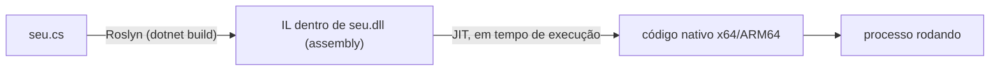
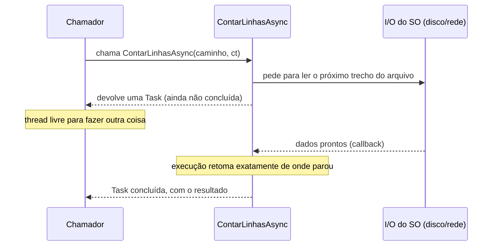

# Capítulo 00 — C# 14 e .NET 10 do zero

> **Pré-requisito:** saber programar backend em qualquer linguagem.
> **Tempo:** 1 a 2 semanas.
> **Entrega:** conversor de linha posicional em versão ingênua — a linha de base que o Capítulo 02 vai destruir em performance.

## Por que este capítulo existe

O roteiro original começa no Módulo 0 assumindo C# fluente. Este capítulo preenche a lacuna: linguagem, plataforma, ferramentas e biblioteca padrão, no mínimo necessário para o resto fazer sentido. Se você já escreve C# há anos, leia só a seção **2.1**, o fim da **4** e a **6.1** — são as partes que mudaram com C# 14 e .NET 10 (apps baseados em arquivo, atribuição condicional a nulo e membros de extensão). As seções **3.2** a **3.4** (`static`, herança, genéricos) existem para quem vem de outra linguagem e não conhece o vocabulário de orientação a objetos do .NET; se esses três termos já são automáticos para você, pule-as.

---

## 1. O que é .NET, afinal

**Por que isso importa:** se você não separar essas três coisas na cabeça, frases como "o .NET é lento" ou "o .NET não tem essa biblioteca" não fazem sentido — porque a resposta depende de qual das três partes você quis dizer. Todo o resto do capítulo assume que você já fez essa separação.

.NET é três coisas empacotadas juntas, e confundi-las é fonte de mal-entendido constante:

1. **Uma linguagem** — C# (também F# e VB.NET, fora do escopo aqui). É a sintaxe que você digita: `if`, `class`, `for`, etc. Sozinha, uma linguagem não executa nada — ela só define regras de como o texto vira instruções.
2. **Um runtime** — o CLR (Common Language Runtime): o programa que efetivamente executa seu código. Ele carrega assemblies (definido abaixo), compila IL para código de máquina em tempo de execução (JIT, definido abaixo) e gerencia memória com um garbage collector (definido abaixo). Pense nele como a "máquina virtual" que roda por baixo — parecido com o que a JVM é para Java, ou o interpretador CPython para Python.
3. **Uma biblioteca padrão gigante** — BCL (Base Class Library): coleções, IO, rede, JSON, criptografia, injeção de dependência, logging, HTTP. É o código pronto que já vem instalado — o equivalente à "standard library" do Python ou ao `java.util`/`java.io` do Java, só que bem maior. Muito do que em outras stacks é pacote de terceiros aqui vem na caixa.

> 📖 **Conceito: compilador**
> Um compilador é um programa que lê código-fonte (o texto que você escreve) e produz outra forma de código — nesse caso, não direto para a linguagem de máquina do seu processador, mas para uma linguagem intermediária (explicada a seguir). Toda vez que você roda `dotnet build`, o compilador da Microsoft para C# (chamado **Roslyn**, invocado via `csc`) faz esse trabalho.

> 📖 **Conceito: IL, bytecode e assembly**
> **IL** (Intermediate Language) é um conjunto de instruções genéricas, parecido com linguagem de máquina, mas que não é específico de nenhum processador — é uma etapa intermediária. É o mesmo papel que o "bytecode" cumpre em Java. O IL gerado pelo compilador fica guardado dentro de um arquivo `.dll` (ou `.exe`), chamado **assembly** — o pacote final e distribuível do seu código compilado. Pense num assembly como "o binário compilado", só que ainda não é código de máquina puro; é IL, que precisa de mais um passo para rodar (o JIT, a seguir).

> 📖 **Conceito: JIT (Just-In-Time compilation)**
> O JIT é a parte do CLR que pega o IL guardado no assembly e o traduz para instruções reais do processador (x64, ARM64 etc.) — mas só faz isso **na hora em que o método é chamado pela primeira vez**, não tudo de uma vez no início. É por isso que se chama "just in time": a compilação para código nativo acontece just in time, sob demanda, enquanto o programa já está rodando.

> 📖 **Conceito: garbage collector (GC)**
> É a parte do runtime responsável por descobrir automaticamente quais objetos na memória não são mais usados por ninguém e liberar essa memória, sem que você precise chamar `free()` ou equivalente manualmente. Você vai ver o GC em detalhe no Capítulo 02 — por enquanto, basta saber que ele existe e roda em segundo plano.

Juntando os três: o compilador (Roslyn) transforma C# em **IL**, guardado dentro de um assembly. Na execução, o **JIT** converte esse IL em código nativo da máquina onde está rodando, método por método, sob demanda.



Repare que a compilação acontece em dois momentos distintos: Roslyn compila **uma vez**, ao rodar `dotnet build`; o JIT compila **toda vez que o processo inicia**, método por método, sob demanda. É por isso que o primeiro `dotnet run` de um app grande é mais lento para "esquentar" — o JIT ainda está traduzindo IL para código de máquina enquanto o programa executa.

O Capítulo 10 mostra como pular a etapa do JIT inteiramente com Native AOT.

**Versões.** .NET 10 é LTS, lançado em novembro de 2025, com suporte de três anos. C# 14 é a versão da linguagem que acompanha o .NET 10 e é o padrão automático em projetos que têm `<TargetFramework>net10.0</TargetFramework>`, mesmo sem a tag `<LangVersion>`.

> 🐍 **Vindo de outra stack**
> — **Python:** o assembly faz o papel do pacote instalado, mas com tipos verificados na compilação. Não há `__pycache__`; há IL de verdade.
> — **Java:** o mapeamento é quase um para um. CLR ≈ JVM, IL ≈ bytecode, assembly ≈ JAR, NuGet ≈ Maven.
> — **Go:** a maior diferença é o GC e o JIT. Você troca binário estático e startup instantâneo por otimização em runtime (e o Capítulo 10 recupera o binário estático com AOT).

---

## 2. Primeiro contato com o SDK

**Por que isso importa:** todo capítulo daqui em diante começa com algum comando `dotnet`. Se esses comandos básicos não estiverem automáticos, cada capítulo futuro vai parecer mais difícil do que é — porque parte da dificuldade não é o conceito novo, é ainda estar decifrando a ferramenta.

O `dotnet` é a única ferramenta de linha de comando que você precisa — ele cria projetos, compila, testa, roda e gerencia dependências.

```bash
dotnet new console -o Cnab.Playground   # cria projeto
cd Cnab.Playground
dotnet run                              # restaura, compila e executa
dotnet build                            # só compila
dotnet test                             # roda testes
dotnet add package Humanizer            # adiciona dependência NuGet
```

O que cada linha faz:

1. `dotnet new console -o Cnab.Playground` — cria uma pasta nova chamada `Cnab.Playground` com um projeto de console mínimo já funcional dentro: um arquivo `.csproj` (explicado abaixo) e um `Program.cs` com um "Hello World". `console` é o **template**; existem outros (`webapi`, `classlib`, etc.) que você vai usar nos próximos capítulos.
2. `cd Cnab.Playground` — entra na pasta criada. A partir daqui, todo comando `dotnet` seguinte assume que você está dentro da pasta do projeto.
3. `dotnet run` — faz três coisas em sequência, automaticamente: restaura pacotes (baixa as dependências declaradas no `.csproj`, se ainda não estiverem no cache local), compila, e executa o programa resultante. É o comando que você mais vai usar durante desenvolvimento.
4. `dotnet build` — só compila, sem executar. Útil para verificar que o código compila sem rodar nada (por exemplo, num pipeline de CI que só quer checar erros de compilação).
5. `dotnet test` — procura por projetos de teste e roda a suíte. Você vai usar isso a partir do Capítulo 06.
6. `dotnet add package Humanizer` — adiciona uma dependência externa ao projeto. Veja a caixa de conceito abaixo para entender o que isso significa de fato.

> 📖 **Conceito: pacote NuGet**
> **NuGet** é o gerenciador de pacotes do .NET — o equivalente ao `pip` do Python, ao `npm` do Node, ou ao Maven/Gradle do Java. Um "pacote" é código de terceiros (ou seu próprio, em outro projeto) empacotado como um ou mais assemblies (definido na seção 1), publicado num repositório (o público é `nuget.org`), pronto para ser baixado e referenciado pelo seu projeto. `dotnet add package Humanizer` baixa o pacote chamado "Humanizer" e adiciona uma linha `<PackageReference>` no seu `.csproj` — é assim que o projeto passa a "saber" que depende dele. Você vai instalar dezenas de pacotes ao longo do curso; sempre é essa mesma mecânica.

O arquivo `.csproj` é o coração do projeto — um arquivo de configuração em XML que descreve o que o projeto é e como deve ser compilado, e não um script que "roda" (o `dotnet` é que lê esse arquivo e age de acordo com ele):

```xml
<Project Sdk="Microsoft.NET.Sdk">
  <PropertyGroup>
    <OutputType>Exe</OutputType>
    <TargetFramework>net10.0</TargetFramework>
    <Nullable>enable</Nullable>
    <ImplicitUsings>enable</ImplicitUsings>
  </PropertyGroup>
</Project>
```

Linha a linha:

- `<Project Sdk="Microsoft.NET.Sdk">` — declara qual "kit" de regras de compilação o MSBuild (a ferramenta de build por trás do `dotnet`) deve usar. Para a maioria dos projetos deste curso, é sempre esse SDK ou uma variação dele (você verá `Microsoft.NET.Sdk.Web` no Capítulo 08, por exemplo).
- `<PropertyGroup>` — apenas um agrupamento de configurações; não tem efeito por si só, é só organização do XML.
- `<OutputType>Exe</OutputType>` — diz que o resultado da compilação é um executável (roda sozinho), em vez de uma biblioteca (`Library`, o padrão, que só pode ser referenciada por outro projeto).
- `<TargetFramework>net10.0</TargetFramework>` (TFM, Target Framework Moniker) — para qual versão da plataforma .NET você está compilando. Isso determina quais APIs da BCL (seção 1) estão disponíveis.
- `<Nullable>enable</Nullable>` — liga a análise de nulidade do compilador (detalhada na seção 4). **Sempre ligue.**
- `<ImplicitUsings>enable</ImplicitUsings>` — importa automaticamente, em todo arquivo `.cs` do projeto, namespaces comuns como `System`, `System.Linq`, `System.Collections.Generic`. Sem isso, cada arquivo precisaria começar com várias linhas `using System;` etc. — como o `import` do Python ou do Java, mas aplicado ao projeto inteiro de uma vez.

### 2.1 Apps baseados em arquivo (.NET 10)

Novidade do .NET 10: um único `.cs` roda sem `.csproj`, com dependências declaradas em diretivas de preprocessador.

```csharp
#!/usr/bin/env dotnet
#:package Spectre.Console@0.49.1

using Spectre.Console;

AnsiConsole.MarkupLine("[green]Arquivo lido com sucesso[/]");
```

```bash
dotnet run inspect.cs
```

Linha a linha do exemplo acima: `#!/usr/bin/env dotnet` é um shebang (o mesmo mecanismo de scripts Bash/Python) que permite rodar o arquivo diretamente como `./inspect.cs` num sistema Unix, se ele tiver permissão de execução. `#:package Spectre.Console@0.49.1` é a forma de declarar uma dependência NuGet (mesma ideia da seção 2) sem precisar de um `.csproj` — o `dotnet run` lê essa diretiva e baixa o pacote sozinho. O resto é C# normal.

Isso substitui o script Bash/Python de apoio que todo time acaba tendo. Quando o script crescer, `dotnet project convert inspect.cs` promove a projeto de verdade (gera o `.csproj` correspondente).

### 2.2 Rodando e depurando no VS Code

**Por que isso importa:** você vai passar o curso inteiro tentando entender o que o código está fazendo. Há dois jeitos de fazer isso: espalhar `Console.WriteLine` e reler a saída, ou **parar o programa no meio e olhar**. O segundo é incomparavelmente mais rápido, e é a diferença entre adivinhar e ver. Vale gastar dez minutos com esta seção agora — ela se paga no primeiro bug do Capítulo 02.

Abra a pasta do projeto no VS Code (`code .` no terminal, de dentro da pasta). Com o C# Dev Kit instalado (ver README), o projeto é detectado sozinho — não é preciso configurar nada antes de rodar.

**Rodar.** Duas formas, e a diferença entre elas importa:

| Tecla | O que faz |
|---|---|
| **F5** | roda **com** o depurador acoplado — para em breakpoints |
| **Ctrl+F5** / **Cmd+F5** | roda sem depurador; mais rápido para só ver a saída |

Na primeira vez que você apertar F5, o VS Code pergunta o tipo de configuração: escolha **C#**, e depois o projeto. O C# Dev Kit monta a configuração sozinho — **você não precisa escrever um `launch.json`** para um projeto simples. (Esse arquivo existe e é editável, mas só vale mexer nele quando houver mais de um projeto executável no repositório; o Capítulo 05 volta ao assunto.)

**Parar o programa no meio.** Clique na margem esquerda, à esquerda do número da linha — aparece um ponto vermelho, o **breakpoint**. Ou posicione o cursor na linha e aperte **F9**. Rode com F5: a execução para naquela linha, **antes** de executá-la.

Com o programa parado, quatro coisas ficam disponíveis:

- **Variables** (painel lateral) — todas as variáveis vivas naquele ponto, com os valores atuais. Expanda um objeto para ver os campos dentro dele.
- **Watch** — expressões que você quer acompanhar. Adicione `linha.Length` e ela é reavaliada a cada passo.
- **Call Stack** — a cadeia de chamadas que trouxe a execução até ali: quem chamou quem. Clicar num nível de cima mostra o estado daquele frame.
- **Debug Console** — digite qualquer expressão C# e veja o resultado, no contexto do ponto parado. `linha.Substring(37, 13)` ali responde na hora se o seu cálculo de posição está certo — sem recompilar.

**Andar pelo código**, com o programa parado:

| Tecla | Ação |
|---|---|
| **F10** | *step over* — executa a linha inteira, sem entrar nos métodos que ela chama |
| **F11** | *step into* — entra no método chamado nesta linha |
| **Shift+F11** | *step out* — termina o método atual e volta para quem o chamou |
| **F5** | continua até o próximo breakpoint (ou até o fim) |

A escolha entre F10 e F11 é o que mais confunde no começo: use **F10** por padrão, e **F11** só quando desconfiar que o problema está *dentro* do método chamado. Entrar em tudo faz você se perder em código da BCL que não é seu.

> 💡 **Breakpoint condicional** — o recurso que mais economiza tempo neste curso
> Um laço sobre 100 mil linhas com um breakpoint comum para 100 mil vezes, e você desiste no quinto F5. Clique com o botão direito no breakpoint → **Edit Breakpoint** → **Expression**, e escreva uma condição C#: `i == 4237`, ou `linha[7] == '3'`, ou `registro.NossoNumero == 12345`. A execução só para quando a condição for verdadeira. É assim que se depura processamento de arquivo grande — e todo o resto do curso é processamento de arquivo grande.

**Terminal integrado.** `Ctrl+'` (crase) abre um terminal dentro do VS Code, já na pasta do projeto. Todo comando `dotnet` deste curso roda ali — não é preciso alternar para outra janela. É também onde você vai rodar os `curl`, `docker` e `psql` dos capítulos seguintes.

> ⚠️ **Armadilha**
> Se F5 não parar no seu breakpoint, a causa quase sempre é uma destas três: o breakpoint está em código que nunca executa (confirme com um `Console.WriteLine` temporário); você rodou com **Ctrl+F5** em vez de F5; ou você está depurando um build `Release`, onde o compilador reordena e remove código (Capítulo 10) e os breakpoints deixam de casar com as linhas. Para depurar, use sempre `Debug` — que é o padrão.

---

## 3. Anatomia de um programa

**Por que isso importa:** você vai ler dezenas de arquivos `.cs` neste curso. Se a estrutura básica — o que é `namespace`, o que é uma `class`, onde o programa "começa" — não for automática, cada exemplo de código vira um quebra-cabeça antes mesmo de chegar à parte nova que o capítulo quer ensinar.

Todo programa .NET precisa de um ponto de entrada: um lugar onde a execução começa. Tradicionalmente, isso era um método chamado `Main` dentro de uma classe. C# moderno permite pular essa cerimônia com **top-level statements**:

```csharp
// Program.cs — top-level statements: sem class, sem Main explícito
using System.Globalization;

var caminho = args.Length > 0 ? args[0] : "samples/retorno.ret";
var linhas = File.ReadAllLines(caminho);

Console.WriteLine($"{linhas.Length} linhas lidas em {DateTime.Now:HH:mm:ss}");
```

Linha a linha:

- `using System.Globalization;` — importa um namespace (ver caixa de conceito abaixo), disponibilizando os tipos declarados nele (como `CultureInfo`) sem precisar escrever o nome completo toda vez.
- `var caminho = args.Length > 0 ? args[0] : "samples/retorno.ret";` — `args` é um array de strings com os argumentos passados na linha de comando (o mesmo `argv` de C, `sys.argv` do Python, ou `args` do `main` em Java). A linha usa o operador ternário (`condição ? valorSeVerdadeiro : valorSeFalso`) para escolher o primeiro argumento se ele existir, ou um caminho padrão caso contrário. `var` deixa o compilador inferir o tipo (aqui, `string`) a partir do valor atribuído — não significa "tipo dinâmico"; o tipo ainda é fixado em tempo de compilação, só não precisou ser escrito.
- `var linhas = File.ReadAllLines(caminho);` — chama um método estático da classe `File` (da BCL, seção 1) que lê o arquivo inteiro e devolve um array de strings, uma por linha.
- `Console.WriteLine($"...")` — imprime no terminal. O `$` antes da string ativa **interpolação de string**: qualquer coisa entre `{ }` dentro da string é avaliada como código C# e seu resultado é inserido ali — aqui, `linhas.Length` (quantidade de elementos do array) e `DateTime.Now:HH:mm:ss` (hora atual, formatada).

Por trás dos panos, o compilador pega esse código solto e o envolve automaticamente numa classe com um método `Main` — é só uma forma mais enxuta de escrever a mesma coisa. Para código de verdade, com mais de um arquivo, você volta a declarar tipos explicitamente:

```csharp
namespace Cnab.Core;           // namespace com escopo de arquivo (sem chaves)

public sealed class LeitorDeArquivo(string caminho)   // primary constructor
{
    public IEnumerable<string> Ler() => File.ReadLines(caminho);
}
```

> 📖 **Conceito: namespace**
> Um namespace é uma forma de agrupar e organizar tipos (classes, structs, etc.) para evitar colisão de nomes — se dois pacotes diferentes definirem uma classe `Cliente`, o namespace é o que os diferencia (`Cnab.Core.Cliente` vs `Outro.Pacote.Cliente`). É conceitualmente o mesmo papel que pacotes (`package`) cumprem em Java, ou módulos em Python. `namespace Cnab.Core;` sem chaves (novidade das últimas versões de C#) diz "tudo neste arquivo pertence a este namespace" — a forma antiga exigia `namespace Cnab.Core { ... tudo aqui dentro ... }`, com um nível de indentação a mais.

> 📖 **Conceito: classe e construtor**
> Uma **classe** é um molde para criar objetos: ela declara quais dados (campos/propriedades) e comportamentos (métodos) um objeto desse tipo vai ter. Um **construtor** é um método especial, chamado automaticamente quando você cria um objeto novo com `new`, responsável por inicializar esse objeto. Um **primary constructor** — a sintaxe `(string caminho)` colada direto na declaração da classe — é um atalho: em vez de escrever um construtor tradicional que recebe `caminho` e o guarda num campo privado, o parâmetro `caminho` já fica disponível para uso em qualquer método da classe, sem esse passo intermediário. É açúcar sintático: o compilador gera o campo por trás das cenas.

Três coisas para notar no exemplo acima:

- **`namespace X;`** — como explicado na caixa de conceito, essa é a sintaxe moderna com escopo de arquivo.
- **`sealed`** — impede que outra classe herde de `LeitorDeArquivo` (ou seja, que outra classe diga "eu sou um tipo de `LeitorDeArquivo`, com tudo que ele já tem, mais isso" — a seção 3.3 detalha o que é herança). Use por padrão: é mais rápido (o JIT consegue otimizar chamadas de método sabendo que não existe subclasse — chamado devirtualização) e comunica intenção: "este tipo não foi desenhado para ser estendido".
- **Primary constructor** — como explicado acima, `caminho` já está disponível dentro de `Ler()` sem precisar de um campo declarado à parte.

### 3.1 Tipos que você vai usar todo dia

**Por que isso importa:** escolher `class` quando devia ser `record`, ou vice-versa, é o tipo de decisão que parece cosmética no começo e vira dor de cabeça de debug depois (dois objetos "iguais" que o código trata como diferentes, ou um valor mutável mudando por baixo dos seus pés). Esta seção é vocabulário; o Capítulo 02 explica o porquê técnico de cada escolha.

> 📖 **Conceito: tipo de referência × tipo de valor**
> Isso é aprofundado no Capítulo 02, mas você precisa da ideia básica agora para entender os exemplos abaixo. Uma variável de **tipo de referência** (como `class`) guarda um endereço que aponta para onde o dado realmente está na memória — copiar a variável copia o endereço, não o dado; as duas variáveis passam a apontar para a mesma coisa. Uma variável de **tipo de valor** (como `struct`) guarda o dado diretamente — copiar a variável copia o dado inteiro; as duas variáveis passam a ser independentes uma da outra.

> 📖 **Conceito: igualdade por identidade × por valor**
> **Igualdade por identidade** significa que dois objetos só são "iguais" se forem literalmente o mesmo objeto na memória (o mesmo endereço). **Igualdade por valor** significa que dois objetos são "iguais" se todos os seus campos forem iguais, mesmo sendo dois objetos distintos na memória. `class` usa identidade por padrão; `record` usa valor por padrão — essa é a diferença prática mais importante entre os dois.

```csharp
// classe: tipo de referência, vive no heap, comparação por identidade
public class Titulo { public required string NossoNumero { get; init; } }

// struct: tipo de valor, vive inline (na pilha ou dentro do objeto dono)
public readonly struct Centavos(long valor)
{
    public long Valor { get; } = valor;
    public decimal EmReais => Valor / 100m;
}

// record: classe com igualdade por valor, ToString e desconstrução gerados
public record Ocorrencia(string Codigo, string Descricao);

// record struct: o mesmo, mas tipo de valor
public readonly record struct PosicaoCampo(int Inicio, int Tamanho);

// enum: conjunto fechado de constantes nomeadas
public enum TipoRegistro { HeaderArquivo = 0, HeaderLote = 1, Detalhe = 3, TrailerLote = 5, TrailerArquivo = 9 }

// interface: contrato
public interface IParser<T> { bool TentarParse(string linha, out T resultado); }
```

O que cada declaração acima realmente diz:

- **`Titulo`** é uma classe comum. `{ get; init; }` é uma propriedade (um par de método "ler" e método "escrever" disfarçado de campo) que só pode ser atribuída na criação do objeto (explicado abaixo, com `required`).
- **`Centavos`** é um `struct` — um tipo de valor pequeno. `readonly` na declaração garante que nenhum método interno modifica o estado depois de criado — combinação comum para tipos de valor pequenos e imutáveis.
- **`Ocorrencia`** é um `record` com **sintaxe posicional**: `record Ocorrencia(string Codigo, string Descricao)` já gera, sozinho, um construtor que recebe os dois valores, duas propriedades somente-leitura (`Codigo` e `Descricao`), um `ToString()` legível (`Ocorrencia { Codigo = 06, Descricao = ... }`), e a comparação por valor. Nada disso precisa ser escrito à mão.
- **`PosicaoCampo`** combina as duas ideias: `record struct` é um record que é também um tipo de valor.
- **`TipoRegistro`** é um `enum` — uma lista fechada de opções nomeadas, cada uma internamente representada por um número inteiro (`Detalhe` vale `3`, por exemplo). Usado quando um valor só pode ser um de poucos casos conhecidos.
- **`IParser<T>`** é uma `interface` — não implementa nada, só declara "qualquer tipo que disser que implementa `IParser<T>` precisa ter um método `TentarParse` com esta assinatura". É um contrato que várias classes diferentes podem cumprir, permitindo trocar a implementação sem mudar quem a usa. O `<T>` é um **genérico** — o tipo real (`T`) só é decidido em quem usa a interface, permitindo o mesmo contrato servir para qualquer tipo de resultado (seção 3.4).

`required` obriga o chamador a informar a propriedade no inicializador de objeto:

```csharp
var t = new Titulo { NossoNumero = "00012345678" };   // ok
var u = new Titulo();                                  // erro de compilação
```

`init` permite atribuir só na construção — imutabilidade sem construtor gigante.

**Quando usar cada um** (regra prática que o Capítulo 02 vai fundamentar):

| Situação | Escolha |
|----------|---------|
| Entidade com identidade e ciclo de vida | `class` |
| Dado imutável comparado por valor | `record` |
| Valor pequeno (≤ 16 bytes), criado aos milhões | `readonly record struct` |
| Contrato entre camadas | `interface` |

### 3.2 `static`: membro do tipo, não do objeto

**Por que isso importa:** metade dos exemplos deste capítulo já usou `static` sem explicação — `File.ReadAllLines`, `Encoding.GetEncoding`, `ArgumentNullException.ThrowIfNull`, `public static class`. É uma palavra pequena que muda quem é o dono do dado.

> 📖 **Conceito: `static`**
> Um membro (método, campo, propriedade) marcado com `static` pertence ao **tipo**, não a um objeto específico daquele tipo. Um método de instância precisa de um objeto para ser chamado (`leitor.Ler()` — qual leitor?); um método `static` é chamado no próprio tipo (`File.ReadAllLines(caminho)`), porque não depende de nenhum estado de um objeto. Uma **classe `static`** (como `RoteadorDeRegistro` na seção 5) é uma classe que só tem membros estáticos e da qual não se pode criar objeto com `new` — é um agrupamento de funções, não um molde de objetos. Um **campo `static`** é compartilhado por todo o programa: existe uma cópia só, e ela vive enquanto o processo viver. Guarde essa última frase: o Capítulo 10 vai mostrar que campo `static` acumulando dados é a causa número um de vazamento de memória em .NET.

```csharp
public sealed class Contador
{
    public static int TotalCriados;    // um só, compartilhado por todos os objetos
    public int Valor;                  // um por objeto

    public Contador() => TotalCriados++;
}

var a = new Contador();
var b = new Contador();
Console.WriteLine(Contador.TotalCriados);   // 2 — lido no TIPO, não em a nem em b
Console.WriteLine(a.Valor);                 // 0 — este é de `a`
```

### 3.3 Herança, `abstract` e `override`

**Por que isso importa:** o `sealed` da seção anterior foi apresentado como "impede que outra classe herde" — sem que herança tivesse sido explicada. E a partir do Capítulo 05 você vai escrever, em quase todo projeto, um `protected override async Task ExecuteAsync(...)` dentro de uma classe que herda de `BackgroundService`. Sem esta seção, aquela linha é três palavras mágicas em sequência.

> 📖 **Conceito: herança, classe base e classe derivada**
> Herança é declarar que um tipo **é uma variação** de outro: a classe derivada recebe automaticamente todos os membros da classe base e pode acrescentar os seus. A sintaxe é dois-pontos: `class Derivada : Base`. Serve para o caso em que uma biblioteca já escreveu quase todo o comportamento e deixou lacunas específicas para você preencher — que é exatamente o desenho do `BackgroundService` do Capítulo 05: ele já sabe iniciar, parar e se registrar no host; a única coisa que falta é *o que fazer*, e essa parte é sua.

> 📖 **Conceito: `abstract`, `virtual` e `override`**
> Um método **`abstract`** é declarado sem corpo: a classe base diz "todo mundo que herdar de mim **precisa** fornecer este método", e por isso uma classe com membro abstrato não pode ser instanciada com `new` — ela só existe para ser herdada. Um método **`virtual`** tem corpo, mas permite que a classe derivada o substitua caso queira. Dos dois lados, quem herda usa **`override`** para dizer "esta é a minha versão deste método". Sem a palavra `override`, o compilador entende que você quis criar um método novo por acidente e avisa.

```csharp
// a classe base: sabe o ciclo, não sabe o conteúdo
public abstract class ProcessadorDeArquivo
{
    // o esqueleto, já escrito: não faz sentido cada subclasse reescrever isto
    public void Processar(string caminho)
    {
        Console.WriteLine($"Iniciando {caminho}");
        var total = ProcessarLinhas(File.ReadLines(caminho));   // ← a lacuna
        Console.WriteLine($"Concluído: {total} registros");
    }

    // sem corpo: cada subclasse é obrigada a preencher
    protected abstract int ProcessarLinhas(IEnumerable<string> linhas);

    // com corpo: a subclasse pode trocar, mas não precisa
    protected virtual bool DeveProcessar(string linha) => linha.Length >= 240;
}

// a classe derivada: só preenche a lacuna
public sealed class ProcessadorDeRetorno : ProcessadorDeArquivo
{
    protected override int ProcessarLinhas(IEnumerable<string> linhas)
        => linhas.Count(DeveProcessar);
}

var p = new ProcessadorDeRetorno();
p.Processar("samples/retorno.ret");   // Processar veio da base, de graça
// var x = new ProcessadorDeArquivo(); // ✗ erro: classe abstrata não se instancia
```

Três coisas para reter:

- **`protected`** é um terceiro nível de visibilidade, entre `private` (só esta classe) e `public` (qualquer um): significa "esta classe e quem herdar dela". É por isso que `ExecuteAsync` é `protected override` — só o `BackgroundService` chama esse método, nunca o código de fora.
- **`sealed` é o freio de mão disso.** Marcar `ProcessadorDeRetorno` como `sealed` diz "a cadeia de herança para aqui". Agora a recomendação da seção anterior ("use `sealed` por padrão") faz sentido completo: herança é uma porta que você abre deliberadamente, não o estado natural das coisas.
- **Interface × classe abstrata**, a dúvida clássica: uma `interface` (seção 3.1) só declara assinaturas e um tipo pode implementar várias; uma classe abstrata pode trazer **código pronto** e estado, mas cada tipo só herda de uma. A regra prática do curso: use `interface` para contrato entre camadas, e classe abstrata só quando houver comportamento real a compartilhar — como o `Processar` acima.

### 3.4 Genéricos: um tipo, vários tipos de conteúdo

**Por que isso importa:** `List<T>`, `Task<T>`, `IParser<T>` — o `<T>` apareceu quatro vezes até aqui com uma frase de explicação. A partir do Capítulo 03 ele vira onipresente (`Channel<T>`, `IOptionsMonitor<T>`, `IConsumer<T>`), e é mais fácil pagar cinco minutos por ele agora.

> 📖 **Conceito: tipo genérico e parâmetro de tipo**
> Um tipo genérico é um molde com uma lacuna de **tipo**, não de valor. `List<T>` não é uma lista de nada específico: é a lógica de "lista que cresce" escrita uma única vez, com `T` como um espaço em branco. Quem usa preenche esse espaço — `List<int>`, `List<string>`, `List<DetalheRetorno>` — e o compilador gera, para cada preenchimento, uma versão com verificação de tipo completa. A alternativa sem genéricos seria uma `ArrayList` de `object`, que aceita qualquer coisa e falha em runtime quando você tira o item errado. É a diferença entre o erro aparecer no build e aparecer em produção.

```csharp
// escrito uma vez, serve para qualquer T
public sealed class Caixa<T>
{
    private T? _conteudo;
    public void Guardar(T item) => _conteudo = item;
    public T? Pegar() => _conteudo;
}

var caixaDeTexto = new Caixa<string>();
caixaDeTexto.Guardar("033");
// caixaDeTexto.Guardar(42);       // ✗ erro de compilação: 42 não é string

var caixaDeNumero = new Caixa<long>();
long? n = caixaDeNumero.Pegar();   // já sai como long, sem conversão
```

Um método também pode ser genérico por conta própria, e aí o compilador normalmente infere `T` a partir do argumento:

```csharp
public static T? PrimeiroOuPadrao<T>(IReadOnlyList<T> itens)
    => itens.Count > 0 ? itens[0] : default;

var primeiro = PrimeiroOuPadrao(listaDeRegistros);   // T inferido, sem escrever <DetalheRetorno>
```

> 📖 **Conceito: restrição de tipo (`where`)**
> Dentro de `Caixa<T>`, o compilador não sabe nada sobre `T` — então você não pode chamar métodos dele, só o que todo tipo tem. Uma **restrição** estreita o que `T` pode ser e, em troca, libera o que você pode fazer com ele. As que aparecem no curso: `where T : class` (só tipos de referência), `where T : struct` (só tipos de valor), `where T : IParser<T>` (só tipos que implementam aquela interface — e aí você pode chamar os métodos dela), `where T : new()` (só tipos que têm construtor sem parâmetros).

```csharp
// agora T é obrigatoriamente comparável, então CompareTo existe
public static T Maior<T>(T a, T b) where T : IComparable<T>
    => a.CompareTo(b) >= 0 ? a : b;
```

---

## 4. Nullable reference types — o recurso mais importante da linguagem

**Por que isso importa:** em praticamente qualquer outra linguagem com tipos de referência (Java, antes do C# 8; Python; JavaScript), esquecer de checar se algo é nulo antes de usá-lo é o bug mais comum que existe — e ele só aparece em runtime, na produção, geralmente no pior momento. O recurso desta seção move essa checagem para o momento da compilação, antes do código sequer rodar.

> 📖 **Conceito: `null`**
> `null` é um valor especial que significa "nenhum objeto aqui" — uma variável de tipo de referência (seção 3.1) que aponta para "lugar nenhum". Tentar usar um método ou propriedade de uma variável que vale `null` (por exemplo, `s.Length` quando `s` é `null`) lança uma exceção em runtime (`NullReferenceException`) e derruba a operação em andamento.

Com `<Nullable>enable</Nullable>`, o compilador rastreia, estaticamente (ou seja, sem rodar o programa, só lendo o código), onde `null` pode aparecer:

```csharp
string nome = null;      // ⚠️ warning CS8600
string? talvez = null;   // ok: o ? declara que pode ser nulo

void Imprimir(string? s)
{
    Console.WriteLine(s.Length);       // ⚠️ warning: s pode ser nulo
    if (s is null) return;
    Console.WriteLine(s.Length);       // ok: o compilador sabe que não é nulo aqui
}
```

No exemplo acima: `string nome = null;` gera um aviso porque `string` (sem `?`) promete ao compilador que a variável nunca será nula — atribuir `null` a ela quebra essa promessa. `string? talvez = null;` é permitido porque o `?` depois do tipo declara explicitamente "esta variável pode ser nula". Dentro de `Imprimir`, o compilador consegue perceber que depois de `if (s is null) return;`, qualquer código abaixo dessa linha só executa se `s` não for nulo — por isso o segundo `Console.WriteLine(s.Length)` não gera aviso.

Com `TreatWarningsAsErrors=true` (Capítulo 01), esses warnings viram erros de build — ou seja, o projeto simplesmente não compila enquanto o problema não for resolvido. O efeito prático é que `NullReferenceException` deixa de ser uma classe de bug frequente.

Operadores relacionados, um por um:

```csharp
var tamanho = s?.Length ?? 0;        // null-conditional + null-coalescing
ArgumentNullException.ThrowIfNull(s); // guard clause idiomática
var forcado = s!.Length;              // "confie em mim": suprime o aviso — use com culpa
```

- `s?.Length` — o `?.` (null-conditional) só acessa `.Length` se `s` não for nulo; se `s` for nulo, a expressão inteira já vale `null`, sem lançar exceção.
- `?? 0` — o `??` (null-coalescing) diz "se o que está à esquerda for `null`, use o valor à direita no lugar". Junto com o operador anterior: "pegue o tamanho de `s`, ou `0` se `s` for nulo".
- `ArgumentNullException.ThrowIfNull(s);` — uma forma padronizada de lançar uma exceção imediatamente se `s` for nulo, em vez de deixar o erro acontecer mais tarde, longe de onde a causa real está. É uma **guard clause**: uma checagem no início de um método que rejeita entradas inválidas cedo.
- `s!.Length` — o `!` (null-forgiving operator) diz ao compilador "eu sei que você acha que isso pode ser nulo, mas confie em mim, não é". Veja a armadilha abaixo — isso não é uma checagem real.

C# 14 acrescenta **atribuição condicional a nulo**:

```csharp
cliente?.Endereco = novoEndereco;   // só atribui se cliente não for nulo
```

> ⚠️ **Armadilha**
> O `!` (null-forgiving) não gera verificação nenhuma em runtime. Ele apenas cala o compilador. Cada `!` no seu código é uma promessa não verificada; trate-os como dívida e conte-os.

---

## 5. Pattern matching — o coração expressivo de C# moderno

**Por que isso importa:** este curso inteiro usa `switch` sobre tipo e sobre forma de dado como jeito padrão de tomar decisão — em vez de uma cadeia longa de `if/else if`. Se essa sintaxe não for confortável agora, todo exemplo de código do resto do curso vai parecer mais denso do que precisa.

Aqui C# se distancia bastante de Java (antes de versões recentes) e se aproxima de linguagens funcionais. Vale investir tempo.

> 📖 **Conceito: switch expression**
> Um `switch` tradicional (que existe em quase toda linguagem) é um comando: ele executa um bloco de código por caso, mas não "vale" nada por si só. Uma **switch expression** (a sintaxe `x switch { padrão => resultado, ... }`) é diferente: ela é uma expressão, ou seja, **produz um valor**, que pode ser atribuído a uma variável ou retornado direto de um método, como no exemplo abaixo. Cada linha dentro das chaves é um "padrão" (o que estamos testando) seguido de `=>` e o valor a produzir se aquele padrão bater.

```csharp
// switch expression, com padrões de tipo e de propriedade
string Descrever(object o) => o switch
{
    null                                    => "nulo",
    int n when n < 0                        => "inteiro negativo",
    int n                                   => $"inteiro {n}",
    string { Length: 0 }                    => "string vazia",
    string s                                => $"string de {s.Length} chars",
    Ocorrencia { Codigo: "06" }             => "liquidado",
    Ocorrencia { Codigo: var c }            => $"ocorrência {c}",
    _                                       => "desconhecido"
};
```

Lendo caso a caso: `null => "nulo"` testa se `o` é nulo. `int n when n < 0` testa se `o` é do tipo `int` **e** (a cláusula `when` acrescenta uma condição extra) seu valor é negativo — se bater, `n` já fica disponível com o valor de `o` convertido para `int`. `int n` sozinho pega qualquer outro `int`. `string { Length: 0 }` testa se `o` é uma `string` cuja propriedade `Length` vale `0` — esse é um **padrão de propriedade**: você pode testar o valor de uma propriedade sem escrever `o is string && ((string)o).Length == 0`. `Ocorrencia { Codigo: "06" }` faz o mesmo com um tipo do seu próprio domínio. `Ocorrencia { Codigo: var c }` captura o valor de `Codigo` na variável `c` para usar no resultado. `_` é o coringa: "qualquer outro caso não coberto acima".

Sobre exaustividade, com precisão: um switch expression **não é obrigado** a cobrir todos os casos. Quando o compilador percebe que falta algum, ele emite o aviso CS8509 — e, se um valor não coberto aparecer em runtime, a expressão lança `SwitchExpressionException`. Com o `TreatWarningsAsErrors` que o Capítulo 01 liga, esse aviso vira erro de build, e o efeito prático passa a ser "o projeto não compila com um switch incompleto". É o `_` que satisfaz o compilador sem enumerar tudo — mas repare que ele satisfaz **calando** a checagem, não provando que o caso está tratado: num `switch` sobre um `enum`, omitir o `_` de propósito é melhor, porque aí o compilador avisa toda vez que alguém acrescentar um valor novo ao enum.

Aplicado ao domínio, o roteamento de registro fica legível:

```csharp
public static class RoteadorDeRegistro
{
    public static TipoRegistro Classificar(string linha) => linha[7] switch
    {
        '0' => TipoRegistro.HeaderArquivo,
        '1' => TipoRegistro.HeaderLote,
        '3' => TipoRegistro.Detalhe,
        '5' => TipoRegistro.TrailerLote,
        '9' => TipoRegistro.TrailerArquivo,
        var outro => throw new FormatException($"Tipo de registro inválido: '{outro}'")
    };
}
```

Padrões úteis que aparecem no curso:

```csharp
if (registro is { Tipo: TipoRegistro.Detalhe, Segmento: 'T' or 'U' }) { }  // padrão or
if (valor is >= 0 and <= 9_999_999_99) { }                                  // padrão relacional
if (lista is [var primeiro, .., var ultimo]) { }                            // padrão de lista
var (inicio, tamanho) = posicao;                                            // desconstrução
```

---

## 6. LINQ — consulta sobre qualquer coisa enumerável

**Por que isso importa:** quase todo processamento de dados no curso — filtrar registros rejeitados, agrupar por código de ocorrência, somar valores — vai ser escrito como uma cadeia LINQ em vez de um `for` manual. É mais curto de escrever, mas só se você souber ler a cadeia de trás para frente quando algo não bate.

LINQ (Language Integrated Query) é a API de transformação de sequências — coisas que você pode percorrer uma a uma, como listas e arrays. Ela é **lazy** (explicado abaixo), encadeável (o resultado de uma operação já vem pronto para receber a próxima) e usada em praticamente todo código C#.

```csharp
using System.Linq;

var rejeitadas = registros
    .Where(r => r.Tipo == TipoRegistro.Detalhe)
    .Where(r => r.Ocorrencia.Codigo is "03" or "26")
    .GroupBy(r => r.Ocorrencia.Codigo)
    .Select(g => new { Codigo = g.Key, Quantidade = g.Count(), Total = g.Sum(r => r.Valor) })
    .OrderByDescending(x => x.Quantidade)
    .ToList();   // ← só aqui a sequência é realmente percorrida
```

Lendo a cadeia de cima para baixo, cada linha filtra ou transforma o resultado da linha anterior: `Where(r => r.Tipo == TipoRegistro.Detalhe)` mantém só os registros do tipo "detalhe", descartando o resto (a "lambda" `r => ...` é uma função anônima curta: "para cada `r`, teste esta condição"). O segundo `Where` filtra de novo, agora por código de ocorrência. `GroupBy` agrupa os registros restantes por código — o resultado é uma coleção de grupos, cada um com uma chave (`Codigo`) e os itens daquele grupo. `Select` transforma cada grupo num objeto novo (aqui, um **tipo anônimo**, `new { ... }`, criado só para essa consulta, sem precisar declarar uma classe) com a contagem e a soma. `OrderByDescending` ordena o resultado do maior para o menor pela quantidade. `ToList()` é quem efetivamente executa tudo isso e produz uma `List<T>` de verdade — sem essa última chamada, nada acima teria rodado ainda (próximo parágrafo).

> 📖 **Conceito: avaliação lazy (preguiçosa)**
> "Lazy" significa que o código que descreve a operação (`Where`, `Select`, etc.) não executa no momento em que é escrito — ele só monta uma receita de como produzir o resultado, quando for pedido. É o oposto de "eager" (ansioso), onde cada linha já executa imediatamente. Isso é diferente do que acontece por padrão em Python (uma list comprehension roda na hora) ou em código imperativo comum.

O ponto crucial: **nada executa até você materializar** a sequência — chamando `ToList`, `ToArray`, `Count`, `First`, ou percorrendo com `foreach`. Antes disso você só montou um grafo de operadores, sem nenhum dado ainda processado.

> ⚠️ **Armadilha**
> Enumerar duas vezes uma sequência lazy custa duas vezes o trabalho. Se a origem for um arquivo ou um `IQueryable` de banco, você lê duas vezes. Materialize uma vez e reutilize.

Operadores que valem memorizar: `Select`, `SelectMany`, `Where`, `Any`, `All`, `First/FirstOrDefault`, `Single/SingleOrDefault`, `GroupBy`, `OrderBy/ThenBy`, `Distinct`, `Chunk`, `Zip`, `Aggregate`, `Sum/Min/Max/Average`, `ToDictionary`, `ToLookup`.

`Chunk` é especialmente útil no domínio:

```csharp
foreach (var lote in registros.Chunk(1000))
    await persistencia.GravarAsync(lote, ct);
```

### 6.1 Métodos de extensão e, em C# 14, membros de extensão

Método de extensão adiciona comportamento a um tipo que você não controla — por exemplo, `string`, que é da BCL e você não pode editar o código-fonte dela:

```csharp
public static class CnabStringExtensions
{
    public static string CampoTexto(this string linha, int inicio, int tamanho)
        => linha.Substring(inicio - 1, tamanho).TrimEnd();
}

var banco = linha.CampoTexto(1, 3);   // chamado como se fosse método de string
```

O `this` antes do primeiro parâmetro (`this string linha`) é o que transforma um método estático comum num método de extensão: ele passa a poder ser chamado como se fosse um método de instância do tipo `string` (`linha.CampoTexto(...)`), embora o método continue vivendo numa classe separada (`CnabStringExtensions`) e não dentro de `string`.

C# 14 acrescenta uma sintaxe nova para definir membros de extensão, que permite declarar propriedades de extensão além de métodos, e também membros que estendem o próprio tipo em vez de uma instância dele:

```csharp
public static class CnabExtensions
{
    extension(string linha)
    {
        public bool EhDetalhe => linha.Length > 7 && linha[7] == '3';
        // Classificar é o método da seção 5; aqui ele é qualificado porque
        // vive noutra classe — dentro de um bloco `extension` não há herança de escopo.
        public TipoRegistro Tipo => RoteadorDeRegistro.Classificar(linha);
    }
}

if (linha.EhDetalhe) { /* ... */ }   // propriedade de extensão
```

---

## 7. Async/await, em nível introdutório

**Por que isso importa:** todo método que faz I/O neste curso — ler arquivo, consultar banco, chamar API — é assíncrono. Se o conceito de "não bloquear a thread" não for internalizado agora, o Capítulo 03 (que desmonta o mecanismo por dentro) vai parecer que está explicando algo do zero, quando na verdade está só aprofundando o que esta seção apresenta.

> 📖 **Conceito: thread**
> Uma thread é uma linha de execução independente dentro de um processo — o sistema operacional pode rodar várias threads "ao mesmo tempo" (de fato em paralelo, se houver múltiplos núcleos de CPU; ou alternando rapidamente entre elas, se não houver). Criar e manter threads tem custo: cada uma consome memória e o sistema operacional gasta tempo alternando entre elas. Um programa .NET mantém um conjunto de threads reutilizáveis pronto para uso, chamado **thread pool** — em vez de criar uma thread nova a cada tarefa, o trabalho é entregue a uma thread já existente do pool.

> 📖 **Conceito: `Task`**
> `Task` é o tipo que representa "um trabalho que está em andamento (ou já terminou), possivelmente ainda sem resultado disponível". É semelhante a uma `Promise` em JavaScript ou a um `Future` em Java. `Task<int>` é o mesmo, mas promete entregar um `int` quando terminar. Um método que retorna `Task` ou `Task<T>` está dizendo "eu posso demorar; não espere o resultado imediatamente".

O Capítulo 03 desmonta o mecanismo por dentro. Aqui basta o uso correto.

```csharp
public async Task<int> ContarLinhasAsync(string caminho, CancellationToken ct)
{
    var total = 0;
    await foreach (var linha in File.ReadLinesAsync(caminho, ct))
        total++;
    return total;
}
```

`async` na assinatura do método habilita o uso de `await` dentro dele. `Task<int>` como tipo de retorno (ver conceito acima) diz que este método é assíncrono e eventualmente entrega um `int`. `await foreach` é a versão assíncrona de um `foreach` comum — usada quando a própria fonte dos itens (aqui, a leitura do arquivo linha a linha) precisa esperar por I/O entre um item e outro. `CancellationToken ct` é um objeto que permite a quem chamou o método pedir para ele parar antes de terminar — mais sobre isso na seção de regras, abaixo, e em detalhe no Capítulo 03.

O que `await` faz, em passo a passo, quando encontra uma operação de I/O (leitura de arquivo, chamada de rede):



O ponto essencial: `await` **não bloqueia a thread**. Ela é devolvida ao pool enquanto o disco ou a rede trabalham, e a execução do método retoma quando o dado chega — possivelmente em outra thread. É exatamente essa devolução que `.Result`/`.Wait()` destroem (regra 1 abaixo): forçá-los bloqueia a thread chamadora esperando algo que, em cenários de alta concorrência, pode nunca ter thread livre para terminar — o deadlock clássico de UI e de ASP.NET clássico.

Regras que valem desde o primeiro dia:

1. **`async` até o topo.** Não misture bloqueante com assíncrono. `.Result` e `.Wait()` são proibidos em código de aplicação — causam deadlock e esgotam o thread pool.
2. **`CancellationToken` sempre é parâmetro**, sempre é propagado, e o nome é `ct` ou `cancellationToken`.
3. **`Task` é o retorno**, não `void`. `async void` só existe para event handler de UI; em backend é um bug esperando acontecer, porque a exceção não pode ser capturada.
4. **Sufixo `Async`** no nome do método. Convenção universal na plataforma.

---

## 8. Coleções e a BCL que você vai usar

**Por que isso importa:** escolher a coleção errada não quebra o código — ele continua funcionando, só fica lento ou usa memória demais de um jeito que só aparece com volume real de dados (exatamente o cenário que o domínio deste curso, arquivos com milhões de linhas, força a acontecer). Saber qual usar de cabeça evita reescrever depois.

```csharp
List<T>                      // array dinâmico — o padrão
Dictionary<TKey, TValue>     // hash map
HashSet<T>                   // conjunto
Queue<T> / Stack<T>          // FIFO / LIFO
ConcurrentDictionary<K,V>    // thread-safe
ImmutableArray<T>            // imutável, barato de compartilhar
FrozenDictionary<K,V>        // lookup otimizado para leitura pura — perfeito para tabela de ocorrências
```

Cada uma serve um propósito específico: `List<T>` é a coleção padrão, uma lista que cresce conforme você adiciona itens — use-a sempre que não tiver um motivo específico para outra. `Dictionary<TKey, TValue>` (o "hash map" de outras linguagens: `dict` em Python, `Map` em Java/JS) guarda pares chave-valor com busca muito rápida pela chave. `HashSet<T>` guarda itens únicos, sem repetição, também com busca rápida. `Queue<T>` e `Stack<T>` são filas (primeiro a entrar, primeiro a sair — FIFO) e pilhas (último a entrar, primeiro a sair — LIFO). `ConcurrentDictionary` é um `Dictionary` seguro para ser acessado por várias threads ao mesmo tempo sem corromper dados (mais sobre isso no Capítulo 03). `ImmutableArray` e `FrozenDictionary` são coleções que, depois de criadas, nunca mudam — o que as torna seguras para compartilhar entre threads sem nenhum cuidado extra, e no caso do `FrozenDictionary`, otimizadas para o caso "eu crio uma vez e só leio depois, muitas vezes" (por exemplo, uma tabela fixa de códigos de ocorrência bancária).

Expressões de coleção (C# 12+) unificam a sintaxe de criação:

```csharp
int[] a = [1, 2, 3];
List<string> b = ["header", "detalhe", "trailer"];
ReadOnlySpan<char> c = ['A', 'B'];   // ver a caixa abaixo
int[] concatenado = [.. a, 4, 5];    // spread
```

A mesma sintaxe `[...]` produz um array, uma `List<T>` ou um `ReadOnlySpan<T>` — quem decide é o tipo declarado à esquerda. Os dois primeiros casos você já sabe ler; o terceiro usa um tipo que ainda não foi apresentado:

> 📖 **Conceito: `Span<T>` e `ReadOnlySpan<T>`, por alto**
> Um `Span<T>` é uma **janela** sobre um pedaço de memória que já existe em outro lugar (um array, um buffer): ele guarda só "onde começa" e "quantos elementos tem", sem copiar nada. É por isso que fatiar um span é de graça, enquanto `Substring` sobre uma `string` sempre cria uma string nova. Por enquanto basta reconhecer o tipo quando ele aparecer; o **Capítulo 02, seção 5** explica o mecanismo, as restrições (um span não pode viver no heap nem atravessar um `await`) e mede o ganho. Neste capítulo, nada depende dele — o parser do projeto usa `string` e `Substring` de propósito, para ser exatamente a linha de base que o Capítulo 02 vai derrubar.

Da BCL, o que aparece no curso:

| Namespace | Serve para |
|-----------|-----------|
| `System.IO` | `File`, `Stream`, `Path`, `Directory` |
| `System.Text` | `Encoding`, `StringBuilder` |
| `System.Text.Json` | serialização JSON (rápida, com source generator) |
| `System.Globalization` | `CultureInfo`, formatação de número e data |
| `System.Diagnostics` | `Activity`, `Stopwatch` |
| `Microsoft.Extensions.*` | DI, configuração, logging, hosting |

### 8.1 Encoding: a primeira pedra no caminho

Arquivo bancário legado raramente é UTF-8. É quase sempre **Windows-1252** ou **IBM037**. Em .NET Core em diante, esses encodings não vêm registrados por padrão:

```csharp
using System.Text;

// uma vez, no início do processo
Encoding.RegisterProvider(CodePagesEncodingProvider.Instance);   // pacote System.Text.Encoding.CodePages

var texto = File.ReadAllText(caminho, Encoding.GetEncoding(1252));
```

> ⚠️ **Armadilha**
> Ler um arquivo Windows-1252 como UTF-8 não estoura exceção. Ele produz `�` silenciosamente no nome do sacado — e o bug só aparece semanas depois, num relatório. Sempre declare o encoding explicitamente; nunca confie no padrão.

---

## 9. Tratamento de erro

**Por que isso importa:** este curso processa arquivos financeiros de milhões de linhas onde algumas sempre vêm malformadas. Tratar isso com exceção do jeito errado não só deixa o código lento (como a seção explica) — deixa o comportamento sob erro imprevisível, que é exatamente o tipo de bug que só aparece em produção, com dado real, na pior hora.

> 📖 **Conceito: exceção**
> Uma exceção é um objeto que representa um erro, lançado (`throw`) em algum ponto do código e que interrompe a execução normal, subindo pela pilha de chamadas (o encadeamento de "quem chamou quem") até encontrar um bloco `catch` que saiba lidar com aquele tipo de erro. Se nenhum bloco tratar, o programa encerra abruptamente, imprimindo o **stack trace**: o registro de qual método chamou qual, até o ponto do erro — essencial para descobrir onde e por que algo deu errado.

```csharp
try
{
    ProcessarArquivo(caminho);
}
catch (FileNotFoundException ex)
{
    logger.LogWarning(ex, "Arquivo {Caminho} não encontrado", caminho);
    throw;                                   // re-lança preservando o stack trace
}
catch (FormatException ex) when (ex.Data.Contains("Linha"))   // exception filter
{
    // trata só o caso específico
}
finally
{
    // sempre executa
}
```

Estrutura: o bloco `try` contém o código que pode falhar. Cada `catch` seguinte captura um tipo específico de exceção — aqui, `FileNotFoundException` primeiro (mais específico) e depois `FormatException`, mas só quando a condição extra do `when` (um **exception filter**) for verdadeira; se `ex.Data.Contains("Linha")` for falso, esse `catch` é ignorado e a exceção continua subindo. `finally` executa sempre, tenha havido erro ou não — usado tipicamente para liberar recursos (mais na seção 10).

Duas regras:

- **`throw;` preserva o stack trace. `throw ex;` o destrói.** Nunca escreva o segundo.
- **Exceção é para o excepcional.** Linha inválida num arquivo de um milhão de linhas não é excepcional — é esperado. Para isso, use um resultado explícito:

```csharp
public readonly record struct ResultadoParse<T>(bool Sucesso, T? Valor, string? Erro)
{
    public static ResultadoParse<T> Ok(T v) => new(true, v, null);
    public static ResultadoParse<T> Falha(string e) => new(false, default, e);
}
```

O custo de lançar exceção em .NET é alto (dezenas de microssegundos, com captura de stack). Num loop de milhões de iterações isso domina o tempo total. O Capítulo 10 mostra a medição.

---

## 10. `IDisposable` e `using` — descarte determinístico

**Por que isso importa:** um arquivo que fica aberto porque ninguém o fechou explicitamente é um dos jeitos mais comuns de um processo de longa duração (como os workers dos Capítulos 03 e 05) esgotar recursos do sistema operacional aos poucos, até travar. `using` é a ferramenta que evita isso — e ela só faz sentido depois de entender por que o GC (seção 1) não resolve esse problema sozinho.

O GC libera **memória** quando quer, de forma imprevisível no tempo (mais no Capítulo 02). Mas nem todo recurso que um programa usa é memória gerenciada pelo .NET: um handle de arquivo aberto, uma conexão de rede, uma conexão de banco de dados são recursos do sistema operacional, que continuam "presos" mesmo que o objeto C# que os representa já não seja mais usado — até alguém avisar explicitamente que pode liberá-los. Isso precisa de liberação **determinística**, ou seja, num momento exato e previsível, escolhido por você:

```csharp
using var stream = File.OpenRead(caminho);          // using declaration: libera no fim do escopo
using var reader = new StreamReader(stream, Encoding.GetEncoding(1252));

string? linha;
while ((linha = reader.ReadLine()) is not null)
    Processar(linha);
// aqui reader.Dispose() e stream.Dispose() já rodaram, nessa ordem
```

`using var stream = ...` (uma **using declaration**) diz ao compilador: quando a execução sair do escopo atual (aqui, o fim do método), chame automaticamente `stream.Dispose()` — o método que libera o recurso — não importa se o método terminou normalmente ou por causa de uma exceção. Isso é o que torna o descarte determinístico: independente do caminho que o código tomar, o `Dispose()` sempre roda, na ordem inversa de declaração (o último `using` declarado é o primeiro a ser descartado).

Para recursos assíncronos (cuja liberação também envolve I/O, como fechar uma conexão de rede):

```csharp
await using var conexao = new NpgsqlConnection(cs);
```

> **Correção de conceito importante**
> É comum ouvir que "o GC do .NET é determinístico". Não é. O GC roda quando decide rodar, com base em pressão de alocação. O que é determinístico é o descarte explícito via `IDisposable`/`using`. O Capítulo 02 detalha.

---

## 11. Exercícios

1. **Aquecimento.** `dotnet new console`, leia um arquivo texto e imprima quantas linhas começam com cada dígito na posição 8.
2. **Pattern matching.** Escreva `Classificar` como switch expression e cubra o caso de linha curta demais sem lançar `IndexOutOfRangeException`.
3. **LINQ.** Dado `IEnumerable<Registro>`, produza o top 5 de códigos de ocorrência por valor somado, em uma única cadeia LINQ.
4. **Encoding.** Gere um arquivo com `José Antônio` em Windows-1252, leia como UTF-8 e observe o resultado. Depois leia corretamente. Documente o que viu.
5. **Nullable.** Ligue `TreatWarningsAsErrors` e corrija todos os avisos do seu código sem usar `!` nenhuma vez.

---

## 📦 Projeto: conversor de linha posicional (versão ingênua)

### Enunciado

Uma biblioteca `Cnab.Naive` que lê um arquivo de retorno e produz objetos de domínio, usando a abordagem mais direta possível: `File.ReadAllLines` + `Substring`.

Esta é a **linha de base**. O Capítulo 02 vai reescrevê-la sem alocação e comparar. Guardar esta versão é parte do exercício.

### Esqueleto

O código abaixo junta praticamente tudo que este capítulo apresentou. Antes de ler linha a linha, a ideia geral: `Campo` representa "em que posição do texto um dado começa e quantos caracteres ele ocupa" (arquivos CNAB são posicionais — ver README do curso); `LayoutSantander240` é uma tabela fixa dizendo onde cada campo do domínio está; `ParserIngenuo` percorre o arquivo linha por linha e, para cada linha que parece ser um registro de detalhe, recorta os campos certos e monta um `RegistroDetalhe`.

```csharp
using System.Globalization;   // CultureInfo
using System.Text;            // Encoding

namespace Cnab.Naive;

public readonly record struct Campo(int Inicio, int Tamanho);

public sealed record RegistroDetalhe(
    string NossoNumero,
    string CodigoOcorrencia,
    DateOnly DataOcorrencia,
    decimal ValorTitulo);

public static class LayoutSantander240
{
    public static readonly Campo NossoNumero      = new(38, 13);
    public static readonly Campo CodigoOcorrencia = new(16, 2);
    public static readonly Campo DataOcorrencia   = new(74, 8);
    public static readonly Campo ValorTitulo      = new(82, 15);
}

public sealed class ParserIngenuo
{
    // sem isto, Encoding.GetEncoding(1252) lança NotSupportedException (seção 8.1).
    // Requer o pacote System.Text.Encoding.CodePages.
    static ParserIngenuo() => Encoding.RegisterProvider(CodePagesEncodingProvider.Instance);

    public IReadOnlyList<RegistroDetalhe> Parse(string caminho)
    {
        var resultado = new List<RegistroDetalhe>();

        foreach (var linha in File.ReadAllLines(caminho, Encoding.GetEncoding(1252)))
        {
            if (linha.Length < 240 || linha[7] != '3') continue;

            resultado.Add(new RegistroDetalhe(
                Texto(linha, LayoutSantander240.NossoNumero),
                Texto(linha, LayoutSantander240.CodigoOcorrencia),
                Data(linha, LayoutSantander240.DataOcorrencia),
                Decimal2(linha, LayoutSantander240.ValorTitulo)));
        }

        return resultado;
    }

    private static string Texto(string l, Campo c) => l.Substring(c.Inicio - 1, c.Tamanho).Trim();

    private static DateOnly Data(string l, Campo c)
        => DateOnly.ParseExact(l.Substring(c.Inicio - 1, c.Tamanho), "ddMMyyyy", CultureInfo.InvariantCulture);

    private static decimal Decimal2(string l, Campo c)
        => long.Parse(l.Substring(c.Inicio - 1, c.Tamanho), CultureInfo.InvariantCulture) / 100m;
}
```

Percorrendo `ParserIngenuo` método a método:

- `Parse(string caminho)` recebe o caminho do arquivo e devolve uma lista somente-leitura (`IReadOnlyList<T>` — uma interface que garante a quem a recebe que não vai poder adicionar ou remover itens, só ler) de registros.
- `var resultado = new List<RegistroDetalhe>();` cria a lista que será preenchida e devolvida no final.
- `foreach (var linha in File.ReadAllLines(caminho, Encoding.GetEncoding(1252)))` lê o arquivo inteiro de uma vez (seção 8.1 explica por que o encoding 1252 é explícito) e percorre cada linha.
- `if (linha.Length < 240 || linha[7] != '3') continue;` descarta linhas curtas demais para serem um registro válido, ou cujo caractere na posição 8 (índice `7`, já que índices em C# começam em `0`) não seja `'3'` — o código de registro tipo "detalhe" neste layout (visto na seção 5, sobre `Classificar`). `continue` pula para a próxima iteração do `foreach` sem executar o resto do bloco.
- `resultado.Add(new RegistroDetalhe(...))` cria um novo registro chamando os métodos auxiliares abaixo para extrair cada campo, e o adiciona à lista.
- Os três métodos privados (`Texto`, `Data`, `Decimal2`) fazem o mesmo passo básico — `l.Substring(c.Inicio - 1, c.Tamanho)`, que recorta o pedaço de texto correspondente ao campo — e depois convertem esse texto para o tipo certo: `Texto` só remove espaços em branco (`Trim`), `Data` interpreta o texto como uma data no formato `ddMMyyyy`, e `Decimal2` interpreta como um número inteiro (`long`) e depois divide por 100 — porque, como a seção de armadilhas do projeto explica, o arquivo não tem ponto decimal: os dois últimos dígitos já são os centavos.
- O `- 1` em `c.Inicio - 1` aparece porque o layout do banco descreve posições contando a partir de 1 (a convenção do domínio), mas `Substring` em C# conta a partir de 0 — esse ajuste fica isolado num único lugar de propósito, para não ter que lembrar dele em cada chamada.

### Gerador de massa

Este arquivo é a massa de teste de todo o curso — o Capítulo 02 vai medir o parser contra ele, então vale que ele nasça correto.

```csharp
// samples/gerar.cs — app baseado em arquivo (seção 2.1).
// Rode da raiz do repositório: dotnet run samples/gerar.cs

// reusa Campo e LayoutSantander240 em vez de repetir as posições:
// a massa e o parser não podem discordar sobre onde cada campo fica.
// O caminho abaixo assume a estrutura src/ do Capítulo 01 — se você ainda
// está numa pasta avulsa, ajuste para onde o seu projeto Cnab.Naive está.
#:project ../src/Cnab.Naive/Cnab.Naive.csproj

using System.Text;
using Cnab.Naive;

Encoding.RegisterProvider(CodePagesEncodingProvider.Instance);

var rnd = new Random(42);                         // semente fixa: massa reproduzível
Directory.CreateDirectory("samples");

using var sw = new StreamWriter("samples/retorno-100k.ret", false, Encoding.GetEncoding(1252));
sw.NewLine = "\n";                                // LF sempre, independente do sistema operacional

// header de arquivo: banco(1-3)="033" + lote(4-7)="0000" + tipo de registro(8)='0'
sw.WriteLine("03300000".PadRight(240));

for (var i = 1; i <= 100_000; i++)
{
    var linha = new StringBuilder(new string(' ', 240));

    Escrever(linha, new Campo(1, 3), "033");                   // banco
    Escrever(linha, new Campo(4, 4), "0001");                  // lote
    Escrever(linha, new Campo(8, 1), "3");                     // ← tipo: detalhe
    Escrever(linha, LayoutSantander240.CodigoOcorrencia, rnd.Next(100) < 85 ? "06" : "03");
    Escrever(linha, LayoutSantander240.NossoNumero,      i.ToString("D13"));
    Escrever(linha, LayoutSantander240.DataOcorrencia,   "15032026");   // ddMMyyyy
    Escrever(linha, LayoutSantander240.ValorTitulo,      rnd.NextInt64(1000, 500_000).ToString("D15"));

    sw.WriteLine(linha.ToString());
}

// trailer de arquivo: banco + lote "9999" + tipo de registro '9'
sw.WriteLine("03399999".PadRight(240));

// o mesmo -1 do parser: o layout conta a partir de 1, o StringBuilder a partir de 0
static void Escrever(StringBuilder linha, Campo campo, string valor)
{
    var ajustado = valor.Length > campo.Tamanho
        ? valor[..campo.Tamanho]
        : valor.PadRight(campo.Tamanho);

    for (var i = 0; i < campo.Tamanho; i++)
        linha[campo.Inicio - 1 + i] = ajustado[i];
}
```

Dois detalhes que parecem cosméticos e não são:

- **O caractere na posição 8.** É ele que o `ParserIngenuo` testa (`linha[7] != '3'`) para decidir se a linha é um detalhe. Header e trailer carregam `'0'` e `'9'` ali, e é por isso que são descartados sem nenhum tratamento especial. Se você esquecer de preencher essa posição, o parser roda sem erro nenhum e devolve **zero** registros — o critério de aceite abaixo existe justamente para pegar isso.
- **`sw.NewLine = "\n"`.** Sem essa linha, o mesmo código gera arquivos diferentes no Windows (CRLF) e no Linux/macOS (LF). Fixar LF aqui torna a massa byte a byte idêntica em qualquer máquina, o que é pré-requisito para qualquer comparação de benchmark entre a sua medição e a de outra pessoa.

> ⚠️ **Armadilha: o registro tem 240 caracteres, mas ocupa 241 bytes no arquivo**
> Este é o detalhe que mais confunde na passagem para o Capítulo 02, e vale fixá-lo agora. `sw.WriteLine` escreve os 240 caracteres do registro **mais o terminador de linha** — com `NewLine = "\n"`, são 241 bytes por registro no disco (com CRLF seriam 242). O parser deste capítulo não se importa, porque `File.ReadAllLines` já remove o terminador e entrega uma `string` de 240. Mas o leitor do Capítulo 02 trabalha direto sobre os bytes, em blocos de largura fixa, e para ele a diferença entre 240 e 241 é fatal: ignorá-la desloca **todos** os registros a partir do segundo em um byte, e nenhum campo bate mais.
> Por isso o leitor do Capítulo 02 recebe o tamanho do terminador como parâmetro explícito, em vez de assumir que ele não existe. Anote em algum lugar: **240 caracteres de dado + 1 byte de terminador = passo de 241 bytes** neste arquivo.

### ✅ Critério de aceite

- [ ] Processa `retorno-100k.ret` sem exceção e retorna a contagem correta de detalhes.
- [ ] Encoding explícito. Para conseguir verificar isto, acrescente ao `LayoutSantander240` um campo `NomeSacado = new(149, 40)` e faça o gerador escrever `José Antônio` nele em algumas linhas: lido com o encoding certo o acento aparece, lido como UTF-8 vira `�`.
- [ ] Linhas malformadas são **contadas** e devolvidas junto com o resultado — o esqueleto abaixo só faz `continue`, e `Data()`/`Decimal2()` ainda lançam em campo inválido. Completar isso é parte do exercício: troque as duas por versões `TryParse` e devolva `(registros, descartadas)`.
- [ ] `dotnet build` sem nenhum warning, com `Nullable=enable`.
- [ ] Um `Stopwatch` mede o tempo total e o número é anotado no README. **Este é o número que o Capítulo 02 vai bater.**

### Armadilhas deste projeto

- `Substring` com índice 1-based do layout contra índice 0-based de C#: erre uma vez e todo campo sai deslocado. Encapsule o `-1` num único lugar, como no `Texto` acima.
- `decimal.Parse` direto no campo posicional falha: não há ponto decimal no arquivo. Os dois últimos dígitos são implícitos — divida por 100 depois de ler como `long`.
- `File.ReadAllLines` carrega o arquivo inteiro na memória. Para 100 mil linhas tudo bem; para 5 milhões, não. Observe o `dotnet-counters` e registre o pico de memória: é o segundo número que o Capítulo 02 vai bater.

---

## Checklist de saída

- [ ] Sei distinguir `class`, `struct`, `record` e quando cada um cabe.
- [ ] Sei o que `static` muda em um membro, e por que campo `static` merece desconfiança.
- [ ] Sei ler `class Derivada : Base` e dizer o que `abstract`, `virtual`, `override` e `protected` fazem em cada linha.
- [ ] Leio `List<T>`, `Task<T>` e `where T : IComparable<T>` sem tropeçar no `<T>`.
- [ ] Escrevo switch expression com padrões de propriedade sem consultar documentação.
- [ ] Entendo que LINQ é lazy e sei quando materializar.
- [ ] Nunca escrevo `.Result` nem `async void`.
- [ ] Declaro encoding explicitamente em toda leitura de arquivo.
- [ ] Sei por que `using` é determinístico e o GC não é.

## Para ir além

- Tour de C# — `learn.microsoft.com/dotnet/csharp/tour-of-csharp`
- Novidades do C# 14 — `learn.microsoft.com/dotnet/csharp/whats-new/csharp-14`
- .NET 10 overview — `learn.microsoft.com/dotnet/core/whats-new/dotnet-10/overview`
- *C# in Depth*, Jon Skeet — para quem quer o porquê de cada decisão da linguagem.

➡️ **Próximo:** [Capítulo 01 — Fundação do repositório](01-fundacao-do-repositorio.md)
