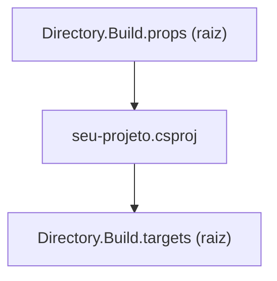

# Capítulo 01 — Fundação do repositório

> **Módulo 0 do roteiro.** Pré-requisito: [Capítulo 00](00-csharp-e-dotnet-do-zero.md).
> **Tempo:** 3 a 5 dias.
> **Entrega:** template `dotnet new` instalável que gera a estrutura usada por todos os capítulos seguintes.

## Por que este capítulo vem primeiro

Um dia de trabalho que economiza meses. Todo projeto seguinte nasce dentro desta base, e cada decisão aqui se multiplica por catorze.

O sintoma de quem pulou este capítulo é conhecido: seis projetos, quatro versões diferentes do mesmo pacote, warnings que ninguém lê porque são trezentos, e um build que passa na máquina de quem escreveu.

---

## 1. Fixando a versão do SDK

**Por que isso importa:** "na minha máquina funciona" quase sempre significa que a máquina de quem escreveu o código tem uma versão de ferramenta ligeiramente diferente da de quem vai rodar (outro desenvolvedor, ou o servidor de build). Esta seção elimina essa variável logo no primeiro arquivo do repositório.

> 📖 **Conceito: SDK × runtime**
> O **SDK** (Software Development Kit) é o pacote completo de ferramentas para *desenvolver* em .NET: o compilador, o `dotnet` CLI, os templates de projeto. O **runtime** é só a parte necessária para *executar* um programa .NET já compilado — sem compilador, sem ferramentas de build. Uma máquina de desenvolvimento tem o SDK instalado; um servidor de produção, muitas vezes, só precisa do runtime (ou nem isso, se o programa for publicado como um executável autocontido — assunto do Capítulo 10). `dotnet --version` mostra a versão do SDK ativo na pasta atual.

> 📖 **Conceito: CI (Continuous Integration / Integração Contínua)**
> CI é a prática de rodar automaticamente, a cada mudança de código enviada ao repositório, um conjunto de verificações (compilar, testar, checar formatação) num servidor separado da máquina de quem escreveu o código — normalmente hospedado pela própria plataforma de código (GitHub Actions, GitLab CI, etc.). A ideia central: se algo só funciona na máquina de um desenvolvedor específico, o CI expõe isso, porque ele roda num ambiente limpo, sempre igual. Este capítulo usa o CI como prova de que a fundação do repositório realmente funciona para qualquer pessoa, não só para quem a escreveu — a seção 8 mostra como configurar um.

O SDK instalado na sua máquina não é necessariamente o mesmo que o CI vai usar quando alguém enviar uma mudança para o repositório. `global.json` na raiz do repositório resolve isso, fixando exatamente qual versão do SDK deve ser usada:

```json
{
  "sdk": {
    "version": "10.0.100",
    "rollForward": "latestFeature",
    "allowPrerelease": false
  }
}
```

`rollForward` controla quanta liberdade o SDK tem de usar versão mais nova:

| Valor | Aceita |
|-------|--------|
| `disable` | exatamente `10.0.100` |
| `latestPatch` | `10.0.1xx` mais recente |
| `latestFeature` | qualquer `10.0.x00` mais recente — **recomendado** |
| `latestMajor` | qualquer versão mais nova, inclusive .NET 11 |

`latestFeature` dá previsibilidade sem travar o time num patch específico. Lendo o JSON acima: `"version": "10.0.100"` é a versão mínima exigida; `"rollForward": "latestFeature"` (ver tabela) permite usar uma versão um pouco mais nova se a exata não estiver instalada; `"allowPrerelease": false` recusa versões ainda em teste (release candidate, beta).

### TFM: `net10.0` e o resto

```xml
<TargetFramework>net10.0</TargetFramework>
```

Variantes que você vai encontrar:

- `net10.0` — multiplataforma, é o que o curso usa.
- `net10.0-windows` — acesso a APIs só do Windows.
- `netstandard2.0` — compatibilidade com .NET Framework. Só se você precisar publicar biblioteca para consumidor legado.
- `<TargetFrameworks>net10.0;net8.0</TargetFrameworks>` — multi-target, para biblioteca pública.

---

## 2. Solução: `.slnx` em vez de `.sln`

**Por que isso importa:** este curso vai crescer para vários projetos (`Cnab.Parsing`, `Cnab.Cli`, `Cnab.Worker`, etc., vistos na estrutura da seção 7). Sem um arquivo que amarre todos eles, você precisaria abrir e compilar cada um manualmente, um de cada vez.

> 📖 **Conceito: solução (solution)**
> Uma "solução" (`.sln` ou `.slnx`) não é código — é um arquivo que lista quais projetos (`.csproj`) fazem parte de um mesmo agrupamento lógico, permitindo abrir todos de uma vez num editor, ou compilar/testar todos com um único comando. Um projeto (`.csproj`) compila para um assembly (visto no Capítulo 00); uma solução agrupa vários projetos relacionados.

O formato `.sln` antigo é um formato proprietário, verboso, com GUIDs (identificadores longos e aleatórios) que geram conflito de merge (quando duas pessoas editam o mesmo arquivo em paralelo e o Git não consegue combinar as mudanças sozinho) toda vez que alguém cria um projeto novo. O `.slnx`, mais recente, é XML enxuto e legível:

```xml
<Solution>
  <Folder Name="/src/">
    <Project Path="src/Cnab.Parsing/Cnab.Parsing.csproj" />
    <Project Path="src/Cnab.Cli/Cnab.Cli.csproj" />
  </Folder>
  <Folder Name="/tests/">
    <Project Path="tests/Cnab.Parsing.Tests/Cnab.Parsing.Tests.csproj" />
  </Folder>
</Solution>
```

```bash
dotnet new sln --format slnx -n Cnab
dotnet sln add src/Cnab.Parsing/Cnab.Parsing.csproj
# migrar uma solução existente:
dotnet sln migrate
```

Ganho concreto: conflitos de merge em arquivo de solução praticamente desaparecem.

---

## 3. `Directory.Build.props` — configuração que desce a árvore

**Por que isso importa:** sem este arquivo, toda configuração de qualidade (seção seguinte) precisaria ser copiada e colada em cada um dos vários `.csproj` do repositório — e nenhuma cópia colada em vários lugares permanece igual por muito tempo; alguém esquece de atualizar uma.

> 📖 **Conceito: MSBuild**
> MSBuild é o motor de build por trás do comando `dotnet build` — o programa que efetivamente lê os arquivos `.csproj`/`.props`/`.targets` (todos XML) e decide, a partir deles, quais passos executar para produzir o resultado compilado. Quando você vê `<PropertyGroup>`, `<ItemGroup>`, `<Target>`, são todos conceitos do MSBuild, não do C# em si — é a "linguagem de configuração de build", separada da linguagem do programa.

O MSBuild procura, de cada `.csproj` para cima na árvore de pastas, um arquivo `Directory.Build.props` e o importa **antes** do projeto — ou seja, aplica as configurações dele antes de processar o `.csproj` em si. Um único arquivo na raiz do repositório, então, configura todos os projetos de uma vez.



A ordem importa: como o `.props` é importado **antes**, qualquer propriedade que ele define pode ser sobrescrita pelo `.csproj`. Como o `.targets` é importado **depois**, ele consegue ler e ajustar o que o `.csproj` já definiu — por isso é o lugar certo para regras condicionais como "se este projeto termina em `.Tests`, faça X" (a subseção logo adiante).

```xml
<!-- Directory.Build.props (raiz) -->
<Project>
  <PropertyGroup>
    <TargetFramework>net10.0</TargetFramework>
    <LangVersion>latest</LangVersion>
    <ImplicitUsings>enable</ImplicitUsings>
    <Nullable>enable</Nullable>

    <!-- qualidade -->
    <TreatWarningsAsErrors>true</TreatWarningsAsErrors>
    <WarningsNotAsErrors></WarningsNotAsErrors>
    <EnforceCodeStyleInBuild>true</EnforceCodeStyleInBuild>
    <AnalysisLevel>latest-recommended</AnalysisLevel>
    <EnableNETAnalyzers>true</EnableNETAnalyzers>

    <!-- build determinístico e depurável -->
    <Deterministic>true</Deterministic>
    <ContinuousIntegrationBuild Condition="'$(CI)' == 'true'">true</ContinuousIntegrationBuild>
    <PublishRepositoryUrl>true</PublishRepositoryUrl>
    <EmbedUntrackedSources>true</EmbedUntrackedSources>
    <DebugType>portable</DebugType>
    <IncludeSymbols>true</IncludeSymbols>
    <SymbolPackageFormat>snupkg</SymbolPackageFormat>

    <!-- metadados -->
    <Company>Exemplo</Company>
    <Authors>Time de Cobrança</Authors>
    <RepositoryUrl>https://github.com/exemplo/cnab-platform</RepositoryUrl>
  </PropertyGroup>

  <ItemGroup>
    <PackageReference Include="Roslynator.Analyzers" PrivateAssets="all" />
    <PackageReference Include="Meziantou.Analyzer" PrivateAssets="all" />
    <PackageReference Include="MinVer" PrivateAssets="all" />
  </ItemGroup>
</Project>
```

Repare que as referências acima **não têm atributo `Version`**. Isso não é esquecimento: é exatamente o que a seção 4 (Central Package Management) vai exigir — a versão de cada pacote mora num arquivo só. E como este `Directory.Build.props` desce para todos os projetos, essas três linhas bastam para que *todo* projeto do repositório ganhe os analyzers e o versionamento automático, sem tocar em nenhum `.csproj`.

> ⚠️ **Armadilha: o `PackageReference` de Source Link que você não deve adicionar**
> Praticamente todo exemplo na internet inclui `<PackageReference Include="Microsoft.SourceLink.GitHub" />` aqui. **Desde o .NET 8 o Source Link vem embutido no SDK** e a Microsoft recomenda remover o pacote — ele existe só para projetos que ainda usam SDK antigo. Mantê-lo não quebra o build, mas acrescenta uma dependência que não faz nada e que alguém vai ter que atualizar para sempre. As três propriedades logo acima (`PublishRepositoryUrl`, `EmbedUntrackedSources`, `DebugType`) são tudo de que o Source Link precisa; se o seu provedor não for GitHub (Azure DevOps, GitLab), aí sim o pacote específico dele continua sendo necessário.

`MinVer` entra aqui (e não em cada projeto) porque é ele que deriva o número de versão a partir das tags do Git — assunto da seção 6. É o que faz o critério de aceite "`git tag v0.1.0 && dotnet build` produz assembly `0.1.0`" funcionar sem você digitar versão em lugar nenhum.

Pontos que merecem explicação:

**`TreatWarningsAsErrors`** — a decisão mais impactante do arquivo. Sem ela, warnings acumulam até virarem ruído invisível. Com ela, o repositório fica permanentemente em zero. A migração de um projeto existente dói uma vez; depois nunca mais.

**`Deterministic` + `ContinuousIntegrationBuild`** — garante que compilar o mesmo código duas vezes produz binários byte a byte idênticos. Isso torna cache de build confiável e permite verificar reproducibilidade.

**Source Link** — embute no PDB a URL do commit exato. O resultado prático: no debugger, você entra no código-fonte de uma biblioteca sua (ou da própria BCL) sem tê-la clonado.

**`PrivateAssets="all"`** — o analyzer vale para compilar este projeto, mas não deve virar dependência de quem consome o pacote.

### `Directory.Build.targets` para regras específicas

O `.targets` é importado **depois** do projeto, então serve para sobrescrever coisas:

```xml
<Project>
  <PropertyGroup Condition="$(MSBuildProjectName.EndsWith('.Tests'))">
    <IsPackable>false</IsPackable>
    <IsTestProject>true</IsTestProject>
    <OutputType>Exe</OutputType>   <!-- xUnit v3: projeto de teste é executável (Capítulo 06) -->
  </PropertyGroup>
</Project>
```

A condição casa pelo **nome** do projeto, então qualquer `*.Tests` criado daqui em diante já nasce configurado. O `OutputType` surpreende quem vem do xUnit v2 e é a causa número um de "escrevi o teste e o `dotnet test` não acha nada" — o Capítulo 06 detalha o porquê; deixá-lo aqui desde o início evita que você tenha que voltar a este arquivo lá.

---

## 4. Central Package Management

**Por que isso importa:** imagine dois projetos do mesmo repositório usando duas versões diferentes do mesmo pacote de terceiros. Isso compila, e o bug que isso causa — comportamento diferente do "mesmo" pacote em cada lugar — costuma ser encontrado meses depois, com muito trabalho de investigação. CPM (Central Package Management) fecha essa porta no nascimento do projeto.

Sem CPM, cada `.csproj` declara suas próprias versões de pacote NuGet (conceito visto no Capítulo 00) e elas divergem em silêncio, sem nenhum aviso. Com CPM, a versão de cada pacote vive num lugar só, e todos os projetos do repositório são obrigados a usar a mesma.

```xml
<!-- Directory.Packages.props (raiz) -->
<Project>
  <PropertyGroup>
    <ManagePackageVersionsCentrally>true</ManagePackageVersionsCentrally>
    <CentralPackageTransitivePinningEnabled>true</CentralPackageTransitivePinningEnabled>
  </PropertyGroup>

  <ItemGroup>
    <PackageVersion Include="Microsoft.Extensions.Hosting" Version="10.0.0" />
    <PackageVersion Include="System.CommandLine" Version="2.0.0" />
    <PackageVersion Include="Spectre.Console" Version="0.49.1" />
    <PackageVersion Include="Roslynator.Analyzers" Version="4.13.1" />
    <PackageVersion Include="Meziantou.Analyzer" Version="2.0.188" />
    <PackageVersion Include="MinVer" Version="6.0.0" />

    <!-- testes: usados pelo projeto de teste do template (seção 7) e detalhados no Capítulo 06 -->
    <PackageVersion Include="xunit.v3" Version="1.1.0" />
    <PackageVersion Include="xunit.runner.visualstudio" Version="3.0.2" />
    <PackageVersion Include="Microsoft.NET.Test.Sdk" Version="17.12.0" />
  </ItemGroup>
</Project>
```

Os três últimos existem por um motivo prático: o template da seção 7 gera um projeto de teste, e o critério de aceite exige que a solução gerada **compile de primeira**. Sem eles declarados aqui, o projeto de teste nasce quebrado. O Capítulo 06 explica o que cada um faz e por que são três; por ora, basta que estejam versionados no mesmo lugar que todo o resto.

Nos projetos, a referência perde a versão:

```xml
<ItemGroup>
  <PackageReference Include="System.CommandLine" />
</ItemGroup>
```

> 📖 **Conceito: dependência transitiva**
> Se o seu projeto referencia o pacote A, e A por sua vez referencia o pacote B, então B é uma dependência **transitiva** sua: você nunca a pediu, mas ela é baixada e vai junto para produção. Um projeto real costuma ter algumas dezenas de dependências diretas e centenas de transitivas. Isso importa por segurança: quando uma falha é descoberta em B, você precisa atualizar B — mas você não controla B, e sim A. Sem *pinning* transitivo, você fica esperando o autor de A lançar uma versão nova que aponte para o B corrigido.

> 📖 **Conceito: CVE**
> CVE (*Common Vulnerabilities and Exposures*) é o identificador público padronizado de uma falha de segurança conhecida, no formato `CVE-2025-12345`. Quando alguém descobre uma vulnerabilidade numa biblioteca, ela recebe um CVE e entra em bases públicas — que é como o comando `dotnet list package --vulnerable` (seção 8) sabe avisar que um pacote seu tem problema conhecido.

`CentralPackageTransitivePinningEnabled` fixa também as dependências transitivas — importante para reagir a CVE sem esperar o pacote intermediário atualizar.

> 🐍 **Vindo de outra stack**
> — **Python:** `Directory.Packages.props` é o papel do `requirements.txt`/`pyproject.toml` com versões travadas, só que válido para todos os subprojetos do repositório de uma vez. O `packages.lock.json` (seção 8) é o equivalente ao `poetry.lock` ou `pip freeze`.
> — **Java:** é quase literalmente o `<dependencyManagement>` do POM pai no Maven — declarar a versão num lugar e os módulos filhos referenciarem sem versão. O `Directory.Build.props` é o POM pai.
> — **Go:** o `go.mod` já centraliza versões por módulo e o MVS resolve conflitos sozinho; o CPM traz para o .NET essa mesma garantia de "uma versão por dependência no repositório inteiro", que aqui não é automática.

> ⚠️ **Armadilha**
> Depois de ligar CPM, um `dotnet add package X` continua funcionando mas escreve a versão no `.csproj`, quebrando a regra. Use `dotnet add package X --no-restore` e mova a versão à mão, ou adicione direto no `Directory.Packages.props`.

---

## 5. `.editorconfig` — estilo que o build cobra

**Por que isso importa:** discussão de estilo de código em revisão de pull request ("põe chave na mesma linha", "isso deveria ser `var`") consome tempo de gente e gera atrito entre colegas por algo que uma ferramenta resolve sozinha. Esta seção automatiza essa parte para que a conversa em revisão de código fique só sobre o que realmente importa: se a lógica está certa.

> 📖 **Conceito: analyzer**
> Um analyzer é um programa que roda durante a compilação, lendo o código-fonte (não só compilando-o) e sinalizando padrões problemáticos — bugs prováveis, código que poderia ser mais simples, violação de convenção de nome. É automatizar parte do que um revisor humano faria numa revisão de código, mas de forma consistente e instantânea. Cada aviso de um analyzer tem uma **severidade** configurável: `suggestion` (sugestão discreta), `warning` (aviso visível mas não bloqueia o build) ou `error` (impede a compilação).

O `.editorconfig` não é só formatação de espaços e indentação: é onde você liga e desliga regras de analyzer com uma severidade escolhida.

```ini
root = true

[*]
charset = utf-8
end_of_line = lf
insert_final_newline = true
indent_style = space
indent_size = 4
trim_trailing_whitespace = true

[*.{json,yml,yaml,xml,csproj,props,targets,slnx}]
indent_size = 2

[*.cs]
# organização de usings
dotnet_sort_system_directives_first = true
csharp_using_directive_placement = outside_namespace:warning

# preferências modernas
csharp_style_namespace_declarations = file_scoped:error
csharp_style_var_for_built_in_types = true:suggestion
csharp_prefer_braces = true:warning
csharp_style_prefer_pattern_matching = true:suggestion

# regras que valem a pena como erro
dotnet_diagnostic.CA2007.severity = none      # ConfigureAwait: ver capítulo 03
dotnet_diagnostic.CA1848.severity = warning   # use LoggerMessage delegates
dotnet_diagnostic.CA1062.severity = none      # null check: nullable já cobre
dotnet_diagnostic.IDE0055.severity = error    # formatação
dotnet_diagnostic.RCS1090.severity = none

# nomenclatura: interface começa com I
dotnet_naming_rule.interfaces_prefixed_with_i.severity = error
dotnet_naming_rule.interfaces_prefixed_with_i.symbols = interfaces
dotnet_naming_rule.interfaces_prefixed_with_i.style = prefix_i
dotnet_naming_symbols.interfaces.applicable_kinds = interface
dotnet_naming_symbols.interfaces.applicable_accessibilities = *
dotnet_naming_style.prefix_i.required_prefix = I
dotnet_naming_style.prefix_i.capitalization = pascal_case
```

> ⚠️ **Armadilha**
> Uma regra de nomenclatura precisa das **três** partes (`dotnet_naming_rule`, `dotnet_naming_symbols`, `dotnet_naming_style`) completas, e `applicable_accessibilities` é obrigatório no bloco de símbolos. Faltando qualquer peça, a regra é **silenciosamente ignorada** — não há erro, não há aviso, ela simplesmente não vale. Depois de escrever uma, sempre confirme que ela pega: declare uma `interface Teste` sem o `I` e veja o build falhar.

Verificação no CI:

```bash
dotnet format --verify-no-changes --severity error
```

Discussão de estilo em code review passa a ser impossível: ou o `.editorconfig` cobra, ou não é assunto.

### Analyzers: quais valem a pena

| Analyzer | O que traz |
|----------|-----------|
| **Microsoft.CodeAnalysis.NetAnalyzers** | já vem no SDK; regras CA de correção e performance |
| **Roslynator** | ~500 refatorações e simplificações |
| **Meziantou.Analyzer** | as regras mais úteis para backend: `ConfigureAwait`, `CancellationToken` não propagado, `StringComparison` esquecido |
| **SonarAnalyzer.CSharp** | complexidade cognitiva, bug patterns |
| **Microsoft.VisualStudio.Threading.Analyzers** | sync-over-async, essencial antes do Capítulo 03 |

Comece com os três primeiros. Ligar tudo de uma vez num repositório existente gera milhares de erros e leva ao abandono.

---

## 6. Versionamento automático a partir do Git

**Por que isso importa:** um número de versão digitado manualmente num arquivo é uma fonte de erro humano boba, mas com consequência real — alguém esquece de atualizar, e dois builds diferentes acabam com o mesmo número de versão, tornando impossível saber depois qual código realmente está rodando em produção.

> 📖 **Conceito: tag do Git**
> Uma tag é um marcador que aponta para um commit específico no histórico do Git, tipicamente usado para marcar "este commit exato é a versão 1.2.0". Diferente de uma branch, uma tag normalmente não se move depois de criada — ela fixa um ponto no tempo do histórico do código. `git tag v1.2.0` cria essa marca no commit atual.

> 📖 **Conceito: versionamento semântico (SemVer)**
> É a convenção `MAIOR.MENOR.PATCH` (ex.: `1.2.0`) para numerar versões de forma que o número já comunique o tipo de mudança: incrementar **PATCH** significa correção de bug sem quebrar nada; **MENOR** significa funcionalidade nova, mas compatível com o que já existia; **MAIOR** significa que algo que funcionava antes pode ter parado de funcionar (breaking change). Praticamente todo pacote NuGet, npm ou similar segue essa convenção.

Nenhum número de versão digitado à mão. **MinVer** é uma ferramenta que deriva a versão automaticamente a partir das tags do Git:

```xml
<PropertyGroup>
  <MinVerTagPrefix>v</MinVerTagPrefix>
  <MinVerDefaultPreReleaseIdentifiers>alpha.0</MinVerDefaultPreReleaseIdentifiers>
</PropertyGroup>
```

```bash
git tag v1.2.0 && dotnet build     # → 1.2.0
git commit -m "fix" && dotnet build # → 1.2.1-alpha.0.1
```

Lendo a segunda linha: depois de um commit novo *além* da tag `v1.2.0`, MinVer não pode mais chamar aquilo de `1.2.0` — aquele código já não é o que foi marcado. Então ele incrementa o patch e marca como pré-lançamento: `1.2.1-alpha.0.1`, onde o `.1` final é a **altura do commit**, ou seja, quantos commits se passaram desde a tag. Commite de novo e vira `.2`. O efeito prático é que todo build tem um número único e rastreável até o commit exato, sem ninguém editar arquivo nenhum.

**Como conferir que funcionou.** O jeito mais direto de ver o número que o MinVer calculou é empacotar e olhar o nome do arquivo gerado, que sempre carrega a versão:

```bash
git tag v0.1.0
dotnet pack -o ./artifacts
ls ./artifacts          # → Cnab.Parsing.0.1.0.nupkg
```

> ⚠️ **Armadilha**
> MinVer lê tags do Git. Num repositório recém-criado que ainda **não tem nenhum commit**, ou numa cópia clonada sem as tags, não há de onde derivar versão e tudo vira `0.0.0-alpha.0`. Antes de testar, garanta que existe pelo menos um commit e que a tag aponta para ele (`git log --oneline --decorate -1` deve mostrar a tag ao lado do commit).

Alternativa com mais recursos (versionamento por branch, altura de commit configurável): **Nerdbank.GitVersioning**. Para o curso, MinVer basta.

---

## 7. Estrutura de diretórios

**Por que isso importa:** todo capítulo seguinte deste curso assume esta estrutura de pastas. Se ela não estiver clara agora, cada capítulo futuro vai forçar uma volta a esta seção para lembrar "onde é que esse novo projeto entra".

```
cnab-platform/
├── .editorconfig
├── .gitignore                  # dotnet new gitignore
├── .vscode/
│   └── extensions.json         # extensões recomendadas a quem clonar
├── global.json
├── Directory.Build.props
├── Directory.Build.targets
├── Directory.Packages.props
├── nuget.config
├── Cnab.slnx
├── README.md                   # ← onde vão os números medidos de cada capítulo
├── docs/
│   └── adr/                    # Architecture Decision Records
│       └── 0001-parsing-sem-alocacao.md
├── src/
│   ├── Cnab.Parsing/
│   ├── Cnab.Pipeline/
│   ├── Cnab.Cli/
│   └── Cnab.Worker/
├── tests/
│   ├── Cnab.Parsing.Tests/
│   └── Cnab.Integration.Tests/
├── benchmarks/
│   └── Cnab.Benchmarks/
└── samples/                    # massa sintética, nunca dado real
```

### `.vscode/extensions.json`

O `.editorconfig` da seção 5 garante que todo mundo **formate** igual. Este arquivo resolve o passo anterior: garantir que todo mundo tenha a ferramenta que lê aquele `.editorconfig`.

```json
{
  "recommendations": [
    "ms-dotnettools.csdevkit"
  ]
}
```

Quando alguém abre o repositório no VS Code pela primeira vez, o editor mostra uma notificação oferecendo instalar as extensões recomendadas — e a pessoa entra no projeto já com IntelliSense, depurador e painel de testes funcionando, sem uma seção de "como configurar seu ambiente" no README que ninguém lê.

Uma só recomendação basta: o **C# Dev Kit** traz a extensão C# base como dependência. Resista à tentação de listar dez extensões de preferência pessoal aqui — `recommendations` é um pedido que aparece para todo mundo do time, e uma lista longa vira ruído que as pessoas aprendem a dispensar.

> **Por que isto entra no template e não só no seu repositório:** é exatamente o mesmo raciocínio do `global.json` (seção 1) e do `Directory.Packages.props` (seção 4) — tudo que é necessário para o projeto compilar e ser trabalhado do mesmo jeito por qualquer pessoa vive **no repositório**, versionado, não nas instruções orais de quem já está lá dentro.

> ⚠️ **Armadilha**
> Não commite `.vscode/settings.json` com preferências pessoais (tema, tamanho de fonte, atalhos) — isso se sobrepõe às configurações de quem clonar e gera atrito. Configuração de **estilo de código** pertence ao `.editorconfig`, que vale para qualquer editor; o `.vscode/` deve conter só o que é específico da ferramenta e útil para todos.

> 📖 **Conceito: ADR (Architecture Decision Record)**
> Um ADR é um documento curto, geralmente um arquivo Markdown, que registra uma decisão de arquitetura já tomada — não o que foi decidido só, mas por quê, quais alternativas foram consideradas, e quais as consequências aceitas dessa escolha. A ideia é que, meses depois, alguém lendo o ADR entenda o raciocínio sem precisar perguntar a quem decidiu (que pode nem estar mais no time).

O `docs/adr/` não é enfeite. Cada capítulo toma uma decisão arquitetural com trade-off real, e o critério de aceite do capstone (Capítulo 15) exige que elas estejam registradas. Formato mínimo:

```markdown
# ADR 0001 — Parsing posicional sem alocação

## Contexto
Arquivos de retorno chegam com até 5 milhões de linhas...

## Decisão
Ler direto de ReadOnlySpan<byte> sem materializar string por campo.

## Consequências
+ Alocação por registro próxima de zero (medido: 24 B vs 1,8 kB)
− Código mais difícil de ler; exige testes de propriedade
```

### `nuget.config`

```xml
<configuration>
  <packageSources>
    <clear />
    <add key="nuget.org" value="https://api.nuget.org/v3/index.json" />
  </packageSources>
  <packageSourceMapping>
    <packageSource key="nuget.org">
      <package pattern="*" />
    </packageSource>
  </packageSourceMapping>
</configuration>
```

O `<clear />` evita herdar feeds da máquina. **Package source mapping** previne ataque de confusão de dependência — quando um pacote interno homônimo é publicado no nuget.org público e o restore pega o errado. Quando você adicionar um feed corporativo (Capítulo 13), mapeie os prefixos explicitamente.

---

## 8. CI mínimo

O pipeline abaixo roda em sequência; qualquer etapa que falhar interrompe as seguintes:


```yaml
# .github/workflows/ci.yml
name: CI
on: [push, pull_request]

jobs:
  build:
    runs-on: ubuntu-latest
    steps:
      - uses: actions/checkout@v4
        with: { fetch-depth: 0 }        # MinVer precisa do histórico e das tags
      - uses: actions/setup-dotnet@v4
        with: { global-json-file: global.json }

      - run: dotnet restore --locked-mode
      - run: dotnet format --verify-no-changes --severity error
      - run: dotnet build --no-restore -c Release
      - run: dotnet test --no-build -c Release --logger trx
      - run: dotnet list package --vulnerable --include-transitive
```

O que cada linha do YAML faz: `on: [push, pull_request]` diz para rodar este pipeline a cada envio de código e a cada pull request aberto. `runs-on: ubuntu-latest` escolhe em qual sistema operacional o job roda — uma máquina Linux nova, provisionada só para esta execução. Cada item de `steps:` roda em sequência, um após o outro: `actions/checkout@v4` baixa o código do repositório para essa máquina; `actions/setup-dotnet@v4` instala o SDK do .NET (usando a versão do `global.json`, seção 1); as linhas seguintes com `run:` executam comandos de shell comuns, os mesmos que você rodaria localmente no terminal. Se qualquer `run:` retornar um código de erro, o pipeline inteiro para e é marcado como falho — por isso a ordem (formatação antes de build, build antes de teste) importa: falhar cedo economiza tempo de espera.

`--locked-mode` exige `packages.lock.json` (um arquivo que fixa exatamente qual versão de cada dependência, inclusive dependências indiretas, foi usada) commitado e falha se algo divergir. Restaura exatamente as mesmas versões todas as vezes. Para habilitar:

```xml
<RestorePackagesWithLockFile>true</RestorePackagesWithLockFile>
```

> ⚠️ **Armadilha**
> `fetch-depth: 0` é obrigatório. Sem histórico completo, MinVer não enxerga as tags e toda build vira `0.0.0-alpha.0`.

---

## 9. Exercícios

Todos estes são feitos numa pasta descartável (`dotnet new console -o Sandbox` dentro de um `git init`), não no template final. O objetivo é **ver a ferramenta reclamar** — cada exercício provoca de propósito um erro que você vai encontrar de verdade mais para a frente, para que a primeira vez não seja em produção.

1. **`global.json` que trava.** Crie um `global.json` com `"version": "99.0.100"` e `"rollForward": "disable"`. Rode `dotnet build` e leia a mensagem de erro inteira. Depois troque para `latestFeature` e explique, em uma frase no seu README, por que agora funciona.

2. **Provando a herança do `.props`.** Com um `Directory.Build.props` na raiz definindo `<Nullable>enable</Nullable>`, crie dois projetos em subpastas diferentes. Confirme que ambos herdaram a propriedade sem nenhuma linha nos `.csproj` — use `dotnet build -getProperty:Nullable` em cada um. Depois sobrescreva a propriedade em **um** dos `.csproj` e confirme que só aquele mudou. Isso demonstra a regra da seção 3: o `.props` vem antes, então o projeto ganha a palavra final.

3. **Zero warning na prática.** Com `TreatWarningsAsErrors` ligado, escreva `string nome = null;` (o warning CS8600 do Capítulo 00, seção 4). Confirme que o build **falha**, não apenas avisa. Agora corrija de três formas diferentes — `string?`, um valor não-nulo, e `= null!` — e escreva qual das três você não deveria usar e por quê.

4. **CPM cobrando a regra.** Com `ManagePackageVersionsCentrally` ligado, adicione `<PackageReference Include="Spectre.Console" Version="0.49.1" />` (com `Version`) num `.csproj`. Rode `dotnet restore` e leia o erro `NU1008`. Corrija movendo a versão para o `Directory.Packages.props`. Esta é exatamente a armadilha da seção 4 — provoque-a uma vez de propósito.

5. **`.editorconfig` com severidade.** Coloque `dotnet_diagnostic.IDE0055.severity = error` e desformate um arquivo de propósito (indentação errada, chave fora de lugar). Confirme que `dotnet format --verify-no-changes --severity error` falha, e que `dotnet format` sozinho conserta. Depois baixe a severidade para `suggestion` e observe que a verificação passa a aceitar o arquivo torto — é assim que você calibra o rigor do repositório.

6. **Versão que vem do Git.** Num repositório com pelo menos um commit, rode `dotnet pack` **sem nenhuma tag** e anote o nome do `.nupkg` gerado. Crie `git tag v0.3.0`, empacote de novo e compare. Faça mais um commit, empacote uma terceira vez e explique o sufixo que apareceu (seção 6).

7. **MSBuild de verdade** *(o mais difícil — faça por último)*. Escreva um alvo que falha o build se algum arquivo `.cs` passar de 500 linhas. A regra em si não é sagrada; o ponto é que escrever um `Target` com `<Error>` ensina mais sobre MSBuild do que ler a documentação.

   ```xml
   <Target Name="ChecarTamanhoDeArquivo" BeforeTargets="Build">
     <!-- dica: <ReadLinesFromFile> devolve as linhas como itens;
          o metadado %(Identity) e a função de item Count() ajudam;
          <Error Condition="..." Text="..." /> interrompe o build -->
   </Target>
   ```

   Comece fazendo o alvo apenas **imprimir** o nome de cada `.cs` com `<Message Importance="high" Text="..." />` — ver o alvo rodar antes de tentar fazê-lo falhar economiza muita frustração.

---

## 📦 Projeto: template base do repositório

### Enunciado

Um template `dotnet new` instalável que gera a estrutura acima já configurada, com uma biblioteca e um projeto de teste vazios prontos para compilar. Um **template** é um projeto "molde": em vez de copiar e colar uma pasta de projeto antigo toda vez que precisar de uma nova, `dotnet new cnab-sln -n Cobranca` gera a estrutura inteira, já renomeada, num comando — é o mesmo conceito por trás de `dotnet new console` que você já usou no Capítulo 00, só que agora é você quem define o molde.

### Estrutura do template

```
template-cnab/
├── CnabTemplate.csproj          # projeto de empacotamento
└── content/
    └── CnabSolution/
        ├── .template.config/
        │   └── template.json
        ├── .editorconfig
        ├── .gitignore                # dotnet new gitignore (ver armadilhas)
        ├── .vscode/
        │   └── extensions.json
        ├── global.json
        ├── Directory.Build.props
        ├── Directory.Build.targets   # regras por tipo de projeto (seção 3)
        ├── Directory.Packages.props
        ├── nuget.config
        ├── CnabSolution.slnx
        ├── src/CnabSolution.Core/CnabSolution.Core.csproj
        └── tests/CnabSolution.Core.Tests/CnabSolution.Core.Tests.csproj
```

```json
// content/CnabSolution/.template.config/template.json
{
  "$schema": "http://json.schemastore.org/template",
  "author": "Seu Nome",
  "classifications": ["Solution", "Backend"],
  "identity": "Cnab.Solution.Template",
  "name": "Solução base de processamento de arquivos",
  "shortName": "cnab-sln",
  "sourceName": "CnabSolution",
  "tags": { "language": "C#", "type": "solution" },
  "preferNameDirectory": true,
  "symbols": {
    "ComTestes": {
      "type": "parameter",
      "datatype": "bool",
      "defaultValue": "true",
      "description": "Inclui projeto de testes"
    }
  },
  "sources": [{
    "modifiers": [{
      "condition": "(!ComTestes)",
      "exclude": ["tests/**"]
    }]
  }]
}
```

`sourceName` é o valor que o motor de template substitui: gerar com `-n Cobranca` troca toda ocorrência de `CnabSolution` por `Cobranca`, em nome de arquivo, diretório e conteúdo.

```xml
<!-- CnabTemplate.csproj -->
<Project Sdk="Microsoft.NET.Sdk">
  <PropertyGroup>
    <PackageType>Template</PackageType>
    <PackageId>Cnab.Templates</PackageId>
    <TargetFramework>net10.0</TargetFramework>
    <IncludeContentInPack>true</IncludeContentInPack>
    <IncludeBuildOutput>false</IncludeBuildOutput>
    <ContentTargetFolders>content</ContentTargetFolders>
    <NoWarn>NU5128</NoWarn>
    <EnableDefaultItems>false</EnableDefaultItems>
  </PropertyGroup>
  <ItemGroup>
    <Content Include="content/**/*" Exclude="content/**/bin/**;content/**/obj/**" />
  </ItemGroup>
</Project>
```

Instalar e usar:

```bash
dotnet pack -o ./artifacts
dotnet new install ./artifacts/Cnab.Templates.0.1.0.nupkg   # a versão vem da tag Git (seção 6)
dotnet new cnab-sln -n MinhaCobranca
cd MinhaCobranca && dotnet build
```

### ✅ Critério de aceite

- [ ] `dotnet new cnab-sln -n Qualquer` gera solução que compila de primeira.
- [ ] `dotnet build` passa **sem nenhum warning**, com `TreatWarningsAsErrors` ligado.
- [ ] Todas as versões de pacote vivem num único `Directory.Packages.props`; nenhum `.csproj` contém `Version=`.
- [ ] `dotnet format --verify-no-changes` passa no projeto recém-gerado.
- [ ] `git tag v0.1.0 && dotnet pack -o ./artifacts` produz um arquivo chamado `*.0.1.0.nupkg` — a versão veio da tag, não de um arquivo editado à mão (seção 6).
- [ ] O parâmetro `--ComTestes false` omite a pasta `tests/`.
- [ ] Abrir o projeto gerado no VS Code (`code .`) oferece instalar o C# Dev Kit, carrega o projeto sem erro, e **F5 roda** — sem nenhum passo manual de configuração.
- [ ] O CI do template roda em menos de dois minutos.

### Armadilhas deste projeto

- **Testar o template sem desinstalar a versão anterior.** `dotnet new install` não sobrescreve silenciosamente: se você empacotar de novo com o mesmo número de versão, o motor pode continuar usando o template antigo em cache e você vai jurar que sua mudança não teve efeito. Use `dotnet new uninstall Cnab.Templates` antes de reinstalar.
- **`sourceName` que casa demais.** O motor troca *toda* ocorrência do texto em `sourceName` — inclusive dentro de comentários e de palavras maiores. Escolher um `sourceName` curto ou genérico (como `Cnab`) faz substituições aparecerem onde você não queria. `CnabSolution` é específico o bastante de propósito.
- **Esquecer `bin/` e `obj/` no pacote.** Se você empacotar depois de ter compilado o conteúdo do template, esses diretórios vão junto e o template gerado nasce com lixo de build dentro. É o que o `Exclude` no `<Content Include=...>` acima evita — confira que ele está lá.
- **Template gerado sem `.gitignore`.** A estrutura da seção 7 lista o arquivo, mas ele só existe se você o criar (`dotnet new gitignore`). Sem ele, o primeiro `git add .` no projeto gerado commita `bin/` e `obj/` inteiros.

Se você fez o exercício 7 da seção anterior, incorpore o alvo de checagem de tamanho ao `Directory.Build.targets` do template — assim todo projeto gerado já nasce com a regra.

---

## Checklist de saída

- [ ] Sei a diferença entre `Directory.Build.props` e `.targets` e quando usar cada um.
- [ ] Meu repositório está em zero warning e isso é cobrado pelo build.
- [ ] Nenhuma versão de pacote aparece num `.csproj`.
- [ ] Versão vem da tag Git, nunca de arquivo editado à mão.
- [ ] Sei o que package source mapping previne.
- [ ] Tenho um `docs/adr/` com pelo menos um ADR escrito.

## Para ir além

- MSBuild reference — `learn.microsoft.com/visualstudio/msbuild`
- Central Package Management — `learn.microsoft.com/nuget/consume-packages/central-package-management`
- Templates customizados — `learn.microsoft.com/dotnet/core/tools/custom-templates`
- ADRs — `adr.github.io`

➡️ **Próximo:** [Capítulo 02 — Runtime, type system e memória](02-runtime-type-system-memoria.md)
