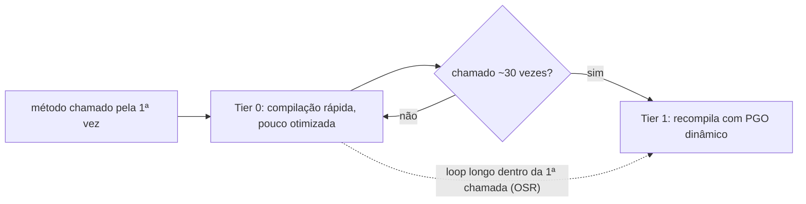
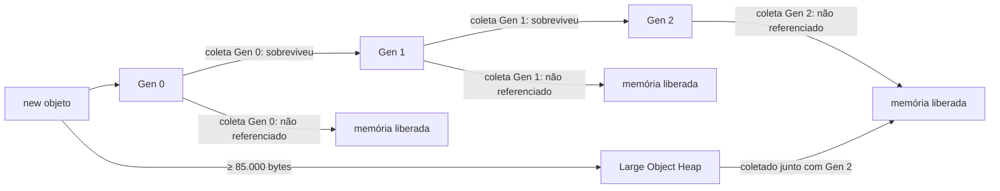
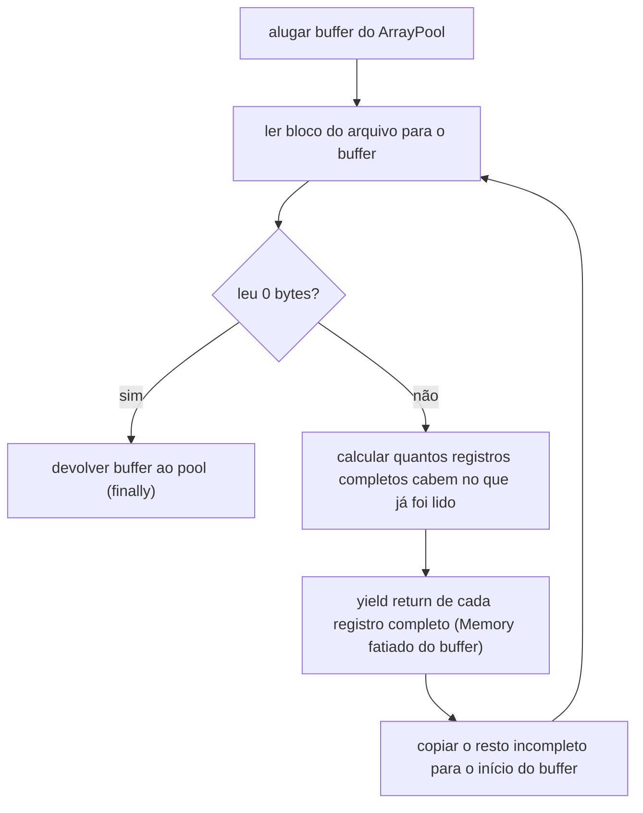

# Capítulo 02 — Runtime, type system e memória

> **Módulo 1 do roteiro.** Pré-requisito: [Capítulo 01](01-fundacao-do-repositorio.md).
> **Tempo:** 2 a 3 semanas. É o capítulo mais denso do curso.
> **Entrega:** parser posicional sem alocação, com benchmark contra a versão ingênua do Capítulo 00.

## Por que este capítulo existe

Entender onde a memória nasce e morre é o que separa código que escala de código que só funciona em demonstração. Um parser de CNAB que aloca 1,8 kB por registro processa 100 mil linhas sem reclamar e derruba o pod em 5 milhões. O código é o mesmo; a escala é que expõe.

---

## 1. O CLR por dentro

**Por que isso importa:** o Capítulo 00 apresentou o JIT numa frase — "traduz IL para código nativo na primeira chamada". Essa frase basta para escrever código, mas não para *medir* código. Esta seção abre a caixa porque o projeto deste capítulo é inteiramente sobre medição, e a primeira coisa que engana quem mede .NET é que o mesmo método, chamado duas vezes, pode estar rodando em duas versões compiladas diferentes.

### 1.1 Carregamento e JIT

Quando o processo sobe:

1. O host carrega o runtime e o assembly de entrada.
2. Cada tipo é carregado sob demanda, na primeira vez que é tocado.
3. Cada método é compilado de IL para nativo **na primeira chamada** — isso é o JIT.

Compilar em runtime parece desvantagem, e no startup é. Em troca, o JIT sabe coisas que um compilador estático não sabe: a arquitetura exata da CPU, quais branches são tomados, qual tipo concreto está por trás da interface.

### 1.2 Tiered compilation

O JIT enfrenta um dilema: compilar bem demora, e demorar atrasa o início do programa. Se ele otimizasse cada método a fundo na primeira chamada, todo app .NET levaria muito tempo para subir. Se nunca otimizasse, todo app seria lento para sempre. A solução do .NET é não escolher: compilar mal e rápido primeiro, e recompilar bem depois — mas só o que provar que vale a pena.

O .NET compila em camadas:

- **Tier 0** — compilação rápida, código pouco otimizado. Serve para o método começar a rodar já.
- **Tier 1** — depois de ~30 chamadas, o método é recompilado com otimização plena, usando **PGO dinâmico** (definido abaixo).

> 📖 **Conceito: PGO (Profile-Guided Optimization)**
> Otimização guiada por perfil é compilar usando informação sobre como o código *realmente se comportou ao rodar*, em vez de só o que está escrito no fonte. Enquanto a versão Tier 0 de um método executa, o runtime coleta estatísticas: qual lado deste `if` é tomado em 99% das vezes, qual tipo concreto aparece por trás desta interface. Na recompilação para Tier 1, o JIT usa esses números — põe o caminho comum em sequência na memória, e substitui chamadas de interface por chamadas diretas quando um único tipo domina (o que permite até embutir o corpo do método chamado, eliminando a chamada). É "dinâmico" porque o perfil vem da execução atual, não de um arquivo gravado numa execução anterior. Um compilador estático, como o de Go ou C, não tem acesso a essa informação — é o que o .NET compra em troca do custo do JIT.

> 📖 **Conceito: OSR (On-Stack Replacement)**
> O esquema de camadas tem um furo: ele promove um método na *próxima chamada*. Mas e o método que é chamado **uma vez só** e passa horas dentro de um laço processando 5 milhões de linhas — exatamente o parser deste capítulo? Nunca haveria uma próxima chamada; ele ficaria preso em Tier 0 para sempre. OSR resolve isso substituindo o código de uma chamada **em andamento**: o runtime compila a versão otimizada, transfere o estado (variáveis locais, posição do laço) do frame antigo para o novo, e a execução continua do ponto exato onde estava, agora em código rápido. Você não faz nada para ativá-lo — é bom saber que existe para entender por que um laço longo acelera sozinho no meio do caminho.



Consequência prática para benchmark: **as primeiras iterações medem Tier 0, não o código real.** É por isso que o BenchmarkDotNet tem fase de warmup, e por isso medir com `Stopwatch` num loop curto produz número errado.

```bash
# ver o efeito
DOTNET_TieredCompilation=0 dotnet run -c Release   # só Tier 1: startup lento, pico imediato
DOTNET_TieredPGO=0 dotnet run -c Release           # desliga PGO dinâmico
```

---

## 2. Onde a memória mora

**Por que isso importa:** todo o resto deste capítulo — por que `struct` é diferente de `class`, por que boxing é caro, por que `Span<T>` existe — só faz sentido depois que "pilha" e "heap" (introduzidos rapidamente no Capítulo 00) estiverem realmente claros. Esta seção é a fundação técnica do capítulo mais denso do curso.

### 2.1 Pilha e heap

> 📖 **Conceito: pilha (stack) e heap, em detalhe**
> A **pilha** é uma região de memória organizada como... uma pilha: cada chamada de método empilha um novo "frame" (bloco) com suas variáveis locais, e esse frame é removido automaticamente assim que o método retorna — sempre na ordem inversa de chamada (o último método chamado é o primeiro a desempilhar). É rápida porque alocar ali é só mover um ponteiro, e liberar é automático, sem intervenção do GC. O **heap gerenciado** é uma região de memória maior, compartilhada por todo o programa, onde vivem os objetos cujo tempo de vida não segue a ordem simples de chamadas de método — um objeto pode ser criado num método e continuar vivo muito depois desse método já ter retornado, se alguém ainda guardar uma referência a ele. É por isso que o heap precisa do GC: ninguém sabe, só de olhar a pilha, quando um objeto do heap deixou de ser necessário.

```csharp
void Exemplo()
{
    int a = 42;                       // pilha: 4 bytes no frame do método
    var p = new PosicaoCampo(1, 3);   // struct → pilha (é um valor local)
    var lista = new List<int>();      // referência na pilha, objeto no heap
}
```

No exemplo acima: `int a = 42;` mora na pilha porque é um valor simples, local ao método. `var p = new PosicaoCampo(1, 3);` — `PosicaoCampo` é um `record struct` (Capítulo 00) — também mora na pilha, porque structs são tipos de valor. `var lista = new List<int>();` é diferente: `List<int>` é uma `class`, então o objeto real fica no heap; o que mora na pilha é só a variável `lista`, que guarda o endereço de onde esse objeto está no heap (a "referência", ver Capítulo 00, seção 3.1).

Resumindo os dois lugares: **pilha** — por thread, cerca de 1 MB por padrão. Liberação automática ao sair do escopo (do método). Rapidíssima. **Heap gerenciado** — onde vivem os objetos criados com `new` a partir de uma `class`. Liberação pelo GC, em algum momento futuro, não imediatamente.

Uma `struct` não está "na pilha" por definição, apesar do exemplo acima sugerir isso — ela está **inline onde o dono está**: se a struct é uma variável local, ela mora na pilha; mas um campo `struct` dentro de uma `class` mora no heap, junto com o resto da classe, porque é ali que a classe inteira está. É por isso que a regra "struct é rápida porque está na pilha" (comum de se ouvir) é uma simplificação — o correto é "struct evita uma alocação separada, ficando embutida onde já estiver".

### 2.2 O GC: gerações

O GC do .NET é generacional, por uma hipótese empírica: a maioria dos objetos morre jovem.

| Geração | Contém | Coleta |
|---------|--------|--------|
| **Gen 0** | objetos recém-alocados | muito frequente, muito barata |
| **Gen 1** | sobreviveram a uma coleta de Gen 0 | intermediária; funciona como buffer |
| **Gen 2** | sobreviveram a Gen 1 | rara e cara — percorre o heap inteiro |
| **LOH** | objetos ≥ 85.000 bytes | coletado junto com Gen 2 |
| **POH** | objetos fixados (pinned) | evita fragmentar o resto |

Coleta Gen 0 leva microssegundos. Gen 2 com heap de vários GB pode levar centenas de milissegundos — e, no modo errado, para todas as threads.

**A regra que governa tudo:** alocar demais empurra objetos para Gen 1 e Gen 2. O custo de um objeto não é o `new`; é a promoção que ele causa.



Cada seta de "sobreviveu" é uma cópia que o GC faz — cara. Um objeto que nasce e morre ainda em Gen 0 é o caso barato; um objeto que sobrevive até Gen 2 pagou três cópias antes de finalmente ser liberado (ou pior, ficar preso lá por muito tempo, o cenário de vazamento lento).

### 2.3 LOH: o detalhe que morde

Um `byte[]` de 100.000 elementos vai para o LOH. O LOH **não é compactado por padrão**, então ele fragmenta: você pode ter 500 MB livres e falhar ao alocar 200 kB contíguos.

Ler um arquivo de retorno de 300 MB com `File.ReadAllBytes` cria um array de 300 MB no LOH. Fazer isso a cada arquivo, em paralelo, é receita de `OutOfMemoryException` com memória sobrando.

```csharp
using System.Runtime;   // GCSettings mora aqui, não em System nem em System.GC

// compactar o LOH sob demanda — caro, use com parcimônia
GCSettings.LargeObjectHeapCompactionMode = GCLargeObjectHeapCompactionMode.CompactOnce;
GC.Collect();
```

### 2.4 Workstation vs Server GC

| Modo | Heaps | Comportamento |
|------|-------|---------------|
| **Workstation** | um | otimiza latência; padrão em console e desktop |
| **Server** | um por core | otimiza throughput; padrão em ASP.NET Core |

```xml
<PropertyGroup>
  <ServerGarbageCollection>true</ServerGarbageCollection>
  <ConcurrentGarbageCollection>true</ConcurrentGarbageCollection>
</PropertyGroup>
```

> ⚠️ **Armadilha de container**
> Server GC aloca estruturas por core **da máquina**, não do limite do container. Num pod com `limits.cpu: 1` rodando num nó de 64 cores, o GC pode criar 64 heaps e consumir memória à toa. Em .NET moderno o runtime respeita cgroups na maioria dos casos, mas **meça**: `DOTNET_GCHeapHardLimit` e `DOTNET_GCHeapCount` existem para quando não respeita. O Capítulo 13 volta a isso.

### 2.5 Modos de latência

`GCSettings.LatencyMode` é uma propriedade estática global do processo, não um recurso descartável — então ela se atribui e se restaura à mão:

```csharp
using System.Runtime;   // idem à seção 2.3

var anterior = GCSettings.LatencyMode;
GCSettings.LatencyMode = GCLatencyMode.SustainedLowLatency;
try
{
    // trecho sensível a pausa
}
finally
{
    GCSettings.LatencyMode = anterior;   // sempre restaure: o efeito é do processo inteiro
}
```

Para worker de lote, o modo padrão serve. Para trecho crítico curto, `GC.TryStartNoGCRegion(totalSize)` garante que nenhuma coleta acontece — se você conseguir estimar o orçamento.

---

## 3. Descarte determinístico — de verdade

**Por que isso importa:** esta seção aprofunda o `IDisposable`/`using` já visto no Capítulo 00, agora explicando o mecanismo por dentro — por que um `finalizer` (definido abaixo) não é a solução, mesmo parecendo uma rede de segurança conveniente.

O GC libera **memória gerenciada**, quando decide. Ele não libera handle de arquivo, socket ou conexão — recursos que pertencem ao sistema operacional, não à memória do processo .NET. Isso é seu trabalho, feito através de `IDisposable` (visto no Capítulo 00):

```csharp
public sealed class LeitorDeRetorno : IDisposable, IAsyncDisposable
{
    private readonly FileStream _stream;
    private bool _disposed;

    public LeitorDeRetorno(string caminho)
        => _stream = new FileStream(caminho, FileMode.Open, FileAccess.Read,
                                    FileShare.Read, bufferSize: 64 * 1024,
                                    FileOptions.SequentialScan | FileOptions.Asynchronous);

    public void Dispose()
    {
        if (_disposed) return;
        _stream.Dispose();
        _disposed = true;
    }

    public async ValueTask DisposeAsync()
    {
        if (_disposed) return;
        await _stream.DisposeAsync();
        _disposed = true;
    }
}
```

### Por que evitar finalizers

> 📖 **Conceito: finalizer**
> Um finalizer (a sintaxe `~NomeDaClasse() { }`) é um método especial que o GC chama automaticamente antes de liberar a memória de um objeto, como uma "última chance" de limpeza. Parece resolver o problema de "e se alguém esquecer de chamar `Dispose()`?" — mas o preço é alto, listado abaixo.

```csharp
~MinhaClasse() { }   // quase sempre errado
```

Um objeto com finalizer:

- não é coletado na primeira passagem: vai para a fila de finalização e sobrevive pelo menos mais uma geração;
- é finalizado por uma thread dedicada, em ordem indeterminada;
- pode nem rodar no shutdown do processo.

Só implemente finalizer se sua classe possuir **diretamente** um recurso não gerenciado (um `IntPtr` de P/Invoke). Se ela só possui outros `IDisposable`, não precisa. Prefira `SafeHandle`, que já traz a finalização correta.

---

## 4. `struct` vs `class` — o trade-off real

**Por que isso importa:** o Capítulo 00 já apresentou a tabela "quando usar cada um" como regra prática. Esta seção mostra os números reais por trás dessa regra — para que a escolha deixe de ser uma regra decorada e vire algo que você sabe justificar.

```csharp
public class RegistroClass { public int A, B; }       // 24 bytes no heap (16 de header + 8)
public struct RegistroStruct { public int A, B; }     // 8 bytes, inline
```

Uma `class` custa, além dos campos em si: 8 bytes de **object header** (metadados internos que todo objeto no heap carrega, usados por exemplo para lock e para identificar o tipo em runtime), 8 bytes de **method table pointer** (um ponteiro para a tabela que descreve os métodos do tipo — é o que permite o CLR saber, em runtime, qual código rodar) em processadores de 64 bits, e alinhamento (arredondamento para múltiplos de um tamanho fixo, por razões de eficiência de acesso à memória). Para um objeto de apenas dois inteiros (8 bytes de dado útil), esse overhead de 16 bytes fixos é 200% do tamanho do dado real.

**Use `struct` quando:** o tipo é pequeno (≤ 16 bytes é a orientação clássica, mas meça), imutável, e é criado em altíssimo volume.

**Use `class` quando:** tem identidade, é grande, ou é passado muito (cópia de struct grande custa mais que copiar uma referência).

### 4.1 Boxing: o custo escondido

> 📖 **Conceito: boxing**
> Boxing é a conversão automática e silenciosa de um valor de tipo de valor (`struct`, `int`, etc.) para um tipo de referência (`object` ou uma interface) — o CLR precisa "empacotar" o valor dentro de um objeto de verdade no heap, porque um `object` só sabe segurar referências, nunca um valor puro. Essa conversão é implícita: nada no código parece indicar que uma alocação vai acontecer, o que a torna fácil de não perceber até medir.

```csharp
int x = 42;
object o = x;                      // BOXING: aloca no heap
IComparable c = x;                 // BOXING: struct → interface

// num loop de 5 milhões, isso é 5 milhões de alocações
foreach (var item in lista)
    Console.WriteLine("Valor: " + item);   // se item é struct, ToString via object → boxing
```

Onde boxing costuma se esconder:

- `struct` convertida para interface;
- `string.Format` / interpolação com struct em contexto `object`;
- coleções não genéricas (`ArrayList`, `Hashtable`) — nunca use;
- `Enum.HasFlag` em versões antigas;
- `IEquatable<T>` não implementado: comparação cai em `Equals(object)`.

```csharp
// sempre implemente IEquatable<T> em struct usada em coleção
public readonly struct Chave : IEquatable<Chave>
{
    public bool Equals(Chave other) => /* ... */;
    public override bool Equals(object? o) => o is Chave c && Equals(c);
    public override int GetHashCode() => /* ... */;
}
```

Ou use `readonly record struct`, que gera tudo isso.

### 4.2 `readonly struct` e `ref struct`

```csharp
public readonly struct Campo(int inicio, int tamanho)
{
    public int Inicio { get; } = inicio;
    public int Tamanho { get; } = tamanho;
}
```

`readonly` permite ao compilador passar a struct por referência em vez de copiar em chamadas de método. Sem ele, cada acesso a propriedade de uma struct em campo `readonly` gera cópia defensiva.

```csharp
public ref struct LeitorDeLinha
{
    private ReadOnlySpan<byte> _restante;
    // ...
}
```

`ref struct` **só pode viver na pilha**. Não pode ser campo de classe, nem ser capturada por lambda, nem usada em `async`. Essa restrição é o que garante segurança de `Span<T>`.

---

## 5. `Span<T>` — o recurso que muda o jogo

**Por que isso importa:** este é o recurso que torna possível o objetivo inteiro do capítulo — processar um arquivo de milhões de linhas sem que cada campo lido vire uma nova alocação no heap. Sem entender `Span<T>`, o projeto deste capítulo (e boa parte do resto do curso) vai parecer mágica em vez de técnica compreendida.

`Span<T>` é uma **janela** sobre um pedaço de memória já existente — ela não copia o dado, só aponta para onde ele está e diz "daqui até ali". Pense nela como um par (endereço de início, tamanho) sobre memória que já existe em algum lugar (um array, um buffer), em vez de ser, ela mesma, uma cópia independente desse dado.

```csharp
ReadOnlySpan<byte> linha = buffer.AsSpan(offset, 240);
ReadOnlySpan<byte> campo = linha.Slice(37, 13);   // fatia: zero alocação, zero cópia
```

`buffer.AsSpan(offset, 240)` cria uma "janela" sobre `buffer` começando na posição `offset` e com 240 bytes de comprimento — nenhum byte é copiado, `linha` é só uma referência com essas coordenadas. `linha.Slice(37, 13)` faz o mesmo processo de novo, mas a partir da janela `linha`: pega uma sub-janela ainda menor, dentro da primeira. Comparado ao jeito ingênuo do Capítulo 00 (`Substring`, que sempre copia o texto para uma `string` nova), isso é a diferença central: `Substring` aloca memória nova a cada chamada; `Slice` sobre um `Span` nunca aloca.

> 🐍 **Vindo de outra stack**
> — **Go:** `Span<T>` é essencialmente o *slice* que você já conhece — um ponteiro, um comprimento, e nenhuma cópia ao refatiar. A diferença é que o slice de Go pode crescer com `append` e escapar para o heap; `Span<T>` não cresce e é proibido de escapar (é `ref struct`), o que é justamente o que dispensa o GC de rastreá-lo.
> — **Java:** o parente próximo é `ByteBuffer` com `slice()`, ou `MemorySegment` das APIs mais recentes. A diferença prática é que `Span<T>` não tem estado de posição/limite mutável escondido — ele é só (início, tamanho), o que elimina toda uma classe de bug de "esqueci de dar `flip()`".
> — **Python:** é o `memoryview` sobre um `bytes`/`bytearray`: fatiar um `memoryview` não copia, enquanto fatiar a `bytes` diretamente copia. A intuição "`Substring` copia, `Slice` não" é exatamente a mesma de "`b[1:5]` copia, `memoryview(b)[1:5]` não".

| Tipo | Vive onde | Suporta async |
|------|-----------|---------------|
| `Span<T>` / `ReadOnlySpan<T>` | só pilha (`ref struct`) | ❌ |
| `Memory<T>` / `ReadOnlyMemory<T>` | qualquer lugar | ✅ |

Regra: use `Span<T>` dentro de métodos síncronos; use `Memory<T>` quando o buffer atravessar um `await`, e chame `.Span` dentro do trecho síncrono.

A razão da coluna "suporta async" ser ❌ para `Span<T>`: quando um método `async` para num `await`, suas variáveis locais precisam ser guardadas em algum lugar até a execução voltar — e esse lugar é um objeto no heap, porque a pilha daquele momento já não existe mais. Como `Span<T>` é `ref struct` e não pode ir para o heap (seção 4.2), o compilador simplesmente proíbe mantê-lo vivo através de um `await`. `Memory<T>` existe para esse caso: ela **pode** morar no heap, e você converte para `Span` (via `.Span`) só dentro do trecho síncrono onde vai de fato ler os bytes.

### 5.1 Parse direto de bytes

A mudança conceitual: **não transforme bytes em string para depois fatiar.** Fatie os bytes e transforme só o que precisa.

```csharp
using System.Buffers.Text;

// ingênuo: aloca string de 15 chars + string do Substring + parse
decimal ValorIngenuo(string linha) => long.Parse(linha.Substring(81, 15)) / 100m;

// sem alocação nenhuma
decimal Valor(ReadOnlySpan<byte> linha)
{
    var campo = linha.Slice(81, 15);
    if (!Utf8Parser.TryParse(campo, out long centavos, out _))
        throw new FormatException("valor inválido");
    return centavos / 100m;
}
```

> 📏 **Meça**
> Este é o ponto central do capítulo, e é onde a afirmação "`Slice` não aloca" precisa parar de ser uma frase do texto e virar um número seu. Rode o exercício 5 da seção 10 antes de seguir: as duas versões, mesmo arquivo, `[MemoryDiagnoser]` ligado. O que você quer ver na coluna `Allocated` da versão com `Span` é algo próximo de **zero**, independente do número de registros — e é a independência em relação a `N`, mais do que o valor absoluto, que prova que o mecanismo é o que o texto diz.

Para números, existe uma alternativa ainda mais direta em campo posicional numérico puro (sem sinal, sem espaço):

```csharp
static long LerNumero(ReadOnlySpan<byte> campo)
{
    long acc = 0;
    foreach (var b in campo)
    {
        if (b == (byte)' ') continue;
        if (b is < (byte)'0' or > (byte)'9') throw new FormatException();
        acc = acc * 10 + (b - (byte)'0');
    }
    return acc;
}
```

### 5.2 `stackalloc`

```csharp
Span<byte> temporario = stackalloc byte[256];   // na pilha, liberado automaticamente
```

Limite prático: alguns kB. `stackalloc` dentro de loop sem `SkipLocalsInit` pode estourar a pilha. Padrão seguro:

```csharp
const int Limiar = 256;
byte[]? alugado = null;
Span<byte> buffer = tamanho <= Limiar
    ? stackalloc byte[Limiar]
    : (alugado = ArrayPool<byte>.Shared.Rent(tamanho));
try
{
    // usa buffer[..tamanho]
}
finally
{
    if (alugado is not null) ArrayPool<byte>.Shared.Return(alugado);
}
```

### 5.3 Comparação sem alocar

```csharp
// errado: aloca duas strings
if (linha.Substring(7, 1) == "3") { }

// certo, em char
if (linha.AsSpan(7, 1).SequenceEqual("3")) { }

// melhor ainda, em byte
if (linha[7] == (byte)'3') { }

// comparação case-insensitive sem alocar
if (campo.Equals("REM", StringComparison.OrdinalIgnoreCase)) { }
```

> ⚠️ **Armadilha**
> `StringComparison` esquecido é o bug silencioso mais comum da plataforma. `string.Equals(a, b)` usa comparação ordinal; `a.ToUpper() == b.ToUpper()` aloca duas strings e ainda erra em turco (o famoso problema do "i"). Sempre passe `StringComparison.Ordinal` ou `OrdinalIgnoreCase` explicitamente. O Meziantou.Analyzer cobra isso.

---

## 6. Pools: reaproveitar em vez de alocar

**Por que isso importa:** `Span<T>` (seção anterior) elimina cópia ao *ler* dado já existente. Mas o processo ainda precisa de *algum* buffer inicial para colocar os bytes lidos do disco — e criar esse buffer do zero a cada arquivo, a cada bloco, seria voltar a alocar toda hora. Pooling é a resposta: reusar o mesmo buffer em vez de criar um novo.

> 📖 **Conceito: `ArrayPool<T>`**
> Um pool de objetos é uma coleção de objetos pré-criados e reaproveitáveis: em vez de criar (`new`) e descartar um array repetidamente, você "empresta" (`Rent`) um array já existente do pool, usa, e "devolve" (`Return`) quando termina, para que outra parte do código possa reaproveitá-lo depois. `ArrayPool<T>.Shared` é um pool global, pronto para uso, mantido pela própria BCL — é a ferramenta padrão do .NET para esse padrão.

```csharp
using System.Buffers;

var buffer = ArrayPool<byte>.Shared.Rent(240 * 1000);   // pode vir MAIOR que o pedido
try
{
    var usado = buffer.AsSpan(0, tamanhoReal);
    // ...
}
finally
{
    ArrayPool<byte>.Shared.Return(buffer, clearArray: true);   // true se continha dado sensível
}
```

Três regras do pool:

1. **`Rent` devolve um array de tamanho ≥ ao pedido.** Nunca use `buffer.Length`; use o tamanho que você pediu.
2. **Sempre `Return` num `finally`.** Não devolver não vaza memória (o GC pega), mas anula o benefício.
3. **Nunca use o array depois de devolver.** Bug nessa classe é o pior tipo: o dado é sobrescrito por outra parte do sistema, aleatoriamente.

**`RecyclableMemoryStream`** (pacote `Microsoft.IO.RecyclableMemoryStream`) é um `MemoryStream` que aluga blocos de um pool, evitando o LOH:

```csharp
private static readonly RecyclableMemoryStreamManager Manager = new();

using var ms = Manager.GetStream("processamento-retorno");
await origem.CopyToAsync(ms, ct);
```

---

## 7. Lendo arquivo grande sem carregar tudo

A abordagem que o projeto vai usar: ler em blocos, achar limites de registro, processar span.



O detalhe que costuma confundir: o "resto incompleto" (linha `F`) é o pedaço de registro que ficou cortado no fim do bloco lido — ele não é descartado, é realocado para o começo do buffer para ser completado na próxima leitura.

### 7.1 O passo não é o tamanho do registro

Antes do código, o detalhe que decide se ele funciona sobre o **seu** arquivo. O arquivo gerado no Capítulo 00 tem registros de 240 caracteres, mas cada linha termina com `\n` — então o passo de leitura no disco é de **241 bytes**, não 240. Arquivos de banco reais aparecem das três formas: sem terminador nenhum (passo 240), com LF (241) e com CRLF (242).

Ignorar isso é o erro mais caro desta seção, porque ele **não** dá exceção: assumir passo 240 sobre um arquivo de passo 241 desloca todos os registros a partir do segundo em um byte, e o parser simplesmente devolve zero detalhes válidos — ou, pior, detalhes com campos deslocados que parecem plausíveis.

A defesa é separar as duas grandezas, que nunca deveriam ter sido a mesma:

- **`tamanhoRegistro`** — quantos bytes de dado o registro tem (240). É o que o parser fatia.
- **`tamanhoTerminador`** — quantos bytes de lixo vêm depois (0, 1 ou 2). É o que o leitor pula.

E o passo é a soma. Detectar o terminador uma vez, no começo do arquivo, é barato:

```csharp
// lê o primeiro bloco e descobre o que vem logo depois do registro inicial
public static async Task<int> DetectarTerminadorAsync(string caminho, int tamanhoRegistro, CancellationToken ct)
{
    await using var fs = File.OpenRead(caminho);
    var cabeca = new byte[tamanhoRegistro + 2];
    var lido = await fs.ReadAtLeastAsync(cabeca, cabeca.Length, throwOnEndOfStream: false, ct);

    if (lido <= tamanhoRegistro) return 0;                                   // arquivo de um registro só, sem terminador
    if (cabeca[tamanhoRegistro] == (byte)'\r') return 2;                     // CRLF
    if (cabeca[tamanhoRegistro] == (byte)'\n') return 1;                     // LF
    return 0;                                                                // largura estrita, sem separador
}
```

> ⚠️ **Armadilha**
> Detectar **uma vez** e aplicar ao arquivo inteiro é uma decisão consciente, não uma simplificação: um arquivo com terminadores mistos está corrompido, e é melhor falhar na validação do que "consertar" linha a linha e mascarar o problema. O que não se deve fazer é chutar o valor, que é exatamente o que um `tamanhoRegistro` fixo em 240 faz silenciosamente.

### 7.2 O leitor

```csharp
public static async IAsyncEnumerable<ReadOnlyMemory<byte>> LerRegistrosAsync(
    string caminho, int tamanhoRegistro, int tamanhoTerminador,
    [EnumeratorCancellation] CancellationToken ct = default)
{
    await using var fs = new FileStream(caminho, FileMode.Open, FileAccess.Read, FileShare.Read,
                                        bufferSize: 0, FileOptions.SequentialScan | FileOptions.Asynchronous);

    var passo = tamanhoRegistro + tamanhoTerminador;   // ← o que avança no disco

    // regra 1 da seção 6: o Rent pode devolver um array MAIOR. Trabalhe sempre
    // com o tamanho pedido, nunca com buffer.Length.
    var capacidade = passo * 512;
    var buffer = ArrayPool<byte>.Shared.Rent(capacidade);
    try
    {
        var preenchido = 0;
        int lido;
        while ((lido = await fs.ReadAsync(buffer.AsMemory(preenchido, capacidade - preenchido), ct)) > 0)
        {
            preenchido += lido;
            var completos = preenchido / passo;

            for (var i = 0; i < completos; i++)
                yield return buffer.AsMemory(i * passo, tamanhoRegistro);   // ← entrega SÓ o dado

            var resto = preenchido % passo;
            buffer.AsSpan(completos * passo, resto).CopyTo(buffer);
            preenchido = resto;
        }

        // último registro sem terminador (arquivo que não termina em quebra de linha)
        if (preenchido >= tamanhoRegistro)
            yield return buffer.AsMemory(0, tamanhoRegistro);
    }
    finally { ArrayPool<byte>.Shared.Return(buffer); }
}
```

Uso, juntando as duas peças:

```csharp
var terminador = await DetectarTerminadorAsync(caminho, 240, ct);
await foreach (var registro in LerRegistrosAsync(caminho, 240, terminador, ct))
    // registro tem exatamente 240 bytes, sem o \n
```

O código acima é denso; lendo por partes, seguindo o fluxograma anterior: `IAsyncEnumerable<ReadOnlyMemory<byte>>` como tipo de retorno diz que este método entrega, um a um e de forma assíncrona, pedaços de memória — cada um representando um registro completo. `[EnumeratorCancellation] CancellationToken ct` é a forma correta de aceitar cancelamento num método deste tipo (o Capítulo 00 introduziu `CancellationToken`; o atributo é um detalhe de conexão entre os dois mundos, aprofundado no Capítulo 03). `var buffer = ArrayPool<byte>.Shared.Rent(capacidade)` aluga um buffer grande o bastante para várias centenas de registros de uma vez, em vez de ler registro por registro (mais eficiente: menos idas ao disco) — e repare que todas as contas seguintes usam `capacidade`, o tamanho **pedido**, nunca `buffer.Length`, que pode ser maior (regra 1 da seção 6).

O `while` lê blocos sucessivos do arquivo; a cada leitura, `completos = preenchido / passo` calcula quantos registros **inteiros** já couberam no que foi lido até agora. Repare na assimetria deliberada entre as duas grandezas da seção 7.1: as contas de posição usam `passo`, porque é isso que avança no arquivo, mas o `yield return` entrega `tamanhoRegistro` bytes, porque o terminador não é dado — ele fica no buffer e simplesmente nunca é olhado por ninguém. Pode sobrar um pedaço de registro cortado no fim do bloco, e é isso que a linha seguinte trata: `resto = preenchido % passo` (o resto da divisão) é justamente esse pedaço incompleto, que é copiado (`CopyTo`) para o início do buffer, para ser completado na próxima leitura, em vez de perdido. O `if` depois do laço cobre o caso do arquivo que termina **sem** quebra de linha final: ali sobrou um registro inteiro que a divisão por `passo` não contou, porque faltava o terminador. `finally { ArrayPool<byte>.Shared.Return(buffer); }` garante que o buffer alugado volta ao pool mesmo se algo der errado no meio — o mesmo padrão `try/finally` que o Capítulo 00 já ensinou para `IDisposable`, aplicado aqui a um recurso emprestado do pool em vez de a um arquivo aberto.

Para formato com separador de linha em vez de largura estrita, `System.IO.Pipelines` é a ferramenta certa — `PipeReader` cuida de buffer, `SequencePosition` e backpressure. Vale estudar depois do Capítulo 03.

> ⚠️ **Armadilha do `yield` com buffer alugado**
> O código acima entrega `Memory` apontando para um buffer que será sobrescrito na próxima iteração. O consumidor **precisa** terminar com o registro antes de pedir o próximo. Documente isso na API — ou copie, se não puder garantir. Esse contrato é a fonte de bug mais sutil do projeto deste capítulo.

---

## 8. Encoding, de novo e a sério

**Por que isso importa:** o Capítulo 00 tratou encoding como uma armadilha a evitar (usar o encoding errado corrompe texto). Aqui a pergunta muda: dado que você já sabe *usar* o encoding certo, como evitar que essa conversão vire mais uma fonte de alocação desnecessária no caminho quente do parser?

```csharp
Encoding.RegisterProvider(CodePagesEncodingProvider.Instance);
var latin = Encoding.GetEncoding(1252);

// converter só o campo que precisa virar string
string NomeSacado(ReadOnlySpan<byte> linha)
    => latin.GetString(linha.Slice(148, 40)).TrimEnd();
```

Em CNAB, a maioria dos campos é numérica ou código — não precisa virar string nenhuma vez. Só nome, endereço e observação precisam. Reduzir conversão a esses três campos já elimina 80% da alocação.

---

## 9. Benchmark honesto com BenchmarkDotNet

**Por que isso importa:** tudo que este capítulo afirmou até aqui — "isso aloca menos", "isso é mais rápido" — é uma afirmação vazia sem um número que a comprove. Esta seção é a ferramenta que transforma intuição em fato medido, e é o que o critério de aceite do projeto deste capítulo vai exigir.

> 📖 **Conceito: BenchmarkDotNet**
> É uma biblioteca especializada em medir performance de código C# de forma estatisticamente confiável — ao contrário de simplesmente cronometrar com um `Stopwatch` num loop (que sofre de vários problemas, incluindo medir Tier 0 em vez do código otimizado real, como visto na seção 1.2), ela roda cada trecho de código muitas vezes, descarta medições iniciais instáveis (fase de "warmup"), e reporta média, desvio padrão e alocação de memória de forma rigorosa.

```csharp
[MemoryDiagnoser]
[SimpleJob(RuntimeMoniker.Net10_0)]
public class ParserBenchmark
{
    private const string Caminho = "samples/retorno-100k.ret";

    private byte[] _dados = null!;

    [GlobalSetup]
    public void Setup() => _dados = File.ReadAllBytes(Caminho);

    // a versão ingênua lê o arquivo ela mesma — é parte do que está sendo medido
    [Benchmark(Baseline = true)]
    public int Ingenuo() => new ParserIngenuo().Parse(Caminho).Count;

    [Benchmark]
    public int SemAlocacao() => ParserSpan.Contar(_dados);
}
```

> ⚠️ **Armadilha do próprio benchmark acima**
> Repare na assimetria: `Ingenuo()` lê o arquivo do disco a cada iteração, enquanto `SemAlocacao()` recebe os bytes já carregados pelo `[GlobalSetup]`. Isso **não** é descuido — é o desenho do Capítulo 00 (`ReadAllLines` é parte inseparável daquela abordagem) contra o desenho deste capítulo. Mas significa que a coluna `Mean` mistura I/O com parsing num dos lados, e você não pode atribuir a diferença inteira ao `Slice`.
> Para isolar de verdade o custo de *parsing*, acrescente um terceiro benchmark que roda o parser ingênuo sobre um `string[]` já carregado no setup. Com os três, a comparação fica honesta: um mede a abordagem completa, dois medem só o recorte de campo. **Decidir o que entra e o que não entra na medição é a parte difícil de benchmark, não a ferramenta.**

```bash
dotnet run -c Release --project benchmarks/Cnab.Benchmarks
```

Como ler a saída:

- **Mean** — média. Sozinha não diz nada.
- **StdDev** — se for grande em relação à média, a medição é ruidosa; investigue antes de acreditar.
- **Allocated** — o número que este capítulo persegue.
- **Gen0/Gen1/Gen2** — coletas por 1000 operações. Gen2 > 0 num parser é sinal de LOH sendo tocado.
- **Ratio** — comparação com o baseline.

> 📏 **Meça**
> Nunca rode benchmark em `Debug`. Nunca rode com debugger anexado. Feche o que estiver consumindo CPU. Se o BenchmarkDotNet avisar de outliers, leia o aviso.

### 9.1 `dotnet-counters`: medindo o processo inteiro, ao vivo

BenchmarkDotNet mede **um método**, em laboratório. Ele não responde à outra pergunta do critério de aceite deste capítulo: *"o pico de memória se mantém estável ao processar um arquivo de 500 MB?"* — que é sobre o **processo inteiro**, rodando de verdade, do início ao fim. Para isso existe o `dotnet-counters`, instalado no setup do curso (README).

A diferença entre as duas ferramentas vale interiorizar: benchmark é microscópio, counters é monitor cardíaco.

```bash
# terminal 1: rode o processamento do arquivo grande
dotnet run -c Release --project src/Cnab.Cli -- samples/retorno-500mb.ret

# terminal 2: descubra o PID e observe ao vivo
dotnet-counters ps
dotnet-counters monitor --process-id <PID> --counters System.Runtime
```

Se preferir não caçar o PID, `dotnet-counters monitor --name Cnab.Cli --counters System.Runtime` funciona pelo nome do processo.

Os contadores que importam aqui, e o que cada um deve fazer se o parser estiver correto:

| Contador | O que é | O que você quer ver |
|----------|---------|---------------------|
| `GC Heap Size` | tamanho atual do heap gerenciado | **estável** — sobe no começo e fica num platô, independente do tamanho do arquivo |
| `Allocation Rate` | bytes alocados por segundo | baixo e constante; é o número que o capítulo inteiro ataca |
| `Gen 0 GC Count` | coletas de Gen 0 desde o início | pode subir; é a coleta barata |
| `Gen 2 GC Count` | coletas de Gen 2 | **idealmente parado em 0 ou quase** — cada incremento é uma coleta cara |
| `LOH Size` | tamanho do Large Object Heap | estável; crescer aqui significa que algo está alocando ≥ 85.000 bytes repetidamente (seção 2.3) |
| `Working Set` | memória física que o SO deu ao processo | é o número que o Kubernetes vai olhar para decidir matar seu pod (Capítulo 13) |

**Como ler o resultado.** O sinal de aprovação não é "o número é baixo" — é **"o número não cresce com o tamanho da entrada"**. Rode com um arquivo de 50 MB, anote o `GC Heap Size` no platô; rode com 500 MB e compare. Se os dois platôs forem parecidos, seu parser realmente processa em streaming. Se o segundo for dez vezes maior, você está carregando o arquivo na memória em algum lugar sem perceber — provavelmente um `ToList()` ou uma `List<T>` acumulando resultados.

> ⚠️ **Armadilha**
> `dotnet-counters` só enxerga processos .NET rodando **na mesma máquina e com o mesmo usuário**. Se você rodar o app dentro de um container e o `dotnet-counters` fora dele, `dotnet-counters ps` não lista nada. O Capítulo 10 trata do caso de diagnosticar processo em container.

---

## 10. Exercícios

Este é o capítulo em que **exercício sem número medido não conta**. Cada um abaixo termina com um valor que você anota; a maioria só ensina alguma coisa quando o número contraria o que você esperava. Use um projeto de benchmark separado (`benchmarks/Cnab.Benchmarks`, da estrutura do Capítulo 01) com `[MemoryDiagnoser]` sempre ligado.

1. **As duas camadas do JIT.** Escreva um método que faça trabalho aritmético num laço de alguns milhões de iterações. Rode três vezes: normal, com `DOTNET_TieredCompilation=0`, e com `DOTNET_TieredPGO=0` (seção 1.2). Compare tempo de startup e tempo total. Explique por escrito por que desligar o tiering pode deixar o programa *mais rápido no fim* e *mais lento no começo*.

2. **Caçando boxing.** Rode um benchmark com `[MemoryDiagnoser]` sobre este código e explique os bytes alocados, sabendo que `Campo` é um `struct`:
   ```csharp
   var campos = new List<Campo> { new(1, 3), new(8, 1) };
   var total = 0;
   foreach (var c in campos) total += c.Tamanho;
   Console.WriteLine("Total: " + total);
   ```
   Agora mude a última linha para `Console.WriteLine($"Total: {total}")` e depois para `Console.WriteLine(total)`. Uma dessas três versões aloca mais que as outras. Descubra qual **antes** de rodar, e depois confirme. Se você errou o palpite, releia a seção 4.1 — errar aqui é o ponto do exercício.

3. **O preço do header.** Declare o mesmo dado (dois `int`) como `class` e como `struct`. Aloque 1 milhão de cada num array e compare a coluna `Allocated`. Confira se a diferença bate com os 16 bytes de overhead por objeto que a seção 4 afirma. Depois repita com um tipo de **20 campos** `long` e explique por que agora a struct perde.

4. **Vendo o LOH nascer.** Aloque, num laço, arrays de `byte` de 84.000 elementos; depois repita com 86.000. Observe `LOH Size` e `Gen 2 GC Count` no `dotnet-counters` (seção 9.1) nos dois casos. O limiar de 85.000 bytes da seção 2.3 deve ficar visível na prática — anote o que mudou.

5. **`Substring` contra `Slice`.** Benchmark direto: extrair os seis campos do `LayoutRetorno240` de 100 mil linhas, uma versão com `Substring` sobre `string`, outra com `Slice` sobre `ReadOnlySpan<byte>`. Este é o número central do capítulo. Anote Mean, Allocated e Ratio no README — o projeto vai exigir essa tabela.

6. **O bug do buffer devolvido.** Escreva de propósito o erro da regra 3 da seção 6: alugue um array do `ArrayPool`, devolva-o, e continue lendo dele. Depois alugue outro array grande no meio e observe o dado do primeiro mudar embaixo de você. Este é o bug que a armadilha do `yield` (seção 7.2) descreve — vê-lo acontecer uma vez em ambiente controlado vale mais do que dez leituras do aviso.

7. **Encoding no caminho quente.** Com o parser lendo bytes, meça a alocação em duas configurações: convertendo **todos** os campos para `string` com `Encoding.GetEncoding(1252).GetString`, e convertendo **só** o nome do sacado. Confirme (ou refute) a afirmação da seção 8 de que isso elimina cerca de 80% da alocação. Se seu número der muito diferente de 80%, explique o que no seu layout justifica a diferença — a afirmação do texto é sobre um layout específico, não uma lei.

8. **O passo que não é 240** *(prepara o projeto; faça antes de qualquer benchmark)*. Pegue o `retorno-100k.ret` gerado no Capítulo 00 e confirme primeiro o que a armadilha de lá afirma: `wc -c` dividido por 100.002 linhas deve dar **241**, não 240. Agora passe-o pelo `LerRegistrosAsync` da seção 7.2 com `tamanhoTerminador: 0` e confirme que o parser devolve **zero** detalhes — sem exceção nenhuma. Corrija para `tamanhoTerminador: 1` e confirme que passa a devolver 100.000. Depois use o `DetectarTerminadorAsync` da seção 7.1 e confirme que ele acerta sozinho nos três casos: o arquivo LF do Capítulo 00, uma variante com CRLF, e uma sem terminador nenhum. Por fim, trunque o arquivo no meio de um registro (`head -c` num número que não seja múltiplo do passo) e confirme que nenhum registro anterior se perde nem sai deslocado.

---

## 📦 Projeto: parser posicional sem alocação

### Enunciado

Biblioteca `Cnab.Parsing` que lê registros de largura fixa direto de `ReadOnlySpan<byte>`, sem `Substring` e sem `string.Split`.

### Desenho sugerido

```csharp
namespace Cnab.Parsing;

public readonly record struct Campo(int Inicio, int Tamanho)
{
    public ReadOnlySpan<byte> Fatiar(ReadOnlySpan<byte> registro)
        => registro.Slice(Inicio - 1, Tamanho);   // layout é 1-based; o -1 mora só aqui
}

// Mesmo layout do Capítulo 00, com nome novo: `LayoutSantander240` virou
// `LayoutRetorno240` porque, a partir daqui, a biblioteca é `Cnab.Parsing` e
// deixa de ser específica de um banco — o Capítulo 04 vai acrescentar `itau400`
// e `bradesco400` ao lado deste. As posições são idênticas às de lá, de propósito:
// os dois parsers precisam concordar para o benchmark comparar a mesma coisa.
// `TipoRegistro` e `Banco` entram agora porque o parser novo valida antes de fatiar;
// se você acrescentou `NomeSacado = new(149, 40)` no Capítulo 00 (critério de aceite),
// traga-o também — a seção 8 o utiliza.
public static class LayoutRetorno240
{
    public static readonly Campo Banco            = new(1, 3);
    public static readonly Campo TipoRegistro     = new(8, 1);
    public static readonly Campo NossoNumero      = new(38, 13);
    public static readonly Campo CodigoOcorrencia = new(16, 2);
    public static readonly Campo DataOcorrencia   = new(74, 8);
    public static readonly Campo ValorTitulo      = new(82, 15);
}

// struct: criada aos milhões, imutável, pequena
public readonly record struct DetalheRetorno(
    long NossoNumero,
    short CodigoOcorrencia,
    DateOnly DataOcorrencia,
    long ValorCentavos);

public static class ParserRetorno
{
    public static bool TentarParseDetalhe(ReadOnlySpan<byte> registro, out DetalheRetorno detalhe)
    {
        detalhe = default;
        if (registro.Length < 240) return false;
        if (LayoutRetorno240.TipoRegistro.Fatiar(registro)[0] != (byte)'3') return false;

        if (!TryLerNumero(LayoutRetorno240.NossoNumero.Fatiar(registro), out var nn)) return false;
        if (!TryLerNumero(LayoutRetorno240.CodigoOcorrencia.Fatiar(registro), out var oc)) return false;
        if (!TryLerData(LayoutRetorno240.DataOcorrencia.Fatiar(registro), out var data)) return false;
        if (!TryLerNumero(LayoutRetorno240.ValorTitulo.Fatiar(registro), out var valor)) return false;

        detalhe = new DetalheRetorno(nn, (short)oc, data, valor);
        return true;
    }

    private static bool TryLerNumero(ReadOnlySpan<byte> campo, out long valor) { /* ... */ }
    private static bool TryLerData(ReadOnlySpan<byte> campo, out DateOnly data) { /* ddMMyyyy */ }
}
```

Note o padrão `TryParse` em vez de exceção: linha inválida é normal, e exceção num loop de milhões domina o tempo.

### ✅ Critério de aceite

- [ ] Nenhum `Substring` e nenhum `string.Split` na biblioteca. A suíte de testes de verdade só chega no Capítulo 06; por ora, um comando basta como prova — `grep -rn "Substring\|string.Split" src/Cnab.Parsing/ && echo "REPROVADO" || echo "OK"` — e você pode plugá-lo no CI do Capítulo 01 como mais um passo `run:`.
- [ ] Benchmark BenchmarkDotNet comparando com a versão ingênua do Capítulo 00, com `[MemoryDiagnoser]`.
- [ ] **Alocação por registro próxima de zero** — alvo: menos de 50 bytes/registro contra ~1,8 kB da versão ingênua (a ordem de grandeza citada na abertura deste capítulo).
- [ ] **Ganho de tempo medido, não estimado.** Tabela no README com Mean, StdDev, Ratio e Allocated das duas versões.
- [ ] Gen2 = 0 no benchmark do parser novo.
- [ ] Arquivo de 500 MB processado com pico de memória estável e independente do tamanho do arquivo — prove com `dotnet-counters monitor --counters System.Runtime`.
- [ ] Encoding Windows-1252 tratado nos campos alfanuméricos; teste com `José Antônio` no nome do sacado.

### Roteiro de ataque

1. Comece pela versão ingênua do Capítulo 00 e meça. Anote.
2. Troque `ReadAllLines` por leitura em bloco com `ArrayPool`. Meça de novo.
3. Troque `Substring` por `Slice` sobre bytes. Meça.
4. Troque `long.Parse(string)` por parse direto de bytes. Meça.
5. Troque `class` por `readonly record struct` no registro. Meça.
6. Só então tente micro-otimização (`SearchValues`, vetorização). Meça — muitas vezes não ganha nada e complica.

A disciplina do "meça a cada passo" é o conteúdo real deste projeto. Otimização sem medição intermediária ensina zero.

### Armadilhas deste projeto

- **Buffer reaproveitado**: quando o consumidor guarda o `Memory` para depois, o dado muda embaixo dele. Escreva o teste que pega isso.
- **Registro partido entre blocos**: o último registro de um bloco pode estar incompleto. O código da seção 7.2 trata; teste com arquivo cujo tamanho não é múltiplo do passo.
- **Passo ≠ tamanho do registro**: alguns retornos têm quebra de linha, outros não. Sem terminador o passo é 240; com LF é **241**; com CRLF é **242**. O arquivo que o Capítulo 00 gera é LF, ou seja, passo 241 — assumir 240 devolve zero registros sem nenhum erro. Detecte com o `DetectarTerminadorAsync` da seção 7.1, não chute.
- **`readonly record struct` grande demais**: se seu registro tiver 20 campos, copiar vira mais caro que alocar. Meça antes de assumir que struct é sempre melhor.

---

## Checklist de saída

- [ ] Sei explicar por que Gen 2 é cara e o que a provoca.
- [ ] Sei o que é LOH e por que `ReadAllBytes` de arquivo grande é problema.
- [ ] Sei quando usar `Span` e quando usar `Memory`.
- [ ] Sei identificar boxing lendo código.
- [ ] Uso `ArrayPool` com `try/finally` e sem confiar em `buffer.Length`.
- [ ] Sei ler a saída do BenchmarkDotNet, incluindo StdDev.
- [ ] Tenho um ADR registrando o trade-off legibilidade × alocação deste parser.

## Para ir além

- *Pro .NET Memory Management*, Konrad Kokosa — a referência definitiva.
- Blog "Performance Improvements in .NET" (Stephen Toub, anual) — leitura obrigatória, mesmo que longa.
- `learn.microsoft.com/dotnet/standard/garbage-collection`
- System.IO.Pipelines — `learn.microsoft.com/dotnet/standard/io/pipelines`

➡️ **Próximo:** [Capítulo 03 — Concorrência e paralelismo](03-concorrencia-e-paralelismo.md)
