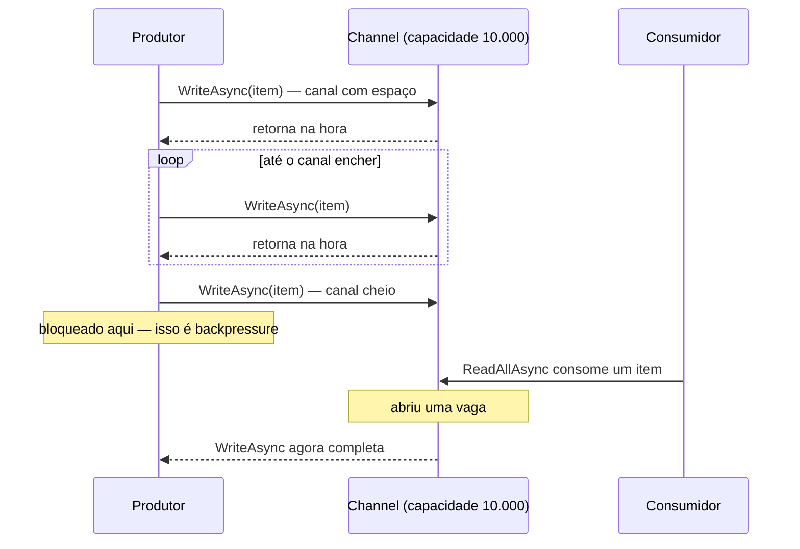
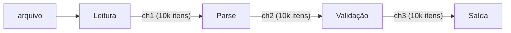

# Capítulo 03 — Concorrência e paralelismo

> **Módulo 2 do roteiro.** Pré-requisito: [Capítulo 02](02-runtime-type-system-memoria.md).
> **Tempo:** 2 a 3 semanas.
> **Entrega:** pipeline em estágios ligados por `Channel<T>`, com backpressure comprovado.

## Por que este capítulo existe

O objetivo aqui não é usar `async`. É **saber prever o que acontece sob carga**. Quase todo mundo escreve `async/await` no primeiro dia; quase ninguém sabe dizer quantas threads o processo vai usar, o que acontece quando o consumidor é mais lento que o produtor, ou por que a aplicação travou sem CPU e sem exceção.

### O vocabulário mínimo, antes de tudo

O título deste capítulo tem duas palavras que soam sinônimas e não são. A distinção não é preciosismo acadêmico: ela é exatamente o que decide qual ferramenta deste capítulo resolve o seu problema.

> 📖 **Conceito: thread**
> Uma thread é uma linha de execução dentro de um processo: uma sequência de instruções sendo executada, com sua própria pilha (Capítulo 02, seção 2.1). Um processo começa com uma thread (a que roda seu `Main`) e pode criar outras, que rodam "ao mesmo tempo" e compartilham a mesma memória — daí virem todos os problemas deste capítulo. Threads são criadas e agendadas pelo **sistema operacional**, e são caras: cada uma reserva cerca de 1 MB de pilha e trocar a CPU de uma para outra custa tempo. É por isso que o .NET evita criar threads e prefere reaproveitá-las (ver thread pool, abaixo).

> 📖 **Conceito: concorrência × paralelismo**
> **Concorrência** é lidar com várias tarefas em andamento ao mesmo tempo — elas se intercalam, progredindo um pouco cada uma, mas não necessariamente no mesmo instante. Uma única thread pode ser concorrente: ela começa a ler o arquivo A, e enquanto o disco responde, vai cuidar do arquivo B. **Paralelismo** é executar várias tarefas literalmente no mesmo instante, o que exige vários núcleos de CPU de verdade. Concorrência é sobre *estrutura* (como o trabalho é organizado); paralelismo é sobre *execução* (quantas coisas acontecem fisicamente ao mesmo tempo).
>
> A consequência prática, e a razão de o capítulo cobrir os dois: **`async/await` (seções 1 a 5) serve para concorrência; `Parallel`/múltiplos consumidores (seção 6) servem para paralelismo.** Usar a ferramenta errada é o erro estrutural mais comum aqui. Trabalho que espera I/O (ler disco, chamar API, consultar banco) é resolvido com `async` — não adianta jogar CPU no problema, a espera não fica mais curta com mais núcleos. Trabalho que queima CPU (o parse do Capítulo 02) é resolvido com paralelismo — `async` não o acelera em nada, porque não há espera nenhuma a aproveitar.

> 📖 **Conceito: thread pool**
> O thread pool é um conjunto de threads já criadas e mantidas prontas pelo runtime, para serem emprestadas a trabalhos curtos e devolvidas ao final — a mesma ideia do `ArrayPool` do Capítulo 02, aplicada a threads em vez de arrays, e pelo mesmo motivo: criar uma do zero é caro demais para fazer a toda hora. Quando você escreve `Task.Run(...)`, ou quando a continuação de um `await` precisa rodar, é uma thread do pool que faz o trabalho. O pool tem tamanho limitado e cresce **devagar** de propósito — o que é a causa direta da patologia da seção 2.2.

> 🐍 **Vindo de outra stack**
> — **Python:** `async`/`await` do C# é o `async`/`await` do `asyncio`, e `Task` é a `coroutine`/`Future`. A diferença decisiva: o .NET **não tem GIL**. No Python, `asyncio` dá concorrência mas nunca paralelismo de CPU (por isso existe `multiprocessing`); no .NET, `Task.Run` em vários núcleos é paralelismo real dentro do mesmo processo, com memória compartilhada — mais poderoso e mais perigoso, porque condição de corrida passa a ser possível de verdade.
> — **Java:** `Task<T>` ≈ `CompletableFuture<T>`, e o thread pool ≈ `ForkJoinPool`/`ExecutorService`. Se você conhece as *virtual threads* (Project Loom), note que o .NET tomou o caminho oposto: em vez de threads baratas que podem bloquear à vontade, o C# transforma o método numa máquina de estados (seção 1.1) e proíbe bloquear. O resultado é parecido; a regra "nunca bloqueie" aqui é obrigatória, lá deixou de ser.
> — **Go:** `Channel<T>` (seção 5) é o `chan` de Go quase literalmente, inclusive no uso de capacidade limitada para backpressure. A diferença: não existe `go func()` — a goroutine é substituída por `Task.Run` (para CPU) ou simplesmente por chamar um método `async` sem `await` imediato (para I/O). E `CancellationToken` (seção 3) é o `context.Context`, com a mesma disciplina de propagar por toda a cadeia de chamadas.

---

## 1. `async/await` desmontado

**Por que isso importa:** o Capítulo 00 ensinou a *usar* `async`/`await` corretamente, mas tratou o mecanismo como caixa-preta ("o `await` devolve a thread e retoma depois"). Esta seção abre a caixa. Sem isso, regras como "nunca use `.Result`" (seção 2) parecem arbitrárias em vez de consequências diretas de como o mecanismo funciona por dentro.

### 1.1 O que o compilador gera

```csharp
public async Task<int> ProcessarAsync(string caminho, CancellationToken ct)
{
    var linhas = await File.ReadAllLinesAsync(caminho, ct);
    var validos = Validar(linhas);
    await GravarAsync(validos, ct);
    return validos.Count;
}
```

> 📖 **Conceito: máquina de estados**
> Uma máquina de estados é um objeto que sabe "em que ponto da execução ele está" (o **estado** atual) e como avançar para o próximo ponto quando algo acontece. O compilador C# transforma um método `async` numa dessas: em vez de o método "pausar" de verdade (o que não existe em hardware real), ele é reescrito como um objeto que guarda em que linha lógica parou, e um método (`MoveNext()`) que, chamado de novo, continua exatamente dali. É esse objeto — não alguma pausa mágica de thread — que faz `await` funcionar.

O compilador reescreve o método `async` numa dessas máquinas de estado: uma `struct` com um campo `_state` (guardando em qual ponto o método está), campos para cada variável local que sobrevive a um `await` (porque a execução vai "sair" e "voltar" para o método, e essas variáveis precisam sobreviver a essa pausa), e o método `MoveNext()` mencionado acima, chamado toda vez que uma operação aguardada completa.

Consequências reais:

- **Não há thread esperando.** Enquanto o IO acontece, nenhuma thread está bloqueada. É por isso que um servidor .NET aguenta dezenas de milhares de conexões simultâneas com ~30 threads.
- **Cada `await` que realmente suspende custa uma alocação** (a máquina de estados é promovida ao heap). Em caminho quente, importa.
- **Variáveis locais viram campos.** Um `byte[]` local que atravessa um `await` fica vivo enquanto a `Task` viver. Cuidado com o que você mantém através de `await`.

Se o método completa sem nunca suspender de verdade (cache hit, buffer já preenchido), não há alocação: o `await` retorna sincronamente.

### 1.2 `SynchronizationContext` e `ConfigureAwait`

> 📖 **Conceito: `SynchronizationContext`**
> É um mecanismo que, em certos tipos de aplicação (principalmente com interface gráfica), garante que o código depois de um `await` volte a rodar na mesma thread específica de onde partiu — necessário porque frameworks de UI geralmente só permitem mexer na tela a partir de uma única thread designada. Em aplicações backend (console, worker, ASP.NET Core), não existe essa restrição, então esse mecanismo simplesmente não está presente.

Em UI (WinForms, WPF), existe um `SynchronizationContext` que faz a continuação (o código que vem depois de um `await`) voltar para a thread de UI. `ConfigureAwait(false)` diz "não preciso voltar para a thread original, pode continuar em qualquer uma disponível" — evitando o custo de forçar essa volta.

**Em ASP.NET Core, console e worker não há `SynchronizationContext`.** Então:

- Em **aplicação** .NET moderna: `ConfigureAwait(false)` não muda comportamento. Pode omitir.
- Em **biblioteca** que pode ser consumida por app de UI: use `ConfigureAwait(false)` sempre. É por isso que a regra CA2007 existe.

Recomendação do curso: `ConfigureAwait(false)` nas bibliotecas (`Cnab.Parsing`, `Cnab.Pipeline`), omitido nos executáveis. Configure o `.editorconfig` por pasta se quiser que o analyzer cobre só onde deve.

### 1.3 `Task` vs `ValueTask`

```csharp
public Task<int> LerAsync();        // sempre aloca um objeto Task
public ValueTask<int> LerAsync();   // não aloca quando completa sincronamente
```

Use `ValueTask` quando o método **frequentemente completa de forma síncrona** — leitura de buffer já preenchido, cache hit. Nos demais casos, `Task` e pronto.

Regras rígidas de `ValueTask`:

- **Consuma apenas uma vez.** `await` duas vezes na mesma `ValueTask` é comportamento indefinido.
- **Não use `.Result`.**
- Para guardar ou aguardar múltiplas vezes: `.AsTask()` primeiro.

### 1.4 `TaskCompletionSource`

A ponte entre o mundo de callback e o mundo de `Task`:

```csharp
public async Task<Arquivo> AguardarArquivoAsync(string nome, CancellationToken ct)
{
    var tcs = new TaskCompletionSource<Arquivo>(TaskCreationOptions.RunContinuationsAsynchronously);

    void AoChegar(object? _, Arquivo arq) { if (arq.Nome == nome) tcs.TrySetResult(arq); }

    _watcher.Chegou += AoChegar;
    // o Register devolve um registro descartável; sem descartá-lo, cada espera
    // deixa um callback pendurado no CancellationTokenSource do chamador
    await using var registro = ct.Register(() => tcs.TrySetCanceled(ct));

    try { return await tcs.Task; }
    finally { _watcher.Chegou -= AoChegar; }   // sem o -=, o publicador segura este objeto para sempre
}
```

Repare no `-=` e no `using` do registro: são as causas 2 e 3 de vazamento de memória que o Capítulo 10 (seção 3.1) lista. Um `TaskCompletionSource` ligado a um evento é exatamente a forma mais comum de produzi-las sem perceber, porque o código funciona perfeitamente — só não libera nada.

> ⚠️ **Armadilha**
> Sem `RunContinuationsAsynchronously`, a continuação roda **na thread que chamou `SetResult`**. Se essa thread for a do event loop de uma biblioteca de IO, você acabou de rodar seu código de negócio dentro dela — e pode causar deadlock ou starvation. Sempre passe a opção.

### 1.5 `Task.WhenEach`

Processar resultados na ordem em que ficam prontos, e não na ordem em que foram disparados:

```csharp
var tarefas = arquivos.Select(a => ProcessarAsync(a, ct)).ToList();

await foreach (var concluida in Task.WhenEach(tarefas).WithCancellation(ct))
{
    var resultado = await concluida;          // já está completa
    logger.LogInformation("Arquivo {Nome} pronto", resultado.Nome);
}
```

Antes disso, o padrão era um loop com `Task.WhenAny` + `Remove`, que é O(n²).

---

## 2. As três formas de travar sua aplicação

**Por que isso importa:** estas são as três causas mais comuns de um sintoma que aterroriza qualquer time em produção: a aplicação está "no ar" (processo rodando, sem crashar), mas simplesmente não responde. Sem saber reconhecer os sintomas abaixo, esse tipo de incidente pode levar horas para ser diagnosticado — com eles, minutos.

### 2.1 Sync-over-async e deadlock

> 📖 **Conceito: deadlock**
> Um deadlock (impasse) acontece quando duas ou mais partes do código ficam esperando umas pelas outras indefinidamente, sem que nenhuma consiga prosseguir — cada uma segura algo que a outra precisa. O exemplo clássico do parágrafo abaixo: a thread A bloqueia esperando uma `Task` terminar, mas essa `Task` só termina executando um trecho de código que precisa rodar exatamente na thread A (por causa do `SynchronizationContext`, seção 1.2) — e como a thread A está ocupada esperando, esse trecho nunca roda. Resultado: espera para sempre.

```csharp
// NUNCA
var resultado = ProcessarAsync(caminho).Result;
ProcessarAsync(caminho).Wait();
ProcessarAsync(caminho).GetAwaiter().GetResult();
```

Em contexto com `SynchronizationContext`, isso trava de imediato: a thread está bloqueada esperando a `Task`, e a continuação precisa dessa mesma thread. Em ASP.NET Core não trava por deadlock — trava por **starvation**, que é pior porque o sintoma é difuso.

### 2.2 Thread pool starvation

O thread pool tem um número de threads e injeta novas devagar (na ordem de uma ou duas por segundo, historicamente). Se você bloquear threads do pool, o pool esvazia; as requisições ficam enfileiradas; a latência sobe; a CPU fica **baixa**. Esse é o traço diagnóstico: alta latência com CPU ociosa.

**Como reproduzir** (faça isso, é o exercício mais instrutivo do capítulo):

```csharp
// Program.cs de um worker de teste
for (var i = 0; i < 200; i++)
    _ = Task.Run(() => Thread.Sleep(10_000));   // bloqueia threads do pool

var sw = Stopwatch.StartNew();
await Task.Run(() => { });                       // deveria ser instantâneo
Console.WriteLine($"Levou {sw.ElapsedMilliseconds} ms");   // vai levar segundos
```

**Como diagnosticar em produção:**

```bash
dotnet-counters monitor --process-id <pid> --counters System.Runtime
# observe: ThreadPool Thread Count subindo, ThreadPool Queue Length alto, CPU baixa
```

### 2.3 Deadlock por lock

```csharp
// .NET 9 / C# 13 trouxeram o tipo System.Threading.Lock, mais rápido que lock sobre object
private readonly Lock _gate = new();

public void Registrar(DetalheRetorno d)
{
    lock (_gate)     // o compilador reconhece o tipo Lock e usa a API dedicada
    {
        _buffer.Add(d);
    }
}
```

Regras: nunca chame código externo dentro de um lock; nunca faça `await` dentro de `lock` (não compila — use `SemaphoreSlim`); sempre adquira múltiplos locks na mesma ordem.

---

## 3. `CancellationToken` com disciplina

**Por que isso importa:** `CancellationToken` apareceu em quase todo exemplo desde o Capítulo 00, sempre como parâmetro, sem muita explicação de por quê. Esta seção é onde o padrão vira explícito: como e por que ele precisa percorrer toda a cadeia de chamadas, sem exceção.

```csharp
public async Task ProcessarAsync(string caminho, CancellationToken ct)
{
    await foreach (var registro in LerAsync(caminho, ct))        // propaga
    {
        ct.ThrowIfCancellationRequested();                        // checa em loop longo
        await GravarAsync(registro, ct);                          // propaga
    }
}
```

Princípios:

1. **Todo método assíncrono público recebe `CancellationToken`,** último parâmetro, com `default` só na borda externa.
2. **Propague sempre.** Um `ct` recebido e não passado adiante é um bug — o Meziantou.Analyzer avisa.
3. **Em loop sem `await` que suspenda**, cheque explicitamente com `ThrowIfCancellationRequested`.

### Tokens ligados e timeout

```csharp
// cancela se o host desligar OU se passar de 30 s
using var cts = CancellationTokenSource.CreateLinkedTokenSource(ct);
cts.CancelAfter(TimeSpan.FromSeconds(30));

await OperacaoAsync(cts.Token);
```

Para distinguir "o usuário cancelou" de "estourou o timeout":

```csharp
try { await OperacaoAsync(cts.Token); }
catch (OperationCanceledException) when (ct.IsCancellationRequested)
{
    throw;                                       // shutdown: propaga
}
catch (OperationCanceledException)
{
    throw new TimeoutException("Operação excedeu 30 s");   // timeout: outra semântica
}
```

> ⚠️ **Armadilha**
> `CancellationTokenSource` é `IDisposable`. Em loop que cria um por iteração sem descartar, os `Register` acumulam e você vaza memória de forma lenta e difícil de achar. Sempre `using`.

---

## 4. `IAsyncEnumerable` — streaming assíncrono

**Por que isso importa:** o Capítulo 02 já usou `IAsyncEnumerable` no leitor de blocos, mas sem parar para explicar o tipo em si. Aqui ele é o protagonista: é a forma padrão de expressar "uma sequência de itens que vão chegando aos poucos, de forma assíncrona" — exatamente o formato de um arquivo sendo lido e processado registro por registro, sem carregar tudo de uma vez na memória.

```csharp
public static async IAsyncEnumerable<DetalheRetorno> LerDetalhesAsync(
    string caminho,
    [EnumeratorCancellation] CancellationToken ct = default)
{
    // o terminador é detectado uma vez (Capítulo 02, seção 7.1): o arquivo do
    // Capítulo 00 é LF, então o passo é 241 e o registro entregue tem 240 bytes
    var terminador = await DetectarTerminadorAsync(caminho, 240, ct);

    await foreach (var bloco in LerRegistrosAsync(caminho, 240, terminador, ct))
        if (ParserRetorno.TentarParseDetalhe(bloco.Span, out var d))
            yield return d;
}

// consumo
await foreach (var d in LerDetalhesAsync(caminho).WithCancellation(ct))
    Processar(d);
```

O atributo `[EnumeratorCancellation]` é o que faz `WithCancellation` do chamador chegar até o seu `ct`. Sem ele, o token é silenciosamente ignorado — o compilador nem avisa em todos os casos.

---

## 5. `Channel<T>` — a peça central do projeto

**Por que isso importa:** este é o tipo que o projeto do capítulo inteiro é construído em cima. Se `Channel<T>` não estiver claro, o "Esqueleto" mostrado mais abaixo vai parecer uma coleção arbitrária de chamadas de método, em vez de uma composição de poucas peças bem entendidas.

> 📖 **Conceito: thread-safe**
> Um pedaço de código (ou estrutura de dados) é "thread-safe" quando pode ser usado por várias threads ao mesmo tempo sem risco de corromper dado ou produzir resultado incorreto — o próprio tipo já cuida internamente da coordenação necessária (geralmente via locks ou técnicas mais sofisticadas), então quem o usa não precisa se preocupar com isso. O oposto: um `List<T>` comum **não** é thread-safe — usá-lo de duas threads ao mesmo tempo, sem proteção externa, pode corromper a lista de formas imprevisíveis.

> 📖 **Conceito: backpressure**
> Backpressure é o mecanismo pelo qual um consumidor lento consegue "empurrar de volta" contra um produtor rápido, forçando-o a desacelerar em vez de acumular trabalho pendente sem limite. Sem backpressure, um produtor mais rápido que o consumidor produz uma fila que cresce sem parar, até estourar a memória disponível. É um conceito central em qualquer sistema que processa fluxo contínuo de dados — filas de mensagens, streams de I/O, pipelines como o deste capítulo.

Um `Channel<T>` é uma fila em memória assíncrona, thread-safe (ver conceito acima), com suporte a backpressure (ver conceito acima). É o equivalente do módulo `queue.Queue` do Python ou de um canal (`chan`) da linguagem Go, com uma semântica explícita de conclusão — o produtor pode sinalizar "não vou mais escrever nada aqui", e o consumidor sabe exatamente quando parar de esperar por novos itens.

```csharp
using System.Threading.Channels;

var canal = Channel.CreateBounded<DetalheRetorno>(new BoundedChannelOptions(capacity: 10_000)
{
    FullMode = BoundedChannelFullMode.Wait,   // ← o produtor espera: isso é backpressure
    SingleReader = false,
    SingleWriter = true,
    AllowSynchronousContinuations = false
});
```

### 5.1 Bounded vs unbounded

| Tipo | Comportamento sob produtor rápido |
|------|-----------------------------------|
| `CreateUnbounded` | cresce sem limite → **OutOfMemory** |
| `CreateBounded` + `Wait` | produtor aguarda espaço → memória estável |
| `CreateBounded` + `DropOldest`/`DropWrite` | descarta itens → só se perder dado for aceitável |

**Em pipeline de arquivo financeiro, `Wait` é a única opção.** Descartar registro de cobrança não é opção; estourar memória também não.

O que acontece, passo a passo, quando o consumidor é mais lento que o produtor num canal `Bounded` + `Wait`:



Sem esse limite, o produtor nunca espera e a fila em memória cresce até o processo morrer por `OutOfMemoryException`. Com o limite, o produtor vira, na prática, tão lento quanto o consumidor — a memória usada pelo canal fica com teto fixo (capacidade × tamanho do item), não importa quão grande seja o arquivo.

O mito a matar: *"unbounded é mais rápido"*. É mais rápido até o momento em que o consumidor fica atrás — e aí o processo morre. Capacidade limitada transforma um crash em uma desaceleração.

> 📏 **Meça**
> Não aceite o diagrama acima como prova. Rode o exercício 5 da seção 7: cronometre cada `WriteAsync` individualmente e monte a série. O formato que você procura é um degrau — as primeiras N chamadas retornando em microssegundos, e a partir daí um patamar plano no tempo do consumidor. Depois troque para `CreateUnbounded` e observe `GC Heap Size` subir monotonicamente no `dotnet-counters` (Capítulo 02, seção 9.1). **Backpressure é um conceito que só fica realmente aprendido com esses dois gráficos lado a lado.**

### 5.2 Produtor e consumidor

```csharp
// produtor
async Task ProduzirAsync(ChannelWriter<DetalheRetorno> writer, string caminho, CancellationToken ct)
{
    try
    {
        await foreach (var d in LerDetalhesAsync(caminho, ct))
            await writer.WriteAsync(d, ct);        // bloqueia aqui quando cheio = backpressure
    }
    catch (Exception ex)
    {
        writer.Complete(ex);                       // propaga a falha ao consumidor
        throw;
    }
    finally
    {
        writer.TryComplete();                      // sinaliza fim
    }
}

// consumidor
async Task ConsumirAsync(ChannelReader<DetalheRetorno> reader, CancellationToken ct)
{
    await foreach (var d in reader.ReadAllAsync(ct))
        await GravarAsync(d, ct);
}
```

`ReadAllAsync` termina naturalmente quando o writer chama `Complete()`. Se `Complete(ex)` foi chamado com exceção, ela é relançada no consumidor — é assim que a falha atravessa o estágio.

### 5.3 Múltiplos consumidores

```csharp
var consumidores = Enumerable.Range(0, Environment.ProcessorCount)
    .Select(_ => ConsumirAsync(canal.Reader, ct))
    .ToArray();

await Task.WhenAll(consumidores);
```

Com `SingleReader = false`, vários consumidores puxam do mesmo canal com segurança. Cada item vai para exatamente um deles.

> ⚠️ **Armadilha**
> Se um consumidor lançar exceção e os outros continuarem, `Task.WhenAll` só reporta ao final — e o produtor pode travar esperando espaço num canal que ninguém mais lê. Amarre tudo a um `CancellationTokenSource` comum e cancele no primeiro erro.

---

## 6. Paralelismo com controle

**Por que isso importa:** "fazer tudo em paralelo" parece sempre bom até você lembrar que existe um banco de dados do outro lado que também tem limite de conexões simultâneas. As ferramentas desta seção existem para dar velocidade sem derrubar o que está rio abaixo.

### 6.1 `Parallel.ForEachAsync`

```csharp
await Parallel.ForEachAsync(
    arquivos,
    new ParallelOptions { MaxDegreeOfParallelism = 4, CancellationToken = ct },
    async (arquivo, token) => await ProcessarAsync(arquivo, token));
```

`MaxDegreeOfParallelism` é obrigatório na prática. Sem limite, você abre 500 conexões de banco de uma vez e derruba o Postgres — não a sua aplicação, o banco de todo mundo.

### 6.2 `SemaphoreSlim`

Quando precisa de limite fora de um `Parallel`:

```csharp
private readonly SemaphoreSlim _limite = new(initialCount: 4, maxCount: 4);

public async Task ProcessarAsync(string arquivo, CancellationToken ct)
{
    await _limite.WaitAsync(ct);
    try { /* trabalho */ }
    finally { _limite.Release(); }               // SEMPRE no finally
}
```

### 6.3 `Interlocked`

Contadores compartilhados sem lock:

```csharp
private long _processados;

Interlocked.Increment(ref _processados);
var atual = Interlocked.Read(ref _processados);
Interlocked.Add(ref _totalCentavos, valor);
```

Mais rápido que `lock` para operação única sobre um valor. Não serve para invariante que envolva duas variáveis.

### 6.4 Rate limiting

`System.Threading.RateLimiting` limita **taxa**, não concorrência — útil para conter uma dependência lenta (API de banco, por exemplo, que aceita 10 req/s):

```csharp
using System.Threading.RateLimiting;

var limiter = new TokenBucketRateLimiter(new TokenBucketRateLimiterOptions
{
    TokenLimit = 10,
    TokensPerPeriod = 10,
    ReplenishmentPeriod = TimeSpan.FromSeconds(1),
    QueueLimit = 100,
    QueueProcessingOrder = QueueProcessingOrder.OldestFirst,
    AutoReplenishment = true
});

using var lease = await limiter.AcquireAsync(permitCount: 1, ct);
if (!lease.IsAcquired) throw new InvalidOperationException("limite excedido");
await ChamarApiDoBancoAsync(ct);
```

Algoritmos disponíveis: `FixedWindow`, `SlidingWindow`, `TokenBucket`, `Concurrency`. Token bucket é o que melhor tolera rajada curta.

---

## 7. Exercícios

Concorrência é o assunto em que ler não ensina. Todo exercício abaixo é para ser **rodado e observado** — vários deles pedem que você provoque uma falha de propósito, porque reconhecer o sintoma é a habilidade real que o capítulo quer instalar. Mantenha `dotnet-counters monitor --counters System.Runtime` (Capítulo 02, seção 9.1) aberto num segundo terminal durante quase todos.

1. **Concorrência não é paralelismo.** Escreva dois métodos: um que faz dez chamadas de `await Task.Delay(1000)` e outro que faz dez cálculos pesados de CPU (um laço somando bilhões). Rode cada um em duas versões — sequencial e com `Task.WhenAll`. Você deve encontrar ganho enorme num caso e ganho perto de zero no outro. Explique o resultado usando a distinção da caixa de conceito na abertura do capítulo. **Este é o exercício mais importante da lista;** se o resultado não fizer sentido, não siga para os outros.

2. **Starvation ao vivo.** Rode o código da seção 2.2 exatamente como está e anote quantos milissegundos levou o `Task.Run` que "deveria ser instantâneo". Agora troque `Thread.Sleep(10_000)` por `await Task.Delay(10_000)` e rode de novo. Explique a diferença brutal nos números — é a mesma quantidade de espera, e é justamente esse o ponto.

3. **O `.Result` que mata.** Numa aplicação de console, `.Result` costuma "funcionar", e é por isso que tanta gente acredita que a regra é exagero. Escreva um método `async`, consuma-o com `.Result` e confirme que funciona. Agora chame-o de dentro de 200 tarefas simultâneas e observe `ThreadPool Queue Length`. Documente o número de antes e depois.

4. **`ValueTask` consumida duas vezes.** Escreva um método que devolva `ValueTask<int>` completando sincronamente, e faça `await` nele duas vezes. Observe o que acontece (pode ser exceção, pode ser resultado errado — ambos são "comportamento indefinido" da seção 1.3). Depois corrija com `.AsTask()`.

5. **Medindo backpressure.** Monte um canal `CreateBounded` de capacidade 100 com um produtor rápido e um consumidor com `await Task.Delay(10)`. Meça quanto tempo cada `WriteAsync` leva: as primeiras 100 devem retornar na hora, e a partir daí cada uma passa a levar ~10 ms. Faça um gráfico simples dessa série. Depois troque por `CreateUnbounded` e observe `GC Heap Size` subir sem parar. Este exercício **é** a definição de backpressure — a caixa de conceito da seção 5 só faz sentido depois de ver esses dois gráficos lado a lado.

6. **O travamento silencioso.** Escreva um produtor/consumidor com `Channel` e **esqueça de propósito** o `writer.Complete()`. Confirme que o programa fica parado para sempre, sem erro, sem CPU, sem log. Depois conserte. Você vai reencontrar esse sintoma exato mais de uma vez na vida; a questão é se vai levar cinco minutos ou cinco horas para reconhecê-lo.

7. **Cancelamento que não chega.** Escreva um `IAsyncEnumerable` **sem** o atributo `[EnumeratorCancellation]` (seção 4), consuma-o com `.WithCancellation(ct)` e tente cancelar. Confirme que o cancelamento é ignorado. Adicione o atributo e confirme que passa a funcionar. Meça, nos dois casos, quanto tempo leva do `Cancel()` até a última linha executar.

8. **Limite que protege o vizinho.** Use `Parallel.ForEachAsync` **sem** `MaxDegreeOfParallelism` sobre uma lista de 500 itens em que cada item chama um método que registra quantas execuções estão em andamento ao mesmo tempo (use `Interlocked.Increment`/`Decrement` e guarde o máximo). Anote o pico. Depois fixe `MaxDegreeOfParallelism = 4` e confirme que o pico passa a ser 4. Imagine que cada execução era uma conexão de banco.

9. **Race condition de verdade** *(opcional, mas esclarecedor)*. Compartilhe um `long` entre 8 tarefas que o incrementam 1 milhão de vezes cada, com `_contador++`. O total deve dar 8 milhões e **não vai**. Rode cinco vezes e anote os cinco valores diferentes. Corrija com `Interlocked.Increment` (seção 6.3) e confirme que passa a dar certo sempre. É a demonstração mais curta de por que memória compartilhada sem coordenação é perigosa.

---

## 📦 Projeto: pipeline em estágios

### Enunciado

Leitura → parse → validação → saída, cada estágio ligado por um `Channel<T>` com capacidade limitada.



Cada estágio roda em sua própria `Task`, concorrente com os demais. O `Channel<T>` entre dois estágios é o único ponto de contato — não há estado compartilhado além dele, o que é o que torna esse desenho seguro contra condição de corrida.

> 📖 **Conceito: condição de corrida (race condition)**
> Uma condição de corrida acontece quando o resultado de um programa depende da ordem imprevisível em que operações concorrentes (rodando "ao mesmo tempo") acontecem — duas threads lendo e escrevendo o mesmo dado compartilhado sem coordenação, por exemplo, podem produzir um resultado diferente dependendo de qual "chegou primeiro" naquela execução específica. É uma classe de bug particularmente traiçoeira porque muitas vezes não acontece todo rodada — só aparece ocasionalmente, sob certas condições de tempo, o que torna difícil de reproduzir e depurar.

### Esqueleto

> **Duas peças que aparecem aqui antes do capítulo que as explica.** O esqueleto recebe um `ILogger<PipelineDeRetorno>` pelo construtor e o usa para registrar falha de estágio. Isso é **injeção de dependência** e **logging estruturado**, os dois assuntos do Capítulo 05 (seções 2 e 4). Você não precisa deles agora: até lá, leia `logger.LogError(ex, "...")` como "escreve um erro em algum lugar" e construa o pipeline à mão no `Main` (`new PipelineDeRetorno(opcoes, NullLogger<PipelineDeRetorno>.Instance)` — `NullLogger` é um logger que descarta tudo, e existe exatamente para este caso). O Capítulo 05 volta e liga as duas peças de verdade; o que importa neste capítulo está inteiramente nos canais.

Antes do código: a ideia é que `ExecutarAsync` monta três canais (`brutos`, `parseados`, `validos`) e dispara quatro tarefas concorrentes, cada uma responsável por um estágio do pipeline visto no diagrama acima. Uma tarefa lê do canal anterior e escreve no seguinte — exceto a primeira, que lê do arquivo, e a última, que só escreve o resultado final.

```csharp
namespace Cnab.Pipeline;

public sealed record OpcoesPipeline(int CapacidadeCanal = 10_000, int GrauDeParalelismo = 4);

public sealed class PipelineDeRetorno(OpcoesPipeline opcoes, ILogger<PipelineDeRetorno> logger)
{
    public async Task<ResumoProcessamento> ExecutarAsync(string caminho, CancellationToken ct)
    {
        using var cts = CancellationTokenSource.CreateLinkedTokenSource(ct);
        var token = cts.Token;

        var brutos    = CriarCanal<ReadOnlyMemory<byte>>();
        var parseados = CriarCanal<DetalheRetorno>();
        var validos   = CriarCanal<DetalheValidado>();

        var tarefas = new[]
        {
            EstagioAsync("leitura",   () => LerAsync(caminho, brutos.Writer, token),               brutos.Writer,    cts),
            EstagioAsync("parse",     () => ParsearAsync(brutos.Reader, parseados.Writer, token),  parseados.Writer, cts),
            EstagioAsync("validacao", () => ValidarAsync(parseados.Reader, validos.Writer, token), validos.Writer,   cts),
            EstagioAsync<DetalheValidado>("saida", () => EscreverAsync(validos.Reader, token),     saida: null,      cts)
        };

        await Task.WhenAll(tarefas);
        return MontarResumo();
    }

    private Channel<T> CriarCanal<T>() => Channel.CreateBounded<T>(
        new BoundedChannelOptions(opcoes.CapacidadeCanal) { FullMode = BoundedChannelFullMode.Wait });

    // Envolve cada estágio: garante Complete() do canal de saída em TODOS os caminhos,
    // e cancela os demais estágios no primeiro erro.
    // `saida` é null só no último estágio, que não escreve em canal nenhum.
    private async Task EstagioAsync<T>(
        string nome, Func<Task> corpo, ChannelWriter<T>? saida, CancellationTokenSource cts)
    {
        try
        {
            await corpo();
            saida?.TryComplete();                  // fim normal: libera o consumidor seguinte
        }
        catch (OperationCanceledException)
        {
            saida?.TryComplete();
            throw;
        }
        catch (Exception ex)
        {
            logger.LogError(ex, "Estágio {Estagio} falhou", nome);
            saida?.TryComplete(ex);                // a falha atravessa o canal (seção 5.2)
            await cts.CancelAsync();
            throw;
        }
    }
}
```

Passo a passo do que acontece dentro de `ExecutarAsync`: `CriarCanal<T>` (chamada três vezes, uma para cada tipo de item que atravessa o pipeline) cria um `Channel` limitado, com a política `Wait` vista na seção 5.1 — backpressure garantida em todo estágio. O array `tarefas` dispara os quatro estágios simultaneamente, cada um envolto por `EstagioAsync`, que concentra duas responsabilidades que **todo** estágio tem e que é fácil esquecer em um deles:

- **Completar o canal de saída em todos os caminhos.** É o `saida?.TryComplete()` repetido nos três blocos. Sem isso, o estágio seguinte fica esperando para sempre por itens que nunca virão — o travamento silencioso da armadilha no fim deste capítulo. Repare que o caminho de erro usa `TryComplete(ex)`: a exceção viaja pelo canal e é relançada no consumidor, exatamente como a seção 5.2 descreve.
- **Derrubar os demais estágios no primeiro erro.** `cts.CancelAsync()` propaga o cancelamento para todos os outros através do token compartilhado, evitando que um pipeline com um estágio quebrado continue trabalhando pela metade.

`await Task.WhenAll(tarefas)` espera as quatro tarefas terminarem (com sucesso ou não) antes de retornar o resumo final; se alguma delas tiver lançado exceção, `Task.WhenAll` a relança aqui.

Ter esse tratamento num lugar só, em vez de repetido dentro de `LerAsync`, `ParsearAsync` e `ValidarAsync`, é o que torna "esqueci o `Complete()` em um dos estágios" um erro **impossível** em vez de provável — e essa é a diferença entre uma regra escrita na documentação e uma regra garantida pelo código.

### ✅ Critério de aceite

- [ ] **Backpressure funciona.** Com produtor propositalmente mais rápido que o consumidor (insira `await Task.Delay(1)` no estágio de saída), o uso de memória fica estável ao longo do processamento de um arquivo grande. Prove com gráfico de `dotnet-counters`.
- [ ] **Cancelamento se propaga em menos de um segundo.** Teste: dispare o pipeline, cancele após 2 s, meça o tempo até todas as tarefas terminarem.
- [ ] **Nenhum registro se perde nem se duplica.** Teste com arquivo de contagem conhecida: a soma de processados + rejeitados é exatamente o total de registros do arquivo. Rode 50 vezes para pegar condição de corrida.
- [ ] Falha num estágio derruba os demais de forma limpa, sem deixar tarefa pendurada e sem `TaskCanceledException` não observada.
- [ ] Nenhum `.Result`, `.Wait()` ou `GetAwaiter().GetResult()` no código.

### Exercício de diagnóstico (obrigatório)

Reproduza deliberadamente cada patologia e documente o sintoma no `docs/`:

1. Troque `CreateBounded` por `CreateUnbounded` e processe um arquivo grande com consumidor lento. Registre a curva de memória até o crash.
2. Substitua um `await` por `.Result` dentro de um estágio. Observe o que acontece com `ThreadPool Queue Length`.
3. Esqueça o `writer.Complete()`. Observe a aplicação travar sem erro — este é o bug mais comum com `Channel`, e reconhecer o sintoma vale mais do que qualquer teoria.

### Armadilhas deste projeto

- **`Complete()` esquecido** → consumidor espera para sempre, sem erro e sem CPU. A defesa não é lembrar em cada estágio; é centralizar a chamada num único lugar que todos os estágios atravessam, como o `EstagioAsync` do esqueleto acima faz. Se você escrever o `Complete()` estágio por estágio, vai esquecer em um — normalmente no caminho de exceção.
- **Buffer alugado atravessando canal**: o `ReadOnlyMemory<byte>` do Capítulo 02 aponta para buffer reutilizado. Atravessando um `Channel`, o produtor sobrescreve antes do consumidor ler. Ou copie ao enfileirar, ou use um pool de buffers com devolução explícita pelo consumidor. **Esta é a interação mais sutil entre os capítulos 02 e 03** — resolva conscientemente e registre a decisão num ADR.
- **`AllowSynchronousContinuations = true`** faz o `WriteAsync` do produtor executar o código do consumidor. Ganha um pouco de latência e perde previsibilidade. Deixe `false`.
- **Exceção não observada**: uma `Task` que falha e nunca é aguardada só reporta no finalizador, com log confuso. `Task.WhenAll` sobre todas as tarefas resolve.

---

## Checklist de saída

- [ ] Sei descrever o que o compilador gera para um método `async`.
- [ ] Sei reproduzir e diagnosticar thread pool starvation.
- [ ] Nunca escrevo `.Result`.
- [ ] Sei explicar backpressure com um exemplo medido, não com definição.
- [ ] Sei por que `[EnumeratorCancellation]` é necessário.
- [ ] Uso `CancellationTokenSource` com `using` e ligo tokens quando preciso de timeout.

## Para ir além

- Stephen Cleary, *Concurrency in C# Cookbook* — o melhor livro prático do assunto.
- Blog de Stephen Toub sobre `async/await` interno — `devblogs.microsoft.com/dotnet/how-async-await-really-works/`
- `learn.microsoft.com/dotnet/core/extensions/channels`
- System.Threading.RateLimiting — `devblogs.microsoft.com/dotnet/announcing-rate-limiting-for-dotnet/`

➡️ **Próximo:** [Capítulo 04 — CLIs profissionais](04-clis-profissionais.md)
