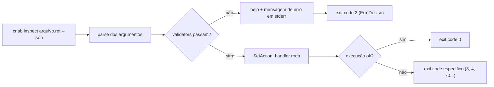
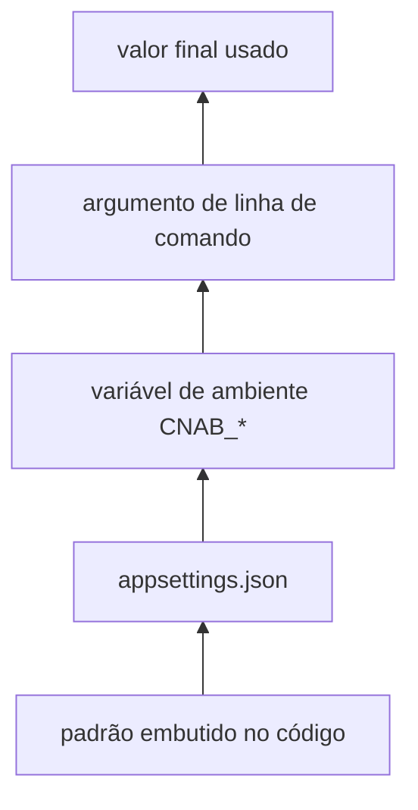

# Capítulo 04 — CLIs profissionais

> **Módulo 3 do roteiro.** Pré-requisito: [Capítulo 03](03-concorrencia-e-paralelismo.md).
> **Tempo:** 1 a 2 semanas.
> **Entrega:** CLI `cnab` com `inspect`, `validate` e `convert`, publicada como `dotnet tool`.

## Por que este capítulo existe

Uma CLI boa é **composável**: serve tanto ao humano no terminal quanto ao script que a chama às 3h da manhã. A diferença entre as duas não está no que ela faz, e sim em como ela se comporta quando ninguém está olhando — exit code, stdout, cor, progresso.

Ferramenta de operação é onde o time passa a viver durante um incidente. Vale fazer direito.

---

## 1. `System.CommandLine`

**Por que isso importa:** este capítulo assume que "argumento de linha de comando" já é familiar (o `args` visto no Capítulo 00), mas uma CLI de verdade precisa de mais que isso: subcomandos, opções nomeadas (`--layout`), validação, texto de ajuda gerado automaticamente. Escrever tudo isso à mão, com `if`s sobre `args`, é o jeito frágil de fazer — esta biblioteca é o jeito robusto.

> 📖 **Conceito: parsing de argumentos**
> "Parsing" (nome que também aparece nos parsers de CNAB dos capítulos anteriores) significa, de forma geral, interpretar um texto bruto e transformá-lo numa estrutura de dados utilizável. Aqui, o texto bruto é o que o usuário digitou no terminal (`cnab inspect arquivo.ret --json`), e a estrutura de dados é um objeto com campos como "comando: inspect", "arquivo: arquivo.ret", "json: true" — prontos para o código usar, sem você precisar dividir a string manualmente.

Estável na versão 2.0. É a biblioteca de parsing de argumentos oficial — a mesma que o próprio `dotnet` (o comando que você já usa desde o Capítulo 00) usa por baixo dos panos. Ela **não** vem na caixa do SDK: é um pacote NuGet como qualquer outro, adicionado pelo comando abaixo.

```bash
dotnet add package System.CommandLine
```

### 1.1 Estrutura básica

```csharp
using System.CommandLine;

var arquivoArg = new Argument<FileInfo>("arquivo")
{
    Description = "Caminho do arquivo de retorno"
};

var layoutOpt = new Option<string>("--layout", "-l")
{
    Description = "Layout do arquivo",
    DefaultValueFactory = _ => "santander240"
};

var jsonOpt = new Option<bool>("--json")
{
    Description = "Saída em JSON, para consumo por script"
};

var inspect = new Command("inspect", "Mostra um resumo do arquivo")
{
    arquivoArg, layoutOpt, jsonOpt
};

inspect.SetAction(async (parseResult, ct) =>
{
    var arquivo = parseResult.GetValue(arquivoArg)!;
    var layout  = parseResult.GetValue(layoutOpt)!;
    var json    = parseResult.GetValue(jsonOpt);

    return await InspectHandler.ExecutarAsync(arquivo, layout, json, ct);
});

var root = new RootCommand("Ferramenta de arquivos de cobrança") { inspect };
return await root.Parse(args).InvokeAsync();
```

> **Nota de versão:** a API do `System.CommandLine` passou por mudanças de assinatura entre as versões beta e a 2.0. Se o seu código não compilar, confira a assinatura atual de `SetAction` e `Parse` na documentação do pacote instalado, em vez de copiar exemplos antigos da internet — há muito material desatualizado circulando.

### 1.2 Validação

Valide no parse, não no handler. Erro de argumento deve sair antes de qualquer trabalho:



O ponto didático: nenhum trabalho de domínio roda antes da validação. Um arquivo inexistente é rejeitado no parse, não no meio do processamento.

```csharp
arquivoArg.Validators.Add(resultado =>
{
    var arquivo = resultado.GetValue(arquivoArg);
    if (arquivo is { Exists: false })
        resultado.AddError($"Arquivo não encontrado: {arquivo.FullName}");
    else if (arquivo is { Length: 0 })
        resultado.AddError("Arquivo vazio");
});

layoutOpt.AcceptOnlyFromAmong("santander240", "itau400", "bradesco400");
```

Ganho: mensagem de erro consistente, exit code correto e help automático listando os valores aceitos.

### 1.3 Subcomandos aninhados

```csharp
var lote = new Command("lote", "Operações sobre lotes")
{
    new Command("listar", "Lista lotes do arquivo"),
    new Command("extrair", "Extrai um lote para arquivo separado")
};
root.Add(lote);
// uso: cnab lote extrair arquivo.ret --numero 3
```

### 1.4 Completion de shell

Toda CLI feita com `System.CommandLine` já sabe responder pedidos de completion — inclusive para os valores declarados com `AcceptOnlyFromAmong` (seção 1.2), sem nenhuma linha a mais de código. O que falta é a ponte entre o shell e a sua aplicação, e ela é feita pela ferramenta `dotnet-suggest`, instalada **uma vez por máquina** por quem usa a CLI:

```bash
dotnet tool install -g dotnet-suggest

# 2. cole o shim do seu shell no perfil (ele repassa os pedidos ao dotnet-suggest):
#    bash → ~/.bash_profile   |   zsh → ~/.zshrc   |   PowerShell → $profile
#    os scripts estão em github.com/dotnet/command-line-api/tree/main/src/System.CommandLine.Suggest

# 3. registre o executável da sua CLI
dotnet-suggest register --command-path "$(which cnab)"
```

Custo zero de implementação, ganho alto de usabilidade — mas o custo não é zero para quem instala, então **documente esses três passos no README da ferramenta**. No `cmd.exe` do Windows não há mecanismo de completion plugável; PowerShell funciona.

---

## 2. Alternativas e quando escolhê-las

| Biblioteca | Quando |
|-----------|--------|
| **System.CommandLine** | padrão; sem dependência externa; melhor integração com AOT |
| **Spectre.Console.Cli** | quando você já usa Spectre.Console para UI e quer modelo de comando por classe, com DI natural |
| **Cocona** | quando quer mapear métodos a comandos com o mínimo de cerimônia, estilo minimal API |

```csharp
// Spectre.Console.Cli: comando como classe, settings como POCO
public sealed class InspectSettings : CommandSettings
{
    [CommandArgument(0, "<arquivo>")]
    public string Arquivo { get; init; } = "";

    [CommandOption("-l|--layout")]
    [DefaultValue("santander240")]
    public string Layout { get; init; } = "";
}

public sealed class InspectCommand(IParserFactory factory) : AsyncCommand<InspectSettings>
{
    public override async Task<int> ExecuteAsync(CommandContext ctx, InspectSettings s) { /* ... */ }
}
```

O curso segue com `System.CommandLine` para parsing e `Spectre.Console` (sem o `.Cli`) para apresentação. É a combinação que dá menos atrito com Native AOT no Capítulo 10.

---

## 3. O contrato Unix

**Por que isso importa:** uma CLI não é usada só por humanos digitando comandos — ela é chamada por outros programas (scripts, pipelines de CI) que precisam saber, de forma programática, se ela funcionou ou não, e ler sua saída sem ambiguidade. As convenções desta seção existem há décadas (nascidas em sistemas Unix) justamente para que qualquer programa de linha de comando seja "combinável" com qualquer outro, sem surpresas.

Esta é a seção que separa uma CLI amadora de uma profissional.

### 3.1 Exit codes significativos

> 📖 **Conceito: exit code**
> Todo processo, ao terminar, devolve ao sistema operacional um número inteiro pequeno — o exit code (ou "código de saída"). Por convenção universal, `0` significa sucesso; qualquer outro número significa algum tipo de falha, com o valor específico às vezes comunicando qual falha. É assim que um script Bash sabe se o comando anterior deu certo (a variável especial `$?` guarda esse número) — não pela mensagem impressa na tela, que é só texto, mas por esse número.

```csharp
public static class ExitCodes
{
    public const int Sucesso              = 0;
    public const int ErroDeUso            = 2;   // argumento inválido
    public const int ArquivoInvalido      = 3;   // o arquivo não passou na validação
    public const int ArquivoNaoEncontrado = 4;
    public const int ErroInterno          = 70;  // convenção sysexits.h: EX_SOFTWARE
    public const int Cancelado            = 130; // 128 + SIGINT
}
```

O script que chama a CLI decide o que fazer com base nisso:

```bash
cnab validate retorno.ret || case $? in
  3) echo "arquivo rejeitado; movendo para quarentena" ;;
  *) echo "falha inesperada"; exit 1 ;;
esac
```

### 3.2 stdout é dado, stderr é diagnóstico

> 📖 **Conceito: stdout, stderr e pipe**
> Todo processo tem, por padrão, dois canais de saída de texto separados: **stdout** ("standard output", saída padrão), para o resultado principal do programa, e **stderr** ("standard error"), para mensagens de diagnóstico — log, aviso, erro. Os dois normalmente aparecem juntos no terminal, misturados visualmente, mas são canais distintos. Um **pipe** (o operador `|` no shell) conecta o stdout de um programa ao stdin (entrada) do próximo, permitindo compor comandos — por exemplo, `cnab inspect a.ret --json | jq .total` manda a saída (stdout) do `cnab` direto para dentro do `jq`. Se mensagens de diagnóstico vazarem para o stdout, elas contaminam essa entrada e o `jq` (ou qualquer outro programa do pipe) recebe lixo misturado ao dado real.

Regra: **stdout contém apenas o que o próximo programa do pipe deve consumir.** Progresso, log, aviso e erro vão para stderr.

```csharp
Console.Out.WriteLine(json);                        // dado
Console.Error.WriteLine("Processando 100 mil...");   // diagnóstico
```

Teste da regra: `cnab inspect a.ret --json | jq .totalRegistros` tem que funcionar. Se sair lixo junto, você violou o contrato.

### 3.3 Detectar redirecionamento

```csharp
public static bool ModoInterativo =>
    !Console.IsOutputRedirected
    && Environment.GetEnvironmentVariable("NO_COLOR") is null
    && Environment.GetEnvironmentVariable("CI") is null
    && Environment.GetEnvironmentVariable("TERM") is not "dumb"
    && Environment.UserInteractive;
```

- `Console.IsOutputRedirected` — true quando a saída vai para arquivo ou pipe.
- `NO_COLOR` — convenção respeitada por ferramentas modernas (ver `no-color.org`). Se a variável existe, com qualquer valor, desligue cor.
- `TERM=dumb` — sinal de terminal sem capacidade de cor (é o que o Emacs e alguns runners de CI definem).
- `CI` — praticamente todo servidor de build define essa variável; é o sinal mais confiável de "ninguém está olhando".

Com isso, cor e barra de progresso somem automaticamente quando a saída não é um terminal. O usuário não precisa passar `--no-color`; a ferramenta percebe.

### 3.4 Modo `--json`

Toda CLI operacional precisa de saída estruturada:

```csharp
public sealed record ResumoArquivo(
    string Arquivo, string Layout, int TotalRegistros,
    int Detalhes, int Rejeitados, decimal ValorTotal,
    IReadOnlyList<ContagemOcorrencia> Ocorrencias);

if (json)
{
    // source-generated: rápido e compatível com AOT (ver capítulo 10)
    Console.Out.WriteLine(JsonSerializer.Serialize(resumo, CnabJsonContext.Default.ResumoArquivo));
    return ExitCodes.Sucesso;
}
```

> 📖 **Conceito: source generator e o contexto de JSON**
> `CnabJsonContext` não é uma classe que você escreve por inteiro — é uma classe que o **compilador gera para você** a partir de uma declaração mínima. Um *source generator* é um plugin do compilador que lê seu código durante a compilação e **acrescenta** arquivos-fonte novos ao projeto, antes de gerar o IL (Capítulo 00). Aqui, o gerador do `System.Text.Json` olha os tipos que você listou e escreve, em tempo de compilação, o código de serialização específico para cada um.
>
> Por que isso importa agora: o jeito padrão (`JsonSerializer.Serialize(resumo)`, sem contexto) descobre as propriedades do tipo **em tempo de execução**, por reflexão — ler os metadados do tipo e perguntar "quais propriedades você tem?". Isso é mais lento e, pior, é incompatível com Native AOT (Capítulo 10), porque o compilador AOT remove o que não consegue provar que é usado, e reflexão não deixa rastro provável. Gerando o código na compilação, o uso fica explícito e nada é removido por engano.

Você precisa disto para o projeto deste capítulo. A declaração inteira são cinco linhas:

```csharp
using System.Text.Json;
using System.Text.Json.Serialization;

[JsonSourceGenerationOptions(PropertyNamingPolicy = JsonKnownNamingPolicy.CamelCase)]
[JsonSerializable(typeof(ResumoArquivo))]
internal sealed partial class CnabJsonContext : JsonSerializerContext;
```

Linha a linha: `[JsonSerializable(typeof(ResumoArquivo))]` declara "gere o serializador para este tipo" — repita o atributo para cada tipo de raiz que você for serializar (tipos aninhados, como `ContagemOcorrencia` dentro de `ResumoArquivo`, são descobertos sozinhos). `[JsonSourceGenerationOptions(...)]` configura o gerador; `CamelCase` atende à convenção do parágrafo abaixo sem você renomear nada. A palavra-chave **`partial` é obrigatória**: ela é o que permite ao gerador acrescentar a outra metade da classe — sem ela, o código gerado não tem onde encaixar e a compilação falha. `JsonSerializerContext` é a classe base que fornece o `Default` usado na chamada acima.

> ⚠️ **Armadilha**
> Esquecer `partial` produz um erro de compilação confuso, que fala de membros ausentes (`Default` não existe) em vez de apontar a causa real. Se `CnabJsonContext.Default` "não existe" segundo o compilador, o primeiro lugar para olhar é a palavra `partial`.

Convenção: camelCase nas chaves, datas em ISO 8601, valores monetários como número decimal ou string — decida e documente, nunca misture.

---

## 4. Spectre.Console para a experiência humana

**Por que isso importa:** a seção 3 cuidou do lado programático — o que o script às 3h da manhã consome. Esta seção cuida do outro público da mesma ferramenta: a pessoa olhando o terminal durante um incidente, que precisa enxergar o que está acontecendo. A dificuldade não é desenhar tabela bonita; é servir os dois públicos com **um só** código, sem espalhar `if (json)` por toda parte — daí a abstração `IOutputWriter` que o projeto vai exigir.

> 🐍 **Vindo de outra stack**
> — **Python:** Spectre.Console é o equivalente direto de `rich` — tabelas, cores, barras de progresso, com a mesma filosofia. E `System.CommandLine` faz o papel de `argparse`/`click`/`typer`.
> — **Java:** o par mais próximo é `picocli`, que combina os dois papéis. A separação do .NET entre parsing (`System.CommandLine`) e apresentação (`Spectre.Console`) é deliberada, e é o que permite trocar um sem tocar no outro.
> — **Go:** `System.CommandLine` está para `cobra`/`flag` assim como `Spectre.Console` está para `lipgloss`/`bubbletea`. O contrato Unix da seção 3 é o mesmo em qualquer stack — é convenção de sistema operacional, não de linguagem.

```csharp
using Spectre.Console;

var tabela = new Table()
    .Border(TableBorder.Rounded)
    .AddColumn("Ocorrência")
    .AddColumn("Descrição")
    .AddColumn(new TableColumn("Qtd").RightAligned())
    .AddColumn(new TableColumn("Valor").RightAligned());

foreach (var o in resumo.Ocorrencias)
    tabela.AddRow(o.Codigo, o.Descricao, $"{o.Quantidade:N0}", $"{o.Valor:C}");

AnsiConsole.Write(tabela);
```

Barra de progresso, só em modo interativo:

```csharp
if (ModoInterativo)
{
    await AnsiConsole.Progress()
        .Columns(new TaskDescriptionColumn(), new ProgressBarColumn(),
                 new PercentageColumn(), new RemainingTimeColumn())
        .StartAsync(async ctx =>
        {
            var tarefa = ctx.AddTask("[green]Validando[/]", maxValue: totalRegistros);
            await foreach (var _ in PipelineAsync(ct)) tarefa.Increment(1);
        });
}
else
{
    await foreach (var _ in PipelineAsync(ct)) { }   // silencioso
}
```

> ⚠️ **Armadilha**
> Escrever barra de progresso em stdout quebra pipe e enche arquivo de log com sequências de escape ANSI. Spectre escreve em stdout por padrão — configure `AnsiConsole.Console` para stderr, ou simplesmente não use progresso quando não for interativo, como acima.

---

## 5. Configuração em camadas

**Por que isso importa:** sem uma ordem clara de precedência, "por que essa opção não está fazendo efeito?" vira um mistério toda vez que a mesma configuração é definida em mais de um lugar (o que acontece o tempo todo em sistemas reais: um valor padrão no código, outro no arquivo, outro na variável de ambiente do servidor).

Precedência, do mais forte ao mais fraco: **argumento de linha de comando > variável de ambiente > `appsettings.json` > padrão embutido.**



Cada camada acima só entra em jogo se a de baixo não decidiu o valor — a seta representa "pode sobrescrever". Isso é o que permite rodar a mesma imagem Docker em três ambientes só trocando variável de ambiente, e ainda permitir que um operador force um valor pontual com `--layout` sem editar nada.

```csharp
var config = new ConfigurationBuilder()
    .SetBasePath(AppContext.BaseDirectory)
    .AddJsonFile("appsettings.json", optional: true)
    .AddJsonFile($"appsettings.{ambiente}.json", optional: true)
    .AddEnvironmentVariables(prefix: "CNAB_")
    .Build();
```

Os providers registrados depois vencem os anteriores. Os argumentos ficam por último porque `System.CommandLine` já os parseou — o handler aplica o valor explícito sobre o que veio da configuração.

Variável de ambiente com hierarquia usa `__` como separador:

```bash
export CNAB_Parser__Layout=itau400
export CNAB_Saida__Formato=json
```

Vinculação a POCO com validação:

```csharp
public sealed class OpcoesParser
{
    [Required] public string Layout { get; init; } = "";
    [Range(1, 1000)] public int TamanhoLote { get; init; } = 100;
}

var opcoes = config.GetSection("Parser").Get<OpcoesParser>()
             ?? throw new InvalidOperationException("Seção Parser ausente");
Validator.ValidateObject(opcoes, new ValidationContext(opcoes), validateAllProperties: true);
```

---

## 6. Distribuição

**Por que isso importa:** um programa que só roda na sua máquina, a partir do código-fonte, não é utilizável pelo resto do time. Esta seção cobre como transformar o projeto em algo instalável — a diferença entre "código que compila" e "ferramenta que as pessoas realmente usam".

### 6.1 `dotnet tool`

A forma mais simples de distribuir para quem já tem .NET instalado (conceito de SDK vs. runtime, Capítulo 01):

```xml
<PropertyGroup>
  <PackAsTool>true</PackAsTool>
  <ToolCommandName>cnab</ToolCommandName>
  <PackageOutputPath>./artifacts</PackageOutputPath>
  <PackageId>Empresa.Cnab.Cli</PackageId>
</PropertyGroup>
```

```bash
dotnet pack
dotnet tool install --global --add-source ./artifacts Empresa.Cnab.Cli
cnab inspect samples/retorno.ret
```

**Ferramenta local** (recomendada para time): versão fixada no repositório, commitada no Git.

```bash
dotnet new tool-manifest                       # cria .config/dotnet-tools.json
dotnet tool install Empresa.Cnab.Cli           # instala localmente
dotnet tool restore                            # no CI ou na máquina nova
dotnet cnab inspect samples/retorno.ret
```

Todo mundo do time roda exatamente a mesma versão, sem instrução de instalação no README.

### 6.2 Single-file e self-contained

Para quem **não** tem .NET instalado:

```bash
dotnet publish -c Release -r linux-x64 \
  -p:PublishSingleFile=true \
  -p:SelfContained=true \
  -p:EnableCompressionInSingleFile=true \
  -p:InvariantGlobalization=true
```

| Opção | Efeito |
|-------|--------|
| `PublishSingleFile` | um executável só, com as DLLs embutidas |
| `SelfContained` | inclui o runtime — não exige .NET na máquina |
| `EnableCompressionInSingleFile` | menor, mas startup um pouco mais lento |
| `InvariantGlobalization` | dispensa ICU; **cuidado**: quebra comparação de string culture-aware |

Tamanhos típicos: framework-dependent ~1 MB, self-contained ~70 MB, self-contained + trimming ~25 MB, Native AOT ~10 MB. O Capítulo 10 fecha esse caminho.

---

## 7. Apps baseados em arquivo

Para script de apoio que não merece um projeto:

```csharp
#!/usr/bin/env dotnet
#:package Spectre.Console@0.49.1

using Spectre.Console;

var arquivo = args.FirstOrDefault() ?? throw new ArgumentException("informe o arquivo");
var linhas = File.ReadLines(arquivo).Count();
AnsiConsole.MarkupLine($"[green]{linhas:N0}[/] linhas");
```

```bash
chmod +x contar.cs && ./contar.cs retorno.ret
dotnet project convert contar.cs      # quando crescer, vira projeto de verdade
```

Repare que não há `#:property LangVersion=...` aqui: um app baseado em arquivo tem como alvo o `net10.0` do SDK instalado, e C# 14 já é o padrão dele (Capítulo 00, seção 1). A diretiva `#:property` existe para o caso em que você precisa mesmo mudar algo do build — `#:property PublishAot=true`, por exemplo — e não para repetir o que já é padrão.

Caso de uso real: o script de triagem que alguém escreveria em Bash, agora com tipagem e com acesso às suas próprias bibliotecas.

---

## 8. Exercícios

A maior parte destes se verifica **no shell**, não no C# — o que é o próprio ponto do capítulo: o contrato de uma CLI é observável de fora. Faça-os num projeto pequeno antes do projeto final.

1. **Exit code de verdade.** Escreva uma CLI que devolve `0` para um arquivo válido e `3` para um inválido. Comprove no shell, sem olhar a saída de texto:
   ```bash
   cnab validate bom.ret;  echo "codigo=$?"
   cnab validate ruim.ret; echo "codigo=$?"
   ```
   Depois escreva o `case $?` da seção 3.1 e confirme que o script reage corretamente aos dois. Um script que decide por `grep` na mensagem em vez de pelo exit code está errado — e é o que quase todo mundo faz na primeira vez.

2. **Provando a separação stdout/stderr.** Faça sua CLI imprimir dado em stdout e progresso em stderr. Agora separe os dois canais e confirme que cada um recebeu o que devia:
   ```bash
   cnab inspect a.ret --json > dados.json 2> log.txt
   jq -e '.totalRegistros > 0' dados.json    # tem que sair 0
   cat log.txt                               # só diagnóstico aqui
   ```
   Depois quebre de propósito: mande uma linha de progresso para stdout e veja o `jq` falhar. Esse erro tem sintoma inconfundível depois que você o vê uma vez.

3. **Caçando o byte de escape.** Rode `cnab inspect a.ret > out.txt` e procure sequências ANSI no arquivo com `grep -c $'\x1b' out.txt` — deve dar `0`. Se der mais que zero, sua detecção de redirecionamento (seção 3.3) não está funcionando. Teste as três formas de desligar cor: redirecionamento, `NO_COLOR=1` e `CI=true`.

4. **Validação antes do trabalho.** Adicione o validator da seção 1.2 e passe um arquivo que não existe. Confirme, cronometrando, que o erro sai **imediatamente** — e que nenhuma linha de log de processamento apareceu antes dele. Depois remova o validator e valide dentro do handler: observe a diferença de comportamento e de exit code.

5. **Help que se escreve sozinho.** Rode `cnab --help` e `cnab inspect --help`. Confirme que `--layout` lista os valores aceitos, sem que você tenha digitado essa lista no texto de ajuda (é o `AcceptOnlyFromAmong` que produz isso). Acrescente um subcomando aninhado e veja o help se reorganizar.

6. **JSON sem reflexão.** Implemente o `CnabJsonContext` da seção 3.4 e serialize seu resumo. Depois remova de propósito a palavra `partial` e leia a mensagem de erro do compilador — guarde-a na memória, você vai reencontrá-la. Por fim, compare a saída de `JsonSerializer.Serialize(resumo)` (sem contexto) com a versão com contexto: as duas devem produzir JSON idêntico.

7. **Cultura que estraga o JSON.** Serialize um valor `decimal` com `CultureInfo.GetCultureInfo("pt-BR")` e depois com `InvariantCulture`, e compare o texto. Rode o mesmo programa com `DOTNET_SYSTEM_GLOBALIZATION_INVARIANT=1`. Este é o bug que aparece só em produção, porque o container tem cultura diferente da sua máquina — a armadilha listada no projeto.

8. **`Ctrl+C` educado.** Implemente o tratamento de `Console.CancelKeyPress` mostrado no projeto. Rode um processamento longo, aperte `Ctrl+C` e confirme: nenhuma stack trace na tela, mensagem legível em stderr, e `echo $?` mostrando `130`. Compare com o comportamento padrão sem nenhum tratamento.

9. **Distribuição local.** Publique sua CLI como tool **local** (`dotnet new tool-manifest`), commite o `.config/dotnet-tools.json` e confirme que `dotnet tool restore && dotnet cnab --help` funciona numa cópia limpa do repositório. Compare com a instalação global e escreva, em duas frases, por que a local é melhor para um time.

---

## 📦 Projeto: CLI de arquivos de cobrança

### Enunciado

Comandos `inspect`, `validate` e `convert` sobre o parser do Capítulo 02, publicada como `dotnet tool`.

```bash
cnab inspect  retorno.ret [--layout X] [--json]
cnab validate retorno.ret [--strict] [--json]
cnab convert  retorno.ret --to csv|json|ndjson [--output arquivo]
```

**`inspect`** — resumo: banco, empresa, data de geração, contagem por tipo de registro, top ocorrências, valor total.
**`validate`** — verifica estrutura (sequência header/detalhe/trailer), soma do trailer contra os detalhes, dígito verificador do nosso número, datas válidas. Sai com código ≠ 0 se reprovar.
**`convert`** — transforma em formato consumível, via streaming (arquivo de 1 GB não pode virar 1 GB de memória).

> 📖 **Conceito: NDJSON**
> NDJSON (*Newline-Delimited JSON*, também chamado JSON Lines) é um arquivo em que **cada linha é um documento JSON completo e independente**, sem vírgula entre eles e sem colchetes envolvendo o conjunto:
> ```
> {"nossoNumero":"0001","ocorrencia":"06","valor":1520.00}
> {"nossoNumero":"0002","ocorrencia":"03","valor":890.55}
> ```
> Por que ele existe, e por que o projeto o exige: um array JSON comum (`[ {...}, {...} ]`) só é válido depois do `]` final, o que obriga quem escreve a saber o resultado inteiro antes de fechar, e obriga quem lê a carregar tudo antes de processar. NDJSON não tem essa propriedade — você escreve uma linha, dá `flush`, e esquece; quem lê processa linha a linha. É exatamente o que permite converter um arquivo de 1 GB com memória constante, o critério de aceite deste projeto. É também o formato que `jq` consome naturalmente sem `--slurp`.

### Estrutura

```
src/Cnab.Cli/
├── Program.cs                    # composição dos comandos
├── Commands/
│   ├── InspectCommand.cs
│   ├── ValidateCommand.cs
│   └── ConvertCommand.cs
├── Output/
│   ├── IOutputWriter.cs          # abstração: humano vs json
│   ├── ConsoleOutputWriter.cs    # Spectre
│   └── JsonOutputWriter.cs
├── ExitCodes.cs
└── Cnab.Cli.csproj
```

A abstração `IOutputWriter` é o ponto de desenho mais importante: ela impede que `AnsiConsole` vaze para dentro da lógica dos comandos, e é o que torna o modo `--json` uma implementação e não um `if` espalhado.

### ✅ Critério de aceite

- [ ] **`validate` sai com código ≠ 0 em arquivo inválido** e com 0 em arquivo válido. Teste com script Bash que verifica `$?`.
- [ ] **`--json` produz saída consumível por `jq`**: `cnab inspect a.ret --json | jq -e '.totalRegistros > 0'` retorna 0.
- [ ] **Cor e barra de progresso somem quando a saída é redirecionada.** Prove: `cnab inspect a.ret > out.txt` e verifique que `out.txt` não contém byte `0x1B`.
- [ ] `NO_COLOR=1 cnab inspect a.ret` não emite sequência ANSI nenhuma.
- [ ] `cnab --help` e `cnab inspect --help` são legíveis e listam valores aceitos de `--layout`.
- [ ] Instalável com `dotnet tool install` e executável como `cnab`.
- [ ] `cnab convert grande.ret --to ndjson > out.ndjson` com arquivo de 1 GB mantém memória estável (reusa o pipeline do Capítulo 03).
- [ ] `Ctrl+C` no meio do processamento sai com 130 e sem stack trace na tela.

### Tratamento de Ctrl+C

```csharp
using var cts = new CancellationTokenSource();
Console.CancelKeyPress += (_, e) =>
{
    e.Cancel = true;                 // impede o encerramento abrupto padrão
    Console.Error.WriteLine("Cancelando...");
    cts.Cancel();
};

try
{
    // o token vai NOMEADO: o primeiro parâmetro posicional de InvokeAsync
    // é `InvocationConfiguration?`, não o CancellationToken.
    return await root.Parse(args).InvokeAsync(cancellationToken: cts.Token);
}
catch (OperationCanceledException)
{
    return ExitCodes.Cancelado;      // 130, sem stack trace
}
```

### Armadilhas deste projeto

- **`Console.WriteLine` espalhado** pelo código de domínio. Uma vez que isso acontece, `--json` fica impossível e o teste fica impossível. Injete `IOutputWriter`.
- **Exceção não tratada na borda** imprime stack trace e sai com código 134 ou similar. Envolva tudo num `try/catch` que mapeia exceção para exit code e escreve mensagem legível em stderr; o stack trace vai só com `--verbose`.
- **Cultura**: `decimal.ToString()` numa máquina pt-BR usa vírgula; num container em `InvariantCulture`, ponto. Na saída JSON, use sempre `CultureInfo.InvariantCulture`. Na saída humana, use a cultura local.
- **Caminho com espaço** e caminho relativo: teste ambos.

---

## Checklist de saída

- [ ] Sei o contrato Unix de stdout, stderr e exit code, e minha CLI o respeita.
- [ ] Minha CLI detecta redirecionamento e `NO_COLOR` sozinha.
- [ ] A saída `--json` é consumível por `jq` sem pós-processamento.
- [ ] Sei a diferença entre tool global e tool local, e por que a local é melhor para time.
- [ ] `Ctrl+C` encerra com código 130 e sem ruído.
- [ ] Nenhuma escrita direta em `Console` dentro da lógica de domínio.

## Para ir além

- `learn.microsoft.com/dotnet/standard/commandline/`
- Spectre.Console — `spectreconsole.net`
- Convenção `NO_COLOR` — `no-color.org`
- `sysexits.h` — a tabela clássica de exit codes do BSD
- *Command Line Interface Guidelines* — `clig.dev` — leitura curta e excelente

➡️ **Próximo:** [Capítulo 05 — Workers, daemons e Generic Host](05-workers-daemons-generic-host.md)
