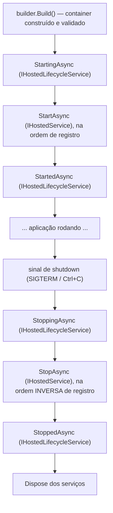
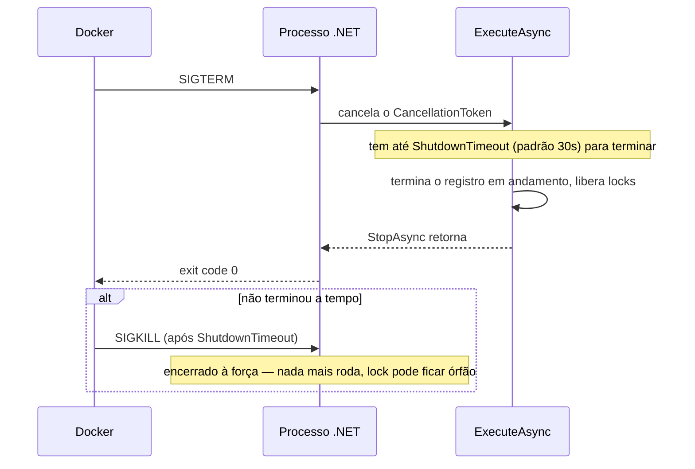
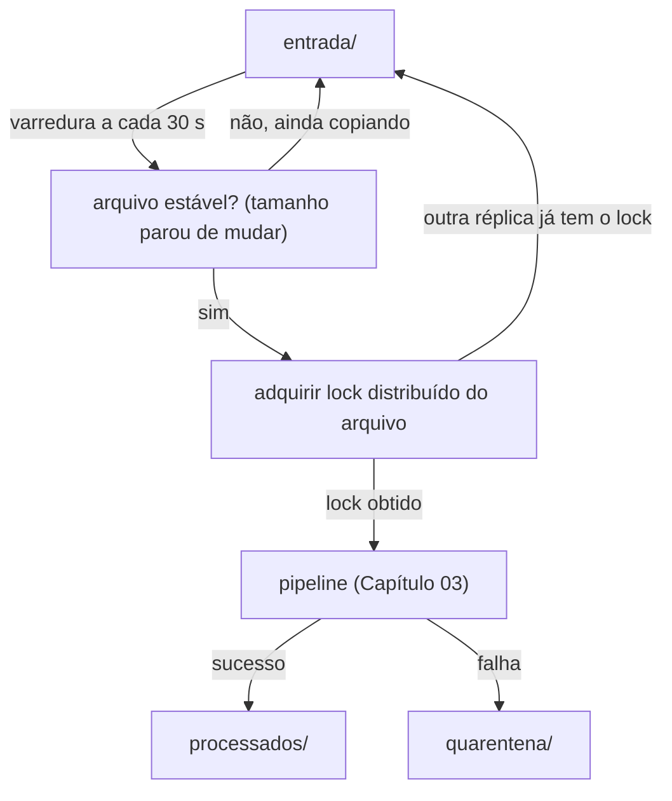

# Capítulo 05 — Workers, daemons e Generic Host

> **Módulo 4 do roteiro.** Pré-requisito: [Capítulo 04](04-clis-profissionais.md).
> **Tempo:** 2 semanas.
> **Entrega:** worker que varre uma origem de arquivos, processa pelo pipeline do Capítulo 03 e desliga com graça.

## Por que este capítulo existe

Processo que roda para sempre tem preocupações **opostas** às da CLI. A CLI começa, faz uma coisa e morre; se falhar, o usuário vê. O daemon sobe uma vez, roda por semanas, e ninguém está olhando — então ciclo de vida, agendamento e desligamento passam a ser o assunto principal.

O bug clássico deste território: o pod é reiniciado no meio de um lote e um arquivo é processado duas vezes, ou meio arquivo fica gravado. Este capítulo existe para que isso não aconteça.

---

## 1. Generic Host

**Por que isso importa:** até aqui, cada exemplo de código foi mais ou menos autocontido — uma classe, um método. Um worker de verdade tem dezenas de peças (banco, configuração, logging, o pipeline do Capítulo 03) que precisam ser criadas, conectadas e desligadas na ordem certa. O Generic Host é a infraestrutura que faz essa orquestração, para você não ter que escrevê-la à mão.

> 📖 **Conceito: injeção de dependência (DI)**
> Injeção de dependência é um padrão onde uma classe **recebe** (via parâmetro de construtor, tipicamente) os objetos de que precisa para funcionar, em vez de criá-los ela mesma internamente com `new`. Por exemplo, uma classe que precisa gravar no banco recebe um objeto que sabe conversar com o banco, em vez de instanciá-lo sozinha. A vantagem: quem monta a aplicação decide, num lugar central, qual implementação concreta cada peça vai receber — permitindo trocar por uma versão de teste (Capítulo 06), ou reconfigurar sem alterar a classe que consome. Um **container de DI** (o `Services` do código abaixo) é o objeto responsável por saber "quando alguém pedir um `IParserFactory`, entregue uma instância de `ParserFactory`" — e resolver essas dependências automaticamente, encadeadas, quando necessário.

O Host é o container de composição da aplicação (ver conceito de DI acima): ele registra e conecta dependências, carrega configuração, prepara logging e gerencia o ciclo de vida (quando cada peça inicia e para) de tudo isso.

> 🐍 **Vindo de outra stack**
> — **Python:** o container de DI é o que `dependency-injector` ou o sistema de `Depends` do FastAPI fazem, só que aqui é peça central da plataforma, não biblioteca opcional. O `BackgroundService` ocupa o espaço de um worker Celery ou de um laço `asyncio` num processo supervisionado por systemd/supervisord.
> — **Java:** o mapeamento é quase direto com Spring Boot — `IServiceCollection` ≈ `ApplicationContext`, `AddSingleton/Scoped/Transient` ≈ `@Singleton`/`@RequestScope`/`@Prototype`, `IOptions<T>` ≈ `@ConfigurationProperties`, e `BackgroundService` ≈ `@Scheduled`/`ApplicationRunner`. A diferença mais visível é que o .NET registra tudo **explicitamente em código**, sem varredura de classpath por anotação — o que é mais verboso e é justamente o que torna o Native AOT do Capítulo 10 viável.
> — **Go:** não há equivalente idiomático; em Go você monta as dependências à mão no `main` e passa `context.Context` adiante. O Generic Host é essencialmente essa mesma montagem manual, padronizada e com ciclo de vida gerenciado. O `CancellationToken` de shutdown é o `context` que você cancelaria ao receber SIGTERM — só que já ligado para você.

```csharp
using Microsoft.Extensions.Hosting;

var builder = Host.CreateApplicationBuilder(args);

builder.Services.AddSingleton<IParserFactory, ParserFactory>();
builder.Services.AddScoped<IRepositorioLote, RepositorioLote>();
builder.Services.AddHostedService<ArquivoWorker>();

builder.Services.AddOptions<OpcoesWorker>()
    .Bind(builder.Configuration.GetSection("Worker"))
    .ValidateDataAnnotations()
    .ValidateOnStart();

var host = builder.Build();
await host.RunAsync();
```

Linha a linha: `Host.CreateApplicationBuilder(args)` cria o objeto que vai montar a aplicação, já com configuração de `appsettings.json` + ambiente + variáveis de ambiente + argumentos, logging no console, e `IHostEnvironment` (informação sobre em qual ambiente — Development, Production — o processo está rodando) prontos, sem você precisar configurar cada um manualmente. `builder.Services.AddSingleton<IParserFactory, ParserFactory>()` registra no container de DI: "toda vez que alguém pedir um `IParserFactory`, entregue a mesma instância de `ParserFactory`, criada uma única vez" (`Singleton` — mais na seção 2.1). `AddScoped<IRepositorioLote, RepositorioLote>()` faz o mesmo registro, mas com uma instância nova por "escopo" (também explicado na seção 2.1). `AddHostedService<ArquivoWorker>()` registra `ArquivoWorker` como um serviço que roda em segundo plano durante toda a vida do processo — é o mecanismo central deste capítulo, detalhado na seção 5. As linhas de `AddOptions` ligam a classe `OpcoesWorker` à seção `"Worker"` do arquivo de configuração, com validação (seção 3). `var host = builder.Build();` finaliza a montagem, construindo de fato o container de DI a partir de tudo que foi registrado. `await host.RunAsync();` inicia a aplicação e bloqueia ali, mantendo o processo vivo até receber um sinal de desligamento (seção 6).

### 1.1 Ordem de inicialização



A ordem inversa no shutdown é deliberada: o serviço registrado por último (o mais dependente) para primeiro.

### 1.2 Rodando e depurando o worker no VS Code

O Capítulo 00 (seção 2.2) mostrou o F5 com um projeto só. A partir daqui o repositório tem vários executáveis — a CLI do Capítulo 04, este worker, e a API do Capítulo 08 — e o VS Code precisa saber qual deles iniciar. É o momento em que o `launch.json` passa a valer a pena.

Ele fica em `.vscode/launch.json` e o próprio C# Dev Kit o gera: no painel **Run and Debug** (`Ctrl+Shift+D`), clique em *create a launch.json file* e escolha C#. O resultado, enxuto, é assim:

```json
{
  "version": "0.2.0",
  "configurations": [
    {
      "name": "Worker",
      "type": "coreclr",
      "request": "launch",
      "preLaunchTask": "build",
      "program": "${workspaceFolder}/src/Cnab.Worker/bin/Debug/net10.0/Cnab.Worker.dll",
      "cwd": "${workspaceFolder}/src/Cnab.Worker",
      "env": { "DOTNET_ENVIRONMENT": "Development" }
    },
    {
      "name": "Anexar a processo",
      "type": "coreclr",
      "request": "attach"
    }
  ]
}
```

Cada configuração vira uma entrada no seletor do painel de depuração; F5 roda a que estiver selecionada. Os campos que importam: `preLaunchTask: "build"` compila antes de iniciar (senão você depura o binário anterior e enlouquece); `cwd` define a pasta de trabalho, que é o que faz o `appsettings.json` e os caminhos relativos de `DiretorioEntrada` resolverem corretamente; e `env` injeta variáveis de ambiente — é aqui que se troca o ambiente sem tocar em nenhum arquivo.

A segunda configuração, **`request: "attach"`**, é a mais útil neste capítulo: em vez de iniciar o processo, ela pede para escolher um processo **já em execução** e acopla o depurador a ele. Serve para o caso que o `launch` não cobre — um worker que você subiu pelo terminal, ou por `docker compose`, e que já está no meio de um lote.

> 💡 **Depurando o desligamento gracioso** (seção 6, o coração deste capítulo)
> O F5 comum não ajuda aqui, porque `Ctrl+C` no terminal integrado não chega ao processo depurado da forma esperada. Duas abordagens que funcionam:
> — ponha um breakpoint dentro do `catch (OperationCanceledException)` e use o botão **Stop** do painel de depuração, que encerra o host e dispara o cancelamento;
> — melhor ainda, e o que o Capítulo 06 (seção 9.1) formaliza: escreva um **teste** que chama `host.StopAsync()` e depure o teste. Você ganha um cenário reproduzível, sem depender de mandar sinal para processo nenhum.

> ⚠️ **Armadilha**
> `.vscode/launch.json` costuma conter caminhos e variáveis específicos da sua máquina. Diferente do `extensions.json` do Capítulo 01 (que é útil a todos), pense duas vezes antes de commitá-lo — ou commite só as configurações genéricas e deixe as pessoais no `.gitignore`.

`IHostedLifecycleService` dá quatro ganchos extras além do `Start/Stop`, úteis para preparação que precisa acontecer antes de qualquer serviço subir:

```csharp
public sealed class AquecimentoService : IHostedLifecycleService
{
    public Task StartingAsync(CancellationToken ct) => CarregarTabelaDeOcorrenciasAsync(ct);
    public Task StartAsync(CancellationToken ct) => Task.CompletedTask;
    public Task StartedAsync(CancellationToken ct) => Task.CompletedTask;
    public Task StoppingAsync(CancellationToken ct) => Task.CompletedTask;
    public Task StopAsync(CancellationToken ct) => Task.CompletedTask;
    public Task StoppedAsync(CancellationToken ct) => Task.CompletedTask;
}
```

---

## 2. Injeção de dependência

**Por que isso importa:** a caixa de conceito da seção 1 explicou o que DI é. Esta seção explica a decisão mais importante que você toma ao registrar cada dependência: por quanto tempo uma instância dela deve viver — e a armadilha número um que surge quando essa escolha é feita errado.

### 2.1 Os três tempos de vida

| Tempo de vida | Instância | Use para |
|---------------|-----------|----------|
| `Singleton` | uma por aplicação | cache, `HttpClient` factory, configuração, tabelas fixas |
| `Scoped` | uma por escopo | `DbContext`, unidade de trabalho |
| `Transient` | uma por resolução | serviços leves e sem estado |

### 2.2 Captive dependency: a armadilha número um

```csharp
// ERRADO
public sealed class ArquivoWorker(AppDbContext db) : BackgroundService   // db é Scoped
{
    // O worker é Singleton. Ele "captura" o DbContext para sempre.
    // Resultado: o change tracker cresce indefinidamente e o contexto
    // acaba num estado inválido depois da primeira exceção.
}
```

Um serviço `Singleton` que depende de um `Scoped` prende aquele scoped pela vida inteira do processo. **`BackgroundService` é registrado como Singleton.** Portanto ele nunca pode injetar `Scoped` diretamente.

A solução é criar escopo por unidade de trabalho:

```csharp
public sealed class ArquivoWorker(
    IServiceScopeFactory scopeFactory,
    ILogger<ArquivoWorker> logger) : BackgroundService
{
    protected override async Task ExecuteAsync(CancellationToken ct)
    {
        while (!ct.IsCancellationRequested)
        {
            await using var scope = scopeFactory.CreateAsyncScope();   // ← escopo por arquivo
            var processador = scope.ServiceProvider.GetRequiredService<IProcessadorDeArquivo>();

            await processador.ProcessarProximoAsync(ct);
        }
    }
}
```

Cada iteração ganha um `DbContext` novo, limpo, descartado no fim. É o equivalente ao "uma sessão por requisição" do mundo web.

Para pegar esse erro no `Build()`, em vez de na terceira hora de processamento:

```csharp
builder.ConfigureContainer(new DefaultServiceProviderFactory(new ServiceProviderOptions
{
    ValidateScopes  = true,   // Scoped resolvido fora de escopo → exceção
    ValidateOnBuild = true    // dependência não registrada → falha já no Build()
}));
```

Ligue os dois em **todos** os ambientes. Por padrão, o host só os liga em `Development` — que é exatamente o ambiente onde o bug menos aparece, porque você processa um arquivo pequeno e reinicia o tempo todo.

> ⚠️ **Armadilha**
> `builder.Services.Configure<ServiceProviderOptions>(...)` **compila e não faz absolutamente nada.** É a tentativa natural — `Configure<T>` é como se configura todo o resto — mas o container já foi construído com as opções dele quando alguém poderia ler esse `IOptions`; o único gancho que o `HostApplicationBuilder` oferece é o `ConfigureContainer` acima. Um "eu liguei a validação" que silenciosamente não ligou é pior que não ter ligado: confirme com o exercício 2, provocando o erro de propósito e vendo o `Build()` falhar.

### 2.3 Registro de múltiplas implementações

```csharp
builder.Services.AddKeyedSingleton<IParser, ParserSantander240>("santander240");
builder.Services.AddKeyedSingleton<IParser, ParserItau400>("itau400");

// consumo
public sealed class Processador([FromKeyedServices("santander240")] IParser parser) { }

// ou resolução dinâmica
var parser = serviceProvider.GetRequiredKeyedService<IParser>(layoutConfigurado);
```

---

## 3. Options pattern

**Por que isso importa:** o Capítulo 04 já montou configuração em camadas e leu um POCO com `config.GetSection(...).Get<T>()`. Isso funciona numa CLI, que lê a configuração uma vez e morre. Num processo que roda por semanas, surgem três exigências novas que aquele jeito não atende: a configuração precisa ser **validada no startup** (falhar às 3h da manhã porque um diretório não existe é inaceitável), precisa ser **injetável** nas classes via DI, e às vezes precisa **mudar sem reiniciar o processo**. O Options pattern é a resposta às três.

> 📖 **Conceito: POCO e data annotations**
> **POCO** (*Plain Old CLR Object*) é só um nome para "uma classe comum, sem herdar de nada especial e sem depender de framework" — exatamente a `OpcoesWorker` abaixo. **Data annotations** são os atributos entre colchetes (`[Required]`, `[Range]`) que declaram regras de validação **junto** da propriedade que elas governam, em vez de num método de validação separado. O `.ValidateDataAnnotations()` é quem lê esses atributos e os aplica.

```csharp
public sealed class OpcoesWorker
{
    [Required] public required string DiretorioEntrada { get; init; }
    [Required] public required string DiretorioProcessados { get; init; }
    [Required] public required string DiretorioQuarentena { get; init; }
    [Range(1, 60)] public int IntervaloVarreduraSegundos { get; init; } = 30;
    [Range(1, 32)] public int GrauDeParalelismo { get; init; } = 4;
}
```

```csharp
builder.Services.AddOptions<OpcoesWorker>()
    .Bind(builder.Configuration.GetSection("Worker"))
    .ValidateDataAnnotations()
    .Validate(o => Directory.Exists(o.DiretorioEntrada), "DiretorioEntrada não existe")
    .ValidateOnStart();     // ← falha no startup, não na primeira leitura
```

Sem `ValidateOnStart`, a validação só roda quando alguém resolve `IOptions<T>` pela primeira vez — o que pode ser depois de o pod já estar marcado como pronto.

### `IOptions` vs `IOptionsSnapshot` vs `IOptionsMonitor`

| Interface | Tempo de vida | Recarrega |
|-----------|---------------|-----------|
| `IOptions<T>` | Singleton | não |
| `IOptionsSnapshot<T>` | Scoped | por escopo |
| `IOptionsMonitor<T>` | Singleton | sim, com notificação |

Em worker (Singleton), `IOptionsSnapshot` **não pode ser usado** — é Scoped. Para configuração que muda em runtime, use `IOptionsMonitor`:

```csharp
public sealed class ArquivoWorker(
    IOptionsMonitor<OpcoesWorker> opcoes,
    ILogger<ArquivoWorker> logger) : BackgroundService
{
    protected override async Task ExecuteAsync(CancellationToken ct)
    {
        using var _ = opcoes.OnChange(novas =>
            logger.LogInformation("Configuração recarregada: paralelismo {N}", novas.GrauDeParalelismo));

        while (!ct.IsCancellationRequested)
        {
            var atual = opcoes.CurrentValue;    // lê o valor mais recente a cada volta
            // ...
        }
    }
}
```

> ⚠️ **Armadilha**
> `OnChange` pode disparar duas ou três vezes para uma única alteração de arquivo — é o comportamento do file watcher do sistema operacional. Faça o callback idempotente e barato.

> ⚠️ **Armadilha: ler `CurrentValue` uma vez só**
> Esta é a que mais engana, porque o código *parece* certo. `IOptionsMonitor` só entrega valor atualizado se você **perguntar de novo**. Guardar `opcoes.CurrentValue` numa variável antes do laço e reusá-la para sempre tem exatamente o mesmo efeito de usar `IOptions` — a recarga não chega a lugar nenhum:
> ```csharp
> var opts = opcoes.CurrentValue;              // ❌ congelado no primeiro valor
> while (!ct.IsCancellationRequested) { Usar(opts); }
>
> while (!ct.IsCancellationRequested)
> {
>     var opts = opcoes.CurrentValue;          // ✅ relido a cada volta
>     Usar(opts);
> }
> ```
> O caso mais traiçoeiro é um valor usado para **construir** algo antes do laço — um `PeriodicTimer`, um `SemaphoreSlim`, um `HttpClient` com timeout. O objeto já nasceu com o valor antigo, e reler `CurrentValue` depois não o reconfigura. É preciso reconfigurar o objeto explicitamente; a seção 7.1 mostra como fazer isso com o timer.

Uma última condição, fácil de esquecer: a recarga só acontece se o provider de configuração estiver **observando** o arquivo. `Host.CreateApplicationBuilder` já registra `appsettings.json` com `reloadOnChange: true`, então funciona de graça. Se você registrar o arquivo à mão (como na CLI do Capítulo 04, seção 5), `AddJsonFile("appsettings.json", optional: true)` usa `reloadOnChange: false` por padrão — e aí nenhum `IOptionsMonitor` do mundo vai perceber mudança. Passe `reloadOnChange: true` explicitamente.

---

## 4. Logging estruturado

**Por que isso importa:** na CLI do Capítulo 04, quando algo dava errado, havia uma pessoa olhando a tela. Aqui não há. O log **é** a interface do worker com o mundo — é a única coisa que existirá quando você for investigar, semanas depois, por que o arquivo do dia 12 foi para a quarentena. A diferença entre log que resolve um incidente e log que só ocupa disco é a estrutura, e é isso que esta seção instala.

> 📖 **Conceito: logging estruturado**
> Logging tradicional grava **frases**: `"Processando retorno-0312.ret com 45000 registros"`. Logging estruturado grava um **evento com campos nomeados**: uma mensagem-modelo (`"Processando {Arquivo} com {Total} registros"`) mais os valores associados a cada nome (`Arquivo = "retorno-0312.ret"`, `Total = 45000`). O texto continua legível na tela, mas o sistema que recebe esses logs (Seq, Loki, Elasticsearch, CloudWatch) guarda os campos separadamente e passa a permitir perguntas que não são busca de texto: *"todos os arquivos com mais de um milhão de registros"*, *"a média de `Total` por dia"*. Com frases, isso exigiria expressão regular sobre texto — e quebraria no dia em que alguém reescrevesse a mensagem.

### 4.1 O básico, feito certo

```csharp
// ERRADO: interpolação destrói a estrutura
logger.LogInformation($"Processando {arquivo} com {total} registros");

// CERTO: template com nomes; o backend indexa Arquivo e Total como campos
logger.LogInformation("Processando {Arquivo} com {Total} registros", arquivo, total);
```

Com interpolação você grava uma string; com template você grava um evento consultável (`Total > 1000000`). A diferença aparece no dia do incidente.

### 4.2 `LoggerMessage` com source generator

Cada chamada de `LogInformation` com parâmetros faz boxing dos argumentos e avalia o template. Em caminho quente isso pesa. O source generator elimina os dois:

```csharp
internal static partial class Log
{
    [LoggerMessage(EventId = 1001, Level = LogLevel.Information,
        Message = "Arquivo {Arquivo} processado: {Registros} registros em {Duracao}ms")]
    public static partial void ArquivoProcessado(
        this ILogger logger, string arquivo, int registros, long duracao);

    [LoggerMessage(EventId = 1002, Level = LogLevel.Warning,
        Message = "Registro {Linha} rejeitado: {Motivo}")]
    public static partial void RegistroRejeitado(this ILogger logger, int linha, string motivo);
}

// uso
logger.ArquivoProcessado(nome, total, sw.ElapsedMilliseconds);
```

Ganho extra: `EventId` estável, que você pode usar para alertar sem depender do texto da mensagem.

### 4.3 Escopos

```csharp
using (logger.BeginScope(new Dictionary<string, object>
{
    ["Arquivo"] = nomeArquivo,
    ["LoteId"] = loteId,
    ["CorrelationId"] = correlationId
}))
{
    await ProcessarAsync(ct);   // todo log aqui dentro carrega esses três campos
}
```

Escopo é o que transforma "achar o log de um arquivo específico" de caça ao tesouro em um filtro. O Capítulo 12 conecta isso ao trace distribuído.

---

## 5. `IHostedService` vs `BackgroundService`

**Por que isso importa:** `BackgroundService` (usado no `AddHostedService` da seção 1) é a classe-base que todo worker deste curso herda. Entender exatamente quando o host considera ela "pronta" evita um bug sutil: um serviço que parece iniciado, mas cuja inicialização de verdade ainda não terminou.

```csharp
public abstract class BackgroundService : IHostedService, IDisposable
{
    // StartAsync chama ExecuteAsync e, se ela não completar sincronamente, RETORNA.
}
```

**A armadilha do `ExecuteAsync`:** o host considera o serviço iniciado assim que `ExecuteAsync` chega no primeiro `await` que suspende. Se você precisa que uma inicialização termine **antes** de o host declarar-se pronto, `ExecuteAsync` é o lugar errado. Use `IHostedLifecycleService.StartingAsync` ou implemente `IHostedService` diretamente.

Pior ainda: **exceção lançada em `ExecuteAsync` antes do primeiro `await` derruba o host; depois dele, em versões antigas, era engolida silenciosamente.** Em .NET moderno o padrão é derrubar a aplicação (`BackgroundServiceExceptionBehavior.StopHost`), mas confirme:

```csharp
builder.Services.Configure<HostOptions>(o =>
{
    o.BackgroundServiceExceptionBehavior = BackgroundServiceExceptionBehavior.StopHost;
    o.ShutdownTimeout = TimeSpan.FromSeconds(30);
});
```

Sempre envolva o corpo em try/catch e decida conscientemente:

```csharp
protected override async Task ExecuteAsync(CancellationToken ct)
{
    try
    {
        await LoopPrincipalAsync(ct);
    }
    catch (OperationCanceledException) when (ct.IsCancellationRequested)
    {
        logger.LogInformation("Encerrando por solicitação de shutdown");   // normal, não é erro
    }
    catch (Exception ex)
    {
        logger.LogCritical(ex, "Worker falhou de forma irrecuperável");
        throw;                                                             // derruba o host de propósito
    }
}
```

---

## 6. Desligamento gracioso

**Por que isso importa:** esta é a seção que o critério de aceite cobra, e é o coração deste capítulo — o "bug clássico" descrito na abertura (arquivo processado duas vezes, ou meio gravado, quando o pod reinicia) é exatamente o que um desligamento mal feito causa.

> 📖 **Conceito: SIGTERM e SIGKILL**
> Estes são **sinais** — mensagens padronizadas do sistema operacional que um processo pode receber para reagir a eventos externos. **SIGTERM** ("signal terminate") é um pedido educado: "por favor, termine, mas você pode arrumar suas coisas antes". Um programa bem-comportado escuta esse sinal e usa a janela de tempo que ganha para finalizar trabalho em andamento e liberar recursos. **SIGKILL** é o oposto: encerra o processo imediatamente, sem chance de reação — é o que o sistema operacional (ou o Kubernetes, no Capítulo 13) manda quando o SIGTERM não foi suficiente dentro do prazo. É por isso que este capítulo trata "reagir ao SIGTERM dentro do prazo" como requisito central: é a única janela de oportunidade para desligar sem perder trabalho.

### 6.1 O que acontece num `docker stop`



```csharp
builder.Services.Configure<HostOptions>(o => o.ShutdownTimeout = TimeSpan.FromSeconds(30));
```

### 6.2 Terminar a unidade em andamento

O padrão certo: cancelar a **aquisição de novo trabalho**, mas deixar o trabalho atual terminar.

```csharp
protected override async Task ExecuteAsync(CancellationToken shutdownToken)
{
    while (!shutdownToken.IsCancellationRequested)
    {
        var arquivo = await ProximoArquivoAsync(shutdownToken);
        if (arquivo is null)
        {
            await Task.Delay(intervalo, shutdownToken);
            continue;
        }

        // o registro em andamento termina mesmo com shutdown pedido:
        // passamos um token separado, com orçamento próprio
        using var trabalho = new CancellationTokenSource(TimeSpan.FromSeconds(25));
        try
        {
            await ProcessarArquivoAsync(arquivo, trabalho.Token);
            await MarcarConcluidoAsync(arquivo, CancellationToken.None);
        }
        finally
        {
            await LiberarLockAsync(arquivo, CancellationToken.None);   // sempre libera
        }
    }
}
```

Note o `CancellationToken.None` nas operações de finalização. Elas precisam rodar **mesmo** durante o shutdown; cancelá-las é justamente o que deixa lock órfão e lote meio gravado.

### 6.3 Sinais POSIX

```csharp
using var sigterm = PosixSignalRegistration.Create(PosixSignal.SIGTERM, ctx =>
{
    ctx.Cancel = true;                       // eu trato, não use o handler padrão
    logger.LogInformation("SIGTERM recebido, iniciando drenagem");
    lifetime.StopApplication();
});
```

Útil também para `SIGHUP` (recarregar configuração) e `SIGUSR1` (dump de estado sob demanda).

### 6.4 `IHostApplicationLifetime`

```csharp
public sealed class Monitor(IHostApplicationLifetime lifetime, ILogger<Monitor> logger)
{
    public void Registrar()
    {
        lifetime.ApplicationStarted.Register(() => logger.LogInformation("Pronto"));
        lifetime.ApplicationStopping.Register(() => logger.LogInformation("Drenando"));
        lifetime.ApplicationStopped.Register(() => logger.LogInformation("Parado"));
    }

    public void PararTudo() => lifetime.StopApplication();
}
```

---

## 7. Agendamento

**Por que isso importa:** um worker precisa saber quando checar por trabalho novo. As opções vão desde um laço simples (bom o bastante para este curso) até ferramentas robustas de agendamento tipo cron, para quando a necessidade cresce.

### 7.1 Loop simples com `PeriodicTimer`

Para "a cada N segundos", não use `Task.Delay` num `while` — a deriva acumula:

```csharp
using var timer = new PeriodicTimer(TimeSpan.FromSeconds(30));

try
{
    while (await timer.WaitForNextTickAsync(ct))
        await VarrerAsync(ct);
}
catch (OperationCanceledException) when (ct.IsCancellationRequested)
{
    // shutdown pedido: saída normal, não é erro
}
```

> ⚠️ **Armadilha: os dois jeitos de esse laço terminar não são iguais**
> É comum ler que `WaitForNextTickAsync` "retorna `false` no cancelamento". **Não retorna.** O `false` sinaliza apenas que o *timer foi descartado* (`Dispose`). Quando o **token** é cancelado, o método **lança `OperationCanceledException`** — e se você não a capturar, ela sobe pelo `ExecuteAsync` e é tratada como falha do serviço, não como desligamento limpo.
> Por isso o `try/catch` acima não é ornamento: sem ele, todo `docker stop` do seu worker termina com uma exceção no log, e o desligamento gracioso da seção 6 nunca chega a rodar por completo. Este é o erro mais fácil de cometer neste capítulo inteiro.

**Por que não `Task.Delay` num `while`.** A diferença é a **deriva**. `await Task.Delay(30s)` espera 30 segundos *depois que o trabalho terminou*; se a varredura leva 4 segundos, o ciclo real é de 34 — e o atraso se acumula volta após volta, até o "job das 2h" rodar às 2h40. `PeriodicTimer` marca os instantes a partir de um relógio fixo: ele dispara a cada 30 segundos de calendário, independentemente de quanto durou a iteração anterior. (Se uma iteração demorar mais que o período inteiro, o tique seguinte não se acumula numa fila — ele simplesmente é perdido, que é o comportamento desejável aqui: varreduras atrasadas não devem se empilhar.)

### 7.1.1 Período que muda com a configuração

O critério de aceite deste capítulo exige que alterar `IntervaloVarreduraSegundos` no `appsettings.json` tenha efeito **sem reiniciar o worker**. Repare que o código acima não atende a isso: o `PeriodicTimer` foi construído uma única vez, com o valor que existia naquele instante. Reler `opcoes.CurrentValue` no meio do laço não muda em nada o timer que já nasceu — é exatamente a armadilha descrita na seção 3.

A solução é reatribuir a propriedade `Period`, que é gravável e passa a valer a partir do próximo tique:

```csharp
using var timer = new PeriodicTimer(
    TimeSpan.FromSeconds(opcoes.CurrentValue.IntervaloVarreduraSegundos));

try
{
    while (await timer.WaitForNextTickAsync(ct))
    {
        var periodoAtual = TimeSpan.FromSeconds(opcoes.CurrentValue.IntervaloVarreduraSegundos);
        if (timer.Period != periodoAtual)
        {
            logger.LogInformation("Intervalo de varredura alterado para {Segundos}s",
                periodoAtual.TotalSeconds);
            timer.Period = periodoAtual;          // vale a partir do próximo tique
        }

        await VarrerAsync(ct);
    }
}
catch (OperationCanceledException) when (ct.IsCancellationRequested) { }   // ver seção 7.1
```

O `if` não é otimização: sem ele, você reatribuiria o período a cada volta e emitiria log a cada volta. Comparar antes torna a mudança um **evento**, que aparece no log exatamente uma vez, quando de fato aconteceu — e é isso que você vai querer ver ao verificar o critério de aceite.

> ⚠️ **Armadilha**
> Alterar `Period` afeta o **próximo** tique, não o que já está sendo aguardado. Se o período atual é de 10 minutos e você o reduz para 30 segundos, ainda vai esperar o resto dos 10 minutos antes que a mudança apareça. Ao testar, use valores pequenos (5s → 1s) ou você vai concluir que não funcionou.

### 7.2 Quartz.NET ou Hangfire

Quando precisa de cron, persistência de agendamento e cluster:

```csharp
builder.Services.AddQuartz(q =>
{
    q.UsePersistentStore(s =>
    {
        s.UsePostgres(builder.Configuration.GetConnectionString("Quartz")!);
        s.UseSystemTextJsonSerializer();
        s.UseClustering();                 // ← garante execução única entre réplicas
    });

    var key = new JobKey("varredura-retornos");
    q.AddJob<VarreduraJob>(key);
    q.AddTrigger(t => t.ForJob(key)
        .WithCronSchedule("0 */5 * * * ?", x => x.InTimeZone(
            TimeZoneInfo.FindSystemTimeZoneById("America/Sao_Paulo"))));
});
builder.Services.AddQuartzHostedService(o => o.WaitForJobsToComplete = true);
```

| | Quartz.NET | Hangfire |
|---|---|---|
| Foco | agendamento cron robusto | fila de jobs em background |
| Dashboard | não nativo | sim, muito bom |
| Cluster | `UseClustering` | via storage |
| Job disparado por código | possível | é o caso principal |

`WaitForJobsToComplete = true` é o equivalente do desligamento gracioso para o Quartz.

> ⚠️ **Fuso horário**
> Expressão cron sem timezone usa o fuso do processo. Container roda em UTC. Um job agendado para "meia-noite" vai rodar às 21h de Brasília. Sempre declare `InTimeZone` explicitamente.

### 7.3 Lock distribuído

Duas réplicas não podem processar o mesmo arquivo. Com Postgres, o advisory lock é a ferramenta mais simples e confiável:

```bash
dotnet add package System.IO.Hashing      # XxHash64; não vem na BCL
```

```csharp
using System.IO.Hashing;
using System.Text;

public async Task<bool> TentarAdquirirAsync(string chave, CancellationToken ct)
{
    var hash = (long)XxHash64.HashToUInt64(Encoding.UTF8.GetBytes(chave));
    await using var cmd = _conexao.CreateCommand();
    cmd.CommandText = "SELECT pg_try_advisory_lock(@k)";
    cmd.Parameters.AddWithValue("k", hash);
    return (bool)(await cmd.ExecuteScalarAsync(ct))!;
}
```

> 📖 **Conceito: advisory lock**
> Um lock "advisory" (consultivo) é um cadeado que o banco de dados guarda para você, mas que **não protege nenhuma tabela ou linha** — ele não tem significado nenhum para o banco além de "alguém está segurando o número X". Todo o significado vem do acordo entre as aplicações: se todas concordam em pedir o lock da chave `retorno-0312.ret` antes de tocar naquele arquivo, então só uma consegue por vez. O banco entra apenas como o lugar central onde todas as réplicas podem se coordenar — é a mesma função de um `SemaphoreSlim` (Capítulo 03, seção 6.2), só que compartilhado entre processos e máquinas diferentes em vez de entre threads do mesmo processo.

O código acima transforma a chave de texto num `long` porque `pg_try_advisory_lock` só aceita número — é isso que o `XxHash64` faz ali, e não criptografia (basta ser rápido e espalhar bem; colisão entre nomes de arquivo diferentes é astronomicamente improvável e, no pior caso, custaria uma espera desnecessária, não corrupção).

Repare no `try` do nome: `pg_try_advisory_lock` **não espera**. Ela devolve `true` se conseguiu o lock na hora, e `false` imediatamente se outra réplica já o tem. É o que você quer aqui — a réplica que não conseguiu simplesmente passa para o próximo arquivo em vez de ficar parada.

A liberação é a chamada simétrica:

```csharp
public async Task LiberarAsync(string chave, CancellationToken ct)
{
    var hash = (long)XxHash64.HashToUInt64(Encoding.UTF8.GetBytes(chave));
    await using var cmd = _conexao.CreateCommand();
    cmd.CommandText = "SELECT pg_advisory_unlock(@k)";
    cmd.Parameters.AddWithValue("k", hash);
    await cmd.ExecuteScalarAsync(ct);
}
```

> ⚠️ **Armadilha: o lock pertence à conexão, não à aplicação**
> Esta é a parte que decide se o mecanismo funciona ou não, e é fácil de errar sem perceber. Um advisory lock de sessão vive enquanto viver a **conexão** que o adquiriu. Como quase todo cliente de Postgres usa *pool de conexões* por padrão — pegar uma conexão emprestada, usar e devolver ao pool — se você adquirir o lock numa conexão emprestada e devolvê-la, a próxima operação pega outra conexão qualquer, e a tentativa de `unlock` acontece na conexão errada (não faz nada) enquanto a original continua segurando o lock. Por isso o código acima usa um campo `_conexao`: o serviço de lock precisa manter **sua própria conexão dedicada, aberta**, pela duração do lock. Se você usar `DbContext` ou pegar conexão do pool a cada chamada, o mecanismo falha de forma silenciosa e intermitente — o pior tipo de falha.

O lado bom dessa mesma propriedade: se o processo morrer de qualquer jeito — inclusive por SIGKILL, sem chance de rodar `finally` — a conexão TCP cai, e o Postgres libera todos os locks dela automaticamente. Isso resolve de graça o problema de lock órfão que uma tabela `locks` com coluna `expires_at` teria (nela, um processo morto deixa a linha travada até o prazo expirar, e escolher esse prazo é um dilema sem resposta boa: curto demais permite processamento duplicado, longo demais trava o arquivo por horas).

Alternativas: `DistributedLock` (biblioteca com providers para Postgres, Redis, SQL Server, Azure) ou lease do Kubernetes.

---

## 8. Health checks

**Por que isso importa:** num sistema com múltiplas réplicas rodando (Capítulo 13), algo externo (o orquestrador de containers) precisa de um jeito automatizado de perguntar "você está bem?" a cada instância, para decidir se deve continuar mandando trabalho para ela ou substituí-la. Health checks são essa resposta padronizada.

```bash
dotnet add package Microsoft.Extensions.Diagnostics.HealthChecks   # AddHealthChecks, AddCheck
dotnet add package AspNetCore.HealthChecks.NpgSql                  # o .AddNpgSql abaixo
```

O segundo é de terceiros (projeto `Xabaril/AspNetCore.Diagnostics.HealthChecks`), não da Microsoft, apesar do nome — há um pacote equivalente para cada dependência comum (`.AddRabbitMQ`, `.AddRedis`, `.AddS3`), e o Capítulo 13 usa mais alguns.

```csharp
builder.Services.AddHealthChecks()
    .AddCheck<DiretorioEntradaCheck>("entrada", tags: ["ready"])
    .AddNpgSql(connectionString, name: "postgres", tags: ["ready"])
    .AddCheck("liveness", () => HealthCheckResult.Healthy(), tags: ["live"]);
```

Worker não tem servidor HTTP por padrão. Duas saídas: subir um `WebApplication` mínimo só com `/health`, ou escrever o estado num arquivo que uma probe de `exec` lê. A primeira é mais comum; o Capítulo 13 detalha qual probe verifica o quê.

---

## 9. Exercícios

Do 1 ao 5 você precisa apenas de um worker vazio (`dotnet new worker -o Sandbox.Worker`). Do 6 em diante, de Docker — e é aí que o capítulo fica sério.

1. **Vendo o ciclo de vida.** Registre três `IHostedService` que apenas logam o próprio nome em `StartAsync` e `StopAsync`. Suba o host, dê `Ctrl+C`, e confirme no log que a parada acontece na **ordem inversa** do registro (seção 1.1). Depois implemente `IHostedLifecycleService` num deles e observe onde os quatro ganchos extras se encaixam na sequência.

2. **Captive dependency na prática.** Injete um serviço `Scoped` diretamente no construtor de um `BackgroundService` — o erro da seção 2.2. Com `ValidateScopes = false`, confirme que a aplicação **sobe normalmente** (é isso que torna o bug perigoso). Agora ligue `ValidateScopes = true` e `ValidateOnBuild = true` e confirme que falha no `Build()`, com mensagem clara. Corrija com `IServiceScopeFactory`.

3. **Falhar cedo.** Configure `OpcoesWorker` com um `DiretorioEntrada` que não existe. Compare os dois comportamentos: **sem** `ValidateOnStart`, o processo sobe e só quebra quando alguém resolve as opções; **com** `ValidateOnStart`, ele nem sobe. Anote a diferença de exit code e de mensagem.

4. **Configuração que muda em voo.** Implemente o `AjustarPeriodo` da seção 7.1.1. Com o worker rodando, edite `IntervaloVarreduraSegundos` de `5` para `1` no `appsettings.json` e confirme, pelo log, que o intervalo mudou sem restart. Depois **remova** o `AjustarPeriodo` e confirme que a mudança deixa de ter efeito, mesmo com `IOptionsMonitor` — é a armadilha da seção 3, e vale vê-la falhar.

5. **Template contra interpolação.** Logue a mesma informação das duas formas da seção 4.1 e compare a saída em JSON (`builder.Logging.AddJsonConsole()`). Confirme que só a versão com template produz campos separados. Depois converta um dos logs para `LoggerMessage` com source generator e confirme que `EventId` aparece na saída.

6. **`docker stop` cronometrado.** Empacote o worker, rode-o processando um arquivo grande, e execute `time docker stop w`. Anote três números: quanto tempo levou, o exit code (`docker inspect`), e se o log mostrou a drenagem completa. Agora ponha um `Thread.Sleep(60_000)` no meio do processamento e repita: você deve ver o exit code mudar para **137** (SIGKILL). Saber ler esse 137 é o objetivo do exercício.

7. **O `finally` que salva o lock.** Faça o processamento lançar exceção no meio, de propósito. Confirme que o lock foi liberado mesmo assim. Agora remova o `CancellationToken.None` da liberação e passe o token de shutdown; provoque um `docker stop` durante o processamento e observe o lock **não** ser liberado — porque o token já estava cancelado quando o `finally` rodou. Esta é a razão exata de a seção 6.2 insistir em `CancellationToken.None`.

8. **Duas réplicas, um arquivo.** Suba três instâncias do worker apontando para o mesmo diretório e o mesmo Postgres, com 20 arquivos na entrada. Confirme que cada arquivo foi processado **exatamente uma vez**. Depois desligue o lock distribuído e repita: você deve ver processamento duplicado. Guarde a contagem dos dois cenários — é o critério de aceite do projeto.

9. **O lock que vaza pelo pool** *(o mais sutil do capítulo)*. Implemente o lock distribuído pegando conexão do pool a cada chamada, em vez de manter uma conexão dedicada. Rode o exercício 8 de novo. O comportamento vai ser intermitente — às vezes correto, às vezes não. Explique por quê usando a armadilha da seção 7.3. Bug que só aparece às vezes é o mais caro de diagnosticar depois; provocá-lo de propósito agora é barato.

---

## 📦 Projeto: worker de processamento contínuo

### Enunciado

Varre uma origem de arquivos e processa cada um pelo pipeline do Capítulo 03.



### Esqueleto

```csharp
public sealed class ArquivoWorker(
    IServiceScopeFactory scopeFactory,
    IOptionsMonitor<OpcoesWorker> opcoes,
    ILockDistribuido locks,
    TimeProvider tempo,                        // Capítulo 06, seção 3: relógio injetado, testável
    ILogger<ArquivoWorker> logger) : BackgroundService
{
    protected override async Task ExecuteAsync(CancellationToken shutdown)
    {
        using var timer = new PeriodicTimer(
            TimeSpan.FromSeconds(opcoes.CurrentValue.IntervaloVarreduraSegundos));

        try
        {
            do
            {
                AjustarPeriodo(timer);   // seção 7.1.1 — sem isto, o último critério de aceite falha

                try { await VarrerAsync(shutdown); }
                catch (OperationCanceledException) when (shutdown.IsCancellationRequested) { break; }
                catch (Exception ex) { logger.LogError(ex, "Falha na varredura; seguindo"); }
            }
            while (await timer.WaitForNextTickAsync(shutdown));
        }
        catch (OperationCanceledException) when (shutdown.IsCancellationRequested)
        {
            // o próprio WaitForNextTickAsync lança ao ser cancelado (seção 7.1):
            // a condição do while está FORA do try interno, então precisa deste catch externo
        }

        logger.LogInformation("Varredura encerrada");
    }

    private void AjustarPeriodo(PeriodicTimer timer)
    {
        var atual = TimeSpan.FromSeconds(opcoes.CurrentValue.IntervaloVarreduraSegundos);
        if (timer.Period == atual) return;

        logger.LogInformation("Intervalo de varredura alterado para {Segundos}s", atual.TotalSeconds);
        timer.Period = atual;
    }

    private async Task VarrerAsync(CancellationToken shutdown)
    {
        var opts = opcoes.CurrentValue;

        foreach (var caminho in Directory.EnumerateFiles(opts.DiretorioEntrada, "*.ret"))
        {
            if (shutdown.IsCancellationRequested) return;      // não pega arquivo novo
            if (!await EstavelAsync(caminho, shutdown)) continue;   // ainda sendo copiado
            if (!await locks.TentarAdquirirAsync(Path.GetFileName(caminho), shutdown)) continue;

            using var trabalho = new CancellationTokenSource(TimeSpan.FromSeconds(25));
            await using var scope = scopeFactory.CreateAsyncScope();

            using var escopoLog = logger.BeginScope(new Dictionary<string, object>
            {
                ["Arquivo"] = Path.GetFileName(caminho),
                ["CorrelationId"] = Guid.CreateVersion7()
            });

            try
            {
                var pipeline = scope.ServiceProvider.GetRequiredService<PipelineDeRetorno>();
                var resumo = await pipeline.ExecutarAsync(caminho, trabalho.Token);
                Mover(caminho, opts.DiretorioProcessados);
                logger.ArquivoProcessado(caminho, resumo.Total, resumo.DuracaoMs);
            }
            catch (Exception ex)
            {
                logger.LogError(ex, "Falha ao processar; enviando à quarentena");
                Mover(caminho, opts.DiretorioQuarentena);
            }
            finally
            {
                await locks.LiberarAsync(Path.GetFileName(caminho), CancellationToken.None);
            }
        }
    }

    // arquivo ainda sendo copiado por FTP/SFTP: tamanho muda entre duas leituras.
    // O TimeProvider entra aqui para o Capítulo 06 (seção 3) poder testar isto sem
    // esperar meio segundo de verdade; o ct é propagado como manda o Capítulo 03.
    private async Task<bool> EstavelAsync(string caminho, CancellationToken ct)
    {
        var a = new FileInfo(caminho).Length;
        await Task.Delay(TimeSpan.FromMilliseconds(500), tempo, ct);
        return new FileInfo(caminho).Length == a && a > 0;
    }
}
```

Quatro detalhes do esqueleto que merecem atenção:

- **`do { ... } while (await timer.WaitForNextTickAsync(...))`**, e não `while (...) { ... }`. Com `do/while`, a primeira varredura acontece **imediatamente** ao subir o worker; com `while`, o processo subiria e ficaria 30 segundos sem fazer nada, o que é desconcertante ao testar e atrasa o primeiro arquivo sem motivo.
- **O `try/catch` externo, envolvendo o `do/while` inteiro.** O `catch` de dentro do laço só protege o corpo; a chamada a `WaitForNextTickAsync` está na **condição** do `while`, fora dele. Como esse método lança `OperationCanceledException` quando o token é cancelado (seção 7.1), sem o `catch` externo todo `docker stop` terminaria com exceção não tratada — e o critério de aceite pede exit code 0.
- **`if (shutdown.IsCancellationRequested) return;` dentro do `foreach`**, e não no `while` só. É o padrão da seção 6.2 aplicado: ao receber SIGTERM, o worker para de **pegar arquivo novo**, mas o que já está em andamento (abaixo, com o token `trabalho`) segue até o fim.
- **`Guid.CreateVersion7()`** em vez de `Guid.NewGuid()`. O GUID versão 7 embute o instante de criação nos seus primeiros bytes, o que o torna **ordenável por tempo**: dois identificadores gerados em sequência ficam próximos quando ordenados como texto. Isso importa por dois motivos — os logs de uma execução agrupam naturalmente, e, quando esse identificador virar chave de banco no Capítulo 07, inserções sequenciais não fragmentam o índice como um GUID aleatório faria.

### ✅ Critério de aceite

- [ ] **`docker stop` no meio do lote termina o registro em andamento, libera o lock e sai com código 0 dentro do timeout.** Teste manual documentado com log da sequência completa.
- [ ] **Duas réplicas rodando juntas nunca processam o mesmo arquivo.** Teste: 20 arquivos, 3 réplicas, verificar que cada arquivo tem exatamente um registro de processamento.
- [ ] Arquivo ainda sendo copiado não é pego antes de estar completo.
- [ ] Falha num arquivo não derruba o worker: ele vai para quarentena e o loop continua.
- [ ] `ValidateOnStart` faz o worker falhar no startup se `DiretorioEntrada` não existir.
- [ ] Nenhum `Scoped` injetado diretamente no `BackgroundService`; `ValidateScopes = true` em todos os ambientes.
- [ ] Todos os logs de um arquivo compartilham o mesmo `CorrelationId` via escopo.
- [ ] Alterar `IntervaloVarreduraSegundos` no `appsettings.json` com o worker rodando é refletido sem restart.

### Teste do desligamento gracioso

```bash
docker run -d --name w -v $PWD/samples:/entrada cnab-worker
sleep 5
time docker stop w                 # deve retornar em menos que o ShutdownTimeout
docker inspect w --format '{{.State.ExitCode}}'   # deve ser 0
docker logs w | tail -20           # deve mostrar a sequência: SIGTERM → drenagem → lock liberado → parado
```

Se o exit code for 137, o SIGKILL chegou: seu shutdown demorou demais. Se for 143, o SIGTERM não foi tratado.

### Armadilhas deste projeto

- **`Thread.Sleep` no `ExecuteAsync`** bloqueia uma thread do pool pela vida do processo. Use `PeriodicTimer` ou `Task.Delay`.
- **Exceção no `ExecuteAsync`** encerrando o processo silenciosamente. Confirme o `BackgroundServiceExceptionBehavior` e teste o caminho.
- **Lock não liberado** em caminho de exceção. O `finally` com `CancellationToken.None` é obrigatório.
- **`Directory.GetFiles` em diretório com 500 mil arquivos** carrega tudo em memória. Use `EnumerateFiles`, que é lazy.
- **`ShutdownTimeout` maior que o `terminationGracePeriodSeconds` do Kubernetes** — o pod é morto antes de você terminar. O Capítulo 13 casa os dois números; anote que eles existem.

---

## Checklist de saída

- [ ] Sei explicar captive dependency e sei preveni-la com `ValidateScopes`.
- [ ] Nunca injeto `Scoped` em `BackgroundService`; uso `IServiceScopeFactory`.
- [ ] Sei a diferença entre `IOptions`, `IOptionsSnapshot` e `IOptionsMonitor` e qual serve em worker.
- [ ] Uso template de log, nunca interpolação.
- [ ] Sei o que acontece entre o SIGTERM e o SIGKILL e o que meu processo faz em cada etapa.
- [ ] Meu lock distribuído sobrevive a um SIGKILL sem deixar arquivo travado.

## Para ir além

- `learn.microsoft.com/dotnet/core/extensions/generic-host`
- `learn.microsoft.com/dotnet/core/extensions/dependency-injection-guidelines`
- Quartz.NET — `quartz-scheduler.net`
- `DistributedLock` — `github.com/madelson/DistributedLock`
- `dotnet-monitor` — `learn.microsoft.com/dotnet/core/diagnostics/dotnet-monitor`

➡️ **Próximo:** [Capítulo 06 — Testes e qualidade](06-testes-e-qualidade.md)
