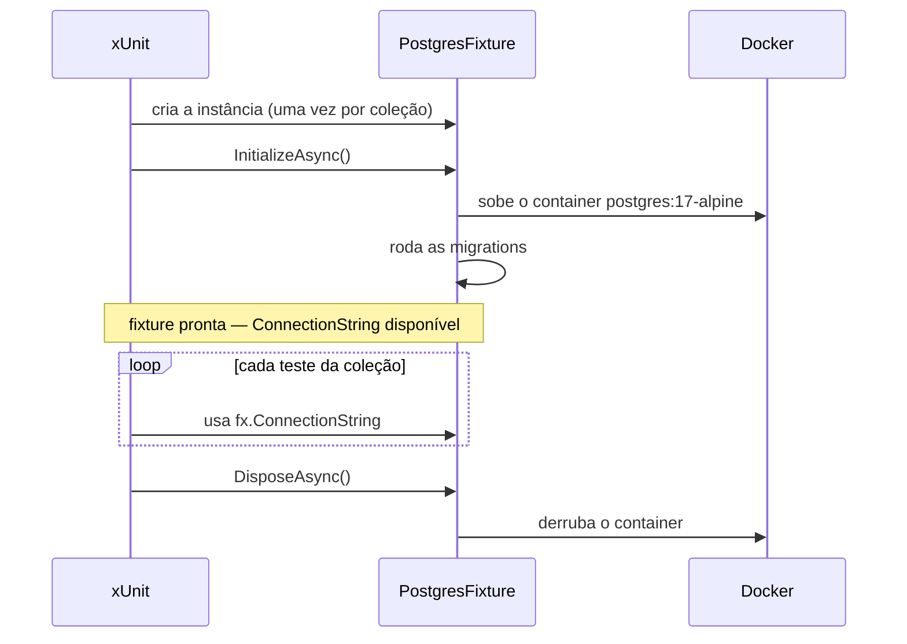
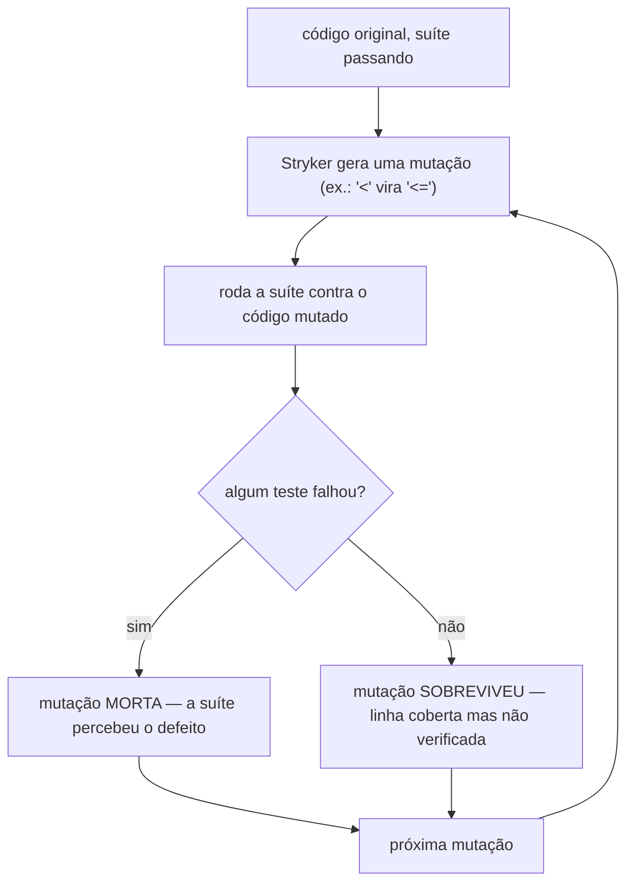

# Capítulo 06 — Testes e qualidade

> **Módulo 5 do roteiro.** Pré-requisito: [Capítulo 05](05-workers-daemons-generic-host.md).
> **Tempo:** 2 a 3 semanas.
> **Entrega:** suíte retroativa cobrindo parser, pipeline, CLI e worker — com pelo menos um bug real encontrado.

## Por que este capítulo é retroativo de propósito

Você escreve testes para código que **já existe e já tem bugs**. Isso é deliberado: escrever teste junto com o código ensina a testar o que você acabou de pensar; escrever teste para código de semanas atrás ensina a testar o que o código realmente faz.

O critério de aceite exige "pelo menos um bug real encontrado e documentado". Ele vai aparecer. Provavelmente no buffer reaproveitado do Capítulo 02, no `Complete()` do Capítulo 03, ou no lock do Capítulo 05.

---

## 1. xUnit v3

**Por que isso importa:** todo capítulo até aqui pediu para "testar" alguma coisa no critério de aceite, sem nunca mostrar como escrever um teste automatizado de verdade. Esta seção é onde essa lacuna fecha — e o resto do curso passa a assumir que você sabe escrever e rodar um teste.

> 📖 **Conceito: teste automatizado, xUnit**
> Um teste automatizado é código que verifica se outro código se comporta como esperado, executado por uma ferramenta (não manualmente por uma pessoa clicando na tela). Ele roda uma ação e compara o resultado obtido com o resultado esperado — se forem diferentes, o teste "falha" e aponta exatamente qual comparação não bateu. **xUnit** é um **framework de teste**: uma biblioteca que fornece a infraestrutura para escrever, organizar e rodar testes (`dotnet test`, visto no Capítulo 00, é o comando que os executa). É um dos frameworks mais usados no ecossistema .NET.

São três pacotes, com papéis distintos — confundi-los é a causa mais comum de "escrevi o teste e o `dotnet test` não encontra nada":

```bash
dotnet new classlib -o tests/Cnab.Parsing.Tests
cd tests/Cnab.Parsing.Tests

dotnet add package xunit.v3                   # o framework: [Fact], [Theory], asserções
dotnet add package xunit.runner.visualstudio  # o adaptador que faz o VS/VS Code/`dotnet test` enxergarem os testes
dotnet add package Microsoft.NET.Test.Sdk     # a infraestrutura genérica de execução de teste do .NET
```

> ⚠️ **Armadilha: projeto de teste v3 é um executável**
> Esta é a diferença estrutural entre xUnit v2 e v3, e a causa número um de "escrevi o teste e não acontece nada": **em v3, todo projeto de teste é um programa que roda sozinho**, não uma biblioteca. Como `dotnet new classlib` gera uma biblioteca, é preciso acrescentar uma linha ao `.csproj`:
> ```xml
> <PropertyGroup>
>   <OutputType>Exe</OutputType>
> </PropertyGroup>
> ```
> Sem ela o build falha com uma mensagem sobre projetos de teste precisarem ser executáveis.

O `Directory.Build.targets` do Capítulo 01 já traz essa linha, junto do `IsTestProject`:

```xml
<PropertyGroup Condition="$(MSBuildProjectName.EndsWith('.Tests'))">
  <IsPackable>false</IsPackable>
  <IsTestProject>true</IsTestProject>
  <OutputType>Exe</OutputType>       <!-- xUnit v3: projeto de teste é executável -->
</PropertyGroup>
```

Confirme que está lá antes de seguir — é ela que faz a armadilha acima nunca acontecer no seu repositório, e que dispensa tocar em qualquer `.csproj` de teste daqui em diante. Se você não fez o Capítulo 01, acrescente a linha ao `.csproj` do projeto de teste, à mão.

**Rodando os testes no VS Code.** O pacote `xunit.runner.visualstudio` acima é justamente o que faz seus testes aparecerem no editor. Com ele instalado, abra o painel **Testing** (o ícone de frasco na barra lateral, ou `Ctrl+Shift+P` → "Test: Focus on Test Explorer View"): os testes são descobertos sozinhos e ganham três coisas úteis que a linha de comando não dá:

- rodar **um único** teste, ou uma classe, sem esperar a suíte inteira;
- **depurar** um teste com breakpoint — clique com o botão direito no teste → *Debug Test*. Combinado com o breakpoint condicional do Capítulo 00 (seção 2.2), é a forma mais rápida de entender por que uma asserção falhou;
- um ícone verde/vermelho ao lado de cada `[Fact]` no próprio arquivo, que reflete o último resultado.

> **`dotnet test` continua sendo a fonte de verdade.** O painel é conveniência local; é o comando que roda no CI (Capítulo 01) e é ele que decide se a suíte passa. Se um teste passa no painel e falha no `dotnet test`, confie no segundo — a diferença costuma ser estado deixado por outro teste que o painel não executou junto (a armadilha de isolamento da seção 1.1).

> **Atalho:** o xUnit publica templates próprios, instaláveis com `dotnet new install xunit.v3.templates`, que depois deixam `dotnet new xunit3` disponível já com tudo configurado — inclusive o `OutputType` da armadilha acima. Eles **não** vêm na caixa do SDK: se `dotnet new xunit3` reclamar que o template não existe, é porque o pacote de templates não foi instalado. O caminho manual acima funciona sempre e não depende disso.

Ao longo do capítulo aparecem mais seis, cada um no seu tema. Instale-os quando chegar à seção correspondente, não todos agora:

| Pacote | Seção | Para quê |
|--------|-------|----------|
| `NSubstitute` | 2.1 | dublês de teste |
| `Shouldly` | 2.2 | asserções legíveis |
| `Microsoft.Extensions.TimeProvider.Testing` | 3 | `FakeTimeProvider` |
| `Testcontainers.PostgreSql` | 4 | Postgres real em container |
| `Verify.XunitV3` | 5 | snapshot testing |
| `CsCheck` | 6 | property-based testing |

Lembre-se de que, com o Central Package Management do Capítulo 01 ligado, as versões vão para o `Directory.Packages.props` — os três pacotes da tabela acima já estão declarados lá desde aquele capítulo; os seis desta tabela você acrescenta conforme chegar em cada seção. Um `dotnet add package X` num repositório com CPM ligado escreve a versão no `.csproj` e quebra a regra (armadilha do Capítulo 01, seção 4): use `--no-restore` e mova a versão à mão, ou edite o `Directory.Packages.props` direto.

> 🐍 **Vindo de outra stack**
> — **Python:** `[Fact]` é a função `test_*` do pytest, e `[Theory]` + `[InlineData]` é exatamente `@pytest.mark.parametrize`. Fixtures do xUnit (`IClassFixture`, `ICollectionFixture`) correspondem às fixtures do pytest com `scope="class"` e `scope="session"`. `NSubstitute` faz o papel de `unittest.mock`.
> — **Java:** `[Fact]` ≈ `@Test`, `[Theory]`+`[InlineData]` ≈ `@ParameterizedTest`+`@ValueSource`. Testcontainers é literalmente a mesma biblioteca, portada — se você já a usou em Java, a API vai parecer familiar. `NSubstitute` ≈ Mockito.
> — **Go:** `[Fact]` ≈ `func TestX(t *testing.T)`, e `[Theory]` é o equivalente aos table-driven tests que você já escreve à mão — aqui o framework cuida da tabela. A diferença cultural maior: no .NET, usar biblioteca de asserção e de mock é o padrão, não exceção.

```csharp
public class ParserRetornoTests
{
    [Fact]
    public void Detalhe_valido_e_parseado()
    {
        var registro = RegistroBuilder.Detalhe()
            .ComNossoNumero(12345)
            .ComOcorrencia("06")
            .ToBytes();

        var ok = ParserRetorno.TentarParseDetalhe(registro, out var detalhe);

        ok.ShouldBeTrue();
        detalhe.NossoNumero.ShouldBe(12345);
    }

    [Theory]
    [InlineData("06", true)]
    [InlineData("03", true)]
    [InlineData("XX", false)]
    [InlineData("  ", false)]
    public void Codigo_de_ocorrencia_e_validado(string codigo, bool esperado)
        => ParserRetorno.TentarParseDetalhe(Registro(codigo), out _).ShouldBe(esperado);
}
```

Lendo o exemplo: `[Fact]` marca um método como um teste de caso único — "dado este cenário específico, este resultado é esperado". Dentro dele, o padrão é sempre o mesmo: preparar o cenário (`RegistroBuilder.Detalhe(...)`), executar a ação sendo testada (`ParserRetorno.TentarParseDetalhe(...)`), e então verificar o resultado com uma **asserção** (`ok.ShouldBeTrue()`, `detalhe.NossoNumero.ShouldBe(12345)` — métodos que falham o teste se a condição não for verdadeira; a sintaxe `.ShouldX()` vem da biblioteca Shouldly, vista na seção 2.2). `[Theory]` combinado com `[InlineData]` evita repetir o mesmo teste várias vezes só mudando os valores: cada linha `[InlineData(...)]` roda o método de teste uma vez, com aqueles argumentos — no exemplo, quatro execuções diferentes de `Codigo_de_ocorrencia_e_validado`, uma por linha. Para dados complexos que não cabem numa anotação simples, `[MemberData]` ou `[ClassData]` apontam para uma fonte de dados mais elaborada.

### 1.1 Paralelismo e isolamento

Por padrão, o xUnit roda classes de teste **em paralelo** e métodos da mesma classe em série. Testes que tocam o mesmo recurso (diretório, container, banco) precisam de coleção compartilhada:

```csharp
[CollectionDefinition("postgres")]
public class PostgresCollection : ICollectionFixture<PostgresFixture>;

[Collection("postgres")]
public class RepositorioTests(PostgresFixture fixture) { /* ... */ }
```

- `IClassFixture<T>` — uma instância por classe de teste.
- `ICollectionFixture<T>` — uma instância compartilhada por várias classes. É o que evita subir dez containers.

> ⚠️ **Armadilha**
> Teste que passa isolado e falha na suíte quase sempre é estado compartilhado: diretório temporário fixo, `static` mutável, ou banco sem limpeza entre testes. Use `Path.Combine(Path.GetTempPath(), Guid.NewGuid().ToString())` para diretórios e transação com rollback ou `Respawn` para banco.

**TUnit** é uma alternativa mais nova, com source generators e sem reflection, o que a torna amigável a AOT. Se você já conhece xUnit, não há urgência em trocar; se está começando do zero, vale olhar.

---

## 2. Dublês e asserções

**Por que isso importa:** testar `ProcessadorDeArquivo` de verdade, com um banco de dados real, é lento e exige infraestrutura rodando. Esta seção mostra como isolar a peça sendo testada das suas dependências, para testar a lógica sem precisar de tudo à sua volta.

> 📖 **Conceito: dublê de teste (test double) e mock**
> Um "dublê de teste" (o termo em inglês, "test double", faz analogia com dublê de cinema) é um objeto que substitui uma dependência real durante um teste, com comportamento controlado e previsível pelo próprio teste. **Mock** é o tipo mais comum: um dublê configurado para responder de forma específica a chamadas ("quando perguntarem `ExisteAsync`, responda `true`") e que também permite verificar depois se foi chamado como esperado. Isso evita que o teste dependa de infraestrutura real (banco, rede) só para testar uma lógica que não é sobre banco ou rede.

### 2.1 NSubstitute

```csharp
var repo = Substitute.For<IRepositorioLote>();
repo.ExisteAsync(Arg.Any<string>(), Arg.Any<CancellationToken>()).Returns(true);

var processador = new ProcessadorDeArquivo(repo, NullLogger<ProcessadorDeArquivo>.Instance);
await processador.ProcessarAsync("a.ret", CancellationToken.None);

await repo.DidNotReceive().GravarAsync(Arg.Any<Lote>(), Arg.Any<CancellationToken>());
```

Sintaxe mais legível que Moq e sem o problema de licenciamento que Moq teve. Alternativa: **FakeItEasy**.

**Quando não usar mock:** para valor, use o objeto real. Para tempo, use `FakeTimeProvider`. Para banco, use Testcontainers. Mock é para o que é caro, lento ou não determinístico — não para tudo que tem interface.

### 2.2 Shouldly

```csharp
resultado.Total.ShouldBe(1000);
resultado.Erros.ShouldBeEmpty();
resultado.Ocorrencias.ShouldContain(o => o.Codigo == "06");
Should.Throw<FormatException>(() => Parse("lixo"));
await Should.ThrowAsync<OperationCanceledException>(() => pipeline.ExecutarAsync(f, cancelado));
```

A vantagem real é a mensagem de falha: `resultado.Total.ShouldBe(1000)` reporta a expressão e o valor recebido, em vez de "Expected 1000, got 999".

**AwesomeAssertions** é o fork mantido do FluentAssertions após a mudança de licença deste. Escolha uma e padronize.

---

## 3. Tempo controlado: `TimeProvider`

**Por que isso importa:** um teste que espera 500ms de verdade porque o código chama `Task.Delay(500)` é lento, e multiplicado por centenas de testes, a suíte inteira fica lenta. Pior: um teste que depende de tempo real de relógio é uma fonte clássica de **teste flaky** — que às vezes passa e às vezes falha, sem o código ter mudado, só porque o ambiente estava mais lento naquela execução.

Toda lógica que depende de relógio deve receber `TimeProvider` (um objeto que representa "o relógio", que pode ser trocado por uma versão controlável em teste). Nunca `DateTime.Now` direto no código, nunca `Task.Delay` sem essa abstração.

```csharp
public sealed class DetectorDeArquivoEstavel(TimeProvider tempo)
{
    public async Task<bool> EstavelAsync(string caminho, CancellationToken ct)
    {
        var a = new FileInfo(caminho).Length;
        await Task.Delay(TimeSpan.FromMilliseconds(500), tempo, ct);   // ← usa o provider
        return new FileInfo(caminho).Length == a;
    }
}
```

```csharp
// teste: 500 ms viram instantâneos
var tempo = new FakeTimeProvider(new DateTimeOffset(2026, 3, 15, 10, 0, 0, TimeSpan.Zero));
var detector = new DetectorDeArquivoEstavel(tempo);

var tarefa = detector.EstavelAsync(caminho, ct);
tempo.Advance(TimeSpan.FromMilliseconds(500));
(await tarefa).ShouldBeTrue();
```

```csharp
// registro no DI
builder.Services.AddSingleton(TimeProvider.System);
```

Isso elimina a categoria inteira de teste flaky por temporização — talvez o melhor retorno sobre investimento deste capítulo. `PeriodicTimer` também aceita `TimeProvider`, então o loop do worker fica testável.

---

## 4. Testcontainers

**Por que isso importa:** mockar o banco de dados (seção 2) é rápido, mas não pega bugs reais de SQL, de mapeamento do EF, ou de comportamento específico do Postgres. Esta seção resolve o outro lado do trade-off: testar contra um banco real, mas sem exigir que cada desenvolvedor mantenha um banco de dados de teste instalado manualmente.

> 📖 **Conceito: container**
> Um container é uma forma de empacotar um programa (aqui, o Postgres) junto com tudo que ele precisa para rodar, de forma isolada do resto do sistema — o mesmo container roda identicamente em qualquer máquina que tenha o Docker instalado. Diferente de uma máquina virtual completa, um container é leve e rápido de criar e destruir (segundos, não minutos). **Testcontainers** é uma biblioteca que sobe e derruba containers automaticamente, controlados pelo próprio código de teste — o container existe só durante a execução dos testes, e desaparece depois.

Banco real em container, criado e destruído pelo teste.

```csharp
public sealed class PostgresFixture : IAsyncLifetime
{
    private readonly PostgreSqlContainer _container = new PostgreSqlBuilder()
        .WithImage("postgres:17-alpine")
        .WithDatabase("cnab_test")
        .Build();

    public string ConnectionString => _container.GetConnectionString();

    public async ValueTask InitializeAsync()
    {
        await _container.StartAsync();
        await using var db = new AppDbContext(Opcoes());
        await db.Database.MigrateAsync();          // roda as migrations de verdade
    }

    public ValueTask DisposeAsync() => _container.DisposeAsync();
}
```

```csharp
[Collection("postgres")]
public class PersistenciaTests(PostgresFixture fx)
{
    [Fact]
    public async Task Reprocessar_mesmo_arquivo_nao_duplica()
    {
        await using var db = NovoContexto(fx.ConnectionString);
        var repo = new RepositorioLote(db);

        await repo.GravarAsync(LoteDeExemplo(), TestContext.Current.CancellationToken);
        await repo.GravarAsync(LoteDeExemplo(), TestContext.Current.CancellationToken);

        (await db.Registros.CountAsync()).ShouldBe(1000);   // não 2000
    }
}
```

O ciclo de vida da fixture, do ponto de vista de quem lê `IAsyncLifetime` pela primeira vez:



Containers úteis no curso: `PostgreSqlBuilder`, `RabbitMqBuilder`, `RedisBuilder`, `LocalStackBuilder` (S3), `MinioBuilder`.

**Custo e velocidade.** Subir um container leva alguns segundos. A conta fecha se você compartilhar a fixture por coleção e limpar dados entre testes em vez de recriar o container. Para limpeza, `Respawn` apaga tudo rapidamente respeitando as FKs.

> ⚠️ **Armadilha**
> Testcontainers exige Docker rodando, inclusive no CI. Em GitHub Actions o runner Linux já tem. Marque os testes com `[Trait("Category", "Integration")]` para poder rodar só os unitários localmente: `dotnet test --filter Category!=Integration`.

---

## 5. Snapshot testing com Verify

**Por que isso importa:** para testar que um arquivo de remessa de 240 caracteres por linha foi gerado corretamente, escrever o texto esperado inteiro à mão, num `ShouldBe("...")` gigante, é tedioso e ninguém revisa isso de verdade em code review. Esta técnica resolve esse caso específico.

> 📖 **Conceito: snapshot testing**
> Em vez de você escrever manualmente o resultado esperado, o teste roda o código uma vez, salva o resultado obtido como "o esperado" (o snapshot), e todas as execuções futuras comparam o resultado novo contra esse snapshot salvo. Se algo mudar, o teste falha e mostra a diferença (diff) entre o snapshot salvo e o resultado atual — cabe a você decidir se a mudança é um bug (e corrigir o código) ou uma alteração intencional (e atualizar o snapshot).

Perfeito para layout de arquivo posicional, onde o resultado esperado é grande e chato de escrever à mão.

```csharp
[Fact]
public async Task Layout_de_remessa_gerado_permanece_estavel()
{
    var remessa = GeradorRemessa.Gerar(TitulosDeExemplo(), dataFixa);
    await Verify(remessa).UseDirectory("Snapshots");
}
```

Na primeira execução, o teste falha e gera `*.received.txt`. Você inspeciona, e se estiver correto renomeia para `*.verified.txt` e commita. Da próxima vez que alguém mexer no layout, o diff aparece no teste.

```csharp
// normalizar o que varia
public static class VerifyConfig
{
    [ModuleInitializer]
    public static void Init()
    {
        VerifierSettings.ScrubInlineGuids();
        VerifierSettings.AddScrubber(sb => sb.Replace(DateTime.Now.ToString("ddMMyyyy"), "DDMMYYYY"));
    }
}
```

Isso é especialmente valioso em CNAB: o arquivo de remessa tem 240 caracteres por linha com espaços significativos. Um diff visual de snapshot pega deslocamento de campo que nenhuma asserção pontual pegaria.

---

## 6. Property-based testing

**Por que isso importa:** todo teste visto até aqui usa exemplos específicos escolhidos por você — e você só pensa nos exemplos que já imagina que podem dar errado. Essa técnica inverte a lógica: em vez de você escolher os casos, uma ferramenta gera automaticamente centenas de entradas aleatórias (dentro de regras que você define), incluindo casos extremos que você nunca pensaria em testar manualmente.

Em vez de exemplos, você declara **propriedades** — afirmações que devem valer para *qualquer* entrada válida, não só para os casos que você imaginou — e a biblioteca gera centenas de casos automaticamente para tentar quebrar essa afirmação.

```csharp
using CsCheck;

[Fact]
public void Roundtrip_de_registro_preserva_todos_os_campos()
{
    Gen.Select(Gen.Long[0, 9_999_999_999_999],
               Gen.Short[1, 99],
               Gen.Date[new DateTime(2000,1,1), new DateTime(2035,12,31)],
               Gen.Long[0, 999_999_999_999_99])
       .Sample((nn, oc, data, valor) =>
       {
           var registro = Formatador.Escrever(nn, oc, DateOnly.FromDateTime(data), valor);
           ParserRetorno.TentarParseDetalhe(registro, out var lido).ShouldBeTrue();

           lido.NossoNumero.ShouldBe(nn);
           lido.CodigoOcorrencia.ShouldBe(oc);
           lido.DataOcorrencia.ShouldBe(DateOnly.FromDateTime(data));   // "todos" quer dizer todos
           lido.ValorCentavos.ShouldBe(valor);
       }, iter: 10_000);
}
```

Propriedades que valem a pena no domínio:

- **Roundtrip:** escrever e reler preserva tudo.
- **Nunca estoura:** qualquer sequência de 240 bytes ou retorna `false` ou retorna um registro válido; nunca lança exceção não tratada.
- **Idempotência:** processar duas vezes produz o mesmo estado final.
- **Invariante de totais:** soma dos detalhes é igual ao valor do trailer.

Quando o teste falha, o **shrinking** reduz o contraexemplo ao caso mínimo — e esse caso mínimo costuma ser mais instrutivo que o bug original.

---

## 7. `WebApplicationFactory`

**Por que isso importa:** testes de mock (seção 2) verificam uma peça isolada; testes contra Testcontainers (seção 4) verificam persistência real. Nenhum dos dois pega um erro de configuração da API inteira — rota mal registrada, middleware na ordem errada (o Capítulo 08 explica por que a ordem importa). Esta ferramenta sobe a aplicação inteira, de verdade, só que dentro do processo de teste.

Para o Capítulo 08, mas registre o padrão agora:

> ⚠️ **Armadilha: `WebApplicationFactory<Program>` não compila sem um preparo do lado da API**
> Com top-level statements, o compilador gera a classe `Program` como **internal**, e o projeto de teste — que é outro assembly — não a enxerga. O erro fala de acessibilidade e não dá pista nenhuma da solução, que é acrescentar `public partial class Program;` na última linha do `Program.cs` da API. O Capítulo 08 (seção 1) traz essa linha já no primeiro exemplo, pelo mesmo motivo. Se você estiver experimentando o padrão agora, antes de ter uma API, é isso que está faltando.

```csharp
public sealed class ApiFactory(PostgresFixture db) : WebApplicationFactory<Program>
{
    protected override void ConfigureWebHost(IWebHostBuilder builder)
    {
        builder.UseSetting("ConnectionStrings:Default", db.ConnectionString);
        builder.ConfigureTestServices(services =>
        {
            services.RemoveAll<IPublicadorDeEventos>();
            services.AddSingleton<IPublicadorDeEventos, PublicadorFake>();
        });
    }
}

[Fact]
public async Task Consulta_de_lote_inexistente_retorna_404()
{
    var client = _factory.CreateClient();
    var resposta = await client.GetAsync("/lotes/999");
    resposta.StatusCode.ShouldBe(HttpStatusCode.NotFound);
}
```

Isso sobe a aplicação inteira em memória, com o pipeline de middleware real. É o teste que pega erro de ordem de middleware, de serialização e de binding — coisas que teste unitário de handler nunca pega.

---

## 8. Cobertura honesta e mutation testing

**Por que isso importa:** "quantos % do código os testes cobrem" é a métrica de qualidade de teste mais citada e mais mal-entendida que existe. Esta seção separa o que essa métrica realmente diz do que as pessoas costumam achar que ela diz.

### 8.1 Cobertura

> 📖 **Conceito: cobertura de código**
> Cobertura é a porcentagem de linhas (ou branches, ou outra unidade) do código-fonte que foram executadas em algum momento durante a suíte de testes. É uma métrica sobre o que **rodou**, não sobre o que foi **verificado** — um teste que chama uma função e não checa o resultado dela com nenhuma asserção ainda conta como "cobertura" daquela função, mesmo não provando nada sobre seu comportamento.

```bash
dotnet test --collect:"XPlat Code Coverage"
dotnet tool install -g dotnet-reportgenerator-globaltool
reportgenerator -reports:**/coverage.cobertura.xml -targetdir:coverage -reporttypes:Html
```

Cobertura mede **o que foi executado**, não o que foi verificado. Um teste que chama tudo e não assere nada dá 100%. Por isso ela é métrica de piso, não de qualidade: cobertura baixa é sinal certo de problema; cobertura alta não é sinal de nada.

### 8.2 Stryker.NET

Mutation testing responde a pergunta certa: **se eu quebrar o código, o teste percebe?** O Stryker introduz mutações (troca `<` por `<=`, `true` por `false`, remove chamada) e roda a suíte. Mutação que sobrevive é linha coberta mas não verificada.



Uma mutação sobrevivente aponta exatamente a linha e o tipo de defeito que nenhum teste hoje detecta — mais útil que "cobertura: 92%", que não diz nada sobre a qualidade da asserção.

```bash
dotnet tool install -g dotnet-stryker
dotnet stryker --project src/Cnab.Parsing/Cnab.Parsing.csproj
```

```json
// stryker-config.json
{
  "stryker-config": {
    "project": "Cnab.Parsing.csproj",
    "test-projects": ["../../tests/Cnab.Parsing.Tests/Cnab.Parsing.Tests.csproj"],
    "thresholds": { "high": 85, "low": 70, "break": 70 },
    "mutate": ["**/*.cs", "!**/Layout*.cs"],
    "reporters": ["html", "progress"]
  }
}
```

Stryker é lento — roda a suíte uma vez por mutação. Rode no núcleo de parsing, não no projeto inteiro, e num job noturno em vez de em cada PR.

---

## 9. Testando as partes difíceis

### 9.1 Testar desligamento gracioso

```csharp
[Fact]
public async Task Shutdown_termina_o_arquivo_em_andamento_e_libera_o_lock()
{
    var locks = new LockEmMemoria();
    var processador = new ProcessadorLento(atrasoPorRegistro: TimeSpan.FromMilliseconds(10));
    using var host = ConstruirHost(locks, processador);

    await host.StartAsync();
    await processador.ComecouAProcessar.Task;           // TaskCompletionSource sinalizando início

    var sw = Stopwatch.StartNew();
    await host.StopAsync(TimeSpan.FromSeconds(30));     // simula o SIGTERM
    sw.Stop();

    processador.ArquivoConcluido.ShouldBeTrue();        // terminou o que estava fazendo
    locks.Ativos.ShouldBeEmpty();                       // liberou
    sw.Elapsed.ShouldBeLessThan(TimeSpan.FromSeconds(30));
}
```

Este é o teste que o critério de aceite exige. A chave é usar `TaskCompletionSource` para sincronizar com o estado interno em vez de `Task.Delay` arbitrário.

### 9.2 Testar que nada se perde no pipeline

Condição de corrida (Capítulo 03) quase nunca aparece numa única execução — é da natureza dela só se manifestar em certas coincidências de tempo. Um teste que roda uma vez e passa não prova nada aqui; é preciso repetir.

O xUnit **não** tem um atributo `[Repeat]` embutido. O jeito padrão de repetir um teste é transformá-lo numa `[Theory]` alimentada por uma fonte de dados com N entradas — cada entrada vira uma execução independente, que aparece separadamente no relatório:

```csharp
public class PipelineTests
{
    public static TheoryData<int> Repeticoes =>
        new(Enumerable.Range(1, 50));          // 50 execuções independentes

    [Theory]
    [MemberData(nameof(Repeticoes))]
    public async Task Pipeline_nao_perde_nem_duplica(int tentativa)
    {
        var arquivo = GerarArquivo(registros: 10_000);
        var resumo = await pipeline.ExecutarAsync(arquivo, TestContext.Current.CancellationToken);

        (resumo.Processados + resumo.Rejeitados).ShouldBe(10_000, $"tentativa {tentativa}");
        resumo.IdsProcessados.Distinct().Count().ShouldBe(resumo.Processados);
    }
}
```

A vantagem de repetir por `[Theory]` em vez de um `for` dentro de um único teste: o relatório mostra **quantas** das 50 falharam, não só que "o teste falhou". Numa condição de corrida, a diferença entre 1 falha em 50 e 40 em 50 é informação diagnóstica valiosa — a primeira sugere uma janela estreita, a segunda um erro grosseiro. Incluir o número da tentativa na mensagem da asserção (`$"tentativa {tentativa}"`) faz essa informação chegar até a saída.

> ⚠️ **Armadilha**
> Repetir dentro de um `for` no mesmo método tem outro problema além do relatório: o estado do teste anterior fica para a iteração seguinte. Com `[Theory]`, cada execução recria a instância da classe de teste do zero — que é justamente o isolamento que você quer ao caçar corrida.

### 9.3 Testar cancelamento

```csharp
[Fact]
public async Task Cancelamento_se_propaga_em_menos_de_um_segundo()
{
    using var cts = new CancellationTokenSource();
    var tarefa = pipeline.ExecutarAsync(arquivoGrande, cts.Token);

    // espera o pipeline estar REALMENTE processando, não um tempo arbitrário
    await pipeline.PrimeiroRegistroProcessado.Task.WaitAsync(TimeSpan.FromSeconds(5));

    var sw = Stopwatch.StartNew();
    await cts.CancelAsync();
    await Should.ThrowAsync<OperationCanceledException>(() => tarefa);
    sw.Elapsed.ShouldBeLessThan(TimeSpan.FromSeconds(1));
}
```

Repare que aqui **não** há `await Task.Delay(500)` para "dar tempo do pipeline começar". Seria a escrita natural, e é exatamente o que o critério de aceite deste capítulo proíbe: num CI carregado, 500 ms podem não bastar, e o teste falha sem que nada esteja errado no código. `PrimeiroRegistroProcessado` é um `TaskCompletionSource` exposto pelo pipeline só para teste — o mesmo padrão da seção 9.1, e a mesma razão. O `Stopwatch` depois do cancelamento, esse sim, mede o que o teste existe para medir.

---

## 10. Organização da suíte

```
tests/
├── Cnab.Parsing.Tests/          # unitários puros, rápidos, sem IO
│   ├── ParserRetornoTests.cs
│   ├── PropriedadesDoParserTests.cs
│   └── Snapshots/
├── Cnab.Pipeline.Tests/         # concorrência, com TimeProvider falso
├── Cnab.Cli.Tests/              # exit codes, saída JSON
├── Cnab.Worker.Tests/           # ciclo de vida, lock
└── Cnab.Integration.Tests/      # Testcontainers — os lentos, isolados aqui
```

Separar os lentos num projeto próprio permite:

```bash
dotnet test tests/Cnab.Parsing.Tests    # segundos, rode a cada salvamento
dotnet test                             # tudo, no CI
```

### Builders de teste

Escreva builders, não literais de 240 caracteres:

```csharp
public sealed class RegistroBuilder
{
    private long _nossoNumero = 1;
    private string _ocorrencia = "06";
    private DateOnly _data = new(2026, 3, 15);
    private long _valor = 10_000;

    public static RegistroBuilder Detalhe() => new();
    public RegistroBuilder ComNossoNumero(long nn) { _nossoNumero = nn; return this; }
    public RegistroBuilder ComOcorrencia(string o) { _ocorrencia = o; return this; }
    public RegistroBuilder ComValor(long centavos) { _valor = centavos; return this; }
    public RegistroBuilder ComData(DateOnly d) { _data = d; return this; }

    public byte[] ToBytes()
    {
        var buffer = new byte[240];
        buffer.AsSpan().Fill((byte)' ');
        // preenche cada campo conforme o layout
        return buffer;
    }
}
```

Sem isso, cada teste vira um literal ilegível e ninguém entende qual campo está sendo testado.

---

## 11. Exercícios

Diferente dos capítulos anteriores, aqui os exercícios **são** o começo do projeto: cada um produz um teste que você vai manter. Comece por `Cnab.Parsing`, que é puro e rápido, e só depois vá para os que exigem Docker.

1. **O primeiro teste vermelho.** Escreva um `[Fact]` que falha de propósito (`1.ShouldBe(2)`) e rode `dotnet test`. Leia a saída inteira: qual arquivo, qual linha, valor esperado e obtido. Depois faça passar. Parece trivial, mas saber ler a saída de falha é o que você mais vai fazer neste capítulo.

2. **De `[Fact]` para `[Theory]`.** Escreva quatro `[Fact]` quase idênticos testando quatro códigos de ocorrência diferentes. Agora colapse-os num único `[Theory]` com `[InlineData]`. Confirme que `dotnet test` continua reportando **quatro** testes, não um — é essa a propriedade que justifica a conversão.

3. **Builder contra literal.** Escreva um teste do parser usando um literal de 240 caracteres escrito à mão. Depois reescreva-o com o `RegistroBuilder` da seção 10. Compare os dois quanto a: quanto tempo levou para escrever, se dá para ver *qual campo* está sendo testado, e o que acontece quando o layout muda de posição.

4. **Mock onde cabe, real onde não cabe.** Teste `ProcessadorDeArquivo` com `IRepositorioLote` substituído por NSubstitute, verificando que `GravarAsync` **não** foi chamado quando o lote já existe. Depois tente mockar `DetalheRetorno` (um `readonly record struct`) e explique por que isso não faz sentido — é a regra "mock é para o que é caro, lento ou não determinístico" da seção 2.1.

5. **Congelando o relógio.** Pegue o `EstavelAsync` do worker do Capítulo 05, que espera 500 ms reais. Escreva o teste com `FakeTimeProvider` e confirme que ele roda em **milissegundos**, não em meio segundo. Cronometre a suíte antes e depois. Multiplique a diferença por cem testes para entender o argumento da seção 3.

6. **Teste flaky, de propósito.** Escreva um teste que usa `await Task.Delay(100)` para "esperar" um processamento assíncrono terminar, e rode-o 50 vezes com a técnica da seção 9.2. Sob carga (rode um `stress` ou compile outro projeto em paralelo), ele deve falhar às vezes. Corrija com `TaskCompletionSource` e confirme que passa a ser estável nas 50. Este é o exercício que justifica a regra "nenhum `Task.Delay` fixo como sincronização" do critério de aceite.

7. **Snapshot que pega deslocamento.** Gere um arquivo de remessa e aprove o snapshot. Agora mude **um único campo de posição** no layout (de 38 para 39) e rode de novo. Olhe o diff: ele deve mostrar exatamente o deslocamento. Compare com o que uma asserção pontual (`remessa.Length.ShouldBe(240)`) teria detectado — nada.

8. **Propriedade que quebra.** Escreva a propriedade "nunca estoura": para qualquer sequência de 240 bytes aleatórios, `TentarParseDetalhe` ou devolve `false` ou devolve um registro válido, mas **nunca** lança exceção. Rode com 10.000 iterações. Se ela passar de primeira, estreite o gerador para produzir bytes mais parecidos com registros reais (dígitos e espaços, com um campo ocasionalmente inválido) — é onde os bugs moram. Quando falhar, anote o contraexemplo mínimo que o shrinking produziu.

9. **Container de verdade.** Suba a `PostgresFixture` da seção 4 e escreva o teste de reprocessamento que não duplica. Cronometre: quanto do tempo total é subir o container? Agora adicione uma segunda classe de teste na **mesma** `[Collection]` e confirme que o container é reaproveitado, não recriado. Esse é o truque que faz a suíte caber em dois minutos.

10. **Mutação que sobrevive.** Rode o Stryker em `Cnab.Parsing` e abra o relatório HTML. Escolha **uma** mutação sobrevivente, entenda por que nenhum teste a matou, e escreva o teste que a mata. Rode de novo e confirme que o score subiu. Uma só já ensina o conceito inteiro — não tente matar todas.

11. **O bug real** *(este é o projeto começando)*. Escolha um item da lista "Bugs que a suíte provavelmente vai encontrar" do projeto, escreva o teste que o expõe, e confirme que ele **falha** contra o seu código atual dos capítulos 02–05. Só então corrija. Documente no `docs/bugs-encontrados.md`. Se o teste passar de primeira, ou você já tinha acertado, ou o teste não está testando o que você acha — desconfie da segunda hipótese primeiro.

---

## 📦 Projeto: suíte retroativa dos capítulos 02 a 05

### Enunciado

Cobrir parser, pipeline, CLI e worker, incluindo um teste que prova o desligamento gracioso.

### Plano de ataque

1. **Parser** — exemplos dos casos de borda, property-based para roundtrip e "nunca estoura", snapshot do gerador de remessa.
2. **Pipeline** — backpressure, cancelamento, nada perdido nem duplicado, falha de estágio derruba os demais.
3. **CLI** — exit codes por cenário, saída JSON válida contra schema, ausência de ANSI quando redirecionado.
4. **Worker** — desligamento gracioso, lock distribuído com duas instâncias, arquivo instável ignorado.

### ✅ Critério de aceite

- [ ] **Score de mutação acima de 70% em `Cnab.Parsing`**, medido com Stryker e com relatório commitado.
- [ ] **Suíte inteira roda em menos de dois minutos no CI**, Testcontainers incluídos.
- [ ] **Pelo menos um bug real encontrado e documentado** em `docs/bugs-encontrados.md`: sintoma, teste que pegou, causa, correção.
- [ ] Teste que prova desligamento gracioso, com asserção sobre lock liberado.
- [ ] Nenhum `Thread.Sleep` nem `Task.Delay` com valor fixo como sincronização — use `TimeProvider` ou `TaskCompletionSource`.
- [ ] Suíte roda 20 vezes seguidas sem nenhuma falha intermitente (`for i in {1..20}; do dotnet test || break; done`).
- [ ] Testes de integração separados por trait, executáveis isoladamente.

### Bugs que a suíte provavelmente vai encontrar

Não é adivinhação; é a lista dos pontos frágeis que os capítulos anteriores deixaram de propósito:

- Buffer do `ArrayPool` reaproveitado antes de o consumidor terminar (Cap. 02 × 03).
- Registro partido entre dois blocos de leitura quando o arquivo não é múltiplo do passo (Cap. 02, seção 7.1 — lembre que o passo do arquivo de exemplo é 241, não 240).
- `writer.Complete()` não chamado em algum caminho de exceção (Cap. 03).
- Lock não liberado quando a exceção acontece antes do `try` (Cap. 05).
- Campo com acento lido em UTF-8 em vez de Windows-1252 em algum caminho secundário.
- Exit code 0 num caso de falha da CLI (Cap. 04).

Cada um desses vira uma linha no `docs/bugs-encontrados.md`. Esse arquivo é a prova de que o capítulo funcionou.

---

## Checklist de saída

- [ ] Sei por que cobertura alta não significa suíte boa, e sei medir o que significa.
- [ ] Uso `TimeProvider` em toda lógica dependente de relógio.
- [ ] Meus testes de integração usam Testcontainers, não banco compartilhado.
- [ ] Escrevi pelo menos um teste property-based que encontrou algo.
- [ ] Sei testar shutdown, cancelamento e condição de corrida sem `Thread.Sleep`.
- [ ] Minha suíte não tem teste intermitente — e eu verifiquei isso rodando 20 vezes.

## Para ir além

- xUnit v3 — `xunit.net`
- Testcontainers for .NET — `dotnet.testcontainers.org`
- Verify — `github.com/VerifyTests/Verify`
- Stryker.NET — `stryker-mutator.io`
- CsCheck — `github.com/AnthonyLloyd/CsCheck`
- *Unit Testing: Principles, Practices, and Patterns*, Vladimir Khorikov

➡️ **Próximo:** [Capítulo 07 — Dados e persistência](07-dados-e-persistencia.md)
