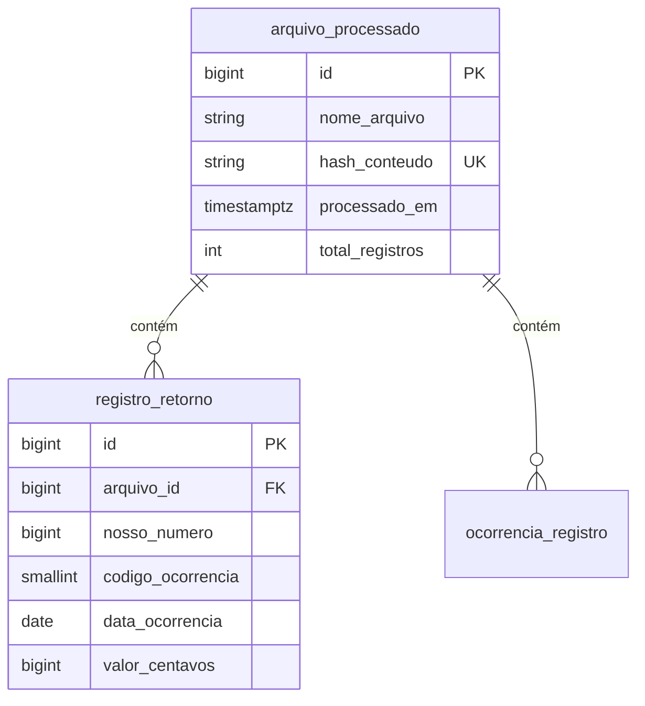
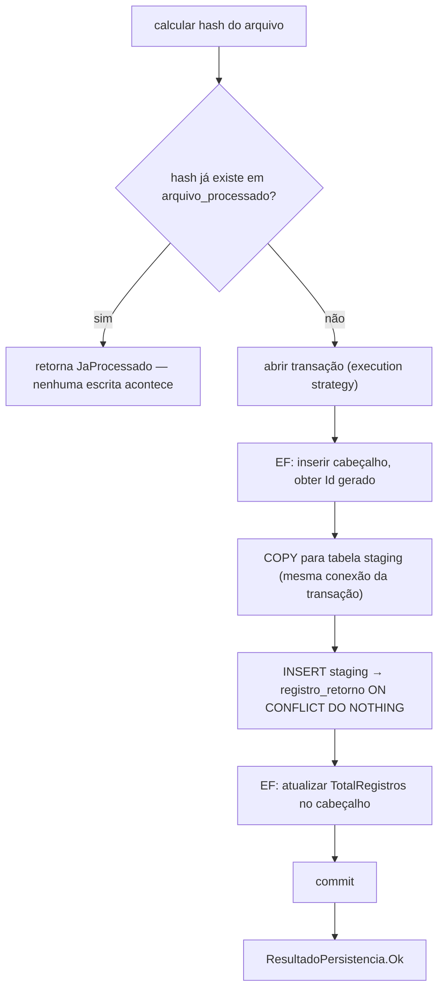

# Capítulo 07 — Dados e persistência

> **Módulo 6 do roteiro.** Pré-requisito: [Capítulo 06](06-testes-e-qualidade.md).
> **Tempo:** 2 a 3 semanas.
> **Entrega:** persistência idempotente de lotes, com benchmark `COPY` × inserção em lote pelo EF.

## Por que este capítulo existe

O gargalo quase nunca é o ORM. É **o número de idas ao banco** e **a falta de idempotência**. Um sistema que faz uma ida por registro processa 500 mil linhas em horas; o mesmo sistema com `COPY` faz em segundos. E um sistema que não é idempotente duplica cobrança quando o pod reinicia — o que em domínio financeiro é incidente, não bug.

---

## 1. EF Core 10: o mínimo bem feito

**Por que isso importa:** até aqui o curso processou arquivos e os manteve na memória. Um sistema real precisa persistir esse resultado de forma durável — sobrevivendo a um restart do processo — e é aqui que o banco de dados relacional entra como peça central do domínio.

> 📖 **Conceito: ORM (Object-Relational Mapper) e Entity Framework Core**
> Um banco relacional (como o Postgres usado neste curso) guarda dados em tabelas, linhas e colunas — um formato bem diferente de objetos C# com propriedades e referências entre eles. Um **ORM** é uma biblioteca que faz essa tradução automaticamente: você trabalha com classes e objetos C# comuns, e o ORM gera o SQL necessário para ler e escrever essas informações no banco, por baixo dos panos. **Entity Framework Core (EF Core)** é o ORM oficial da Microsoft para .NET — é o que permite escrever `db.Arquivos.Add(novoArquivo)` em vez de escrever manualmente um `INSERT INTO arquivo_processado (...) VALUES (...)`.

```bash
dotnet add package Microsoft.EntityFrameworkCore
dotnet add package Npgsql.EntityFrameworkCore.PostgreSQL
dotnet add package Microsoft.EntityFrameworkCore.Design
```

O terceiro pacote confunde na primeira vez: `.Design` não é usado em tempo de execução nenhum. Ele existe só para que as ferramentas de linha de comando (`dotnet ef migrations`, seção 1.3) consigam inspecionar seu modelo em tempo de desenvolvimento. É candidato natural a `PrivateAssets="all"` no Capítulo 01 — não deve virar dependência de quem consome sua biblioteca.

> 🐍 **Vindo de outra stack**
> — **Python:** EF Core ≈ SQLAlchemy ORM, e o `DbContext` é a `Session`. Migrations do EF ≈ Alembic, com a mesma ideia de histórico versionado no banco. Dapper (seção 4) ≈ usar `SQLAlchemy Core` ou `psycopg` direto com mapeamento leve.
> — **Java:** o mapeamento é próximo: EF Core ≈ Hibernate/JPA, `DbContext` ≈ `EntityManager`/`Session`, change tracker ≈ persistence context, migrations ≈ Flyway/Liquibase. O problema N+1 (seção 2.2) é literalmente o mesmo, pelas mesmas causas.
> — **Go:** se você vem de `sqlc` ou `pgx` puro, o EF Core vai parecer muita mágica — e a seção 2.5 (ver o SQL gerado) é a sua âncora: use-a sempre. Dapper é o meio-termo mais próximo do que você já conhece, e a divisão "EF para escrita, Dapper para relatório" da seção 4 costuma ser a que mais agrada a quem vem de Go.

### 1.1 Modelo

```csharp
public sealed class ArquivoProcessado
{
    public long Id { get; private set; }
    public required string NomeArquivo { get; init; }
    public required string HashConteudo { get; init; }      // ← a chave da idempotência
    public required DateTimeOffset ProcessadoEm { get; init; }
    public int TotalRegistros { get; set; }
    public uint Versao { get; set; }                        // xmin, concorrência otimista

    public List<RegistroRetorno> Registros { get; } = [];
}

public sealed class RegistroRetorno
{
    public long Id { get; private set; }
    public long ArquivoId { get; init; }
    public required long NossoNumero { get; init; }
    public required short CodigoOcorrencia { get; init; }
    public required DateOnly DataOcorrencia { get; init; }
    public required long ValorCentavos { get; init; }

    public StatusRegistro Status { get; set; } = StatusRegistro.Pendente;
    public DateTimeOffset? AtualizadoEm { get; set; }
}

public enum StatusRegistro { Pendente = 0, Processado = 1, Rejeitado = 2 }
```

Três decisões deste modelo que valem explicação, porque cada uma volta mais adiante no capítulo:

- **`Id { get; private set; }`** — o `private set` permite que o EF Core preencha o valor gerado pelo banco após o `INSERT`, mas impede que o seu código o altere por engano. Identidade de entidade não é algo que a aplicação escolhe.
- **`ValorCentavos` é `long`, não `decimal`.** Dinheiro guardado como inteiro de centavos, exatamente como o parser do Capítulo 02 já o lia. A armadilha listada no fim do capítulo explica o porquê: `decimal` vira `numeric` no Postgres, que é exato mas lento ao agregar milhões de linhas.
- **`Status` e `AtualizadoEm` são `{ get; set; }`**, enquanto o resto é `init`. Os campos que vêm do arquivo nunca mudam depois de lidos — `init` torna isso uma garantia do compilador. Estes dois são estado de processamento, que muda depois; são justamente as colunas que a seção 5.1 vai atualizar em massa.

### 1.2 Configuração explícita

Prefira `IEntityTypeConfiguration` a data annotations: mantém a entidade limpa e as regras de persistência num lugar só.

```csharp
public sealed class ArquivoProcessadoConfig : IEntityTypeConfiguration<ArquivoProcessado>
{
    public void Configure(EntityTypeBuilder<ArquivoProcessado> b)
    {
        b.ToTable("arquivo_processado");
        b.HasKey(x => x.Id);

        b.Property(x => x.HashConteudo).HasMaxLength(64).IsRequired();
        b.HasIndex(x => x.HashConteudo).IsUnique();          // ← idempotência garantida pelo banco

        b.Property(x => x.Versao).IsRowVersion();            // mapeia para xmin no Postgres

        b.HasMany(x => x.Registros)
         .WithOne()
         .HasForeignKey(r => r.ArquivoId)
         .OnDelete(DeleteBehavior.Cascade);
    }
}
```

```csharp
public sealed class AppDbContext(DbContextOptions<AppDbContext> options) : DbContext(options)
{
    public DbSet<ArquivoProcessado> Arquivos => Set<ArquivoProcessado>();
    public DbSet<RegistroRetorno> Registros => Set<RegistroRetorno>();

    protected override void OnModelCreating(ModelBuilder mb)
        => mb.ApplyConfigurationsFromAssembly(typeof(AppDbContext).Assembly);
}
```

### 1.3 Migrations

> 📖 **Conceito: migration**
> Uma migration é um arquivo de código gerado automaticamente que descreve uma mudança incremental na estrutura do banco de dados (criar uma tabela, adicionar uma coluna, criar um índice) — a diferença entre o modelo C# anterior e o atual. Migrations são aplicadas em ordem, uma após a outra, e cada uma fica registrada num histórico dentro do próprio banco, para que o EF Core saiba quais já foram aplicadas. É assim que a estrutura do banco evolui junto com o código, de forma rastreável e versionada no Git, em vez de alguém alterar o banco manualmente e ninguém mais saber o que mudou.

```bash
dotnet ef migrations add CriarArquivoERegistros -p src/Cnab.Data -s src/Cnab.Worker
dotnet ef database update -p src/Cnab.Data -s src/Cnab.Worker
dotnet ef migrations script 0 InitialCreate -o migrations.sql   # para revisão em PR
```

**Regra de ouro:** nunca aplique migration automaticamente no startup de um worker com múltiplas réplicas. Duas réplicas subindo juntas aplicam a mesma migration simultaneamente e corrompem o histórico. Rode como job separado no deploy (Capítulo 13).

Toda migration em tabela grande precisa ser pensada:

```sql
-- errado: trava a tabela inteira
ALTER TABLE registro_retorno ADD COLUMN status int NOT NULL DEFAULT 0;

-- certo no Postgres 11+: DEFAULT constante não reescreve a tabela — mas confirme
-- e crie índice sem bloquear:
CREATE INDEX CONCURRENTLY ix_registro_nosso_numero ON registro_retorno (nosso_numero);
```

`CREATE INDEX CONCURRENTLY` não roda dentro de transação, então precisa de migration com `migrationBuilder.Sql(..., suppressTransaction: true)`.

### 1.4 `DbContext` em worker: escopo por unidade de trabalho

> 📖 **Conceito: Unit of Work (unidade de trabalho)**
> Unit of Work é um padrão de projeto clássico: um objeto que agrupa um conjunto de operações de escrita (inserir, atualizar, remover) e as confirma **todas de uma vez**, como uma única transação — em vez de cada operação individual ir direto ao banco assim que é chamada. A "unidade de trabalho" é o escopo dessa confirmação: tipicamente, uma operação de negócio completa (processar um arquivo, atender uma requisição HTTP). Dentro dela você pode fazer várias mudanças; só quando você manda confirmar (`SaveChangesAsync`, adiante) é que tudo vira SQL de verdade, de uma vez, dentro de uma transação.
>
> O `DbContext`, apresentado a seguir, **é** uma implementação desse padrão — é por isso que o título desta seção fala em "escopo por unidade de trabalho": a prática recomendada (criar um `DbContext` novo por arquivo processado, descartá-lo ao final) é literalmente delimitar onde uma unidade de trabalho começa e termina. Fora do EF Core, esse mesmo padrão aparece com outros nomes em outras stacks — é o mesmo papel que uma "sessão" cumpre em ORMs como o Hibernate (Java) ou o SQLAlchemy (Python).

> 📖 **Conceito: `DbContext`**
> `DbContext` é o objeto central do EF Core: representa uma sessão de conversa com o banco de dados, mantendo o controle de quais objetos foram carregados, modificados ou precisam ser inseridos (esse controle interno se chama **change tracker**). Cada `DbSet<T>` dentro dele (como `Arquivos` e `Registros` no código acima) representa uma tabela. Um `DbContext` não é feito para viver muito tempo nem para ser compartilhado entre operações concorrentes — a prática recomendada é criar um novo por unidade de trabalho e descartá-lo (o `IDisposable` do Capítulo 00 de novo) ao terminar.

```csharp
builder.Services.AddDbContext<AppDbContext>(o =>
    o.UseNpgsql(cs, npg =>
    {
        npg.EnableRetryOnFailure(maxRetryCount: 3, maxRetryDelay: TimeSpan.FromSeconds(5), null);
        npg.CommandTimeout(60);
    }), ServiceLifetime.Scoped);
```

`DbContext` **não é thread-safe** e mantém um change tracker que cresce. Um contexto por arquivo processado (ou por lote de N registros), criado via `IServiceScopeFactory` como no Capítulo 05.

Para leitura pura, `DbContextFactory` evita o escopo:

```csharp
builder.Services.AddDbContextFactory<AppDbContext>(o => o.UseNpgsql(cs));

await using var db = await factory.CreateDbContextAsync(ct);
```

---

## 2. Performance de consulta

**Por que isso importa:** um ORM (conceito visto na seção 1) traz um risco específico: ele torna fácil escrever código que parece inofensivo mas gera uma quantidade absurda de consultas SQL por trás — o exemplo N+1 abaixo é o caso mais clássico dessa categoria de bug, e ele passa despercebido em código review porque a linha problemática, sozinha, parece perfeitamente razoável.

### 2.1 Tracking vs `AsNoTracking`

```csharp
// leitura pura: sem change tracker, ~30% mais rápido e sem retenção de memória
var lotes = await db.Arquivos
    .AsNoTracking()
    .Where(a => a.ProcessadoEm >= inicio)
    .ToListAsync(ct);
```

Regra: **`AsNoTracking` em tudo que você não vai modificar.** Para tornar padrão:

```csharp
optionsBuilder.UseQueryTrackingBehavior(QueryTrackingBehavior.NoTracking);
// e use .AsTracking() explicitamente onde precisar modificar
```

> ⚠️ **Armadilha: inverter o padrão inverte também o modo de falhar**
> Com `NoTracking` como padrão global, esquecer um `.AsTracking()` não dá erro nenhum: você carrega a entidade, altera uma propriedade, chama `SaveChangesAsync`, e **nada acontece** — sem exceção, sem log, sem linha afetada. É o oposto do padrão de fábrica, onde o esquecimento custa memória mas o código funciona.
> Vale a troca (o ganho de leitura é real), mas só com a consciência de que todo caminho de escrita passa a depender de um `.AsTracking()` que ninguém vê faltar. O publicador de outbox do Capítulo 11 é o exemplo exato: ele lê as mensagens pendentes, marca `PublicadoEm` e salva — se essa consulta vier sem tracking, o outbox republica as mesmas mensagens para sempre, em silêncio. Escreva o teste que conta linhas afetadas, não só o que conta linhas lidas.

### 2.2 N+1

> 📖 **Conceito: problema N+1**
> Acontece quando o código faz **uma** consulta para buscar uma lista de itens (`N` itens), e depois, para cada item, dispara **outra** consulta separada para buscar dados relacionados — resultando em `1 + N` idas ao banco em vez de uma ou duas bem desenhadas. Com 10 itens isso passa despercebido; com 10 mil, é a diferença entre uma resposta instantânea e uma que trava a aplicação.
>
> O que torna esse padrão difícil de pegar em revisão de código é que a consulta extra **não parece uma consulta**: no exemplo abaixo ela é uma linha dentro de um `foreach`, e cada linha, isolada, é perfeitamente razoável. Pior ainda com **lazy loading** ligado (carregamento automático de dados relacionados no momento em que são acessados), onde nem a chamada existe — um simples `arq.Registros.Count` dispara uma ida ao banco sem nenhuma pista no código. É por isso que a seção logo abaixo recomenda **não** ligar lazy loading: ele transforma um problema visível num invisível.

```csharp
// N+1: uma consulta para a lista + uma consulta por arquivo dentro do laço
foreach (var arq in await db.Arquivos.ToListAsync(ct))
{
    var total = await db.Registros.CountAsync(r => r.ArquivoId == arq.Id, ct);   // ← a consulta escondida
    Console.WriteLine(total);
}

// resolvido com Include — mas traz colunas demais
var comRegistros = await db.Arquivos.Include(a => a.Registros).ToListAsync(ct);

// melhor: projeção, traz só o necessário, numa consulta
var resumo = await db.Arquivos
    .AsNoTracking()
    .Select(a => new ResumoArquivoDto(
        a.Id, a.NomeArquivo, a.ProcessadoEm,
        a.Registros.Count,
        a.Registros.Sum(r => r.ValorCentavos)))
    .ToListAsync(ct);
```

Projeção é quase sempre a resposta certa para leitura. `Include` carrega a entidade inteira — em tabela com 50 colunas e 500 mil linhas filhas isso é catastrófico.

**Lazy loading:** não ligue. Ele transforma N+1 num comportamento silencioso e difícil de auditar em code review.

### 2.3 `Split query`

`Include` de duas coleções gera produto cartesiano. Com 1 arquivo, 1000 registros e 50 ocorrências, você recebe 50 mil linhas:

```csharp
var arq = await db.Arquivos
    .Include(a => a.Registros)
    .Include(a => a.Ocorrencias)
    .AsSplitQuery()                   // três consultas em vez de uma explosiva
    .FirstOrDefaultAsync(a => a.Id == id, ct);
```

O trade-off: três idas ao banco, sem consistência transacional entre elas a menos que você abra transação.

### 2.4 Compiled queries

Para consulta executada milhões de vezes, compilar uma vez economiza a tradução LINQ→SQL:

```csharp
private static readonly Func<AppDbContext, long, CancellationToken, Task<RegistroRetorno?>> BuscarPorNossoNumero =
    EF.CompileAsyncQuery((AppDbContext db, long nn, CancellationToken ct) =>
        db.Registros.AsNoTracking().FirstOrDefault(r => r.NossoNumero == nn));

var r = await BuscarPorNossoNumero(db, 12345, ct);
```

Ganho típico: 10 a 30% na consulta simples. Só vale medir depois de resolver N+1 e índice — a ordem importa.

### 2.5 Ver o SQL gerado

```csharp
var sql = db.Arquivos.Where(a => a.Id > 10).ToQueryString();
logger.LogDebug("SQL: {Sql}", sql);
```

Em desenvolvimento, ligue o log de comandos:

```csharp
o.LogTo(Console.WriteLine, [DbLoggerCategory.Database.Command.Name], LogLevel.Information)
 .EnableSensitiveDataLogging(builder.Environment.IsDevelopment());   // NUNCA em produção
```

`EnableSensitiveDataLogging` coloca os valores dos parâmetros no log — inclusive número de conta. Em produção isso é vazamento de dado (Capítulo 09).

---

## 3. Transações e concorrência

**Por que isso importa:** este é o domínio de arquivos financeiros — duas operações concorrentes mexendo no mesmo registro, ou uma falha no meio de uma gravação de vários passos, tem consequência real (dinheiro contado errado). Esta seção é sobre garantir que "tudo ou nada" seja mais que um slogan.

> 📖 **Conceito: transação**
> Uma transação agrupa várias operações de banco (vários `INSERT`, `UPDATE`, etc.) para que sejam tratadas como uma unidade indivisível: ou todas são aplicadas com sucesso (`COMMIT`), ou, se algo falhar no meio, nenhuma é aplicada (`ROLLBACK`, desfazendo tudo que já tinha sido feito na transação). Isso evita o cenário de "gravei a metade das linhas e o processo caiu" — sem transação, essa metade ficaria gravada; com transação, ou fica tudo ou não fica nada.
>
> **O limite importante:** tudo nesta seção — `BeginTransactionAsync`, `COMMIT`, `ROLLBACK` — só cobre **um único banco de dados**. Se uma operação de negócio precisa gravar no Postgres **e** chamar outro serviço HTTP **e** publicar uma mensagem num broker, não existe `ROLLBACK` que desfaça a chamada HTTP já enviada ou a mensagem já publicada — um `ROLLBACK` de SQL não tem esse alcance. Para "desfazer" uma operação que já atravessou a fronteira de outro banco ou serviço, a resposta não é uma transação maior — é o padrão de **saga com ações compensatórias**, no Capítulo 11 (seção 2.4): em vez de desfazer magicamente, você executa uma ação nova que cancela o efeito da anterior (por exemplo, se o passo 2 falhar depois do passo 1 ter sido confirmado, uma ação explícita de "compensação" desfaz o efeito do passo 1).

> 📖 **Conceito: concorrência otimista**
> É uma estratégia para lidar com duas operações tentando modificar o mesmo dado ao mesmo tempo, sem bloquear uma esperando a outra (o que seria "concorrência pessimista", mais cara). A ideia: cada linha carrega um número de versão; ao salvar, o banco só aceita a escrita se a versão não mudou desde que você leu o dado. Se mudou, significa que alguém alterou no meio do caminho, e a sua escrita é rejeitada — cabe ao código decidir o que fazer (recarregar e tentar de novo, ou desistir).

### 3.1 Concorrência otimista com `xmin`

O Postgres tem uma coluna de sistema `xmin` que muda a cada update. É um token de versão gratuito:

```csharp
b.Property(x => x.Versao).IsRowVersion();   // Npgsql mapeia para xmin
```

```csharp
try
{
    arquivo.TotalRegistros = total;
    await db.SaveChangesAsync(ct);
}
catch (DbUpdateConcurrencyException ex)
{
    // alguém alterou entre a leitura e a gravação
    var entrada = ex.Entries.Single();
    var atual = await entrada.GetDatabaseValuesAsync(ct);
    // decida: recarregar e refazer, ou abortar
}
```

### 3.2 Níveis de isolamento

```csharp
await using var tx = await db.Database.BeginTransactionAsync(IsolationLevel.ReadCommitted, ct);
try
{
    await db.SaveChangesAsync(ct);
    await tx.CommitAsync(ct);
}
catch { await tx.RollbackAsync(ct); throw; }
```

| Nível | Impede | Custo |
|-------|--------|-------|
| `ReadCommitted` | leitura suja | baixo — padrão do Postgres, use este |
| `RepeatableRead` | leitura não repetível | médio; pode falhar com erro de serialização |
| `Serializable` | tudo | alto; exige retry obrigatório |

No Postgres, `RepeatableRead` e `Serializable` **abortam a transação** em conflito, com `SQLSTATE 40001`. Seu código precisa tratar e repetir. Na prática, `ReadCommitted` + concorrência otimista com `xmin` resolve a maioria dos casos com menos complexidade.

### 3.3 `IExecutionStrategy` e a armadilha do retry

`EnableRetryOnFailure` cria uma execution strategy que repete em falha transitória. Mas se você abriu transação manualmente, o retry não sabe o que já foi feito:

```csharp
// ERRO: "The configured execution strategy does not support user-initiated transactions"
await using var tx = await db.Database.BeginTransactionAsync(ct);
await db.SaveChangesAsync(ct);
await tx.CommitAsync(ct);
```

A forma correta envolve o bloco inteiro na estratégia, para que **tudo** seja repetido:

```csharp
var strategy = db.Database.CreateExecutionStrategy();

await strategy.ExecuteAsync(async () =>
{
    await using var tx = await db.Database.BeginTransactionAsync(ct);

    await db.SaveChangesAsync(ct);
    await PublicarOutboxAsync(db, ct);      // Capítulo 11

    await tx.CommitAsync(ct);
});
```

> ⚠️ **Armadilha crítica**
> O delegate passado para `ExecuteAsync` pode rodar **mais de uma vez**. Ele precisa ser idempotente: nada de incrementar contador em memória, enviar e-mail ou publicar em broker dentro dele. Só operações de banco que o rollback desfaz.
> E há um estado em memória que passa despercebido justamente por parecer parte do banco: **o change tracker do próprio `DbContext`**. O rollback limpa as linhas, não o tracker — tudo que a tentativa anterior marcou como `Added` continua lá, e vai ser inserido de novo junto com o que a segunda tentativa adicionar. Ou comece o delegate com `db.ChangeTracker.Clear()`, ou crie um `DbContext` novo dentro dele. O projeto no fim deste capítulo mostra as duas formas.

### 3.4 Interceptors

```csharp
public sealed class AuditoriaInterceptor(TimeProvider tempo) : SaveChangesInterceptor
{
    public override ValueTask<InterceptionResult<int>> SavingChangesAsync(
        DbContextEventData e, InterceptionResult<int> result, CancellationToken ct = default)
    {
        foreach (var entry in e.Context!.ChangeTracker.Entries<IAuditavel>())
        {
            if (entry.State is EntityState.Added)
                entry.Entity.CriadoEm = tempo.GetUtcNow();
            if (entry.State is EntityState.Added or EntityState.Modified)
                entry.Entity.AtualizadoEm = tempo.GetUtcNow();
        }
        return base.SavingChangesAsync(e, result, ct);
    }
}

// registro
o.AddInterceptors(new AuditoriaInterceptor(TimeProvider.System));
```

Há interceptors para conexão, comando e transação — úteis para logging de SQL lento e para injetar `SET statement_timeout`.

---

## 4. Dapper: onde o ORM atrapalha

**Por que isso importa:** o EF Core (seção 1) é ótimo para o caso comum, mas ele traduz LINQ em SQL automaticamente — e para consultas complexas, o SQL gerado às vezes não é o que você escreveria à mão. Esta seção apresenta a ferramenta certa para quando você quer controlar o SQL diretamente, sem abrir mão de mapear o resultado para objetos C#.

> 📖 **Conceito: Dapper**
> Dapper é uma biblioteca bem mais leve que um ORM completo — ela não tenta traduzir código C# em SQL nem rastrear mudanças em objetos; você escreve o SQL você mesmo (como no exemplo abaixo) e o Dapper só cuida de mapear o resultado da consulta para objetos C#. É o meio-termo entre "banco de dados cru" (você mesmo lendo cada coluna manualmente) e um ORM completo como o EF Core.

Para consulta de leitura pesada, com SQL que você quer controlar:

```csharp
using Dapper;

const string Sql = """
    SELECT r.codigo_ocorrencia AS Codigo,
           COUNT(*)            AS Quantidade,
           SUM(r.valor_centavos) AS TotalCentavos
    FROM   registro_retorno r
    JOIN   arquivo_processado a ON a.id = r.arquivo_id
    WHERE  a.processado_em >= @inicio
    GROUP  BY r.codigo_ocorrencia
    ORDER  BY 2 DESC
    """;

await using var conn = new NpgsqlConnection(cs);
var linhas = await conn.QueryAsync<ContagemOcorrencia>(
    new CommandDefinition(Sql, new { inicio }, cancellationToken: ct));
```

**Quando usar Dapper em vez de EF:**

- Agregação complexa, CTE, window function, SQL específico do Postgres.
- Leitura de milhões de linhas em streaming (`QueryUnbufferedAsync`).
- Quando o SQL gerado pelo EF está claramente ruim e você já tentou reescrever o LINQ.

Os dois convivem no mesmo projeto e podem compartilhar a mesma conexão e transação. EF para escrita e modelo, Dapper para relatório: é uma divisão comum e saudável.

---

## 5. Operações em lote

**Por que isso importa:** este é o núcleo do que o critério de aceite deste capítulo mede — a diferença entre um sistema que grava 500 mil registros em horas e um que grava em segundos não está em nenhuma micro-otimização, está em evitar completamente o padrão "uma ida ao banco por registro".

### 5.1 `ExecuteUpdate` e `ExecuteDelete`

Alteram no banco sem carregar entidades:

```csharp
// uma única instrução UPDATE, sem materializar nada
var afetados = await db.Registros
    .Where(r => r.ArquivoId == arquivoId && r.Status == StatusRegistro.Pendente)
    .ExecuteUpdateAsync(s => s
        .SetProperty(r => r.Status, StatusRegistro.Processado)
        .SetProperty(r => r.AtualizadoEm, tempo.GetUtcNow()), ct);

await db.Registros.Where(r => r.ArquivoId == arquivoId).ExecuteDeleteAsync(ct);
```

Caveat: essas operações **não passam pelo change tracker nem pelos interceptors de `SaveChanges`**. Auditoria automática não acontece; se você depende dela, inclua as colunas no `SetProperty`.

### 5.2 `COPY` binário via Npgsql — a grande alavanca

Esta é a ferramenta que o critério de aceite mede. `COPY` é um comando específico do Postgres desenhado para carregar grandes volumes de dados de uma vez, contornando o caminho normal de `INSERT` linha a linha (que tem overhead de parsing de SQL e de transação por linha). Lendo o método abaixo: `conn.BeginBinaryImportAsync(sql, ct)` abre um canal especial de importação binária — mais rápido que texto porque não precisa converter cada valor para sua representação textual e depois de volta. O `await foreach` percorre a sequência de registros a inserir (um `IAsyncEnumerable`, visto no Capítulo 03), e para cada um: `StartRowAsync` sinaliza o início de uma nova linha, seguido de um `WriteAsync` por coluna, na ordem exata declarada no `COPY` acima. `writer.CompleteAsync(ct)`, ao final, é o que efetivamente confirma a importação inteira — sem essa chamada, nada é gravado (ver armadilha abaixo).

```csharp
// ATENÇÃO: esta versão abre a PRÓPRIA conexão, e por isso serve apenas para carga
// isolada, fora de transação. Para o padrão de staging logo abaixo — e para o projeto
// deste capítulo — a conexão tem que ser a mesma da transação do EF; ver o aviso adiante.
public async Task<int> ImportarAsync(IAsyncEnumerable<RegistroRetorno> registros,
                                      long arquivoId, CancellationToken ct)
{
    await using var conn = new NpgsqlConnection(_cs);
    await conn.OpenAsync(ct);

    await using var writer = await conn.BeginBinaryImportAsync(
        """
        COPY registro_retorno (arquivo_id, nosso_numero, codigo_ocorrencia,
                               data_ocorrencia, valor_centavos)
        FROM STDIN (FORMAT BINARY)
        """, ct);

    var total = 0;
    await foreach (var r in registros.WithCancellation(ct))
    {
        await writer.StartRowAsync(ct);
        await writer.WriteAsync(arquivoId, NpgsqlDbType.Bigint, ct);
        await writer.WriteAsync(r.NossoNumero, NpgsqlDbType.Bigint, ct);
        await writer.WriteAsync(r.CodigoOcorrencia, NpgsqlDbType.Smallint, ct);
        await writer.WriteAsync(r.DataOcorrencia, NpgsqlDbType.Date, ct);
        await writer.WriteAsync(r.ValorCentavos, NpgsqlDbType.Bigint, ct);
        total++;
    }

    await writer.CompleteAsync(ct);    // ← sem isso, NADA é gravado
    return total;
}
```

Ordem de grandeza típica para 500 mil registros: EF com `AddRange` + `SaveChanges` em lotes de 1000 leva minutos; `COPY` binário leva alguns segundos.

> 📏 **Meça**
> "Minutos contra segundos" é a ordem de grandeza que costuma aparecer, não uma promessa — ela depende de latência de rede até o banco, de quantos índices a tabela tem (seção 8) e do hardware de disco. Rode o exercício 5 da seção 9 com **as três** abordagens e **duas** escalas (100 mil e 500 mil). O que interessa não é só quem ganha: é como a razão entre eles muda quando `N` quintuplica. Se a razão for constante, o gargalo é outro — provavelmente rede ou índice — e vale investigar antes de concluir qualquer coisa sobre `COPY`.

> ⚠️ **Armadilha**
> `CompleteAsync()` esquecido faz o `COPY` ser abortado silenciosamente no `Dispose`. Nenhuma linha é gravada e nenhuma exceção é lançada. Escreva o teste que conta as linhas.

> ⚠️ **Armadilha: a conexão do `COPY` decide o que o `COMMIT` cobre**
> O `await using var conn = new NpgsqlConnection(_cs)` acima abre uma conexão **nova**. Isso é inofensivo numa carga avulsa e é um bug sério em qualquer outro caso, por duas razões que se somam:
> — **Transação.** Uma conexão própria tem transação própria. Se o `COPY` roda nela enquanto o EF tem uma transação aberta em outra, o `ROLLBACK` do EF não desfaz as linhas do `COPY`: o cabeçalho volta atrás e os detalhes ficam. É exatamente o cenário do exercício 10 da seção 9.
> — **Tabela temporária.** Uma `TEMP TABLE` só existe na **sessão** que a criou, e `ON COMMIT DROP` só faz sentido dentro de uma transação. Numa conexão diferente, a staging do padrão abaixo simplesmente não existe, e o `COPY` falha com "relation does not exist".
>
> Regra: assim que houver transação em jogo, pegue a conexão do próprio `DbContext` — `(NpgsqlConnection)db.Database.GetDbConnection()`, já aberta e alistada. O projeto no fim deste capítulo mostra a montagem completa.

**Limitação do `COPY`:** ele não faz `ON CONFLICT`. Para upsert em massa, o padrão é `COPY` para tabela temporária + `INSERT ... SELECT ... ON CONFLICT DO NOTHING`, **tudo na mesma conexão e na mesma transação**:

```sql
-- a staging é um rascunho: só as colunas que o COPY realmente escreve, sem id.
-- `WITH NO DATA` cria a estrutura sem copiar linha nenhuma.
-- `ON COMMIT DROP` exige estar dentro de uma transação, e a tabela só existe
-- na conexão que a criou: as três instruções abaixo são a MESMA sessão.
CREATE TEMP TABLE staging_registro ON COMMIT DROP AS
SELECT arquivo_id, nosso_numero, codigo_ocorrencia, data_ocorrencia, valor_centavos
FROM   registro_retorno WITH NO DATA;

-- COPY para staging_registro (as mesmas colunas da seção 5.2, sem id)

INSERT INTO registro_retorno (arquivo_id, nosso_numero, codigo_ocorrencia,
                              data_ocorrencia, valor_centavos)
SELECT arquivo_id, nosso_numero, codigo_ocorrencia, data_ocorrencia, valor_centavos
FROM   staging_registro
ON CONFLICT (arquivo_id, nosso_numero) DO NOTHING;
```

> ⚠️ **Armadilha: `SELECT *` na promoção**
> A escrita natural seria `INSERT INTO registro_retorno SELECT * FROM staging_registro`, e ela é uma armadilha por duas razões, dependendo de como a staging foi criada.
>
> Se a staging tiver a coluna `id` (é o que acontece se você usar `CREATE TEMP TABLE ... (LIKE registro_retorno)`, que copia todas as colunas **e** as not-null constraints), o `*` a inclui na inserção. O provider Npgsql mapeia a chave por padrão como `GENERATED BY DEFAULT AS IDENTITY` — que, diferente de `GENERATED ALWAYS`, **aceita** valor explícito. Então não há erro: os ids da staging entram tal e qual, e você fica com ids fora da sequência do banco, colidindo com os próximos gerados. Falha silenciosa, que é a pior.
>
> Se a staging não tiver `id` (o `CREATE TABLE ... AS SELECT` acima), o `*` devolve menos colunas do que o `INSERT` espera e o erro aparece na hora — melhor, mas ainda é acidente.
>
> Nos dois casos a resposta é a mesma: liste as colunas explicitamente dos dois lados, como acima. É mais verboso e é a única forma que sobrevive à próxima coluna que alguém adicionar na tabela.

Esse padrão é a espinha dorsal do projeto deste capítulo.

---

## 6. Idempotência

**Por que isso importa:** em domínio financeiro, processar o mesmo arquivo duas vezes (porque o worker reiniciou no meio, porque o banco reenviou por engano) não pode duplicar cobrança. Esta seção mostra como tornar isso impossível em vez de apenas improvável.

> 📖 **Conceito: idempotência**
> Uma operação é idempotente quando executá-la múltiplas vezes produz o mesmo resultado que executá-la uma única vez — repetir não muda o estado final. `PUT /recurso/123` (define o recurso 123 com um valor) é idempotente; `POST /pedidos` (cria um pedido novo) tipicamente não é, a menos que seja desenhado para isso. Este capítulo trata "tornar o processamento de arquivo idempotente" como requisito central: reprocessar o mesmo arquivo, seja por engano ou por retry automático, tem que resultar exatamente no mesmo estado do banco, nunca em dado duplicado.

Três camadas, da mais forte para a mais fraca:

### 6.1 Chave natural única no banco

```csharp
b.HasIndex(r => new { r.ArquivoId, r.NossoNumero }).IsUnique();
```

A garantia final. Mesmo que toda a lógica falhe, o banco recusa a duplicata. **Nunca confie apenas na aplicação.**

### 6.2 Hash do conteúdo do arquivo

```csharp
public static async Task<string> HashAsync(string caminho, CancellationToken ct)
{
    await using var fs = File.OpenRead(caminho);
    var hash = await SHA256.HashDataAsync(fs, ct);
    return Convert.ToHexString(hash);
}
```

Com índice único em `hash_conteudo`, reprocessar o mesmo arquivo é detectado antes de qualquer trabalho:

```csharp
if (await db.Arquivos.AnyAsync(a => a.HashConteudo == hash, ct))
{
    logger.LogInformation("Arquivo já processado (hash {Hash}); ignorando", hash);
    return ResultadoProcessamento.JaProcessado;
}
```

Cuidado com o caso em que o banco reenvia o **mesmo arquivo com conteúdo diferente e nome igual**, ou o mesmo conteúdo com nome diferente. Decida qual é a identidade real do arquivo no seu contexto e documente no ADR.

### 6.3 Upsert explícito

```sql
INSERT INTO registro_retorno (arquivo_id, nosso_numero, ...)
VALUES (...)
ON CONFLICT (arquivo_id, nosso_numero) DO UPDATE
  SET codigo_ocorrencia = EXCLUDED.codigo_ocorrencia,
      atualizado_em     = now();
```

---

## 7. Caching com `HybridCache`

**Por que isso importa:** algumas informações (como a tabela de códigos de ocorrência bancária) são lidas o tempo todo e mudam raramente — buscar isso no banco a cada consulta é desperdício. Cache é a técnica de guardar esse resultado em memória, mais perto e mais rápido de acessar, evitando a ida repetida ao banco.

> 📖 **Conceito: cache, L1 e L2**
> "Cachear" um dado significa guardar uma cópia dele em um lugar de acesso mais rápido, para não precisar buscar a fonte original (aqui, o banco) toda vez. **L1** (cache em memória, local ao processo) é o mais rápido, mas se perde se o processo reiniciar e não é compartilhado entre réplicas diferentes. **L2** (cache distribuído, como Redis) é um pouco mais lento que L1, mas é compartilhado entre todas as réplicas da aplicação e sobrevive a um restart de qualquer uma delas. `HybridCache` unifica os dois automaticamente: tenta L1 primeiro, cai para L2 se não achar, e ainda protege contra "estouro em cascata" — várias requisições que chegam ao mesmo tempo, com o cache vazio, todas recalculando o mesmo valor simultaneamente, em vez de uma calcular e as outras esperarem o resultado.

```csharp
builder.Services.AddHybridCache(o =>
{
    o.DefaultEntryOptions = new HybridCacheEntryOptions
    {
        Expiration = TimeSpan.FromMinutes(30),        // L2
        LocalCacheExpiration = TimeSpan.FromMinutes(5) // L1
    };
});
builder.Services.AddStackExchangeRedisCache(o => o.Configuration = redisCs);
```

```csharp
public async Task<TabelaOcorrencias> ObterAsync(string banco, CancellationToken ct)
    => await cache.GetOrCreateAsync(
        $"ocorrencias:{banco}",
        async token => await _repo.CarregarTabelaAsync(banco, token),
        tags: ["ocorrencias"],
        cancellationToken: ct);

// invalidação por tag
await cache.RemoveByTagAsync("ocorrencias", ct);
```

**O que cachear neste domínio:** tabela de códigos de ocorrência por banco, layouts, configuração de cliente. **O que não cachear:** qualquer coisa que responda "este título foi pago?" — cache desatualizado aí vira problema de negócio.

Para tabela pequena e imutável em memória, `FrozenDictionary` bate qualquer cache:

```csharp
private static readonly FrozenDictionary<short, string> Ocorrencias =
    new Dictionary<short, string> { [2] = "Entrada confirmada", [6] = "Liquidação", [9] = "Baixa" }
        .ToFrozenDictionary();
```

---

## 8. Índices que este domínio precisa

**Por que isso importa:** uma tabela com milhões de linhas e nenhum índice na coluna certa transforma toda consulta em "percorrer a tabela inteira, linha por linha" — funciona com 100 linhas de teste e trava com dado real. Índice é a estrutura de dados que evita esse cenário.

> 📖 **Conceito: índice de banco de dados**
> Um índice é uma estrutura de dados auxiliar que o banco mantém para acelerar buscas por uma coluna (ou conjunto de colunas) específica — de forma parecida com o índice remissivo no final de um livro, que evita ter que ler o livro inteiro para achar onde um termo aparece. Sem índice numa coluna, o banco precisa examinar cada linha da tabela para responder uma busca (**Seq Scan**, mencionado na armadilha da seção); com índice, ele localiza as linhas relevantes muito mais rápido. O custo: cada índice precisa ser atualizado a cada escrita na tabela, então índices demais tornam a escrita mais lenta — é um trade-off entre velocidade de leitura e de escrita.

```sql
CREATE UNIQUE INDEX ix_arquivo_hash          ON arquivo_processado (hash_conteudo);
CREATE UNIQUE INDEX ix_registro_arquivo_nn   ON registro_retorno (arquivo_id, nosso_numero);
CREATE        INDEX ix_registro_nosso_numero ON registro_retorno (nosso_numero);
CREATE        INDEX ix_registro_ocorrencia   ON registro_retorno (codigo_ocorrencia, data_ocorrencia);
CREATE        INDEX ix_arquivo_processado_em ON arquivo_processado (processado_em DESC);
```

Verifique cada consulta com `EXPLAIN (ANALYZE, BUFFERS)`. O que procurar:

- `Seq Scan` em tabela grande → falta índice, ou o índice não é usado por conversão de tipo.
- `Rows Removed by Filter` alto → índice pouco seletivo.
- `Buffers: read` alto → dado não está em cache; pode ser normal em lote.

> ⚠️ **Armadilha**
> Índice demais custa em escrita. Cada `INSERT` atualiza todos os índices da tabela. Num `COPY` de 500 mil linhas, cinco índices podem dobrar o tempo. Padrão para carga em massa: derrubar índices não essenciais, carregar, recriar com `CONCURRENTLY`.

---

## 9. Exercícios

Todos precisam de um Postgres. Use a `PostgresFixture` com Testcontainers do Capítulo 06 — é a forma mais limpa, e reaproveita o que você já escreveu. Para explorar à mão, `docker run --rm -e POSTGRES_PASSWORD=x -p 5432:5432 postgres:17-alpine` basta.

1. **Vendo o SQL.** Escreva três consultas LINQ diferentes e imprima o SQL gerado com `ToQueryString()` (seção 2.5). Uma delas deve usar `Include`, outra projeção com `Select`, a terceira um `Where` com `.ToString()` numa coluna. A terceira provavelmente vai gerar SQL que não usa índice — descubra por quê olhando o SQL. **Este é o hábito mais valioso do capítulo:** com ORM, ler o SQL gerado é a única defesa contra surpresa.

2. **Provocando o N+1.** Grave 200 arquivos com 50 registros cada. Faça o laço da seção 2.2 que acessa `arq.Registros.Count` e conte quantas consultas saíram (use `LogTo` com `DbLoggerCategory.Database.Command.Name`). Depois reescreva com projeção e conte de novo. Anote os dois números — a diferença entre 201 e 1 é o capítulo inteiro numa linha.

3. **`AsNoTracking` medido.** Carregue 100 mil registros com e sem `AsNoTracking`, num benchmark com `[MemoryDiagnoser]`. Confirme (ou refute) os ~30% da seção 2.1 e observe a diferença de alocação, que costuma ser mais dramática que a de tempo. Explique a alocação extra usando o conceito de change tracker.

4. **O índice que não é usado.** Crie o índice em `nosso_numero` e rode `EXPLAIN (ANALYZE, BUFFERS)` numa busca por essa coluna: deve aparecer um Index Scan. Agora busque por `WHERE nosso_numero::text = '12345'` e observe voltar a `Seq Scan`. Essa é a armadilha "conversão de tipo impede o índice" da seção 8 — provoque-a uma vez para reconhecê-la depois.

5. **`COPY` contra `INSERT`.** Este é o número central do capítulo. Importe 100 mil registros de três formas — EF com `AddRange` + `SaveChanges` uma vez ao final, EF em lotes de 1.000, e `COPY` binário — e cronometre as três. Depois repita com 500 mil. O que você quer observar não é só quem ganha, mas **como a razão entre eles muda com N**.

6. **O `COPY` silencioso.** Escreva a importação e **esqueça** o `CompleteAsync()`. Confirme: nenhuma exceção, nenhum log de erro, e zero linhas na tabela. Depois escreva o teste que teria pego isso (contar as linhas depois de importar). É a armadilha da seção 5.2, e ela é perigosa exatamente por ser silenciosa.

7. **Idempotência nas três camadas.** Processe o mesmo arquivo duas vezes e confirme que a contagem não dobra. Agora desabilite o curto-circuito de hash (seção 6.2) e repita — deve continuar sem duplicar, agora graças ao índice único. Por fim, remova também o índice único e repita: agora duplica. Você acabou de demonstrar por que a seção 6 insiste que a camada do banco é a que conta.

8. **Retry que executa duas vezes.** Coloque um `Console.WriteLine("passei aqui")` e um contador em memória dentro do delegate de `strategy.ExecuteAsync`. Force uma falha transitória (derrube o container do Postgres por um instante, ou lance uma exceção de rede simulada). Confirme que o delegate roda mais de uma vez e que seu contador em memória ficou errado. Esta é a armadilha crítica da seção 3.3, e vê-la acontecer vale mais do que lê-la.
   Agora a parte que quase ninguém antecipa: **sem** o `ChangeTracker.Clear()`, faça o delegate inserir uma entidade antes da falha e inspecione `db.ChangeTracker.Entries()` no início da segunda tentativa. Você vai encontrar a entidade da tentativa anterior ainda marcada como `Added`. Confirme o insert duplicado (ou a violação de unicidade), acrescente o `Clear()` e confirme que some. É a armadilha do projeto, no menor cenário possível.

9. **Concorrência otimista.** Abra dois `DbContext`, leia o **mesmo** `ArquivoProcessado` nos dois, modifique e salve no primeiro, depois tente salvar no segundo. Confirme a `DbUpdateConcurrencyException`. Implemente uma das duas estratégias (recarregar e refazer, ou abortar) e escreva o teste que prova qual você escolheu.

10. **Transação que não cobre tudo.** Faça o `COPY` abrir a **própria** conexão (como no exemplo da seção 5.2) dentro de uma transação do EF. Provoque uma exceção depois do `COPY` e antes do commit. Confirme que o cabeçalho sofreu rollback mas os registros do `COPY` **ficaram** — dois pedaços inconsistentes. Agora corrija usando a conexão da transação, como o projeto indica, e confirme que o rollback passa a cobrir os dois.

11. **Pool esgotado.** Configure `Maximum Pool Size=5` na connection string e dispare `Parallel.ForEachAsync` com `MaxDegreeOfParallelism = 32` fazendo consultas. Observe o timeout. Case os dois números e confirme que o problema some. É a última armadilha do projeto, e a que mais aparece em produção.

---

## 📦 Projeto: persistência de lotes idempotente

### Enunciado

Gravar cabeçalho, registros e ocorrências de cada arquivo processado.



### Fluxo



Repare que o curto-circuito do passo B acontece **antes** de abrir transação — reprocessar um arquivo já visto não toca o banco além da checagem do índice único. O índice único em `hash_conteudo` (passo E em diante) é a rede de segurança caso duas réplicas cheguem a esse ponto ao mesmo tempo: uma delas ganha a corrida, a outra recebe erro de violação de unicidade e trata como "já processado".

Repare que o método recebe um `IDbContextFactory<AppDbContext>`, e não um `DbContext` — a razão está na armadilha logo abaixo do código:

```csharp
public async Task<ResultadoPersistencia> PersistirAsync(
    string caminho, IAsyncEnumerable<DetalheRetorno> detalhes, CancellationToken ct)
{
    var hash = await HashAsync(caminho, ct);

    // 1. curto-circuito de idempotência (contexto curto, só para a checagem)
    await using (var leitura = await _factory.CreateDbContextAsync(ct))
        if (await leitura.Arquivos.AnyAsync(a => a.HashConteudo == hash, ct))
            return ResultadoPersistencia.JaProcessado(hash);

    await using var db = await _factory.CreateDbContextAsync(ct);
    var strategy = db.Database.CreateExecutionStrategy();

    return await strategy.ExecuteAsync(async () =>
    {
        // ← OBRIGATÓRIO: este delegate pode rodar de novo depois de uma falha
        //   transitória, e o change tracker ainda carrega o que a tentativa
        //   anterior marcou como Added. Sem esta linha, a segunda tentativa
        //   insere o cabeçalho duas vezes. Ver a armadilha abaixo.
        db.ChangeTracker.Clear();

        await using var tx = await db.Database.BeginTransactionAsync(ct);

        // 2. cabeçalho pelo EF (poucas linhas, quer o Id gerado)
        var arquivo = new ArquivoProcessado
        {
            NomeArquivo = Path.GetFileName(caminho),
            HashConteudo = hash,
            ProcessadoEm = _tempo.GetUtcNow()
        };
        db.Arquivos.Add(arquivo);
        await db.SaveChangesAsync(ct);

        // 3. detalhes por COPY para staging + INSERT ON CONFLICT,
        //    na MESMA conexão da transação (ver abaixo)
        var conn = (NpgsqlConnection)db.Database.GetDbConnection();
        var total = await _copiador.ImportarParaStagingAsync(conn, detalhes, arquivo.Id, ct);
        var inseridos = await _copiador.PromoverDeStagingAsync(conn, ct);

        // 4. totais
        arquivo.TotalRegistros = inseridos;
        await db.SaveChangesAsync(ct);

        await tx.CommitAsync(ct);
        return ResultadoPersistencia.Ok(arquivo.Id, inseridos, total - inseridos);
    });
}
```

> ⚠️ **Armadilha: o delegate da execution strategy roda duas vezes, e o `DbContext` não sabe disso**
> A seção 3.3 já avisou que o corpo de `strategy.ExecuteAsync` precisa ser idempotente, e a leitura natural daquela regra é "não mande e-mail, não publique em broker, não incremente contador em memória". Falta a metade que morde de verdade: **o próprio `DbContext` é estado em memória.**
>
> Numa retentativa, o `ROLLBACK` desfez as linhas no banco, mas o change tracker continua exatamente como estava — o `arquivo` da primeira tentativa segue rastreado como `Added`. O `db.Arquivos.Add(arquivo)` da segunda tentativa acrescenta um **segundo** objeto, e o `SaveChangesAsync` tenta inserir os dois. O resultado depende do que estiver configurado: com o índice único em `hash_conteudo` (seção 6.1), uma `DbUpdateException` confusa; sem ele, dois cabeçalhos duplicados.
>
> `db.ChangeTracker.Clear()` na primeira linha do delegate resolve, e é o motivo de este método usar `IDbContextFactory` em vez do `DbContext` injetado do escopo: um contexto que você criou é um contexto que você pode limpar sem afetar mais ninguém. A alternativa igualmente correta é criar um `DbContext` **novo dentro** do delegate, a cada tentativa — mais limpo conceitualmente, um pouco mais caro. O exercício 8 da seção 9 faz você ver a falha antes de aplicar a correção.

O `COPY` precisa usar a **mesma conexão da transação**, ou o commit não cobre as duas coisas — é por isso que `conn` é obtida do `DbContext` e passada adiante, em vez de cada método abrir a sua:

```csharp
// dentro do copiador: recebe a conexão pronta, nunca abre uma própria
public async Task<int> ImportarParaStagingAsync(
    NpgsqlConnection conn, IAsyncEnumerable<DetalheRetorno> detalhes, long arquivoId, CancellationToken ct)
{
    // a conexão já está aberta e alistada na transação do EF
    await using var writer = await conn.BeginBinaryImportAsync(SqlCopyParaStaging, ct);
    // ... StartRowAsync / WriteAsync por coluna, como na seção 5.2 ...
    await writer.CompleteAsync(ct);
    return total;
}
```

### ✅ Critério de aceite

- [ ] **Reprocessar o mesmo arquivo duas vezes não duplica nenhuma linha.** Teste com Testcontainers: processar, contar, processar de novo, contar, comparar.
- [ ] **Benchmark comparando importação de 500 mil registros por `COPY` contra inserção em lote pelo EF, com os dois números no README.**
- [ ] Índice único no banco garante a idempotência mesmo se a checagem de hash for removida — prove desabilitando o curto-circuito e verificando que o banco recusa.
- [ ] Falha no meio da carga não deixa arquivo parcialmente gravado: teste com exceção injetada na linha 250 mil e verifique que nada foi comitado.
- [ ] `EXPLAIN ANALYZE` de cada consulta de leitura anexado ao README, sem `Seq Scan` em tabela grande.
- [ ] `DbContext` criado por escopo, nunca compartilhado entre threads.
- [ ] `ExecuteAsync` da execution strategy contém apenas operações repetíveis, **e o change tracker é limpo no início do delegate** — prove forçando uma falha transitória e conferindo que não há cabeçalho duplicado.

### Benchmark exigido

```csharp
[MemoryDiagnoser]
public class PersistenciaBenchmark
{
    [Params(10_000, 100_000, 500_000)] public int N;

    [Benchmark(Baseline = true)] public Task EfAddRange() => /* lotes de 1000 + SaveChanges */;
    [Benchmark]                  public Task EfBulkExtension() => /* EFCore.BulkExtensions */;
    [Benchmark]                  public Task CopyBinario() => /* BeginBinaryImportAsync */;
}
```

Tabela no README com tempo, alocação e linhas por segundo de cada abordagem, nas três escalas. O interessante não é só que `COPY` ganha — é **como a diferença cresce com N**.

### Armadilhas deste projeto

- **`CompleteAsync()` esquecido** no `COPY`: zero linhas, zero erros.
- **`DateTimeOffset` vs `timestamptz`**: o Npgsql moderno é rígido quanto a `DateTime` com `Kind` errado. Use `DateTimeOffset` ou `DateTime` com `Kind.Utc` e configure explicitamente.
- **Transação longa** segurando lock enquanto processa um arquivo de 1 GB. Considere comitar por lote de N registros, aceitando idempotência parcial — mas então o teste de "falha no meio não deixa parcial" muda de forma. Decida e registre no ADR.
- **Decimal vs long**: guarde centavos como `bigint`. `decimal` no Postgres é `numeric`, exato mas lento em agregação de milhões de linhas.
- **Connection pool esgotado**: `Parallel.ForEachAsync` com paralelismo 32 e pool de 20 conexões trava. Case os dois números.

---

## Checklist de saída

- [ ] Sei quando usar projeção em vez de `Include`, e por quê.
- [ ] Sei o que a execution strategy exige do meu código, incluindo o que fazer com o change tracker numa retentativa.
- [ ] Sei implementar idempotência em três camadas e por que a do banco é a que conta.
- [ ] Sei usar `COPY` binário e medi o ganho contra o EF.
- [ ] Leio `EXPLAIN ANALYZE` e sei identificar `Seq Scan` indevido.
- [ ] Nunca aplico migration no startup de worker com réplicas.

## Para ir além

- `learn.microsoft.com/ef/core/performance/`
- Npgsql COPY — `npgsql.org/doc/copy.html`
- `use-the-index-luke.com` — o melhor material gratuito sobre índices
- Dapper — `github.com/DapperLib/Dapper`
- `HybridCache` — `learn.microsoft.com/aspnet/core/performance/caching/hybrid`
- Postgres `EXPLAIN` visualizado — `explain.dalibo.com`

➡️ **Próximo:** [Capítulo 08 — Minimal APIs e arquitetura web](08-minimal-apis-arquitetura-web.md)
