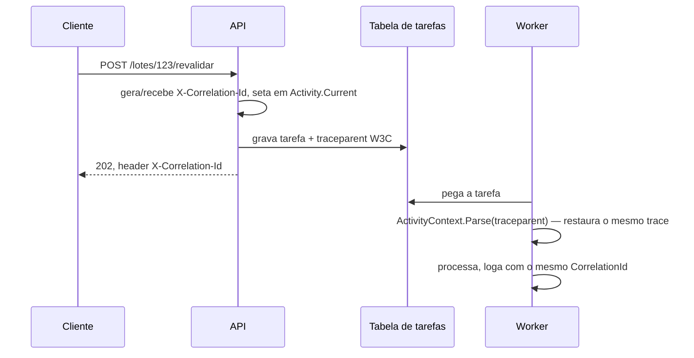

# Capítulo 08 — Minimal APIs e arquitetura web

> **Módulo 7 do roteiro.** Pré-requisito: [Capítulo 07](07-dados-e-persistencia.md).
> **Tempo:** 2 semanas.
> **Entrega:** API de consulta de lotes com OpenAPI publicado e correlação de log com o worker.

## Por que a API entra só agora

Porque só agora existe algo para consultar. A ordem invertida — API primeiro, domínio depois — produz endpoints que existem antes de se saber o que consultar, e um modelo de dados desenhado para caber na primeira rota que alguém imaginou.

---

## 1. Minimal API: a estrutura

**Por que isso importa:** até aqui, tudo que este curso construiu roda como processo isolado — CLI, worker. Uma API é diferente: ela fica esperando por requisições de rede, de outros programas (ou pessoas, via navegador), e precisa responder no formato que HTTP exige. Esta seção é a ponte entre o que você já sabe (Capítulos 00-07) e esse novo tipo de programa.

> 📖 **Conceito: HTTP, endpoint e rota**
> **HTTP** é o protocolo (conjunto de regras de comunicação) usado por praticamente toda a web: um cliente (navegador, outro programa) envia uma **requisição** com um verbo (`GET` para buscar dado, `POST` para criar algo, etc.) e um caminho (`/lotes/123`), e o servidor responde com um **status code** (200 para sucesso, 404 para "não encontrado", etc.) e, geralmente, um corpo de dados. Um **endpoint** (também chamado de **rota**) é a combinação de um verbo HTTP com um caminho que o servidor sabe atender — `GET /lotes/{id}` é um endpoint que busca um lote pelo id. Uma **Minimal API** é o estilo mais direto de declarar esses endpoints em .NET: uma linha por rota, sem a cerimônia de controllers de estilo mais antigo (MVC).

```csharp
var builder = WebApplication.CreateSlimBuilder(args);

// um registro só cobre os dois casos: desde o EF Core 6, AddDbContextFactory registra
// TAMBÉM o próprio AppDbContext como Scoped. Então um handler comum pode injetar
// AppDbContext direto, e o streaming da seção 8 usa a factory para controlar o tempo de vida.
builder.Services.AddDbContextFactory<AppDbContext>(o =>
    o.UseNpgsql(builder.Configuration.GetConnectionString("Default")));

builder.Services.AddOpenApi();
builder.Services.AddProblemDetails();

var app = builder.Build();

app.MapGet("/lotes/{id:long}", async (long id, IDbContextFactory<AppDbContext> f, CancellationToken ct) =>
{
    await using var db = await f.CreateDbContextAsync(ct);
    var lote = await db.Arquivos.AsNoTracking()
        .Select(a => new LoteDto(a.Id, a.NomeArquivo, a.ProcessadoEm, a.TotalRegistros))
        .FirstOrDefaultAsync(a => a.Id == id, ct);

    return lote is null ? Results.NotFound() : Results.Ok(lote);
});

app.Run();

// necessário para o WebApplicationFactory dos testes (Capítulo 06, seção 7) enxergar a classe
public partial class Program;
```

> ⚠️ **Armadilha: `WebApplicationFactory<Program>` não compila sem aquela última linha**
> Com top-level statements, o compilador gera a classe `Program` como **internal** — e `WebApplicationFactory<Program>`, que vem de outro assembly (o projeto de teste), não a enxerga. O erro fala de acessibilidade e não dá nenhuma pista de que a solução é declarar `public partial class Program;` no fim do `Program.cs`. A alternativa é um `[assembly: InternalsVisibleTo("Cnab.Api.Tests")]`; a linha acima é mais curta e é a forma que a documentação oficial usa. O critério de aceite deste capítulo depende disso funcionando.

Linha a linha: `WebApplication.CreateSlimBuilder(args)` é o equivalente, para uma aplicação web, do `Host.CreateApplicationBuilder` visto no Capítulo 05 — monta a infraestrutura de configuração, logging e DI, só que já preparada para servir HTTP (ver tabela de variantes abaixo). `builder.Services.AddDbContextFactory<AppDbContext>(...)` registra o acesso ao banco no container de DI, do mesmo jeito visto no Capítulo 07. `AddOpenApi()` e `AddProblemDetails()` ligam funcionalidades vistas mais à frente no capítulo (documentação automática da API, seção 6; formato padronizado de erro, seção 4). `var app = builder.Build();` finaliza a montagem — a partir daqui, `app` é o objeto usado para declarar rotas. `app.MapGet("/lotes/{id:long}", async (...) => {...})` declara o endpoint: qualquer requisição `GET` para `/lotes/123` (onde `123` precisa ser um número inteiro longo, por causa do `:long` na rota) executa essa função. Dentro dela, o padrão já visto no Capítulo 07 se repete: abrir um `DbContext`, consultar sem tracking, e devolver `Results.NotFound()` ou `Results.Ok(lote)` — os dois helpers que traduzem o resultado C# para um status HTTP e corpo de resposta. `app.Run();`, por fim, inicia o servidor e bloqueia o processo ali, aceitando requisições até receber um sinal de desligamento (o mesmo mecanismo do Capítulo 05).

### `CreateBuilder` vs `CreateSlimBuilder` vs `CreateEmptyBuilder`

| Builder | Traz |
|---------|------|
| `CreateBuilder` | tudo: MVC-ready, IIS, todos os providers de configuração |
| `CreateSlimBuilder` | o essencial para Minimal API + JSON; menor e mais rápido de subir |
| `CreateEmptyBuilder` | nada; você adiciona peça por peça |

Para API de consulta em container, `CreateSlimBuilder` é a escolha certa. É também o que o Capítulo 10 vai precisar para AOT.

### Request Delegate Generator

Ligue o source generator que compila as rotas em vez de usar reflection:

```xml
<PropertyGroup>
  <EnableRequestDelegateGenerator>true</EnableRequestDelegateGenerator>
</PropertyGroup>
```

Ganha startup e compatibilidade com trimming/AOT. Em troca, algumas formas dinâmicas de binding deixam de funcionar — o compilador avisa.

### Binding de parâmetros

```csharp
app.MapGet("/lotes/{id:long}/registros", async (
    long id,                                      // rota
    [FromQuery] string? ocorrencia,               // query string
    [FromQuery] int pagina,
    [FromHeader(Name = "X-Correlation-Id")] string? correlationId,
    IDbContextFactory<AppDbContext> factory,      // DI (inferido)
    CancellationToken ct) => { /* ... */ });
```

Para tipos customizados, implemente `TryParse` (query/rota) ou `BindAsync` (corpo/complexo):

```csharp
public readonly record struct PeriodoConsulta(DateOnly Inicio, DateOnly Fim)
{
    // permite ?periodo=2026-01-01..2026-03-31
    public static bool TryParse(string? s, IFormatProvider? p, out PeriodoConsulta r)
    {
        r = default;
        var partes = s?.Split("..");
        if (partes is not [var a, var b]) return false;
        if (!DateOnly.TryParse(a, p, out var i) || !DateOnly.TryParse(b, p, out var f)) return false;
        r = new PeriodoConsulta(i, f);
        return true;
    }
}
```

---

## 2. Organização: route groups e vertical slices

**Por que isso importa:** a facilidade da Minimal API tem um efeito colateral conhecido — como declarar uma rota custa uma linha, o `Program.cs` cresce sem resistência até virar um arquivo de 800 linhas que ninguém consegue navegar. Esta seção é sobre pagar esse custo cedo, quando ainda são cinco rotas.

Uma API com 40 endpoints num único `Program.cs` é ilegível. Duas ferramentas resolvem.

> 📖 **Conceito: DTO**
> DTO (*Data Transfer Object*) é um tipo criado com uma única finalidade: carregar dados através de uma fronteira — aqui, entre a sua aplicação e quem consome a API. Ele é deliberadamente separado da **entidade** (a classe mapeada para a tabela do banco, do Capítulo 07), mesmo quando os dois têm campos parecidos. A razão é que eles mudam por motivos diferentes: a entidade muda quando o esquema do banco muda; o DTO muda quando o contrato público muda. Fundi-los significa que renomear uma coluna quebra todos os clientes da API, e que qualquer campo interno que você adicionar (um flag de controle, um hash) vaza para fora sem você perceber. É o "nenhum endpoint devolve entidade do EF diretamente" do critério de aceite.

> 🐍 **Vindo de outra stack**
> — **Python:** Minimal API é o equivalente mais próximo do FastAPI — decorador de rota, binding por assinatura de função, OpenAPI gerado automaticamente. `MapGroup` ≈ `APIRouter`, middleware ≈ middleware do Starlette, e os DTOs `record` fazem o papel dos modelos Pydantic (com validação declarativa, seção 5).
> — **Java:** mais próximo do Spring WebFlux funcional ou do Javalin do que do Spring MVC com `@RestController`. `IEndpointFilter` ≈ `HandlerInterceptor`, middleware ≈ `Filter` da Servlet API. Se você vem de `@RestController`, o estilo com controllers também existe no .NET — mas Minimal API é o padrão para serviços novos.
> — **Go:** é o `net/http` com `chi`/`echo` por cima: `MapGroup` ≈ `r.Route(...)`, middleware ≈ `func(http.Handler) http.Handler` com a mesma semântica de encadeamento. A diferença maior é o binding automático de parâmetros, que em Go você escreveria à mão.

### 2.1 Route groups

```csharp
var lotes = app.MapGroup("/lotes")
    .WithTags("Lotes")
    .RequireAuthorization("consulta")          // Capítulo 09
    .AddEndpointFilter<ValidacaoDeTenantFilter>();

lotes.MapGet("/", ListarLotes);
lotes.MapGet("/{id:long}", ObterLote);
lotes.MapGet("/{id:long}/registros", ListarRegistros);
```

Tudo que se aplica ao grupo (autorização, filtros, tags) é declarado uma vez.

### 2.2 Vertical slices

Organize por **funcionalidade**, não por camada técnica. Cada slice contém rota, request, response, handler e validação.

```
src/Cnab.Api/
├── Program.cs
├── Features/
│   ├── Lotes/
│   │   ├── ListarLotes.cs          # rota + DTOs + handler, tudo junto
│   │   ├── ObterLote.cs
│   │   └── LotesEndpoints.cs       # MapGroup do módulo
│   └── Registros/
│       └── ConsultarPorNossoNumero.cs
├── Common/
│   ├── ProblemDetailsExtensions.cs
│   └── CorrelationIdMiddleware.cs
└── Cnab.Api.csproj
```

```csharp
// Features/Lotes/ObterLote.cs — tudo que esse endpoint precisa está aqui
public static class ObterLote
{
    public sealed record Resposta(long Id, string Arquivo, DateTimeOffset ProcessadoEm,
                                  int TotalRegistros, decimal ValorTotal);

    public static RouteHandlerBuilder Mapear(IEndpointRouteBuilder rotas) =>
        rotas.MapGet("/{id:long}", HandleAsync)
             .WithName("ObterLote")
             .WithSummary("Retorna o resumo de um lote processado")
             .Produces<Resposta>()
             .ProducesProblem(StatusCodes.Status404NotFound);

    private static async Task<Results<Ok<Resposta>, NotFound>> HandleAsync(
        long id, IDbContextFactory<AppDbContext> factory, CancellationToken ct)
    {
        await using var db = await factory.CreateDbContextAsync(ct);
        var dto = await db.Arquivos.AsNoTracking()
            .Where(a => a.Id == id)
            .Select(a => new Resposta(a.Id, a.NomeArquivo, a.ProcessadoEm, a.TotalRegistros,
                                      a.Registros.Sum(r => r.ValorCentavos) / 100m))
            .FirstOrDefaultAsync(ct);

        return dto is null ? TypedResults.NotFound() : TypedResults.Ok(dto);
    }
}
```

`Results<Ok<T>, NotFound>` (typed results) faz o OpenAPI conhecer os status possíveis sem você declarar `.Produces` duplicado, e dá verificação em tempo de compilação.

### 2.3 `IEndpointFilter`

Lógica transversal a um subconjunto de rotas, sem middleware global:

```csharp
public sealed class LogDeConsultaFilter(ILogger<LogDeConsultaFilter> logger) : IEndpointFilter
{
    public async ValueTask<object?> InvokeAsync(EndpointFilterInvocationContext ctx,
                                                EndpointFilterDelegate next)
    {
        var sw = Stopwatch.GetTimestamp();
        var resultado = await next(ctx);
        logger.LogInformation("Endpoint {Rota} em {Ms}ms",
            ctx.HttpContext.GetEndpoint()?.DisplayName,
            Stopwatch.GetElapsedTime(sw).TotalMilliseconds);
        return resultado;
    }
}
```

Diferença de middleware: o filtro roda **depois** do roteamento e do binding, então já conhece o endpoint e os argumentos.

---

## 3. Pipeline e middleware

**Por que isso importa:** toda requisição que chega à API passa por uma sequência de etapas antes de chegar ao código que você escreveu (o handler da rota) — autenticação, log, tratamento de erro. Entender essa sequência evita o bug clássico descrito na armadilha abaixo: colocar duas dessas etapas na ordem errada.

> 📖 **Conceito: middleware**
> Middleware é um pedaço de código que processa toda (ou quase toda) requisição HTTP antes dela chegar ao endpoint final, e opcionalmente também processa a resposta no caminho de volta. Cada middleware é encadeado ao próximo: ele pode inspecionar/modificar a requisição, decidir passar adiante (chamando o próximo da cadeia) ou interrompê-la ali mesmo (por exemplo, retornando 401 se não houver autenticação válida, sem nunca chegar ao endpoint). É uma peça central de qualquer framework web, não exclusiva do .NET — a ideia existe também em Express (Node.js) e Django (Python), com nomes parecidos.

A ordem importa e não é negociável:

```mermaid
flowchart LR
    R["requisição HTTP"] --> A["ExceptionHandler"]
    A --> B["ForwardedHeaders"]
    B --> C["HttpsRedirection"]
    C --> D["CorrelationId"]
    D --> E["RequestLogging"]
    E --> F["RateLimiter"]
    F --> G["Cors"]
    G --> H["Authentication"]
    H --> I["Authorization"]
    I --> J["endpoint (handler)"]
    J --> Z["resposta HTTP"]
```



Cada middleware só vê a requisição depois que o anterior deixou passar, e só vê a resposta depois que os que vêm depois dele já responderam — por isso `ExceptionHandler` precisa vir primeiro (para capturar exceção de qualquer estágio seguinte) e `Authorization` só faz sentido depois de `Authentication` já ter identificado quem está fazendo a chamada.

```csharp
app.UseExceptionHandler();          // 1º: precisa envolver tudo
app.UseForwardedHeaders();          // antes de qualquer coisa que leia IP/esquema
app.UseHttpsRedirection();
app.UseCorrelationId();             // nosso, antes do log
app.UseSerilogRequestLogging();     // ou UseHttpLogging
app.UseRateLimiter();
app.UseCors();
app.UseAuthentication();            // sempre antes de authorization
app.UseAuthorization();
app.MapEndpoints();
```

> ⚠️ **Armadilha**
> `UseAuthorization()` antes de `UseAuthentication()` faz toda requisição parecer anônima — e o sintoma é 401 em endpoint que deveria funcionar, com credencial válida. Erro comum e difícil de enxergar lendo o código de cima para baixo.

### Correlation ID amarrado ao `Activity.Current`

Este é o mecanismo que o critério de aceite cobra: o mesmo id no log da API e no do worker.

```csharp
public sealed class CorrelationIdMiddleware(RequestDelegate next)
{
    private const string Header = "X-Correlation-Id";

    public async Task InvokeAsync(HttpContext ctx, ILogger<CorrelationIdMiddleware> logger)
    {
        var id = ctx.Request.Headers[Header].FirstOrDefault()
                 ?? Activity.Current?.TraceId.ToString()
                 ?? Guid.CreateVersion7().ToString("N");

        ctx.Response.Headers[Header] = id;
        Activity.Current?.SetTag("correlation.id", id);

        using (logger.BeginScope(new Dictionary<string, object> { ["CorrelationId"] = id }))
            await next(ctx);
    }
}
```

`Guid.CreateVersion7()` gera GUID ordenável por tempo — melhor que v4 como chave de banco, porque não fragmenta índice.

---

## 4. Erros: `ProblemDetails` (RFC 9457)

**Por que isso importa:** sem um padrão, cada endpoint de erro acaba com um formato diferente — um devolve `{"erro": "..."}`, outro `{"message": "..."}`, um terceiro só uma string. Quem consome a API (outro programa, o Capítulo 04 já ensinou por que consistência importa numa interface) precisa de um formato único e previsível para tratar erro de forma genérica.

> 📖 **Conceito: RFC e status code HTTP**
> Uma **RFC** (Request for Comments) é um documento que formaliza um padrão da internet — não é lei, mas é a especificação que todo mundo concorda em seguir para que sistemas diferentes consigam se comunicar. RFC 9457 é o padrão específico para formato de erro em API HTTP, chamado "Problem Details". Um **status code** é o número de três dígitos que toda resposta HTTP carrega, indicando a categoria do resultado: `2xx` é sucesso, `4xx` é erro causado pelo cliente (requisição malformada, recurso não encontrado), `5xx` é erro do lado do servidor.

Toda API deve ter **um único formato de erro**. O padrão é `application/problem+json`:

```json
{
  "type": "https://api.exemplo.com/erros/lote-invalido",
  "title": "Lote inválido",
  "status": 422,
  "detail": "O total do trailer não confere com a soma dos detalhes",
  "instance": "/lotes/1234/revalidar",
  "correlationId": "0199a3f1-...",
  "errors": { "trailer": ["esperado 150000, encontrado 149800"] }
}
```

### 4.1 `IExceptionHandler`

```csharp
public sealed class DominioExceptionHandler(IProblemDetailsService problemDetails)
    : IExceptionHandler
{
    public async ValueTask<bool> TryHandleAsync(HttpContext ctx, Exception ex, CancellationToken ct)
    {
        var (status, title) = ex switch
        {
            LoteInvalidoException      => (StatusCodes.Status422UnprocessableEntity, "Lote inválido"),
            LoteNaoEncontradoException => (StatusCodes.Status404NotFound, "Lote não encontrado"),
            ConcorrenciaException      => (StatusCodes.Status409Conflict, "Conflito de concorrência"),
            OperationCanceledException => (StatusCodes.Status499ClientClosedRequest, "Cancelado"),
            _                          => (0, "")     // não é nosso: deixa outro handler tratar
        };

        if (status == 0) return false;

        ctx.Response.StatusCode = status;
        return await problemDetails.TryWriteAsync(new ProblemDetailsContext
        {
            HttpContext = ctx,
            ProblemDetails = new ProblemDetails
            {
                Title = title,
                Detail = ex.Message,
                Type = $"https://api.exemplo.com/erros/{status}"
            }
        });
    }
}

builder.Services.AddExceptionHandler<DominioExceptionHandler>();
builder.Services.AddProblemDetails(o => o.CustomizeProblemDetails = ctx =>
{
    ctx.ProblemDetails.Extensions["correlationId"] = ctx.HttpContext.TraceIdentifier;
    ctx.ProblemDetails.Extensions["traceId"] = Activity.Current?.TraceId.ToString();
});
```

Retornar `false` deixa o próximo handler tentar; se nenhum tratar, vai para o handler padrão (500 genérico, sem vazar stack trace).

### 4.2 422 vs 400

- **400** — a requisição está malformada: JSON inválido, tipo errado, campo obrigatório ausente.
- **422** — a requisição está bem formada mas o conteúdo viola regra de negócio.

O critério de aceite exige 422 para erro de domínio. Essa distinção importa para o cliente: 400 é bug dele, 422 é estado do dado.

---

## 5. Validação

**Por que isso importa:** uma API exposta à internet recebe entrada de fontes que você não controla — cliente com bug, ou tentativa deliberada de quebrar o sistema. Validar antes de processar é o que impede uma requisição malformada de chegar até a lógica de negócio ou o banco de dados.

### 5.1 Nativa, com `[ValidatableType]`

O .NET 10 traz validação de Minimal API por source generator, sem biblioteca externa:

```csharp
builder.Services.AddValidation();

[ValidatableType]
public sealed record FiltroConsulta
{
    [Range(1, 1000)] public int Tamanho { get; init; } = 50;
    [Range(1, int.MaxValue)] public int Pagina { get; init; } = 1;
    [RegularExpression("^[0-9]{2}$")] public string? Ocorrencia { get; init; }

    // o PeriodoConsulta da seção 1, ligado por TryParse a ?periodo=2026-01-01..2026-03-31
    public PeriodoConsulta Periodo { get; init; }
}
```

Falha de validação produz `ValidationProblemDetails` (400) automaticamente.

### 5.2 FluentValidation

Para regra composta, condicional ou que dependa de serviço:

```csharp
public sealed class FiltroConsultaValidator : AbstractValidator<FiltroConsulta>
{
    public FiltroConsultaValidator(ITabelaOcorrencias tabela)
    {
        RuleFor(x => x.Tamanho).InclusiveBetween(1, 1000);
        RuleFor(x => x.Periodo)
            .Must(p => (p.Fim.DayNumber - p.Inicio.DayNumber) <= 365)
            .WithMessage("Período máximo de consulta é 12 meses");
        RuleFor(x => x.Ocorrencia)
            .MustAsync(async (c, ct) => c is null || await tabela.ExisteAsync(c, ct))
            .WithMessage("Código de ocorrência desconhecido");
    }
}
```

Aplicada por filtro genérico:

```csharp
public sealed class ValidationFilter<T>(IValidator<T> validator) : IEndpointFilter
{
    public async ValueTask<object?> InvokeAsync(EndpointFilterInvocationContext ctx,
                                                EndpointFilterDelegate next)
    {
        var arg = ctx.Arguments.OfType<T>().FirstOrDefault();
        if (arg is null) return await next(ctx);

        var resultado = await validator.ValidateAsync(arg, ctx.HttpContext.RequestAborted);
        return resultado.IsValid
            ? await next(ctx)
            : TypedResults.ValidationProblem(resultado.ToDictionary());
    }
}
```

---

## 6. OpenAPI nativo e Scalar

**Por que isso importa:** quem vai consumir esta API (outro time, um front-end, o próprio worker) precisa saber quais rotas existem, quais parâmetros aceitam e o que devolvem — sem precisar ler o código-fonte da API. Documentação escrita à mão fica desatualizada; documentação gerada automaticamente a partir do código nunca diverge dele.

> 📖 **Conceito: OpenAPI**
> OpenAPI é um formato padronizado (também em JSON/YAML) para descrever uma API HTTP: quais rotas existem, que parâmetros cada uma aceita, que formato de resposta devolve. É gerado automaticamente a partir do código (as anotações e tipos que você já escreveu para os endpoints), e serve tanto para gerar documentação legível por humano (uma página web navegável, como o Scalar mencionado abaixo) quanto para gerar automaticamente um cliente de código em outra linguagem que sabe conversar com essa API.

```csharp
builder.Services.AddOpenApi("v1", o =>
{
    o.AddDocumentTransformer((doc, _, _) =>
    {
        doc.Info = new() { Title = "API de Cobrança", Version = "v1" };
        return Task.CompletedTask;
    });
});

if (app.Environment.IsDevelopment())
{
    app.MapOpenApi();                     // /openapi/v1.json
    app.MapScalarApiReference();          // /scalar/v1 — UI moderna
}
```

O .NET 10 gera **OpenAPI 3.1** por padrão, que é a atualização que finalmente alinha o schema de OpenAPI com JSON Schema. Consequência prática: geradores de cliente mais velhos podem não entender — se precisar, force 3.0:

```csharp
builder.Services.AddOpenApi(o => o.OpenApiVersion = OpenApiSpecVersion.OpenApi3_0);
```

**Gerar o documento em build** (para publicar contrato no CI, como pede o critério de aceite):

```xml
<PropertyGroup>
  <OpenApiGenerateDocuments>true</OpenApiGenerateDocuments>
  <OpenApiDocumentsDirectory>$(MSBuildProjectDirectory)/contracts</OpenApiDocumentsDirectory>
</PropertyGroup>
```

Com o arquivo commitado, um diff no PR mostra toda mudança de contrato. Vale adicionar uma verificação no CI que falha se `contracts/v1.json` divergir do gerado.

### Versionamento

```csharp
builder.Services.AddApiVersioning(o =>
{
    o.DefaultApiVersion = new ApiVersion(1, 0);
    o.AssumeDefaultVersionWhenUnspecified = true;
    o.ApiVersionReader = ApiVersionReader.Combine(
        new UrlSegmentApiVersionReader(),
        new HeaderApiVersionReader("X-Api-Version"));
}).AddApiExplorer();

var v1 = app.NewVersionedApi("Lotes").MapGroup("/v{version:apiVersion}/lotes").HasApiVersion(1.0);
```

---

## 7. `IHttpClientFactory` e clientes tipados

**Por que isso importa:** esta API vai, em algum momento, precisar chamar outro serviço HTTP (um banco externo, no exemplo abaixo). A forma ingênua de fazer isso (`new HttpClient()` toda vez) funciona em teste local e falha silenciosamente em produção sob carga — exatamente o tipo de bug que só aparece depois do sistema estar no ar.

Nunca instancie `HttpClient` com `new` num loop: cada instância abre um socket (uma conexão de rede) e, mesmo descartada, pode deixar a porta de rede ocupada por um tempo — o esgotamento de portas aparece em produção sob carga, não em teste local com poucas chamadas.

```csharp
builder.Services.AddHttpClient<AutbankClient>(c =>
{
    c.BaseAddress = new Uri(builder.Configuration["Autbank:BaseUrl"]!);
    c.Timeout = TimeSpan.FromSeconds(30);
})
.AddStandardResilienceHandler();          // retry + circuit breaker + timeout (Capítulo 11)
```

```csharp
public sealed class AutbankClient(HttpClient http)
{
    public async Task<StatusTitulo> ConsultarAsync(long nossoNumero, CancellationToken ct)
    {
        var resposta = await http.GetAsync($"/titulos/{nossoNumero}", ct);
        resposta.EnsureSuccessStatusCode();
        return await resposta.Content.ReadFromJsonAsync(
            ApiJsonContext.Default.StatusTitulo, ct) ?? throw new InvalidOperationException();
    }
}
```

**Refit** gera o cliente a partir de uma interface, quando o contrato é grande:

```csharp
public interface IAutbankApi
{
    [Get("/titulos/{nossoNumero}")]
    Task<StatusTitulo> ConsultarAsync(long nossoNumero, CancellationToken ct = default);
}

builder.Services.AddRefitClient<IAutbankApi>()
    .ConfigureHttpClient(c => c.BaseAddress = new Uri(url))
    .AddStandardResilienceHandler();
```

---

## 8. Streaming, rate limiting e output caching

**Por que isso importa:** as três ferramentas desta seção respondem à mesma pergunta — *o que acontece quando a carga é grande demais?* Grande em tamanho de resposta (streaming), em número de chamadas (rate limiting) ou em repetição da mesma consulta cara (output caching). Nenhuma delas aparece em desenvolvimento, e todas aparecem em produção.

### Streaming com `IAsyncEnumerable`

A versão mais curta possível — devolver um `IAsyncEnumerable` direto do handler — resolve **um** dos dois problemas, e vale começar por ela justamente para ver qual:

```csharp
// ⚠️ primeira tentativa: resolve a memória do servidor, e só. Duas correções vêm abaixo.
app.MapGet("/lotes/{id:long}/registros/stream", (long id, AppDbContext db, CancellationToken ct)
    => db.Registros.AsNoTracking()
         .Where(r => r.ArquivoId == id)
         .Select(r => new RegistroDto(r.NossoNumero, r.CodigoOcorrencia, r.ValorCentavos / 100m))
         .AsAsyncEnumerable());
```

O que ela **acerta**: o ASP.NET Core serializa item a item, com o buffer sendo liberado ao longo do caminho. Um lote de 500 mil registros vira uma resposta de streaming com memória constante no servidor, em vez de um array de 500 mil objetos.

O que ela **erra**, e que as duas subseções seguintes corrigem:

- **O tempo de vida do `DbContext`.** O `AppDbContext` injetado pertence ao escopo da requisição, e o enumerador continua sendo consumido depois que o handler já retornou. Em lote grande isso vira `ObjectDisposedException` ou comportamento errático — e só aparece com volume, nunca no teste com 20 registros. É o exercício 8 desta seção, e é por isso que a versão final usa `IDbContextFactory`, com um `await using` que você controla.
- **O formato**, tratado no parágrafo seguinte.

> 📏 **Meça**
> "Memória constante" é verificável em dois minutos e vale a pena verificar, porque um único `.ToListAsync()` esquecido no meio do caminho anula a propriedade inteira sem nenhum sinal visível. Com `dotnet-counters` (Capítulo 02, seção 9.1) rodando, chame o endpoint com 50 mil registros e depois com 500 mil, e compare o platô de `GC Heap Size`. **Os dois platôs têm que ser parecidos.** Se o segundo for dez vezes maior, você tem uma materialização escondida — procure por `ToList`, `ToArray` ou um `Count()` antes do laço.

**Agora o formato.** O que sai daí é um **array JSON** (`[{...},{...},...]`) entregue aos pedaços. Isso resolve a memória **do servidor**, e não a do cliente: quem consome ainda precisa esperar o `]` final antes de ter um JSON válido, e a maioria dos parsers vai carregar tudo antes de entregar o primeiro item. Para uma resposta de 500 mil registros, você apenas mudou de lado o problema.

O projeto deste capítulo pede **NDJSON** (Capítulo 04, seção "Projeto") justamente por isso: cada linha é um documento completo, e o cliente processa a primeira assim que ela chega. Esse formato não sai do `AsAsyncEnumerable` sozinho — é preciso escrever a resposta à mão:

```csharp
// uma variável local, capturada pelo handler: alocada uma vez, reusada em toda resposta.
// "\n"u8.ToArray() DENTRO do laço alocaria um array por registro — justamente no caminho
// que o capítulo quer manter com memória constante.
var novaLinha = "\n"u8.ToArray();

app.MapGet("/lotes/{id:long}/registros/stream", async (
    long id, IDbContextFactory<AppDbContext> factory, HttpContext ctx, CancellationToken ct) =>
{
    ctx.Response.ContentType = "application/x-ndjson";

    await using var db = await factory.CreateDbContextAsync(ct);

    var registros = db.Registros.AsNoTracking()
        .Where(r => r.ArquivoId == id)
        .OrderBy(r => r.Id)
        .Select(r => new RegistroDto(r.NossoNumero, r.CodigoOcorrencia, r.ValorCentavos / 100m))
        .AsAsyncEnumerable();

    var enviados = 0;
    await foreach (var registro in registros.WithCancellation(ct))
    {
        await JsonSerializer.SerializeAsync(
            ctx.Response.Body, registro, ApiJsonContext.Default.RegistroDto, ct);
        await ctx.Response.Body.WriteAsync(novaLinha, ct);

        if (++enviados % 1_000 == 0)
            await ctx.Response.Body.FlushAsync(ct);   // empurra para a rede periodicamente
    }
});
```

Quatro detalhes que fazem esse código funcionar:

- **`IDbContextFactory` em vez de `AppDbContext` injetado.** É a primeira das duas correções anunciadas acima, e a armadilha listada no projeto: um `DbContext` vindo do escopo da requisição pode ser descartado antes de o streaming terminar. A factory dá um contexto cujo tempo de vida você controla com o `await using` — que aqui dura exatamente até o último registro sair pela rede.
- **NDJSON em vez de array JSON**, a segunda correção: o `ContentType` muda para `application/x-ndjson` e cada registro sai numa linha própria.
- **`OrderBy(r => r.Id)`.** Sem ordenação explícita, o Postgres não garante ordem nenhuma — e numa resposta paginada ou retomável isso vira bug intermitente.
- **O `FlushAsync` periódico.** Sem ele, a resposta fica presa no buffer do servidor e o cliente não recebe nada até encher. A cada 1.000 registros é um meio-termo razoável: raro o bastante para não custar uma syscall por linha, frequente o bastante para o cliente ver progresso.

> ⚠️ **Armadilha**
> Depois que o primeiro byte foi enviado, o status code **já foi definido** — não dá mais para voltar atrás e responder 500 se algo falhar no meio do streaming. Uma exceção na milésima linha deixa a resposta truncada, com status 200. Se o cliente precisa distinguir "acabou" de "quebrou no meio", inclua uma linha final de sumário (`{"fim":true,"total":500000}`) e ensine o consumidor a exigi-la.

### Rate limiting

```csharp
builder.Services.AddRateLimiter(o =>
{
    o.RejectionStatusCode = StatusCodes.Status429TooManyRequests;
    o.AddPolicy("por-cliente", ctx => RateLimitPartition.GetTokenBucketLimiter(
        ctx.User.FindFirstValue("client_id") ?? ctx.Connection.RemoteIpAddress?.ToString() ?? "anon",
        _ => new TokenBucketRateLimiterOptions
        {
            TokenLimit = 100, TokensPerPeriod = 100,
            ReplenishmentPeriod = TimeSpan.FromMinutes(1), QueueLimit = 0
        }));
});

lotes.RequireRateLimiting("por-cliente");
```

### Output caching

```csharp
builder.Services.AddOutputCache(o =>
    o.AddPolicy("consulta", b => b.Expire(TimeSpan.FromMinutes(5)).SetVaryByQuery("pagina", "tamanho")));

lotes.MapGet("/", ListarLotes).CacheOutput("consulta");
```

Diferença de `HybridCache`: output caching guarda a **resposta HTTP inteira**, incluindo serialização. É mais barato, e só serve para GET idempotente.

---

## 9. Panorama: gRPC, SignalR, YARP

| Tecnologia | Cabe quando |
|-----------|-------------|
| **gRPC** | comunicação serviço-a-serviço com contrato forte e alto volume; ~2x a 5x o throughput de JSON/HTTP. Não serve para browser sem gRPC-Web. |
| **SignalR** | o servidor precisa **empurrar** para o cliente — dashboard de progresso de processamento em tempo real. |
| **YARP** | gateway reverso programável em C#; útil para roteamento por tenant ou para strangler fig de sistema legado. |

Neste domínio: gRPC entre worker e API se o volume justificar; SignalR para uma tela de acompanhamento de lote; YARP provavelmente não.

---

## 10. Exercícios

Use `curl -i` (o `-i` mostra os cabeçalhos, que aqui são metade do que importa) e a `WebApplicationFactory` do Capítulo 06. Vários destes viram testes do projeto.

1. **A rota mais simples possível.** `dotnet new web`, uma rota `GET /ping` devolvendo `"pong"`. Rode, chame com `curl -i` e leia a resposta inteira: status, cabeçalhos, corpo. Depois troque `Results.Ok("pong")` por `Results.Ok(new { msg = "pong" })` e compare o `Content-Type` das duas respostas.

2. **Restrição de rota.** Declare `GET /lotes/{id:long}` e chame com `/lotes/abc`. Confirme que a resposta é **404**, não 400 — porque a restrição `:long` faz a rota simplesmente não casar, em vez de casar e falhar. Entender isso evita horas de confusão. Depois remova o `:long` e veja o erro mudar de natureza.

3. **A ordem do middleware.** Monte o pipeline da seção 3 e inverta `UseAuthentication()` com `UseAuthorization()`. Confirme o 401 em endpoint que deveria funcionar. Agora ponha `UseExceptionHandler()` por **último** e lance uma exceção num endpoint: observe o stack trace vazando na resposta. Os dois erros são invisíveis lendo o código de cima para baixo — por isso o exercício é provocá-los.

4. **Um formato de erro só.** Implemente o `IExceptionHandler` da seção 4.1 com três exceções de domínio distintas. Verifique com `curl -i` que cada uma devolve o status certo (422, 404, 409) e que **todas** têm `Content-Type: application/problem+json` e o mesmo conjunto de campos. Depois lance uma exceção não mapeada e confirme que ela vira 500 genérico **sem** vazar a mensagem interna.

5. **400 contra 422.** Escreva dois testes: um que manda JSON sintaticamente inválido (deve dar 400) e outro que manda JSON válido violando uma regra de negócio (deve dar 422). Se os dois derem o mesmo status, sua API está perdendo a informação mais útil que poderia dar ao cliente.

6. **Entidade vazando.** Devolva a entidade `ArquivoProcessado` do Capítulo 07 direto de um endpoint. Olhe o JSON: campos internos, possivelmente um ciclo de referência com `Registros`. Agora troque por um DTO e compare. Depois adicione uma coluna nova à entidade e confirme que o contrato da API **não** mudou — é essa a propriedade que justifica o DTO.

7. **Streaming de verdade.** Implemente as duas versões do endpoint de streaming da seção 8 — array JSON e NDJSON. Com 200 mil registros, compare: quanto tempo até o **primeiro byte** chegar (`curl -w '%{time_starttransfer}'`), e a memória do servidor em cada uma. Depois consuma o NDJSON com `curl ... | head -5` e confirme que ele responde instantaneamente, sem baixar o resto.

8. **`DbContext` que morre cedo.** Escreva o endpoint de streaming injetando `AppDbContext` diretamente (em vez da factory) e rode com um lote grande. Você deve encontrar `ObjectDisposedException` ou comportamento errático. Corrija com `IDbContextFactory`. É a armadilha listada no projeto, e ela só aparece com volume.

9. **Keyset contra offset.** Implemente a paginação das duas formas sobre uma tabela com 1 milhão de registros. Meça o tempo da página 1, da página 100 e da página 10.000 em cada uma. Anexe o `EXPLAIN ANALYZE` das duas na última página. A curva do offset é o argumento inteiro.

10. **Contrato versionado.** Ligue `OpenApiGenerateDocuments` e commite `contracts/v1.json`. Agora renomeie um campo de um DTO, rebuilde, e olhe o `git diff` do contrato. Escreva o passo de CI que falha quando o arquivo commitado diverge do gerado — é o critério de aceite, e são três linhas de shell.

11. **O id que atravessa processos.** Implemente o `CorrelationIdMiddleware` e faça o `POST /lotes/{id}/revalidar` gravar o `traceparent` junto da tarefa. Do outro lado, restaure com `ActivityContext.Parse` no worker. Prove o resultado como o critério pede: pegue o `X-Correlation-Id` da resposta e faça `grep` dele nos logs dos **dois** processos. Este é o exercício que o Capítulo 12 vai expandir.

12. **Rate limit visível.** Configure o limitador para 5 requisições por minuto e dispare 10 com `for i in $(seq 10); do curl -i -s -o /dev/null -w '%{http_code}\n' localhost:5000/v1/lotes; done`. Confirme cinco `200` seguidos de cinco `429`.

---

## 📦 Projeto: API de consulta de lotes

### Endpoints

```
GET  /v1/lotes?inicio=&fim=&pagina=&tamanho=     → lista paginada
GET  /v1/lotes/{id}                               → resumo do lote
GET  /v1/lotes/{id}/registros?ocorrencia=         → registros paginados
GET  /v1/lotes/{id}/registros/stream              → NDJSON em streaming
GET  /v1/registros/por-nosso-numero/{nn}          → busca direta
POST /v1/lotes/{id}/revalidar                     → dispara revalidação (422 se inválido)
GET  /health/live  |  /health/ready
```

### Paginação

Prefira **keyset** a offset em tabela grande: `OFFSET 500000` faz o Postgres percorrer 500 mil linhas para descartá-las.

```csharp
// keyset: O(log n) com índice, em vez de O(offset)
var itens = await db.Registros.AsNoTracking()
    .Where(r => r.ArquivoId == id && r.Id > cursor)
    .OrderBy(r => r.Id)                                  // a ordenação É o mecanismo, não enfeite
    .Take(tamanho)
    // o Id entra no DTO porque ele É o cursor — por isso este endpoint usa
    // RegistroPaginadoDto, e não o RegistroDto de três campos da seção 8.
    .Select(r => new RegistroPaginadoDto(r.Id, r.NossoNumero, r.CodigoOcorrencia, r.ValorCentavos / 100m))
    .ToListAsync(ct);

// cursor da próxima página = a chave do último item desta; null significa "acabou"
long? proximoCursor = itens.Count == tamanho ? itens[^1].Id : null;

return new PaginaDto<RegistroPaginadoDto>(itens, proximoCursor);
```

O `itens.Count == tamanho` importa: se a página veio incompleta, não há próxima, e devolver um cursor aí faria o cliente pedir uma página vazia antes de perceber que terminou.

### ✅ Critério de aceite

- [ ] **Erro de domínio devolve 422 com corpo `ProblemDetails` bem formado** — `type`, `title`, `status`, `detail`, `instance`, e o `correlationId` na extensão.
- [ ] **O mesmo id de correlação aparece no log da API e no log do worker para a mesma operação.** Prove: dispare `POST /lotes/{id}/revalidar`, colete o `X-Correlation-Id` da resposta, e `grep` esse id nos logs dos dois processos.
- [ ] OpenAPI publicado em `contracts/v1.json`, gerado no build, com verificação no CI de que não divergiu.
- [ ] Todos os endpoints testados com `WebApplicationFactory` + Testcontainers.
- [ ] `/lotes/{id}/registros/stream` com 500 mil registros mantém memória estável — meça.
- [ ] Nenhum endpoint devolve entidade do EF diretamente; sempre DTO.
- [ ] 404 em recurso inexistente, 400 em requisição malformada, 422 em regra de negócio, 409 em conflito — cada um com teste.
- [ ] Paginação por keyset na listagem de registros, com `EXPLAIN ANALYZE` anexado.

### Como amarrar o correlation id ao worker

O ponto sutil: o worker é assíncrono, então o id precisa atravessar um limite de processo.



Passo a passo:

1. A API recebe ou gera o `X-Correlation-Id` e o coloca em `Activity.Current` como tag.
2. Ao enfileirar o comando de revalidação (mesmo que seja só uma linha numa tabela de tarefas), grava o `traceparent` W3C junto.
3. O worker, ao pegar a tarefa, restaura o contexto:

```csharp
var contexto = ActivityContext.Parse(tarefa.TraceParent, null);
using var activity = ActivitySource.StartActivity("revalidar-lote", ActivityKind.Consumer, contexto);
```

Assim os dois processos aparecem no **mesmo trace**. O Capítulo 12 desenvolve isso; aqui basta o id compartilhado no log.

### Armadilhas deste projeto

- **Entidade do EF serializada direto**: expõe campos internos, gera ciclo de referência e acopla o contrato HTTP ao esquema do banco. Sempre DTO.
- **`DbContext` capturado em `IAsyncEnumerable`**: o contexto é descartado no fim da requisição, antes de o streaming terminar. Use `IDbContextFactory` e não descarte antes da hora — ou materialize por página.
- **Serialização de `decimal`**: `System.Text.Json` escreve número; alguns clientes JavaScript perdem precisão. Decida entre número e string e documente no OpenAPI.
- **`DateTimeOffset` em JSON**: use ISO 8601 com offset. Nunca envie data sem fuso num sistema financeiro.
- **Exceção de cancelamento poluindo o log**: quando o cliente fecha a conexão, `RequestAborted` dispara `OperationCanceledException`. Não é erro; filtre no logging.

---

## Checklist de saída

- [ ] Sei a ordem correta do pipeline de middleware e por que ela importa.
- [ ] Toda resposta de erro da minha API é `ProblemDetails`, com status semanticamente correto.
- [ ] Sei a diferença entre 400 e 422 e aplico.
- [ ] Meu OpenAPI é gerado no build e versionado no Git.
- [ ] Nunca crio `HttpClient` com `new`.
- [ ] Uso keyset pagination em tabela grande.
- [ ] Um id de correlação atravessa API e worker e eu consigo demonstrar isso.

## Para ir além

- `learn.microsoft.com/aspnet/core/fundamentals/minimal-apis`
- RFC 9457 (Problem Details) — `datatracker.ietf.org/doc/html/rfc9457`
- Scalar — `scalar.com`
- YARP — `microsoft.github.io/reverse-proxy`
- *Vertical Slice Architecture*, Jimmy Bogard (palestras e posts)

➡️ **Próximo:** [Capítulo 09 — Segurança](09-seguranca.md)
