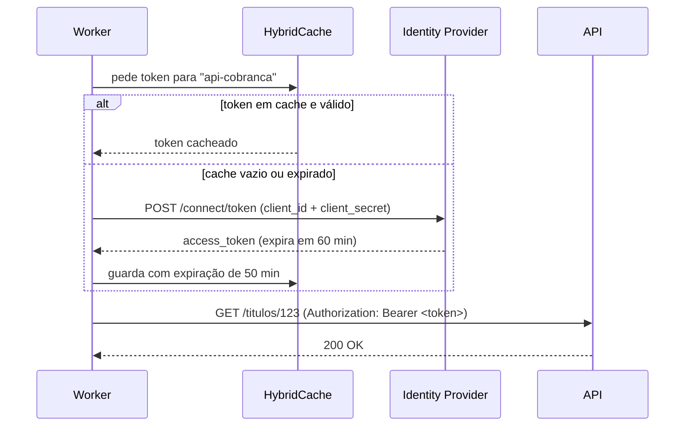
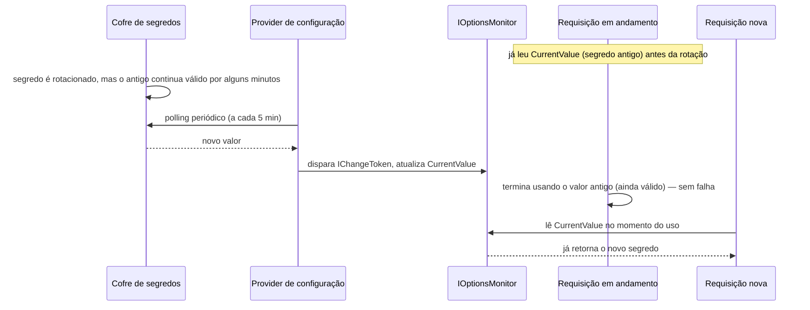

# Capítulo 09 — Segurança

> **Módulo 8 do roteiro.** Pré-requisito: [Capítulo 08](08-minimal-apis-arquitetura-web.md).
> **Tempo:** 2 semanas.
> **Entrega:** API do Capítulo 08 endurecida — client credentials, autorização por escopo e redaction de dados sensíveis.

## Por que este capítulo existe

Ausente por completo no roteiro original, e indispensável para qualquer sistema que toque dinheiro. Arquivo de cobrança contém CPF, CNPJ, nome, endereço, agência, conta e valor — todos dados pessoais sob LGPD, e alguns deles suficientes para fraude.

A regra que organiza o capítulo: **o dado sensível não deve estar onde não precisa estar.** Nem no log, nem na mensagem de erro, nem no cache, nem no dump de memória.

---

## 1. Autenticação

**Por que isso importa:** a API do Capítulo 08, como ficou, aceita qualquer requisição de qualquer um. Antes de falar de autorização por escopo ou redaction de log, é preciso resolver a pergunta mais básica: como a API sabe **quem** está fazendo a chamada?

> 📖 **Conceito: autenticação × autorização**
> **Autenticação** responde "quem é você?" — verificar a identidade de quem está fazendo a requisição. **Autorização** responde "o que você pode fazer?" — dado que já sabemos quem é, decidir se essa identidade tem permissão para a ação pedida. São conceitos sequenciais e distintos: você pode estar autenticado (identidade confirmada) mas não autorizado (sem permissão para aquela ação específica) — é o erro 401 vs 403 que a seção 2 detalha.

> 📖 **Conceito: JWT (JSON Web Token)**
> Um JWT é um token de autenticação: uma string codificada que carrega informações sobre quem o portador é (o "usuário" ou "serviço" autenticado) e é assinada digitalmente por quem o emitiu (o **Identity Provider**, ou IdP — um serviço especializado em autenticar e emitir esses tokens). Quem recebe o token pode verificar a assinatura e confiar no que está dentro dele, sem precisar perguntar de volta ao emissor a cada requisição. `Authorization: Bearer <token>` é o cabeçalho HTTP padrão usado para enviar esse token junto de cada requisição.

### 1.1 JWT

```csharp
builder.Services.AddAuthentication(JwtBearerDefaults.AuthenticationScheme)
    .AddJwtBearer(o =>
    {
        o.Authority = builder.Configuration["Auth:Authority"];   // descobre as chaves sozinho
        o.Audience = "api-cobranca";
        o.RequireHttpsMetadata = !builder.Environment.IsDevelopment();

        o.TokenValidationParameters = new TokenValidationParameters
        {
            ValidateIssuer = true,
            ValidateAudience = true,
            ValidateLifetime = true,
            ValidateIssuerSigningKey = true,
            ClockSkew = TimeSpan.FromSeconds(30)      // padrão são 5 min — apertado é melhor
        };
    });
```

> 📖 **Conceito: JWKS e rotação de chave**
> JWKS (*JSON Web Key Set*) é um endereço público que o emissor de tokens mantém (`https://idp.exemplo.com/.well-known/jwks.json`) listando as chaves **públicas** com que ele assina os tokens. Sua API baixa esse conjunto e o usa para verificar assinaturas. Por que isso é melhor que configurar a chave à mão: emissores trocam de chave periodicamente por higiene de segurança, e quando isso acontece o JWKS passa a listar a nova — sua API a descobre sozinha, sem deploy. Com chave fixa em `appsettings.json`, toda rotação vira uma madrugada de incidente com todos os tokens sendo rejeitados de uma vez.

Usar `Authority` em vez de chave fixa faz o ASP.NET buscar o JWKS do provedor e lidar com rotação de chave sozinho. Chave simétrica hard-coded em `appsettings.json` é o antipadrão mais comum da plataforma.

> 🐍 **Vindo de outra stack**
> — **Python:** `AddJwtBearer` cobre o que você faria com `python-jose`/`PyJWT` mais um decorador de rota; `[Authorize(Policy = "...")]` ≈ uma dependência do FastAPI que valida escopo. A diferença de ênfase é o `FallbackPolicy` (seção 2.1) — a ideia de que **o padrão do framework inteiro** seja "protegido" não tem equivalente direto em decoradores, que são sempre opt-in.
> — **Java:** é quase um espelho do Spring Security: `AddAuthentication`/`AddAuthorization` ≈ `SecurityFilterChain`, policies ≈ `@PreAuthorize`, e a autorização baseada em recurso (seção 2.3) ≈ `AccessDecisionVoter`/`PermissionEvaluator`. A ordem `UseAuthentication` antes de `UseAuthorization` é a mesma ordem de filtros da Servlet API, com a mesma consequência quando invertida.
> — **Go:** você normalmente montaria isso com `golang-jwt` mais middleware próprio. O que o .NET traz pronto e costuma faltar numa implementação de mão são as validações que ninguém lembra: `ValidateAudience`, `ValidateIssuer`, `ClockSkew`. Vale ler a lista de `TokenValidationParameters` acima como um checklist do que sua versão em Go precisaria checar.

> ⚠️ **Armadilha**
> `ValidateAudience = false` "para resolver rápido" significa que um token emitido para outro serviço do mesmo provedor é aceito pela sua API. Nunca desligue.

### 1.2 OIDC e client credentials

Para usuário: **authorization code + PKCE**. Para serviço a serviço: **client credentials**.



A margem de 10 minutos entre o cache (50 min) e a validade real do token (60 min) é o que evita uma requisição falhar com 401 por token expirado bem na borda.

```csharp
// o worker se autenticando contra a API
builder.Services.AddHttpClient<ApiCobrancaClient>()
    .AddHttpMessageHandler(sp => new TokenHandler(sp.GetRequiredService<ITokenProvider>()));

public sealed class TokenProvider(
    IHttpClientFactory factory,
    HybridCache cache,
    IOptionsMonitor<CredenciaisBancarias> opcoes) : ITokenProvider   // ← Monitor, não IOptions: seção 3.3
{
    public async Task<string> ObterAsync(CancellationToken ct) =>
        await cache.GetOrCreateAsync("token:api-cobranca", async token =>
        {
            var cred = opcoes.CurrentValue;           // relido a cada uso, para a rotação valer
            var http = factory.CreateClient("idp");
            var resp = await http.PostAsync("/connect/token", new FormUrlEncodedContent(new Dictionary<string, string>
            {
                ["grant_type"] = "client_credentials",
                ["client_id"] = cred.ClientId,
                ["client_secret"] = cred.ClientSecret,
                ["scope"] = "cobranca:consulta"
            }), token);

            var t = await resp.Content.ReadFromJsonAsync<TokenResponse>(token);
            return t!.AccessToken;
        },
        new HybridCacheEntryOptions { Expiration = TimeSpan.FromMinutes(50) },   // token vive 60
        cancellationToken: ct);
}
```

Cachear o token com margem de segurança evita uma chamada ao IdP por requisição. A margem (50 de 60) cobre relógio dessincronizado e latência.

---

## 2. Autorização

**Por que isso importa:** a seção anterior resolveu "quem é você"; esta resolve "o que você pode fazer" — a segunda metade da dupla de conceitos vista acima, e a que efetivamente decide se um cliente autenticado consegue chamar um endpoint específico.

> 📖 **Conceito: claim e escopo (scope)**
> Um **claim** é uma afirmação sobre a identidade autenticada, carregada dentro do token (JWT, visto na seção 1) — por exemplo, `"scope": "cobranca:consulta"` afirma que esse token tem permissão de consulta. Um **escopo (scope)** é um tipo específico de claim, muito comum em APIs, que delimita o que um token pode fazer — um token com escopo `cobranca:consulta` só devia poder ler dados, não modificá-los. **Policy** (política), no ASP.NET Core, é uma regra nomeada que combina uma ou mais exigências sobre claims — `RequireClaim("scope", "cobranca:consulta")` declara "só aceite requisições cujo token tenha esse escopo".

### 2.1 Policies

```csharp
builder.Services.AddAuthorization(o =>
{
    o.AddPolicy("consulta", p => p
        .RequireAuthenticatedUser()
        .RequireClaim("scope", "cobranca:consulta"));

    o.AddPolicy("operacao", p => p
        .RequireAuthenticatedUser()
        .RequireClaim("scope", "cobranca:operacao")
        .RequireAssertion(ctx => ctx.User.HasClaim(c => c.Type == "tenant")));

    o.FallbackPolicy = new AuthorizationPolicyBuilder()
        .RequireAuthenticatedUser().Build();     // ← tudo protegido por padrão
});
```

`FallbackPolicy` é a decisão mais importante desta seção: ela inverte o default. Sem ela, esquecer `.RequireAuthorization()` num endpoint novo o deixa público. Com ela, esquecer deixa protegido — e você usa `.AllowAnonymous()` explicitamente onde for o caso (`/health`, por exemplo).

### 2.2 Requirements e handlers

Para regra que precisa de dados:

```csharp
public sealed record LimiteDeValorRequirement(decimal Maximo) : IAuthorizationRequirement;

public sealed class LimiteDeValorHandler(IRepositorioLote repo)
    : AuthorizationHandler<LimiteDeValorRequirement, LoteResource>
{
    protected override async Task HandleRequirementAsync(
        AuthorizationHandlerContext ctx, LimiteDeValorRequirement req, LoteResource recurso)
    {
        var total = await repo.ValorTotalAsync(recurso.Id, CancellationToken.None);
        if (total <= req.Maximo) ctx.Succeed(req);
    }
}
```

### 2.3 Autorização baseada em recurso

A pergunta "este cliente pode ver **este** lote?" não se responde com claim. Ela exige carregar o recurso:

```csharp
private static async Task<Results<Ok<LoteDto>, NotFound>> ObterAsync(
    long id, ClaimsPrincipal user, IAuthorizationService auth,
    IRepositorioLote repo, CancellationToken ct)
{
    var lote = await repo.ObterAsync(id, ct);
    if (lote is null) return TypedResults.NotFound();

    var resultado = await auth.AuthorizeAsync(user, lote, "mesmo-tenant");

    // 404, não 403: um 403 aqui confirmaria que o id existe (ver armadilha abaixo)
    return resultado.Succeeded ? TypedResults.Ok(Mapear(lote)) : TypedResults.NotFound();
}
```

> ⚠️ **Armadilha de vazamento por status**
> Responder 403 quando o recurso existe mas é de outro tenant, e 404 quando não existe, permite **enumerar** quais ids existem. Em dado sensível, responda 404 nos dois casos.

---

## 3. Segredos

**Por que isso importa:** connection string de banco, chave de API, senha — esses valores nunca podem estar no código-fonte, porque tudo que entra no Git fica no histórico para sempre, mesmo removido depois. Esta seção mostra onde esses valores devem viver em cada ambiente (máquina local, produção).

> 📖 **Conceito: segredo (secret)**
> Um segredo é qualquer valor de configuração sensível — senha, chave de API, connection string com credencial embutida — que, se exposto, permite acesso indevido a algum sistema. A regra central: segredo nunca é commitado no controle de versão (Git). Em desenvolvimento, ele vive num lugar separado do repositório, fora do alcance de um `git add .` acidental (seção 3.1). Em produção, ele vive num **cofre de segredos** dedicado (seção 3.2) — um serviço especializado em guardar e servir esses valores com controle de acesso e auditoria.

### 3.1 Desenvolvimento: User Secrets

```bash
dotnet user-secrets init
dotnet user-secrets set "ConnectionStrings:Default" "Host=localhost;..."
dotnet user-secrets list
```

Fica fora do repositório, no perfil do usuário. Resolve o problema de "connection string commitada", que continua sendo a causa número um de vazamento em repositório privado que vira público.

### 3.2 Runtime: cofre

```csharp
// AWS Secrets Manager
builder.Configuration.AddSecretsManager(configurator: o =>
{
    o.SecretFilter = e => e.Name.StartsWith("cnab/");
    o.KeyGenerator = (_, nome) => nome.Replace("cnab/", "").Replace("__", ":");
    o.PollingInterval = TimeSpan.FromMinutes(5);     // ← habilita rotação sem restart
});

// Azure Key Vault
builder.Configuration.AddAzureKeyVault(
    new Uri(builder.Configuration["KeyVault:Uri"]!),
    new DefaultAzureCredential(),
    new AzureKeyVaultConfigurationOptions { ReloadInterval = TimeSpan.FromMinutes(5) });
```

### 3.3 Rotação sem downtime

O critério de aceite exige: **girar o segredo em runtime não derruba requisição em andamento.**

O mecanismo tem três partes:

1. **Polling no provider de configuração** — ele relê o cofre periodicamente e dispara `IChangeToken`.
2. **`IOptionsMonitor`** no consumidor — lê `CurrentValue` a cada uso, nunca guarda cópia.
3. **Período de sobreposição** — o segredo antigo continua válido por alguns minutos após a rotação.



```csharp
public sealed class ClienteBancario(IOptionsMonitor<CredenciaisBancarias> credenciais, HttpClient http)
{
    public async Task<Resposta> ChamarAsync(CancellationToken ct)
    {
        var cred = credenciais.CurrentValue;        // ← lê no momento do uso
        using var req = new HttpRequestMessage(HttpMethod.Post, "/titulos");
        req.Headers.Authorization = new("Bearer", await TokenAsync(cred, ct));
        return await EnviarAsync(req, ct);
    }
}
```

Requisição que já pegou o valor antigo termina com ele; a próxima pega o novo. Nenhuma é interrompida.

> ⚠️ **Armadilha**
> `IOptions<T>` (sem Monitor) resolve o valor uma vez, na primeira injeção, e nunca mais. Rotação silenciosamente não tem efeito até o restart. Esse bug leva meses para ser notado — geralmente quando o segredo antigo finalmente é revogado.

---

## 4. Criptografia feita direito

**Por que isso importa:** criptografia é uma das poucas áreas de engenharia de software onde "escrever sua própria versão" quase sempre resulta em algo inseguro, mesmo com boas intenções — os erros são sutis e as consequências, quando exploradas, são graves. Esta seção não ensina como criptografia funciona por dentro; ensina quais ferramentas prontas usar para cada situação, e o que nunca fazer.

### 4.1 Data Protection API

Para proteger dado que a própria aplicação vai ler depois (token de continuação, cookie, coluna de banco):

```csharp
builder.Services.AddDataProtection()
    .PersistKeysToDbContext<AppDbContext>()          // compartilhado entre réplicas
    .ProtectKeysWithAzureKeyVault(keyUri, credential)
    .SetApplicationName("cnab-platform")             // ← mesmo nome entre serviços que compartilham
    .SetDefaultKeyLifetime(TimeSpan.FromDays(90));

// uso
var protector = provider.CreateProtector("Cnab.Cursor.v1");
var protegido = protector.Protect(cursorSerializado);
var original  = protector.Unprotect(protegido);
```

Sem persistência compartilhada, cada réplica gera sua própria chave — e o token emitido por uma não é lido por outra. Sintoma: erro intermitente que "some ao reiniciar".

### 4.2 Criptografia simétrica

Nunca escreva seu próprio esquema. Use AEAD, que autentica além de cifrar:

```csharp
using System.Security.Cryptography;

public static byte[] Cifrar(ReadOnlySpan<byte> claro, ReadOnlySpan<byte> chave)
{
    Span<byte> nonce = stackalloc byte[AesGcm.NonceByteSizes.MaxSize];
    RandomNumberGenerator.Fill(nonce);

    var cifrado = new byte[claro.Length];
    Span<byte> tag = stackalloc byte[AesGcm.TagByteSizes.MaxSize];

    using var aes = new AesGcm(chave, tag.Length);
    aes.Encrypt(nonce, claro, cifrado, tag);

    return [.. nonce, .. tag, .. cifrado];   // nonce e tag vão junto
}
```

Três regras: **nonce nunca se repete com a mesma chave**; **sempre AEAD** (AES-GCM, ChaCha20-Poly1305), nunca AES-CBC sem MAC; **`RandomNumberGenerator`**, nunca `Random`.

### 4.3 Hashing de senha

```csharp
var hasher = new PasswordHasher<Usuario>();          // PBKDF2, parâmetros gerenciados
var hash = hasher.HashPassword(usuario, senha);
var r = hasher.VerifyHashedPassword(usuario, hash, senhaInformada);
if (r is PasswordVerificationResult.SuccessRehashNeeded) { /* regravar com parâmetros novos */ }
```

Para implementação própria, use **Argon2id** (`Konscious.Security.Cryptography`) ou `Rfc2898DeriveBytes` com SHA-256 e 600 mil iterações no mínimo. Nunca SHA-256 puro, nunca MD5, nunca "hash + salt" caseiro.

### 4.4 Comparação em tempo constante

```csharp
// vulnerável a timing attack: retorna no primeiro byte diferente
if (assinaturaRecebida == assinaturaCalculada) { }

// correto
if (CryptographicOperations.FixedTimeEquals(recebida, calculada)) { }
```

Relevante ao validar assinatura de webhook ou HMAC de arquivo recebido do banco.

---

## 5. Superfícies de ataque deste domínio

**Por que isso importa:** um sistema que recebe arquivo de fonte externa (o caso deste curso inteiro) tem uma categoria de vulnerabilidade que um sistema puramente interno não tem: o conteúdo do arquivo, ou o nome dele, pode ser deliberadamente malicioso. Esta seção cobre os ataques específicos que esse cenário abre.

> 📖 **Conceito: superfície de ataque**
> "Superfície de ataque" é o conjunto de todos os pontos por onde um sistema aceita entrada externa — cada um desses pontos é uma oportunidade potencial para alguém tentar explorar uma falha. Quanto mais entradas um sistema aceita (upload de arquivo, parâmetro de URL, cabeçalho HTTP), maior a superfície, e mais cuidado cada uma precisa.

### 5.1 Path traversal em upload

```csharp
public static string CaminhoSeguro(string diretorioBase, string nomeInformado)
{
    // ignora qualquer caminho embutido: "../../etc/passwd" vira "passwd"
    var nome = Path.GetFileName(nomeInformado);

    if (string.IsNullOrWhiteSpace(nome) || nome.Contains("..") ||
        nome.IndexOfAny(Path.GetInvalidFileNameChars()) >= 0)
        throw new ArgumentException("Nome de arquivo inválido");

    var completo = Path.GetFullPath(Path.Combine(diretorioBase, nome));

    // confirma que o resultado ficou mesmo dentro do diretório base
    if (!completo.StartsWith(Path.GetFullPath(diretorioBase) + Path.DirectorySeparatorChar,
                             StringComparison.Ordinal))
        throw new UnauthorizedAccessException("Caminho fora do diretório permitido");

    return completo;
}
```

A dupla verificação (`GetFileName` + comparação do caminho absoluto) cobre casos de encoding e de link simbólico que a primeira sozinha não pega.

### 5.2 Zip bomb

Retornos comprimidos são comuns. Um zip de 40 kB pode expandir para 40 GB:

```csharp
private const long LimiteDescompactado = 2L * 1024 * 1024 * 1024;   // 2 GB
private const int LimiteDeEntradas = 1_000;
private const double RazaoMaxima = 100;

public static async Task ExtrairComLimiteAsync(Stream zip, string destino, CancellationToken ct)
{
    using var archive = new ZipArchive(zip, ZipArchiveMode.Read);

    if (archive.Entries.Count > LimiteDeEntradas)
        throw new InvalidOperationException("Zip com entradas demais");

    long totalDescompactado = 0;
    foreach (var entry in archive.Entries)
    {
        if (entry.Length / Math.Max(entry.CompressedLength, 1) > RazaoMaxima)
            throw new InvalidOperationException($"Razão de compressão suspeita em {entry.Name}");

        totalDescompactado += entry.Length;
        if (totalDescompactado > LimiteDescompactado)
            throw new InvalidOperationException("Conteúdo descompactado excede o limite");

        var caminho = CaminhoSeguro(destino, entry.FullName);   // zip slip!
        await using var saida = File.Create(caminho);
        await using var origem = entry.Open();
        await origem.CopyToAsync(saida, ct);
    }
}
```

`entry.Length` é o valor **declarado no cabeçalho** e pode mentir. Para rigor total, copie com contador e aborte ao estourar, em vez de confiar no metadado.

### 5.3 XXE

```csharp
var settings = new XmlReaderSettings
{
    DtdProcessing = DtdProcessing.Prohibit,   // padrão em .NET moderno, mas declare
    XmlResolver = null,
    MaxCharactersFromEntities = 0
};
using var reader = XmlReader.Create(stream, settings);
```

Relevante se algum layout do banco usar XML (alguns retornos de convênio usam).

### 5.4 Injeção

> 📖 **Conceito: SQL injection e "parametrizar"**
> SQL injection é um ataque onde texto controlado pelo usuário é inserido diretamente numa consulta SQL como se fosse parte do comando, permitindo que esse texto altere o significado da consulta — por exemplo, transformando uma busca em um comando que apaga a tabela inteira. "Parametrizar" uma consulta significa enviar o valor de entrada separado do texto do comando SQL, de forma que o banco sempre o trate como um valor puro, nunca como parte do comando — é a defesa padrão contra esse ataque, e o motivo de nunca construir SQL por concatenação de string.

EF Core e Dapper parametrizam por padrão. O risco está no que escapa disso:

```csharp
// PERIGOSO: interpolação vai direto para o SQL
db.Database.ExecuteSqlRaw($"SELECT * FROM registro WHERE nn = {entrada}");

// SEGURO: FromSqlInterpolated parametriza a interpolação
db.Registros.FromSqlInterpolated($"SELECT * FROM registro WHERE nn = {entrada}");

// SEGURO: parâmetro explícito
db.Database.ExecuteSqlRaw("SELECT * FROM registro WHERE nn = {0}", entrada);
```

`FromSql` e `FromSqlInterpolated` parametrizam; `FromSqlRaw` e `ExecuteSqlRaw` com string concatenada, não. A diferença de uma letra no nome do método é a diferença entre seguro e vulnerável — regra de analyzer ajuda a não errar.

**Nome de coluna não pode ser parametrizado.** Se a ordenação vem do cliente, valide contra lista fixa:

```csharp
var coluna = ordenarPor switch
{
    "valor" => "valor_centavos",
    "data"  => "data_ocorrencia",
    _       => "id"
};
```

---

## 6. Cabeçalhos, CORS, HTTPS

**Por que isso importa:** essas são defesas de baixo esforço e alto retorno — configuração, não código de lógica — que fecham categorias inteiras de ataque conhecidas do navegador web. Ignorar essa seção não quebra nada visivelmente; só deixa a porta destrancada.

> 📖 **Conceito: CORS**
> CORS (Cross-Origin Resource Sharing) é um mecanismo de segurança do navegador que, por padrão, **bloqueia** uma página web de um site (`https://outro-site.com`) de fazer requisições para uma API hospedada em outro domínio (`https://sua-api.com`) — a menos que a API explicitamente permita, através de cabeçalhos de resposta específicos. É uma proteção do lado do navegador contra um site malicioso tentando usar as credenciais do usuário para chamar APIs de terceiros silenciosamente. Configurar CORS significa dizer exatamente quais origens (domínios) têm permissão de chamar sua API a partir do navegador.

```csharp
app.Use(async (ctx, next) =>
{
    var h = ctx.Response.Headers;
    h["X-Content-Type-Options"] = "nosniff";
    h["X-Frame-Options"] = "DENY";
    h["Referrer-Policy"] = "no-referrer";
    h["Content-Security-Policy"] = "default-src 'none'; frame-ancestors 'none'";
    h.Remove("Server");
    await next();
});

app.UseHsts();                  // só fora de desenvolvimento
app.UseHttpsRedirection();
```

CORS restritivo — para API de consulta consumida por serviço, o ideal é não ter CORS nenhum:

```csharp
builder.Services.AddCors(o => o.AddPolicy("painel", p => p
    .WithOrigins("https://painel.exemplo.com")     // nunca AllowAnyOrigin com credenciais
    .WithMethods("GET")
    .WithHeaders("Authorization", "Content-Type")
    .SetPreflightMaxAge(TimeSpan.FromHours(1))));
```

> ⚠️ **Armadilha**
> `AllowAnyOrigin()` + `AllowCredentials()` não é permitido pela especificação, e o ASP.NET lança exceção. A "solução" que aparece em fóruns — refletir a origem do request — recria exatamente a vulnerabilidade que o CORS existe para prevenir.

---

## 7. Dados sensíveis em log — a parte central do projeto

**Por que isso importa:** todo log emitido desde o Capítulo 05 usou template estruturado (`logger.LogInformation("Processando {Arquivo}", arquivo)`), mas nunca parou para perguntar: e se um dos parâmetros logados for um CPF ou número de conta? Log geralmente vai para um sistema com retenção longa e acesso mais amplo que o banco de produção — vazar dado sensível ali é um incidente de privacidade real, coberto pela LGPD (mencionada na abertura do capítulo).

> 📖 **Conceito: redaction**
> Redaction é o processo de remover ou ofuscar automaticamente um dado sensível antes dele ser gravado em log (ou qualquer outro destino persistente) — em vez de confiar que todo desenvolvedor vai lembrar manualmente de não logar aquele campo específico, a infraestrutura de logging faz essa filtragem sozinha, baseada em como o campo foi marcado no código.

### 7.1 Redaction com `Microsoft.Extensions.Compliance`

```bash
dotnet add package Microsoft.Extensions.Compliance.Redaction    # AddRedaction, ErasingRedactor, HMAC
dotnet add package Microsoft.Extensions.Telemetry               # o EnableRedaction() do logging
```

O segundo pacote surpreende: `EnableRedaction()` é um método de extensão sobre `ILoggingBuilder` e mora em `Microsoft.Extensions.Telemetry`, não no pacote de compliance. Sem ele, o `AddRedaction` acima compila, registra os redatores — e **nada é redatado**, porque ninguém plugou a redaction no pipeline de logging. É uma falha silenciosa que o teste da seção 7.2 pega.

```csharp
builder.Services.AddRedaction(r =>
{
    r.SetRedactor<ErasingRedactor>(new DataClassificationSet(DadosSensiveis.Documento));
    r.SetHmacRedactor(o =>
    {
        o.Key = Convert.ToBase64String(chaveHmac);
        o.KeyId = 1;
    }, new DataClassificationSet(DadosSensiveis.Conta));
});

builder.Services.AddLogging(l => l.EnableRedaction());
```

```csharp
public static class DadosSensiveis
{
    // nome da taxonomia — agrupa as classificações deste sistema
    public const string Taxonomia = "CnabTaxonomy";

    public static DataClassification Documento    => new(Taxonomia, nameof(Documento));
    public static DataClassification Conta        => new(Taxonomia, nameof(Conta));
    public static DataClassification NomeDeSacado => new(Taxonomia, nameof(NomeDeSacado));
}

public sealed class DocumentoAttribute : DataClassificationAttribute
{
    public DocumentoAttribute() : base(DadosSensiveis.Documento) { }
}
```

```csharp
[LoggerMessage(Level = LogLevel.Information, Message = "Título {NossoNumero} do sacado {Documento}")]
public static partial void TituloProcessado(
    this ILogger logger,
    long nossoNumero,
    [Documento] string documento);     // ← redatado automaticamente
```

Diferença entre os dois redatores:

- **Erasing** — apaga. Bom para dado que você nunca precisa correlacionar.
- **HMAC** — substitui por hash com chave. O mesmo CPF gera sempre o mesmo valor, então você consegue correlacionar eventos do mesmo cliente **sem** ter o CPF no log. Para investigação de incidente, é a diferença entre conseguir e não conseguir.

### 7.2 A abordagem complementar, mais barata

Redaction cobre o que passa pelo `ILogger` tipado. Não cobre `ex.Message` de uma exceção que carrega o dado, nem serialização de DTO num log de debug.

Duas defesas adicionais:

```csharp
// 1. nunca ponha dado sensível na mensagem da exceção
throw new RegistroInvalidoException($"Documento inválido na linha {linha}");
// não: $"Documento inválido: {cpf}"

// 2. teste que inspeciona a saída do logger — é o que o critério de aceite exige
[Fact]
public async Task Nenhum_documento_aparece_no_log()
{
    var provider = new CapturaDeLogProvider();
    using var host = ConstruirHost(l => l.AddProvider(provider));

    await ProcessarArquivoComDados(cpf: "12345678909", conta: "0001234567");

    var tudo = string.Join("\n", provider.Entradas);
    tudo.ShouldNotContain("12345678909");
    tudo.ShouldNotContain("0001234567");
}
```

Esse teste é a prova exigida pelo critério de aceite. Rode-o com um arquivo de exemplo contendo documentos reconhecíveis e cubra os caminhos de sucesso **e de erro** — o caminho de erro é onde o dado costuma vazar.

O `CapturaDeLogProvider` usado acima não vem da plataforma; são vinte linhas que você escreve uma vez. Ele é um `ILoggerProvider` que, em vez de escrever no console ou num arquivo, guarda tudo numa lista em memória que o teste pode inspecionar:

```csharp
using System.Collections.Concurrent;

public sealed class CapturaDeLogProvider : ILoggerProvider
{
    private readonly ConcurrentQueue<string> _entradas = new();

    public IReadOnlyCollection<string> Entradas => _entradas;

    public ILogger CreateLogger(string categoria) => new CapturaLogger(_entradas);

    public void Dispose() { }

    private sealed class CapturaLogger(ConcurrentQueue<string> destino) : ILogger
    {
        public IDisposable? BeginScope<TState>(TState state) where TState : notnull => null;

        public bool IsEnabled(LogLevel nivel) => true;   // captura tudo, inclusive Debug/Trace

        public void Log<TState>(LogLevel nivel, EventId id, TState state, Exception? erro,
                                Func<TState, Exception?, string> formatador)
        {
            destino.Enqueue(formatador(state, erro));
            if (erro is not null)
                destino.Enqueue(erro.ToString());        // a exceção inteira, com mensagens internas
        }
    }
}
```

Quatro decisões deste código, todas ligadas ao que o teste precisa provar:

- **`ConcurrentQueue`**, e não `List<string>`. O pipeline do Capítulo 03 loga de várias threads ao mesmo tempo; uma `List` aqui produziria corrupção intermitente (Capítulo 03, seção sobre thread-safety) — e um teste de segurança que falha aleatoriamente acaba sendo desligado.
- **`IsEnabled` sempre `true`.** Em produção você filtra por nível; aqui você quer justamente o contrário — um `LogDebug` esquecido com o DTO inteiro é exatamente o tipo de vazamento que o teste procura.
- **`erro.ToString()` e não `erro.Message`.** `ToString()` inclui a cadeia de `InnerException`. Dado sensível costuma vazar na exceção **interna** — a do Npgsql, a do parser — e não na que você escreveu.
- **`BeginScope` devolvendo `null`** é aceitável aqui porque este provider só inspeciona texto. Se o seu teste precisar verificar também os campos de escopo (o `CorrelationId` do Capítulo 05), guarde o `state` numa lista à parte em vez de descartá-lo.

> ⚠️ **Armadilha**
> Este provider captura a mensagem **já formatada** — ou seja, depois da redaction. É isso que você quer, porque é o que efetivamente sairia para o destino real. Mas cuidado ao registrá-lo: ele precisa entrar via `l.AddProvider(provider)` na **mesma** `ILoggerFactory` em que `EnableRedaction()` foi ligado. Se você construir um logger separado no teste, vai estar verificando um caminho que não existe em produção — e o teste passa dando falsa segurança.

### 7.3 Onde mais o dado vaza

| Lugar | Mitigação |
|-------|-----------|
| `EnableSensitiveDataLogging` do EF | nunca em produção; garanta com `if (env.IsDevelopment())` |
| Mensagem de exceção | não inclua valor, só posição |
| `ProblemDetails.Detail` | mensagem genérica em produção; detalhe só no log |
| Trace do OpenTelemetry | não coloque dado sensível em tag de span (Capítulo 12) |
| Dump de memória | inevitável; controle **quem** pode coletar dump |
| Cache distribuído | criptografe ou não guarde |
| Nome de arquivo | `retorno_12345678909.ret` põe CPF no log de todo mundo |

---

## 8. Dependências

**Por que isso importa:** todo pacote NuGet instalado (Capítulo 00) é código de terceiros rodando dentro da sua aplicação, com os mesmos privilégios que o seu próprio código. Uma vulnerabilidade descoberta num pacote popular afeta, de uma vez, todos os projetos que o usam — inclusive o seu, mesmo que você nunca tenha escrito uma linha daquele pacote.

```bash
dotnet list package --vulnerable --include-transitive
dotnet list package --deprecated
dotnet list package --outdated
```

No CI, transforme em gate:

```yaml
- name: Vulnerabilidades
  run: |
    dotnet list package --vulnerable --include-transitive 2>&1 | tee vuln.txt
    ! grep -q "has the following vulnerable packages" vuln.txt
```

### SBOM

```bash
dotnet tool install -g Microsoft.Sbom.DotNetTool
sbom-tool generate -b ./artifacts -bc . -pn Cnab.Platform -pv 1.0.0 -ps Empresa
```

O SBOM (CycloneDX ou SPDX) lista todo componente do build. Quando sai um CVE novo, a pergunta "estamos afetados?" vira uma consulta em vez de uma investigação. Guarde o SBOM junto do artefato, versionado.

Ferramentas de scanning: Trivy, Grype (imagem e SBOM), Dependabot/Renovate (atualização automática de dependência).

---

## 9. Exercícios

Segurança é o capítulo em que "parece funcionar" engana mais. Quase todo exercício aqui pede que você **prove** uma propriedade negativa — que algo *não* acontece — e essa é uma habilidade diferente de testar que uma funcionalidade funciona.

Para os exercícios com token, não monte um Identity Provider: suba um Keycloak em container (`quay.io/keycloak/keycloak`, modo `start-dev`) ou use um JWT que você mesmo assina com chave simétrica **apenas no projeto de sandbox**.

1. **Anatomia de um JWT.** Pegue um token e cole em `jwt.io` (ou decodifique o Base64 à mão). Identifique as três partes, o `exp`, o `aud`, o `iss` e os `scope`. Confirme que o conteúdo é **legível por qualquer um** — JWT é assinado, não criptografado. Escreva uma frase sobre o que isso implica para o que você pode colocar dentro de um token.

2. **As três respostas de falha.** Com um endpoint protegido, faça três chamadas: sem token, com token expirado, e com token válido mas de escopo errado. Confirme **401, 401 e 403**. Se alguma delas devolver algo diferente (500, ou 403 para ausência de token), a configuração está errada — e é um erro comum.

3. **`FallbackPolicy` provando seu valor.** Adicione um endpoint novo **sem** `.RequireAuthorization()`. Sem `FallbackPolicy`, confirme que ele está público. Ligue o `FallbackPolicy` e confirme que passou a exigir autenticação sem você tocar no endpoint. Depois marque-o com `.AllowAnonymous()` e confirme que voltou a ser público — é assim que `/health` continua funcionando.

4. **`ValidateAudience` desligado.** Emita um token para uma audiência diferente (`api-outra`) e confirme que sua API o **rejeita**. Agora desligue `ValidateAudience` e confirme que ela passa a aceitar. Este é o exercício mais curto do capítulo e o que melhor explica por que a armadilha da seção 1.1 existe.

5. **Enumerando recursos pelo status.** Crie dois tenants com um lote cada. Como tenant A, peça o lote do tenant B e o lote de id `999999` (inexistente). Se os status forem diferentes (403 e 404), você acabou de construir um oráculo que permite descobrir quais ids existem. Corrija para 404 nos dois casos e confirme.

6. **Path traversal.** Escreva testes para `CaminhoSeguro` com: `../../etc/passwd`, `..\\..\\windows\\system32`, um nome com byte nulo, e um nome legítimo. Depois remova a **segunda** verificação (a do caminho absoluto) e descubra qual entrada passa a escapar. Isso mostra por que a seção 5.1 insiste na dupla verificação.

7. **Zip bomb controlada.** Gere um zip pequeno com razão de compressão alta (`dd if=/dev/zero of=grande.bin bs=1M count=500 && zip -9 bomba.zip grande.bin`). Passe-o pelo `ExtrairComLimiteAsync` e confirme a rejeição **antes** de qualquer escrita em disco. Depois confie só no `entry.Length` e explique por que o metadado pode mentir.

8. **SQL injection na prática.** Num banco descartável, escreva a consulta vulnerável com `ExecuteSqlRaw` e interpolação, e passe uma entrada como `1; DROP TABLE staging_registro; --`. Veja acontecer. Depois troque para `FromSqlInterpolated` e confirme que a mesma entrada passa a ser tratada como um valor literal. A diferença de uma letra no nome do método é o ponto.

9. **Caçando o vazamento** *(o exercício central do capítulo)*. Implemente o `CapturaDeLogProvider` e escreva o teste que procura um CPF de teste em todo o log. Faça-o passar. **Agora quebre-o de três formas**, uma de cada vez, e confirme que o teste pega cada uma:
   - um `logger.LogDebug("DTO: {@Dto}", dto)` esquecido;
   - uma exceção com o documento embutido na mensagem;
   - `EnableSensitiveDataLogging` ligado com um parâmetro contendo o documento.

   Se o teste não pegar alguma das três, ele não está testando o que você acha — corrija o teste antes de seguir.

10. **HMAC contra apagamento.** Configure os dois redatores da seção 7.1 em campos diferentes. Processe dois registros do **mesmo** sacado e compare a saída: no campo apagado você não consegue dizer que são a mesma pessoa; no campo com HMAC, consegue — sem nunca ver o documento. Escreva uma frase sobre quando cada um é a escolha certa numa investigação de incidente.

11. **Rotação sem queda.** Implemente o `ClienteBancario` com `IOptionsMonitor`. Dispare 200 requisições concorrentes de ~2 s, rotacione o segredo no meio, e confirme zero falhas. Depois troque `IOptionsMonitor` por `IOptions` e repita: as requisições devem continuar usando o segredo antigo indefinidamente. Este é o critério de aceite e a armadilha da seção 3.3 no mesmo exercício.

12. **Cabeçalhos que faltam.** Rode `curl -I` contra sua API antes e depois do middleware da seção 6. Compare as duas saídas. Confirme também que o cabeçalho `Server` sumiu — ele informa versão exata do servidor a quem está sondando.

---

## 📦 Projeto: endurecer a API do Capítulo 08

### Escopo

1. Autenticação por **client credentials** — o worker e o painel consomem a API com token de serviço.
2. Autorização por **escopo**: `cobranca:consulta` (GET) e `cobranca:operacao` (POST de revalidação).
3. **Redaction** de documento, conta e nome em todo o logging.
4. Rotação de segredo sem downtime.
5. Cabeçalhos de segurança, rate limiting por cliente, CORS restrito.
6. Scan de vulnerabilidade e SBOM no pipeline.

### ✅ Critério de aceite

- [ ] **Girar o segredo em runtime não derruba requisição em andamento.** Teste: dispare 200 requisições concorrentes de 2 s cada, rode a rotação no cofre no meio, verifique zero falhas. Documente o procedimento.
- [ ] **Nenhum número de conta ou documento aparece em log estruturado, comprovado por teste que inspeciona a saída do logger.** Cobrir caminho feliz, caminho de validação e caminho de exceção.
- [ ] Endpoint sem `.RequireAuthorization` explícito é protegido pelo `FallbackPolicy` — prove adicionando um endpoint novo sem atributo e verificando 401.
- [ ] Token sem o escopo correto recebe 403; token expirado recebe 401; requisição sem token recebe 401.
- [ ] Recurso de outro tenant responde 404, não 403.
- [ ] Upload com nome `../../etc/passwd` é rejeitado, com teste.
- [ ] Zip bomb de razão 1000:1 é rejeitado antes de estourar disco, com teste.
- [ ] `dotnet list package --vulnerable --include-transitive` limpo, cobrado no CI.
- [ ] SBOM gerado e anexado ao artefato de build.
- [ ] `EnableSensitiveDataLogging` comprovadamente desligado fora de desenvolvimento.

### Exercício de revisão adversarial

Antes de declarar pronto, faça uma passada tentando **quebrar a própria API**:

1. Chame todo endpoint sem token. Todos respondem 401?
2. Chame com token de escopo errado. Todos respondem 403?
3. Chame com id de recurso de outro tenant. Vaza a existência?
4. Envie `Content-Length` enorme. Existe limite de corpo?
5. Envie 10 mil requisições em 10 s. O rate limiter segura?
6. Faça a API lançar exceção (id inexistente, JSON malformado, timeout de banco). A resposta vaza stack trace, nome de tabela ou connection string?
7. Faça `grep` de CPF de teste em todo o log gerado durante os passos acima.

Documente o resultado em `docs/revisao-seguranca.md`. Esse arquivo vale mais que qualquer checklist genérico.

### Armadilhas deste projeto

- **Redaction que não cobre o caminho de exceção.** A mensagem `"Falha ao processar título do sacado 12345678909"` passa por qualquer redator baseado em atributo, porque o dado está embutido na string.
- **`IOptions` em vez de `IOptionsMonitor`** nas credenciais: rotação sem efeito até o restart.
- **Chave de Data Protection não compartilhada** entre réplicas: erro intermitente de descriptografia.
- **Logar o token** num handler de debug. Token no log é credencial no log.
- **Health check exposto sem autenticação vazando detalhe**: `/health/ready` que devolve a mensagem de erro do banco expõe host, porta e nome de base. Use `ResponseWriter` mínimo em produção.

---

## Checklist de saída

- [ ] Uso `FallbackPolicy` para que o padrão seja protegido.
- [ ] Sei implementar rotação de segredo sem downtime e testei.
- [ ] Nenhum dado sensível chega ao log, e tenho teste que prova.
- [ ] Sei a diferença entre redaction por apagamento e por HMAC, e quando cada uma serve.
- [ ] Valido caminho de arquivo com dupla verificação.
- [ ] Trato zip bomb antes de extrair.
- [ ] Meu CI falha com dependência vulnerável e gera SBOM.

## Para ir além

- OWASP API Security Top 10 — `owasp.org/API-Security/`
- `learn.microsoft.com/aspnet/core/security/`
- Data Protection — `learn.microsoft.com/aspnet/core/security/data-protection/`
- `Microsoft.Extensions.Compliance.Redaction` — `learn.microsoft.com/dotnet/core/extensions/data-redaction`
- LGPD, artigos 46 a 49 (segurança e boas práticas)

➡️ **Próximo:** [Capítulo 10 — Performance, AOT e diagnóstico](10-performance-aot-diagnostico.md)
