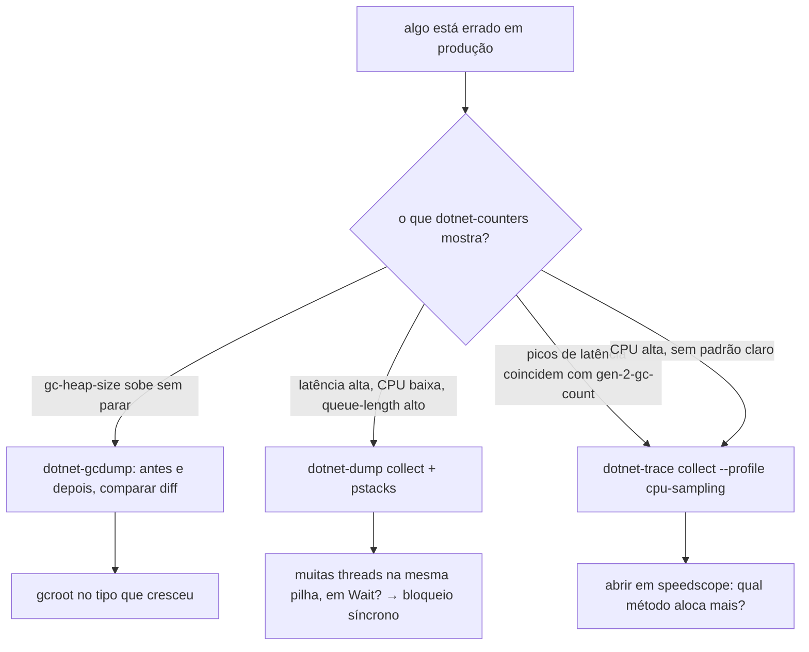
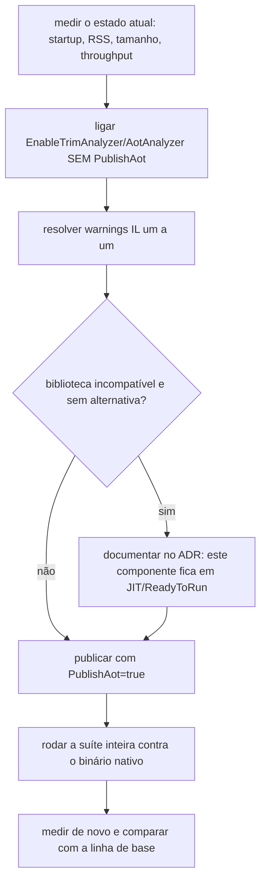

# Capítulo 10 — Performance, AOT e diagnóstico

> **Módulo 9 do roteiro.** Pré-requisito: [Capítulo 09](09-seguranca.md).
> **Tempo:** 2 a 3 semanas.
> **Entrega:** CLI e worker migrados para Native AOT, com tabela antes/depois e relatório de trimming.

## Por que este capítulo vem tão tarde

**Medição vem antes de otimização, por isso este módulo vem depois de existir algo real para medir.** O roteiro original tinha Native AOT em terceiro lugar; ele foi movido para cá porque AOT é restrição de acabamento, não ponto de partida. Arquitetar do zero para AOT sem saber onde está o gargalo leva a código pior, sem ganho comprovado.

---

## 1. BenchmarkDotNet, a sério

**Por que isso importa:** o Capítulo 02 já introduziu o BenchmarkDotNet (relembre a caixa de conceito de lá) para medir alocação de memória. Aqui ele volta como ferramenta de uso diário, agora com mais atributos e mais cuidado — porque este capítulo inteiro é sobre decisões (migrar para AOT ou não, otimizar isto ou aquilo) que só se justificam com número medido, nunca com intuição.

```csharp
[MemoryDiagnoser]
[ThreadingDiagnoser]
[SimpleJob(RuntimeMoniker.Net10_0, warmupCount: 3, iterationCount: 10)]
[RankColumn, MinColumn, MaxColumn]
public class ParserBenchmark
{
    private byte[] _dados = null!;

    [Params(1_000, 100_000)] public int Registros;

    [GlobalSetup] public void Setup() => _dados = Gerar(Registros);

    [Benchmark(Baseline = true)] public int Ingenuo() => ParserIngenuo.Contar(_dados);
    [Benchmark]                  public int ComSpan() => ParserSpan.Contar(_dados);
}
```

### O que o harness faz por você

- **Processo separado** por benchmark, para isolar o JIT e o GC.
- **Warmup** até o tempo estabilizar — elimina Tier 0.
- **Múltiplas iterações** com análise estatística e detecção de outlier.
- **Pilot phase** que ajusta o número de invocações para que cada medição tenha duração significativa.

### Como ler a saída

```
| Method  | Registros |      Mean |    StdDev | Ratio | Gen0   | Allocated |
|---------|-----------|----------:|----------:|------:|-------:|----------:|
| Ingenuo |    100000 | 184.21 ms |  3.412 ms |  1.00 | 9000.0 | 180.2 MB  |
| ComSpan |    100000 |  21.73 ms |  0.194 ms |  0.12 |      - |   2.3 KB  |
```

- **Ratio 0.12** — 8x mais rápido.
- **Allocated 2.3 KB vs 180 MB** (≈ 1,8 kB por registro, o número citado no Capítulo 02) — o ganho estrutural; o de tempo é consequência.
- **StdDev pequeno relativo à média** — medição confiável.
- **Gen0 zerado** — nenhuma coleta provocada.

### Erros que invalidam o benchmark

- Rodar em Debug (o BenchmarkDotNet recusa, mas vale saber por quê).
- Resultado descartado sendo eliminado pelo JIT — **sempre retorne algo** do método benchmarkado, ou use `Consumer`.
- Medir com dado que cabe todo em cache L1 e concluir sobre dado de 1 GB.
- Comparar máquinas diferentes. Comparação só vale na mesma máquina, na mesma sessão.
- `[GlobalSetup]` fazendo parte do trabalho que deveria ser medido.

---

## 2. Ferramentas de diagnóstico

**Por que isso importa:** benchmark (seção 1) mede código isolado, sob condições controladas. Diagnóstico é diferente: é investigar um processo já rodando, ao vivo, tentando entender por que ele está lento ou consumindo memória demais — a situação real de um incidente de produção. Esta seção é o kit de ferramentas para essa investigação.

### 2.1 `dotnet-counters` — o primeiro a abrir

```bash
dotnet-counters monitor -p <pid> --counters System.Runtime,Microsoft.AspNetCore.Hosting
dotnet-counters collect -p <pid> --format json -o metrics.json
```

Contadores que importam:

| Contador | Sintoma quando anormal |
|----------|------------------------|
| `gc-heap-size` | crescimento monotônico = vazamento |
| `gen-2-gc-count` | subindo rápido = promoção excessiva |
| `time-in-gc` | acima de ~10% = pressão de alocação |
| `threadpool-thread-count` | subindo sem parar = starvation |
| `threadpool-queue-length` | alto com CPU baixa = bloqueio |
| `alloc-rate` | o insumo de todo o resto |
| `exception-count` | alto = exceção em caminho quente |

### 2.2 `dotnet-trace`

```bash
dotnet-trace collect -p <pid> --profile cpu-sampling --duration 00:00:30
dotnet-trace collect -p <pid> --providers Microsoft-DotNETCore-SampleProfiler,Microsoft-Windows-DotNETRuntime:0x1F000080018:5
```

Isso gera um arquivo `.nettrace`. Para lê-lo no VS Code — ou em qualquer sistema — converta para o formato do **speedscope**, um visualizador de flame graph que roda no navegador:

```bash
dotnet-trace convert rastreio.nettrace --format speedscope
```

Abra o `.speedscope.json` resultante em `speedscope.app`. Nada é enviado para servidor nenhum: a página processa o arquivo localmente, no próprio navegador. É o caminho padrão do curso por funcionar igual em Linux, macOS e Windows.

Como ler o flame graph: cada barra é um método, a largura é o tempo gasto nele, e o empilhamento vertical é a cadeia de chamadas. Procure a barra **larga e rasa** — muito tempo num método que não chama quase nada é trabalho de verdade; muito tempo num método que só chama outros é só a soma dos filhos. A visão "Left Heavy" agrupa chamadas iguais e costuma ser a mais útil para achar o gargalo rapidamente.

> Alternativas para quem estiver no Windows: PerfView (só Windows) e o Visual Studio abrem `.nettrace` nativamente, com mais recursos de análise. O caminho do speedscope acima não depende de nenhum dos dois.

### 2.3 `dotnet-dump` e análise de heap

```bash
dotnet-dump collect -p <pid> -o dump.dmp
dotnet-dump analyze dump.dmp
```

```
> dumpheap -stat            # o que ocupa o heap, por tipo
> dumpheap -mt <MT> -min 1000
> gcroot <addr>             # QUEM está segurando este objeto
> clrthreads                # estado das threads
> pstacks                   # pilhas agrupadas
> syncblk                   # locks em disputa
```

`gcroot` é o comando decisivo numa investigação de vazamento: ele mostra a cadeia de referências que impede a coleta. A resposta quase sempre é um `static`, um evento não desinscrito, ou um cache sem expiração.

### 2.4 `dotnet-gcdump`

```bash
dotnet-gcdump collect -p <pid> -o antes.gcdump
# ... deixa rodar sob carga ...
dotnet-gcdump collect -p <pid> -o depois.gcdump
```

Muito mais leve que um dump completo — só o grafo de objetos, sem o conteúdo deles. A técnica que importa é o **diff entre dois gcdumps**: não interessa tanto o que ocupa o heap num instante, e sim **o que cresceu** entre dois instantes.

**Comparando os dois no VS Code.** O `.gcdump` tem um visualizador gráfico no Visual Studio, mas ele não existe no VS Code nem no macOS. O caminho que funciona em qualquer sistema é converter cada dump em texto e comparar os textos:

```bash
dotnet-gcdump report antes.gcdump  > antes.txt
dotnet-gcdump report depois.gcdump > depois.txt

diff antes.txt depois.txt | less
```

`dotnet-gcdump report` opera sobre **um** arquivo por vez — ele imprime a contagem e o tamanho total por tipo. O diff, portanto, é você quem faz, entre as duas saídas; não é um recurso embutido da ferramenta. Na prática isso é uma vantagem: o resultado é texto, então você pode versioná-lo, anexá-lo a um ticket ou compará-lo num pipeline.

Para ir direto aos maiores ofensores em vez de ler o diff inteiro, ordene por tamanho e olhe só o topo das duas listas:

```bash
sort -k2 -n -r depois.txt | head -20
```

O tipo que aparece no topo de `depois.txt` e não no de `antes.txt` — ou que cresceu uma ordem de grandeza entre os dois — é o seu suspeito. Leve-o para o `dotnet-dump analyze` e rode `gcroot` nele (seção 2.3), que é quem responde a pergunta final: **quem está segurando isso.**

> Se você tiver acesso a uma máquina Windows com Visual Studio, o visualizador gráfico abre os dois arquivos e faz o diff sozinho, com navegação por árvore de referências. É mais confortável, mas não é necessário: tudo que ele mostra está no texto do `report` mais o `gcroot`.

### 2.5 `dotnet-monitor` em produção

Roda como sidecar e expõe endpoints para coletar dump, trace e métricas sob demanda, com gatilho automático:

```json
{
  "Triggers": [{
    "Type": "EventCounter",
    "Settings": { "ProviderName": "System.Runtime", "CounterName": "gc-heap-size",
                  "GreaterThan": 1000, "SlidingWindowDuration": "00:02:00" }
  }],
  "Actions": [{ "Type": "CollectGCDump", "Settings": { "Egress": "s3" } }]
}
```

Isso captura a evidência no momento do problema, em vez de depois — a diferença entre diagnosticar e adivinhar.

---

Como decidir qual ferramenta abrir primeiro, a partir do sintoma observado:



## 3. As três patologias clássicas

**Por que isso importa:** com as ferramentas da seção anterior em mãos, o próximo passo é saber reconhecer os três padrões de problema mais comuns — a maioria dos incidentes de performance em produção se encaixa em um destes três, e reconhecer o padrão pelo sintoma economiza horas de investigação.

### 3.1 Vazamento de memória

**Sintoma:** `gc-heap-size` cresce monotonicamente; Gen 2 aumenta; eventualmente OOM.

**Causas em ordem de frequência:**

1. `static` acumulando (dicionário de cache sem expiração).
2. Evento sem `-=` — o publicador segura o assinante para sempre.
3. `IDisposable` não descartado que registra callback.
4. `CancellationTokenSource` sem `Dispose` em loop.
5. Closure capturando objeto grande numa `Task` de longa duração.

**Procedimento:** gcdump antes e depois → diff → `gcroot` no tipo que cresceu.

### 3.2 Thread pool starvation

**Sintoma:** latência alta com CPU baixa; `threadpool-queue-length` alto; contagem de threads subindo devagar.

**Causa:** bloqueio síncrono em thread do pool — `.Result`, `.Wait()`, `Thread.Sleep`, IO síncrono, `lock` disputado.

**Diagnóstico:** `dotnet-dump` + `pstacks`. Muitas threads paradas na mesma pilha, todas em `WaitOne` ou `Monitor.Wait`, é o retrato.

**Paliativo enquanto a causa não é corrigida:**

```xml
<ItemGroup>
  <RuntimeHostConfigurationOption Include="System.Threading.ThreadPool.MinThreads" Value="50" />
</ItemGroup>
```

Paliativo, não correção: o bloqueio continua lá.

### 3.3 Pausas de GC

**Sintoma:** picos de latência periódicos, coincidentes com `gen-2-gc-count`.

**Correções, em ordem de eficácia:** reduzir alocação (Capítulo 02) → evitar LOH → reusar buffers → ajustar modo de GC. A primeira resolve 90% dos casos; a última raramente é a resposta.

---

## 4. Native AOT

**Por que isso importa:** o Capítulo 00 explicou o caminho normal — Roslyn compila para IL, o JIT compila IL para código nativo em runtime. Esta seção apresenta o caminho alternativo, onde esse segundo passo acontece todo antecipadamente, no build, em vez de a cada execução — com trade-offs reais que só fazem sentido avaliar agora que existe algo real (a CLI e o worker) para medir antes e depois.

> 📖 **Conceito: Native AOT (Ahead-Of-Time compilation)**
> Relembrando o Capítulo 00: normalmente, o compilador (Roslyn) gera IL, e o JIT traduz esse IL para código nativo da máquina **durante a execução**, método por método, sob demanda. Native AOT é uma forma alternativa de publicar a aplicação onde essa tradução para código nativo acontece **inteira, de uma vez, no momento do build** — o executável final já é código de máquina puro, sem IL e sem JIT algum embutido. O ganho: nada precisa ser compilado quando o programa inicia, então o startup é quase instantâneo. O custo: qualquer recurso que dependa de decidir algo sobre tipos **durante a execução** (reflection, carregar assembly dinamicamente) deixa de funcionar, porque não há mais compilador nenhum rodando junto do programa.

### 4.1 O que muda

| | JIT | Native AOT |
|---|---|---|
| Compilação | em runtime | antecipada, no publish |
| Startup | 50–200 ms | 5–20 ms |
| Memória residente | maior | ~50% menor |
| Tamanho | ~70 MB self-contained | ~10 MB |
| Pico de throughput | maior (PGO dinâmico) | menor em código com muita virtualização |
| Reflection | livre | fortemente restrita |
| `Assembly.Load` dinâmico | sim | não |
| Emissão de IL em runtime | sim | não |
| Debug em produção | completo | limitado |

O trade-off resumido: **você troca pico de throughput por startup, memória e tamanho.** Para worker de lote que roda por horas, o pico pode importar mais que o startup — meça antes de decidir. Para CLI, AOT é quase sempre vitória clara: o startup é a experiência.

> 🐍 **Vindo de outra stack**
> — **Go:** Native AOT é, essencialmente, o modelo de compilação que Go sempre teve — binário estático único, startup instantâneo, sem runtime a instalar. Inclusive as restrições combinam: o `reflect` de Go também atrapalha ferramentas de análise, e a cultura Go de gerar código em vez de refletir (`go generate`) é exatamente a mesma resposta que a seção 5 propõe. Se você veio de Go e estranhou o JIT no Capítulo 00, este capítulo é o reencontro.
> — **Java:** o paralelo direto é GraalVM Native Image, com trade-offs quase idênticos — startup e memória em troca de pico de throughput e reflection. Os arquivos de configuração de reflection do Graal cumprem o papel dos descritores ILLink da seção 4.3, e `ReadyToRun` fica no espaço do AppCDS.
> — **Python:** não há equivalente próximo — PyInstaller empacota o interpretador junto, sem compilar nada para nativo. A intuição mais útil é outra: a substituição de reflection por source generator (seção 5) é o mesmo movimento de trocar `getattr`/metaclasses por código explícito, pelo mesmo motivo de tornar o comportamento analisável antes de rodar.

### 4.2 Publicando

```xml
<PropertyGroup>
  <PublishAot>true</PublishAot>
  <StripSymbols>true</StripSymbols>
  <InvariantGlobalization>true</InvariantGlobalization>
  <UseSystemResourceKeys>true</UseSystemResourceKeys>
  <IlcOptimizationPreference>Size</IlcOptimizationPreference>  <!-- ou Speed -->
  <TrimmerSingleWarn>false</TrimmerSingleWarn>                 <!-- mostre TODOS os warnings -->
</PropertyGroup>
```

```bash
dotnet publish -c Release -r linux-x64
```

Precisa de toolchain nativa: `clang` e `zlib1g-dev` no Linux, ferramentas de build do C++ no Windows.

> ⚠️ **Atenção**
> `InvariantGlobalization=true` remove o ICU. Comparação de string culture-aware, `ToUpper("tr-TR")` e formatação por cultura mudam de comportamento. Em processamento de arquivo posicional isso costuma ser seguro (tudo é ordinal), mas **verifique cada `ToString` e cada comparação** antes de ligar.

### 4.3 Trimming

> 📖 **Conceito: reflection e trimming**
> **Reflection** é a capacidade de um programa inspecionar e usar seus próprios tipos **durante a execução** — por exemplo, descobrir dinamicamente quais propriedades uma classe tem, ou criar uma instância de um tipo cujo nome só se sabe em runtime, a partir de uma string. É poderoso, mas tem custo de performance e, mais relevante aqui, é opaco para ferramentas de análise estática (que leem o código sem executá-lo): elas não conseguem saber de antemão quais tipos serão acessados por reflection, porque isso só se decide em runtime. **Trimming** é o processo de remover do executável final todo código que não é referenciado — reduzindo o tamanho do binário. O problema apontado no texto: como reflection é invisível para essa análise, o trimmer pode remover por engano um tipo que só é acessado via reflection, quebrando o programa em runtime, silenciosamente, sem erro de compilação.

Trimming remove código não referenciado. O problema é que ele decide por **análise estática**, e reflection é invisível para ela.

```
IL2026: Using member 'System.Text.Json.JsonSerializer.Serialize(Object, Type, ...)'
        which has 'RequiresUnreferencedCodeAttribute' can break functionality
        when trimming application code.
```

**Correções, em ordem de preferência:**

1. **Eliminar a reflection** — trocar por source generator. É a única correção de verdade.
2. **Anotar** com `[DynamicallyAccessedMembers]` para dizer ao trimmer o que preservar.
3. **Preservar via descriptor XML** — último recurso, e frágil.

```xml
<!-- ILLink.Descriptors.xml, quando não há alternativa -->
<linker>
  <assembly fullname="Cnab.Parsing">
    <type fullname="Cnab.Parsing.LayoutRegistry" preserve="all" />
  </assembly>
</linker>
```

### 4.4 Arquitetar sem reflection

O que quebra em AOT e a substituição:

| Padrão que quebra | Substituto |
|-------------------|-----------|
| `JsonSerializer.Serialize(obj)` | `JsonSerializerContext` gerado |
| `Activator.CreateInstance(tipo)` | factory explícita, `switch` sobre tipo conhecido |
| Descoberta de tipos por assembly scanning | registro explícito no DI |
| `Enum.Parse` / `Enum.GetValues` | `switch` ou `FrozenDictionary` |
| AutoMapper por convenção | mapeamento manual ou Mapperly (source generator) |
| Validação por reflection | `[ValidatableType]` gerado (Capítulo 08) |
| `ILogger` com interpolação | `LoggerMessage` gerado (Capítulo 05) |

Note que várias dessas substituições já foram adotadas nos capítulos anteriores — não por acaso. Chegar aqui com o código já usando source generators é o que torna a migração viável.

---

## 5. Source generators

**Por que isso importa:** a tabela da seção anterior listou "source generator" como o substituto correto para vários padrões que quebram em AOT. Esta seção mostra o que isso significa de fato, com os dois exemplos mais usados no curso.

> 📖 **Conceito: source generator**
> Um source generator é um componente que roda **durante a compilação** (não em runtime) e gera código C# adicional automaticamente, a partir do que já existe no seu código — esse código gerado é compilado junto com o resto, como se você tivesse escrito à mão. A vantagem sobre reflection: como o código gerado já existe como C# de verdade antes da compilação terminar, ele é visível para o compilador, para o trimmer (seção 4.3) e para o Native AOT — nada precisa ser descoberto em runtime.

### 5.1 `JsonSerializerContext`

```csharp
[JsonSourceGenerationOptions(
    PropertyNamingPolicy = JsonKnownNamingPolicy.CamelCase,
    DefaultIgnoreCondition = JsonIgnoreCondition.WhenWritingNull)]
[JsonSerializable(typeof(ResumoArquivo))]
[JsonSerializable(typeof(LoteDto))]
[JsonSerializable(typeof(ProblemDetails))]
internal sealed partial class CnabJsonContext : JsonSerializerContext;

// uso
var json = JsonSerializer.Serialize(resumo, CnabJsonContext.Default.ResumoArquivo);
var dto  = JsonSerializer.Deserialize(texto, CnabJsonContext.Default.LoteDto);

// na API
builder.Services.ConfigureHttpJsonOptions(o =>
    o.SerializerOptions.TypeInfoResolverChain.Insert(0, CnabJsonContext.Default));
```

Ganho duplo: compatível com AOT **e** mais rápido, porque elimina a inspeção de tipo em runtime.

### 5.2 `GeneratedRegex`

```csharp
internal static partial class Padroes
{
    [GeneratedRegex(@"^\d{3}$", RegexOptions.CultureInvariant)]
    public static partial Regex CodigoBanco { get; }
}
```

A regex vira código C# em tempo de compilação. Mais rápida que `RegexOptions.Compiled` e sem emissão de IL em runtime — e repare que `Compiled` **não** aparece nas opções acima de propósito: passá-la ao gerador não tem efeito nenhum (ele já emite código), e serve só para sugerir que algo ainda é compilado em runtime.

### 5.3 Escrever um gerador próprio

Exercício do capítulo: gerar o parser a partir da declaração do layout, eliminando o código repetitivo de campo por campo.

```csharp
// entrada: o desenvolvedor escreve isso
[LayoutPosicional(TamanhoRegistro = 240)]
public partial record DetalheRetorno
{
    [Campo(38, 13)] public partial long NossoNumero { get; }
    [Campo(16, 2)]  public partial short CodigoOcorrencia { get; }
    [Campo(74, 8), Formato("ddMMyyyy")] public partial DateOnly DataOcorrencia { get; }
    [Campo(82, 15)] public partial long ValorCentavos { get; }
}

// saída gerada: TentarParse, Escrever, validação de tamanho
```

Esqueleto do gerador:

```csharp
[Generator]
public sealed class LayoutGenerator : IIncrementalGenerator
{
    public void Initialize(IncrementalGeneratorInitializationContext context)
    {
        var tipos = context.SyntaxProvider.ForAttributeWithMetadataName(
            "Cnab.Parsing.LayoutPosicionalAttribute",
            predicate: static (n, _) => n is RecordDeclarationSyntax,
            transform: static (ctx, _) => ExtrairModelo(ctx));

        context.RegisterSourceOutput(tipos, static (spc, modelo) =>
            spc.AddSource($"{modelo.Nome}.g.cs", GerarCodigo(modelo)));
    }
}
```

Use `IIncrementalGenerator` (não o `ISourceGenerator` antigo) e mantenha o modelo intermediário como tipo com igualdade por valor — é o que permite ao Roslyn cachear e não regenerar a cada tecla digitada no editor.

Ferramentas de apoio: `Microsoft.CodeAnalysis.Analyzers`, e `dotnet build -p:EmitCompilerGeneratedFiles=true` para inspecionar o que saiu em `obj/generated`.

---

## 6. Interop, quando vale

**Por que isso importa:** quase nunca vale — e é justamente por isso que a seção existe. "Chamar uma biblioteca C para ir mais rápido" é uma tentação recorrente em código de performance, e na esmagadora maioria dos casos `Span<T>` (Capítulo 02) já entrega o mesmo ganho sem sair do C#. Esta seção mostra como fazer certo **quando** for necessário, e deixa explícito o critério para decidir que é.

> 📖 **Conceito: interop, P/Invoke e marshalling**
> **Interop** é a capacidade de chamar, a partir do C#, código nativo escrito em outra linguagem (C, C++, Rust) já compilado numa biblioteca do sistema (`.so` no Linux, `.dylib` no macOS, `.dll` no Windows). **P/Invoke** (*Platform Invoke*) é o mecanismo do .NET para isso: você declara a assinatura do método como se fosse C#, marca de onde ele vem, e o runtime cuida da ponte. **Marshalling** é a parte trabalhosa dessa ponte — converter os tipos do C# para a representação que o código nativo espera e de volta (uma `string` do .NET não tem o mesmo formato de um `char*` do C, por exemplo). É onde moram os bugs: um erro de marshalling não dá erro de compilação, dá corrupção de memória.

```csharp
internal static partial class Zlib
{
    [LibraryImport("libz", EntryPoint = "compress2")]
    internal static partial int Compress2(
        Span<byte> dest, ref nuint destLen,
        ReadOnlySpan<byte> source, nuint sourceLen, int level);
}
```

`LibraryImport` (source generator) é preferível a `DllImport`: gera o marshalling em C#, é compatível com AOT e evita a transição de segurança do stub gerado em runtime.

`unsafe` e ponteiros só depois de provar, com benchmark, que `Span<T>` não resolve. Na prática, quase sempre resolve — e o custo de manutenção do código unsafe é alto.

---

## 7. Exercícios

Do 1 ao 5, o objetivo é **produzir e diagnosticar patologias** em código de brinquedo, onde a causa é conhecida — assim, quando o sintoma aparecer em produção, você já o terá visto. Do 6 em diante, é a migração de verdade.

1. **Benchmark que mente.** Escreva um benchmark cujo método não retorna nada e apenas faz uma conta (`var x = i * 2;`). Rode e observe um tempo absurdamente baixo: o JIT eliminou o código inteiro por ser inútil. Agora retorne o valor e compare. Este é o erro da seção 1 que mais invalida medição alheia — reconhecê-lo é saber desconfiar de um "10.000x mais rápido" na internet.

2. **Cache L1 enganando.** Faça um benchmark de soma sobre um array de 1.000 elementos e outro de 100 milhões, dividindo o tempo pelo número de elementos. O tempo **por elemento** vai ser muito maior no array grande, embora a operação seja idêntica — porque o pequeno cabe no cache do processador. Conclusão a escrever: medir com dado pequeno e extrapolar para dado grande é inválido.

3. **Vazamento construído.** Escreva um app que adiciona objetos a um `static List<byte[]>` num laço. Colete um `gcdump`, espere, colete outro, e compare os dois com `dotnet-gcdump report` + `diff` (seção 2.4). Identifique o tipo que cresceu, colete um `dotnet-dump` e rode `gcroot` nele. Você deve chegar até a variável `static`. **Esta é a habilidade mais valiosa do capítulo** — pratique-a com a causa conhecida antes de precisar dela com a causa desconhecida.

   Sequência completa, para copiar:
   ```bash
   dotnet-gcdump collect -p <pid> -o antes.gcdump
   sleep 30
   dotnet-gcdump collect -p <pid> -o depois.gcdump

   dotnet-gcdump report antes.gcdump  > antes.txt
   dotnet-gcdump report depois.gcdump > depois.txt
   diff antes.txt depois.txt

   dotnet-dump collect -p <pid> -o dump.dmp
   dotnet-dump analyze dump.dmp
   > dumpheap -stat          # confirme o tipo suspeito
   > dumpheap -mt <MT>       # pegue um endereço concreto
   > gcroot <endereço>       # a resposta: quem está segurando
   ```

4. **Starvation revisitado.** Reproduza o starvation do Capítulo 03 e agora diagnostique-o do lado de fora: `dotnet-counters` para ver `threadpool-queue-length` alto com CPU baixa, e `dotnet-dump` + `pstacks` para ver o monte de threads paradas na mesma pilha. Guarde a saída do `pstacks` — esse retrato é inconfundível.

5. **Exceção no caminho quente.** Escreva duas versões de um parser: uma que lança exceção em linha inválida e outra que devolve `false` (o padrão `TryParse` do Capítulo 02). Com 10% de linhas inválidas em 100 mil, compare no benchmark e observe `exception-count` no `dotnet-counters`. O número costuma surpreender, e é o que justifica a escolha de `TentarParseDetalhe` lá atrás.

6. **Analisadores antes do AOT.** Na sua CLI do Capítulo 04, ligue `EnableAotAnalyzer` e `EnableTrimAnalyzer` **sem** `PublishAot`. Liste todos os warnings IL que apareceram. Não corrija nada ainda — só catalogue. Esta lista é o escopo real da sua migração, e vê-la antes de quebrar o build é a diferença entre um plano e uma luta.

7. **Matando um IL2026.** Escolha um warning de `JsonSerializer` sem contexto e corrija-o com `JsonSerializerContext` (se você fez o Capítulo 04, já tem um). Confirme que o warning sumiu. Depois **suprima** outro warning com `#pragma warning disable` e publique em AOT: se o caminho suprimido for exercitado, você deve ver a falha em runtime. É a primeira armadilha do projeto, e ela é muito mais convincente quando acontece.

8. **A tabela antes/depois.** Meça a CLI em JIT — startup com `hyperfine`, RSS, tamanho, throughput. Publique em AOT e meça de novo. Monte a tabela do formato exigido pelo projeto. Se o throughput **caiu**, isso é esperado (o PGO dinâmico da seção 1.2 do Capítulo 02 não existe mais); se caiu mais de 15%, investigue chamadas virtuais no caminho quente.

9. **O meio-termo.** Meça também a versão `PublishReadyToRun`. Você deve encontrar três pontos distintos na curva: JIT (startup ruim, pico bom), ReadyToRun (startup bom, pico bom, binário grande) e AOT (startup ótimo, binário pequeno, pico um pouco menor). Escreva qual você escolheria para a CLI e qual para o worker, **com os seus números** justificando.

10. **`InvariantGlobalization` mordendo.** Antes de ligá-la, escreva um teste que compara strings com acento e ordena uma lista de nomes com cultura pt-BR. Ligue a opção e rode de novo. Anote exatamente o que mudou. No domínio deste curso (tudo ordinal) costuma ser seguro — mas "costuma" não é "é", e essa verificação leva dez minutos.

11. **Um source generator de verdade** *(o mais ambicioso do curso; reserve um fim de semana)*. Implemente o `LayoutGenerator` da seção 5.3, ainda que só para campos `long`. Use `dotnet build -p:EmitCompilerGeneratedFiles=true` e leia o que saiu em `obj/generated` — ver o próprio código gerado é metade do aprendizado. Comece gerando um método que só retorna `0`, confirme que ele compila e é chamável, e só então gere a lógica real.

---

## 📦 Projeto: migração para binário nativo

### Enunciado

Levar a CLI do Capítulo 04 e o worker do Capítulo 05 para Native AOT.



### Roteiro de migração

**Etapa 1 — medir o estado atual.** Antes de mudar nada:

```bash
# startup — hyperfine roda o comando várias vezes e reporta média e desvio
#   instale antes: brew install hyperfine   |   cargo install hyperfine
#   (no Linux, também: apt install hyperfine, nas distros mais recentes)
hyperfine --warmup 3 './cnab --version'

# memória residente e throughput do worker
/usr/bin/time -v ./worker          # Linux
# no macOS, o `time` do sistema não tem -v; use:
#   /usr/bin/time -l ./worker      → "maximum resident set size", em bytes
dotnet-counters collect -p <pid> --counters System.Runtime -o baseline.json

# tamanho
du -sh publish/
```

> 📖 **Conceito: RSS (Resident Set Size)**
> RSS é a quantidade de memória **física** (RAM de verdade) que o sistema operacional entregou ao processo naquele instante. É diferente do `gc-heap-size` que você mediu no Capítulo 02: aquele conta só o heap gerenciado do .NET, enquanto o RSS inclui tudo — heap gerenciado, o próprio runtime carregado, o código nativo, os buffers do sistema operacional. Importa aqui porque **é o RSS que o Kubernetes olha** para decidir matar um pod por estourar o limite de memória (Capítulo 13), e é nele que o ganho do AOT aparece: sem JIT carregado, há menos runtime residente.

Por que medir startup com `hyperfine` em vez de cronometrar à mão: o startup é um número pequeno (dezenas de milissegundos) com variação relativa grande, exatamente o caso em que uma medição única não significa nada — o mesmo motivo que justifica o warmup do BenchmarkDotNet na seção 1.

**Etapa 2 — ligar os analisadores antes de ligar o AOT.** Isso mostra os problemas sem quebrar o build:

```xml
<PropertyGroup>
  <IsAotCompatible>true</IsAotCompatible>
  <EnableTrimAnalyzer>true</EnableTrimAnalyzer>
  <EnableSingleFileAnalyzer>true</EnableSingleFileAnalyzer>
  <EnableAotAnalyzer>true</EnableAotAnalyzer>
</PropertyGroup>
```

**Etapa 3 — resolver os warnings um a um**, registrando cada caso:

| Warning | Origem típica | Correção |
|---------|---------------|----------|
| IL2026 | `JsonSerializer` sem contexto | `JsonSerializerContext` |
| IL2091 | genérico sem anotação | `[DynamicallyAccessedMembers]` |
| IL3050 | `Activator.CreateInstance` | factory explícita |
| IL2067 | `Type` passado a API que reflete | redesenhar |

**Etapa 4 — publicar, testar e medir de novo.** Rode a suíte inteira contra o binário nativo, não só contra o build de debug.

### Bibliotecas: o ponto de decisão

Nem tudo é compatível. Verifique cada dependência:

| Biblioteca | AOT |
|-----------|-----|
| System.Text.Json (com contexto) | ✅ |
| System.CommandLine | ✅ |
| Npgsql | ✅ nas versões recentes |
| Dapper | ⚠️ `Dapper.AOT` é a versão compatível |
| EF Core | ⚠️ parcial; **compiled models** ajudam muito |
| AutoMapper | ❌ troque por Mapperly |
| Serilog | ⚠️ sinks variam; verifique cada um |
| MassTransit | ⚠️ verifique a versão |

Para EF Core, gere o modelo compilado:

```bash
dotnet ef dbcontext optimize --output-dir Compiled --namespace Cnab.Data.Compiled
```

```csharp
o.UseModel(Cnab.Data.Compiled.AppDbContextModel.Instance);   // o --namespace passado acima
```

Isso remove boa parte da construção de modelo por reflection no startup — ganho mesmo sem AOT.

Se alguma dependência essencial não for compatível, **a decisão certa pode ser não migrar aquele componente.** Documente a decisão; ela é tão válida quanto a migração.

**Como isso se aplica ao worker deste curso, concretamente.** O worker carrega EF Core, Npgsql, MassTransit e OpenTelemetry — três dos quatro estão marcados com ⚠️ na tabela acima, então a pergunta é legítima e a resposta não é óbvia. Os três caminhos possíveis, e o que cada um custa:

| Caminho | O que exige | Quando escolher |
|---|---|---|
| **Worker em AOT** | modelo compilado do EF (`dotnet ef dbcontext optimize`), `JsonSerializerContext` para todo payload de evento, e verificar a versão do MassTransit — as versões recentes anotam os caminhos de reflection, mas o registro de consumidores precisa ser explícito, sem varredura de assembly | é o alvo do curso, e é alcançável: os Capítulos 04, 05, 07, 08 e 11 já evitaram reflection justamente por isto |
| **Worker em ReadyToRun** | nada além de uma propriedade | alguma dependência sua não é compatível e não tem substituto |
| **CLI em AOT, worker em ReadyToRun** | — | o caso mais comum fora deste curso |

O capstone (Capítulo 15) pede o worker nativo porque **o curso inteiro foi construído para tornar isso viável** — não porque AOT seja sempre a resposta. Se, com os seus números, ele não for, o capstone aceita ReadyToRun desde que a decisão esteja num ADR com a medição que a sustenta. O que ele não aceita é a ausência da medição.

### Alternativa intermediária: ReadyToRun

```xml
<PublishReadyToRun>true</PublishReadyToRun>
<PublishReadyToRunComposite>true</PublishReadyToRunComposite>
```

Pré-compila o IL para nativo mas mantém o JIT disponível. Startup melhora bastante, nenhuma restrição de reflection, binário maior. É o meio-termo quando AOT não é viável.

### ✅ Critério de aceite

- [ ] **Tabela antes/depois com tempo de startup, memória residente, tamanho do binário e throughput.** Quatro colunas, duas linhas (JIT e AOT), para CLI e worker.
- [ ] **Lista do que quebrou no trimming e como cada caso foi resolvido** — em `docs/adr/00XX-migracao-aot.md`, com o warning, a causa e a correção.
- [ ] A suíte de testes do Capítulo 06 passa contra o binário nativo.
- [ ] `cnab --help` e `cnab inspect --json` funcionam idênticos ao JIT.
- [ ] Worker nativo processa o mesmo arquivo com o mesmo resultado, byte a byte.
- [ ] Nenhum warning IL suprimido sem justificativa escrita.
- [ ] Decisão documentada sobre cada componente que **não** foi migrado, com o motivo e o número que a sustenta — é este ADR que o Capítulo 15 vai cobrar se o seu worker ficar em ReadyToRun.

### Formato esperado da tabela

```markdown
| Componente | Modo | Startup | RSS   | Binário | Throughput (reg/s) |
|-----------|------|---------|-------|---------|--------------------|
| CLI       | JIT  |  118 ms |  48 MB|  68 MB  | 412.000            |
| CLI       | AOT  |    9 ms |  21 MB|  11 MB  | 398.000            |
| Worker    | JIT  |  204 ms | 142 MB|  71 MB  | 385.000            |
| Worker    | AOT  |   14 ms |  67 MB|  14 MB  | 361.000            |
```

Note que o throughput pode **cair** — é o esperado, porque o PGO dinâmico some. Se cair muito (mais de 15%), investigue: geralmente há um caminho com muita chamada virtual que o JIT devirtualizava.

> 📏 **Meça**
> Os números da tabela acima são **ilustrativos** — não os copie para o seu README. O ponto do capítulo é que essa tabela seja preenchida com medições suas, na sua máquina, no mesmo commit, com a mesma carga. As quatro colunas existem porque cada uma pode apontar para uma decisão diferente: se só o startup melhorar e o throughput cair 30%, a resposta certa para o worker pode ser **não migrar** — e essa é uma conclusão tão legítima quanto migrar, desde que sustentada por número. Uma migração para AOT justificada por "dizem que é mais rápido" é exatamente o que este capítulo existe para evitar.

### Armadilhas deste projeto

- **Suprimir warning para "fazer compilar"**. O código compila e falha em runtime, com `MissingMethodException` no caminho menos testado. Cada supressão exige justificativa.
- **`InvariantGlobalization` mudando comparação de string** silenciosamente. Rode a suíte completa.
- **Cross-compilation**: publicar `linux-arm64` a partir de `linux-x64` exige toolchain cruzada. Mais simples compilar no runner da arquitetura alvo.
- **Esquecer de medir o throughput** e concluir que AOT "é melhor" só pelo startup.
- **Comparar builds diferentes**: o binário AOT precisa vir do mesmo commit do JIT medido.

---

## Checklist de saída

- [ ] Sei montar um benchmark que não mente e sei ler StdDev.
- [ ] Sei diagnosticar vazamento com gcdump + `gcroot`.
- [ ] Reconheço starvation pelo par latência alta + CPU baixa.
- [ ] Sei o que AOT dá e o que cobra, com números do meu próprio sistema.
- [ ] Uso source generator no lugar de reflection por padrão, não por obrigação.
- [ ] Tenho um ADR registrando o que migrei, o que não migrei e por quê.

## Para ir além

- BenchmarkDotNet — `benchmarkdotnet.org`
- `learn.microsoft.com/dotnet/core/deploying/native-aot/`
- Trimming — `learn.microsoft.com/dotnet/core/deploying/trimming/`
- `learn.microsoft.com/dotnet/core/diagnostics/`
- *Pro .NET Benchmarking*, Andrey Akinshin — do autor do BenchmarkDotNet
- Incremental generators cookbook — `github.com/dotnet/roslyn/blob/main/docs/features/incremental-generators.md`

➡️ **Próximo:** [Capítulo 11 — Mensageria e resiliência distribuída](11-mensageria-e-resiliencia.md)
