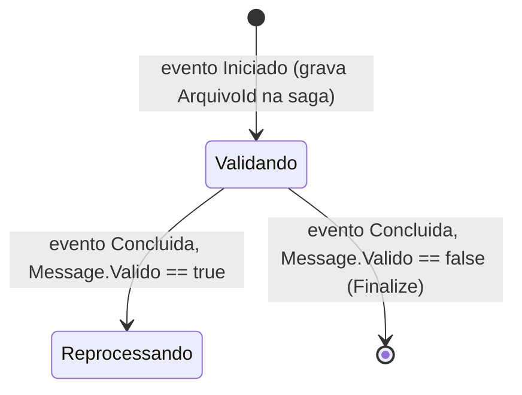
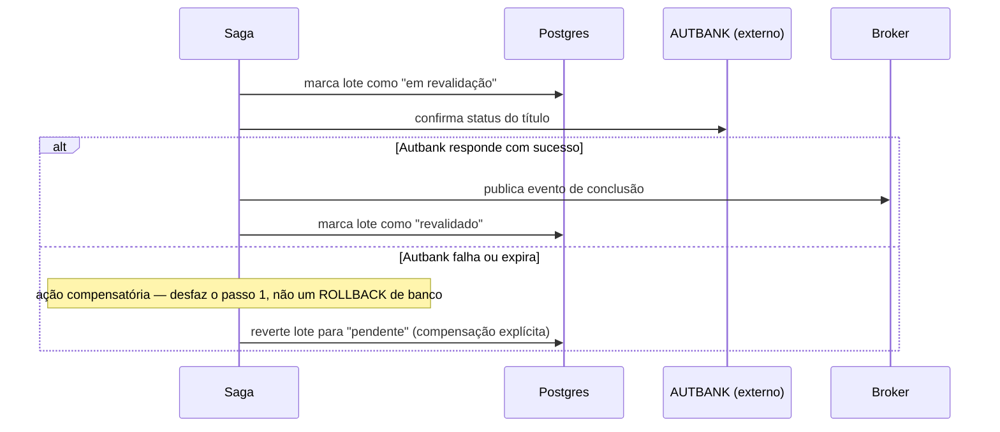
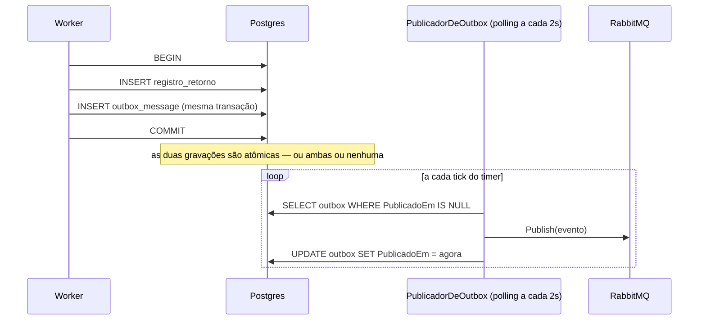
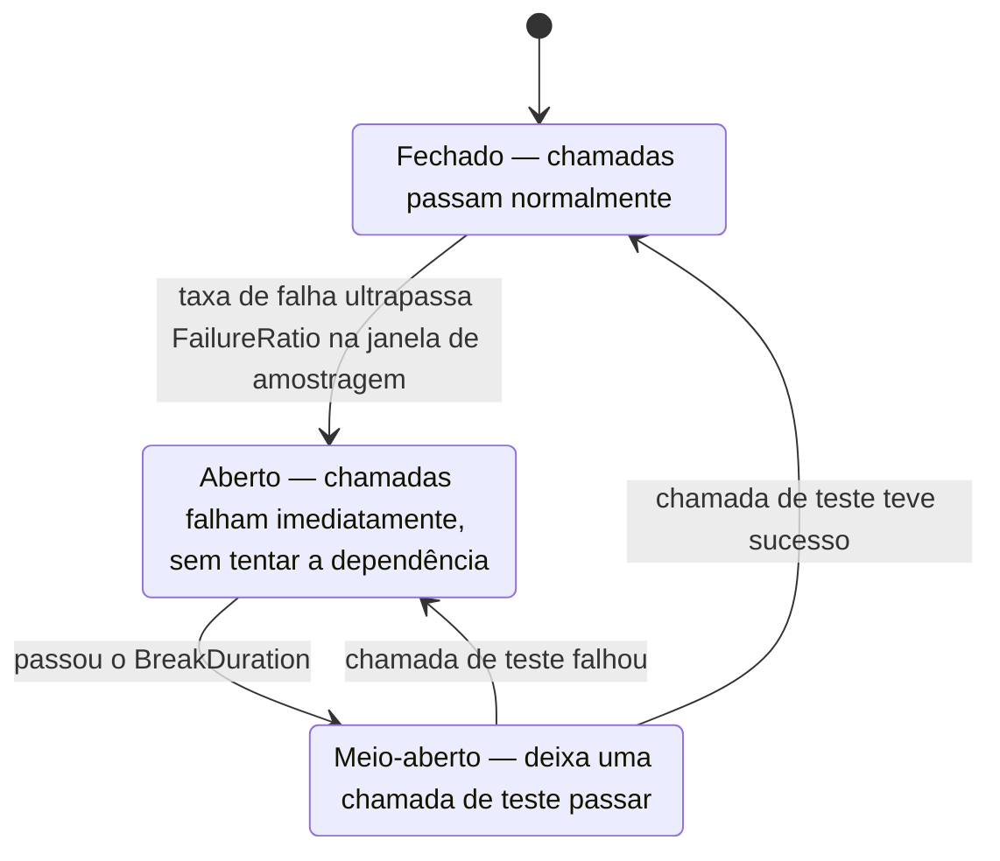
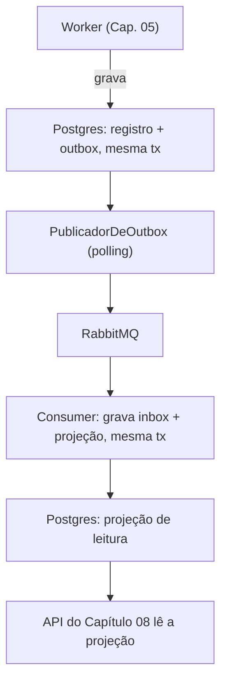

# Capítulo 11 — Mensageria e resiliência distribuída

> **Módulo 10 do roteiro.** Pré-requisito: [Capítulo 10](10-performance-aot-diagnostico.md).
> **Tempo:** 2 a 3 semanas.
> **Entrega:** worker publicando eventos pelo padrão outbox, consumidos de forma idempotente.

## Por que este capítulo existe

O broker é a parte fácil. O difícil é garantir que **a mensagem foi publicada exatamente quando o dado foi gravado** — nem antes (o dado pode não ser commitado), nem depois (a réplica pode cair no meio), nem nunca (a publicação falhou silenciosamente).

---

## 1. Fundamentos comparados

**Por que isso importa:** até aqui, cada parte do sistema (worker, API) se comunica direto com o banco. Este capítulo introduz uma terceira forma de comunicação, indireta: um sistema publica um "aviso" de que algo aconteceu, sem saber (nem precisar saber) quem vai reagir a isso — permitindo que partes do sistema evoluam de forma independente.

> 📖 **Conceito: message broker e evento**
> Um **message broker** é um serviço especializado em receber mensagens de um remetente e entregá-las a um ou mais destinatários, sem que remetente e destinatário precisem se conhecer diretamente ou estar disponíveis ao mesmo tempo — RabbitMQ e Kafka (comparados na tabela abaixo) são dois brokers populares. Um **evento** é uma mensagem que descreve algo que já aconteceu ("arquivo processado", "título liquidado") — diferente de um **comando** (visto adiante), que pede para algo acontecer. Publicar um evento no broker é como afixar um aviso num mural: quem publicou não sabe (nem precisa saber) quantas partes do sistema vão ler aquele aviso e reagir a ele.

| | RabbitMQ | Kafka |
|---|---|---|
| Modelo | exchange → binding → queue | tópico particionado, log append-only |
| Consumo | mensagem removida da fila | offset avançado; mensagem permanece |
| Reprocessamento | reenvio manual | rebobinar o offset |
| Ordenação | por fila | por partição |
| Retenção | até consumir (ou TTL) | por tempo/tamanho configurável, independente do consumo |
| Cabe melhor em | comandos, RPC assíncrono, filas de trabalho | eventos de domínio, streaming, histórico auditável |

Para "arquivo processado" como evento de domínio que várias partes do sistema vão querer reconsumir (projeção de leitura, auditoria, futura integração), Kafka é o ajuste mais natural. Para "reprocessar este arquivo" como comando único, RabbitMQ é mais simples.

O curso usa RabbitMQ via MassTransit no exemplo principal, por ser mais rápido de montar em ambiente local; a seção 1.1 mostra o equivalente em Kafka.

> 📖 **Conceito: at-least-once, at-most-once e exactly-once**
> São as três garantias possíveis de entrega de mensagem, e saber qual você tem muda todo o desenho do consumidor.
> — **At-most-once** ("no máximo uma vez"): a mensagem pode se perder, mas nunca chega duplicada. Barato e quase sempre inaceitável em domínio financeiro.
> — **At-least-once** ("pelo menos uma vez"): a mensagem nunca se perde, mas **pode chegar mais de uma vez** — porque, se o consumidor processa e morre antes de confirmar, o broker reentrega. É o que o outbox da seção 3 entrega, e é o que praticamente todo sistema real usa.
> — **Exactly-once** ("exatamente uma vez"): o ideal — nunca perde, nunca duplica. **Na prática não existe** de forma geral entre sistemas distintos, pelo mesmo motivo que torna a transação distribuída inviável (seção 3.1).
>
> A consequência prática organiza o capítulo inteiro: como você vai ter at-least-once, a duplicata **vai** acontecer, e a resposta não é evitá-la na entrega — é fazer o consumidor ser **idempotente** (Capítulo 07), para que receber duas vezes tenha o mesmo efeito de receber uma. "Exactly-once" observável é at-least-once mais consumidor idempotente; é isso que o inbox da seção 3 constrói.

> 🐍 **Vindo de outra stack**
> — **Python:** MassTransit ocupa o espaço de Celery ou Dramatiq, mas com uma diferença de ênfase: Celery é primariamente fila de tarefas (comandos), enquanto MassTransit trata eventos de domínio como cidadão de primeira classe. `kombu`/`pika` ≈ falar com o broker direto, como na seção 1.1.
> — **Java:** MassTransit ≈ Spring Cloud Stream, e o padrão outbox é o mesmo que o Debezium+CDC implementa no mundo Java. Se você conhece `@Transactional` com `ApplicationEventPublisher`, a armadilha da seção 3.1 é exatamente a mesma discussão.
> — **Go:** a diferença cultural é o nível de abstração. Em Go você normalmente usaria `segmentio/kafka-go` ou `amqp091-go` direto — o equivalente da seção 1.1. MassTransit é bem mais opinativo; vale começar pela seção 1.1 para ver o mecanismo cru antes de aceitar a abstração.

### 1.1 Kafka direto

```csharp
var config = new ProducerConfig
{
    BootstrapServers = "localhost:9092",
    EnableIdempotence = true,          // ← evita duplicata do lado do broker
    Acks = Acks.All,
    MessageSendMaxRetries = 3
};

using var producer = new ProducerBuilder<string, string>(config).Build();

await producer.ProduceAsync("arquivo-processado", new Message<string, string>
{
    Key = arquivoId.ToString(),        // mesma key → mesma partição → ordem preservada
    Value = JsonSerializer.Serialize(evento, ApiJsonContext.Default.ArquivoProcessadoEvento)
});
```

`EnableIdempotence = true` faz o broker deduplicar retries do próprio produtor — mas não cobre reenvio da sua aplicação depois de uma falha de commit no banco. Essa parte é o outbox.

---

## 2. MassTransit

**Por que isso importa:** conversar diretamente com a API de baixo nível de um broker (como fez a seção 1.1 com Kafka) significa reimplementar, à mão, uma porção de infraestrutura comum — retry, roteamento, serialização. Esta biblioteca fornece essa infraestrutura pronta, sobre RabbitMQ ou Kafka.

> 📖 **Conceito: MassTransit**
> MassTransit é uma biblioteca de abstração sobre message brokers para .NET — em vez de você lidar diretamente com os detalhes de baixo nível do RabbitMQ ou Kafka (exchanges, filas, offsets), você declara consumidores de mensagens tipados em C# (como `IConsumer<T>`, visto adiante) e a biblioteca cuida da conexão, serialização, retry e roteamento por trás. É comparável ao papel que o EF Core cumpre sobre SQL bruto (Capítulo 07): uma camada de abstração que elimina boilerplate repetitivo.

```bash
dotnet add package MassTransit.RabbitMQ
```

```csharp
builder.Services.AddMassTransit(x =>
{
    x.SetKebabCaseEndpointNameFormatter();
    x.AddEntityFrameworkOutbox<AppDbContext>(o =>
    {
        o.UsePostgres();
        o.UseBusOutbox();               // ← integra outbox ao publish automaticamente
    });

    x.AddConsumer<ArquivoProcessadoConsumer>(cfg =>
    {
        cfg.UseMessageRetry(r => r.Exponential(5, TimeSpan.FromSeconds(1), TimeSpan.FromSeconds(30), TimeSpan.FromSeconds(2)));
        cfg.UseInMemoryOutbox();        // idempotência local, ver seção 3
    });

    x.UsingRabbitMq((ctx, cfg) =>
    {
        cfg.Host(builder.Configuration["RabbitMq:Host"]);
        cfg.ConfigureEndpoints(ctx);
    });
});
```

### 2.1 Consumer

```csharp
public sealed record ArquivoProcessadoEvento(long ArquivoId, string NomeArquivo, int Total, DateTimeOffset Quando);

public sealed class ArquivoProcessadoConsumer(
    IRepositorioProjecao projecao,
    ILogger<ArquivoProcessadoConsumer> logger) : IConsumer<ArquivoProcessadoEvento>
{
    public async Task Consume(ConsumeContext<ArquivoProcessadoEvento> ctx)
    {
        var evento = ctx.Message;

        // idempotência de consumer: ver a "inbox" na seção 3
        if (await projecao.JaAplicadoAsync(ctx.MessageId!.Value, ctx.CancellationToken))
        {
            logger.LogInformation("Evento {MessageId} já aplicado; ignorando", ctx.MessageId);
            return;
        }

        await projecao.AtualizarAsync(evento, ctx.MessageId!.Value, ctx.CancellationToken);
    }
}
```

### 2.2 Retry e redelivery

Duas camadas, com papéis diferentes:

```csharp
cfg.UseMessageRetry(r => r.Exponential(5, TimeSpan.FromSeconds(1), TimeSpan.FromSeconds(30), TimeSpan.FromSeconds(2)));
cfg.UseDelayedRedelivery(r => r.Intervals(
    TimeSpan.FromMinutes(1), TimeSpan.FromMinutes(5), TimeSpan.FromMinutes(30)));
```

**Retry** — repete na mesma conexão, em memória, para falha transitória curtíssima (timeout de rede pontual). **Redelivery** — reenfileira a mensagem com atraso, sobrevive a restart do consumidor. Use retry para o "tente de novo agora" e redelivery para o "tente de novo daqui a um tempo".

### 2.3 Dead-letter

Esgotados retry e redelivery, a mensagem vai para uma fila de erro (`_error` no MassTransit/RabbitMQ). **Isso precisa de alarme.** Uma fila de erro crescendo silenciosamente é exatamente o cenário que faz um lote de cobrança sumir sem ninguém notar por semanas.

```csharp
cfg.UseKillSwitch(k => k
    .SetActivationThreshold(10)
    .SetTripThreshold(0.2)
    .SetRestartTimeout(m: 5));   // desliga o consumer se 20% das últimas 10 mensagens falharem
```

### 2.4 Sagas

**Por que isso importa:** um `IConsumer<T>` comum (seção 2.1) trata cada mensagem isoladamente, sem memória do que veio antes. Isso basta para "publicar um evento, um consumidor reage". Mas um processo de negócio real às vezes tem várias etapas espalhadas no tempo — "iniciar revalidação", depois, minutos ou horas depois, "validação concluída" — e a segunda etapa precisa saber em que ponto a primeira parou. Saga é o padrão para esse caso.

> 📖 **Conceito: saga e máquina de estados**
> Uma saga é um processo de negócio de longa duração, composto por várias mensagens que chegam em momentos diferentes, que precisa manter **estado próprio** entre uma mensagem e a próxima — diferente de um consumidor comum, que não lembra de nada assim que termina de processar uma mensagem. Por trás, uma saga é implementada como uma **máquina de estados** (o mesmo conceito visto no Capítulo 03 para explicar o que o compilador gera de um método `async`, aqui aplicado ao nível de processo de negócio, não de código): existe um conjunto fixo de **estados** possíveis (`Validando`, `Reprocessando`), e **eventos** que, dependendo do estado atual, disparam uma **transição** para outro estado. A saga inteira (`RevalidacaoState`) é persistida no banco entre uma mensagem e outra — é assim que ela "lembra" onde parou mesmo que o processo reinicie no meio.

```csharp
public sealed class RevalidacaoDeLoteSaga : MassTransitStateMachine<RevalidacaoState>
{
    public State Validando { get; private set; } = null!;
    public State Reprocessando { get; private set; } = null!;
    public Event<IniciarRevalidacao> Iniciado { get; private set; } = null!;
    public Event<ValidacaoConcluida> Concluida { get; private set; } = null!;

    public RevalidacaoDeLoteSaga()
    {
        InstanceState(x => x.EstadoAtual);

        Initially(
            When(Iniciado)
                .Then(ctx => ctx.Saga.ArquivoId = ctx.Message.ArquivoId)
                .TransitionTo(Validando));

        During(Validando,
            When(Concluida)
                .IfElse(ctx => ctx.Message.Valido,
                    v => v.TransitionTo(Reprocessando),
                    v => v.Finalize()));
    }
}
```



Lendo o código junto do diagrama: `State Validando` e `State Reprocessando` declaram os estados possíveis dessa saga — cada um é literalmente um valor que fica guardado no banco, na propriedade `EstadoAtual` da instância (é isso que `InstanceState(x => x.EstadoAtual)` configura: qual coluna representa o estado atual). `Event<IniciarRevalidacao> Iniciado` e `Event<ValidacaoConcluida> Concluida` declaram quais tipos de mensagem essa saga sabe reagir a.

O bloco `Initially(...)` define o que acontece quando a **primeira** mensagem de uma saga nova chega — aqui, o evento `Iniciado`: `.Then(ctx => ctx.Saga.ArquivoId = ctx.Message.ArquivoId)` copia um dado da mensagem para dentro do estado persistido da saga (é assim que ela "lembra" qual arquivo está sendo revalidado, para usar quando a próxima mensagem chegar, minutos depois), e `.TransitionTo(Validando)` move a saga para o estado `Validando` — nesse ponto, a linha da saga é salva no banco com esse estado.

O bloco `During(Validando, ...)` só se aplica quando a saga **já existe** e está no estado `Validando`: se o evento `Concluida` chegar nesse momento, `.IfElse(...)` ramifica com base em `ctx.Message.Valido` — se verdadeiro, transiciona para `Reprocessando`; se falso, `.Finalize()` encerra a saga ali mesmo. Se o evento `Concluida` chegasse com a saga em qualquer outro estado (por exemplo, se já tivesse sido finalizada), o MassTransit simplesmente não teria um `During` correspondente — o evento seria ignorado ou tratado como erro, dependendo da configuração.

Sagas cabem quando há estado que sobrevive entre mensagens e um fluxo com ramificação. Para "publicar um evento, um consumidor reage" — o caso central deste capítulo, do outbox à projeção de leitura (seção 3) — não precisa de saga: não há estado de processo a lembrar, cada mensagem já carrega tudo que o consumidor precisa saber.

### 2.5 Ações compensatórias: o "rollback" entre múltiplos serviços

**Por que isso importa:** o Capítulo 07 mostrou `ROLLBACK` de transação SQL — mas isso só desfaz mudanças dentro de **um** banco. Assim que uma operação de negócio envolve mais de um sistema (gravar no Postgres, chamar a API do AUTBANK do Capítulo 08, publicar um evento), não existe `ROLLBACK` que alcance os três de uma vez. É esse o problema que ação compensatória resolve — e é exatamente onde a saga (seção 2.4) deixa de ser só uma máquina de estados bonita e vira a ferramenta certa para esse buraco.

> 📖 **Conceito: ação compensatória (compensating transaction)**
> Numa transação de banco, desfazer é automático: o `ROLLBACK` reverte tudo sozinho, porque o banco sabe exatamente o que mudou. Entre serviços diferentes, não existe esse mecanismo automático — se o passo 2 de um processo falha depois do passo 1 já ter sido confirmado (dinheiro debitado, título reservado, o que for), a única forma de "desfazer" o passo 1 é **executar uma ação nova, escrita à mão, que reverte o efeito dele** — por exemplo, se o passo 1 foi "reservar título", a compensação é "liberar título". Isso não é uma reversão mágica: é lógica de negócio explícita, tão real quanto o passo original, e precisa ser pensada e implementada para cada passo que tiver efeito colateral fora do processo local.

O exemplo da seção 2.4 tinha só dois estados e nenhuma falha externa. Um cenário mais realista: revalidar um lote envolve (1) marcar o lote como "em revalidação" no Postgres, (2) chamar o AUTBANK para confirmar o status atual do título, e (3) publicar o evento de conclusão. Se o passo 2 falhar (serviço externo fora do ar), o passo 1 já foi persistido — e precisa ser desfeito.



Em MassTransit, cada passo que precisa de compensação tem seu par: a ação normal (`.Then` ou uma atividade) e o que fazer se um passo **posterior** falhar:

```csharp
During(Validando,
    When(FalhaExterna)
        .Then(ctx => ctx.Saga.Status = "pendente")   // compensação: desfaz "em revalidação"
        .Publish(ctx => new LoteRevalidacaoFalhou(ctx.Saga.ArquivoId))
        .TransitionTo(Falhou));
```

A regra prática: **todo passo de uma saga que grava algo fora de uma transação local precisa, desde o desenho, de um passo irmão que sabe desfazer aquele efeito específico.** Não existe atalho genérico — cada compensação é lógica de domínio, revisada como qualquer outra regra de negócio, e testada explicitamente (simule a falha do passo 2 e confirme que o passo 1 é revertido, o mesmo espírito do teste de outbox da seção 3).

---

## 3. Outbox transacional e inbox de deduplicação

Este é o núcleo teórico do capítulo — a resposta detalhada ao problema levantado na abertura ("garantir que a mensagem foi publicada exatamente quando o dado foi gravado").

### 3.1 O problema que o outbox resolve

Você tem duas ações que **logicamente** deveriam ser atômicas — ou as duas acontecem, ou nenhuma: gravar o registro processado no Postgres, e publicar um evento avisando o resto do sistema (o consumidor que atualiza a projeção de leitura, por exemplo) de que isso aconteceu.

> 📖 **Conceito: transação distribuída**
> Uma transação distribuída seria um mecanismo que garantisse atomicidade entre **dois sistemas diferentes** ao mesmo tempo — por exemplo, "grave no Postgres e publique no RabbitMQ como se fosse uma coisa só". Existe teoria clássica para isso (two-phase commit), mas é cara, frágil, exige que os dois sistemas participem do protocolo, e na prática quase ninguém usa entre um banco relacional e um broker de mensagens. É por isso que o outbox existe: ele contorna o problema em vez de resolvê-lo de frente.

Qualquer ordem simples de "primeiro um, depois outro" tem uma janela de falha:

```csharp
// ERRADO: duas operações não atômicas entre si
await db.SaveChangesAsync(ct);           // grava no Postgres
await bus.Publish(evento, ct);           // publica no RabbitMQ
// se o processo morrer entre as duas linhas: dado gravado, evento nunca publicado
```

Se o processo morrer logo depois do `SaveChangesAsync` e antes do `Publish`, o dado existe no banco mas ninguém nunca soube. O consumidor que deveria reagir nunca vai rodar, e nada nesse fluxo vai apontar o erro — o dado está lá, correto, só que órfão de aviso.

```csharp
// TAMBÉM ERRADO, na ordem inversa
await bus.Publish(evento, ct);           // publica
await db.SaveChangesAsync(ct);           // falha ao gravar
// evento publicado sobre dado que nunca existiu
```

Na ordem inversa, se o `SaveChangesAsync` falhar (violação de constraint, timeout, conexão caiu), você já publicou um evento dizendo que algo aconteceu, mas na verdade não aconteceu. O consumidor vai processar um evento "fantasma", sobre um dado que nunca existiu no banco.

Os dois cenários são inaceitáveis num sistema financeiro — e não existe transação distribuída barata entre Postgres e RabbitMQ para simplesmente "resolver" o problema como se fosse uma única operação. A solução é **não tentar coordenar os dois sistemas**: grave o evento **na mesma transação do dado**, na mesma tabela, e publique depois, de forma assíncrona, separada.

### 3.2 O padrão



Andando pelo diagrama: no primeiro bloco, o RabbitMQ nem é tocado — o worker só grava duas linhas no Postgres (o registro de negócio e a linha da outbox), dentro de uma única transação, exatamente como faria com qualquer outra tabela. Se o processo morrer antes do `COMMIT`, o Postgres desfaz as duas gravações sozinho; não há inconsistência possível aqui, porque é uma única transação de um único sistema — o mesmo mecanismo de atomicidade que você já usa para qualquer escrita no banco, sem nada de especial.

O segundo bloco é um processo **separado**, rodando em segundo plano (o `PublicadorDeOutbox`, um `BackgroundService` — o mesmo padrão do Capítulo 05), que varre a tabela `outbox` de tempos em tempos procurando linhas ainda não publicadas, publica cada uma no broker, e só então marca como publicada. Repare que esses dois blocos do diagrama não têm nenhuma sincronização direta entre si — o publicador simplesmente confia que, se uma linha está na tabela, ela vai continuar lá até ele passar e publicá-la.

```csharp
public sealed class OutboxMessage
{
    public Guid Id { get; init; }
    public required string Tipo { get; init; }
    public required string Payload { get; init; }     // JSON
    public DateTimeOffset CriadoEm { get; init; }
    public DateTimeOffset? PublicadoEm { get; set; }
}
```

A tabela por trás desta classe é o que torna o padrão possível: `Payload` guarda o evento inteiro já serializado em JSON (não o objeto C# — a linha precisa sobreviver ao processo que a criou), e `PublicadoEm` é o campo que separa "ainda pendente" (`null`) de "já publicado" (tem uma data). É só sobre esse campo que todo o mecanismo de varredura da seção seguinte opera.

```csharp
var strategy = db.Database.CreateExecutionStrategy();
await strategy.ExecuteAsync(async () =>
{
    await using var tx = await db.Database.BeginTransactionAsync(ct);

    db.Registros.AddRange(registros);
    db.Outbox.Add(new OutboxMessage
    {
        Id = Guid.CreateVersion7(),
        Tipo = nameof(ArquivoProcessadoEvento),
        Payload = JsonSerializer.Serialize(evento, ApiJsonContext.Default.ArquivoProcessadoEvento),
        CriadoEm = tempo.GetUtcNow()
    });

    await db.SaveChangesAsync(ct);
    await tx.CommitAsync(ct);
});
```

Por partes: `CreateExecutionStrategy()` / `ExecuteAsync` é o mecanismo do EF Core (Capítulo 07) que sabe repetir automaticamente em caso de falha transitória de conexão — como existe uma transação manual aqui dentro, ela precisa estar dentro desse bloco, porque o EF não sabe repetir com segurança uma transação já iniciada fora dele. `db.Registros.AddRange(registros)` e `db.Outbox.Add(...)` só marcam os objetos para inserção no change tracker — nada é enviado ao banco ainda. `SaveChangesAsync(ct)` é quem gera e executa o `INSERT` para as duas tabelas de uma vez. `tx.CommitAsync(ct)` confirma tudo junto — é esse commit que torna as duas gravações atômicas entre si, a garantia central desta seção.

Publicador em background:

```csharp
public sealed class PublicadorDeOutbox(
    IServiceScopeFactory scopeFactory, IBus bus, TimeProvider tempo,
    ILogger<PublicadorDeOutbox> logger) : BackgroundService
{
    protected override async Task ExecuteAsync(CancellationToken ct)
    {
        using var timer = new PeriodicTimer(TimeSpan.FromSeconds(2));
        try
        {
            do
            {
                // o broker fora do ar NÃO pode derrubar o publicador: ele tem que
                // continuar tentando até voltar. É isso que o critério de aceite mede.
                try { await PublicarPendentesAsync(ct); }
                catch (OperationCanceledException) when (ct.IsCancellationRequested) { break; }
                catch (Exception ex) { logger.LogWarning(ex, "Falha ao publicar outbox; nova tentativa no próximo tique"); }
            }
            while (await timer.WaitForNextTickAsync(ct));
        }
        catch (OperationCanceledException) when (ct.IsCancellationRequested) { }
    }

    private async Task PublicarPendentesAsync(CancellationToken ct)
    {
        await using var scope = scopeFactory.CreateAsyncScope();
        var db = scope.ServiceProvider.GetRequiredService<AppDbContext>();

        var pendentes = await db.Outbox
            .AsTracking()                      // ← obrigatório: a marcação abaixo depende disso
            .Where(m => m.PublicadoEm == null)
            .OrderBy(m => m.CriadoEm)
            .Take(100)
            .ToListAsync(ct);

        foreach (var msg in pendentes)
        {
            await bus.Publish(Desserializar(msg), ct);
            msg.PublicadoEm = tempo.GetUtcNow();
        }

        await db.SaveChangesAsync(ct);
    }
}
```

> ⚠️ **Armadilha: o publicador que morre junto com o broker**
> Sem o `try/catch` de dentro do laço, a primeira exceção de `bus.Publish` (broker reiniciando, rede oscilando) sobe pelo `ExecuteAsync` e **derruba o serviço inteiro** — e, dependendo do `BackgroundServiceExceptionBehavior` (Capítulo 05, seção 5), o processo todo junto. A partir daí nada mais é publicado, mesmo depois que o broker volta, e a tabela de outbox cresce em silêncio.
> É o oposto exato do que o critério de aceite deste capítulo exige. Escrever "as mensagens se acumulam e são publicadas quando o broker volta" é fácil; **só esse `catch` faz isso ser verdade.** O exercício 4 existe para você verificar, não para acreditar.

O `.AsTracking()` explícito não é redundância defensiva: se você adotou o `QueryTrackingBehavior.NoTracking` global que o Capítulo 07 (seção 2.1) recomenda, sem ele o `msg.PublicadoEm = ...` abaixo não chega ao banco, o `SaveChangesAsync` afeta zero linhas, e o publicador republica o mesmo lote de mensagens a cada dois segundos — para sempre, sem um único erro no log.

Por partes: a consulta busca até 100 mensagens pendentes (`PublicadoEm == null`), na ordem em que foram criadas — para preservar ordem de publicação dentro do possível, já que o Postgres não garante ordem de leitura sem um `ORDER BY` explícito. Para cada mensagem, o `foreach` publica no broker e só **depois** marca `msg.PublicadoEm`, mas essa marcação fica só na memória (no change tracker) até o `SaveChangesAsync(ct)` final, fora do loop — que grava todas as marcações de uma vez, em lote, em vez de uma escrita por mensagem.

É exatamente essa distância entre "publicar" (dentro do loop) e "gravar a marcação" (só no final, fora do loop) que abre a janela descrita na armadilha abaixo: se o processo morrer depois de publicar a mensagem 50, por exemplo, mas antes do `SaveChangesAsync` rodar, nenhuma das 100 mensagens processadas nessa rodada foi marcada como publicada — nem a 50 nem as 49 anteriores. Na próxima varredura, todas elas são lidas de novo como pendentes e publicadas de novo.

**MassTransit's `AddEntityFrameworkOutbox` + `UseBusOutbox`** (seção 2) implementa exatamente esse padrão pronto — vale usar em produção em vez de reescrever. Construir a versão manual uma vez, como exercício, é o que faz entender o que a biblioteca está automatizando.

> ⚠️ **Armadilha**
> Publicar e só então marcar `PublicadoEm` deixa uma janela: se o processo morrer entre as duas linhas, a mensagem é publicada de novo na próxima varredura. **Isso é aceitável e esperado, não um bug tolerado a contragosto** — a lógica é: entre "nunca publicar" e "publicar em duplicidade", o outbox escolhe conscientemente o lado seguro, publicar demais. É por isso que o consumidor precisa ser idempotente (seção 3.4). O outbox garante *at-least-once*, nunca *exactly-once* de ponta a ponta; a idempotência do consumidor é o que fecha a conta.

### 3.3 Alternativa: CDC

O `PeriodicTimer` de 2 segundos da seção 3.2 é **polling**: o publicador fica perguntando "tem algo novo?" repetidamente, mesmo quando não há nada pendente. Funciona, mas custa em duas frentes — latência (até 2 segundos de atraso entre gravar e publicar) e consultas desperdiçadas nos ciclos em que não havia nada.

> 📖 **Conceito: CDC (Change Data Capture) e WAL**
> O Postgres mantém internamente um log de tudo que muda nas tabelas — o **WAL** (Write-Ahead Log), o mesmo mecanismo que ele já usa para replicação entre réplicas e recuperação após falha. **CDC** é a técnica de "escutar" esse log diretamente, em vez de consultar as tabelas repetidamente. **Debezium** é a ferramenta mais usada para isso: ela lê o WAL do Postgres e, assim que uma linha nova aparece na tabela `outbox`, publica no Kafka quase instantaneamente — sem nunca rodar um `SELECT`.

Para não ter um poller consultando o banco, Debezium lê o WAL do Postgres e publica direto no Kafka quando a linha da tabela outbox é inserida — sem polling, com latência menor. O trade-off: é mais uma peça de infraestrutura para operar (o próprio Debezium roda como processo separado, monitorando o banco), então só compensa a partir de um volume que realmente sinta os 2 segundos de latência do polling.

### 3.4 Inbox: idempotência do consumidor

Se o outbox garante "vou publicar pelo menos uma vez" (podendo duplicar, seção 3.2), o consumidor **vai**, eventualmente, receber a mesma mensagem duas vezes. O inbox é o mecanismo simétrico do lado de quem recebe, para que processar a mesma mensagem duas vezes não produza efeito duplicado — simétrico ao outbox, do lado de quem recebe:

```csharp
public sealed class InboxMessage
{
    public Guid MessageId { get; init; }     // vem do broker
    public DateTimeOffset ProcessadoEm { get; init; }
}
```

```csharp
public async Task ConsumirAsync(ConsumeContext<ArquivoProcessadoEvento> ctx)
{
    var strategy = _db.Database.CreateExecutionStrategy();
    await strategy.ExecuteAsync(async () =>
    {
        await using var tx = await _db.Database.BeginTransactionAsync(ctx.CancellationToken);

        // índice único em MessageId faz a segunda tentativa falhar aqui, de propósito
        _db.Inbox.Add(new InboxMessage { MessageId = ctx.MessageId!.Value, ProcessadoEm = _tempo.GetUtcNow() });

        AplicarNaProjecao(ctx.Message);       // efeito de negócio, na MESMA transação

        try { await _db.SaveChangesAsync(ctx.CancellationToken); }
        catch (DbUpdateException ex) when (EhViolacaoDeChaveUnica(ex))
        {
            await tx.RollbackAsync(ctx.CancellationToken);
            return;   // já processado: sucesso silencioso, não erro
        }

        await tx.CommitAsync(ctx.CancellationToken);
    });
}
```

A lógica, por partes: dentro de **uma única transação**, o código tenta inserir uma linha na tabela `Inbox` com o `MessageId` da mensagem recebida (esse id vem do próprio broker, identificando unicamente aquela mensagem — não é gerado pela aplicação) **e**, na mesma transação, aplica o efeito de negócio (`AplicarNaProjecao`). Como a tabela `Inbox` tem um índice único em `MessageId`, se essa mesma mensagem já tiver sido processada antes, o `INSERT` falha com uma violação de chave única no `SaveChangesAsync` — e o `catch` captura exatamente esse erro (`EhViolacaoDeChaveUnica`), desfaz a transação inteira com `RollbackAsync` (que também desfaz o `AplicarNaProjecao`, porque estava na mesma transação) e simplesmente retorna, sem lançar erro. Efeito líquido: da segunda vez que a mesma mensagem chega, nada muda no banco — nem a linha de inbox duplicada, nem o efeito de negócio duplicado.

Repare que a checagem de duplicata não é um `if` antes de processar — é a tentativa de `INSERT` falhando. Um `SELECT` prévio ("essa mensagem já foi processada?") teria uma janela de corrida: duas instâncias do consumidor rodando ao mesmo tempo poderiam checar simultaneamente, ambas verem "não processada ainda" e ambas processarem. O índice único não tem essa janela, porque o banco recusa fisicamente a segunda inserção, não importa a ordem de chegada das duas tentativas.

O índice único em `MessageId` é a garantia real — a mesma lição do Capítulo 07 aplicada a mensageria: **a aplicação verifica, o banco garante.**

MassTransit oferece isso pronto com `cfg.UseInMemoryOutbox()` para casos simples de idempotência dentro do mesmo processo, e o padrão acima para quando o efeito precisa ser transacional com o próprio banco de dados da projeção.

**Juntando outbox e inbox:** cada peça, isolada, só garante "pelo menos uma vez". Juntas, elas produzem uma propriedade mais forte: o efeito final, de ponta a ponta, acontece **exatamente uma vez**, mesmo que a mensagem tenha sido publicada ou entregue duas ou três vezes no meio do caminho. É o mesmo espírito da idempotência do Capítulo 07 (hash de arquivo, índice único, upsert), aplicado agora à travessia entre dois processos através de um broker de mensagens, em vez de a um único banco.

---

## 4. Chave de mensagem, ordenação e reprocessamento seguro

**Por que isso importa:** o outbox (seção 3) garante "a mensagem será publicada eventualmente", não "na ordem certa" nem "só uma vez". Esta seção fecha as duas lacunas que sobram: garantir ordem quando ela importa, e garantir que reprocessar uma mensagem antiga não bagunce um estado mais recente.

A ideia é a mesma nos dois brokers, mas o nome e o efeito mudam:

```csharp
// Kafka: a key decide a partição, e a ordem só é garantida DENTRO de uma partição
await producer.ProduceAsync("arquivo-processado", new Message<string, string>
{
    Key = arquivoId.ToString(),      // todos os eventos deste arquivo na mesma partição
    Value = payload
});

// RabbitMQ via MassTransit: a routing key decide o roteamento, não a ordem
await bus.Publish(evento, ctx => ctx.SetRoutingKey(arquivoId.ToString()));
```

**No Kafka**, mensagens com a mesma key vão para a mesma partição, e dentro de uma partição a ordem é garantida — é assim que eventos do mesmo arquivo não se desordenam. **No RabbitMQ não existe equivalente:** a ordem só é preservada numa fila com **um único consumidor**; assim que você escala para vários consumidores na mesma fila (o que a seção 5.3 do Capítulo 03 recomenda por throughput), a ordem se perde. Se a ordem importa e você está em RabbitMQ, a saída não é a routing key — é a comparação de timestamp logo abaixo, que torna a ordem irrelevante em vez de tentar garanti-la.

**Reprocessamento seguro** significa: reenviar uma mensagem antiga não pode produzir um estado diferente de processá-la na hora certa. Isso exige:

- o evento carrega **timestamp de quando o fato ocorreu**, não apenas de quando foi publicado;
- o consumidor, ao aplicar, **compara timestamps** e ignora atualização mais antiga que o estado atual (a projeção não deve "andar para trás");

```csharp
if (evento.Quando <= atual.UltimaAtualizacao) return;   // late arrival, descarta
```

### 4.1 Versionamento de contrato de evento

Os dois primeiros blocos abaixo são o **mesmo tipo antes e depois** da mudança, não dois tipos que coexistem:

```csharp
// ANTES (v1) — o evento da seção 2.1
public sealed record ArquivoProcessadoEvento(
    long ArquivoId, string NomeArquivo, int Total, DateTimeOffset Quando);

// DEPOIS — mudança COMPATÍVEL: campo novo e opcional, no MESMO tipo.
// Consumidor antigo ignora o campo; consumidor novo trata null como "evento antigo".
public sealed record ArquivoProcessadoEvento(
    long ArquivoId, string NomeArquivo, int Total, DateTimeOffset Quando, decimal? ValorTotal = null);

// mudança INCOMPATÍVEL (remover ou renomear campo): tipo novo, publicado ao lado do antigo
public sealed record ArquivoProcessadoEventoV2(long ArquivoId, decimal ValorTotal, DateTimeOffset Quando);
```

Regras práticas: **só adicione campos opcionais** em uma versão minor, e no mesmo tipo — como no segundo bloco acima; **nunca remova ou renomeie** campo existente sem período de convivência dos dois formatos; mudança incompatível vira um **tipo de evento novo** (`ArquivoProcessadoEventoV2`), publicado ao lado do antigo até todos os consumidores migrarem. Ferramentas como Confluent Schema Registry (Kafka) formalizam essa checagem de compatibilidade no pipeline.

---

## 5. Resiliência de HTTP: `Microsoft.Extensions.Http.Resilience`

**Por que isso importa:** o worker deste curso já chama serviços externos (o `AutbankClient` do Capítulo 08). Uma chamada de rede pode falhar de formas que uma chamada de método local nunca falha — timeout, serviço fora do ar, rede instável — e "resiliência" é a disciplina de tratar essas falhas de propósito, em vez de deixá-las derrubar o sistema inteiro.

Construído sobre Polly v8 (biblioteca de resiliência mais usada no ecossistema .NET), para chamadas a serviços externos como o AUTBANK.

```csharp
builder.Services.AddHttpClient<AutbankClient>(c => c.BaseAddress = new Uri(url))
    .AddResilienceHandler("autbank", pipeline =>
    {
        pipeline.AddRetry(new HttpRetryStrategyOptions
        {
            MaxRetryAttempts = 3,
            BackoffType = DelayBackoffType.Exponential,
            UseJitter = true,                          // ← evita thundering herd
            ShouldHandle = args => ValueTask.FromResult(
                args.Outcome.Result?.StatusCode is HttpStatusCode.RequestTimeout
                                                   or HttpStatusCode.TooManyRequests
                                                   or >= HttpStatusCode.InternalServerError)
        });

        pipeline.AddCircuitBreaker(new HttpCircuitBreakerStrategyOptions
        {
            FailureRatio = 0.5,
            SamplingDuration = TimeSpan.FromSeconds(30),
            MinimumThroughput = 10,
            BreakDuration = TimeSpan.FromSeconds(15)
        });

        pipeline.AddTimeout(TimeSpan.FromSeconds(10));
    });
```

Ou o pacote de defaults sensatos:

```csharp
.AddStandardResilienceHandler(o =>
{
    o.Retry.MaxRetryAttempts = 3;
    o.CircuitBreaker.FailureRatio = 0.5;
});
```

### 5.1 O que cada peça resolve

| Estratégia | Problema |
|-----------|----------|
| Retry com jitter | falha transitória isolada; jitter evita que todos os clientes tentem de novo no mesmo instante |
| Circuit breaker | dependência caída: para de bater, dá tempo dela se recuperar, evita fila crescendo |
| Timeout | dependência lenta consumindo conexões indefinidamente |
| Hedging | dispara segunda tentativa em paralelo se a primeira demorar, usa a que responder primeiro |
| Bulkhead | isola o pool de conexões de uma dependência para que ela não derrube as outras |

O circuit breaker tem três estados, e a transição entre eles é o que vale entender:



Em **Aberto**, o circuito nem tenta chamar a dependência — falha na hora, o que é o comportamento desejado: parar de bater numa dependência já derrubada dá tempo para ela se recuperar, em vez de piorar a fila.

> ⚠️ **Armadilha**
> Retry sem `ShouldHandle` bem definido tenta de novo em erro **não transitório** — por exemplo, 422 de validação. Isso não corrige nada, só atrasa a resposta de erro em até `MaxRetryAttempts` vezes. Retry é para o que pode dar certo na segunda tentativa; erro de negócio nunca dá.

### 5.2 Injeção de falha com Simmy

```csharp
pipeline.AddChaosLatency(new ChaosLatencyStrategyOptions
{
    InjectionRate = 0.1,                          // 10% das chamadas
    Latency = TimeSpan.FromSeconds(5),
    Enabled = builder.Configuration.GetValue<bool>("Chaos:Enabled")   // NUNCA true em produção por acidente
});
```

Cada tipo de caos tem seu método: `AddChaosLatency` (atraso), `AddChaosFault` (exceção), `AddChaosOutcome` (resultado falso, como um 500 fabricado) e `AddChaosBehavior` (comportamento arbitrário). **Registre a estratégia de caos por último no pipeline** — assim ela subverte a chamada no último instante, e retry, circuit breaker e timeout declarados antes continuam valendo por cima dela, que é exatamente o que você quer testar.

Só habilitado em ambiente de teste, e nunca por padrão. Serve para provar que o circuit breaker realmente abre, que o timeout realmente corta, que o retry realmente espera — em vez de confiar que a configuração está certa.

---

## 6. Exercícios

Suba RabbitMQ e Postgres com Testcontainers (Capítulo 06) ou com um `docker compose` de mão. A maior parte destes exercícios consiste em **matar alguma coisa no meio** e verificar o que sobrou — é assim que se estuda sistema distribuído.

1. **Publicar e consumir.** Com MassTransit e RabbitMQ, publique um evento e consuma-o. Abra o painel do RabbitMQ (`localhost:15672`, `guest`/`guest`) e observe a exchange, o binding e a fila que o MassTransit criou sozinho. Entender esse mapeamento evita tratar a biblioteca como caixa-preta quando algo não chega.

2. **A janela de falha, provocada.** Escreva o código **errado** da seção 3.1 — `SaveChangesAsync` seguido de `Publish` — e mate o processo entre as duas linhas (um `Environment.FailFast` condicional serve). Confirme: dado no banco, evento nunca publicado, nenhum erro em lugar nenhum. Agora inverta a ordem e force falha no `SaveChanges`: evento publicado sobre dado inexistente. Só depois de ver os dois é que o outbox deixa de parecer complicação desnecessária.

3. **Outbox à mão** *(faça antes de usar o do MassTransit)*. Implemente a tabela de outbox e um publicador com polling. Grave o evento na **mesma transação** do dado. Repita o exercício 2 e confirme que agora nada se perde. Escrever a versão manual uma vez é o que faz entender o que `AddEntityFrameworkOutbox` automatiza.

4. **Broker morto.** Com o outbox funcionando, pare o container do RabbitMQ, processe um arquivo, e confirme que as linhas se acumulam na tabela outbox sem nenhum erro no fluxo principal. Suba o broker e confirme a convergência. Cronometre quanto levou — esse número é o seu RPO (quanto de atraso o sistema tolera).

5. **Duplicata inevitável.** Reenvie manualmente a mesma mensagem (pelo painel do RabbitMQ). Sem inbox, confirme que a projeção é alterada duas vezes. Implemente o inbox com **índice único** e confirme que a segunda aplicação não tem efeito. Depois troque o índice único por uma checagem `if (await db.Inbox.AnyAsync(...))` e dispare duas entregas concorrentes: a janela de corrida deve aparecer. É a segunda armadilha do projeto.

6. **Mensagem atrasada.** Publique dois eventos do mesmo arquivo com timestamps de fato distintos e entregue-os **fora de ordem** (consuma o mais novo primeiro). Sem a comparação de timestamp da seção 4, a projeção anda para trás. Adicione o `if (evento.Quando <= atual.UltimaAtualizacao) return;` e confirme que para.

7. **Retry que não deveria.** Configure retry **sem** `ShouldHandle` e faça a dependência simulada devolver 422. Cronometre quanto tempo a chamada leva para falhar e conte as tentativas nos logs. Agora restrinja o `ShouldHandle` a erros transitórios (5xx, timeout) e confirme que o 422 passa a falhar imediatamente. A armadilha da seção 5.1 fica óbvia em segundos.

8. **Vendo o circuito abrir.** Faça a dependência simulada falhar 100% das vezes. Instrumente as três transições do diagrama de estados da seção 5.1 com log. Confirme na saída: chamadas passando, circuito abrindo, chamadas falhando **sem** tocar a dependência, e a chamada de teste no meio-aberto. Meça a diferença de latência entre uma falha com circuito fechado e uma com circuito aberto — a segunda é instantânea, e é esse o ganho.

9. **Chaos de verdade.** Ligue o Simmy com `InjectionRate = 0.3` de latência de 5 s, com timeout configurado em 2 s. Dispare 100 chamadas e confirme que cerca de 30% são cortadas pelo timeout e que o circuit breaker acaba abrindo. Este é o teste que o critério de aceite exige, e a única forma honesta de saber que sua configuração de resiliência faz o que você acha.

10. **Contrato que evolui.** Publique um `ArquivoProcessadoEvento` v1 e consuma com um consumidor escrito para a v2 (que tem um campo opcional a mais). Confirme que funciona. Agora **remova** um campo na v2 e confirme que o consumidor antigo quebra. Escreva a regra de compatibilidade da seção 4.1 com as suas próprias palavras, depois de ver os dois casos.

---

## 📦 Projeto: eventos com outbox

### Enunciado

O worker publica um evento de arquivo processado pelo padrão outbox; um consumidor idempotente atualiza uma projeção de leitura.



### ✅ Critério de aceite

- [ ] **Derrubar o broker no meio do lote não perde nem duplica evento.** As mensagens acumulam na tabela outbox e são publicadas quando o broker volta; a projeção reflete o total exato.
- [ ] **Existe teste automatizado com Testcontainers que reproduz essa falha.** Pare o container do RabbitMQ no meio de um teste, aguarde, suba de novo, verifique convergência.
- [ ] Consumidor recebendo a mesma mensagem duas vezes (simule reenvio manual) não altera o estado da projeção na segunda vez.
- [ ] Timestamp do evento é respeitado: uma mensagem "atrasada" com dado mais antigo não sobrescreve estado mais recente.
- [ ] Fila de erro (dead-letter) tem contador exposto como métrica (o Capítulo 12 conecta a alerta).
- [ ] Chamada ao AUTBANK simulado usa retry, circuit breaker e timeout, com teste de chaos comprovando que o circuit breaker abre sob falha sustentada.

### Teste do cenário-chave

```csharp
[Fact]
public async Task Broker_indisponivel_nao_perde_evento()
{
    await using var db = NovoContexto(_postgres.ConnectionString);
    await ProcessarArquivoAsync(db, "samples/retorno-1k.ret", ct);   // grava outbox

    await _rabbitMq.StopAsync();
    // espera por um SINAL, não por um prazo: o critério de aceite do Capítulo 06
    // proíbe Task.Delay fixo como sincronização, e aqui um CI carregado quebraria o teste.
    await EsperarAsync(() => _publicador.TentativasFalhas >= 1,
                       timeout: TimeSpan.FromSeconds(30));
    await _rabbitMq.StartAsync();

    await EsperarAsync(() => ContarMensagensNaoPublicadasAsync(db) == 0,
                       timeout: TimeSpan.FromSeconds(30));

    var projecao = await ObterProjecaoAsync(db, arquivoId);
    projecao.Total.ShouldBe(1000);
}
```

### Armadilhas deste projeto

- **Publicar fora da transação do dado.** É o erro que o capítulo inteiro existe para prevenir — revise a linha exata onde `SaveChangesAsync` e `db.Outbox.Add` acontecem.
- **Esquecer o índice único no inbox**: sem ele, a "proteção" contra duplicata é só uma checagem otimista, com janela de corrida.
- **Publicador de outbox como Scoped dentro de Singleton**: mesma armadilha do Capítulo 05, `IServiceScopeFactory` de novo.
- **Timestamp do evento igual ao timestamp de publicação**: se o outbox atrasar (broker fora), o "quando aconteceu" fica errado e a lógica de late-arrival não funciona. Use o instante do fato, gravado no banco, não o instante do `Publish`.

---

## Checklist de saída

- [ ] Sei explicar por que outbox é necessário e o que ele garante (at-least-once, não exactly-once).
- [ ] Sei implementar idempotência de consumidor com índice único, não só com checagem em memória.
- [ ] Sei a diferença entre retry e redelivery e uso cada um onde cabe.
- [ ] Configuro circuit breaker com `ShouldHandle` correto, nunca retry cego.
- [ ] Sei versionar um contrato de evento sem quebrar consumidor antigo.
- [ ] Testei o cenário de broker caído com Testcontainers, não só na cabeça.

## Para ir além

- MassTransit — `masstransit.io`
- *Enterprise Integration Patterns*, Hohpe & Woolf — a fonte de quase todo padrão citado aqui
- Polly v8 — `github.com/App-vNext/Polly`
- Debezium (CDC) — `debezium.io`
- `learn.microsoft.com/dotnet/core/resilience/`

➡️ **Próximo:** [Capítulo 12 — Observabilidade](12-observabilidade.md)
