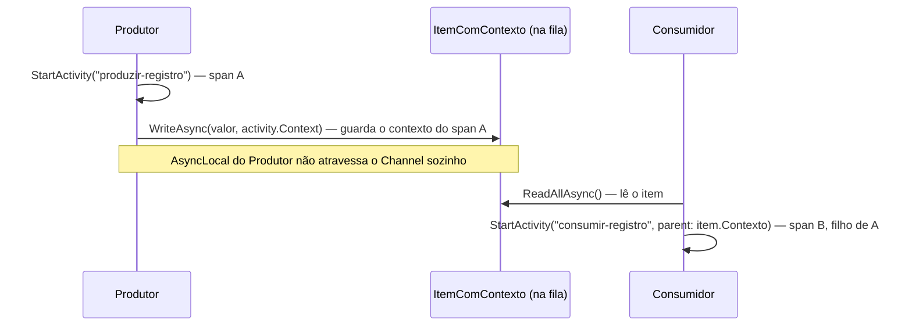
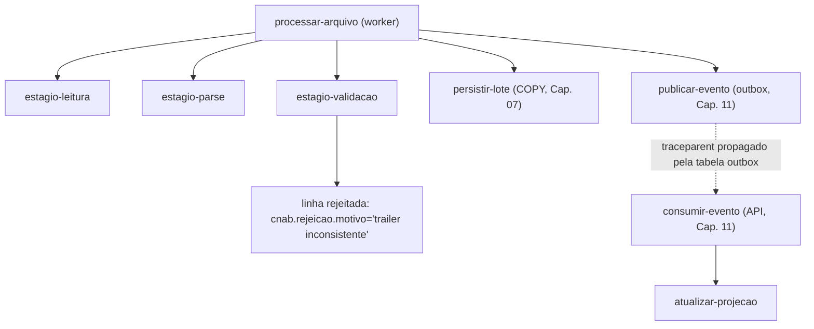

# Capítulo 12 — Observabilidade

> **Módulo 11 do roteiro.** Pré-requisito: [Capítulo 11](11-mensageria-e-resiliencia.md).
> **Tempo:** 2 semanas.
> **Entrega:** trace único que atravessa arquivo → evento → API, identificando uma linha rejeitada em menos de um minuto.

## A pergunta que este capítulo tem que responder

**Onde exatamente aquele arquivo travou.** Não "o worker está lento" — qual arquivo, qual lote, qual registro, em qual etapa. Sem isso, todo incidente vira arqueologia de log.

---

## 1. OpenTelemetry: os três pilares

**Por que isso importa:** logging estruturado (Capítulo 05) responde "o que aconteceu". Mas quando um sistema tem vários processos (worker, API, broker — todo o resto do curso) colaborando numa mesma operação, a pergunta muda para "em qual desses processos, e em que ordem, as coisas aconteceram" — e é aí que log sozinho já não basta.

> 📖 **Conceito: os três pilares da observabilidade**
> **Log** (já visto no Capítulo 05) é um registro pontual de um evento, com uma mensagem e contexto. **Métrica** é um número agregado ao longo do tempo (quantos arquivos processados, latência média) — bom para dashboards e alertas, mas sem detalhe de uma operação específica. **Trace** é o registro de uma operação de ponta a ponta, atravessando várias funções ou até vários processos, mostrando a sequência e a duração de cada etapa — um trace é composto por **spans**, cada um representando uma etapa (por exemplo, "ler arquivo", "gravar no banco"), organizados em árvore (span pai, spans filhos). **OpenTelemetry** é um padrão (e um conjunto de bibliotecas) para produzir os três de forma unificada, sem acoplar o código instrumentado a um fornecedor específico de observabilidade.

```bash
dotnet add package OpenTelemetry.Extensions.Hosting
dotnet add package OpenTelemetry.Instrumentation.AspNetCore
dotnet add package OpenTelemetry.Instrumentation.Http
dotnet add package OpenTelemetry.Instrumentation.EntityFrameworkCore
dotnet add package OpenTelemetry.Exporter.OpenTelemetryProtocol
```

```csharp
var serviceName = "cnab-worker";
var serviceVersion = typeof(Program).Assembly
    .GetCustomAttribute<AssemblyInformationalVersionAttribute>()?.InformationalVersion ?? "0.0.0";

builder.Services.AddOpenTelemetry()
    .ConfigureResource(r => r
        .AddService(serviceName, serviceVersion: serviceVersion)
        .AddAttributes([new("deployment.environment", builder.Environment.EnvironmentName)]))
    .WithTracing(t => t
        .AddSource(CnabTelemetria.NomeDaFonte)
        .AddAspNetCoreInstrumentation()
        .AddHttpClientInstrumentation()
        .AddEntityFrameworkCoreInstrumentation(o => o.SetDbStatementForText = true)
        .AddOtlpExporter())
    .WithMetrics(m => m
        .AddMeter(CnabTelemetria.NomeDoMedidor)
        .AddAspNetCoreInstrumentation()
        .AddRuntimeInstrumentation()               // GC, thread pool — o que o Cap. 10 media manualmente
        .AddOtlpExporter())
    .WithLogging(l => l.AddOtlpExporter());
```

Três sinais, um exportador (**OTLP**), um destino: um coletor OpenTelemetry, que roteia para o backend de sua escolha (Jaeger, Tempo, Honeycomb, Datadog, Application Insights). Trocar de backend não deveria exigir trocar o código instrumentado — só a configuração do coletor.

> 📖 **Conceito: OTLP e coletor**
> **OTLP** (*OpenTelemetry Protocol*) é o formato de fio padronizado pelo qual sua aplicação envia traces, métricas e logs para fora. O **coletor** é um processo separado que recebe esses dados, opcionalmente os transforma (filtra, amostra, enriquece, remove atributos sensíveis) e os encaminha ao backend final. Vale ter essa peça no meio mesmo parecendo um salto extra: ela é o que permite trocar de fornecedor de observabilidade, ou mandar para dois ao mesmo tempo durante uma migração, **sem recompilar nem reconfigurar a aplicação** — só o coletor muda.

A versão é lida em runtime a partir do atributo que o MinVer (Capítulo 01) já grava no assembly — sem pacote nenhum a mais. **Por que não `ThisAssembly.AssemblyInformationalVersion`,** que é o que se vê em boa parte dos exemplos na internet: aquela classe `ThisAssembly` não existe por padrão; ela é gerada por um pacote específico (`ThisAssembly.AssemblyInfo`, ou o Nerdbank.GitVersioning citado no Capítulo 01). O MinVer define a versão do assembly, mas não gera a classe — copiar aquele trecho sem o pacote dá erro de compilação.

Repare também que `ConfigureResource` é chamado **uma vez só**, e é ele que carrega nome, versão e ambiente. É fácil escrever um `ResourceBuilder.CreateDefault()` numa variável à parte, caprichar nos atributos e depois esquecer de usá-la — o resultado é um serviço que aparece no dashboard sem versão e sem ambiente, e nada no código indica o problema.

> 🐍 **Vindo de outra stack**
> — **Python:** é o mesmo OpenTelemetry, com a mesma API conceitual (`tracer.start_as_current_span` ≈ `ActivitySource.StartActivity`). A diferença que surpreende quem vem de lá: no .NET, a classe se chama `Activity`, não `Span`, por razões históricas — `Activity` é anterior ao OpenTelemetry e foi adaptada para ele. Leia "Activity" como "span" em toda a documentação.
> — **Java:** também o mesmo OpenTelemetry, com agente de auto-instrumentação (`-javaagent`). O .NET não usa agente: a instrumentação vem por pacotes NuGet registrados no código, como na seção 1. Mais explícito, e mais fácil de saber o que está ligado.
> — **Go:** muito próximo, inclusive na filosofia de instrumentação explícita. `context.Context` carregando o span é o equivalente do `Activity.Current` — com a diferença crucial de que o Go obriga você a passar o contexto à mão, enquanto o .NET o propaga implicitamente via `AsyncLocal` (seção 3.1) — o que é mais conveniente, e exatamente por isso quebra de forma silenciosa quando atravessa um `Channel<T>`.

---

## 2. `ActivitySource` — instrumentação manual do que importa

**Por que isso importa:** os pacotes da seção 1 já geram spans automaticamente para chamadas HTTP e consultas ao banco. Mas "qual arquivo travou em qual etapa" (a pergunta que abre este capítulo) é específico do domínio — nenhuma biblioteca genérica sabe o que é um "arquivo CNAB" ou um "lote". Esta seção é sobre criar spans customizados para esse vocabulário de domínio.

> 📖 **Conceito: `Activity` e `ActivitySource`**
> `Activity` é o nome que a BCL do .NET dá a um span (visto na caixa de conceito da seção 1) — é a classe usada para representar "uma etapa de operação com duração", com início e fim marcados no código. `ActivitySource` é a fábrica que cria essas `Activity`, nomeada por área do sistema (aqui, `"Cnab.Worker"`) para que o backend de observabilidade saiba de onde cada span veio.

Instrumentação automática cobre HTTP, banco e broker. O que importa de verdade neste domínio — arquivo, lote, registro — precisa de instrumentação manual.

```csharp
public static class CnabTelemetria
{
    public const string NomeDaFonte = "Cnab.Worker";
    public static readonly ActivitySource Fonte = new(NomeDaFonte, "1.0.0");

    public const string NomeDoMedidor = "Cnab.Worker";
    public static readonly Meter Medidor = new(NomeDoMedidor, "1.0.0");
}
```

```csharp
public async Task ProcessarArquivoAsync(string caminho, CancellationToken ct)
{
    using var activity = CnabTelemetria.Fonte.StartActivity("processar-arquivo", ActivityKind.Internal);
    activity?.SetTag("cnab.arquivo.nome", Path.GetFileName(caminho));
    activity?.SetTag("cnab.arquivo.tamanho_bytes", new FileInfo(caminho).Length);

    try
    {
        var resumo = await _pipeline.ExecutarAsync(caminho, ct);
        activity?.SetTag("cnab.arquivo.total_registros", resumo.Total);
        activity?.SetTag("cnab.arquivo.rejeitados", resumo.Rejeitados);
        activity?.SetStatus(ActivityStatusCode.Ok);
    }
    catch (Exception ex)
    {
        activity?.SetStatus(ActivityStatusCode.Error, ex.Message);
        activity?.AddException(ex);
        throw;
    }
}
```

Cada estágio do pipeline (Capítulo 03) ganha o próprio span, filho do span do arquivo:

```csharp
using var activity = CnabTelemetria.Fonte.StartActivity("estagio-validacao");
activity?.SetTag("cnab.registro.nosso_numero", registro.NossoNumero);
activity?.SetTag("cnab.lote.numero", registro.LoteNumero);

if (!ValidarTrailer(registro, out var motivo))
{
    activity?.SetStatus(ActivityStatusCode.Error, motivo);
    activity?.SetTag("cnab.rejeicao.motivo", motivo);
}
```

> ⚠️ **Nunca coloque dado sensível em tag de span.** O Capítulo 09 tratou redaction para log; trace não tem o mesmo mecanismo por padrão. `NossoNumero` é identificador operacional, não dado pessoal — tudo bem. CPF, conta e nome do sacado não vão em tag nenhuma.

> ⚠️ **Armadilha: o `using` do span e o `?.` que o acompanha**
> Duas coisas neste padrão parecem ruído e não são. O **`using`** em `using var activity = ...` é o que fecha o span e registra sua duração; sem ele, o span fica "pendurado" — aparece no dashboard sem fim e sem filhos corretos, porque todo span criado depois vira filho dele para sempre. E o **`activity?.`** com ponto de interrogação em todo acesso não é paranoia: `StartActivity` devolve **`null`** quando ninguém está escutando aquele `ActivitySource` (nenhum listener registrado, ou o sampler descartou este trace). Escrever `activity.SetTag(...)` sem o `?` funciona em desenvolvimento, com o coletor ligado, e lança `NullReferenceException` em produção no dia em que a amostragem da seção 5.1 descartar o trace. Os dois erros têm a mesma característica: passam no teste local.

> ⚠️ **Armadilha: `ActivityKind` errado desmonta o gráfico de serviços**
> `StartActivity` aceita um `ActivityKind`, e a maioria dos exemplos usa `Internal` sem pensar. Ele importa: o backend usa esse campo para montar o gráfico de dependências entre serviços e para parear chamadas. A regra é curta — `Client` quando você **faz** uma chamada de saída, `Server` quando você **atende** uma de entrada, `Producer` ao publicar mensagem, `Consumer` ao consumi-la, `Internal` para etapa interna que não cruza fronteira nenhuma. O span de publicação do outbox (seção 3.2) é `Producer` e o do consumidor é `Consumer` de propósito: é isso que faz os dois aparecerem ligados, e não como dois trabalhos internos sem relação.

### 2.1 Convenção de nomenclatura de atributos

Siga o padrão `<namespace>.<entidade>.<campo>` — é o que o OpenTelemetry Semantic Conventions recomenda para atributos customizados, e o que torna o trace pesquisável de forma consistente entre serviços:

```
cnab.arquivo.nome
cnab.arquivo.hash
cnab.lote.numero
cnab.registro.nosso_numero
cnab.rejeicao.motivo
```

---

## 3. Propagação de contexto W3C

**Por que isso importa:** um único trace, atravessando vários processos e até um `Channel<T>` interno do pipeline (Capítulo 03), só se mantém "um único trace" se cada salto passar adiante a informação de qual trace e span são os pais do próximo. Esta seção é sobre como essa informação (o "contexto") atravessa fronteiras que a instrumentação automática não alcança.

O padrão é o header `traceparent`, formato `00-{trace-id}-{span-id}-{flags}`. A instrumentação de HTTP e a maioria dos clientes de broker propagam automaticamente. O ponto cego é onde a cadeia atravessa algo que a biblioteca não instrumenta — e é exatamente onde este domínio vive.

### 3.1 O buraco: `Channel<T>`

> 📖 **Conceito: `AsyncLocal`**
> `AsyncLocal<T>` é um mecanismo do .NET que permite um valor "seguir" a execução de um método `async` através dos `await`s, como se fosse uma variável ambiente implícita — é assim que `Activity.Current` (o span ativo no momento) consegue estar disponível em qualquer ponto do código sem ser passado explicitamente como parâmetro. A limitação: esse mecanismo segue a árvore natural de chamadas `await`; qualquer coisa que quebre essa árvore — como um `Channel<T>` (Capítulo 03), onde produtor e consumidor rodam em fluxos de execução completamente separados — quebra também o rastro do `AsyncLocal`.

Um `Activity` é armazenado em `AsyncLocal` (ver conceito acima), que segue a árvore de `await`. Um `Channel<T>` **quebra essa árvore**: o produtor escreve num contexto de execução, o consumidor lê em outro completamente diferente (possivelmente noutra thread, iniciada antes do produtor sequer existir).

```csharp
// o contexto do produtor SE PERDE ao atravessar o canal
async Task ProduzirAsync(ChannelWriter<Item> writer)
{
    using var activity = fonte.StartActivity("produzir-item");
    await writer.WriteAsync(item);   // o item chega ao consumidor sem o Activity
}
```

**A correção: carregue o contexto explicitamente dentro do item.**



```csharp
public sealed record ItemComContexto<T>(T Valor, ActivityContext Contexto);

async Task ProduzirAsync(ChannelWriter<ItemComContexto<DetalheRetorno>> writer, CancellationToken ct)
{
    using var activity = CnabTelemetria.Fonte.StartActivity("produzir-registro");
    await foreach (var d in LerDetalhesAsync(caminho, ct))
        await writer.WriteAsync(new(d, activity?.Context ?? default), ct);
}

async Task ConsumirAsync(ChannelReader<ItemComContexto<DetalheRetorno>> reader, CancellationToken ct)
{
    await foreach (var item in reader.ReadAllAsync(ct))
    {
        using var activity = CnabTelemetria.Fonte.StartActivity(
            "consumir-registro", ActivityKind.Internal, item.Contexto);   // reconecta a árvore

        await ProcessarAsync(item.Valor, ct);
    }
}
```

Este é o detalhe que separa um trace completo de um trace partido em dois pedaços desconexos — e é fácil de esquecer justamente porque tudo compila e funciona sem ele; só o trace fica quebrado.

### 3.2 Propagação por mensageria

MassTransit propaga `traceparent` automaticamente nos headers da mensagem. Para publicação manual (o outbox do Capítulo 11), propague à mão:

```csharp
var contexto = Activity.Current?.Context ?? default;
var outboxMessage = new OutboxMessage
{
    Payload = JsonSerializer.Serialize(evento),
    TraceParent = contexto == default ? null
        : $"00-{contexto.TraceId}-{contexto.SpanId}-{(byte)contexto.TraceFlags:x2}"
};
```

```csharp
// no consumidor, ao publicar de fato
var parentContext = ActivityContext.TryParse(msg.TraceParent, null, out var ctx) ? ctx : default;
using var activity = fonte.StartActivity("publicar-evento", ActivityKind.Producer, parentContext);
```

É assim que o trace atravessa Worker → outbox (assíncrono, minutos depois) → RabbitMQ → Consumer → API: cada salto carrega o `traceparent` explicitamente onde a instrumentação automática não alcança.

---

## 4. Métricas com `Meter`

**Por que isso importa:** trace (seções 2-3) responde "o que aconteceu numa operação específica". Métrica responde uma pergunta diferente: "como o sistema está se comportando, agregado, ao longo do tempo" — quantos arquivos por hora, qual a taxa de rejeição. É o que alimenta um dashboard e dispara um alerta antes de virar incidente.

> 📖 **Conceito: `Meter`, `Counter` e `Histogram`**
> `Meter` é a fábrica de métricas, equivalente ao `ActivitySource` da seção 2 mas para métricas em vez de spans. `Counter<T>` é uma métrica que só cresce, contando ocorrências (quantos arquivos processados). `Histogram<T>` registra uma distribuição de valores (a duração de cada processamento), permitindo calcular depois percentis (p50, p99) — não só a média, que esconde outliers. `UpDownCounter<T>` é como um `Counter`, mas pode tanto subir quanto descer (o tamanho atual de uma fila, por exemplo).

```csharp
public static class CnabMetricas
{
    private static readonly Counter<long> ArquivosProcessados =
        CnabTelemetria.Medidor.CreateCounter<long>("cnab.arquivos.processados",
            description: "Total de arquivos processados com sucesso");

    private static readonly Counter<long> RegistrosRejeitados =
        CnabTelemetria.Medidor.CreateCounter<long>("cnab.registros.rejeitados");

    private static readonly Histogram<double> DuracaoProcessamento =
        CnabTelemetria.Medidor.CreateHistogram<double>("cnab.arquivo.duracao",
            unit: "ms", description: "Duração do processamento de um arquivo");

    private static readonly UpDownCounter<long> ArquivosNaFila =
        CnabTelemetria.Medidor.CreateUpDownCounter<long>("cnab.fila.tamanho");

    public static void RegistrarProcessamento(int total, int rejeitados, double duracaoMs, string banco)
    {
        var tags = new TagList { { "cnab.banco", banco } };
        ArquivosProcessados.Add(1, tags);
        RegistrosRejeitados.Add(rejeitados, tags);
        DuracaoProcessamento.Record(duracaoMs, tags);
    }
}
```

### 4.1 Controle de cardinalidade — a armadilha que derruba o backend de métricas

```csharp
// NUNCA: cada arquivo processado cria uma série temporal nova
counter.Add(1, new TagList { { "cnab.arquivo.nome", nomeDoArquivo } });

// NUNCA: id de registro como tag — cardinalidade ilimitada
histogram.Record(valor, new TagList { { "cnab.registro.id", registroId } });

// CORRETO: dimensões de baixa cardinalidade, com número fixo de valores possíveis
counter.Add(1, new TagList { { "cnab.banco", "033" }, { "cnab.status", "rejeitado" } });
```

Regra prática: se o número de valores possíveis de uma tag não cabe numa lista curta e conhecida de antemão, ela não é tag de métrica — é atributo de span (trace) ou campo de log. Cardinalidade alta explode o armazenamento do backend de métricas e é a causa mais comum de "a conta do Datadog triplicou".

> 📏 **Meça**
> Cardinalidade é a única métrica deste capítulo cujo custo é linear em dinheiro, e ela é contável em dois minutos. Processe 500 arquivos com a tag `cnab.arquivo.nome` ligada e conte as séries temporais criadas no dashboard — no Prometheus, `count({__name__="cnab_arquivos_processados_total"})`. Depois troque por `cnab.banco` e conte de novo. O que você quer ver é a diferença entre **um número que cresce com o volume processado** e **um número que não cresce**: 500 contra 3. A regra acima só fica instalada depois de ver os dois números lado a lado, porque no código as duas linhas são visualmente idênticas.

> ⚠️ **Armadilha: a cardinalidade é o produto, não a soma**
> Cinco tags de dez valores cada não custam cinquenta séries — custam até **dez mil**, porque cada combinação distinta é uma série própria. Uma tag "inofensiva" de cinco valores acrescentada a um contador que já tem três tags multiplica o custo por cinco de uma vez. Antes de acrescentar qualquer tag, multiplique as cardinalidades que já existem pela nova; se o produto passar de alguns milhares, a informação pertence ao trace, não à métrica.

---

## 5. Logs estruturados correlacionados

**Por que isso importa:** log (Capítulo 05), trace e métrica (seções acima) foram apresentados como três coisas separadas. Esta seção é onde eles se conectam: o mesmo id de trace aparecendo no log é o que permite pular de "vi um erro estranho no log" para "aqui está o trace completo daquela operação", sem busca manual.

Com OpenTelemetry ligado, `Activity.Current` injeta `TraceId` e `SpanId` automaticamente em todo log emitido dentro do span — sem código extra, desde que o provedor de logging do OTel esteja registrado (seção 1). O resultado: buscar por `TraceId` no seu backend de log traz exatamente os eventos daquele processamento, cruzáveis com o trace no Jaeger/Tempo pelo mesmo id.

### 5.1 Amostragem e custo

Logar cada registro de um arquivo de 5 milhões de linhas custa dinheiro e atenção. Amostre por padrão, mas **garanta 100% de captura para o caminho de erro**:

```csharp
builder.Logging.AddOpenTelemetry(o =>
{
    o.IncludeFormattedMessage = true;
    o.IncludeScopes = true;
});
```

```csharp
if (resultado.Rejeitado)
    logger.RegistroRejeitado(linha, motivo);          // sempre loga
else if (_amostrador.DeveLogar())                       // ex.: 1 em cada 10 mil
    logger.RegistroProcessado(nossoNumero);
```

Para trace, `TraceIdRatioBasedSampler` faz o mesmo em nível de span:

```csharp
t.SetSampler(new ParentBasedSampler(new TraceIdRatioBasedSampler(0.1)));  // 10% dos traces completos
```

Mas amostre com uma regra: **erro sempre é mantido**, mesmo que o trace tenha sido sorteado para descarte. A maioria dos backends modernos oferece "tail sampling" no coletor para isso — decide reter ou não **depois** de ver como o trace terminou.

---

## 6. .NET Aspire para desenvolvimento local

**Por que isso importa:** tudo que este capítulo ensinou (trace, métrica, log correlacionados) só é útil se você conseguir **ver** o resultado. Rodar Postgres, RabbitMQ, worker e API manualmente, cada um numa janela de terminal separada, é o tipo de fricção que faz gente parar de instrumentar direito. Esta ferramenta elimina essa fricção durante o desenvolvimento.

> **O Aspire aparece duas vezes no curso, com recortes diferentes.** Aqui, só o mínimo para você **ver** a telemetria: o dashboard e o exportador OTLP configurado sozinho. O Capítulo 13 (seção 6) retoma a ferramenta pelo outro lado — orquestração de verdade, com ordem de subida (`WaitFor`, `WaitForCompletion`), réplicas e migration como passo separado. Se você quiser montar o AppHost completo de uma vez, pode pular para lá e voltar; este capítulo só depende do dashboard.

```bash
dotnet new aspire-apphost -o Cnab.AppHost
```

```csharp
// Cnab.AppHost/Program.cs
var builder = DistributedApplication.CreateBuilder(args);

var postgres = builder.AddPostgres("postgres").WithDataVolume();
var db = postgres.AddDatabase("cnab");
var rabbit = builder.AddRabbitMQ("rabbitmq");

var worker = builder.AddProject<Projects.Cnab_Worker>("worker")
    .WithReference(db)
    .WithReference(rabbit);

var api = builder.AddProject<Projects.Cnab_Api>("api")
    .WithReference(db)
    .WithExternalHttpEndpoints();

builder.Build().Run();
```

```bash
dotnet run --project Cnab.AppHost
```

Isso sobe Postgres, RabbitMQ, o worker e a API, já conectados, com um **dashboard** em `localhost:18888` mostrando logs, traces e métricas de todos os serviços em tempo real — sem configurar exportador OTLP manualmente para desenvolvimento local, o Aspire já faz.

É a ferramenta certa para **ver** o trace atravessando os serviços enquanto se desenvolve, antes de precisar de um backend de produção completo.

---

## 7. O que medir num worker de lote

Painel mínimo para este domínio:

| Métrica | Por quê |
|---------|---------|
| **Lag** — diferença entre chegada do arquivo e início do processamento | detecta acúmulo antes que vire incidente |
| **Idade do arquivo mais antigo não processado** | o sinal mais direto de "algo travou" |
| **Taxa de rejeição** por banco/layout | um layout mudou e o parser não acompanhou |
| **Duração por etapa do pipeline** (Cap. 03) | aponta qual estágio é o gargalo |
| **Profundidade da fila de outbox não publicada** | broker fora do ar ou publicador travado |
| **Tamanho da fila de dead-letter** (Cap. 11) | mensagens definitivamente perdidas de vista |

```csharp
private static readonly ObservableGauge<double> IdadeArquivoMaisAntigo =
    CnabTelemetria.Medidor.CreateObservableGauge("cnab.fila.idade_mais_antiga_segundos",
        () => CalcularIdadeMaisAntiga().TotalSeconds);
```

`ObservableGauge` é lido sob demanda pelo exportador, em vez de você empurrar valores — ideal para "estado atual de algo", como idade do item mais antigo numa fila.

---

## 8. Exercícios

Faça todos com o Aspire rodando (`dotnet run --project Cnab.AppHost`) e o dashboard aberto em `localhost:18888`. Observabilidade é o único capítulo em que o exercício é literalmente **olhar** — se você não está vendo o resultado numa tela, não está fazendo o exercício.

1. **O primeiro span.** Instrumente um único método com `ActivitySource.StartActivity` e veja-o aparecer no dashboard. Agora chame outro método instrumentado de dentro dele e confirme o aninhamento pai/filho. Depois **remova o `using`** do span pai e observe a árvore quebrar — é a primeira armadilha do projeto, e o sintoma visual é inconfundível.

2. **Tags que respondem perguntas.** Instrumente o processamento de arquivo com as tags da seção 2.1. Processe cinco arquivos, um deles com erro. No dashboard, filtre por `cnab.arquivo.nome` e ache só aquele. Depois tente achar o mesmo arquivo **sem** as tags, só pelo nome do span: a diferença entre as duas experiências é o argumento da seção inteira.

3. **O trace que se parte.** Instrumente os dois lados do `Channel<T>` do Capítulo 03 **sem** a técnica da seção 3.1. Confirme no dashboard que aparecem **dois traces desconexos** em vez de um. Agora aplique a propagação manual de contexto e confirme que viraram um só. Este é o exercício central do capítulo.

4. **Atravessando o outbox.** Grave o `traceparent` na tabela de outbox do Capítulo 11 e restaure-o no consumidor. Pare o broker por dois minutos para forçar atraso real, e confirme que o span do consumidor ainda aparece como filho do de publicação, **minutos depois**. Ver isso funcionar é o momento em que trace distribuído deixa de ser abstrato.

5. **Cardinalidade explodindo.** Registre uma métrica com `cnab.arquivo.nome` como tag e processe 500 arquivos com nomes distintos. Olhe quantas séries temporais foram criadas no dashboard. Depois troque a tag por `cnab.banco` (três valores possíveis) e compare. Escreva a regra da seção 4.1 com suas palavras, agora que viu o número.

6. **Média que mente.** Registre a duração no `Histogram` e processe 100 arquivos, sendo que 3 deles são 50x mais lentos. Compare a média com o p99 no dashboard. A média vai parecer saudável enquanto 3% dos seus usuários têm uma experiência terrível — é por isso que a seção 4 insiste em percentil.

7. **Log e trace conectados.** Emita um `logger.LogWarning` de dentro de um span. Confirme no dashboard que o log carrega o `TraceId` **sem** você ter escrito nenhum código para isso. Copie esse `TraceId`, busque por ele, e pule do log para o trace completo. Cronometre esse pulo — ele é o que o critério de aceite mede.

8. **Amostragem que não perde erro.** Configure `TraceIdRatioBasedSampler(0.1)` e processe 100 arquivos, 5 deles com erro. Confirme que aproximadamente 10 traces foram retidos — e verifique se **os 5 com erro** estão entre eles. Provavelmente não estarão, e é justamente esse o problema que a seção 5.1 levanta. Escreva o que você faria a respeito.

9. **Dado sensível vazando no trace.** Ponha um CPF numa tag de span, de propósito, e confirme que ele aparece no dashboard em texto puro — **sem** nenhuma redaction, mesmo com tudo do Capítulo 09 configurado. Este é o ponto da advertência da seção 2: o mecanismo de redaction do logging não cobre trace. Remova-o e escreva o teste que impediria a reintrodução.

10. **Cronometrando o critério de aceite.** Peça para alguém (ou para você mesmo, dias depois) introduzir uma linha inválida num arquivo qualquer sem te contar qual. Suba a stack, processe, e cronometre quanto tempo você leva para identificar arquivo, lote e etapa **usando só o dashboard**, sem abrir o banco. Se passar de um minuto, a instrumentação está incompleta — e você agora sabe exatamente qual tag está faltando.

---

## 📦 Projeto: instrumentar a stack inteira

### Enunciado

Um trace único que vai da chegada do arquivo até a consulta na API, passando pelo evento.



A seta pontilhada entre `publicar-evento` e `consumir-evento` é deliberada: ao contrário das setas sólidas (chamada direta, mesmo processo), essa travessia passa pela tabela outbox e pode levar minutos — mas ainda assim é o **mesmo trace**, porque o `traceparent` foi propagado manualmente (seção 3.2).

Uma consulta feita horas depois (`GET /lotes/{id}`) normalmente **não** compartilha esse `trace_id` — trace é por operação, não pela vida inteira da entidade. O que conecta os dois é a tag de negócio `cnab.arquivo.id` / `cnab.lote.id`, pesquisável nos dois traces. Deixe isso claro no seu dashboard: um trace por operação, uma tag de correlação de negócio atravessando todos eles.

### ✅ Critério de aceite

- [ ] **Dada uma linha rejeitada, identificar arquivo, lote e etapa em menos de um minuto usando só o trace, sem abrir o banco.** Cronometre de verdade: rejeite uma linha de propósito, abra o Jaeger/Aspire dashboard, meça o tempo até achar a causa.
- [ ] O trace atravessa o `Channel<T>` do pipeline sem quebrar — prove com um span filho do lado do consumidor aparecendo corretamente aninhado.
- [ ] O trace atravessa a publicação assíncrona via outbox — o span do consumidor do evento aparece como filho do span de publicação, mesmo com minutos de atraso entre os dois.
- [ ] Métricas de lag, idade do item mais antigo, taxa de rejeição e profundidade de outbox visíveis no dashboard.
- [ ] Nenhuma tag de métrica com cardinalidade não controlada — audite todas as tags registradas.
- [ ] Nenhum dado sensível em tag de span — reaplique o teste do Capítulo 09, adaptado para trace.
- [ ] `TraceId` aparece em todo log emitido dentro de um span, sem código manual por chamada de log.
- [ ] `.NET Aspire` sobe a stack local completa com um comando.

> 📏 **Meça**
> Este é o único critério de aceite do curso medido com cronômetro em vez de com ferramenta, e por isso o mais fácil de declarar cumprido sem ter cumprido. Cronometre de verdade — do momento em que você abre o dashboard até o momento em que sabe **qual arquivo, qual lote e qual etapa**. Faça isso duas vezes: uma logo depois de instrumentar (quando você ainda lembra dos nomes das tags) e outra **uma semana depois**, sobre um erro diferente. O segundo número é o que vale, porque é ele que se parece com um incidente real, às três da manhã, feito por outra pessoa. Se o segundo for muito pior que o primeiro, o que falta não é instrumentação — é nomenclatura consistente (seção 2.1).

### Roteiro de verificação

1. Suba a stack com Aspire.
2. Processe um arquivo com uma linha propositalmente inválida.
3. Abra o dashboard, encontre o trace pelo nome do arquivo (tag `cnab.arquivo.nome`).
4. Expanda até o span da validação; confirme que `cnab.rejeicao.motivo` está lá.
5. Siga o mesmo trace até o span de publicação do evento e o span do consumidor.
6. Cronometre o passo 3 a 5. Se passar de um minuto, o problema é a instrumentação, não a busca.

### Armadilhas deste projeto

- **Span não fechado** (`using` esquecido) deixa a árvore incompleta e o span "pendurado" no dashboard.
- **`activity.SetTag` sem o `?`** — `StartActivity` devolve `null` quando não há listener ou quando o sampler descartou o trace. Funciona em desenvolvimento, lança `NullReferenceException` em produção sob amostragem.
- **`Activity.Current` lido depois de um `Channel<T>`** sem a técnica da seção 3.1 — o sintoma são dois traces desconexos em vez de um.
- **`ActivityKind.Internal` em tudo** — o gráfico de serviços do backend fica achatado e a travessia worker → broker → consumidor não aparece como travessia. Publicação é `Producer`, consumo é `Consumer`.
- **Tag de alta cardinalidade** — se o dashboard de métricas ficar lento ou a fatura de observabilidade disparar, é quase sempre isso. Lembre que o custo é o **produto** das cardinalidades, não a soma.
- **Instrumentar tudo e medir nada** — ligar os cinco pacotes de instrumentação automática da seção 1 e nunca criar um span de domínio produz um trace volumoso que não responde a pergunta que abre o capítulo. O sinal de alerta é um trace cheio de `SELECT` e `HTTP GET` e nenhum span chamado `processar-arquivo`.
- **`SetDbStatementForText = true` em produção com dado sensível na query** — revise à luz do Capítulo 09; em produção prefira `false` e confie nos spans nomeados.

---

## Checklist de saída

- [ ] Sei a diferença entre trace, métrica e log, e o que cada um responde.
- [ ] Sei por que `Channel<T>` quebra `AsyncLocal` e sei corrigir.
- [ ] Nunca uso valor de cardinalidade ilimitada como tag de métrica.
- [ ] Sei propagar `traceparent` manualmente quando a biblioteca não instrumenta.
- [ ] Encontro a causa de um erro específico usando só o trace, em menos de um minuto.
- [ ] Sei quando amostrar log/trace e por que erro nunca deve ser amostrado.

## Para ir além

- `learn.microsoft.com/dotnet/core/diagnostics/observability-with-otel`
- OpenTelemetry Semantic Conventions — `opentelemetry.io/docs/specs/semconv/`
- .NET Aspire — `learn.microsoft.com/dotnet/aspire/`
- *Distributed Tracing in Practice*, Parker, Spoonhower, Mace, Sigelman

➡️ **Próximo:** [Capítulo 13 — Empacotamento, deploy e Aspire](13-empacotamento-deploy-aspire.md)
