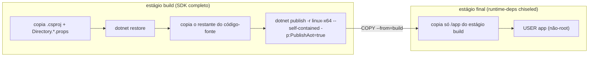
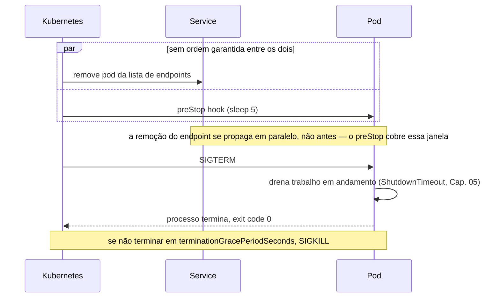
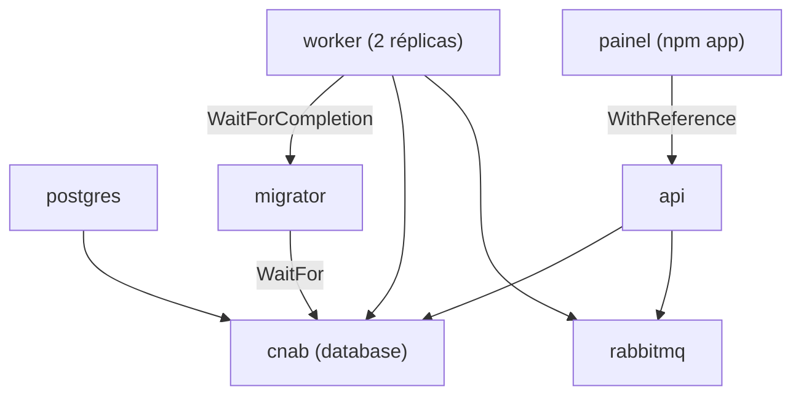

# Capítulo 13 — Empacotamento, deploy e Aspire

> **Módulo 12 do roteiro.** Pré-requisito: [Capítulo 12](12-observabilidade.md).
> **Tempo:** 2 semanas.
> **Entrega:** stack completa subindo localmente via Aspire; imagens publicadas pelo pipeline; `kubectl delete pod` sem perda de registro.

## Por que este capítulo existe

Código que não sobe direito não conta. Este capítulo fecha o ciclo entre build e produção — a parte que, quando mal feita, transforma cada um dos treze capítulos anteriores em teoria bonita que não sobrevive ao primeiro deploy real.

---

## 1. Dockerfile multi-stage

**Por que isso importa:** todo o código deste curso, até aqui, rodou direto na sua máquina, com o SDK instalado. Produção não funciona assim — o código precisa ser empacotado de um jeito que rode de forma idêntica em qualquer servidor, sem depender do que está instalado nele. Container (conceito já visto no Capítulo 06, para Testcontainers) é essa forma de empacotamento.

> 📖 **Conceito: Dockerfile e imagem**
> Um **Dockerfile** é uma receita, em texto, de como construir um container: parte de uma imagem-base (aqui, `mcr.microsoft.com/dotnet/sdk:10.0-noble`, uma imagem já com o SDK do .NET instalado) e declara passos (copiar arquivos, rodar comandos) até chegar no estado final desejado. O resultado de seguir essa receita é uma **imagem**: um pacote imutável, pronto para virar um container em execução em qualquer máquina com Docker. Um Dockerfile **multi-stage** (o `AS build` e `AS final` abaixo) usa mais de uma imagem-base no mesmo arquivo — uma para compilar (com todas as ferramentas de build) e outra, menor, só para rodar o resultado já compilado, descartando tudo que só era necessário durante o build.

```dockerfile
# ── build ──────────────────────────────────────────────
FROM mcr.microsoft.com/dotnet/sdk:10.0-noble AS build
WORKDIR /src

# copia só os arquivos de projeto primeiro: cache de layer no restore.
# Directory.Build.targets entra junto: sem ele o build usa regras diferentes
# das da sua máquina, e a divergência aparece como erro só no CI.
COPY global.json nuget.config Directory.Build.props Directory.Build.targets Directory.Packages.props ./

# um COPY por projeto do grafo de dependências do worker — se faltar um,
# o restore falha com "project file does not exist"
COPY src/Cnab.Worker/Cnab.Worker.csproj   src/Cnab.Worker/
COPY src/Cnab.Parsing/Cnab.Parsing.csproj src/Cnab.Parsing/
COPY src/Cnab.Pipeline/Cnab.Pipeline.csproj src/Cnab.Pipeline/
COPY src/Cnab.Data/Cnab.Data.csproj       src/Cnab.Data/

# o -r e o PublishAot têm que casar com o publish, senão o publish restaura tudo de novo
RUN dotnet restore src/Cnab.Worker/Cnab.Worker.csproj -r linux-x64 -p:PublishAot=true

COPY src/ src/
RUN dotnet publish src/Cnab.Worker/Cnab.Worker.csproj \
    --no-restore \
    -c Release -r linux-x64 \
    -p:PublishAot=true -p:StripSymbols=true \
    -o /app

# ── runtime: chiseled, sem shell, sem gerenciador de pacote ──────────
FROM mcr.microsoft.com/dotnet/runtime-deps:10.0-noble-chiseled AS final
WORKDIR /app
COPY --from=build /app .

# a imagem chiseled já traz o usuário `app`, não-root
USER app
ENTRYPOINT ["./Cnab.Worker"]
```

> ⚠️ **Armadilha: `#` não é comentário no meio de uma linha de Dockerfile**
> O Docker só trata `#` como comentário quando ele é o **primeiro caractere da linha**. Escrever `USER app   # já não-root` passa `#`, `já`, `não-root` como argumentos extras para `USER`, e o build quebra com `USER requires exactly one argument`. Comentário de Dockerfile vai sempre em linha própria, como acima.

Dois detalhes do restore que decidem se o cache da seção 1.1 funciona de verdade:

- **`-r linux-x64` e `-p:PublishAot=true` no `restore`, iguais aos do `publish`.** O restore é específico do runtime identifier, e o AOT exige pacotes próprios (o ILCompiler). Restaurar sem esses dois e publicar com eles faz o `publish` descobrir que falta pacote e restaurar tudo de novo — a camada cacheada existe e não serve para nada. O `--no-restore` no `publish` é o que transforma esse desencontro, se ele voltar, em **falha visível** em vez de lentidão silenciosa. (Se o `PublishAot` já estiver no `.csproj`, como o Capítulo 10 recomenda, ele vale para os dois comandos e as flags viram redundância inofensiva — mantê-las explícitas documenta a intenção no próprio Dockerfile.)
- **`global.json`, `nuget.config` e os dois `Directory.*` copiados junto.** Sem o `global.json` o container pode compilar com outra versão de SDK que não a do Capítulo 01; sem o `nuget.config`, o package source mapping (também do Capítulo 01) não vale dentro do build — justamente onde ele mais importa; e sem o `Directory.Build.props`/`.targets` o build perde `TreatWarningsAsErrors`, `Nullable` e as regras por tipo de projeto, ou seja, compila sob regras mais frouxas do que as que você validou localmente.
- **Um `COPY` por `.csproj` do grafo de dependências.** A lista precisa incluir **todo** projeto que o worker referencia, direta ou indiretamente — aqui, `Cnab.Data` entra a partir do Capítulo 07, quando a persistência passa a existir. Esquecer um só faz o `restore` falhar com "project file does not exist" apontando um caminho que existe no seu repositório, o que confunde. Uma alternativa a manter a lista à mão é `COPY **/*.csproj ./` com um script que recria a árvore de pastas; para meia dúzia de projetos, a lista explícita é mais legível e falha mais cedo.

Note ainda que `-p:PublishAot=true` já implica `--self-contained`; deixar os dois não é erro, mas o primeiro é quem manda.



O estágio `build` inteiro — SDK, compilador, código-fonte, cache de restore — é descartado na imagem final. Só o que foi copiado por `COPY --from=build` sobrevive; é isso que leva uma imagem de centenas de MB para poucos MB no caso do worker em AOT.

> 📖 **Conceito: registry, tag e digest**
> Uma imagem construída na sua máquina só existe na sua máquina. Um **registry** é o servidor onde imagens são publicadas e de onde os servidores as baixam — Docker Hub, GitHub Container Registry (`ghcr.io`, usado na seção 5), ECR da AWS. O nome completo de uma imagem é `registry/repositório:tag`, por exemplo `ghcr.io/empresa/worker:1.4.0`. A **tag** é um rótulo móvel: alguém pode republicar `:1.4.0` amanhã apontando para outro conteúdo, e é exatamente esse o problema do `:latest` da seção 5.1. O **digest** (`sha256:a1b2…`) é o identificador imutável do conteúdo — duas imagens com o mesmo digest são byte a byte a mesma coisa, sempre. Manifesto de produção que referencia digest em vez de tag é a versão mais rigorosa da regra da seção 5.1.

> 📖 **Conceito: layer (camada)**
> Uma imagem não é um arquivo único: é uma pilha de **camadas**, uma por instrução do Dockerfile que altera o sistema de arquivos (`COPY`, `RUN`). Cada camada guarda só a diferença em relação à anterior. Duas consequências práticas que a seção seguinte explora: camadas idênticas são **reaproveitadas** entre builds (é o cache), e são baixadas uma vez só pelo servidor, mesmo que dez imagens diferentes as compartilhem. A contrapartida: uma camada nunca é "desfeita" por uma instrução posterior — um arquivo copiado numa camada e apagado na seguinte continua ocupando espaço e continua legível por quem tiver a imagem. É por isso que segredo não entra em Dockerfile, nem mesmo "temporariamente".

### 1.1 Aproveitamento de cache de layer

A ordem do `COPY` é o que faz o cache funcionar: **arquivos que mudam pouco primeiro** (`.csproj`, arquivos de props), **os que mudam sempre por último** (`.cs`). Alterar uma linha de código não invalida o `dotnet restore`, que é o passo mais caro do build.

```dockerfile
# ERRADO: qualquer mudança de código invalida o restore
COPY . .
RUN dotnet restore && dotnet publish

# CERTO: restore cacheado enquanto os .csproj não mudam
COPY *.csproj ./
RUN dotnet restore
COPY . .
RUN dotnet publish --no-restore
```

### 1.2 Imagem chiseled vs distroless vs Alpine

| Base | Tamanho | Shell | Gerenciador de pacote | glibc |
|------|---------|-------|------------------------|-------|
| `aspnet:10.0` | ~220 MB | sim | apt | sim |
| `aspnet:10.0-noble-chiseled` | ~90 MB | não | não | sim |
| `runtime-deps:10.0-noble-chiseled` | ~30 MB | não | não | sim (só o essencial para AOT) |
| Alpine | ~110 MB | sim | apk | musl — cuidado com compatibilidade |

Para o worker em Native AOT (Capítulo 10), `runtime-deps-chiseled` é a base mínima: você já não precisa do runtime .NET dentro da imagem, só das bibliotecas nativas do sistema operacional.

**Sem shell significa sem `docker exec -it container sh`** para debugar. É uma escolha deliberada de superfície de ataque menor — o Capítulo 09 concorda com essa troca — mas exige que a observabilidade (Capítulo 12) seja suficiente para nunca precisar entrar no container.

**Alpine e musl:** algumas bibliotecas nativas (certas versões de ICU, alguns pacotes de criptografia) esperam glibc. Teste a imagem Alpine antes de adotar; chiseled evita esse problema por manter glibc.

### 1.3 AOT em container

```dockerfile
FROM mcr.microsoft.com/dotnet/sdk:10.0-noble AS build
# clang e zlib1g-dev geralmente já vêm na imagem do SDK; confirme com:
# RUN dotnet publish --self-contained -p:PublishAot=true -v diag
```

Se a imagem do SDK não tiver o toolchain nativo, adicione:

```dockerfile
RUN apt-get update && apt-get install -y clang zlib1g-dev
```

---

## 2. Configuração por ambiente

### 2.1 `DOTNET_` vs `ASPNETCORE_`

| Prefixo | Escopo |
|---------|--------|
| `DOTNET_` | runtime do .NET em geral — vale para qualquer app, inclusive console e worker |
| `ASPNETCORE_` | específico do host web |

```bash
DOTNET_ENVIRONMENT=Production           # worker, CLI, qualquer app
ASPNETCORE_ENVIRONMENT=Production       # API — tem precedência sobre DOTNET_ENVIRONMENT quando ambos setados
ASPNETCORE_URLS=http://+:8080
DOTNET_gcServer=1                       # variável de runtime, equivalente a ServerGarbageCollection
```

### 2.2 Precedência de providers

Do mais fraco ao mais forte, na ordem em que são registrados por `CreateApplicationBuilder`:

```
appsettings.json → appsettings.{Environment}.json → User Secrets (só Development)
  → variáveis de ambiente → argumentos de linha de comando
```

> 📖 **Conceito: `ConfigMap` e `Secret`**
> São os dois objetos do Kubernetes que guardam configuração **fora** da imagem. Um `ConfigMap` é um conjunto de pares chave-valor em texto puro, para o que não é sensível (nome do diretório de entrada, intervalo de varredura). Um `Secret` tem a mesma forma, mas é tratado de modo diferente pelo cluster: pode ser criptografado em repouso, tem controle de acesso próprio e não aparece em listagens comuns. Os dois são expostos ao container como variável de ambiente ou como arquivo montado. Aviso que surpreende: o conteúdo de um `Secret` é apenas **codificado em Base64**, não criptografado — Base64 é codificação, não segurança, e qualquer um com permissão de leitura no objeto vê o valor original. Para segredo de verdade, o `Secret` do Kubernetes é o transporte; o cofre do Capítulo 09 (seção 3.2) é a fonte.

Em Kubernetes, o padrão é injetar via `ConfigMap` (não sensível) e `Secret` (sensível) como variáveis de ambiente, vencendo o `appsettings.json` embutido na imagem — a mesma imagem roda em qualquer ambiente, e o que muda é a configuração externa.

---

## 3. Health checks: liveness, readiness, startup

**Por que isso importa:** o Capítulo 05 já registrou health checks básicos no worker. Aqui a pergunta é mais específica: rodando dentro de Kubernetes (seção 4), o orquestrador decide se reinicia ou não um container baseado nessas respostas — e como mostra a armadilha abaixo, responder a pergunta errada no lugar errado piora um incidente em vez de contê-lo.

```csharp
builder.Services.AddHealthChecks()
    .AddCheck<ConexaoComBancoCheck>("postgres", tags: ["ready"])
    .AddCheck<FilaDeMensagensCheck>("rabbitmq", tags: ["ready"])
    .AddCheck<DiretorioEntradaCheck>("filesystem", tags: ["ready"])
    .AddCheck("self", () => HealthCheckResult.Healthy(), tags: ["live"]);

app.MapHealthChecks("/health/live", new HealthCheckOptions { Predicate = c => c.Tags.Contains("live") });
app.MapHealthChecks("/health/ready", new HealthCheckOptions { Predicate = c => c.Tags.Contains("ready") });
```

**O que cada probe deve realmente verificar:**

| Probe | Pergunta | Verifica |
|-------|----------|----------|
| **Startup** | "já terminou de inicializar?" | migrations aplicadas, cache aquecido, conexão inicial estabelecida |
| **Liveness** | "o processo está vivo ou travado?" | só o próprio processo responde — **nunca** dependência externa |
| **Readiness** | "pode receber tráfego/trabalho agora?" | banco alcançável, broker alcançável, disco com espaço |

> ⚠️ **Armadilha grave**
> Colocar checagem de banco em **liveness**: se o Postgres cair, o Kubernetes começa a **reiniciar o pod repetidamente** — que não vai resolver o problema do banco e ainda derruba a aplicação que estava funcionando bem, piorando um incidente de infraestrutura ao transformá-lo também num de aplicação. Dependência externa é sempre readiness, nunca liveness.

```yaml
livenessProbe:
  httpGet: { path: /health/live, port: 8080 }
  periodSeconds: 10
  failureThreshold: 3
readinessProbe:
  httpGet: { path: /health/ready, port: 8080 }
  periodSeconds: 5
  failureThreshold: 2
startupProbe:
  httpGet: { path: /health/live, port: 8080 }
  failureThreshold: 30
  periodSeconds: 2                        # até 60s para a app subir antes do liveness assumir o controle
```

---

## 4. Kubernetes

**Por que isso importa:** um único container rodando numa única máquina não sobrevive à máquina caindo, não escala automaticamente sob carga, e não tem ninguém reiniciando-o se travar. Kubernetes é a ferramenta que resolve esses problemas — e o vocabulário desta seção (pod, réplica, probe) é o que todo o resto do capítulo assume.

> 🐍 **Vindo de outra stack**
> Esta parte é a mais portável do curso — Dockerfile, Kubernetes e CI/CD são idênticos em qualquer linguagem. Só três detalhes são específicos do .NET e costumam pegar quem vem de fora:
> — A imagem-base de runtime **não** é a mesma do build. Em Python é comum usar a mesma imagem para as duas coisas; aqui, usar o SDK em produção multiplica o tamanho por cinco e leva compilador para dentro do container.
> — `DOTNET_ENVIRONMENT`/`ASPNETCORE_ENVIRONMENT` (seção 2.1) fazem o papel de `FLASK_ENV`, `SPRING_PROFILES_ACTIVE` ou `GIN_MODE` — com a diferença de que o valor `"Development"` liga comportamentos bem diferentes (mensagens de erro detalhadas, User Secrets). Nunca deixe vazar para produção.
> — O `__` como separador de hierarquia em variável de ambiente (`CNAB_Parser__Layout`) é uma convenção do .NET que não existe nas outras stacks, e é a causa número um de "configurei a variável e ela não pegou".

> 📖 **Conceito: Kubernetes, pod e réplica**
> Kubernetes (às vezes abreviado "k8s") é um orquestrador de containers: um sistema que gerencia, em um conjunto de máquinas (o "cluster"), quantas cópias de cada container devem rodar, em quais máquinas, reiniciando-as se travarem e redistribuindo-as se uma máquina cair. Um **pod** é a menor unidade que o Kubernetes gerencia — normalmente um único container em execução (o worker ou a API deste curso). Uma **réplica** é uma cópia idêntica de um pod, rodando em paralelo com as outras, para distribuir carga e sobreviver à perda de uma delas — é por isso que os capítulos anteriores (05 e 07) se preocuparam tanto com lock distribuído e idempotência: com múltiplas réplicas, mais de uma pode tentar processar o mesmo arquivo ao mesmo tempo.

### 4.1 Requests e limits

> 📖 **Conceito: `requests` e `limits`**
> São dois números diferentes, e confundi-los é a causa da maior parte dos problemas de capacidade em Kubernetes. **`requests`** é a reserva: o quanto o pod declara que precisa, e o que o escalonador usa para decidir em qual máquina ele cabe. É contabilidade de agendamento — o pod pode usar mais do que pediu, se houver sobra na máquina. **`limits`** é o teto rígido: estourar o limite de memória faz o pod ser morto na hora (`OOMKilled`, exit code 137, o mesmo do Capítulo 05); estourar o de CPU não mata nada, mas faz o processo ser **pausado** repetidamente (throttling) até caber na cota. É essa diferença de comportamento que justifica a recomendação abaixo.

```yaml
resources:
  requests: { cpu: "500m", memory: "256Mi" }
  limits: { memory: "512Mi" }              # sem limit de CPU: throttling é pior que usar mais
```

**Não defina `limits.cpu`** salvo exigência explícita: CPU throttling sob `limits` é uma fonte clássica de latência inexplicável — o processo é pausado por fração de segundo em ciclos repetidos, e nenhuma métrica de "uso de CPU" média mostra isso claramente. `requests.cpu` sozinho já garante a fatia mínima via o scheduler.

Case `requests.memory` com o que o Capítulo 02 e o Capítulo 10 mediram — não adivinhe. Se o worker AOT usa 67 MB de RSS medido, `requests: 96Mi` com folga é uma escolha informada; `requests: 256Mi` "por garantia" desperdiça capacidade do cluster inteiro, multiplicado por réplica.

### 4.2 `terminationGracePeriodSeconds`

Este número **precisa** ser maior que o `ShutdownTimeout` do Capítulo 05, com folga:

```yaml
spec:
  terminationGracePeriodSeconds: 40    # > ShutdownTimeout (30s) do HostOptions
  containers:
    - name: worker
      lifecycle:
        preStop:
          exec: { command: ["sleep", "5"] }   # dá tempo do endpoint sair do Service antes do SIGTERM
```

A sequência real do Kubernetes: o pod sai da lista de endpoints do `Service` **ao mesmo tempo** que o SIGTERM é enviado — não antes. Sem o `preStop` com um pequeno atraso, uma requisição pode chegar a um pod que já está desligando. Para um worker sem tráfego HTTP de entrada isso não se aplica; para a API do Capítulo 08, aplica.



### 4.3 Escala por tamanho de fila

Para o worker (Capítulo 05), escalar por CPU não faz sentido — o sinal certo é **quanto trabalho está esperando**:

```yaml
apiVersion: keda.sh/v1alpha1
kind: ScaledObject
metadata: { name: cnab-worker }
spec:
  scaleTargetRef: { name: cnab-worker }
  minReplicaCount: 1
  maxReplicaCount: 10
  triggers:
    - type: rabbitmq
      metadata:
        queueName: arquivos-pendentes
        queueLength: "50"          # uma réplica a mais a cada 50 itens na fila
```

> 📖 **Conceito: autoscaling horizontal**
> Escalar **verticalmente** é dar mais CPU e memória ao mesmo pod; escalar **horizontalmente** é subir mais pods iguais. Em Kubernetes o padrão é o horizontal, e é o que os capítulos anteriores prepararam sem dizer o nome: lock distribuído (Cap. 05) e idempotência (Cap. 07) existem precisamente porque, sob autoscaling, **quantas cópias do seu worker estão rodando agora é uma variável, não uma constante** — pode ser 1 às três da manhã e 10 no fechamento do mês. O autoscaler observa um sinal, compara com um alvo, e ajusta o número de réplicas nos dois sentidos.

**KEDA** estende o autoscaler do Kubernetes com gatilhos além de CPU/memória — fila do RabbitMQ, lag do Kafka, métrica customizada do Prometheus (a idade do arquivo mais antigo, do Capítulo 12, é um gatilho legítimo).

---

## 5. CI/CD

**Por que isso importa:** o Capítulo 01 já configurou CI (integração contínua — compilar e testar a cada mudança). Esta seção acrescenta o **CD** (Continuous Delivery/Deployment — entrega contínua): o pipeline que pega o código já testado e o transforma automaticamente numa imagem de container publicada, pronta para rodar em produção, sem passo manual.

```yaml
name: CD
on:
  push:
    tags: ['v*']

jobs:
  build-and-push:
    runs-on: ubuntu-latest
    permissions: { contents: read, packages: write, id-token: write }
    steps:
      - uses: actions/checkout@v4
        with: { fetch-depth: 0 }

      - uses: docker/setup-buildx-action@v3
      - uses: docker/login-action@v3
        with: { registry: ghcr.io, username: ${{ github.actor }}, password: ${{ secrets.GITHUB_TOKEN }} }

      - name: Build e push
        uses: docker/build-push-action@v6
        with:
          context: .
          push: true
          tags: ghcr.io/${{ github.repository }}/worker:${{ github.ref_name }}
          cache-from: type=gha
          cache-to: type=gha,mode=max
          sbom: true                       # SBOM gerado no build da imagem (Capítulo 09)
          provenance: true

      - name: Scan de vulnerabilidade
        uses: aquasecurity/trivy-action@master
        with:
          image-ref: ghcr.io/${{ github.repository }}/worker:${{ github.ref_name }}
          severity: 'CRITICAL,HIGH'
          exit-code: '1'                   # falha o pipeline

      - name: Assinar a imagem
        run: cosign sign --yes ghcr.io/${{ github.repository }}/worker:${{ github.ref_name }}
```

> 📖 **Conceito: assinatura de imagem e procedência**
> O `cosign sign` do último passo acrescenta uma **assinatura criptográfica** à imagem publicada: uma prova verificável de que aquele conteúdo exato saiu deste pipeline, e não de outro lugar. O `provenance: true` do passo de build gera junto um registro de **procedência** — com qual commit, em qual runner e com quais parâmetros a imagem foi construída. Juntos com o SBOM do Capítulo 09, respondem as três perguntas que aparecem depois de um incidente de supply chain: *o que tem dentro* (SBOM), *de onde veio* (procedência) e *é mesmo isto* (assinatura). O cluster pode ser configurado para **recusar** imagem sem assinatura válida, que é o que transforma isso de documentação em controle.

### 5.1 Versionamento semântico ponta a ponta

```
git tag v1.4.0
  → MinVer deriva 1.4.0 (Capítulo 01)
  → imagem publicada como worker:1.4.0 e worker:1.4 e worker:latest
  → Kubernetes manifest atualizado via Kustomize/Helm apontando para 1.4.0
```

Nunca `:latest` em manifesto de produção — ele não é reprodutível: o mesmo manifesto aplicado em dias diferentes pode subir imagens diferentes, o que quebra a garantia de build determinístico que o Capítulo 01 estabeleceu desde a fundação.

---

## 6. .NET Aspire — orquestração local

**Por que isso importa:** Kubernetes (seção 4) é a ferramenta certa para produção, mas pesada demais para o dia a dia de desenvolvimento — ninguém quer subir um cluster inteiro só para testar uma mudança local. O Capítulo 12 já usou o Aspire para observabilidade; aqui ele volta como a ferramenta que sobe a stack inteira (banco, broker, worker, API) com um único comando, no ambiente local.

> **O que muda em relação ao Capítulo 12.** Lá o AppHost tinha quatro linhas e servia só para o dashboard mostrar telemetria. Aqui entram as três peças que fazem dele uma orquestração de verdade, e que são justamente o que o critério de aceite cobra: **ordem de subida** (`WaitFor`, `WaitForCompletion`), **réplicas** (`WithReplicas`, que testa o lock distribuído do Capítulo 05 sem um cluster) e a **migration como passo separado** (a regra de ouro do Capítulo 07). Se você montou o AppHost mínimo no Capítulo 12, este é o mesmo arquivo, crescido.

```csharp
// Cnab.AppHost/Program.cs
var builder = DistributedApplication.CreateBuilder(args);

var postgres = builder.AddPostgres("postgres")
    .WithDataVolume()
    .WithPgAdmin();

var db = postgres.AddDatabase("cnab");
var rabbit = builder.AddRabbitMQ("rabbitmq").WithManagementPlugin();

var migrator = builder.AddProject<Projects.Cnab_Migrator>("migrator")
    .WithReference(db)
    .WaitFor(db);

var worker = builder.AddProject<Projects.Cnab_Worker>("worker")
    .WithReference(db).WithReference(rabbit)
    .WaitForCompletion(migrator)              // só sobe depois da migration
    .WithReplicas(2);                         // testa o lock distribuído do Cap. 05 localmente

var api = builder.AddProject<Projects.Cnab_Api>("api")
    .WithReference(db).WithReference(rabbit)
    .WithExternalHttpEndpoints();

builder.AddNpmApp("painel", "../painel")
    .WithReference(api)
    .WithHttpEndpoint(env: "PORT");

builder.Build().Run();
```

```bash
dotnet run --project Cnab.AppHost
```

Um comando sobe: Postgres com pgAdmin, RabbitMQ com management UI, roda a migration, sobe o worker **em duas réplicas** (testando o lock distribuído de verdade, localmente), sobe a API, e o dashboard do Aspire (Capítulo 12) mostra tudo integrado.



A ordem de subida não é a ordem de declaração no código — é o grafo de dependências que `WithReference`, `WaitFor` e `WaitForCompletion` descrevem. O worker literalmente não inicia antes da migration terminar, o que resolve de forma explícita o problema do Capítulo 07 (nunca migrar automaticamente com múltiplas réplicas competindo).

**`WaitFor` e `WaitForCompletion`** resolvem o problema de ordem de subida que Docker Compose historicamente empurra para scripts de espera improvisados (`wait-for-it.sh` e similares).

### 6.1 Publicando as bibliotecas como NuGet interno

```xml
<PropertyGroup>
  <IsPackable>true</IsPackable>
  <PackageId>Empresa.Cnab.Parsing</PackageId>
</PropertyGroup>
```

```yaml
- run: dotnet pack src/Cnab.Parsing -c Release -o ./artifacts
- run: dotnet nuget push ./artifacts/*.nupkg --source $FEED_INTERNO --api-key $NUGET_KEY
```

Ao publicar `Cnab.Parsing` e `Cnab.Pipeline` (Capítulos 02 e 03) como pacotes internos, outro time da empresa que também lida com arquivo posicional os consome sem copiar código — e ganha, de graça, o trabalho de otimização de alocação que custou um capítulo inteiro.

---

## 7. Exercícios

Do 1 ao 5 você precisa só de Docker. Do 6 em diante, de um cluster local — `kind create cluster` ou `k3d cluster create` resolvem em um comando e rodam em cima do Docker que você já tem.

1. **Cache de layer, medido.** Construa a imagem, altere **uma linha** de um `.cs`, e reconstrua. Cronometre. Agora inverta a ordem do Dockerfile (copie tudo antes do `restore`), altere uma linha e reconstrua de novo. A diferença — de segundos para minutos — é a razão de existir aquele `COPY` separado dos `.csproj`.

2. **Encolhendo a imagem.** Meça sua imagem em quatro configurações: SDK como base, runtime completo, runtime *chiseled*, e AOT. Monte a tabela com `docker images`. Você deve ver algo como 800 MB → 220 MB → 90 MB → menos de 30 MB (compare com a tabela da seção 1.2). O critério de aceite pede menos de 100 MB; descubra qual dos passos é indispensável para chegar lá.

3. **Sem shell.** Tente `docker exec -it <container> sh` numa imagem *chiseled*. Não vai funcionar — não há shell. Escreva duas frases sobre por que isso é uma propriedade de segurança desejável, e como você faria diagnóstico nessa imagem (dica: Capítulo 10, `dotnet-monitor` como sidecar).

4. **A precedência da configuração.** Defina o mesmo valor em `appsettings.json`, em `appsettings.Production.json` e numa variável de ambiente. Rode com `DOTNET_ENVIRONMENT=Production` e confirme qual venceu. Depois passe também como argumento de linha de comando. Você acabou de percorrer, na prática, a cadeia da seção 2.2 — a mesma do Capítulo 04, agora dentro de um container.

5. **Liveness que piora o incidente.** Configure, de propósito, a checagem do Postgres em **liveness**. Suba tudo, derrube o Postgres e observe o container ser reiniciado repetidamente, sem nunca se recuperar. Agora mova para readiness e derrube o Postgres de novo: o container deve continuar vivo, apenas marcado como não pronto. Este é o exercício que transforma a armadilha da seção 3 em algo que você nunca mais vai errar.

6. **`kubectl delete pod` no meio do lote** *(o exercício decisivo do capítulo)*. Num cluster kind, processe um arquivo grande e delete o pod na metade. Confirme no log a sequência completa: SIGTERM → drenagem → lock liberado → exit 0. Confira a contagem no banco contra o esperado.

7. **Calibrando o grace period.** Repita o exercício 6 com `terminationGracePeriodSeconds: 5` e `ShutdownTimeout: 30`. Confirme que o pod é morto por SIGKILL no meio da drenagem e que o registro fica parcial (ou o lock, órfão). Agora corrija a relação entre os dois números e confirme que o problema some. **Anote os dois valores e a folga entre eles** — é o critério de aceite.

8. **Migration em corrida.** Suba três réplicas do worker com a migration rodando no startup de cada uma. Observe o histórico de migrations corromper, ou os pods falharem em cascata. Depois mova a migration para um Job separado (ou use o `WaitForCompletion` do Aspire) e confirme que o problema desaparece. É a regra de ouro do Capítulo 07, agora visível.

9. **`:latest` mordendo.** Faça o deploy com a tag `:latest`, altere o código, republique a imagem com a **mesma** tag, e rode `kubectl rollout restart`. Depois tente responder: qual código exatamente está rodando agora em cada réplica? A impossibilidade de responder com certeza é o argumento inteiro contra `:latest`.

10. **Autoscaling por fila.** Configure o KEDA com escala baseada no tamanho da fila. Despeje 500 arquivos de uma vez e observe o número de réplicas subir. Depois pare de alimentar e cronometre quanto tempo leva para voltar ao mínimo — é o `cooldownPeriod`, e é onde mora o desperdício da última armadilha do projeto.

11. **A stack inteira num comando.** Com o Aspire, garanta que `dotnet run --project Cnab.AppHost` sobe Postgres, RabbitMQ, migration, duas réplicas do worker e a API, já conectados. Peça a um colega (ou a você mesmo num diretório limpo) para clonar o repositório e rodar só esse comando. Se precisar de qualquer passo manual, o critério de aceite não foi cumprido.

---

## 📦 Projeto: stack completa em um comando

### Enunciado

Tudo sobe localmente via Aspire; as imagens são publicadas pelo pipeline.

### ✅ Critério de aceite

- [ ] `dotnet run --project Cnab.AppHost` sobe Postgres, RabbitMQ, migration, worker (2 réplicas), API e painel, todos conectados, sem passo manual.
- [ ] **Imagem do worker abaixo de 100 MB com AOT.** Meça com `docker images` e anexe ao README.
- [ ] **`kubectl delete pod` durante o processamento não perde registro, com o grace period comprovadamente alinhado ao timeout de desligamento.** Teste em cluster local (kind ou k3d): delete o pod no meio de um lote grande, confirme no log a sequência SIGTERM → drenagem → lock liberado, e confirme no banco que nenhum registro ficou parcial.
- [ ] Pipeline de CI publica imagem versionada semanticamente, com SBOM e assinatura, e falha em vulnerabilidade crítica.
- [ ] `livenessProbe` nunca verifica dependência externa — auditoria explícita no manifesto.
- [ ] `terminationGracePeriodSeconds` documentado como maior que `ShutdownTimeout`, com a relação entre os dois valores anotada no manifesto (comentário) e no README.
- [ ] Autoscaling por tamanho de fila configurado e testado: publique 500 arquivos de uma vez, observe o número de réplicas subir.
- [ ] Nenhum manifesto de produção referencia `:latest`.

### Teste decisivo

Duas restrições do que foi construído até aqui moldam este script, e ignorá-las faz o teste falhar por motivo errado:

- **A imagem *chiseled* não tem shell nem `tar`** (seção 1.2), e `kubectl cp` precisa de `tar` **dentro** do container. Então o arquivo não entra por `kubectl cp`: ele entra por um volume, que é como ele entraria em produção de qualquer forma. Aqui, um `hostPath` montado do nó do kind; em produção, um PVC ou um bucket.
- **O worker é um Deployment**, então os pods têm nome com sufixo aleatório (`cnab-worker-7d9f4b6c8-x2kqp`) — não `cnab-worker-0`, que seria de StatefulSet. Capture o nome em vez de digitá-lo.

```bash
kind create cluster
# monta samples/ do host dentro do nó, para o volume do pod enxergar
docker cp samples/. "$(kubectl get nodes -o name | head -1 | cut -d/ -f2)":/entrada/

kubectl apply -f k8s/
kubectl wait --for=condition=ready pod -l app=cnab-worker --timeout=60s

# o pod a matar: o primeiro da lista, seja qual for o sufixo
POD=$(kubectl get pod -l app=cnab-worker -o jsonpath='{.items[0].metadata.name}')

# deixa começar o lote e mata no meio
sleep 10
kubectl delete pod "$POD" &
time kubectl wait --for=delete "pod/$POD" --timeout=45s

# a drenagem completa tem que aparecer no log do pod que morreu
kubectl logs "$POD" --previous | tail -20      # SIGTERM → drenagem → lock liberado → parado

# verifica integridade pelo banco, não por dentro do container (que não tem shell)
kubectl exec deploy/postgres -- psql -U postgres -d cnab -t -c \
  "SELECT COUNT(*) FROM registro_retorno
    WHERE arquivo_id = (SELECT id FROM arquivo_processado ORDER BY id DESC LIMIT 1)"
```

Repare no `kubectl logs --previous`: sem essa flag você lê o log do pod **novo** que o Deployment subiu no lugar, e não o da instância que recebeu o SIGTERM — que é justamente a que você quer auditar. É o erro mais comum ao verificar este critério.

Compare a contagem com o total esperado do arquivo. Divergência de qualquer magnitude é falha do critério de aceite — não "quase certo".

### Armadilhas deste projeto

- **`terminationGracePeriodSeconds` padrão do Kubernetes é 30s.** Se o `ShutdownTimeout` da aplicação também é 30s, não sobra margem nenhuma para I/O de rede do próprio shutdown — o pod é morto exatamente quando devia estar terminando. Sempre com folga.
- **Migration rodando dentro do worker com múltiplas réplicas** (revisitando o Capítulo 07): o `WaitForCompletion(migrator)` do Aspire existe exatamente para forçar a migration a ser um passo único, separado, antes de qualquer réplica subir.
- **Imagem grande demais para caber na meta de 100 MB** geralmente significa que o self-contained não-AOT vazou para o Dockerfile de produção, ou que símbolos de debug não foram removidos (`StripSymbols=true`).
- **Autoscaling que nunca desce**: sem `minReplicaCount` bem calibrado e um `cooldownPeriod` sensato no KEDA, o cluster fica com réplicas ociosas pagando por nada depois que a fila esvazia.

---

## Checklist de saída

- [ ] Meu Dockerfile aproveita cache de layer corretamente — mudança de código não invalida o restore.
- [ ] Sei por que liveness nunca verifica dependência externa e consigo justificar com um cenário concreto.
- [ ] `terminationGracePeriodSeconds` do meu manifesto é maior que o `ShutdownTimeout` da aplicação, e eu sei por quanto.
- [ ] Nunca uso `:latest` em manifesto versionado.
- [ ] Sei configurar autoscaling por métrica de negócio, não só CPU.
- [ ] `dotnet run` no AppHost sobe minha stack inteira, e eu uso isso todo dia de desenvolvimento.

## Para ir além

- `learn.microsoft.com/dotnet/core/docker/`
- .NET Aspire — `learn.microsoft.com/dotnet/aspire/`
- KEDA — `keda.sh`
- Kubernetes probes — `kubernetes.io/docs/tasks/configure-pod-container/configure-liveness-readiness-startup-probes/`
- `kind` (Kubernetes in Docker) — `kind.sigs.k8s.io`
- Sigstore/cosign — `docs.sigstore.dev`

➡️ **Próximo:** [Capítulo 14 — Integração de IA em .NET](14-integracao-de-ia.md)
