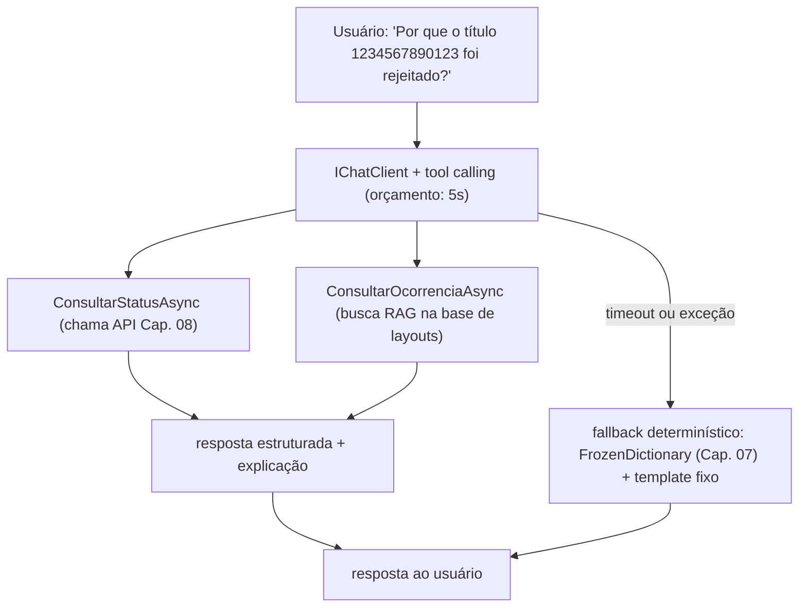

# Capítulo 14 — Integração de IA em .NET

> **Módulo 13 do roteiro.** Pré-requisito: [Capítulo 13](13-empacotamento-deploy-aspire.md).
> **Tempo:** 2 semanas.
> **Entrega:** assistente que classifica e explica códigos de ocorrência, com avaliação automatizada e fallback determinístico.

## Por que este capítulo é o último de propósito

Só vale acoplar um modelo a um sistema que já é observável e testável. Sem os Capítulos 06 e 12, você não teria como saber se o modelo está degradando silenciosamente — e "o modelo às vezes erra" sem instrumentação é exatamente o tipo de falha que passa despercebido até virar reclamação de cliente.

---

## 1. `Microsoft.Extensions.AI`

**Por que isso importa:** este capítulo assume que o leitor já sabe o que é um modelo de linguagem (LLM) de forma geral — o foco aqui é como integrá-lo a um sistema .NET de produção com disciplina (fallback, avaliação, controle de custo), não como LLMs funcionam por dentro.

> 📖 **Conceito: LLM, prompt e `IChatClient`**
> Um **LLM** (Large Language Model, "modelo de linguagem grande") é um modelo de IA treinado para gerar texto, dada uma entrada de texto (o **prompt**). Um provedor (OpenAI, Anthropic, etc.) expõe esse modelo via API HTTP — você envia o prompt, recebe a resposta gerada. `IChatClient` é a interface abstrata que `Microsoft.Extensions.AI` define para conversar com **qualquer** provedor de forma uniforme — o código de negócio (como `ExplicadorDeOcorrencia` abaixo) depende só dessa interface, não de detalhes específicos da OpenAI ou de qualquer outro provedor; trocar de provedor é só uma mudança de configuração no registro do DI (Capítulo 05), sem tocar no código de negócio.

A abstração oficial para cliente de chat, independente de provedor.

> 🐍 **Vindo de outra stack**
> — **Python:** `Microsoft.Extensions.AI` ocupa o espaço que LiteLLM ou a camada de modelos do LangChain ocupam — uma interface só para vários provedores. Semantic Kernel (seção 4) é o análogo mais próximo do LangChain/LlamaIndex completo, com orquestração e memória. Se você vem de Python, note que o ecossistema .NET é bem menor aqui: menos opções, mais integração com a plataforma (DI, `ILogger`, OpenTelemetry funcionam de graça).
> — **Java:** o par natural é Spring AI, que resolve o mesmo problema com a mesma filosofia de abstração sobre provedores. LangChain4j fica no espaço do Semantic Kernel.
> — **Go:** normalmente você chamaria a API HTTP do provedor direto, ou usaria um SDK oficial. A vantagem de `IChatClient` que vale conhecer é o encadeamento de middleware (`UseOpenTelemetry`, cache, retry) sobre o cliente — a mesma ideia de `http.RoundTripper` encadeado, aplicada a chamadas de modelo.

> ⚠️ **Sobre a escolha de modelo e de provedor**
> Os exemplos deste capítulo citam um provedor e um modelo específicos para serem concretos, mas o ponto do `IChatClient` é justamente que essa escolha é **configuração, não código**. Duas consequências:
> — **O modelo.** Modelos são substituídos rápido, e o nome escrito aqui certamente não é o mais atual quando você estiver lendo. Verifique o catálogo do seu provedor em vez de copiar o nome do texto. A suíte de avaliação da seção 7 existe exatamente para tornar essa troca uma decisão medida — rode-a contra o modelo novo antes de adotá-lo, e você vai saber se ele é melhor **para o seu caso**, que é a única pergunta que importa.
> — **O provedor.** Os exemplos usam `Microsoft.Extensions.AI.OpenAI` porque é o pacote com mais material disponível, mas há implementação de `IChatClient` para Azure OpenAI, Anthropic, Amazon Bedrock, Google Gemini e Ollama, além do caminho compatível-com-OpenAI que a seção seguinte usa para o modelo local. O que muda entre eles é o pacote e o registro no DI; `ExplicadorDeOcorrencia` e tudo que vem depois dele não sabem a diferença. O exercício 1 pede que você prove isso trocando o provedor sem tocar na classe — faça-o cedo, porque é a garantia de que a decisão de provedor continua reversível mais tarde.

```bash
dotnet add package Microsoft.Extensions.AI
dotnet add package Microsoft.Extensions.AI.OpenAI
```

```csharp
builder.Services.AddChatClient(sp =>
{
    var client = new OpenAIClient(builder.Configuration["OpenAI:ApiKey"])
        .GetChatClient("gpt-4o-mini")
        .AsIChatClient();

    return client;
})
.UseFunctionInvocation()
.UseLogging()
.UseOpenTelemetry(configure: o => o.EnableSensitiveData = false)   // ver seção 8
.UseDistributedCache();
```

O padrão de pipeline (`Use*`) é o mesmo do `HttpClient` com `DelegatingHandler` — cada camada envolve a próxima. `UseDistributedCache` cacheia resposta para prompt idêntico; `UseOpenTelemetry` instrumenta com o mesmo `ActivitySource` do Capítulo 12.

> 📖 **Conceito: token, janela de contexto e temperatura**
> Os três parâmetros que aparecem no código abaixo e que decidem custo e comportamento.
> Um **token** é o pedaço em que o modelo divide o texto — algo entre uma sílaba e uma palavra curta; em português, conte grosseiramente um token a cada três ou quatro caracteres. É a unidade de cobrança e de limite: você paga por token de entrada **e** de saída, e é por isso que a métrica da seção 8 conta tokens, não chamadas.
> A **janela de contexto** é o total de tokens que cabem numa chamada, somando o que você mandou e o que o modelo vai responder. Ultrapassá-la é erro, não truncamento silencioso — e é o limite real que o RAG da seção 5 contorna, entregando três trechos relevantes em vez do manual inteiro.
> A **temperatura** controla o quanto o modelo se permite variar entre respostas possíveis: perto de `0` ele tende à saída mais provável e mais repetível; mais alto, mais variedade. Para classificar código de ocorrência você quer o mínimo (`0.2` abaixo, ou `0`), porque variedade aqui é só ruído. **Atenção:** temperatura baixa reduz a variação, não a elimina — o exercício 2 existe para você comprovar isso antes de escrever qualquer teste que compare texto exato.

> 📖 **Conceito: alucinação**
> Um LLM gera o texto mais plausível, não o mais verdadeiro — e não tem um mecanismo interno que distinga um do outro. "Alucinação" é o nome dado ao caso em que ele produz algo bem escrito, confiante e factualmente errado: um código de ocorrência que não existe naquele banco, uma explicação inventada para um código real. Note o que isso implica para este domínio: a saída **não pode** ser usada para decidir nada financeiro sem verificação. É a razão de as ferramentas da seção 3 serem somente-leitura, de a seção 5 fixar o contexto a documentos reais, de a seção 7 medir a taxa de acerto em vez de confiar na impressão, e de o projeto exigir um caminho determinístico de fallback. As quatro coisas são a mesma resposta ao mesmo problema.

```csharp
public sealed class ExplicadorDeOcorrencia(IChatClient chat)
{
    public async Task<string> ExplicarAsync(string codigo, CancellationToken ct)
    {
        var resposta = await chat.GetResponseAsync(
            [new ChatMessage(ChatRole.System, PromptSistema),
             new ChatMessage(ChatRole.User, $"Explique o código de ocorrência {codigo}")],
            new ChatOptions { Temperature = 0.2f, MaxOutputTokens = 200 },
            ct);

        return resposta.Text;
    }
}
```

A abstração troca de provedor (OpenAI, Azure OpenAI, Ollama local, Anthropic via provedor compatível) sem mudar o código de negócio — só o registro no DI muda.

**Rodando local com Ollama.** Vale montar isto agora: é o que torna os exercícios deste capítulo gratuitos, e é a prova concreta de que a abstração cumpre o que promete.

```bash
ollama serve              # sobe em http://localhost:11434
ollama pull llama3.2      # qualquer modelo pequeno serve para estudar
```

O caminho com menos peças novas é aproveitar que o Ollama expõe um endpoint **compatível com a API da OpenAI** — então o mesmo cliente do exemplo acima serve, apontando para outra URL:

```csharp
builder.Services.AddChatClient(sp =>
    new OpenAIClient(
            new ApiKeyCredential("ollama"),                  // ignorada pelo Ollama, mas exigida pelo cliente
            new OpenAIClientOptions { Endpoint = new Uri("http://localhost:11434/v1") })
        .GetChatClient("llama3.2")
        .AsIChatClient());
```

Compare este registro com o da OpenAI, logo acima: **mudou a URL e o nome do modelo, e nada mais.** Nenhuma linha de `ExplicadorDeOcorrencia` foi tocada — é exatamente isso que o exercício 1 pede para você demonstrar. Existem também clientes dedicados ao Ollama (como `OllamaSharp`, que expõe `IChatClient` diretamente); o caminho compatível acima é preferível aqui por não introduzir dependência nova.

> ⚠️ **Armadilha**
> Um modelo pequeno local erra bem mais que um modelo grande remoto, especialmente em saída estruturada (seção 2). Isso é ótimo para estudar — a suíte de avaliação da seção 7 vai acusar a diferença com números, e ver o limiar de acerto cair ensina mais do que vê-lo passar. **Só não conclua que seu prompt está ruim** quando o problema é a capacidade do modelo: rode a mesma suíte nos dois antes de ajustar o prompt.

---

## 2. Saída estruturada

Para uso em pipeline, texto livre é frágil. Peça JSON com schema:

```csharp
public sealed record ClassificacaoOcorrencia(
    string Codigo,
    string Categoria,          // "liquidacao" | "rejeicao" | "baixa" | "outro"
    string Explicacao,
    double Confianca);

var resposta = await chat.GetResponseAsync<ClassificacaoOcorrencia>(
    [new ChatMessage(ChatRole.User, $"Classifique a ocorrência {codigo}: {descricaoBanco}")],
    cancellationToken: ct);   // nomeado: o 2º parâmetro posicional é ChatOptions, não o token

var classificacao = resposta.Result;   // já desserializado e validado contra o schema
```

`GetResponseAsync<T>` gera o JSON Schema do tipo automaticamente e instrui o modelo a segui-lo — com providers que suportam "structured output" nativo (OpenAI, por exemplo), a conformidade é garantida pelo próprio provedor, não só por instrução de prompt.

---

## 3. Tool calling com limites de permissão

**Por que isso importa:** um LLM sozinho só sabe o que estava no seu treinamento — ele não consegue, por conta própria, consultar o status de um título específico no seu banco de dados. Tool calling é o mecanismo que permite ao modelo "pedir" para o código rodar uma função específica e usar o resultado na resposta — e, como mostra o resto da seção, isso é também uma superfície de risco de segurança que precisa de limites explícitos.

> 📖 **Conceito: tool calling (function calling)**
> Tool calling é a capacidade de um LLM decidir, durante a geração de uma resposta, que precisa de uma informação externa que não tem, e "chamar" uma função disponibilizada pelo código da aplicação para obtê-la — o modelo não executa a função ele mesmo; ele pede para o `IChatClient` executá-la (com `UseFunctionInvocation()`, visto na seção 1) e recebe o resultado de volta para continuar a resposta. O ponto crítico de segurança, reforçado pelas regras abaixo: o modelo decide **quando** chamar, mas o código continua decidindo **o que** aquela função pode fazer — é por isso que nenhuma ferramenta exposta ao modelo neste capítulo grava dado.

O modelo não deve ter acesso irrestrito ao domínio. Cada função exposta é uma decisão de segurança.

```csharp
[Description("Consulta o status atual de um título pelo nosso número")]
public static async Task<StatusTitulo> ConsultarStatusAsync(
    [Description("O nosso número do título, 13 dígitos")] long nossoNumero,
    IServiceProvider servicos,       // ← resolvido pelo DI, invisível para o modelo
    CancellationToken ct)
{
    // validação própria: o schema prometeu um long, não um nosso número válido
    if (nossoNumero is <= 0 or > 9_999_999_999_999)
        throw new ArgumentOutOfRangeException(nameof(nossoNumero));

    // autorização explícita: o modelo pede, o código decide
    var autbank = servicos.GetRequiredService<AutbankClient>();
    return await autbank.ConsultarAsync(nossoNumero, ct);
}

builder.Services.AddChatClient(...)
    .UseFunctionInvocation();

var opcoes = new ChatOptions
{
    Tools = [AIFunctionFactory.Create(ConsultarStatusAsync)]
};
```

Com o cliente registrado via `AddChatClient(...).UseFunctionInvocation()` (seção 1), o `IServiceProvider` do container chega à invocação da ferramenta automaticamente — não é preciso passá-lo à mão. Preencher `AIFunctionArguments { Services = ... }` explicitamente só é necessário para chamadas construídas fora do DI, como num teste isolado.

> ⚠️ **Armadilha: dependência declarada como parâmetro comum vira parâmetro do modelo**
> `AIFunctionFactory.Create` monta o JSON Schema da ferramenta a partir da **assinatura do método** — e ele não tem como adivinhar que `AutbankClient autbank` era "para o DI preencher". Declarar a dependência como um parâmetro de tipo qualquer faz com que ela entre no schema e o **modelo** passe a ser convidado a preenchê-la, o que é exatamente o contrário do que se queria.
> Dois tipos são tratados de forma especial e **não** aparecem no schema: `IServiceProvider` (resolvido do container, como acima) e `CancellationToken`. Para tudo mais, resolva **dentro** do corpo do método. Confira sempre o schema gerado antes de expor uma ferramenta — se um parâmetro de infraestrutura apareceu lá, o modelo pode inventar um valor para ele.

Regras de desenho, não negociáveis neste domínio:

- **A ferramenta é somente leitura** por padrão. Nenhuma função exposta ao modelo grava, baixa título ou dispara transferência — essas ações continuam exigindo confirmação humana explícita, fora do laço do modelo.
- **Parâmetros são validados de novo dentro da função**, nunca confiando que o modelo gerou um `nossoNumero` válido só porque o schema pedia um `long`.
- **Toda chamada de ferramenta é logada e traçada** com o mesmo `ActivitySource` do Capítulo 12 — "o modelo decidiu consultar X" é um evento auditável como qualquer outro.

```csharp
[Description("Consulta o status atual de um título — NUNCA usar para modificar dados")]
public static async Task<StatusTitulo> ConsultarStatusAsync(long nossoNumero, /* ... */)
{
    using var activity = CnabTelemetria.Fonte.StartActivity("ia.tool.consultar-status");
    activity?.SetTag("cnab.registro.nosso_numero", nossoNumero);
    // ...
}
```

---

## 4. Semantic Kernel: quando vale sobre a abstração base

`Microsoft.Extensions.AI` cobre chat simples e tool calling direto. **Semantic Kernel** vale quando você precisa de:

- **Planners** — o modelo decide a sequência de funções a chamar para atingir um objetivo, não uma chamada única.
- **Plugins** reutilizáveis entre múltiplos agentes.
- **Orquestração multi-agente** — vários chat clients especializados colaborando.

```csharp
var kernel = Kernel.CreateBuilder()
    .AddOpenAIChatCompletion("gpt-4o-mini", apiKey)
    .Build();

kernel.Plugins.AddFromType<PluginDeOcorrencias>();

var resultado = await kernel.InvokePromptAsync(
    "Investigue por que o título {{$nossoNumero}} foi rejeitado e sugira a ação corretiva",
    new KernelArguments { ["nossoNumero"] = "1234567890123" });
```

Para o assistente deste capítulo — classificar e explicar, uma chamada por vez — Semantic Kernel é peso desnecessário. `Microsoft.Extensions.AI` sozinho resolve. Guarde Semantic Kernel para quando o requisito realmente envolver planejamento multi-passo.

---

## 5. Embeddings e RAG sobre documentação interna

**Por que isso importa:** um LLM não conhece a documentação interna da sua empresa — ela nunca esteve no treinamento dele. RAG é a técnica padrão para "ensinar" o modelo sobre um conteúdo específico sem precisar retreiná-lo: você busca o trecho relevante e o entrega como parte do prompt.

> 📖 **Conceito: janela de contexto, de novo — e por que o RAG existe**
> Se a janela de contexto (seção 1) coubesse o manual inteiro de todos os bancos, bastaria colá-lo em todo prompt. Não cabe, e mesmo quando cabe sai caro (você paga por token de entrada em **toda** chamada) e funciona pior — modelos erram mais quando o dado relevante está enterrado em muito texto irrelevante. RAG é a resposta a essa restrição: buscar os poucos trechos que importam e mandar só eles.

> 📖 **Conceito: embedding e RAG**
> Um **embedding** é uma representação numérica (um vetor de números) do significado de um texto, gerada por um modelo especializado — textos com significado parecido produzem vetores numericamente próximos entre si. Isso permite busca **semântica**: em vez de buscar por palavra-chave exata, você busca por "textos com significado parecido a esta pergunta", comparando vetores. **RAG** (Retrieval-Augmented Generation, "geração aumentada por busca") é o padrão de: 1) transformar a pergunta do usuário num embedding, 2) buscar num banco de documentos (o **vector store**, aqui pgvector sobre o Postgres já usado desde o Capítulo 07) os textos mais próximos semanticamente, 3) entregar esses textos como contexto para o LLM responder, em vez de depender só do que o modelo "sabe" de treinamento.

Para responder "o que significa a ocorrência 47 do Bradesco?" quando a resposta está espalhada em manuais de layout PDF internos:

```csharp
builder.Services.AddEmbeddingGenerator(sp =>
    new OpenAIClient(apiKey).GetEmbeddingClient("text-embedding-3-small").AsIEmbeddingGenerator());

builder.Services.AddVectorStore<int, DocumentoOcorrencia>(sp =>
    new PostgresVectorStore(builder.Configuration.GetConnectionString("Default")!));   // pgvector
```

```csharp
public sealed class DocumentoOcorrencia
{
    [VectorStoreKey] public int Id { get; set; }
    [VectorStoreData] public required string Texto { get; set; }
    [VectorStoreData] public required string Banco { get; set; }
    [VectorStoreVector(1536)] public ReadOnlyMemory<float> Embedding { get; set; }
}

public async Task<string> ResponderAsync(string pergunta, CancellationToken ct)
{
    var embeddingPergunta = await _gerador.GenerateVectorAsync(pergunta, cancellationToken: ct);

    var relevantes = await _store.SearchAsync(embeddingPergunta, top: 3, cancellationToken: ct);
    var contexto = string.Join("\n---\n", relevantes.Select(r => r.Record.Texto));

    var resposta = await _chat.GetResponseAsync(
        [new ChatMessage(ChatRole.System, $"Responda usando apenas este contexto:\n{contexto}"),
         new ChatMessage(ChatRole.User, pergunta)], cancellationToken: ct);

    return resposta.Text;
}
```

O Postgres já está na stack desde o Capítulo 07 — **pgvector** evita introduzir um banco vetorial dedicado só para isso, e mantém a busca semântica na mesma transação/backup/observabilidade do resto do sistema.

O `"Responda usando apenas este contexto"` no prompt de sistema não é garantia — é redução de risco. A avaliação da seção 7 é o que efetivamente mede se o modelo está inventando fora do contexto fornecido.

---

## 6. MCP em C#

O mesmo protocolo que este próprio ambiente de chat usa para se conectar a ferramentas externas pode ser consumido — e exposto — pelo seu sistema.

### 6.1 Consumir um servidor MCP

```csharp
var mcpClient = await McpClientFactory.CreateAsync(
    new StdioClientTransport(new() { Command = "npx", Arguments = ["-y", "@modelcontextprotocol/server-filesystem", "/dados"] }));

var ferramentas = await mcpClient.ListToolsAsync();
var opcoes = new ChatOptions { Tools = [.. ferramentas] };   // as tools do MCP viram ChatOptions.Tools direto
```

### 6.2 Expor o próprio sistema como servidor MCP

```csharp
builder.Services.AddMcpServer()
    .WithStdioServerTransport()
    .WithTools<FerramentasDeCobranca>();

[McpServerToolType]
public static class FerramentasDeCobranca
{
    [McpServerTool, Description("Consulta o resumo de um lote processado")]
    public static async Task<string> ConsultarLoteAsync(
        [Description("Id do lote")] long id, IRepositorioLote repo, CancellationToken ct)
    {
        var lote = await repo.ObterAsync(id, ct);
        return JsonSerializer.Serialize(lote);
    }
}
```

Isso permite que qualquer cliente MCP — inclusive outra instância de assistente, inclusive uma ferramenta de terceiros — consulte a plataforma de cobrança pela API MCP, com o mesmo controle de acesso e auditoria de qualquer outra superfície do sistema (Capítulo 09).

---

## 7. Avaliação: a parte que o roteiro exige e ninguém pula por acaso

**Por que isso importa:** um teste tradicional (Capítulo 06) compara um resultado contra um valor esperado exato — mas a resposta de um LLM varia a cada chamada, mesmo para a mesma pergunta. "Avaliação" é a adaptação da disciplina de teste automatizado para esse mundo não-determinístico: medir uma taxa de acerto sobre muitos casos, em vez de esperar um resultado idêntico sempre.

Sem avaliação automatizada, "o modelo funciona" é uma impressão, não um fato — e é o tipo de afirmação que se desfaz no primeiro incidente.

```bash
dotnet add package Microsoft.Extensions.AI.Evaluation
dotnet add package Microsoft.Extensions.AI.Evaluation.Reporting
```

```csharp
public sealed class CasoDeTeste
{
    public required string Codigo { get; init; }
    public required string CategoriaEsperada { get; init; }
}

// casos rotulados por humano, versionados no repositório
private static readonly CasoDeTeste[] Casos =
[
    new() { Codigo = "06", CategoriaEsperada = "liquidacao" },
    new() { Codigo = "03", CategoriaEsperada = "rejeicao" },
    new() { Codigo = "09", CategoriaEsperada = "baixa" },
    // ... dezenas de casos, incluindo os ambíguos de propósito
];

[Fact]
public async Task Classificacao_atinge_limiar_minimo()
{
    var acertos = 0;
    foreach (var caso in Casos)
    {
        var resultado = await _classificador.ClassificarAsync(caso.Codigo, TestContext.Current.CancellationToken);
        if (resultado.Categoria == caso.CategoriaEsperada) acertos++;
    }

    var taxa = (double)acertos / Casos.Length;
    taxa.ShouldBeGreaterThanOrEqualTo(0.90);   // ← limiar mínimo do critério de aceite
}
```

### 7.1 Avaliadores qualitativos

Para a qualidade da explicação em texto livre, não só a categoria:

```csharp
var avaliador = new RelevanceTruthAndCompletenessEvaluator(chatClient);

var resultado = await avaliador.EvaluateAsync(
    new ChatMessage(ChatRole.User, $"Explique a ocorrência {codigo}"),
    new ChatResponse([new ChatMessage(ChatRole.Assistant, explicacaoGerada)]),
    ct);

resultado.Get<NumericMetric>("Relevance").Value.ShouldBeGreaterThanOrEqualTo(4);   // escala 1-5
```

Isso usa um segundo modelo como juiz — padrão aceito na indústria (LLM-as-judge), mas com uma ressalva importante: **o avaliador tem seu próprio custo, latência e taxa de erro.** Trate-o como parte do pipeline de CI, não como verdade absoluta — combine com os casos rotulados por humano da seção anterior, nunca substitua um pelo outro.

### 7.2 Testes de regressão de prompt

```csharp
[Fact]
public async Task Prompt_atualizado_nao_regride_nos_casos_ja_resolvidos()
{
    var relatorioAnterior = await CarregarUltimoRelatorioAsync();
    var relatorioAtual = await RodarSuiteDeAvaliacaoAsync();

    var regressoes = relatorioAtual.Casos
        .Where(c => c.Passou == false && relatorioAnterior.Casos.Single(a => a.Id == c.Id).Passou)
        .ToList();

    regressoes.ShouldBeEmpty($"Regressão em: {string.Join(", ", regressoes.Select(r => r.Id))}");
}
```

Guarde os relatórios de avaliação como artefato do CI, versionados por commit — o mesmo espírito do snapshot testing do Capítulo 06, aplicado a comportamento de modelo em vez de layout de arquivo.

---

## 8. Custo, cache e telemetria de chamadas

```csharp
.UseOpenTelemetry(configure: o => o.EnableSensitiveData = builder.Environment.IsDevelopment())
```

`EnableSensitiveData` controla se prompt e resposta completos vão para o trace. Em produção, **desligado** por padrão — reaplique o raciocínio do Capítulo 09: um nome de sacado que entra no prompt não deve sair carimbado num span de observabilidade.

```csharp
private static readonly Counter<long> ChamadasIA =
    CnabTelemetria.Medidor.CreateCounter<long>("cnab.ia.chamadas");
private static readonly Histogram<long> TokensConsumidos =
    CnabTelemetria.Medidor.CreateHistogram<long>("cnab.ia.tokens", unit: "tokens");

ChamadasIA.Add(1, new TagList { { "cnab.ia.modelo", "gpt-4o-mini" }, { "cnab.ia.resultado", "sucesso" } });
TokensConsumidos.Record(resposta.Usage?.TotalTokenCount ?? 0);
```

Métrica de tokens por chamada é o que transforma "a conta da API subiu" de surpresa em algo visível no mesmo dashboard do Capítulo 12, com a mesma disciplina de cardinalidade controlada.

---

## 9. ML.NET para classificação local

Quando o custo ou a latência de rede de um LLM não se justificam para uma classificação simples e bem definida (por exemplo, um classificador binário "requer atenção humana / segue fluxo automático" sobre um conjunto fechado de sinais numéricos), **ML.NET treina um modelo pequeno que roda no próprio processo**, sem chamada de rede:

```csharp
var contexto = new MLContext(seed: 42);
var dados = contexto.Data.LoadFromEnumerable(exemplosRotulados);

var pipeline = contexto.Transforms.Concatenate("Features",
        nameof(ExemploOcorrencia.DiasAtraso), nameof(ExemploOcorrencia.ValorNormalizado))
    .Append(contexto.BinaryClassification.Trainers.FastTree());

var modelo = pipeline.Fit(dados);
contexto.Model.Save(modelo, dados.Schema, "modelo-triagem.zip");
```

```csharp
var motor = contexto.Model.CreatePredictionEngine<ExemploOcorrencia, PredicaoTriagem>(modelo);
var predicao = motor.Predict(novaOcorrencia);   // microssegundos, sem rede
```

**A ressalva do próprio roteiro é a correta: elimina a latência de rede, não o custo de inferência — que precisa ser medido.** Treinar, validar e manter um modelo próprio tem custo de engenharia e de dados rotulados que um LLM genérico não exige. A decisão entre os dois é a mesma do Capítulo 10 entre AOT e JIT: meça, não assuma.

---

## 10. Exercícios

Estes custam dinheiro de verdade (tokens). Duas formas de reduzir isso a quase zero enquanto estuda: use um modelo pequeno e barato para todos os exercícios, ou rode um modelo local com Ollama — `IChatClient` abstrai os dois, e trocar entre eles é exatamente o que o exercício 1 pede.

1. **Trocar o provedor sem tocar no código.** Escreva um `ExplicadorDeOcorrencia` que dependa **só** de `IChatClient`. Faça-o funcionar com um provedor remoto e depois com um modelo local via Ollama, mudando **apenas o registro no DI**. Se você precisou alterar uma linha da classe de negócio, a abstração vazou — conserte antes de seguir. Este é o argumento inteiro da seção 1.

2. **Não-determinismo, medido.** Faça a mesma pergunta 20 vezes e guarde as respostas. Conte quantas são literalmente idênticas. Agora baixe a temperatura para 0 e repita. Mesmo assim, é provável que algumas variem. **Esta é a observação que justifica o capítulo 7 inteiro:** você não pode testar isso com `ShouldBe("texto exato")`.

3. **Saída estruturada.** Peça a classificação como texto livre e escreva o código que extrai a categoria da resposta. Depois use saída estruturada (seção 2) e compare. Rode os dois 30 vezes e conte quantas vezes cada abordagem falhou em produzir algo parseável. O número costuma ser convincente.

4. **A suíte de avaliação** *(o exercício central)*. Monte 30 casos rotulados à mão, incluindo pelo menos 5 deliberadamente ambíguos. Rode a avaliação e anote a taxa de acerto. Agora altere **uma frase** do prompt de sistema e rode de novo. Você provavelmente vai ver casos melhorarem e outros piorarem ao mesmo tempo — e é essa a razão de o critério de aceite exigir a suíte no CI.

5. **Regressão pega no flagrante.** A partir do exercício 4, guarde o relatório. Faça uma alteração de prompt que melhore a taxa **global** mas quebre um caso que antes passava. Confirme que o teste da seção 7.2 falha, mesmo com a média tendo subido. Média melhor com regressão pontual é o padrão de falha mais comum em ajuste de prompt.

6. **O juiz complacente.** Gere de propósito uma explicação **fluente e factualmente errada** para um código de ocorrência, e submeta-a ao avaliador `Relevance`. Veja que nota ele dá. Compare com o que um humano daria. Este é o limite do LLM-as-judge que a seção 7.1 adverte — e vê-lo acontecer vale mais do que a advertência.

7. **Fallback exercitado de verdade.** Aponte o `IChatClient` para uma URL inválida e confirme que `ExplicarAsync` **ainda responde**, pelo caminho determinístico, dentro do orçamento de 5 segundos. Depois meça: quanto tempo a resposta de fallback leva? Se passar de um segundo, seu `CancelAfter` não está cortando onde você acha. É a primeira armadilha do projeto.

8. **Ferramenta que não deveria existir.** Exponha ao modelo uma ferramenta fictícia `AtualizarStatusAsync` (que só loga, sem gravar nada de verdade) e formule uma pergunta que induza o modelo a chamá-la. Confirme nos logs que ele chamou. Agora remova-a. Este exercício existe para que "nunca exponha ferramenta de escrita" deixe de ser uma regra abstrata.

9. **Custo visível.** Instrumente `cnab.ia.chamadas` e `cnab.ia.tokens` e rode a suíte de avaliação inteira. Olhe no dashboard do Capítulo 12 quantos tokens ela consumiu e calcule o custo. Multiplique por "uma vez a cada PR, 20 PRs por semana". Esse número é o que decide se a sua suíte de avaliação é sustentável ou se precisa ser amostrada.

10. **Prompt vazando dado sensível.** Monte um prompt que inclua o nome do sacado e ligue `EnableSensitiveData`. Confirme no trace que o nome aparece em texto puro. Desligue e confirme que sumiu. Depois rode o teste de vazamento do Capítulo 09 adaptado para spans — o critério de aceite exige isso, e é o mesmo raciocínio aplicado a uma superfície nova.

11. **Determinístico ganha** *(o exercício mais importante de julgamento)*. Implemente a classificação de códigos de ocorrência **sem IA nenhuma**: só o `FrozenDictionary` do Capítulo 07 (seção 7). Meça a taxa de acerto, a latência e o custo dessa versão contra a versão com LLM. Para um conjunto fechado e conhecido de códigos, a tabela vai ganhar nos três critérios. Escreva, com esses números, **em que ponto exatamente** o LLM passa a se justificar — a resposta envolve texto livre e casos não previstos, não classificação de código fechado. Saber quando *não* usar IA é o que este capítulo mais quer ensinar.

---

## 📦 Projeto: assistente de ocorrências

### Enunciado

Classificar códigos de ocorrência de retorno e explicá-los em português, com tool calling consultando a API do Capítulo 08.



O caminho de fallback não é um ramo secundário desenhado por completude — é o que garante que `Z` (a resposta final) sempre é alcançado, mesmo quando `C` falha inteiramente.

### O caminho de fallback — o requisito que faz este projeto valer

```csharp
public sealed class AssistenteDeOcorrencias(
    IChatClient chat, ITabelaOcorrenciasDeterministica tabela,
    ILogger<AssistenteDeOcorrencias> logger)
{
    public async Task<string> ExplicarAsync(string codigo, CancellationToken ct)
    {
        using var cts = CancellationTokenSource.CreateLinkedTokenSource(ct);
        cts.CancelAfter(TimeSpan.FromSeconds(5));      // orçamento curto: isto é caminho crítico de suporte

        try
        {
            var resposta = await chat.GetResponseAsync(MontarPrompt(codigo), cancellationToken: cts.Token);
            return resposta.Text;
        }
        // o chamador desistiu (requisição abortada, shutdown): NÃO é caso de fallback
        catch (OperationCanceledException) when (ct.IsCancellationRequested)
        {
            throw;
        }
        // estourou o orçamento de 5 s, ou a IA falhou: aí sim, fallback
        catch (Exception ex) when (ex is OperationCanceledException or HttpRequestException)
        {
            logger.LogWarning(ex, "IA indisponível para código {Codigo}; usando fallback", codigo);
            CnabMetricas.RegistrarFallbackDeIA(codigo);
            return tabela.ExplicacaoFixa(codigo);        // sempre responde algo, sempre determinístico
        }
    }
}
```

A ordem dos dois `catch` é o detalhe que faz isso funcionar, e é o mesmo padrão do Capítulo 03 (seção 3): com um token ligado, **timeout e cancelamento do chamador chegam como a mesma exceção**, e a única forma de distingui-los é perguntar a `ct.IsCancellationRequested`. Sem o primeiro `catch`, um cliente que fecha a conexão faz o sistema gastar trabalho montando uma resposta de fallback que ninguém vai ler — e, pior, esconde no log um cancelamento como se fosse indisponibilidade da IA, poluindo justamente a métrica que você usaria para decidir trocar de provedor.

O fallback não é um "melhor esforço" vago — é a **tabela de ocorrências `FrozenDictionary`** que já existe desde o Capítulo 07 (seção 7), com um texto fixo por código. Ela nunca falha, nunca alucina, e é o que garante que uma indisponibilidade de API externa de IA não vira indisponibilidade de suporte ao cliente.

### ✅ Critério de aceite

- [ ] **Suíte de avaliação com casos rotulados e limiar mínimo de acerto no CI** — pelo menos 90% de acerto de categoria nos casos rotulados, rodando a cada PR que toque o prompt ou o modelo.
- [ ] **Caminho determinístico de fallback quando o modelo falha ou demora**, testado explicitamente: simule timeout e indisponibilidade e confirme que a resposta ainda chega, do fallback.
- [ ] Nenhuma função exposta ao modelo grava dado — auditoria de cada `[Description]` de ferramenta confirmando "somente leitura".
- [ ] Chamada de ferramenta pelo modelo é logada e aparece no trace do Capítulo 12, com o mesmo `ActivitySource`.
- [ ] `EnableSensitiveData` desligado em produção — nenhum nome de sacado no span.
- [ ] Métricas de chamadas e tokens visíveis no dashboard, com as mesmas regras de cardinalidade do Capítulo 12.
- [ ] Relatório de avaliação versionado por commit; PR que regride falha o CI.
- [ ] Orçamento de tempo do caminho de IA é curto e explícito — o fallback nunca deixa o usuário esperando mais que alguns segundos.

### Armadilhas deste projeto

- **Tratar o fallback como código morto** que só existe para passar no critério de aceite. Ele precisa ser exercitado de verdade: derrube a API do modelo (aponte para uma URL inválida) e confirme que o sistema continua respondendo.
- **Ferramenta de escrita exposta "só para facilitar"**: uma função `AtualizarStatusAsync` chamável pelo modelo é a porta para o modelo tomar uma ação financeira sem revisão humana. Nunca.
- **Prompt de sistema mudado sem rodar a suíte de avaliação**: um ajuste de uma linha pode melhorar um caso e quebrar dez outros — é exatamente o que o teste de regressão da seção 7.2 existe para pegar.
- **Confiar só no avaliador LLM-as-judge**: ele também erra, e tende a ser complacente com respostas fluentes e erradas. Os casos rotulados por humano são o piso; o avaliador automático é um complemento, não substituto.

---

## Checklist de saída

- [ ] Sei quando `Microsoft.Extensions.AI` sozinho basta e quando Semantic Kernel se justifica.
- [ ] Nunca exponho ao modelo uma ferramenta que grava dado sem revisão humana.
- [ ] Toda chamada a modelo tem timeout curto e caminho de fallback testado.
- [ ] Tenho suíte de avaliação com limiar mínimo, rodando no CI, com relatório versionado.
- [ ] Trato dado sensível em prompt e trace com o mesmo rigor do Capítulo 09.
- [ ] Sei justificar, com medição, quando ML.NET local vale mais que chamar um LLM.

## Para ir além

- `learn.microsoft.com/dotnet/ai/`
- Semantic Kernel — `learn.microsoft.com/semantic-kernel/`
- Model Context Protocol — `modelcontextprotocol.io`
- Microsoft.Extensions.AI.Evaluation — `learn.microsoft.com/dotnet/ai/microsoft-extensions-ai-evaluation`
- ML.NET — `learn.microsoft.com/dotnet/machine-learning/`
- pgvector — `github.com/pgvector/pgvector`

➡️ **Próximo:** [Capítulo 15 — Capstone](15-capstone.md)
