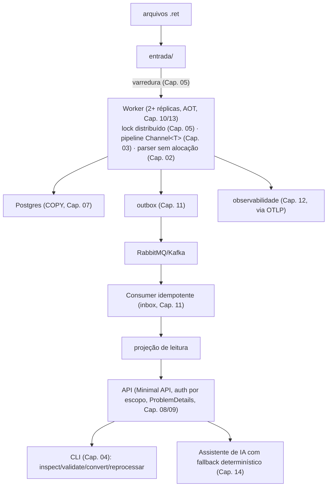

# Capítulo 15 — Capstone: plataforma de processamento de arquivos

> **Pré-requisito:** todos os capítulos anteriores, com os projetos entregues e medidos.
> **Tempo:** 6 a 8 semanas.
> **Entrega:** uma plataforma, não quinze projetos soltos.

## O que muda aqui

**Por que isso importa:** nenhum conceito novo aparece neste capítulo — se algo aqui parecer não-familiar, é sinal de voltar ao capítulo de origem (a tabela abaixo diz qual) antes de seguir, não de que o capstone introduziu algo do nada. O trabalho daqui em diante é outro tipo de trabalho: não aprender uma peça nova, mas fazer peças já conhecidas conviverem sob as mesmas condições difíceis (carga real, falha real) ao mesmo tempo.

Até agora cada capítulo entregou uma peça isolada, com critério de aceite próprio. O capstone junta os quinze projetos numa plataforma que recebe arquivos, processa, publica eventos, expõe consulta e se explica sozinha. Não é revisão — é **integração**: as peças que funcionavam sozinhas precisam funcionar sob carga, juntas, com falha injetada de propósito.

Se algum capítulo anterior ficou com critério de aceite incompleto, resolva antes de começar. O capstone amplifica qualquer dívida deixada para trás.

---

## Pré-voo: você está pronto para começar?

Antes da semana 1, percorra esta lista. Cada item é a entrega mínima de um capítulo — se algum não estiver marcado, **volte àquele capítulo antes de seguir**. Isto leva uma tarde e economiza semanas: a integração amplifica dívida, e descobrir na semana 5 que o parser nunca tratou registro partido entre blocos é muito mais caro do que descobrir agora.

- [ ] **Cap. 00** — a versão ingênua do parser ainda existe e roda; o tempo e o pico de memória dela estão anotados. É a linha de base contra a qual o Capítulo 02 mediu — sem ela, metade das tabelas do curso perde o denominador.
- [ ] **Cap. 01** — `dotnet build` do repositório inteiro passa com **zero warning**, com `TreatWarningsAsErrors` ligado, e nenhuma versão de pacote fora do `Directory.Packages.props`.
- [ ] **Cap. 02** — o parser processa um arquivo grande com memória estável, e você **tem a tabela de benchmark** comparando com a versão ingênua. O número está anotado, não lembrado.
- [ ] **Cap. 03** — o pipeline tem backpressure comprovada, cancelamento se propaga em menos de um segundo, e nada se perde nem duplica em 50 execuções.
- [ ] **Cap. 04** — a CLI respeita o contrato Unix: exit codes corretos, `--json` consumível por `jq`, nenhuma sequência ANSI quando redirecionada.
- [ ] **Cap. 05** — `docker stop` no meio do lote termina o registro em andamento, libera o lock e sai com código 0. Duas réplicas nunca pegam o mesmo arquivo.
- [ ] **Cap. 06** — a suíte passa 20 vezes seguidas sem falha intermitente, e o `docs/bugs-encontrados.md` tem pelo menos uma entrada real.
- [ ] **Cap. 07** — reprocessar o mesmo arquivo não duplica linha, e o índice único segura mesmo com o curto-circuito de hash desligado.
- [ ] **Cap. 08** — todo erro sai como `ProblemDetails`, nenhum endpoint devolve entidade do EF, e o OpenAPI está versionado no Git.
- [ ] **Cap. 09** — o teste de vazamento de log passa, cobrindo caminho feliz **e** caminho de erro. `FallbackPolicy` está ligado.
- [ ] **Cap. 10** — você tem a tabela antes/depois de AOT com os quatro números, e um ADR sobre o que não foi migrado.
- [ ] **Cap. 11** — derrubar o broker no meio do lote não perde evento, e o consumidor é idempotente por índice único (não por checagem otimista).
- [ ] **Cap. 12** — você acha a causa de uma linha rejeitada em menos de um minuto, usando só o trace.
- [ ] **Cap. 13** — `kubectl delete pod` não perde registro, e o `terminationGracePeriodSeconds` é comprovadamente maior que o `ShutdownTimeout`.
- [ ] **Cap. 14** *(opcional)* — o fallback determinístico responde quando a IA está fora, e a suíte de avaliação roda no CI.

> **Se você marcou menos de onze itens**, o capstone provavelmente vai virar um retrabalho dos capítulos pendentes em vez de um exercício de integração — que é o que ele deveria ser. Fechar as pendências primeiro é mais rápido, mesmo parecendo um desvio.

---

## Componentes e de onde vêm

| Componente | Capítulos de origem |
|------------|---------------------|
| CLI operacional (inspecionar, revalidar, reprocessar) | 00, 04 |
| Worker em binário nativo (ou ReadyToRun documentado), em container | 02, 03, 05, 10, 13 |
| API de consulta autenticada, com OpenAPI | 07, 08, 09 |
| Mensageria com outbox e consumidor idempotente | 11 |
| Observabilidade ponta a ponta | 12 |
| Camada de classificação por IA, opcional e com fallback | 14 |
| Fundação, testes e CI em tudo acima | 01, 06 |

Nada aqui é código novo do zero. É a costura entre o que já existe — e a costura é onde a maioria dos problemas reais mora.

---

## Arquitetura de referência



---

## Como abordar as oito semanas

Não tente ligar tudo de uma vez. A sequência que funciona:

**Semanas 1–2 — esqueleto ponta a ponta com o caminho feliz.** Um arquivo pequeno, sem falha injetada, atravessando do diretório de entrada até a consulta na API, com trace único visível no Aspire. Nenhuma otimização, nenhuma resiliência ainda — só a fiação toda conectada. Esse é o momento de descobrir incompatibilidade de versão de pacote, configuração que um capítulo assumia e outro não documentou, DTO que não bate entre o worker e a API.

**Semanas 3–4 — escala.** Arquivo de um milhão de registros. É aqui que o parser do Capítulo 02, o pipeline do Capítulo 03 e o `COPY` do Capítulo 07 são testados juntos pela primeira vez — cada um foi medido isoladamente, mas a composição pode revelar um gargalo novo (por exemplo, o `Channel` entre parse e persistência virando o novo limitador, mesmo que cada lado sozinho fosse rápido).

**Semanas 5–6 — falha injetada.** `kubectl delete pod` no meio do lote, broker fora do ar, banco lento, segredo rotacionado, réplica duplicada. Cada teste do critério de aceite abaixo, um de cada vez, isoladamente, com o resto do sistema saudável.

**Semana 7 — falha combinada.** Duas ou três falhas ao mesmo tempo: broker fora **e** pod morto no meio do lote. É o teste que mais se parece com um incidente real, e o que mais frequentemente encontra suposição implícita que nenhum capítulo testou isoladamente.

**Semana 8 — README e ADRs.** Documentar as decisões e os números. Não é burocracia de fim de curso — é o artefato que, seis meses depois, explica por que o sistema é como é.

---

## ✅ Critérios de aceite

### Processa um milhão de registros com uso de memória estável entre lotes

Rode três arquivos de um milhão de registros em sequência, sem restart do worker entre eles. Colete `dotnet-counters` (Capítulo 10) durante os três. O pico de memória do terceiro arquivo deve ser comparável ao do primeiro — não crescente. Memória crescente entre lotes é vazamento, e o capstone é onde ele aparece, porque nenhum projeto de capítulo isolado rodava três arquivos seguidos.

### Reprocessar o mesmo arquivo é idempotente, provado por teste

A combinação das três camadas do Capítulo 07 (hash do conteúdo, índice único, upsert) precisa segurar mesmo quando o reprocessamento acontece **via um caminho diferente** do original — por exemplo, arquivo processado pela varredura automática do worker, depois reprocessado manualmente via `cnab reprocessar` (CLI, Capítulo 04). Os dois caminhos precisam convergir para o mesmo resultado idempotente.

### Matar o pod no meio do lote não perde nem duplica registro

Este é o teste do Capítulo 05 e do Capítulo 13, agora sob o pipeline completo com persistência e outbox real — não um mock. `kubectl delete pod` durante o processamento de um arquivo de um milhão de linhas; confira depois que a contagem de registros bate e que nenhum evento duplicado chegou à projeção de leitura.

### Um único trace cobre da ingestão à consulta

Retomando a ressalva honesta do Capítulo 12: o trace cobre **uma operação**, não a vida inteira da entidade. O critério de aceite aqui é que, dado um arquivo processado, seja possível — usando a tag de correlação de negócio (`cnab.arquivo.hash` ou `cnab.lote.id`) — encontrar em menos de um minuto: o span de ingestão, o span de cada estágio do pipeline, o span de publicação do evento, o span do consumidor, e a métrica de que a API depois serviu uma consulta sobre aquele lote.

### Worker nativo, imagem abaixo de 100 MB, startup abaixo de 100 ms

Os mesmos números do Capítulo 10, agora medidos na imagem final do Capítulo 13, publicada pelo pipeline de CI — não num build local. A diferença importa: o ambiente de build do CI pode ter uma versão de toolchain ligeiramente diferente, e é o número do CI que vale.

**Sobre "nativo", com a ressalva do Capítulo 10 (seção 4.4).** O worker carrega EF Core, Npgsql, MassTransit e OpenTelemetry, e o curso foi desenhado desde o começo para tornar o AOT viável apesar disso — `JsonSerializerContext` em vez de reflection (Cap. 04 e 10), registro explícito no DI em vez de varredura de assembly (Cap. 05), modelo compilado do EF (Cap. 10). Se, mesmo assim, uma dependência sua bloquear a migração, **este critério aceita `PublishReadyToRun` no lugar do AOT**, sob duas condições: um ADR nomeando a dependência bloqueante e a alternativa considerada, e a tabela de quatro colunas do Capítulo 10 medida nas duas configurações. O limite de 100 MB continua valendo nos dois caminhos — com ReadyToRun ele é mais apertado, e chegar lá exige `runtime-deps` em vez de `aspnet` como base (Cap. 13, seção 1.2).
O que este critério **não** aceita é ficar em JIT puro por inércia, sem tabela e sem ADR. A decisão é sua; a medição é obrigatória.

### Suíte completa, com Testcontainers, roda no CI em menos de cinco minutos

A soma de tudo que os Capítulos 06 e 11 testavam separadamente, rodando junta. Se passar de cinco minutos, a resposta quase nunca é "computador mais rápido" — é paralelizar por projeto de teste (`dotnet test` em paralelo por assembly) e confirmar que containers são compartilhados por coleção, não recriados por teste.

### Nenhum dado sensível aparece em log

O teste do Capítulo 09 — inspecionar a saída do logger — repetido contra o sistema integrado, incluindo agora os logs do consumidor de eventos (Capítulo 11) e os spans do assistente de IA (Capítulo 14), que são as duas superfícies novas que não existiam quando o teste original foi escrito.

### Score de mutação acima de 70% no núcleo de parsing

O mesmo número do Capítulo 06, confirmando que ele não regrediu com as mudanças feitas nos capítulos seguintes — é comum que otimização de performance (Capítulo 10) introduza um caminho de código que os testes de mutação originais não cobriam.

### README registra as decisões de arquitetura e os números medidos em cada módulo

Não uma lista de features. Uma tabela com, no mínimo:

```markdown
| Decisão | Alternativas consideradas | Por que esta | Número que sustenta |
|---------|---------------------------|--------------|----------------------|
| Parser sem alocação (Cap. 02) | Substring ingênuo | 8x mais rápido, alocação -99% | ver benchmarks/ |
| RabbitMQ para eventos (Cap. 11) | Kafka | volume não justifica a complexidade operacional | — |
| Postgres para vetores (Cap. 14) | banco vetorial dedicado | reaproveita infra existente | — |
| Native AOT no worker (Cap. 10/13) | JIT + ReadyToRun | imagem 6x menor, startup 15x mais rápido | tabela do Cap. 10 |
```

Cada linha remete a um ADR em `docs/adr/` com o raciocínio completo. O README é o índice; o ADR é o conteúdo.

---

## O que avaliar em si mesmo ao terminar

Estas perguntas não têm resposta certa — servem para checar se o curso realmente mudou como você projeta sistema, não só o que você sabe nomear.

1. **Se um requisito novo chegasse amanhã** — digamos, suportar um layout CNAB 400 além do 240 — quantos capítulos você tocaria? Se a resposta for "quase todos", o design não isolou bem as responsabilidades; revise onde o acoplamento se formou.

2. **Você consegue explicar, sem abrir código, por que cada peça está onde está?** Por que o parser é `struct` e não `class`. Por que o outbox existe. Por que a liveness não verifica o banco. Se alguma resposta for "porque o curso mandou", releia o capítulo correspondente — a intenção era o raciocínio, não a receita.

3. **Qual das quinze entregas você mais confiaria em produção sem supervisão, e qual menos?** Uma resposta honesta aqui vale mais que qualquer nota.

4. **Onde você mediu e onde você assumiu?** Volte aos READMEs de cada capítulo. Todo número que deveria estar lá está mesmo lá, ou algum "meça" virou promessa não cumprida?

---

## Checklist de saída

Diferente dos capítulos anteriores, estes itens não são sobre saber uma técnica — são sobre o que o sistema integrado demonstra, e sobre o que você passou a conseguir fazer.

- [ ] Um arquivo atravessa entrada → worker → Postgres → outbox → broker → consumidor → projeção → API, e eu consigo seguir esse caminho inteiro num dashboard.
- [ ] Três arquivos de um milhão de registros em sequência mantêm memória estável — eu **medi**, não deduzi.
- [ ] Matei o pod no meio do lote e a contagem final bate exatamente. Repeti três vezes.
- [ ] Derrubei broker e pod ao mesmo tempo e o sistema convergiu sozinho, sem intervenção manual.
- [ ] Todo número afirmado no meu README tem um comando que o reproduz.
- [ ] Cada decisão de arquitetura não-óbvia tem um ADR com as alternativas que eu **realmente** considerei.
- [ ] Sei apontar, no meu próprio sistema, qual é hoje o gargalo — e tenho a medição que sustenta a resposta.
- [ ] Sei apontar a parte que menos confiaria em produção, e por quê.
- [ ] Consigo explicar qualquer peça do sistema a outra pessoa sem dizer "porque o curso mandou".

---

## Depois do capstone

O curso termina, o sistema não precisa terminar. Direções honestas para continuar, sem roteiro prescrito:

- **Multi-tenancy de verdade** — o capstone provavelmente tratou tenant como um campo a mais; torná-lo uma fronteira de isolamento real (schema por tenant, ou banco por tenant) é um projeto por si só.
- **Um segundo banco emissor**, com layout diferente, testando se a abstração do Capítulo 02 realmente generaliza ou se foi desenhada para caber só no Santander 240 do exemplo.
- **Disaster recovery** — o capstone testou pod morto; não testou região inteira fora do ar, ou restauração de backup do zero com RPO/RTO medidos.
- **Custo** — nenhum capítulo mediu o custo de infraestrutura em dinheiro. Depois de rodar em produção por um tempo, essa é a próxima métrica que passa a importar tanto quanto latência.

Nenhuma dessas é obrigatória. O curso entregou uma base sólida sobre um domínio real; o que vem depois é engenharia de verdade, com as respostas que só a produção dá.

---

## Referências do curso inteiro

- [Capítulo 00 — C# 14 e .NET 10 do zero](00-csharp-e-dotnet-do-zero.md)
- [Capítulo 01 — Fundação do repositório](01-fundacao-do-repositorio.md)
- [Capítulo 02 — Runtime, type system e memória](02-runtime-type-system-memoria.md)
- [Capítulo 03 — Concorrência e paralelismo](03-concorrencia-e-paralelismo.md)
- [Capítulo 04 — CLIs profissionais](04-clis-profissionais.md)
- [Capítulo 05 — Workers, daemons e Generic Host](05-workers-daemons-generic-host.md)
- [Capítulo 06 — Testes e qualidade](06-testes-e-qualidade.md)
- [Capítulo 07 — Dados e persistência](07-dados-e-persistencia.md)
- [Capítulo 08 — Minimal APIs e arquitetura web](08-minimal-apis-arquitetura-web.md)
- [Capítulo 09 — Segurança](09-seguranca.md)
- [Capítulo 10 — Performance, AOT e diagnóstico](10-performance-aot-diagnostico.md)
- [Capítulo 11 — Mensageria e resiliência distribuída](11-mensageria-e-resiliencia.md)
- [Capítulo 12 — Observabilidade](12-observabilidade.md)
- [Capítulo 13 — Empacotamento, deploy e Aspire](13-empacotamento-deploy-aspire.md)
- [Capítulo 14 — Integração de IA em .NET](14-integracao-de-ia.md)

⬅️ **Voltar ao** [índice do curso](README.md)
