# Curso .NET 10 — do básico ao avançado

Curso completo em 16 capítulos — 15 com projeto próprio, mais o capstone que integra todos eles — construído sobre um único domínio: **processamento de arquivos de cobrança posicionais** (CNAB e afins). Cada capítulo ensina os conceitos, mostra o código e termina num projeto que reaproveita o anterior, até o capstone.

## Para quem é

Para quem quer aprender a programar em .NET 10 de forma séria — não só sintaxe, mas por que a plataforma é desenhada como é. Não é preciso já saber C#: o Capítulo 00 ensina a linguagem e os conceitos de plataforma do zero, com caixas de definição (**"📖 Conceito"**) toda vez que um termo técnico novo aparece pela primeira vez, e explicação linha a linha nos blocos de código mais densos. Ajuda ter programado antes em qualquer linguagem — mesmo que só o básico — porque o curso não reexplica o que é uma variável, um `if` ou um laço.

A partir do Capítulo 02 o curso assume que os conceitos do 00 e 01 já são familiares, e o ritmo acelera: cada capítulo novo referencia o vocabulário definido antes em vez de redefinir. Se em algum ponto um termo aparecer sem explicação e você não se lembrar de onde ele veio, ele quase certamente foi definido num capítulo anterior — use Ctrl+F por "📖" nos capítulos anteriores para achar a definição original.

Se você vem de Python, Java ou Go, há caixas **"🐍 Vindo de outra stack"** ao longo dos capítulos traduzindo o conceito equivalente.

## Índice

| # | Capítulo | Projeto | Módulo original |
|---|----------|---------|-----------------|
| [00](00-csharp-e-dotnet-do-zero.md) | C# 14 e .NET 10 do zero | Conversor de linha posicional | — (novo) |
| [01](01-fundacao-do-repositorio.md) | Fundação do repositório | Template `dotnet new` | Módulo 0 |
| [02](02-runtime-type-system-memoria.md) | Runtime, type system e memória | Parser posicional sem alocação | Módulo 1 |
| [03](03-concorrencia-e-paralelismo.md) | Concorrência e paralelismo | Pipeline em estágios | Módulo 2 |
| [04](04-clis-profissionais.md) | CLIs profissionais | CLI de arquivos de cobrança | Módulo 3 |
| [05](05-workers-daemons-generic-host.md) | Workers, daemons e Generic Host | Worker de processamento contínuo | Módulo 4 |
| [06](06-testes-e-qualidade.md) | Testes e qualidade | Suíte retroativa dos capítulos 02–05 | Módulo 5 |
| [07](07-dados-e-persistencia.md) | Dados e persistência | Persistência de lotes idempotente | Módulo 6 |
| [08](08-minimal-apis-arquitetura-web.md) | Minimal APIs e arquitetura web | API de consulta de lotes | Módulo 7 |
| [09](09-seguranca.md) | Segurança | Endurecer a API | Módulo 8 |
| [10](10-performance-aot-diagnostico.md) | Performance, AOT e diagnóstico | Migração para binário nativo | Módulo 9 |
| [11](11-mensageria-e-resiliencia.md) | Mensageria e resiliência distribuída | Eventos com outbox | Módulo 10 |
| [12](12-observabilidade.md) | Observabilidade | Instrumentar a stack inteira | Módulo 11 |
| [13](13-empacotamento-deploy-aspire.md) | Empacotamento, deploy e Aspire | Stack completa em um comando | Módulo 12 |
| [14](14-integracao-de-ia.md) | Integração de IA em .NET | Assistente de ocorrências | Módulo 13 |
| [15](15-capstone.md) | Capstone | Plataforma de processamento de arquivos | Capstone |

## Como usar

**A ordem importa.** Os capítulos 00 a 05 constroem o alicerce; a partir do 06 os exercícios assumem que os projetos anteriores existem e compilam.

**Ritmo sugerido:** cerca de duas semanas por capítulo em estudo noturno — seis a sete meses até o capstone. O Capítulo 00 pode ser feito em uma semana se você já programa em linguagem de tipagem estática.

**Cada capítulo tem duas entregas, não uma.** Antes da seção `## 📦 Projeto` há sempre uma seção `## Exercícios` (exceto o capstone, que é ele próprio o exercício) — exercícios curtos, cada um com um resultado verificável. Eles não são opcionais nem aquecimento: boa parte deles pede que você **provoque uma falha de propósito** para reconhecer o sintoma depois (o starvation do Capítulo 03, o `COPY` silencioso do Capítulo 07, o lock que vaza pelo pool no Capítulo 05). Ler sobre esses sintomas não instala a habilidade de reconhecê-los; vê-los uma vez, sim. Faça os exercícios antes do projeto — o projeto assume que você já passou por eles.

**Cada projeto tem critério de aceite mensurável.** Se não dá para medir, não está pronto. Anote os números no README do seu repositório: eles são o insumo do capstone.

**Não pule para frente.** A tentação forte é ir direto para web e IA. O roteiro coloca API no capítulo 08 e IA no 14 de propósito: só faz sentido expor por HTTP algo que já existe, e só faz sentido acoplar um modelo a um sistema que já é observável e testável.

## Convenções do curso

- Todo código tem como alvo `net10.0` com `Nullable=enable` e `TreatWarningsAsErrors=true`.
- Exemplos assumem terminal Linux/macOS. No Windows, use PowerShell e troque `/` por `\` nos caminhos.
- Blocos marcados com `⚠️ Armadilha` são erros que quase todo mundo comete uma vez.
- Blocos marcados com `🐍 Vindo de outra stack` traduzem o conceito para Python/Java/Go.
- Blocos marcados com `📖 Conceito` definem um termo técnico na primeira vez que ele aparece. Depois da primeira definição, o termo é só usado, sem repetir a explicação — se você pular capítulos, volte ao capítulo anterior para achar a definição.
- `📏 Meça` significa: não aceite a afirmação do texto, rode o benchmark.
- Cada seção de código mais denso vem seguida de uma explicação linha a linha ou trecho a trecho — não pule direto para o próximo bloco de código sem ler essa parte na primeira passada pelo capítulo.

## Ambiente

```bash
# 1. SDK .NET 10 (LTS, lançado em novembro de 2025)
curl -sSL https://dot.net/v1/dotnet-install.sh | bash -s -- --channel 10.0
export PATH="$HOME/.dotnet:$PATH"
dotnet --version   # deve começar com 10.

# 2. Ferramentas globais usadas ao longo do curso
dotnet tool install -g dotnet-counters
dotnet tool install -g dotnet-trace
dotnet tool install -g dotnet-dump
dotnet tool install -g dotnet-gcdump
dotnet tool install -g dotnet-ef

# 3. Docker (necessário a partir do capítulo 06, para Testcontainers)
docker --version
```

### Editor: o curso assume VS Code

**O curso assume Visual Studio Code com a extensão C# Dev Kit.** Onde um passo depende do editor — rodar, depurar, inspecionar um teste — as instruções são as do VS Code.

```
Extensões (Ctrl+Shift+X / Cmd+Shift+X, ou pela linha de comando):

  code --install-extension ms-dotnettools.csdevkit
```

O **C# Dev Kit** (`ms-dotnettools.csdevkit`) já instala a extensão C# base (`ms-dotnettools.csharp`) como dependência — é a única que você precisa pedir explicitamente. Ela traz o que o curso usa: IntelliSense, navegação de código, o depurador (Capítulo 00, seção 2.2), o painel de testes (Capítulo 06) e a leitura automática do `.editorconfig` que o Capítulo 01 configura.

Confirme que funcionou abrindo qualquer `.cs`: a barra de status deve mostrar o projeto carregado, e `Ctrl+.` / `Cmd+.` sobre um erro deve oferecer correções. Se não aparecer nada, o C# Dev Kit não achou o SDK — verifique `dotnet --version` no terminal integrado (`Ctrl+'`).

> Rider e Visual Studio também servem para todo o conteúdo do curso; o que muda é só a forma de acionar cada coisa. Duas ressalvas para quem estiver no **macOS**: o Visual Studio não existe mais para Mac, e o PerfView (citado no Capítulo 10) é exclusivo do Windows — por isso o curso usa, nas seções de diagnóstico, os caminhos de linha de comando e o `speedscope.app`, que funcionam em qualquer sistema.

## O domínio: arquivos posicionais de cobrança

Um arquivo CNAB é texto puro, sem delimitador. Cada linha tem largura fixa (240 ou 400 bytes) e o significado de cada campo vem da **posição**, não de um cabeçalho.

```
03300000         2081234567800012345678901234EMPRESA EXEMPLO LTDA ...
│└┬┘└┬┘└──┬──┘
│ │  │    └─ brancos de preenchimento
│ │  └────── tipo de registro (0 = header de arquivo)
│ └───────── lote (0000 = registro de arquivo)
└─────────── código do banco (033 = Santander)
```

O curso inteiro é construído sobre esse mesmo domínio, capítulo a capítulo:

```mermaid
flowchart LR
    A["00–01: linguagem e fundação"] --> B["02–03: runtime e concorrência"]
    B --> C["04–05: CLI e worker"]
    C --> D["06: testes retroativos"]
    D --> E["07–08: dados e API"]
    E --> F["09–10: segurança e performance"]
    F --> G["11–12: mensageria e observabilidade"]
    G --> H["13: deploy"]
    H --> I["14: IA"]
    I --> J["15: capstone — tudo integrado"]
```



Estrutura típica de um CNAB 240:

| Registro | Código | Papel |
|----------|--------|-------|
| Header de arquivo | `0` | Banco, empresa, data de geração, sequencial |
| Header de lote | `1` | Tipo de serviço, forma de lançamento |
| Detalhe (segmentos T, U, ...) | `3` | Um título de cobrança por par de segmentos |
| Trailer de lote | `5` | Totais do lote |
| Trailer de arquivo | `9` | Totais do arquivo |

**Vocabulário que o curso usa:**

- **Remessa** — arquivo que a empresa envia ao banco (instruções: registrar título, baixar, protestar).
- **Retorno** — arquivo que o banco devolve (o que aconteceu: liquidação, baixa, rejeição).
- **Ocorrência** — código numérico no retorno dizendo o que houve com o título (`06` liquidado, `03` entrada rejeitada, e assim por diante). Cada banco tem sua tabela.
- **Lote** — agrupamento lógico de registros dentro do arquivo.
- **Nosso número** — identificador do título no banco. É a chave que amarra remessa e retorno.

Você não precisa dominar CNAB para fazer o curso. Precisa apenas aceitar que: o arquivo é grande, é posicional, tem encoding legado, chega repetido, e reprocessar errado custa dinheiro. Essas quatro propriedades do arquivo — mais a consequência de errar — é que dão exercício técnico interessante.

## Arquivos de exemplo

Crie `samples/` na raiz e gere massa sintética já no Capítulo 00. Nunca commite arquivo de retorno real: são dados de pagamento de clientes.

## Resultado esperado

Ao final você terá uma plataforma que:

- recebe arquivos e os processa com memória estável em lotes de milhões de registros;
- é idempotente — reprocessar não duplica;
- sobrevive a `kubectl delete pod` no meio do lote;
- se explica por um único trace da ingestão à consulta;
- roda como binário nativo em imagem abaixo de 100 MB;
- tem suíte completa passando no CI em menos de cinco minutos.

E, mais importante, você terá os números medidos em cada etapa para justificar cada decisão.
